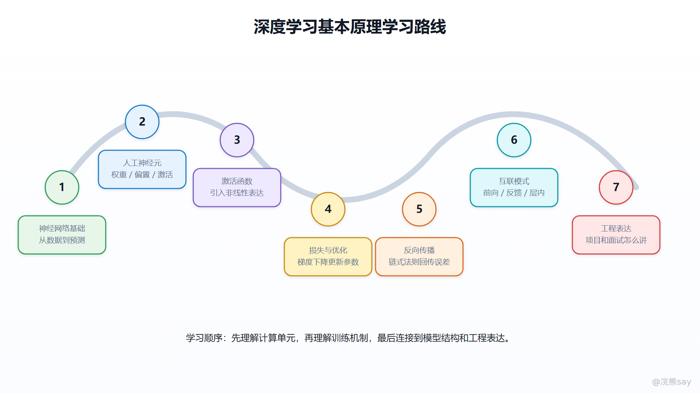
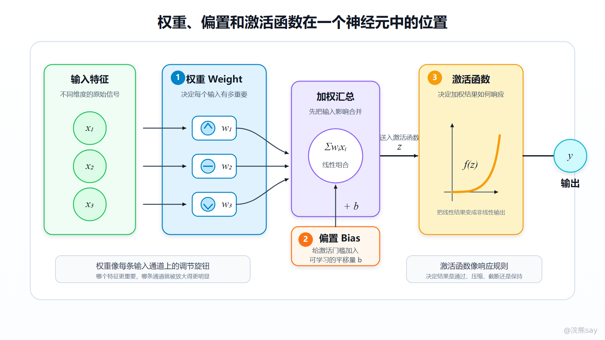
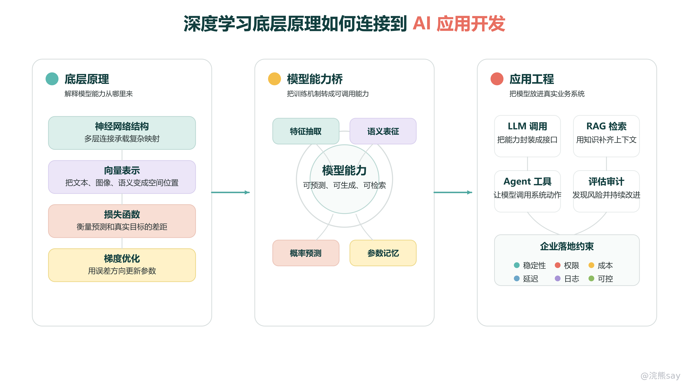

**00-深度学习基本原理学习路线**

深度学习（Deep Learning）是一类以多层神经网络为核心的机器学习方法。它的基本思想是：系统不再完全依赖人工编写规则，而是通过大量样本数据、损失函数和优化算法，让模型自动学习输入与输出之间的复杂映射关系。对于 AI 应用开发来说，深度学习不一定要求每个人都从零训练大模型，但必须理解神经网络为什么能学习、参数为什么能被更新、激活函数为什么重要，以及反向传播如何把误差传回每一层。

传统机器学习往往需要较强的特征工程，例如先由人工设计图像边缘、文本关键词或统计特征，再交给模型分类。深度学习的价值在于，它可以通过多层网络逐步提取更抽象的特征：浅层可能学习边缘、局部形状或词语片段，深层则逐渐组合出更复杂的语义结构。图像识别、语音识别、自然语言处理、推荐系统和大语言模型，都可以在这个框架下理解。

这一组文章不是为了把深度学习讲成数学推导课，而是为了建立 AI 应用开发需要的底层认知。后续学习 LLM、Embedding、RAG、Agent 或多模态模型时，很多概念最终都会回到神经网络、向量表示、损失函数、梯度更新和网络结构这些基础问题上。

## 

# **一、这一系列先学什么**

第一层是神经网络基础。需要先理解神经网络不是一个固定规则库，而是由大量人工神经元连接形成的可训练计算结构。每个神经元接收输入、做加权求和、经过激活函数，再把结果传递给下一层。

第二层是人工神经元模型。人工神经元把生物神经元的“输入信号、兴奋阈值、输出信号”抽象成数学形式，核心公式是 y = f(Σwixi + b)。其中权重决定输入的重要性，偏置调整激活门槛，激活函数决定输出模式。

第三层是激活函数。没有激活函数，多层网络本质上仍然接近线性变换，很难拟合复杂关系。Sigmoid、Tanh、ReLU 等函数的差异，会直接影响梯度传播、训练稳定性和模型表达能力。

第四层是损失函数和梯度下降。模型预测不准时，需要有一个函数衡量预测值和真实值之间的差距，这就是损失函数。梯度下降则根据损失函数的变化方向，不断调整权重和偏置，使损失逐步降低。

第五层是反向传播。深层网络有很多层、很多参数，如果逐个参数手工求导几乎不可行。反向传播利用链式法则，从输出层开始把误差逐层传回去，高效计算每个参数应该如何更新。

第六层是网络互联模式。前向网络、带反馈的网络、层内互连网络对应不同的信息流方式。理解这些结构，可以帮助后续理解 CNN、RNN、Transformer、SOM 等更复杂网络为什么会出现。

## 

# **二、和 AI 应用开发有什么关系**

AI 应用开发并不等于训练神经网络。实际项目中，很多同学更多是在调用大模型 API、接入向量数据库、搭建 RAG 系统、设计 Agent 工具调用链路。但如果完全不理解深度学习基础，就很容易把模型当成一个黑盒接口，只知道“调一下”，不知道为什么会出现幻觉、为什么上下文太长成本会变高、为什么 Embedding 能做语义检索，也不知道为什么模型微调需要样本、损失和优化。

从工程角度看，深度学习基础至少解决三个问题。

第一，理解模型能力的来源。模型不是凭空“理解”文本，而是通过训练数据和参数更新学到输入输出之间的统计规律。这个认知可以帮助你解释预训练、微调、Embedding 和生成机制。

第二，理解模型错误的来源。模型预测错误，本质上可能来自训练数据、网络结构、优化过程、输入分布变化或上下文信息不足。应用层遇到错误时，不能只说“模型不行”，而要能区分是数据问题、检索问题、Prompt 问题还是模型能力边界。

第三，理解工程取舍。更深的网络、更大的参数、更复杂的结构并不自动更好，它们通常伴随更高训练成本、更长推理延迟、更难调试和更强数据依赖。企业 AI 应用里，稳定、可控、可解释、可审计往往和模型效果同样重要。

images/deep\_learning\_to\_ai\_app\_bridge.png

这张图可以把“底层原理”和“应用开发”之间的关系放在一起看：神经网络、向量表示、损失优化解释的是模型能力从哪里来；LLM 调用、RAG、Agent、评估审计则是把这种能力放进企业系统时必须面对的工程约束。

## 

# **三、建议的学习顺序**

建议先按下面顺序阅读：

1.  01-神经网络是什么：从生物神经元到计算模型
2.  02-人工神经元、权重偏置与激活函数
3.  03-梯度下降：神经网络如何找到更好的参数
4.  04-反向传播：深度学习训练的核心算法
5.  05-神经网络互联模式：前向、反馈与层内互连

学完这一组之后，至少要能回答四类问题：神经网络如何从输入得到输出，训练时参数为什么会变化，激活函数为什么能引入非线性，反向传播为什么能高效训练多层网络。达到这个程度，再去理解 Transformer、Embedding、LLM 生成机制和 RAG 检索链路，就不会只停留在名词层面。

## 

# **四、准备优先级**

P0 是必须掌握的底层机制：人工神经元公式、激活函数作用、损失函数、梯度下降和反向传播。只要后续要学习 LLM、RAG 或 Agent，这部分就不能只背名词，至少要能用一段完整话解释“模型如何预测、如何计算误差、如何更新参数”。

P1 是需要能和项目表达连接的内容：神经网络为什么适合处理非线性任务、ReLU 为什么常用、学习率为什么影响训练稳定性、梯度消失为什么会影响深层网络。这些内容不一定要求手推公式，但要能在面试里解释背后的工程影响。

P2 是扩展理解内容：不同互联模式、SOM、反馈网络和更复杂网络结构之间的关系。这些内容用于帮助理解 CNN、RNN、Transformer 等后续模型，不需要在基础阶段展开到算法细节。

## 

# **五、最后的准备标准**

这一部分不要求背复杂公式推导，但要能把机制讲清楚。比较合格的表达是：神经网络通过多层神经元把输入映射为输出，每个神经元内部做加权求和并经过激活函数；训练时先通过正向传播得到预测结果和损失，再通过反向传播计算各层参数的梯度，最后用梯度下降更新权重和偏置，使模型在训练数据上的误差逐步降低。

如果能讲到这个层次，后面学习大模型时就能更自然地理解 Token 如何变成向量、模型为什么需要训练、参数为什么代表模型能力，以及 AI 应用系统为什么必须在模型外部增加检索、权限、日志、评估和人工复核等工程约束。
