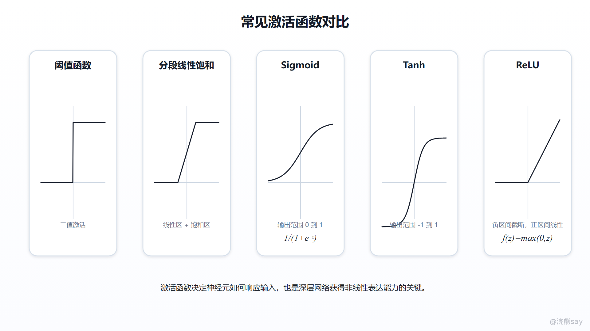

# 02-人工神经元、权重偏置与激活函数

**02-人工神经元、权重偏置与激活函数**

人工神经元（Artificial Neuron）是神经网络中最基础的可微计算单元。它的核心作用不是简单模拟生物神经元，而是把输入特征、可训练参数和非线性变换组织成一个可计算、可求导、可优化的函数模块。一个神经元接收输入向量 x，先通过权重 w 和偏置 b 做仿射变换，再经过激活函数 f 得到输出：

其中，z 通常称为线性组合结果或 pre-activation，a 通常称为激活值或 activation。权重决定不同输入特征对神经元的影响强弱，偏置决定整体激活门槛，激活函数决定线性结果如何转成非线性响应。神经网络之所以能够训练，本质上是因为这些计算可以串联成计算图，并通过损失函数对参数求梯度。

传统线性模型只能表示有限的线性关系，例如输入变化多少，输出按固定比例变化多少。现实任务中的图像边界、语义关系、用户偏好、异常模式往往不是线性结构。人工神经元通过“仿射变换 + 非线性激活”的组合，把原始输入映射到新的特征空间中，使多层网络具备逼近复杂函数的基础。

## 

# **一、人工神经元在计算上做了什么**

假设一个样本有 n 个输入特征：

对应的权重向量为：

单个神经元的线性部分可以写成：

这个公式可以拆成三层含义。第一，w\_i x\_i 表示第 i 个输入特征对当前神经元的贡献；第二，Σw\_i x\_i 表示把所有输入贡献合并成一个线性得分；第三，+ b 表示在整体得分上增加一个可学习的平移量。最后，激活函数 f(z) 决定这个得分如何变成神经元输出。

从计算图角度看，人工神经元不是孤立公式，而是一个局部计算节点。正向传播时，它接收上一层输出并计算当前输出；反向传播时，它接收损失函数传回来的梯度，并把梯度继续传给权重、偏置和上一层输入。也就是说，人工神经元既是前向特征变换单元，也是反向梯度传递单元。

## 

# **二、权重 Weight：控制输入特征的贡献**

权重（Weight）是神经网络中最主要的可训练参数。对于单个神经元来说，w\_i 控制输入特征 x\_i 对当前神经元的贡献方向和强度。如果 w\_i 的绝对值较大，说明该特征对当前神经元影响更明显；如果 w\_i 接近 0，说明该特征在当前神经元中几乎不起作用；如果 w\_i 为负，则该特征会对线性得分产生反向影响。

在训练过程中，权重不是人工手写出来的，而是通过梯度下降类优化算法学习出来的。假设损失函数为 L，学习率为 η，权重更新可以写成：

对于单个神经元的线性部分 z = Σw\_i x\_i + b，有：

因此，权重的梯度可以通过链式法则写成：

这个公式说明，权重更新同时受两个因素影响：一是当前神经元对最终损失的影响 ∂L/∂z，二是输入特征本身的取值 x\_i。如果某个特征在样本中经常出现，并且它对损失下降方向有稳定贡献，那么对应权重会在训练中逐渐被调整到更合适的位置。

从工程角度看，权重的规模和初始化非常重要。权重过大可能导致激活值过大、梯度不稳定；权重过小可能导致信号传播过弱。深层网络中常用 Xavier、He initialization 等初始化方法，本质上就是为了让前向信号和反向梯度在多层之间保持相对稳定。

## 

# **三、偏置 Bias：调整激活门槛和决策边界**

偏置（Bias）也是可训练参数，但它不依赖某一个输入特征，而是给整个神经元增加一个可学习的平移量。在线性部分中：

如果没有偏置，模型的线性决策边界通常会被限制为：

加入偏置后，决策边界变为：

这意味着模型不必强行经过坐标原点，可以在特征空间中移动决策边界。对于分类任务，偏置可以理解为调整类别判断的基础门槛；对于回归任务，偏置可以理解为模型在没有输入贡献时的基础输出水平。

偏置的梯度也可以直接从公式中看出来：

因此：

这说明偏置更新反映的是当前神经元整体输出方向是否需要上移或下移。权重更关注“不同输入特征怎么组合”，偏置更关注“整体激活基准放在哪里”。在实际模型中，如果没有偏置，网络仍然可以训练，但表达空间会更受限制，尤其是在数据分布明显不以原点为中心时。

## 

# **四、激活函数 Activation Function：引入非线性表达能力**

激活函数（Activation Function）决定神经元对线性组合结果 z 如何响应。没有激活函数时，多层网络只是多个线性变换叠加。例如两层线性网络可以写成：

展开后得到：

这仍然等价于一个新的线性变换。换句话说，如果没有非线性激活函数，网络即使堆很多层，本质上仍然可以压缩成一层线性模型，表达能力不会发生根本变化。

激活函数的价值就在于打破这种线性闭包。每一层经过非线性变换后，下一层处理的不再是原始线性结果，而是经过截断、压缩、筛选或平滑后的特征表示。多层非线性组合起来，才可以拟合图像边界、文本语义、推荐偏好这类复杂模式。

激活函数还会影响梯度传播。反向传播时，梯度会乘上激活函数的导数：

如果 f'(z) 长期接近 0，前面层的参数就很难获得有效梯度，训练会变慢甚至停滞。这也是 Sigmoid、Tanh 在深层网络中容易出现梯度消失，而 ReLU 及其变体更常用于隐藏层的重要原因。

## 

# **五、常见激活函数怎么理解**

常见激活函数可以从三个角度理解：输出范围、梯度性质、适用位置。
| 激活函数 | 数学形式 | 输出范围 | 主要特点 | 常见位置 |
| --- | --- | --- | --- | --- |
| Step | f(z)=1(z>=0) | {0,1} | 不连续，不能稳定用于梯度优化 | 早期模型理解 |
| Sigmoid | σ(z)=1/(1+e^{-z}) | (0,1) | 可解释为概率，但两端容易饱和 | 二分类输出层 |
| Tanh | tanh(z) | (-1,1) | 零中心化，但仍有饱和区 | 早期循环网络/隐藏层 |
| ReLU | max(0,z) | [0,+∞) | 正区间梯度稳定，计算简单 | 深层网络隐藏层 |
| GELU | zΦ(z) | 近似无界 | 平滑门控，常见于 Transformer | 大模型前馈网络 |
| Softmax | e^{z_i}/Σe^{z_j} | 概率分布 | 多类别归一化 | 多分类输出层 |

Sigmoid 函数的导数为：

当 z 很大或很小时，σ(z) 会接近 1 或 0，此时导数接近 0，梯度容易变弱。Tanh 也有类似问题，只是输出范围从 (0,1) 改为 (-1,1)，比 Sigmoid 更接近零中心化。

ReLU 的形式非常简单：

它的导数可以近似理解为：

ReLU 在正区间梯度稳定，计算成本低，因此在卷积网络、前馈网络中非常常见。但它也有问题：如果某些神经元长期落在负区间，输出和梯度都可能为 0，形成“死亡 ReLU”。Leaky ReLU、PReLU、ELU 等变体就是为了解决负区间完全不传梯度的问题。

Softmax 严格来说更常作为输出层归一化函数，而不是隐藏层激活函数。对于多分类任务，模型会先输出每个类别的 logit，再通过 Softmax 转成概率分布：

在工程实现中，Softmax 通常和交叉熵损失结合使用。很多框架会把 Softmax + CrossEntropy 合并成数值更稳定的实现，因此写代码时不一定要手动先做 Softmax 再算交叉熵。

## 

# **六、从单个神经元到一层网络**

实际神经网络不会逐个神经元手动计算，而是把一层神经元组织成矩阵运算。假设第 l 层输入为 a^{\[l-1\]}，权重矩阵为 W^{\[l\]}，偏置向量为 b^{\[l\]}，则这一层的计算为：

如果上一层有 m 个神经元，当前层有 k 个神经元，则：

对于批量训练，多个样本通常会组成矩阵 X，一层网络的计算会变成批量矩阵乘法。深度学习框架和 GPU 擅长的正是这种张量运算，这也是神经网络工程实现中反复看到 matmul、linear、activation、batch 等概念的原因。

这一张图强调的是工程实现视角：单个神经元公式可以帮助理解概念，但真正训练时通常不是逐个神经元循环计算，而是把一批样本、整层权重和偏置组织成矩阵运算，再统一经过激活函数进入下一层。

从参数数量看，全连接层的参数量为：

其中，k × m 来自权重矩阵，k 来自偏置向量。这个公式在估算模型规模、显存占用和推理成本时很有用。比如输入维度为 768、输出维度为 3072 的全连接层，仅这一层就有 768 × 3072 + 3072 个参数。

## 

# **七、训练视角：三者分别怎么影响优化**

从训练角度看，权重、偏置和激活函数承担的职责不同。

权重和偏置是直接被优化器更新的参数。训练时，模型先正向传播得到预测值，再根据损失函数计算误差，随后通过反向传播计算梯度，最后更新参数：

激活函数通常没有可训练参数，但它会决定梯度怎么通过当前层。如果激活函数进入饱和区，梯度会变小；如果激活函数输出范围不适合任务，模型训练会变慢或输出分布异常；如果激活函数和初始化方法不匹配，深层网络可能出现梯度爆炸、梯度消失或大量神经元失活。

这也是为什么调模型时不能只看学习率和数据。训练很慢、loss 不下降、输出集中在某个区间、梯度范数异常时，都要检查：权重初始化是否合理，偏置是否导致激活分布偏移，激活函数是否饱和，输出层激活是否和损失函数匹配。

## 

# **八、工程使用边界**

激活函数不是孤立选择的组件，而是要和层位置、任务目标、损失函数和数值稳定性一起看。隐藏层更关注特征表达和梯度传播，常见选择是 ReLU、GELU、SiLU 或它们的变体；输出层更关注任务含义，二分类常用 Sigmoid，多分类常用 Softmax，回归任务通常不使用压缩到固定概率区间的激活函数。

在企业 AI 应用或工程项目中，如果模型只是作为业务系统的一部分，还要关注部署成本。ReLU 计算简单，推理开销低；GELU 更平滑，但计算成本略高；Softmax 在类别很多时可能带来额外开销。对于大模型而言，激活函数还会影响前馈网络表达能力和训练稳定性，例如 Transformer 中常见的 GELU、SwiGLU，本质上也是在非线性变换和梯度传播之间做取舍。

还有一个常见误区是把权重解释成“人工设定的重要性”。在神经网络里，权重是训练得到的参数，不是开发者手工赋值的规则。如果开发者手动规定某个输入更重要，那更像规则系统或特征工程；如果模型通过数据和损失函数自动调整参数，才是神经网络训练的语境。

## 

# **九、面试表达模板**

面试里解释这三个概念时，可以这样说：

人工神经元可以理解成一个可微计算单元。它会先对输入特征做线性组合，也就是 z = w^T x + b，其中权重 w 决定不同输入特征的贡献，偏置 b 调整整体激活门槛。随后神经元会把 z 输入激活函数，得到输出 a = f(z)。激活函数的作用是引入非线性，否则多层线性变换仍然可以合并成一层线性模型，网络表达能力不会真正增强。训练时，权重和偏置会根据损失函数的梯度被优化器更新，而激活函数虽然通常没有参数，但会影响梯度传播和训练稳定性。

这个回答比只说“权重表示重要性、偏置表示门槛、激活函数增加非线性”更完整，因为它同时讲到了公式、参数训练、梯度传播和工程选择。

## 

# **十、常见追问**

1.  权重和偏置有什么区别？

权重控制不同输入特征如何参与线性组合，偏置控制整体激活基准。公式上，权重和输入相乘，决定特征贡献；偏置直接加到线性结果上，决定整体平移。权重更多影响方向和组合方式，偏置更多影响决策边界的位置。

1.  为什么多层网络必须有激活函数？

因为多层线性变换叠加后仍然等价于一个线性变换。例如 W2(W1x+b1)+b2 可以整理成新的 Wx+b。只有加入非线性激活函数，层与层之间的变换才不能简单合并，网络才具备表达复杂非线性关系的能力。

1.  ReLU 为什么比 Sigmoid 更常用于隐藏层？

Sigmoid 在输入很大或很小时容易进入饱和区，导数接近 0，深层网络训练时容易出现梯度消失。ReLU 在正区间导数接近 1，梯度传播更稳定，计算也更简单，所以更常用于隐藏层。但 ReLU 也可能出现负区间长期输出 0 的“死亡 ReLU”，因此实际模型中也会使用 Leaky ReLU、GELU、SiLU 等变体。

1.  输出层激活函数怎么选？

输出层要和任务目标、标签形式、损失函数匹配。二分类通常使用 Sigmoid 或直接使用带 logits 的二分类交叉熵；多分类通常使用 Softmax 或框架内置的交叉熵实现；回归任务通常输出连续值，不使用 Sigmoid、Softmax 这类概率压缩函数。

1.  激活函数会不会被训练？

大多数常见激活函数本身没有可训练参数，例如 ReLU、Sigmoid、Tanh、GELU。训练主要更新权重和偏置。但也有一些带参数的激活函数或门控结构，例如 PReLU、SwiGLU 中的门控投影。即使激活函数本身没有参数，它也会通过导数影响梯度传播，因此会直接影响训练效果。
