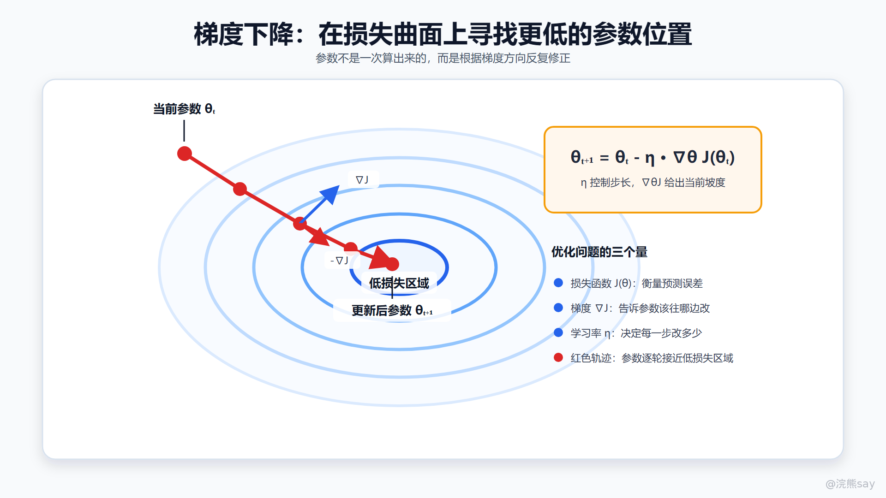
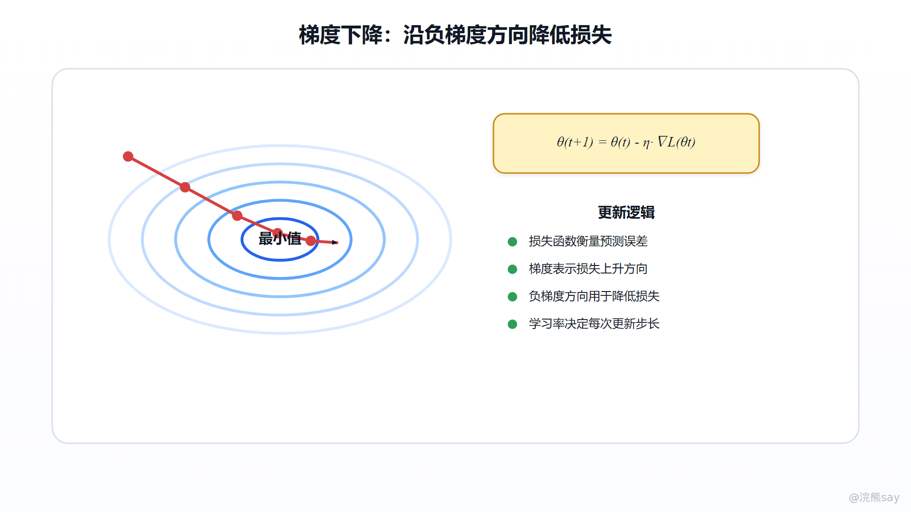
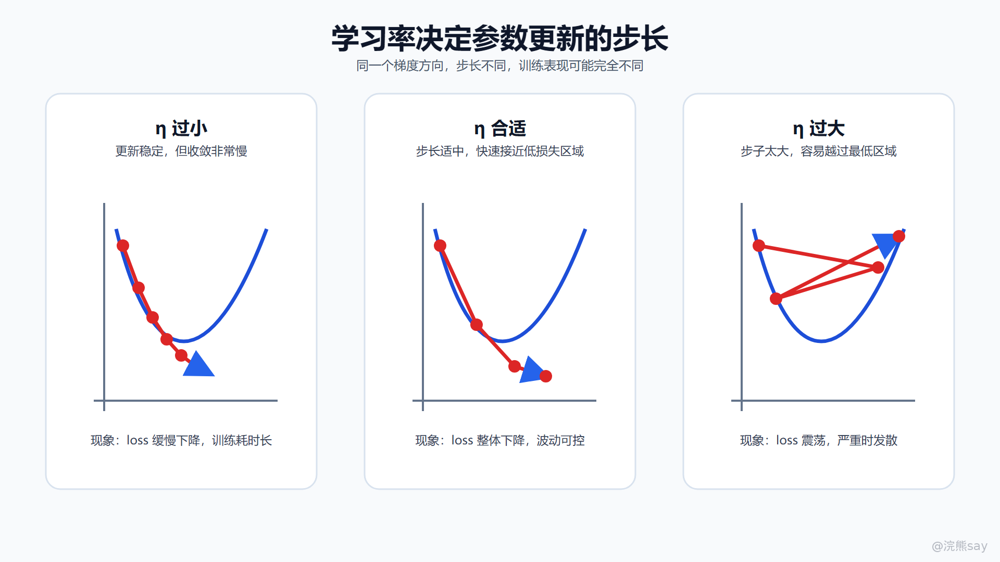
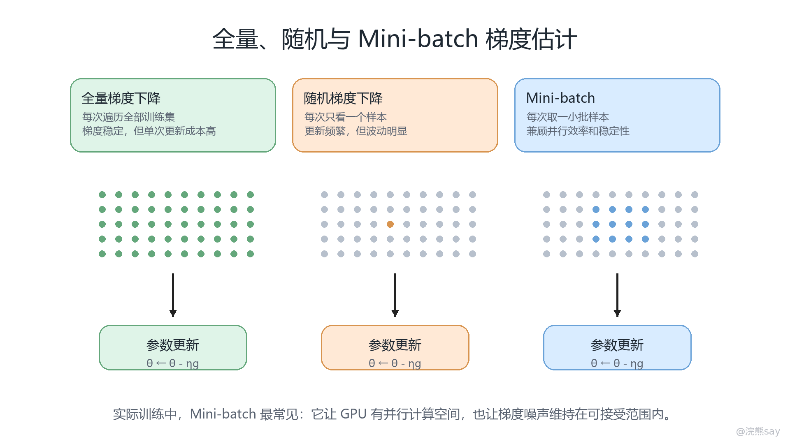
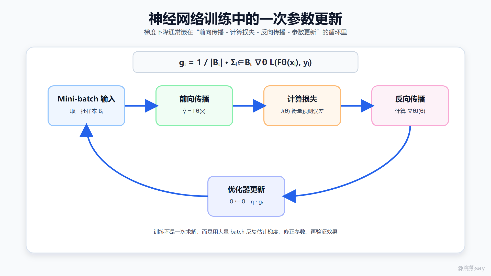

# 03-梯度下降：神经网络如何找到更好的参数

**03-梯度下降：神经网络如何找到更好的参数**

# 

梯度下降（Gradient Descent）解决的是神经网络训练中的核心优化问题：当模型当前预测不够好时，应该如何调整权重和偏置，才能让损失函数变小。

上一节已经把人工神经元写成了一个可计算函数：

如果网络中只有一两个参数，我们还可以画图观察参数如何影响输出。但真实神经网络通常包含成千上万甚至数十亿个参数，训练不可能靠人工试错完成。梯度下降的意义就在这里：它把“参数怎么改”转化为一个可求导、可迭代、可工程实现的数学过程。

更准确地说，梯度下降不是在“模拟大脑思考”，而是在求解一个优化问题：

其中， 表示网络中所有可训练参数， 表示模型在训练数据上的损失函数。训练的目标，就是找到一组参数，使这个损失尽可能小。

## 

# **一、先把训练写成优化问题**

假设训练集为：

神经网络可以看成一个带参数的函数：

这里的 包含了所有线性变换、激活函数、层与层之间的连接关系。训练时，我们需要用损失函数衡量预测值 和真实标签 的差距。整体目标函数通常写成：

其中，L 是单个样本的损失函数，J 是整个训练集上的平均损失。

不同任务对应不同损失函数。回归任务常用均方误差：

多分类任务常用交叉熵：

这一步很关键。损失函数不是训练日志里随便打印的一个数，而是模型优化方向的来源。如果损失函数和任务目标不一致，后面梯度算得再准确，也是在沿着错误的目标优化。

比如做分类模型时，损失函数要推动正确类别概率升高；做相似度模型时，损失函数要推动正样本距离更近、负样本距离更远；做排序模型时，损失函数要体现排序顺序或相关性分数。如果目标函数没有定义清楚，模型训练就没有明确的反馈信号。

## 

# **二、梯度到底表示什么**

对单个参数 \\theta\_j 来说，偏导数表示这个参数发生微小变化时，损失函数会如何变化：

如果这个值为正，说明 \\theta\_j 增大时，损失倾向于增大；如果这个值为负，说明 \\theta\_j 增大时，损失倾向于减小。

神经网络有很多参数，所以要把所有参数的偏导数组成一个向量：

这个向量就是梯度。梯度的方向，是损失函数在当前位置上升最快的方向。既然训练目标是降低损失，就要沿梯度的反方向更新参数：

这里有三个核心量：

-   ：第 t 轮迭代时的参数；
-   ：当前参数位置的梯度；
-   ：学习率，决定每次更新走多远。

这张图适合配合更新公式一起看：当前位置先计算梯度方向，再沿负梯度方向走一步；如果步长合适，损失会逐步下降。后面的学习率、mini-batch 和优化器，本质上都是在调整这一步“怎么走得更稳”。

为什么负梯度方向能让损失下降？可以用一阶泰勒展开解释：

如果令：

代入可得：

当 且步长不过大时，右侧会比原来的 更小。这就是梯度下降的数学直觉：在局部近似成立的范围内，负梯度方向能带来最快的局部下降。

## 

# **三、权重和偏置具体怎么更新**

对一个神经元来说，参数主要是权重 w 和偏置 b。如果损失函数为 J，标准梯度下降更新可以写成：

如果是多层神经网络，每一层都有自己的权重矩阵和偏置向量。第 l 层通常写成：

更新时对应为：

这些偏导数不是手工逐个推出来的，而是通过反向传播（Backpropagation）自动计算。前向传播负责得到预测结果和损失，反向传播负责把损失对输出层的影响，沿计算图一层层传回去，得到每个参数对损失的贡献。

所以，梯度下降和反向传播不是一回事：

-   反向传播解决“梯度怎么计算”；

-   梯度下降解决“拿到梯度以后参数怎么更新”。

实际训练框架里，loss.backward() 做的是梯度计算，optimizer.step() 做的是参数更新。

## 

# **四、学习率决定每一步改多少**

学习率 是梯度下降里最敏感的超参数之一。它不改变梯度方向，但会改变每次参数更新的步长。

学习率过小，参数每次只移动一点，损失会下降得很慢，训练成本变高。学习率过大，参数可能越过低损失区域，在两侧来回震荡，严重时损失会直接发散。从公式上看：

同一个梯度 ，如果 变大，参数更新幅度也会等比例变大。但神经网络损失曲面通常不是规则的碗形，而是高维、非凸、局部曲率变化很大的曲面。一个在当前位置合适的步长，换到另一个区域可能就过大。

工程里常见的学习率策略包括：

-   固定学习率：简单，但对复杂训练不够灵活；
-   学习率衰减：训练前期走快一点，后期逐渐减小步长；
-   warmup：训练初期先用较小学习率，避免参数刚开始就被大梯度冲坏；
-   自适应优化器：如 Adam，根据梯度的一阶矩和二阶矩动态调整更新幅度。

所以学习率不是一个“调大训练更快”的按钮，而是训练稳定性和收敛速度之间的平衡。

## 

# **五、为什么真实训练常用 Mini-batch**

最朴素的批量梯度下降，会在每次更新前遍历全部训练数据：

这种方式梯度估计稳定，但当训练集很大时，每更新一次参数都要计算全量数据，成本太高。

随机梯度下降（Stochastic Gradient Descent, SGD）每次只用一个样本估计梯度：

它更新频率高，但梯度噪声也大，损失曲线会明显波动。

实际深度学习训练中更常见的是 Mini-batch Gradient Descent：每次取一小批样本 B\_t，用这一批样本的平均梯度更新参数：

Mini-batch 是效率和稳定性的折中。它既能利用 GPU 并行计算，又不会像单样本 SGD 那样过于抖动。训练日志中 loss “整体下降但局部上下波动”，很大一部分原因就是 mini-batch 采样带来的梯度噪声。

## 

# **六、把梯度下降放回训练循环里**

在神经网络训练中，一次参数更新通常包含五个步骤：

第一步，取一个 mini-batch。训练框架从数据加载器中取出一批样本，形成输入 x 和标签 y。

第二步，前向传播。模型用当前参数 \\theta\_t 计算预测值：

第三步，计算损失。损失函数把预测误差压缩成一个标量：

第四步，反向传播。框架沿计算图计算每个参数的梯度：

第五步，优化器更新参数：

这五步不断重复，模型才会从随机初始化参数，逐渐变成一个能完成任务的函数。对 AI 应用开发来说，即使你不从零训练大模型，也要理解这个闭环。微调分类模型、训练 embedding 模型、做检索 reranker、训练视觉检测模型，本质上都在重复类似的优化流程。

## 

# **七、梯度下降在工程里看什么指标**

训练不是只看一条 loss 曲线。真实项目里至少要同时观察以下几类信号。

第一，看训练损失是否下降。训练 loss 如果长期不下降，可能是学习率不合适、数据标签有问题、模型结构不对、损失函数不匹配，或者梯度没有正确回传。

第二，看验证集指标是否同步改善。如果训练 loss 下降，但验证集准确率、召回率、AUC、NDCG 等指标不升反降，可能发生过拟合。此时继续优化训练损失并不一定有意义。

第三，看梯度范数是否异常。梯度范数过大，可能出现梯度爆炸；梯度范数接近 0，可能出现梯度消失，或者模型已经进入非常平坦的区域。

第四，看参数更新是否稳定。可以监控学习率、梯度均值、梯度方差、权重分布、loss 的局部波动。如果训练偶尔突然爆炸，往往不是“模型突然变笨”，而是某个 batch、学习率、数值精度或数据异常触发了不稳定更新。

第五，看业务指标是否真正改善。训练集损失降低，只说明模型更拟合训练数据；企业项目最终还要看线上点击率、检索命中率、人工审核通过率、召回质量、响应稳定性等指标。

## 

# **八、常见失效模式**

1.  **学习率过大导致震荡或发散**

表现为 loss 大幅波动，甚至出现 nan。原因通常是参数更新步长超过了局部近似能承受的范围。解决方式包括降低学习率、使用 warmup、梯度裁剪、检查异常样本和数值精度。

1.  **学习率过小导致收敛很慢**

表现为 loss 长期缓慢下降，训练时间很长。可以适当提高学习率，或使用学习率调度策略，让前期训练速度更快。

1.  **梯度消失**

在深层网络中，梯度沿层级反向传播时可能越来越小，前面层几乎得不到有效更新。Sigmoid、Tanh 在饱和区间尤其容易出现这个问题。ReLU、残差连接、归一化层和合理初始化，都可以缓解梯度消失。

1.  **梯度爆炸**

梯度在反向传播中不断放大，导致参数更新过猛。循环神经网络、很深的网络或不稳定初始化中更常见。常用处理方法是梯度裁剪：

其中 c 是预设阈值。

1.  **损失函数和任务目标不一致**

这是 AI 应用开发里很容易忽略的问题。比如业务真正关心 Top-K 召回效果，但训练只优化简单分类损失；业务关心排序顺序，但训练目标没有体现样本之间的相对关系。此时即使训练 loss 很漂亮，也可能无法带来业务收益。

## 

# **九、面试表达模板**

面试里解释梯度下降，可以按“目标函数、梯度、更新公式、训练循环、工程风险”这条线讲：

梯度下降是一种一阶优化方法，用来最小化模型的损失函数。神经网络训练时，先通过前向传播得到预测结果，再用损失函数衡量预测值和真实标签的差距。随后反向传播会计算损失函数对各层权重和偏置的梯度。因为梯度方向表示损失上升最快的方向，所以参数会沿负梯度方向更新，公式是 。其中学习率控制每次更新步长。实际训练通常使用 mini-batch 估计梯度，并结合学习率调度、Momentum、Adam、梯度裁剪和验证集指标来保证训练稳定和泛化效果。

## 

# **十、常见追问**

1.  **梯度下降一定能找到全局最优吗？**

不一定。深度神经网络的损失函数通常是高维非凸函数，可能存在局部最优、鞍点和平坦区域。实际训练更关注能否找到泛化表现足够好的参数，而不是严格证明找到全局最优。

1.  **梯度下降和反向传播有什么区别？**

反向传播是计算梯度的方法，梯度下降是利用梯度更新参数的方法。前者解决“梯度从哪里来”，后者解决“参数怎么改”。

1.  **为什么不用全量数据每次都算一个最准确的梯度？**

全量梯度稳定，但计算成本高。大规模训练中，每次更新都遍历全部数据会非常慢。Mini-batch 用一小批样本估计梯度，既能利用并行计算，又能保持较高更新频率，是工程上的主流折中。

1.  **Loss 下降就代表模型一定更好吗？**

不一定。训练 loss 下降只说明模型更适合训练数据。如果验证集或线上指标变差，可能是过拟合、数据分布不一致，或者损失函数与业务目标不一致。

1.  **学习率怎么判断是否合适？**

如果 loss 长期不下降，可能学习率太小，也可能模型、数据或损失函数有问题；如果 loss 大幅震荡甚至发散，学习率往往过大。实际项目里通常结合训练曲线、验证指标、梯度范数和学习率调度策略一起判断。
