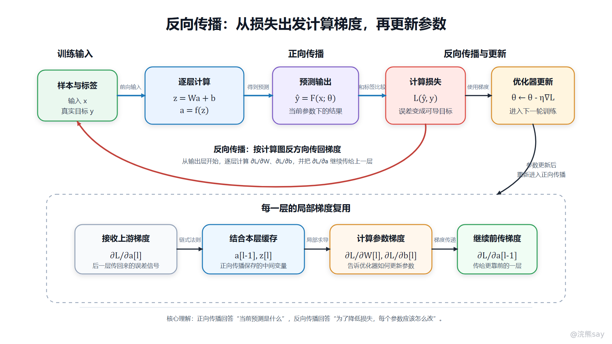
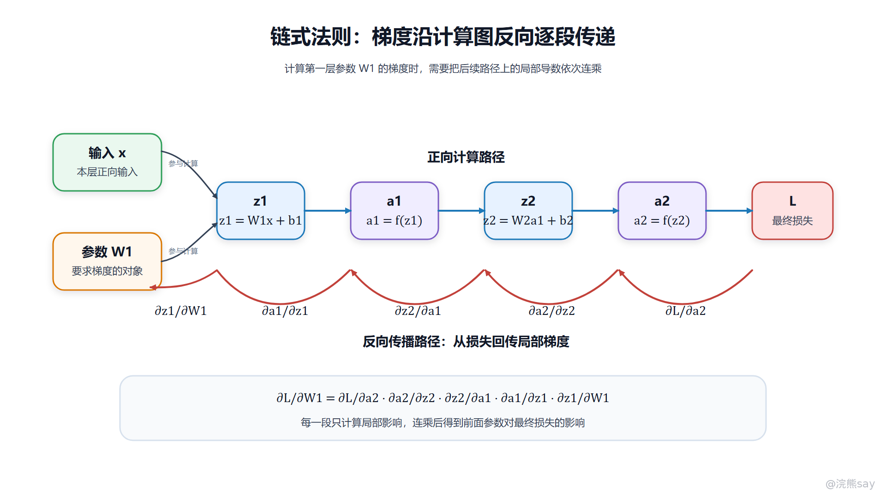

# 04-反向传播：深度学习训练的核心算法

**04-反向传播：深度学习训练的核心算法**

反向传播（Backpropagation）是神经网络训练中用于高效计算参数梯度的核心算法。它的基本思想是：先通过正向传播得到预测结果和损失，再从损失函数出发，按照计算图的依赖关系和链式法则，把梯度从输出层逐层传回前面的每一层，最终得到损失函数对权重和偏置的梯度。

如果只看神经网络的预测过程，模型只是把输入数据经过一层层线性变换和激活函数，最后输出预测值。但训练不是只“算出答案”，还要回答另一个问题：当前预测错了以后，网络里成千上万个参数分别应该承担多少误差、应该往哪个方向调整。反向传播解决的正是这个问题。

深层网络之所以需要反向传播，是因为它本质上是一个很大的复合函数。前一层的输出会影响后一层，后一层又会继续影响最终损失。直接对每个参数单独重新计算影响，成本会非常高；反向传播则把复杂求导拆成一组局部梯度，并在反向过程中复用正向传播保存的中间结果，使深层网络训练变得可行。

这张图可以把一次训练迭代理解成一个闭环：正向传播负责从输入计算预测值和损失，反向传播负责从损失计算各层梯度，优化器再根据梯度更新参数。更新后的参数会进入下一批样本或下一轮训练，模型能力就是在这个循环中逐步形成的。

## 

# **一、为什么深层网络不能只靠正向传播**

正向传播（Forward Propagation）负责把输入数据从网络前端送到输出端。以第 l 层为例，常见计算可以写成：
| Plain Textz[l] = W[l]a[l-1] + b[l]a[l] = f(z[l]) |
| --- |

其中，W\[l\] 是第 l 层权重，b\[l\] 是偏置，a\[l-1\] 是上一层输出，z\[l\] 是线性组合结果，a\[l\] 是经过激活函数后的输出。输出层得到预测值 ŷ 后，再用损失函数 L(ŷ, y) 衡量预测值和真实标签 y 之间的差距。

这个过程只能告诉我们“当前模型预测得怎么样”，不能直接告诉我们“每个参数应该怎么改”。如果损失很大，说明模型有问题，但问题可能来自输出层权重，也可能来自前面隐藏层的特征提取方式，还可能来自激活函数进入饱和区、初始化不合理或学习率设置不当。训练必须进一步计算损失对每个参数的影响，这就是梯度。

从计算图角度看，神经网络中的每一次加法、乘法、矩阵运算和激活函数都可以看成一个节点。正向传播沿着计算图从输入走到损失，反向传播则沿着同一张图从损失往回走，计算每个节点对最终损失的影响。没有反向传播，深层网络虽然可以做预测，但无法高效学习。

## 

# **二、链式法则为什么是反向传播的基础**

链式法则（Chain Rule）用于计算复合函数的导数。神经网络是一层套一层的复合函数，因此前面某个参数对最终损失的影响，必须通过后续层的计算关系传递回来。

可以用一个简化关系理解：
| Plain Textx -> z1 -> a1 -> z2 -> a2 -> L |
| --- |

如果要计算 L 对第一层参数 W1 的梯度，不能只看 W1 和 z1 的关系，还要继续考虑 z1 如何影响 a1、a1 如何影响 z2、z2 如何影响 a2、a2 又如何影响最终损失。链式法则把这条路径上的局部影响连起来：
| Plain Text∂L/∂W1 = ∂L/∂a2 · ∂a2/∂z2 · ∂z2/∂a1 · ∂a1/∂z1 · ∂z1/∂W1 |
| --- |

这张图把链式法则放回计算图里看：正向路径上每一段计算都会留下局部关系，反向传播时梯度沿相反方向逐段回传。越靠前的参数，对损失的影响越需要通过后续多个局部导数组合起来。

这也是“反向传播”这个名字的来源。它不是把输出值反着算一遍，而是把损失对后面节点的梯度逐层传给前面的节点。每一层只需要知道两件事：上一层正向传播时给了我什么输入，后一层反向传播时传回了什么梯度。把这两部分结合起来，就能算出当前层参数的梯度，并继续把梯度传给更前面的层。

## 

# **三、一次训练迭代的完整流程**

一次完整训练迭代通常包含四个环节。

第一步是正向传播。模型读取一批样本，把输入依次送过各层网络，得到预测值。这个过程中框架会保存必要的中间变量，例如每层输入、线性组合结果、激活输出和部分算子状态。保存这些值不是为了展示过程，而是为了后续计算梯度。

第二步是计算损失。预测值和真实标签进入损失函数，得到一个标量损失。分类任务可能使用交叉熵，回归任务可能使用均方误差，向量检索模型可能使用对比损失或排序损失。损失函数把“预测好不好”转成一个可以优化的数值目标。

第三步是反向传播。系统从损失函数开始，按照计算图的反方向逐层计算梯度。输出层离损失最近，因此通常先得到输出层相关参数的梯度；随后梯度继续传到隐藏层，直到所有需要训练的权重和偏置都得到对应梯度。

第四步是参数更新。优化器读取梯度，根据学习率和更新规则调整参数。最基础的梯度下降形式可以写成：
| Plain Textθ(t+1) = θ(t) - η · ∇θ L |
| --- |

其中，θ 表示模型参数，η 表示学习率，∇θ L 表示损失函数对参数的梯度。更新完成后，模型会用新参数处理下一批样本，进入下一次正向传播。

## 

# **四、反向传播到底在每一层算什么**

反向传播的核心不是记公式，而是理解每一层都在做三件事：接收上游梯度、计算本层参数梯度、继续向前传递梯度。

以上一层输入为 a\[l-1\]、当前层线性结果为 z\[l\]、当前层输出为 a\[l\] 为例，正向传播时这一层完成：
| Plain Textz[l] = W[l]a[l-1] + b[l]a[l] = f(z[l]) |
| --- |

反向传播时，后一层会传回 ∂L/∂a\[l\]，也就是损失对当前层输出的梯度。当前层需要先通过激活函数导数得到 ∂L/∂z\[l\]，再进一步计算：
| Plain Text∂L/∂W[l]∂L/∂b[l]∂L/∂a[l-1] |
| --- |

前两个结果用于更新当前层权重和偏置，第三个结果继续传给上一层。这样一层一层往前推，整个网络的参数都会得到梯度。

从工程实现上看，PyTorch、TensorFlow 这类框架会自动构建计算图，并在调用 backward() 时完成梯度计算。开发者通常不需要手写每一层的偏导，但必须理解梯度从哪里来、为什么需要缓存中间变量、哪些操作会阻断梯度，否则训练异常时很难定位问题。

## 

# **五、为什么要保存中间变量**

反向传播依赖正向传播中的中间结果。比如计算激活函数的梯度时，通常需要知道当时的 z 或 a；计算权重梯度时，需要知道该层正向传播时接收的输入 a\[l-1\]。如果这些中间变量没有保存，反向传播就只能重新计算，成本会明显增加。

这也是深度学习训练比纯推理更耗显存的重要原因之一。推理阶段只需要把输入算到输出，很多中间状态用完即可释放；训练阶段还要为反向传播保留必要信息，因此显存占用通常更高。大模型训练中的梯度检查点（Gradient Checkpointing）就是围绕这个问题设计的：它有意不保存部分中间激活，反向传播时再重新计算，用更多计算换更少显存。

因此，反向传播不是一个抽象数学概念，它直接影响工程资源。批大小、序列长度、模型层数、激活函数、混合精度和检查点策略，都会影响训练时的显存和速度。

## 

# **六、反向传播和梯度下降是什么关系**

反向传播和梯度下降经常被放在一起说，但它们不是同一件事。

反向传播负责计算梯度，回答的是“损失对每个参数的偏导是多少”。梯度下降或 Adam、SGD、Momentum 等优化器负责使用梯度更新参数，回答的是“拿到这些梯度以后，参数具体怎么改”。如果没有反向传播，优化器不知道每个参数的更新方向；如果没有优化器，反向传播算出的梯度也不会真正改变模型。

可以把训练链路拆成一句话：正向传播产生预测，损失函数产生误差信号，反向传播计算梯度，优化器根据梯度更新参数。理解这四个角色，比单独背“反向传播是从后往前计算”更有价值。

## 

# **七、深层网络训练为什么会出现梯度问题**

反向传播虽然高效，但不代表深层网络一定容易训练。梯度在多层网络中不断相乘，可能出现梯度消失或梯度爆炸。

梯度消失（Vanishing Gradient）指的是梯度向前层传播时越来越小，导致靠近输入端的层几乎得不到有效更新。Sigmoid、Tanh 这类激活函数在饱和区导数接近 0，多层连乘后会让梯度迅速衰减。前面层学不动，网络就很难学到有效底层特征。

梯度爆炸（Exploding Gradient）则相反，梯度在传播中变得非常大，导致参数更新幅度过大，训练出现震荡、loss 变成 NaN，甚至模型完全发散。循环神经网络和很深的前馈网络中都可能遇到这种问题。

很多常见结构和训练技巧，本质上都和稳定梯度有关。ReLU 在正区间导数稳定，因此比 Sigmoid 更适合深层隐藏层；残差连接让梯度有更短的传递路径；Layer Normalization 和 Batch Normalization 可以稳定中间表示分布；合适的初始化方法可以避免前向信号和反向梯度在层间快速放大或衰减；梯度裁剪可以限制异常梯度对参数更新的冲击。

后续理解 Transformer 时，这些思想仍然存在。Transformer 不只是注意力机制，它内部的残差连接、层归一化、前馈网络和激活函数，都和深层网络训练稳定性密切相关。

## 

# **八、工程调试时应该看什么**

在真实项目中，不能把所有训练问题都概括为“反向传播有问题”。更准确的排查方式是看训练链路中的具体信号。

如果 loss 一直不下降，可能是学习率太小、标签错误、模型容量不足、输入没有归一化，也可能是梯度没有正常传到某些参数。此时要检查参数是否参与计算图、requires\_grad 是否开启、梯度范数是否接近 0、损失函数和输出层是否匹配。

如果 loss 剧烈震荡或变成 NaN，可能是学习率过大、梯度爆炸、输入数据异常、数值精度溢出，或者某些操作产生了非法值。此时要看梯度范数、参数范数、激活值范围、混合精度设置和数据分布。

如果训练集效果变好但验证集效果变差，反向传播本身通常没有错，问题更可能是过拟合。此时要考虑数据增强、正则化、早停、模型规模控制和验证集分布，而不是盲目修改梯度计算。

对于 AI 应用开发来说，即使多数场景不需要从零训练大模型，也要理解这些排查逻辑。微调分类模型、训练 Embedding 模型、做重排模型或调视觉模型时，训练异常最终都会回到数据、损失、梯度、优化器和泛化能力这几类问题上。

## 

# **九、反向传播在大模型时代还有什么价值**

很多人学习大模型应用时容易觉得，既然平时主要调用 API、做 RAG、写 Agent，好像不用理解反向传播。这个判断并不准确。应用开发不一定要求手写反向传播公式，但理解它能帮助判断模型能力边界。

第一，反向传播解释了模型能力从哪里来。预训练、监督微调、奖励模型训练、Embedding 模型训练，本质上都依赖“定义目标、计算损失、回传梯度、更新参数”的机制。模型不是通过规则手写能力，而是通过大量训练迭代让参数逐步形成可用表示。

第二，反向传播能帮助理解为什么数据质量重要。训练目标只会沿着损失函数给出的方向优化，如果标签噪声大、样本分布偏、负样本构造差，梯度方向就可能不稳定，模型会学到错误模式。

第三，反向传播能帮助理解为什么微调不是万能的。微调会改变模型参数，如果数据规模太小、学习率不合适或任务边界不清晰，可能出现过拟合、灾难性遗忘或输出风格漂移。很多企业场景更适合先用 RAG、提示词、工具调用和权限控制解决问题，而不是一上来就微调。

总体来看，反向传播是理解“模型如何学习”的底层入口。学 AI 应用开发不需要把每个偏导都手推到极致，但至少要能说清训练闭环、梯度来源、优化器作用和常见失败模式。

## 

# **十、面试表达模板**

面试里解释反向传播，可以这样说：

反向传播是神经网络训练中用于计算梯度的核心算法。一次训练会先做正向传播，输入经过各层线性变换和激活函数得到预测值，再通过损失函数计算预测值和真实标签之间的差距。随后系统从损失函数出发，按照计算图的反方向，利用链式法则逐层计算损失对权重和偏置的梯度。得到梯度后，优化器会根据学习率更新参数。反向传播的价值在于，它把深层复合函数的求导拆成局部梯度的传递和复用，使大量参数能够被高效训练。

如果面试官继续追问工程理解，可以补充：

在框架实现中，正向传播会保存必要的中间变量，反向传播时再用这些变量计算梯度。训练不稳定时，需要看梯度是否消失或爆炸、loss 是否异常、学习率是否合适、输出层和损失函数是否匹配，以及参数是否正确参与计算图。这样回答能体现自己不是只背概念，而是知道反向传播在训练调试中的位置。

## 

# **十一、常见追问**

1.  **反向传播和梯度下降有什么区别？**

反向传播负责计算梯度，梯度下降负责根据梯度更新参数。前者回答“每个参数对损失的影响是多少”，后者回答“参数应该按什么规则调整”。实际训练中通常是反向传播先得到梯度，优化器再使用梯度更新权重和偏置。

1.  **为什么反向传播需要链式法则？**

因为神经网络是多层复合函数，前面层参数会通过后续层间接影响最终损失。链式法则可以把这种间接影响拆成多个局部导数的乘积，使系统能够从输出层开始逐层计算前面层的梯度。

1.  **为什么训练时显存比推理时更高？**

训练阶段不仅要做正向计算，还要为反向传播保存中间变量，例如各层输入、激活值和算子状态。推理阶段通常只需要得到输出，不需要保留完整反向计算所需的信息，因此显存压力更小。

1.  **什么是梯度消失？**

梯度消失是指梯度在向前层传播时逐层变小，导致前面层参数几乎无法更新。常见原因包括激活函数饱和、网络层数过深、初始化不合理等。ReLU、残差连接、归一化和合适初始化都可以缓解这个问题。

1.  **什么是梯度爆炸？**

梯度爆炸是指梯度在传播过程中变得非常大，导致参数更新过猛，训练震荡甚至发散。常见处理方法包括降低学习率、使用梯度裁剪、改进初始化、使用归一化层，以及检查输入数据和损失函数是否存在异常。

1.  **现在框架都能自动求导，还需要理解反向传播吗？**

需要。自动求导可以替代手写公式，但不能替代训练判断。模型不收敛、梯度为 0、loss 变成 NaN、显存占用过高、微调效果变差时，都需要理解正向计算图、梯度传播和参数更新之间的关系，才能判断问题出在哪里。
