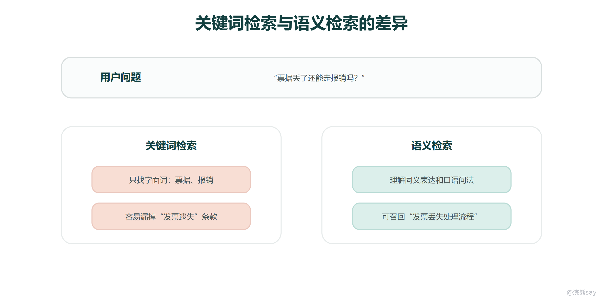
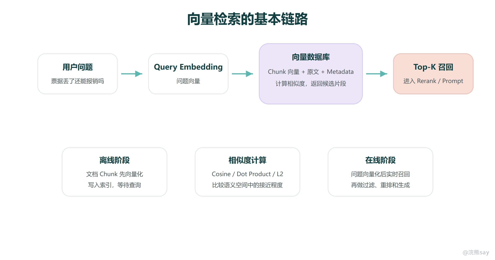
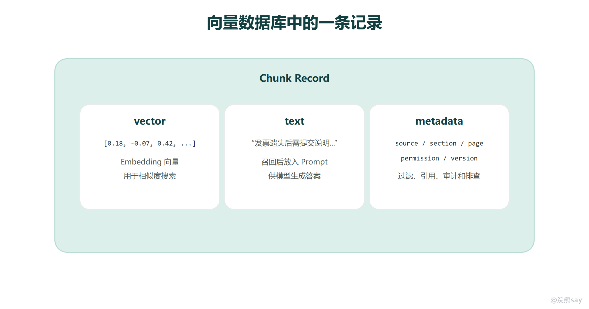
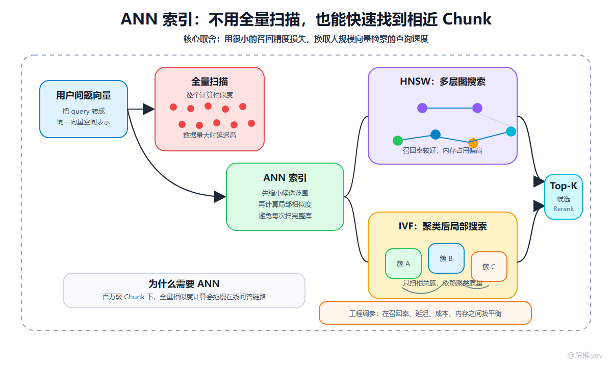
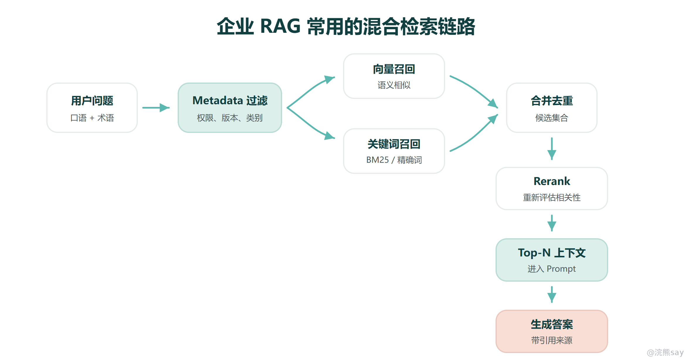

# 向量数据库与语义检索原理

**向量数据库与语义检索原理**

前面讲完文档解析、Chunk 切分和 Metadata 之后，RAG 的下一层就是检索。检索层要解决的问题很直接：用户问了一个问题，系统如何从大量 Chunk 中找到最可能有用的依据。向量数据库负责的，就是把文本的语义表示存起来，并在查询时快速找出语义相近的片段。

向量数据库不能简单理解成“存一堆数组的数据库”。在 RAG 系统里，它通常同时保存 Chunk 的 Embedding 向量、原文内容和 Metadata，并通过相似度计算、近似最近邻索引、元数据过滤等能力完成召回。它的价值不是替代文档管理，也不是替代大模型，而是在问答生成之前尽量把正确依据找出来。

这一节要讲清楚四件事：为什么关键词检索会漏掉语义相关内容，Embedding 如何把文本放进向量空间，向量数据库里到底存什么，以及为什么真实项目往往要把向量检索、关键词检索、Metadata 过滤和 Rerank 组合起来。

# 一、为什么需要语义检索

传统关键词检索擅长精确匹配。用户搜索“报销发票”，系统会优先找到包含“报销”和“发票”的文档。但真实提问经常不是关键词形式，而是口语化表达，例如“票据丢了还能走报销吗”。这句话里可能没有“发票”这个词，但它和发票遗失、报销凭证、财务制度高度相关。

关键词检索的优势是可解释、速度快、对编号和专有名词友好。制度编号、合同编号、接口名、产品型号、错误码这类内容，关键词匹配往往更可靠。语义检索的优势是能处理同义表达、近义问题、口语化问题和不完全一致的问法。它不是在找“字面上是否出现同一个词”，而是在找“表达的意思是否接近”。

这也是为什么企业 RAG 里不能只迷信向量检索。向量检索可以补足关键词检索的语义缺口，但它对精确字段、短查询、稀有术语和权限过滤并不天然可靠。真正稳定的检索系统，通常要让关键词和向量各自负责擅长的部分。

 如何把文本变成可检索的语义向量

Embedding 模型会把一段文本映射成一个高维向量。可以把这个向量理解成文本在“语义空间”里的坐标。语义相近的文本在这个空间里距离更近，语义差异大的文本距离更远。用户问题和文档 Chunk 只要被同一个 Embedding 模型映射到同一个空间，就可以通过距离或相似度来比较它们是否相关。

这个过程分成两个阶段。离线入库时，系统把每个 Chunk 转成向量，和原文、Metadata 一起写入向量数据库。在线查询时，系统把用户问题也转成向量，然后在向量库中找到与问题向量最接近的 Top-K 个 Chunk。召回出来的片段会继续进入 Rerank、Prompt 构建和大模型生成。

这里要注意一个边界：向量相似不等于答案一定正确。向量检索只能说明“这个片段和问题在语义上接近”，不能保证片段一定包含完整答案，也不能保证它适用于当前用户权限、文档版本和业务场景。所以向量检索后面还需要 Metadata 过滤、重排和答案引用校验。

# 三、向量数据库里到底存什么

一个可用的 RAG 向量库，至少要同时保存三类信息。第一类是 vector，也就是 Chunk 的 Embedding 向量，用来做相似度搜索。第二类是 text，也就是 Chunk 原文，召回后要放进 Prompt 交给大模型阅读。第三类是 metadata，用于记录来源、标题、章节、页码、权限、版本、时间等信息。

如果只存向量，不存原文，系统即使找到了相似片段，也没有材料可以交给模型。只存原文但缺少 Metadata，系统就很难做来源引用、权限过滤、版本筛选和问题排查。企业 RAG 的关键不是“能搜到一些相似内容”就结束，而是要知道这些内容来自哪里、谁能看、是否是最新版本、回答时能否展示依据。

从工程实现看，向量数据库还要支持索引构建、批量写入、删除更新、元数据过滤、Top-K 检索和相似度分数返回。有些系统还会把向量库和对象存储、关系型数据库、搜索引擎配合使用：向量库负责语义召回，关系库负责文档状态和权限，搜索引擎负责关键词和 BM25，最终由检索服务统一编排。

# 四、相似度计算：比较的是语义空间里的接近程度

向量检索本质上是在比较用户问题向量和文档向量的接近程度。常见方法包括 Cosine Similarity、Inner Product 和 Euclidean Distance。面试或项目讲解时不需要推公式，但要讲清楚直觉：余弦相似度更关注方向是否接近，点积和向量长度、模型训练方式有关，欧氏距离则更像几何空间里的距离。

对文本语义检索来说，最重要的不是记住某个公式，而是理解“同一个 Embedding 模型 + 同一个向量空间 + 合适的相似度函数”三者要匹配。如果文档用一个模型向量化，查询用另一个不兼容的模型向量化，或者相似度函数和模型训练方式不匹配，检索结果就可能明显变差。

此外，相似度分数不是绝对真理。分数高只表示模型认为语义接近，不代表片段一定回答了问题。比如用户问“票据丢失能不能报销”，召回到“报销材料包括票据”可能语义很近，但它未必回答“丢失后怎么办”。因此，实际系统还需要看召回片段是否覆盖条件、例外、流程和适用范围。

 ANN 索引

如果知识库只有几百个 Chunk，系统可以把问题向量和所有文档向量逐个计算相似度。但企业知识库往往有几十万、几百万甚至更多 Chunk，每次全量扫描会带来很高延迟。向量数据库因此会使用 ANN，也就是 Approximate Nearest Neighbor，近似最近邻搜索。

ANN 的核心思想是用较小的精度损失换取明显的检索速度提升。它不一定每次都找到数学意义上的绝对最近邻，但能在很短时间内找到足够相似的候选结果。常见索引里，HNSW 可以直观理解成多层图结构，查询时从粗到细沿着相近节点搜索，召回率和查询速度通常较好，但内存占用偏高；IVF 可以直观理解成先把向量聚成多个簇，查询时只搜索相关簇，更适合大规模数据，但效果依赖聚类质量和参数设置。

这里的工程取舍很重要。索引参数设置得过于追求速度，可能漏掉正确依据；设置得过于追求召回，延迟和资源成本又会上升。RAG 项目不能只看向量库是否能跑通，还要用真实问题集评估召回率、延迟、成本和稳定性。

# 六、为什么真实项目要做混合检索

向量检索擅长语义相似，关键词检索擅长精确匹配，Metadata 过滤负责控制范围，Rerank 负责把候选结果重新排序。企业 RAG 通常不会只依赖其中一个环节，而是把它们组合成混合检索链路。

一个常见流程是：先根据用户身份和业务场景做 Metadata 过滤，排除无权限、过期或不相关类别的文档；再同时走向量召回和关键词召回，分别找语义相关内容和精确命中的内容；然后合并候选结果、去重，并交给 Rerank 模型重新排序；最后选择 Top-N 片段进入 Prompt。这样做的好处是既能覆盖口语化提问，也能保住编号、术语、条款和接口名这类精确命中。

常见工具选型也要按场景理解。Milvus、Weaviate、Pinecone 更像完整向量数据库；FAISS 更像高性能向量检索库，经常作为底层组件；Elasticsearch 和 OpenSearch 在关键词、BM25、过滤和混合搜索方面有优势。央国企、银行、能源、电力等内网场景，还要考虑私有化部署、权限审计、国产化适配、运维复杂度和成本。

# 七、向量检索不准时怎么排查

向量库召回不准时，不要第一反应就是换大模型。RAG 的排查应该先看召回材料：正确答案所在的 Chunk 有没有被召回，召回后排在第几位，是否被 Metadata 过滤掉，是否因为 Chunk 太大或太小导致语义不清，是否因为用户问题太短而没有表达完整意图。

images/vector\_retrieval\_diagnosis\_redraw.png

如果召回内容整体不相关，优先检查 Chunk 切分和 Embedding 模型是否适合业务语料；如果关键术语、编号、接口名搜不到，要考虑加关键词检索或混合检索；如果召回内容大量重复，要检查 overlap 和去重策略；如果用户问题很短，要考虑 Query Rewrite 或 Query Expansion；如果 Top-K 里有正确材料但排得很靠后，要加 Rerank；如果用户看到不该看的内容，要检查 Metadata 过滤和权限隔离。

这个排查顺序能帮你把问题定位到具体层级。召回错了，优先修检索；召回对了但材料太多太乱，优先修重排和上下文选择；材料对了但模型回答越界，才重点修 Prompt 和生成约束。

# 八、面试表达模板

面试中可以这样概括：
| Plain Text向量数据库在 RAG 中负责语义检索。离线阶段会把文档 Chunk 通过 Embedding 模型转成向量，并和原文、来源、章节、权限、版本等 Metadata 一起写入向量库。用户提问时，系统把问题也转成向量，通过相似度搜索召回 Top-K 相关片段。为了提升大规模检索速度，向量库通常会使用 HNSW、IVF 等 ANN 索引。 |
| --- |

如果被追问“为什么不用关键词检索”，可以补充：
| Plain Text关键词检索适合精确匹配，向量检索适合理解语义相似。真实企业知识库里一般会做混合检索。比如产品型号、制度编号、接口名更适合关键词匹配；用户口语化提问、同义表达更适合向量检索。最终还会结合 Metadata 过滤和 Rerank，提高召回准确性和可解释性。 |
| --- |

向量检索讲完之后，就可以进入 RAG 最常见的优化问题：召回不准、排序不准、上下文噪声太多怎么办。
