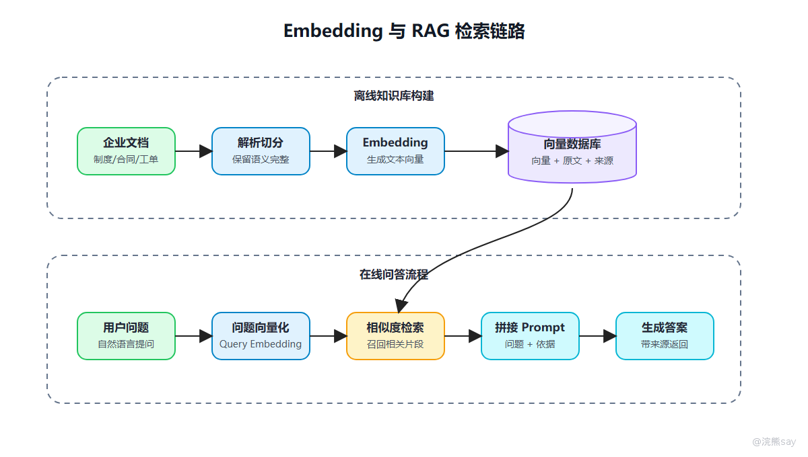
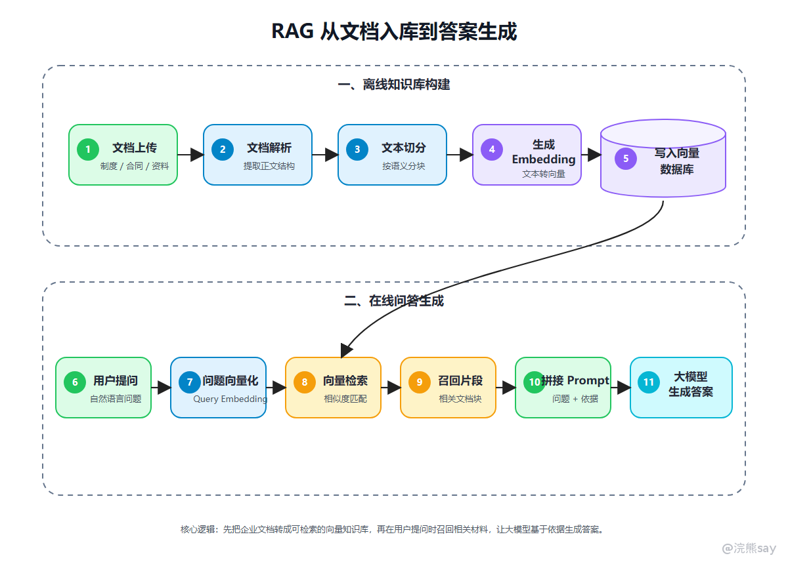

# Embedding与RAG检索基础



Embedding 是把文本映射成向量的过程。向量可以理解为一组数字坐标，模型通过这些数字来表示文本的语义。在大模型应用开发中，Embedding 最常见的用途不是聊天，而是检索。比如企业制度知识库里有很多文件，系统会先把文件切成片段，再把每个片段转成向量，存入向量数据库。当用户提问时，系统也把问题转成向量，然后查找语义上最接近的文档片段。

## 一、Embedding 和生成模型的区别

这里要区分两个概念：

| 概念 | 主要作用 | 常见场景 |
| --- | --- | --- |
| 生成模型 | 根据上下文生成回答 | 问答、写作、总结、代码生成 |
| Embedding 模型 | 把文本转成向量 | 语义搜索、相似度匹配、知识库检索 |

很多同学会把它们混在一起。面试时可以强调：生成模型负责“组织答案”，Embedding 模型负责“找到相关材料”。RAG 的效果不好，不一定是生成模型差，也可能是文档切分、向量模型、召回策略或上下文拼接出了问题。

## 二、RAG 的基本链路

RAG 可以理解为“先查资料，再让模型回答”。它不是让模型凭记忆回答，而是先从外部知识库里找相关材料，再把材料和问题一起交给模型，常见链路是：



RAG 的完整流程可以分成两个阶段。第一阶段是离线知识库构建：先上传企业文档，再进行文档解析、文本切分，将切分后的内容生成 Embedding 向量，并写入向量数据库。第二阶段是在线问答生成：用户提出问题后，系统先把问题向量化，再到向量数据库中检索相似内容，召回相关文档片段，最后把用户问题和召回依据一起拼接成 Prompt，交给大模型生成答案。RAG 的核心价值，就是让大模型不要只凭自身参数“猜答案”，而是基于企业知识库中召回的材料进行回答。

## 三、为什么 RAG 能减少幻觉

大模型容易幻觉，一个重要原因是它没有实时、权威、专属的业务知识。RAG 的价值就是把企业内部知识源接进来，让模型基于召回材料回答。

但要注意，RAG 只能降低幻觉风险，不能自动保证答案正确。因为 RAG 链路里每一步都可能出问题：

| 环节 | 可能问题 |
| --- | --- |
| 文档解析 | PDF 表格、图片、页眉页脚识别错误 |
| 文本切分 | 一段话被切断，语义不完整 |
| 向量化 | Embedding 模型不适合当前行业语料 |
| 召回 | 找到相似但不相关的片段 |
| 重排 | 排名靠前的片段不是最关键证据 |
| Prompt 拼接 | 材料太多、冲突或顺序混乱 |
| 生成回答 | 模型没有严格依据材料回答 |

所以做 RAG 项目，不能只说“我用了向量数据库”，还要说明你如何处理文档、如何切分、如何召回、如何约束回答。

## 四、项目表达模板

项目里可以这样说：

```text
我没有直接把全部文档交给大模型，而是先对文档进行解析和切分，
再使用 Embedding 模型生成向量并写入向量数据库。
用户提问时，系统先做语义检索，召回相关片段，再把片段和问题一起交给大模型生成回答。
这样可以减少模型胡编，同时降低上下文消耗。
```

如果面试官追问“召回不准怎么办”，可以补充：

```text
我会从几个方向优化：一是调整切分粒度，避免片段过长或过短；
二是增加关键词检索和向量检索的混合召回；
三是增加 rerank，把更相关的片段排到前面；
四是在 Prompt 中要求模型只基于材料回答，并返回引用来源。
```

## 五、面试常问问题

| 问题 | 回答重点 |
| --- | --- |
| Embedding 是什么？ | 把文本转成语义向量，便于相似度检索 |
| RAG 为什么重要？ | 让模型结合外部知识回答，降低幻觉 |
| 向量数据库存什么？ | 文档片段向量、文本内容、来源、元数据 |
| 召回不准怎么办？ | 切分优化、混合检索、rerank、查询改写 |
| RAG 和微调有什么区别？ | RAG 适合接入外部知识，微调更适合改变模型行为或风格 |
