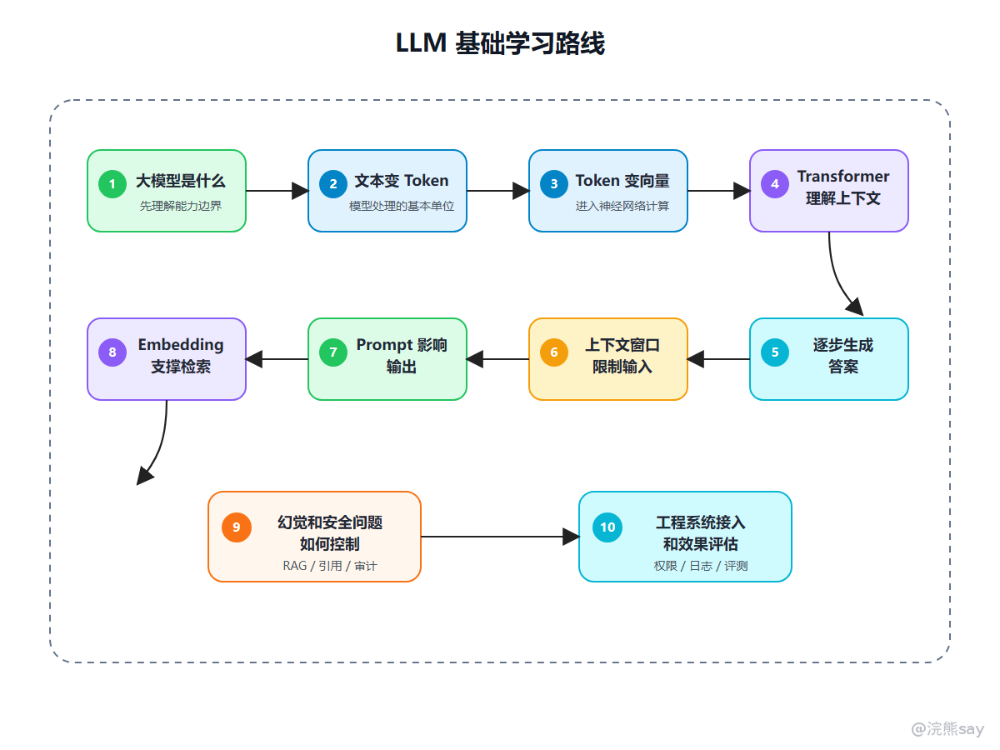

# LLM基础学习路线

这组文章主要写给准备央国企技术岗、国企科技子公司、运营商科技岗、金融科技岗、能源电力信息化岗，以及想把 Java 后端能力往 AI 应用开发方向补一层的同学。

LLM 基础不是让你去背一堆论文名，也不是要求你从零训练一个大模型。对大多数技术岗来说，更现实的要求是：你能不能理解大模型应用的基本工作机制，能不能把模型能力接入业务系统，能不能解释清楚 Token、上下文、Embedding、Prompt、幻觉、推理参数这些概念对工程落地有什么影响。

先把判断放在前面：

1.  大模型不是一个“会聊天的接口”，而是一套基于概率生成、上下文建模和向量表示的智能计算能力。
    
2.  央国企技术岗不一定要求你掌握模型训练，但会越来越关注你是否理解模型接入、知识库问答、智能客服、文档分析和办公助手背后的基础原理。
    
3.  LLM 基础准备的重点不是公式推导，而是能把概念讲成人话，并能落到项目设计、成本控制、效果评估和安全合规上。
    
4.  对 Java 后端同学来说，更稳的路线是：先理解 LLM 应用链路，再补 RAG、Agent、工具调用和内网部署。
    

## 一、为什么要先学 LLM 基础

很多同学学 AI 应用开发时，一上来就看 RAG、Agent、LangChain、Dify、MCP，但如果不理解 LLM 的基础机制，后面会出现两个问题。

第一个问题是项目只会调接口。能把用户问题发给模型，也能拿到回答，但不知道为什么模型会答错，为什么上下文一长就变慢，为什么知识库召回了内容模型仍然乱答，为什么同一个问题每次输出不一样。

第二个问题是面试表达空。能说“我用了大模型”“我做了 RAG”“我接了向量数据库”，但面试官一追问 Token、Embedding、上下文窗口、Prompt Injection、温度参数、幻觉控制，就容易卡住，所以 LLM 基础建议按这条线准备：

这条学习路线的核心，是先把大模型的基本工作机制讲清楚，再逐步过渡到工程落地。学习时不要一上来就只看 RAG、Agent 或各种开发框架，而是先理解大模型是什么，文本为什么要拆成 Token，Token 如何变成向量，Transformer 又是如何基于上下文进行理解和生成的。等这些基础机制打通之后，再去看上下文窗口、Prompt、Embedding 检索、幻觉控制和系统接入，就会更容易把大模型能力理解成一个完整的工程链路，而不是停留在“调用模型接口”这一层。

## 二、本专题文章目录

| 文章 | 重点解决什么问题 |
| --- | --- |
| 01-大语言模型与生成机制 | 大模型是什么，为什么它不是数据库查询 |
| 02-Token与上下文窗口 | Token、上下文窗口、成本和长文本处理 |
| 03-Embedding与RAG检索基础 | Embedding、向量检索和 RAG 问答链路 |
| 04-Transformer与推理参数 | Transformer 的面试级理解和常见推理参数 |
| 05-Prompt工程与幻觉控制 | Prompt 如何设计，幻觉如何降低风险 |
| 06-企业LLM应用架构与面试表达 | 企业应用架构、面试问法和项目经历表达 |

## 三、准备优先级

如果时间有限，可以按这个顺序准备：

| 优先级 | 内容 | 准备程度 |
| --- | --- | --- |
| P0 | Token、上下文窗口、Prompt、幻觉 | 必须能解释并结合项目回答 |
| P0 | Embedding、向量检索、RAG 基础 | 必须能画出链路 |
| P1 | Transformer、注意力机制 | 能讲清核心思想即可 |
| P1 | 推理参数、结构化输出 | 能说明工程影响 |
| P1 | 安全合规、权限、审计 | 央国企场景重点准备 |
| P2 | 微调、LoRA、RLHF | 了解概念，除非岗位明确要求 |
| P2 | 模型训练、分布式训练 | 普通应用开发岗不作为重点 |

对大多数同学来说，不要一开始就陷入模型训练细节。你更应该先把“模型如何接入业务系统、如何降低幻觉、如何做知识库问答、如何保证权限和审计”讲清楚。

## 四、最后要准备到什么程度

准备 LLM 基础，不需要把自己包装成算法工程师。央国企技术岗更看重的是你能不能把 AI 能力工程化。

比较理想的准备状态是：

> 能解释 LLM 的基本生成机制能说清 Token、上下文窗口、Embedding、Prompt 的工程影响能画出一个 RAG 问答系统链路能说明幻觉控制、安全合规和日志审计方案能把 AI 项目表达成业务系统，而不是调模型接口

如果你本来是 Java 后端方向，LLM 基础的作用不是让你放弃 Java，而是让你在原有后端能力上多一个新的应用层能力。未来央国企技术岗真正有竞争力的同学，大概率不是只会背大模型名词的人，而是能把大模型、业务系统、数据权限、流程管理和工程交付放在一起考虑的人。
