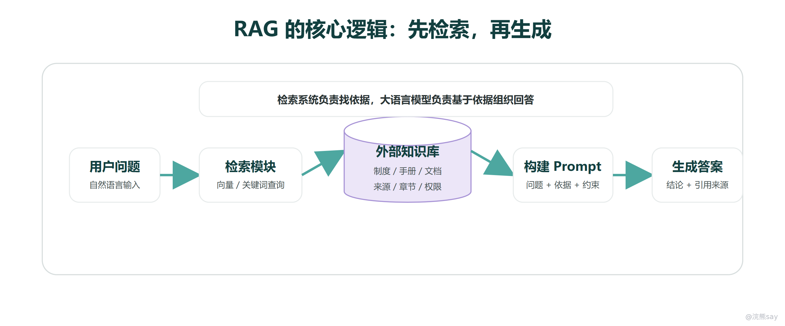
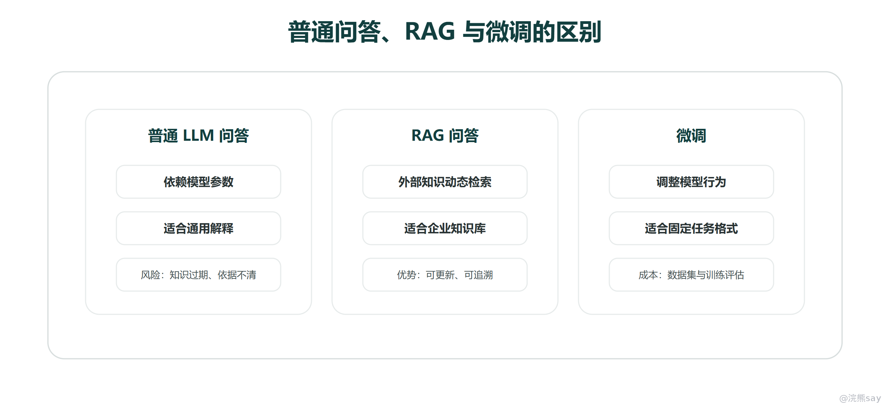
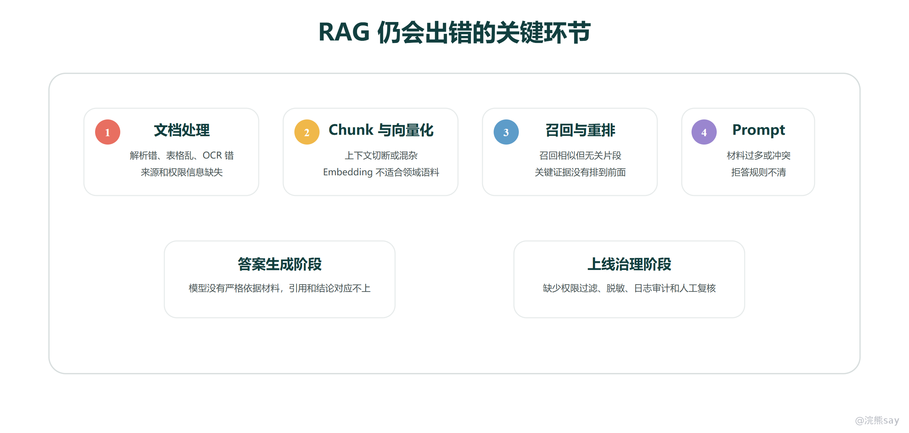

# RAG是什么与为什么需要RAG

**RAG是什么与为什么需要RAG**

# 

RAG（Retrieval-Augmented Generation，检索增强生成）是一种把外部知识检索系统和大语言模型结合起来的应用架构。它的核心思路是：模型回答问题之前，系统先从知识库里检索相关资料，再把这些资料作为上下文交给大模型，让模型基于材料生成答案。

这句话里有两个关键点。第一，RAG 并不是一个新的大模型，而是一套系统链路；第二，RAG 并不是让模型“记住”更多知识，而是在每次问答时动态把外部资料补充进上下文。检索系统负责找到依据，大语言模型负责理解用户问题、组织材料并生成自然语言回答。

在企业 AI 应用里，RAG 的价值非常直接：企业制度、产品手册、项目文档、接口说明、合同条款和运维手册经常变化，而且很多内容不会出现在公开训练数据中。直接让模型凭参数回答，容易遇到知识过期、私有知识缺失和幻觉问题；使用 RAG 后，系统可以先查到企业内部资料，再让模型基于这些资料作答，并尽量返回引用来源。

# 一、为什么不能直接让大模型回答

刚接触大模型时，很多同学会觉得模型已经能聊天、能总结、能写代码，企业知识库问答似乎也只要把问题直接发给模型。这个想法在演示场景里可能能跑通，但在真实业务里会很快遇到三个问题。

第一个问题是知识更新。模型训练完成后，参数里的知识基本固定，它不会自动同步企业最新发布的制度、公告和流程。比如公司刚修改差旅报销规则，模型如果没有拿到这份新制度，就只能根据旧知识或通用经验回答。

第二个问题是私有知识。企业内部合同、运维手册、客户资料、工单记录、项目文档和审批规则通常不会出现在公开训练数据里。模型没有见过这些资料，直接问它，它只能根据语言模式猜测。猜得像，不代表猜得对。

第三个问题是事实可靠性。大模型的底层机制是根据上下文预测后续 Token，它擅长生成流畅文本，但并不天然验证事实。当上下文缺少可靠依据时，模型可能生成一段语气确定、结构完整、但事实错误的回答。企业系统最怕的不是模型回答得不流畅，而是模型把错误内容说得很像真的。

RAG 的作用，就是把“事实依据”从模型参数里拿出来，放到可维护、可更新、可检索的外部知识库中。知识库更新后，系统可以重新解析、切分、向量化和入库；用户提问时，系统再动态检索相关材料，让模型基于当前资料回答。

 的基本原理

RAG 的执行过程可以理解成一条问答链路：用户提出问题，系统把问题转换成检索请求，到知识库中找到相关片段，再把“用户问题 + 检索材料 + 回答约束”组织成 Prompt，最后调用大模型生成答案。这个过程中，模型仍然负责语言理解和表达，但事实依据来自外部知识库。

这条链路里，检索不是简单查关键词。真实系统通常会同时使用向量检索、关键词检索、Metadata 过滤和 Rerank。向量检索适合处理语义相似问题，比如用户问“出差能报哪些费用”，系统可以找到“差旅报销范围”相关片段；关键词检索适合匹配制度编号、岗位名称、产品型号等精确词；Metadata 过滤用于限制部门、权限、版本和文档类型；Rerank 则把初步召回的候选材料重新排序，让最能回答问题的依据排在前面。

检索到材料以后，系统也不会直接把原文丢给模型。后端通常会保留每个片段的来源、标题、章节、页码、权限和版本，并根据上下文窗口限制筛选材料。Prompt 中会明确告诉模型只能依据参考资料回答，如果资料不足就说明无法确认，并在答案中返回依据或引用来源。这样做的目的，是把模型从“自由发挥”收回到“基于材料回答”。

所以，RAG 的原理不能只概括成“先检索再生成”。更完整的理解是：RAG 把知识来源、检索策略、上下文构建、生成约束和结果追溯串成一条链路，让大模型在外部资料的边界内完成回答。

 和普通问答、微调有什么区别

普通大模型问答、RAG 和微调经常被放在一起比较。它们都能改善模型使用效果，但解决的问题不同。普通问答主要依赖模型参数和当前上下文，适合开放聊天、通用解释和不依赖企业私有资料的任务；RAG 把知识放在外部，适合制度问答、文档问答、合同分析和知识库助手；微调则是用训练数据调整模型行为，适合稳定任务、固定格式或特定领域表达风格。

RAG 和微调最容易混淆。可以这样区分：RAG 解决的是“知识从哪里来”，微调更偏向解决“模型怎么表现”。如果企业文档频繁更新、资料量很大、需要返回引用来源，优先考虑 RAG；如果任务长期稳定、样本充足、希望模型更稳定地按某种格式或风格输出，可以考虑微调。

实际项目里，两者不是互相替代。很多系统会先用 RAG 接入企业知识，再用 Prompt 和结构化输出约束答案格式；如果某类任务长期稳定，再考虑通过微调提升一致性。面试里不要把 RAG 说成万能方案，也不要把微调说成一定更高级，关键是说明它们适合解决不同问题。

 也不是万能的

RAG 能降低幻觉，但不能保证模型永远正确。原因很简单：RAG 是一条长链路，最终答案的质量取决于每个环节。只要文档解析、Chunk 切分、Embedding、召回、Rerank、Prompt 构建或答案生成中的某个环节出问题，最终答案都可能偏离事实。

例如，文档解析阶段如果把 PDF 表格列顺序识别错了，后续检索到的材料本身就是错的；Chunk 切分如果把一个条款的条件和结论切开，模型可能只看到半段依据；Embedding 模型如果不适合行业术语，语义检索可能召回“看起来相似但实际无关”的片段；Rerank 如果没有把关键证据排到前面，Prompt 里就可能塞入大量噪声材料。

生成阶段同样需要约束。即使召回材料正确，如果 Prompt 没有要求“只能依据材料回答”“材料不足时说明无法确认”“返回引用来源”，模型仍然可能自由发挥。企业场景中还要考虑权限过滤、敏感信息脱敏、日志审计和人工复核，否则 RAG 只能解决一部分知识问题，不能成为可靠业务系统。

因此，排查 RAG 问题时，不要一上来就换模型。更合理的顺序是先看召回材料是否命中，再看排序是否合理，然后检查 Prompt 是否正确约束模型，最后再看模型生成是否遵守材料边界。RAG 项目的调优，本质上是对整条链路做定位和修复。

 RAG

从后端开发角度看，RAG 不是一个算法模块，而是一套企业知识问答系统。它通常包含文档管理、文件解析、Chunk 切分、Embedding 生成、向量库写入、检索服务、Rerank 服务、Prompt 模板、模型网关、引用来源、权限过滤、日志审计和效果评估。

这也是为什么不能只说“我用了向量数据库”。向量数据库只是检索组件的一部分，真正的 RAG 系统还要处理文档怎么进入知识库，用户问题怎么变成检索请求，召回材料怎么筛选和排序，模型回答怎么约束，答案依据怎么追溯，线上效果怎么评估。

如果要写进项目经历，可以这样组织：项目背景是企业知识分散、人工查询效率低、制度问答口径不统一；核心方案是使用 RAG 把内部文档接入知识库问答；个人职责可以写文档解析、Chunk 策略、Embedding 入库、检索接口、Prompt 模板、模型调用和日志记录；技术难点则围绕召回准确性、幻觉控制、权限隔离和引用来源展开。

# 六、面试表达模板

如果面试官问“RAG 是什么”，可以这样回答：
| Plain TextRAG 是检索增强生成，它不是单独的模型，而是一套把外部知识库和大语言模型结合起来的系统架构。用户提问后，系统先从知识库里检索相关材料，再把材料和问题一起构造成 Prompt，让大模型基于真实资料生成答案，并尽量返回引用来源。 |
| --- |

如果面试官追问“为什么需要 RAG”，可以补充：
| Plain Text直接问大模型会遇到知识过期、企业私有知识无法覆盖和幻觉问题。RAG 把知识放在模型外部，知识库更新后可以重新入库和检索，回答时也能基于召回材料生成结果，更方便做来源追踪、权限控制和审计。 |
| --- |

如果面试官问“为什么用了 RAG 仍然会出错”，可以这样说：
| Plain TextRAG 是一条长链路，答案质量不只取决于模型。如果文档解析错、Chunk 切分不合理、Embedding 不适合语料、召回材料不相关、Rerank 排序不准，或者 Prompt 没有要求模型严格基于材料回答，最终答案仍然可能出错。所以排查 RAG 问题时，我会先看召回材料，再看排序和 Prompt，最后再看模型生成。 |
| --- |

这一节的重点是：RAG 的本质不是“向量库加模型”，而是用检索系统给模型提供外部依据。下一步要继续看完整 RAG 系统如何拆成离线知识库构建和在线问答生成两条链路。
