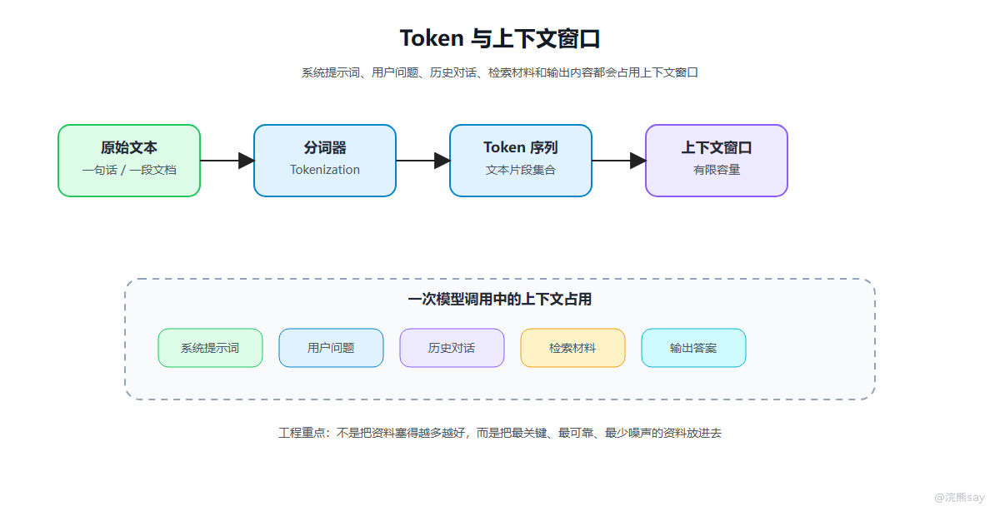
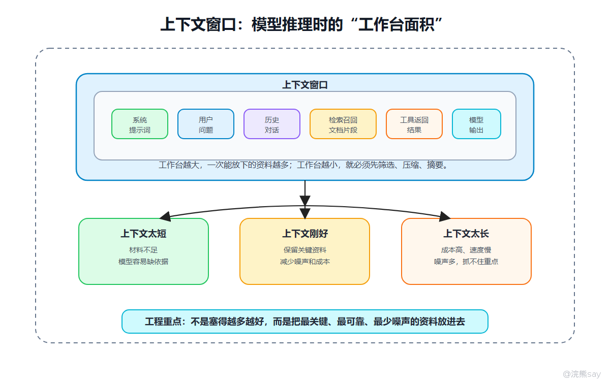

# Token与上下文窗口



Token 是大模型处理文本的基本单位。模型并不是直接理解“一句话”或“一段话”，而是先把文本切成一个个 Token，再把这些 Token 转成数字和向量。

Token 可能是一个汉字、一个英文单词、一个单词片段、一个标点，也可能是空格和换行。不同模型的分词器不一样，同一段文本在不同模型里消耗的 Token 数也可能不同。

## 一、Token 为什么重要

Token 对工程系统有三个直接影响。

第一是成本。很多模型调用按 Token 计费，输入越长、输出越长，调用成本越高。

第二是速度。生成过程通常是一个 Token 一个 Token 往外吐，输出越长，用户等待时间越明显。

第三是上下文限制。模型一次能“看到”的 Token 数是有限的，这个限制就是上下文窗口。输入文本、系统提示词、历史对话、检索出来的资料、模型即将生成的内容，都要共同占用这个窗口。

## 二、上下文窗口是什么

上下文窗口可以理解为模型一次推理时的“工作台面积”。工作台越大，一次能放下的资料越多；工作台越小，就必须先筛选、压缩、摘，在实际系统中，上下文窗口里通常会放这些内容：



  

上下文窗口可以理解为模型一次推理时的“工作台面积”。系统提示词、用户问题、历史对话、检索召回的文档片段、工具返回结果和模型正在生成的答案，都会占用这个工作台。工作台太小，模型能参考的信息不够，回答容易缺依据；工作台太大，虽然能放更多资料，但也会带来成本升高、响应变慢和噪声变多的问题。实际做大模型应用时，关键不是把资料塞得越多越好，而是把最关键、最可靠、最少噪声的信息放进上下文里。

## 三、常见工程问题

在项目里，经常会遇到这些问题：

| 问题 | 本质原因 | 处理思路 |
| --- | --- | --- |
| 长文档直接塞给模型失败 | 超过上下文窗口 | 文档切分、摘要、分段处理 |
| 对话轮数多了回答变差 | 历史消息占用上下文 | 历史压缩、关键信息提取 |
| RAG 检索了很多片段但效果不好 | 上下文里噪声太多 | rerank、过滤、上下文重组 |
| 成本突然升高 | 输入和输出 Token 失控 | 限制输出长度、压缩 Prompt |

所以做企业知识库问答时，不要把所有材料都塞给模型。更稳的做法是先检索、再筛选、再组织上下文。

## 四、长文本怎么处理

长文本处理可以按几种方式组合：

| 方法 | 适用情况 |
| --- | --- |
| 按标题和段落切分 | 制度文件、报告、说明书 |
| 按固定长度切分 | 格式不稳定的大段文本 |
| 摘要压缩 | 多轮对话、历史记录 |
| 分段问答 | 长合同、长报告分析 |
| Map-Reduce 总结 | 多文档汇总、会议纪要整理 |
| RAG 检索 | 知识库问答、制度查询 |

央国企场景里，经常会遇到制度文件、招采公告、合同条款、操作规程和会议材料。准备项目时，建议把“长文档不能直接塞模型，所以我做了切分和召回”这句话讲清楚。

## 五、面试表达模板

面试里可以这样回答：

```text
Token 不只是一个计费单位，它决定了模型能处理多少信息、推理速度和上下文组织方式。
在企业知识库项目中，我会控制单次召回片段数量，避免把大量无关文本塞进 Prompt。
如果文档很长，我会先做切分、摘要或多轮检索，而不是一次性全部交给模型。
```

如果面试官继续问“上下文越长是不是越好”，可以补一句：

```text
不一定。长上下文能放更多材料，但也会带来成本、延迟和噪声问题。
企业应用里更重要的是把关键材料放进去，而不是把所有材料都放进去。
```
