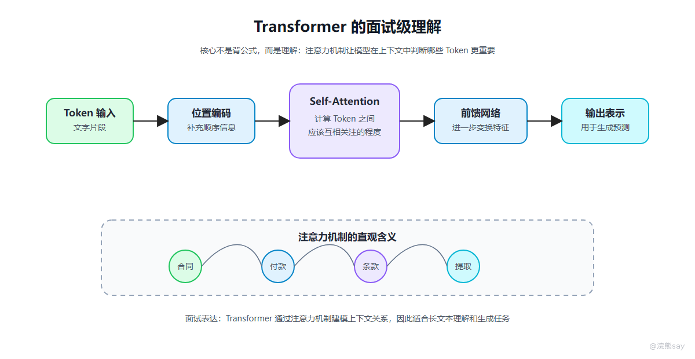

# Transformer与推理参数

央国企技术面试一般不会要求你手推 Transformer 公式，但至少要知道它为什么适合大模型，以及常见推理参数会怎样影响输出。

这一篇重点解决两个问题：第一，Transformer 需要理解到什么程度；第二，temperature、top\_p、max\_tokens 这些参数在工程里怎么用。

## 一、Transformer 要理解到什么程度



Transformer 的核心是注意力机制。注意力机制可以让模型在处理一个 Token 时，同时关注上下文中的其他 Token，从而理解词与词之间的关系。比如“请把这份合同里的付款条款提取出来”，模型在理解“付款条款”时，需要联系“合同”“提取”“条款”等多个上下文信息。

传统 RNN 更强调顺序处理，前一个状态影响后一个状态。Transformer 则可以并行处理序列，并通过注意力计算不同位置之间的关系，所以更适合大规模训练。

## 二、几个关键词

可以按这几个关键词准备：

| 关键词 | 面试解释 |
| --- | --- |
| Attention | 计算不同 Token 之间的相关程度 |
| Self-Attention | 同一段文本内部 Token 互相建立关系 |
| Multi-Head Attention | 从多个角度捕捉语义、语法和上下文关系 |
| Position Encoding | 给模型补充位置信息，否则模型不知道 Token 顺序 |
| Feed Forward | 对注意力结果做进一步非线性变换 |
| Masked Attention | 生成式模型只能看当前位置之前的内容，保证逐步生成 |

面试里可以这样回答：

```text
Transformer 的价值在于用注意力机制建模上下文关系。
它不像 RNN 那样必须严格按顺序处理，所以训练效率更高，也更容易扩展到大规模参数和数据。
对大语言模型来说，Transformer 让模型可以在较长上下文中捕捉词语、句子和段落之间的依赖关系。
```

这个答案不花哨，但足够稳。

## 三、推理参数如何影响输出

调用模型接口时，经常会看到 temperature、top\_p、max\_tokens、stop 等参数。它们不只是配置项，而是会直接影响输出稳定性和成本。

| 参数 | 含义 | 工程影响 |
| --- | --- | --- |
| temperature | 控制随机性 | 越低越稳定，越高越发散 |
| top_p | 从累计概率范围内采样 | 控制候选 Token 范围 |
| max_tokens | 限制最大输出长度 | 控制成本和响应时间 |
| stop | 遇到指定标记停止生成 | 用于结构化输出或多段任务 |
| presence_penalty | 降低重复提及同一主题的概率 | 适合创作类任务 |
| frequency_penalty | 降低重复词句概率 | 减少重复输出 |

在企业系统中，很多场景更适合低随机性。比如制度问答、合同条款提取、工单分类、审批意见生成，通常希望答案稳定、可复现、少发挥。这类任务可以把 temperature 设置得低一些。

创意写作、营销文案、头脑风暴这类任务，可以适当提高随机性。

## 四、不同任务的参数倾向

| 场景 | 参数倾向 |
| --- | --- |
| 制度问答 | 低 temperature，限制输出长度，要求引用来源 |
| 合同条款抽取 | 低 temperature，结构化输出，失败重试 |
| 工单分类 | 低 temperature，固定枚举标签 |
| 会议纪要总结 | 中低 temperature，保留要点和行动项 |
| 公众号标题生成 | 中高 temperature，多候选输出 |
| 方案头脑风暴 | 中高 temperature，鼓励发散 |

面试表达可以这样说：

```text
我会根据任务类型调整推理参数。
如果是知识库问答、分类、抽取等严肃场景，会降低 temperature，限制输出长度，并要求结构化输出。
如果是文案生成或方案发散，可以适当提高随机性。
```

## 五、面试常问问题

| 问题 | 回答重点 |
| --- | --- |
| Transformer 为什么适合大模型？ | 注意力机制、并行计算、可扩展 |
| Attention 是什么？ | 让模型判断当前 Token 应该关注哪些上下文 |
| temperature 越高越好吗？ | 不一定，严肃任务通常要低随机性 |
| max_tokens 有什么用？ | 控制输出长度、成本和响应时间 |
| 为什么同一个问题回答不一样？ | 采样参数、上下文变化、模型随机性 |
