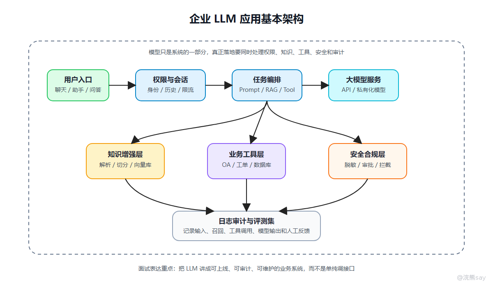

# 企业LLM应用架构与面试表达



对央国企技术岗来说，理解 LLM 不应停留在模型本身，还要能画出一个基本应用系统，一个成熟一点的企业 AI 应用，不是“前端输入问题，后端调模型接口”这么简单。它要考虑权限、数据、日志、异常、成本、稳定性和安全边界。

## 一、基本架构

一个常见的企业 AI 应用架构可以分为几层：

```text
前端交互层：聊天窗口、知识库问答、办公助手入口
业务服务层：权限校验、会话管理、任务编排、日志审计
模型接入层：模型 API、私有化模型、网关、限流、重试
知识增强层：文档解析、切分、Embedding、向量库、RAG
工具执行层：数据库查询、工单系统、OA 流程、报表接口
安全合规层：敏感词、权限隔离、脱敏、审计、人工确认
```

这个架构背后的重点是：模型只是系统的一部分，不是全部。企业 AI 应用要考虑权限、数据、日志、异常、成本、稳定性和安全边界。

## 二、央国企面试会怎么问 LLM 基础

可以按下面问题准备。

| 面试问题 | 回答重点 |
| --- | --- |
| 什么是大语言模型？ | 基于上下文预测和生成 Token 的通用语言模型 |
| Token 是什么？ | 模型处理文本的基本单位，影响成本、速度和上下文 |
| 上下文窗口是什么？ | 单次推理可处理的最大 Token 范围 |
| Embedding 有什么用？ | 把文本转成向量，支持语义检索和相似度计算 |
| RAG 为什么能减少幻觉？ | 通过外部知识源约束模型回答，但依赖召回质量 |
| Transformer 为什么重要？ | 注意力机制可以建模长距离上下文关系 |
| temperature 有什么影响？ | 控制输出随机性，严肃场景一般调低 |
| 如何让模型输出 JSON？ | 明确 Schema、给示例、解析校验、失败重试 |
| 如何防止大模型胡编？ | RAG、引用来源、拒答规则、人工审核、评测集 |
| 企业内部接入大模型要注意什么？ | 数据安全、权限隔离、脱敏、审计、内网部署和成本 |

回答时不要只背概念，最好都能往项目里落一句。

比如问 Embedding，不要只说“向量嵌入”，可以补一句：

```text
在知识库问答里，我会把文档片段和用户问题都转成向量，
通过相似度检索找到相关内容，再交给大模型生成答案。
```

这样面试官会觉得你不是只看过名词，而是理解它在系统里怎么用。

## 三、如何写进项目经历

如果你做过 AI 知识库、智能客服、文档问答、办公助手、合同解析、招采文件分析等项目，可以按下面方式表达。

项目背景：

```text
项目面向企业内部知识管理场景，主要解决制度文件分散、人工查询效率低、员工对业务流程理解不一致的问题。
```

核心方案：

```text
系统采用大模型 + RAG 的方式构建智能问答能力。
后端负责文档上传、解析、切分、向量化、检索、Prompt 拼接、模型调用和答案返回。
```

个人职责：

```text
我主要负责知识库构建和模型调用链路，包括文档分块策略、Embedding 写入、向量召回接口、Prompt 模板设计、模型接口封装和日志记录。
```

技术难点：

```text
难点主要有三个：
第一是长文档不能直接放入上下文，需要按标题、段落和语义完整性进行切分；
第二是模型容易生成没有依据的回答，所以在 Prompt 中要求必须基于召回材料回答，并返回引用来源；
第三是企业内部数据涉及权限和审计，所以系统在问答前做用户权限校验，并记录问题、召回片段和模型输出。
```

项目价值：

```text
上线后，用户可以通过自然语言查询制度和流程说明，减少人工翻阅文件的时间。
同时系统保留引用来源和日志记录，便于后续复核和持续优化。
```

这套表达适合大多数央国企技术岗、国企科技岗、银行科技岗和运营商科技岗。它不会显得太“科研”，也不会显得只是调接口。

## 四、不同岗位怎么调整表达

| 岗位方向 | 表达重点 |
| --- | --- |
| Java 后端 | 接口封装、权限校验、日志审计、模型调用链路 |
| 数据开发 | 文档解析、数据治理、向量索引、评测数据集 |
| 运维/云平台 | 私有化部署、资源监控、限流熔断、成本控制 |
| 信息安全 | 数据脱敏、权限隔离、Prompt Injection、防泄露 |
| 产品/解决方案 | 业务场景、流程改造、效率提升、可追溯性 |

不要所有岗位都说同一套话。央国企面试很看重岗位匹配，你要把 LLM 基础放回自己的专业方向里表达。

## 五、最后的准备标准

比较理想的准备状态是：

```text
能解释 LLM 的基本生成机制
能说清 Token、上下文窗口、Embedding、Prompt 的工程影响
能画出一个 RAG 问答系统链路
能说明幻觉控制、安全合规和日志审计方案
能把 AI 项目表达成业务系统，而不是调模型接口
```

LLM 基础不是为了让你背更多名词，而是让你在面试里显得“知道系统怎么落地”。这才是技术岗真正有用的部分。
