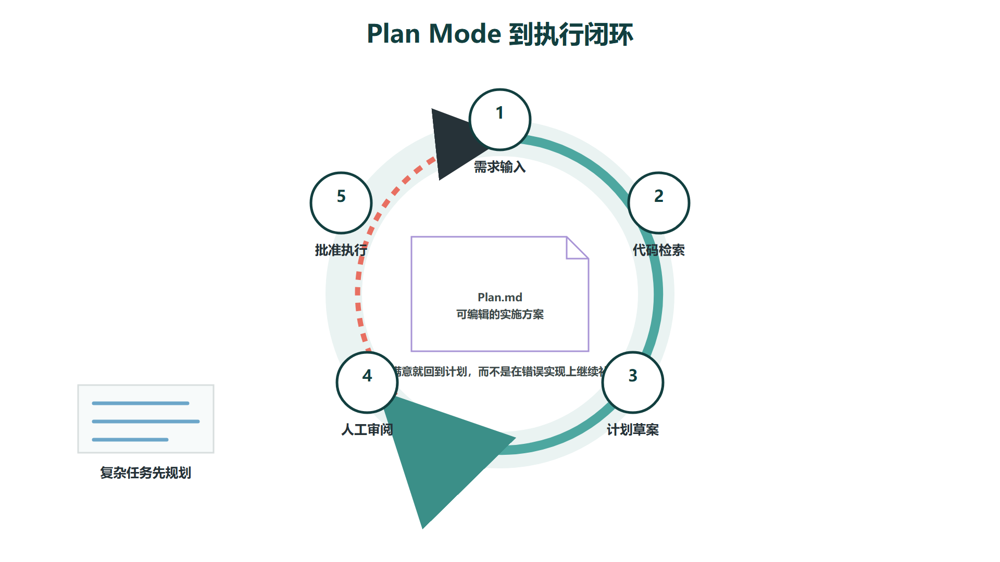
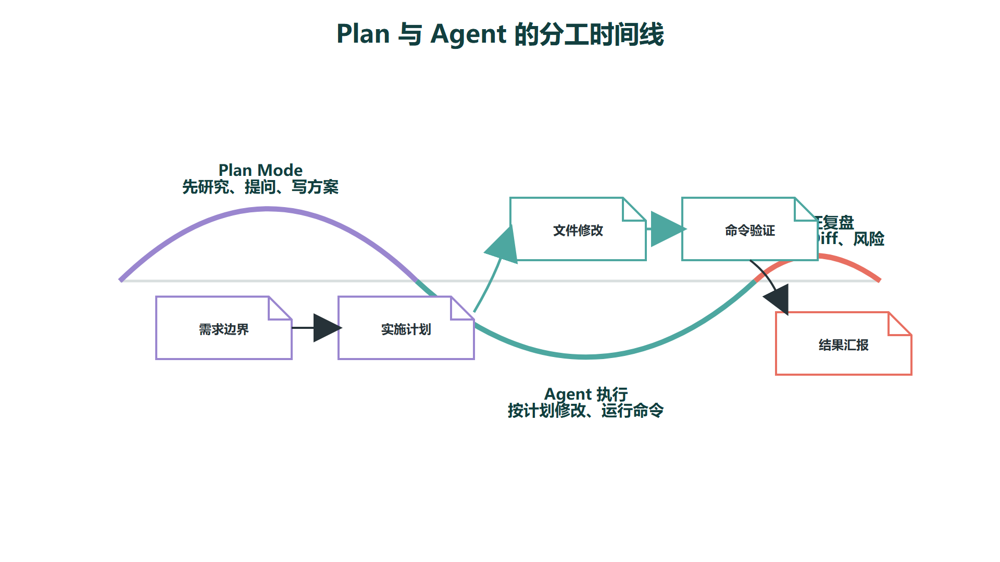
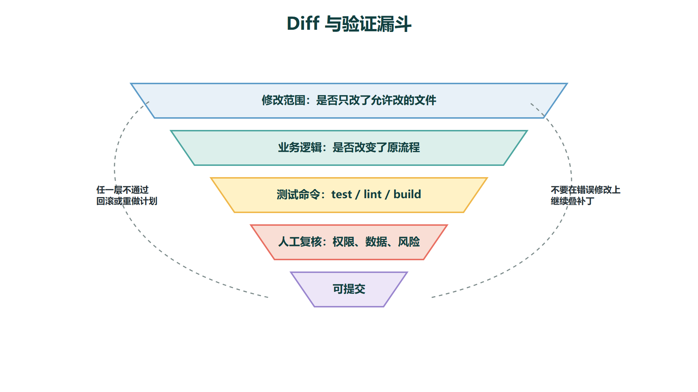

# Cursor Agent使用：从Ask到Plan到执行



Cursor Agent 的核心价值在于把"对话"变成"可执行的软件工程循环"。它可以检索代码、读取文件、运行命令、修改文件、控制浏览器和生成图片，但这些能力只有在任务边界清楚、上下文足够、验证标准明确时才会稳定发挥作用。换句话说，Agent 的能力上限取决于你怎么给它设定边界——边界越模糊，输出越不可控；边界越具体，结果越接近工程交付标准。

从使用模式看，可以把 Cursor 的 Agent 工作流分成三个层次：**Ask 用来理解系统，Plan 用来设计技术方案，Agent 用来小步执行。** 这三个层次不是线性的一次性流程，而是在同一个开发任务中反复循环的——先读懂了再规划，规划好了再执行，执行过程中发现问题就回到 Ask 重新理解，然后修正计划。很多复杂任务真正难的不是写代码本身，而是先弄清楚该改哪里、为什么改、改完如何验证、改动会影响哪些隐含的依赖。

不要把所有问题都直接丢给执行模式。如果你还不确定问题的边界和影响面，先走 Ask 和 Plan，成本远低于盲目执行后再回滚。

## 一、Ask：先读懂系统，再决定怎么动手

Ask（只读式提问）适合用在项目的探索阶段。典型场景包括：刚接手一个新项目、想理解某个模块的调用链、定位一个 Bug 的根因、或者评估一个需求涉及的文件范围。在这些场景下，最好的策略是先让 Agent 只读分析，不要让它一上来就动手改。

Ask 模式下的 Agent 不会修改任何文件。它可以搜索代码、追踪引用、解释实现逻辑、对比不同分支的差异、总结模块依赖关系。这个阶段的产出不是代码改动，而是对你当前问题的结构化理解。一份好的 Ask 输出应该让你清楚地看到：问题出在哪个文件、调用链是怎么走的、有哪些相关的配置和测试、如果要修改大概会碰哪些文件。

比较好的提问方式是把你想知道的事情分解成具体的检查点，而不是笼统地问"帮我看看登录功能"。例如：

```
先不要修改代码。请阅读用户登录相关实现，说明：
1. 请求从 Controller 到 Service 的调用链；
2. 密码校验和 Token 生成分别在哪里；
3. 当前异常处理方式，以及不同异常对应的 HTTP 状态码；
4. 如果我要增加登录失败次数限制（比如 5 次锁 15 分钟），可能涉及哪些文件以及改动点。
```

这种结构化的提问会让 Agent 先建立项目地图。等你确认它的理解基本正确、涉及的文件范围符合预期，再进入 Plan 或执行阶段，成功率会显著提高。一个常见的反模式是跳过 Ask 直接进入执行——Agent 在不了解全貌的情况下改了局部代码，改完后才发现漏掉了关联的配置、测试或下游消费者，于是反复回滚和修补，耗费的时间远超一开始认真读代码的几分钟。

## 二、Plan Mode：把模糊需求变成显性技术方案



Cursor 官方文档中，Plan Mode 的定位是：在写代码前生成详细的实现计划。Agent 会先研究代码库、提出澄清问题、生成可供审阅和编辑的计划，然后再由用户决定是否执行。这个过程本质上是一次"技术方案评审"——只不过评审的对象是 Agent 提出的方案，而不是你写的设计文档，Plan Mode 在以下场景中最有价值：

- 一个需求存在多种可行的实现路径，需要对比取舍
- 改动会触碰多个模块、多张数据库表、或多个微服务
- 需要兼顾向后兼容性、权限控制、测试策略和部署顺序
- 需求本身还不够清晰，需要 Agent 通过提问帮你收敛范围
- 你希望在代码被修改之前先审查技术方案，而不是事后补救
计划不是形式主义。它的作用是把隐含需求变成显性步骤。比如"增加文件上传"这个需求，如果直接丢给 Agent 执行，它可能只做了上传接口和前端组件——但实际涉及的是一整条链路：上传接口设计、文件大小和 MIME 类型校验、对象存储（本地 / OSS / S3）选型与配置、上传进度与断点续传策略、数据库记录与业务关联、访问权限控制、前端组件与错误提示、并发与超时处理、测试用例和接口文档更新。如果不先规划，Agent 很容易只做最表面的那层，后续每一层缺失的功能都要靠你发现和追问，效率反而更低。

Plan Mode 的另一个实用技巧是：**在计划阶段就让 Agent 列出已知的未知项。** 比如"这个改动需要兼容哪些旧版本接口，当前代码库里没有明确标注，请你在计划中标记为待确认"。这比执行到一半才发现信息缺失要好得多。

images/cursor_plan_agent_timeline.png

## 三、执行：带上验收标准再让 Agent 动手

进入执行阶段时，提示词必须包含明确的验收标准。Agent 可以运行测试、读取终端输出、检查页面截图，但前提是你告诉它"什么算完成"。没有验收标准的任务就像没有测试用例的开发——Agent 可能改了很多代码，但你是否满意只能靠运气。一个结构化的可执行提示词通常包括以下要素：

| **组成** | **说明** | **示例** |
| --- | --- | --- |
| 目标 | 要完成什么 | 实现用户导出 Excel 功能 |
| 范围 | 只改哪些文件或模块 | 只修改 admin/export 相关模块，不动其他 Controller |
| 约束 | 不能做什么 | 不改变现有分页接口的返回结构，不引入新的第三方依赖 |
| 验证 | 如何证明完成 | 运行 export 相关单元测试全部通过，手动调用下载接口验证文件内容正确 |
| 汇报 | 最后输出什么 | 列出所有修改的文件、测试执行结果、未覆盖的风险点 |

如果任务会影响线上行为或涉及生产数据，建议让 Agent 每完成一个阶段就停下来汇报，而不是一次性大范围改动。一个复杂任务可以拆成"理解现状 → 写计划 → 改后端 → 改前端 → 补测试 → 验收"六个回合，每个回合独立验证通过后再进入下一步。这样做的好处是：每一步的上下文是可控的，出了问题可以精确定位，不需要回滚整个任务。

## 四、Checkpoints 与回滚：保护探索，不替代版本控制


Cursor Agent 会在会话中自动创建 Checkpoints，用于保存 Agent 修改前后的文件快照。官方文档明确提醒，Checkpoints 的设计目的是撤销 Agent 的探索性修改——它不是长期版本控制工具，也不应该在团队协作中替代 Git。

理解 Checkpoints 的定位很重要：它解决的是"Agent 刚才改错了，我要回到改动前的状态"这个即时回退需求。但它不提供分支历史、不记录提交者、不支持合并冲突解决、也不会在会话结束后持久保留。把 Checkpoint 当成 Git 使用，迟早会丢失有价值的改动历史。

在学习阶段或探索性开发中，一个更稳妥的流程是：

1. 在不确定的改动开始前，先手动确认 Checkpoint 已创建，作为安全网
2. 改动过程中，Agent 每完成一个可工作的小步骤，就用 Git 做一次有意义的提交
3. 对风险较高的方案，先在独立分支上验证，确认可行后再合并
4. 大任务尽量小步提交，让 Git 历史本身就是改动意图的文档
5. 每次 Agent 汇报完成后，要求它列出当前的验证证据（测试结果、截图、日志等）
这个流程的核心思想是：**Checkpoint 管"试错的回退"，Git 管"确定的版本"，**两者不冲突，但职责不能混淆。

## 五、排队消息与中途打断：控制 Agent 的执行节奏

Cursor 支持在 Agent 执行任务时排队后续消息。两种发送方式对应不同的使用场景：普通 Enter 会把消息放进队列，等当前任务完全结束后再按顺序执行；强制发送（Cmd/Ctrl + Enter）则会立即注入到当前任务的上下文里，用来中途纠偏。

排队消息适合补充下一步任务，在你对当前方向满意的前提下提前安排后续步骤。比如 Agent 正在改后端接口，你可以排队一条"改完后顺便补 README 中对应的接口说明"。因为排队消息不会打断当前任务的执行逻辑，Agent 会在当前任务验证完成后再处理它，不会有上下文切换的成本。

强制发送适合阻止明显的方向错误。比如 Agent 开始修改数据库表结构但你只想要加一个兼容层，你可以立即发送"先停一下，不要改数据库结构，只在 Service 层加兼容逻辑"。这条消息会立刻进入 Agent 的上下文，Agent 需要即时调整执行方向。

但要注意：**中途打断的频率越高，Agent 的上下文越容易混乱。** 每次打断都意味着 Agent 需要放弃当前的部分推理链条、接受新的指令、在变动后的上下文中重新定位。如果连续打断两三次，Agent 的行为可能变得不稳定。更好的做法是：遇到方向明显错误时，与其反复打断，不如回滚到最近的 Checkpoint，回到 Plan 阶段重新对齐方案，再进入执行。修正方案的成本通常低于在错误方向上反复修补的成本。

## 六、任务拆分模板：从一次性请求走向工程化流程



把复杂开发任务拆成可验证的阶段，是区分"用 AI 辅助编码"和"把编码完全交给 AI"的关键实践。下面这个模板涵盖了从理解到交付的完整生命周期：

| **阶段** | **目标** | **Agent 行为** | **产出** |
| --- | --- | --- | --- |
| 读取 | 弄清现状 | 搜索相关文件、追踪调用链、说明模块依赖关系 | 现状分析报告 |
| 计划 | 明确方案 | 生成步骤、列出风险、提出待确认问题、给出可选路径 | 技术方案文档 |
| 修改 | 小步实现 | 编辑文件、保持修改范围不扩散 | 代码 Diff |
| 验证 | 证明有效 | 运行测试、检查页面截图、核对接口返回 | 验证证据 |
| 总结 | 便于复盘 | 汇总修改文件、未覆盖风险、后续建议 | 改动说明 |

每个阶段完成后再进入下一个，而不是在一轮对话中跑完所有阶段。如果验证阶段发现问题，回到读取或计划阶段重新开始循环，而不是在修改阶段反复修补。

这个模板不仅适用于代码开发任务。写一篇技术教程时，同样可以按这个节奏拆分：先让 Agent 读取参考材料并理解主题边界，再生成大纲和图表清单，接着写初稿，然后校验事实准确性、检查图片引用是否完整，最后输出终稿。这样得到的内容更接近工程化产物——每个环节的质量是可控、可检查的——而不是一次性生成的大段文本。
