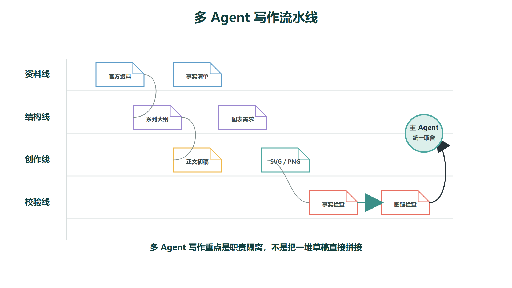
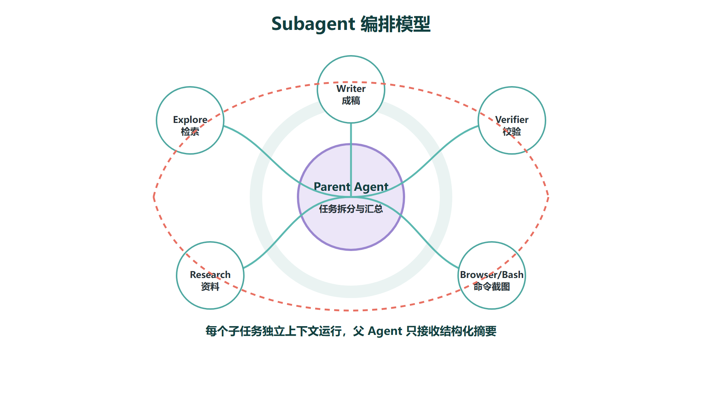
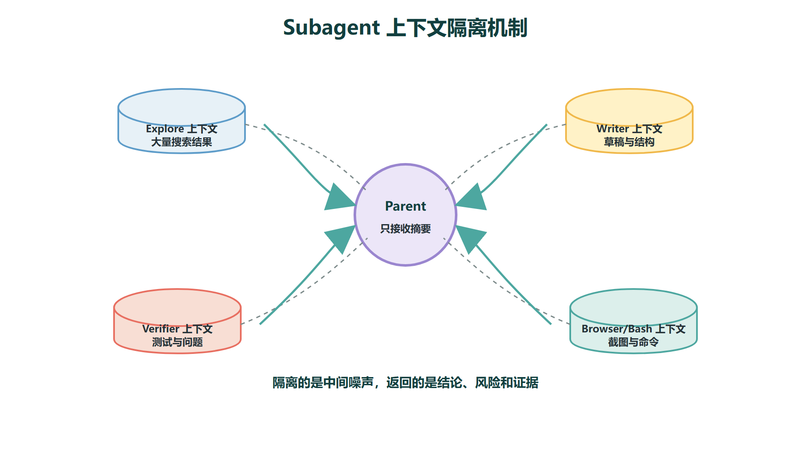

# Cursor多Agent写作工作流

多 Agent 写作不是让多个模型同时写几段文字然后拼在一起。更准确的理解是：**把一篇技术教程的生产过程拆成若干职责独立的环节——资料检索、大纲设计、正文写作、图表生成、事实校验、格式检查和人工终审——每个环节由专门的 Agent 负责，主 Agent 负责协调输入输出并保证最终一致性。** 拆分的目的不是变热闹，而是让每个环节的质量可控、出了问题可以精准定位，而不是面对一篇混乱的长文无从下手。



对于技术教程类内容，尤其是 AI 应用开发、Agent 原理、RAG、MCP、Cursor 和 Codex 这类主题，直接让一个 Agent 一口气写完最容易出现三个问题：**事实不稳**（凭训练数据印象写，而非基于官方文档）、**结构松散**（前面讲定义、中间开始跑题到使用心得、后面又回到原理但已经乱了）、**图片缺失**（文章引用了图片但文件不存在，或者图片和正文描述不一致）。多 Agent 工作流的价值就在于把这三个问题拆成独立环节，逐一解决。

## 一、为什么写作也需要多 Agent

技术写作和普通随笔有本质区别。它同时要求事实准确、结构严谨、图文一致、术语稳定、面向读者可复用。这五个要求在单一 Agent 的长上下文生成中极易互相挤压——Agent 在写后面段落时可能已经"忘记"了前面设定的风格约束，在引用了某张图片后不会再主动检查图片文件是否真的存在，在阐述某个概念时可能凭训练数据印象而非最新官方文档描述。

单一 Agent 写作的典型翻车模式包括：

- 风格漂移：前面严格按技术讲义风格写定义和机制，写到后面变成公众号式"效率提升心得"
- 事实漂移：前面引用了官方文档的表述，后面开始凭印象写"Cursor 支持 X 功能"（其实不支持）
- 配图断裂：正文写了"如下图所示"，但对应的图片在生成过程中被遗漏或路径写错
- 术语不一致：同一个概念在第一节叫"上下文窗口"，在第三节叫"提示词长度"
多 Agent 写作的核心逻辑是**职责隔离**：每个 Agent 只负责一件事，这件事的输入和输出都有明确定义，出错时可以追溯到具体环节。

| **Agent** | **职责** | **输入** | **输出** |
| --- | --- | --- | --- |
| 资料 Agent | 读取官方文档、本地知识库和参考文献，提取可靠事实 | 主题 + 参考文件列表 | 事实清单（每条标注来源） |
| 大纲 Agent | 组织章节结构、确定学习路径和关键图表需求 | 事实清单 + 目标读者 | 目录 + 每节核心问题 + 配图清单 |
| 写作 Agent | 按技术讲义风格生成正文 | 大纲 + 事实清单 + 风格约束 | 初稿 |
| 图表 Agent | 生成流程图、架构图等配图 | 配图清单 + 正文中图位标注 | PNG 图片文件 + 引用路径 |
| 校验 Agent | 检查事实准确性、图片引用完整性、术语一致性、格式规范 | 初稿 + 图片目录 | 问题清单（逐条标注位置和严重程度） |
| 主 Agent | 汇总各 Agent 产出、修订冲突、保持系列风格统一 | 所有子 Agent 的产出 | 最终文档 + 未覆盖风险说明 |

这张表的核心在于**每个 Agent 的输入和输出都明确到了文件级别**。不是"资料 Agent 大概了解一下"——而是"资料 Agent 必须输出一份事实清单，每条标注来源"。

## 二、Cursor Subagents 的工作方式

Cursor 官方文档中，Subagents 是 Agent 可以委托任务的专门助手。每个 Subagent 拥有独立的上下文窗口，可以处理特定类型的工作并在完成后把结果返回给父 Agent。



Subagents 最关键的设计特性是**上下文隔离**。不同环节产生的中间信息不会互相污染：

- 资料检索会产生大量网页摘要、搜索结果和中间判断，如果全部堆在主对话里，会迅速消耗上下文窗口，并稀释 Agent 对写作风格约束的注意力
- 图表生成会产生很多布局尝试、失败的渲染和样式调整，这些过程细节不应该出现在正文写作的视野里
- 校验 Agent 会产生逐条的问题清单，有些条目需要反复核对和修正，这些来回应该在独立的上下文中完成，确认无误后再把最终结果返回主 Agent


上下文隔离的工程价值在于：**主 Agent 看到的不是每个子任务的中间过程，而是经过整理的结构化结果。** 就像你在团队协作中不会把每个人的草稿纸都摊在主文档旁边，而是要求每个人交付自己的最终产出，主 Agent 再统一整合。

Subagents 的另一个实际优势是**并行执行**。资料检索和大纲设计可以并行，图表生成和正文写作可以部分并行。对于一组三五篇的技术教程系列，并行执行可以显著缩短整体交付周期。

## 三、技术教程写作的标准流程

基于多 Agent 的思路，一组技术教程的稳定写作流程可以设计为以下七个阶段：

1. **主 Agent 定调**：明确目标读者、系列目录、每篇文章的核心问题、统一的风格约束（技术讲义而非公众号风格）和最终交付路径
2. **资料 Agent 查证**：读取官方文档、本地知识库和参考文献，输出事实清单，每条标注来源。这一步做完后，后续所有 Agent 都以这份清单为事实依据，不再凭训练数据印象写作
3. **大纲 Agent 拆结构**：根据事实清单生成系列文章的结构，每篇标明目标、核心概念、关键图表需求和面试/学习价值。不要在这个阶段就开始写正文——结构没定清楚就动笔，写到一半发现漏了关键模块再回头补，成本远高于先确认大纲
4. **图表 Agent 出图**：根据每个关键流程（三步及以上的链路）生成 PNG 配图，统一图片风格和分辨率，输出到对应文章的 `images/` 目录
5. **写作 Agent 写正文**：按章节逐一生成，先定义概念，再讲机制原理，再进入工程边界和失败模式，最后落到面试表达或项目落地。避免一次性生成长文失控
6. **校验 Agent 审稿**：检查事实是否基于官方来源、图片引用路径是否存在、术语是否前后一致、格式是否规范、AI 味黑名单词汇是否出现
7. **主 Agent 终审**：统一系列口吻，修正子 Agent 之间的风格偏差，汇总最终交付文件和未覆盖风险
这个流程尤其适合课程类内容。课程文章需要先讲定义和机制，再讲结构、流程、边界、失败点和面试表达——这是一个有固定顺序的知识传递结构。如果没有大纲约束和环节拆分，AI 很容易偏离成"工具使用心得"或"效率提升文章"而不是可复习的技术讲义。

## 四、一个可复用的写作提示词模板

下面是一段适合交给 Cursor 主 Agent 作为任务启动指令的模板：

```
请用多 Agent 工作流完成一组技术教程：
1. 资料 Agent：先读取官方文档和本仓库参考文献，列出可靠事实清单，每条标注来源；不要写正文
2. 大纲 Agent：把主题拆成系列文章，每篇说明目标读者、核心概念、关键图表需求和面试/学习价值
3. 图表 Agent：为三步以上的流程生成 PNG 配图，统一风格，输出到各自文章的 images/ 目录
4. 写作 Agent：按技术讲义风格逐篇写正文——先定义概念，再讲机制原理，再进入工程边界、失败模式和面试表达
5. 校验 Agent：逐条检查——图片引用是否存在、事实是否有来源、术语是否一致、格式是否规范
6. 主 Agent：汇总所有产出，修正风格偏差，列出最终修改文件和未覆盖风险
```

这个模板的核心价值在于**把"先查资料、再定结构、再写正文、再配图、再校验"的环节依赖关系显式写出来了**。如果不写清楚，Agent 很容易为了尽快返回结果而跳过资料和校验阶段——生成的文字看起来像那么回事，但事实经不起推敲、配图不存在、术语前后打架。

## 五、什么时候不适合多 Agent

多 Agent 不是越多越好。Cursor 官方文档也提醒了，Subagents 有启动成本（每个 Subagent 需要初始化独立的上下文窗口）和额外的 token 消耗。对于一个标题、一段摘要、一处错别字或一个简单的对比表格，直接让主 Agent 完成就够了，引入 Subagent 只会增加延迟和成本而不会提升质量。

多 Agent 在以下场景中才明显值得使用：

- 文章系列较长（三篇以上），需要保持跨篇的结构一致性和术语统一
- 内容涉及需要官方资料查证的技术概念，不能让写作 Agent 凭记忆生成
- 需要生成和校验多张配图，图片和正文之间的引用关系需要独立验证
- 需要把"写作"和"审校"拆成两个独立环节，避免同一个 Agent 既当运动员又当裁判
- 需要保留主 Agent 的上下文干净，避免被大量检索结果和中间草稿污染
- 任务涉及明显不同的能力域（如图表生成 vs 文本写作 vs 事实核查），一个 Agent 难以同时兼顾
一个实用的判断标准：**如果整个任务可以在 5 分钟内靠一次对话完成，且完成后的质量你不需要第二个人的眼睛来审查，那就不需要多 Agent。如果任务本身就涉及"写 + 图 + 校验"三个明显不同的能力域，或者完成后你一定会找另一个人审一遍，那就值得拆分。**
