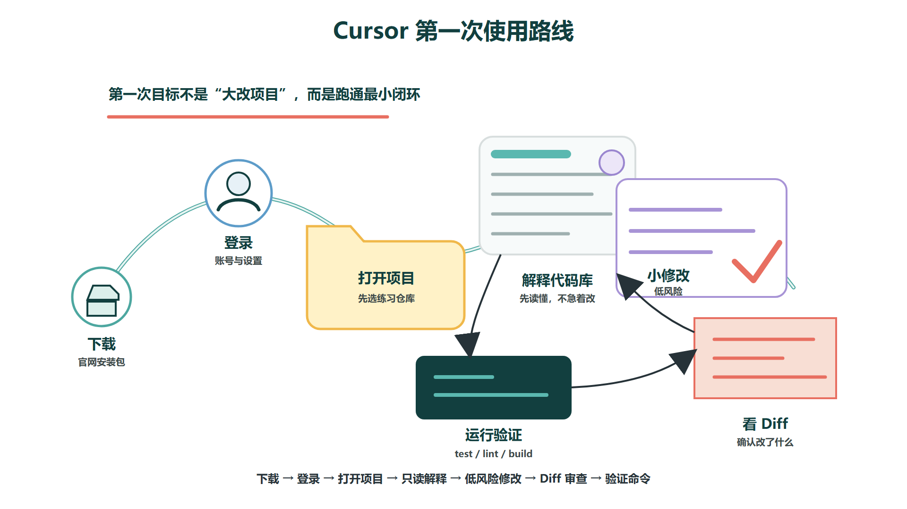
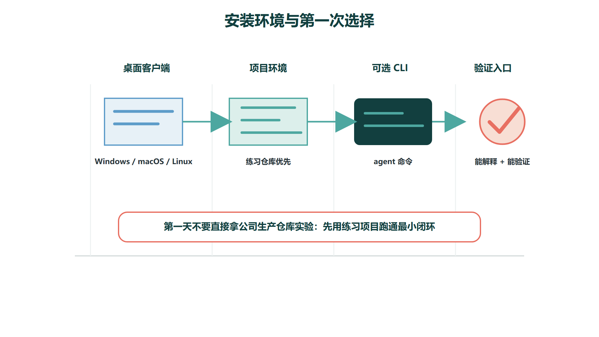
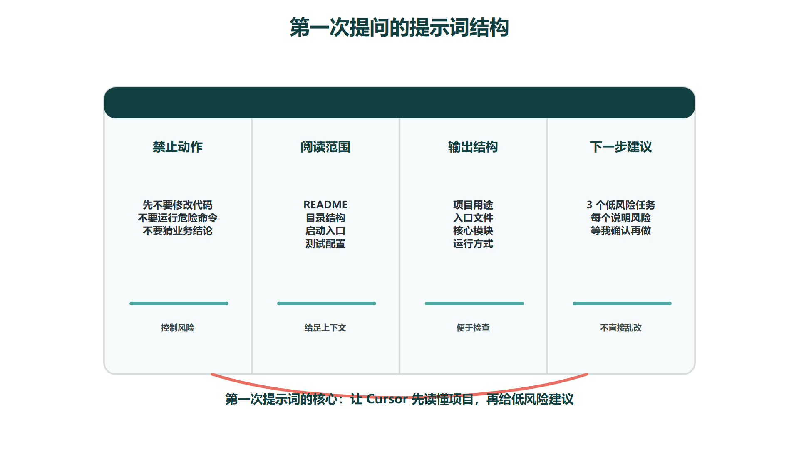
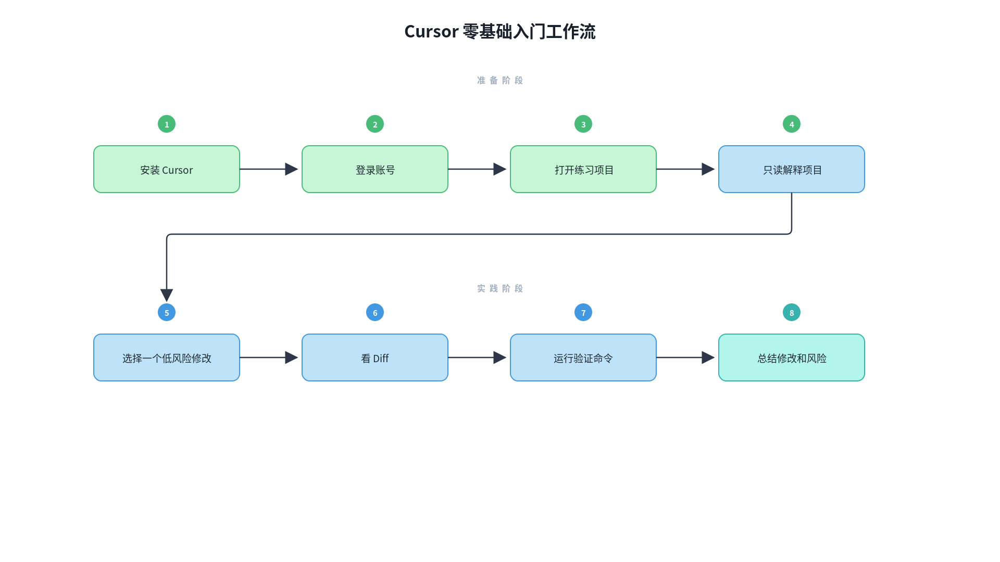

# Cursor安装与第一次使用

Cursor 的入门不应该从复杂的 Agent 编排开始，而应该先完成一个最小闭环：下载安装到本机，登录账号，打开一个项目文件夹，让 Cursor 解释代码库，做一次低风险小修改，然后检查 Diff 和运行验证命令。只要这个闭环跑通，后面的 Agent、Rules、MCP、多 Agent 写作才有真实操作基础。

从使用路径看，第一次使用 Cursor 可以分成六步：下载客户端、登录、打开项目、让 Agent 解释项目、做一个小修改、审查和验证结果。



## 一、先安装 Cursor

Cursor 是一个独立的 AI 编程编辑器，不是必须先安装 VS Code 再装插件。它的使用体验接近 VS Code，因此原来熟悉 VS Code 的同学迁移成本会比较低。



### Windows 安装

Windows 用户通常直接从 Cursor 官网下载安装包即可：

```
https://cursor.com/downloads
```

下载 Windows 版本后，运行 `.exe` 安装程序。安装完成后打开 Cursor，按提示登录账号。登录后可以先不用改任何设置，直接进入“打开项目文件夹”这一步。

如果你后续想在终端里使用 Cursor CLI，官方也提供了 Windows PowerShell 安装方式：

```
irm 'https://cursor.com/install?win32=true' | iex
```

安装后可以用下面命令检查：

```
agent --version
```

注意，CLI 不是新手第一天必须掌握的内容。刚开始先把桌面客户端用明白，后面再学习 CLI 和 Cloud Agent 更稳。

### macOS 安装

macOS 用户下载 `.dmg` 安装包，拖入 Applications 后打开即可。官方文档要求 macOS 12 Monterey 及以上版本，并支持 Apple Silicon 和 Intel 设备。

打开后同样先登录账号，再选择一个项目文件夹。第一次使用时建议选一个小项目，不要直接打开公司大型仓库或包含敏感数据的目录。

### Linux 安装

Linux 用户可以使用官方提供的包管理器方式安装。Debian / Ubuntu 推荐使用 apt 仓库，RHEL / Fedora 推荐使用 yum / dnf 仓库。官方也提供 AppImage，但包管理器方式通常更适合长期使用，因为会带来桌面图标、自动更新和 CLI 工具。

Ubuntu / Debian 示例：

```
curl -fsSL https://downloads.cursor.com/keys/anysphere.asc | gpg --dearmor | sudo tee /etc/apt/keyrings/cursor.gpg > /dev/null
echo "deb [arch=amd64,arm64 signed-by=/etc/apt/keyrings/cursor.gpg] https://downloads.cursor.com/aptrepo stable main" | sudo tee /etc/apt/sources.list.d/cursor.list > /dev/null
sudo apt update
sudo apt install cursor
```

如果只是临时体验，也可以从官网下载安装 AppImage：

```
chmod +x Cursor-*.AppImage
./Cursor-*.AppImage
```

## 二、第一次打开项目

安装完成后，第一件事不是马上让 AI 写代码，而是打开一个合适的项目文件夹。建议先选择这三类项目：

| **项目类型** | **是否适合新手第一次使用** | **原因** |
| --- | --- | --- |
| 自己的练习项目 | 适合 | 风险低，容易回滚 |
| 开源 demo 项目 | 适合 | 结构相对清楚，便于实验 |
| 公司生产仓库 | 不建议第一天直接用 | 可能涉及敏感代码、权限和误改风险 |

打开项目后，先观察左侧文件树、终端、Git 状态和项目启动方式。如果项目有 README，先让 Cursor 阅读 README；如果没有 README，可以让它从目录结构入手解释。

## 三、第一次提问：让 Cursor 解释项目

Cursor 官方 Quickstart 里建议，第一次打开项目后可以让 Agent 解释代码库，并指出主要入口和关键模块。这一步很重要，因为它会让 Cursor 先搜索项目、读取相关文件，而不是一上来就改代码。

可以直接这样问：

```
先不要修改代码。请帮我解释这个项目：
1. 这个项目主要做什么；
2. 入口文件在哪里；
3. 前端、后端、配置、测试目录分别是什么；
4. 如果我要做一个低风险小修改，应该先看哪些文件。
```

如果你打开的是 Java / Spring Boot 项目，可以改成：

```
先不要修改代码。请阅读这个 Spring Boot 项目，说明：
1. 启动类在哪里；
2. Controller、Service、Mapper 或 Repository 目录在哪里；
3. 配置文件和数据库连接在哪里；
4. 当前项目怎么运行测试或启动本地服务。
```

如果你打开的是前端项目，可以改成：

```
先不要修改代码。请阅读这个前端项目，说明：
1. 入口文件和路由在哪里；
2. 页面组件目录在哪里；
3. 状态管理和接口请求在哪里；
4. 本地开发命令是什么。
```

这类问题的重点是“只读理解”。新手不要一上来问“帮我优化整个项目”，因为 Cursor 还没有建立项目地图，容易改出你看不懂的内容。



## 四、第一次小修改：选择低风险任务

项目解释清楚后，可以让 Cursor 建议几个低风险任务。官方 Quickstart 也建议从小改动开始，例如文案、轻微 UI 问题或明显的小问题。

可以这样问：

```
请基于刚才的项目理解，给我 3 个低风险的小修改建议。
要求：
1. 不涉及数据库结构；
2. 不影响权限和登录；
3. 修改文件尽量少；
4. 每个建议说明风险和验证方式；
5. 先等我选择，不要直接修改。
```

等 Cursor 给出建议后，选一个最简单的。例如：

- 修改页面上的一段提示文案；
- 给一个按钮补充 loading 状态；
- 修复 README 里过时的命令；
- 给一个工具函数补充边界判断；
- 给已有函数补一个很小的测试。
第一次使用时，不要选择“重构整个项目”“重新设计登录系统”“接入大模型”“生成完整后台管理系统”这种大任务。先完成一个小闭环，比一次性追求大结果更重要。

## 五、看 Diff：不要直接相信生成结果


Cursor 修改完成后，要先看 Diff。Diff 能告诉你它到底改了哪些文件、每个文件改了什么。新手一定要养成这个习惯：AI 生成内容只是候选方案，不是最终答案，检查 Diff 时重点看四件事：

| **检查点** | **要看什么** |
| --- | --- |
| 修改范围 | 是否只改了你允许改的文件 |
| 业务逻辑 | 是否改变了原本不该动的流程 |
| 错误处理 | 是否漏掉空值、异常、权限判断 |
| 风格一致 | 是否和原项目命名、格式、组件风格一致 |

如果 Diff 明显不对，不要在错误修改上继续补丁。更好的做法是回滚或恢复 Checkpoint，然后把要求说得更具体再试一次。

## 六、运行验证命令

一个修改是否完成，不能只看 Cursor 说“完成了”。你需要让它运行项目已有的验证命令，例如测试、类型检查、Lint 或本地构建，可以这样问：

```
请根据这个项目已有配置，选择合适的验证命令运行。
优先级：
1. 针对本次修改的最小测试；
2. 类型检查或 lint；
3. 必要时再运行完整构建。
最后请说明命令、结果和仍然没有覆盖到的风险。
```

## 七、第一次使用的标准流程

新手可以固定使用下面这个流程：



这个流程跑通以后，再继续学习后面的操作入门、Agent 使用、项目规则、多 Agent 写作和工作原理。否则直接进入复杂 Agent 编排，很容易变成“看起来很强，但不知道哪里错了”。

## 八、最低入门标准

学完这一篇，最低要做到：

1. 能在自己的系统上安装并打开 Cursor；
2. 能打开一个本地项目文件夹；
3. 能让 Cursor 只读解释项目结构；
4. 能让 Cursor 做一次低风险小修改；
5. 能看懂基本 Diff；
6. 能让 Cursor 运行项目已有验证命令；
7. 知道不应该把公司敏感项目作为第一次实验对象。
达到这个标准之后，再学习 Cursor 的 Agent、Rules、MCP 和多 Agent 写作，就不会停留在“听起来高级但不会落地”的阶段。
