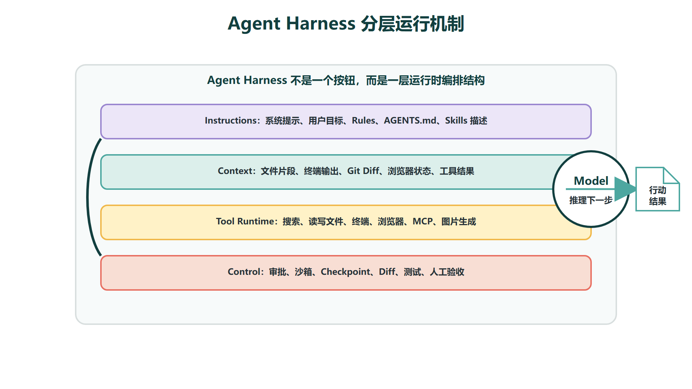
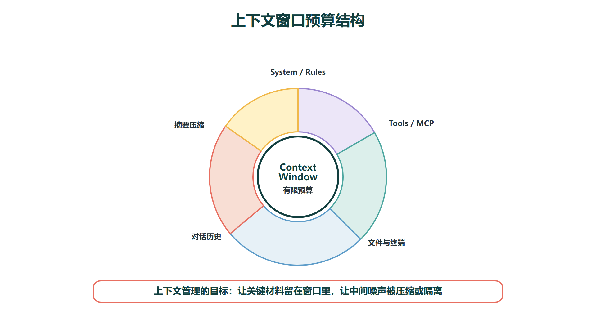
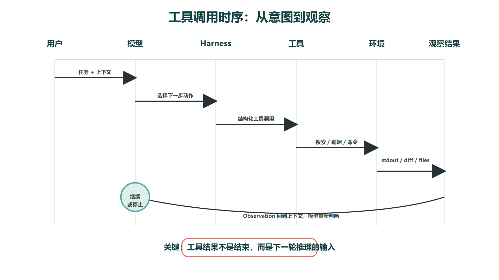
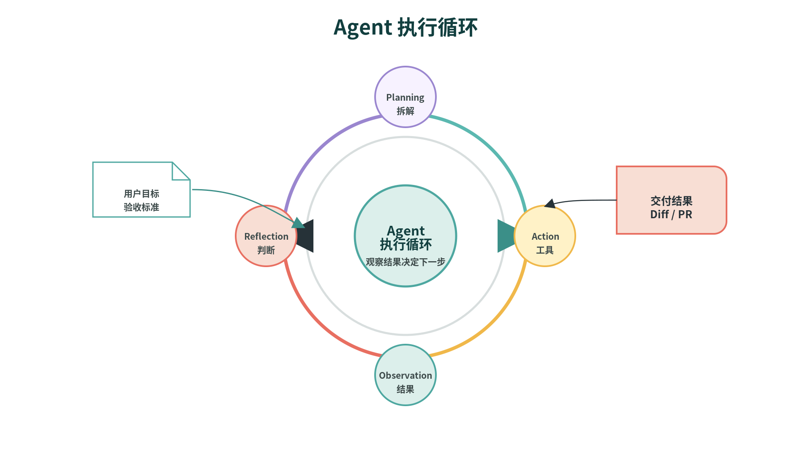
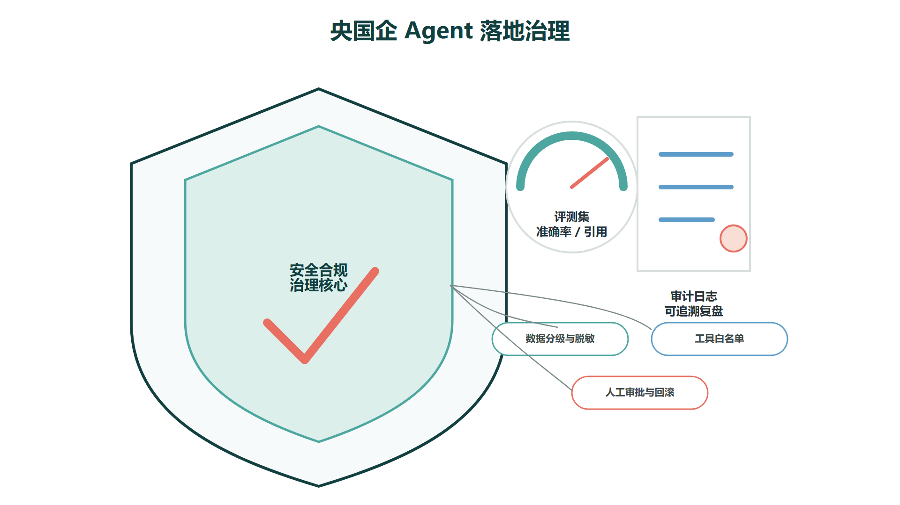

# Cursor工作原理：上下文、工具调用与模型编排

Cursor 的工作原理可以用 Agent Harness 来理解。Harness 这个词在工程语境中译为"执行框架"比"马具"更准确——它指的是围绕大语言模型建立的一层运行时环境。这层环境把指令（Instructions）、上下文（Context）、工具（Tools）和模型（Model）组织成一个可以自主行动的闭环系统，让模型不再只是被动地生成文本，而是能够主动搜索代码、读取文件、编辑内容、运行命令、观察执行结果、根据结果调整下一步行动，如此循环直到任务完成。

从系统结构上看，Cursor Agent 至少包含三类核心对象，它们之间的关系决定了 Agent 的行为边界和效果上限：

- **Instructions（指令层）**：包括 System Prompt、User Prompt、Rules（`.cursor/rules`）、AGENTS.md、Skills 描述、MCP 工具描述等。这些内容在 Agent 启动和每次对话中持续生效，定义了 Agent"应该遵守什么"和"遇到什么情况该做什么"。
- **Tools（工具层）**：包括代码搜索（Codebase Search）、文件读取、文件编辑、终端命令执行、浏览器控制、MCP 接入的外部工具等。这些工具赋予了 Agent 超越纯文本生成的能力——它能真正"动手"而非只"动嘴"。
- **Model（模型层）**：负责在当前上下文中推理"下一步应该做什么"。模型不直接执行操作，它生成的意图通过 Harness 转化为工具调用，工具结果再回注到模型的下一次推理中。
这三层的协作关系是理解 Cursor 工作方式的钥匙：**指令设定边界，工具提供能力，模型驱动决策。** 缺少任何一层，Agent 都无法完成从"理解任务"到"执行任务"到"验证结果"的完整闭环。

## 一、上下文不是记忆，而是本次推理的全部输入

很多开发者对 AI Agent 的上下文有一个常见的误解："它记住了我们之前聊过的所有东西。"更准确的描述是：**上下文是模型在本次生成时看到的全部输入文本。** 模型本身是无状态的——它不会在对话之间"记忆"任何东西。每一次生成，Cursor 都会把当前相关的系统提示、规则、工具定义、Skill 说明、对话历史、引用的文件片段、终端输出和工具调用结果重新组装成上下文窗口，模型基于这个窗口内的内容来决定下一步行动。

Cursor 官方文档提到，提示输入框旁边有 context ring（上下文环形指示器），可以实时展示当前上下文的使用情况，并将 token 按类别细分：系统提示、工具定义、Rules、Skills、MCP、Subagents、对话摘要和当前对话。这个细分的工程含义很清楚：**Agent 的效果不仅取决于模型本身的推理能力，还取决于上下文预算如何在各类信息之间分配。** 如果 Rules 写得又长又泛，它会占用本应属于关键代码片段或终端报错的 token 预算；如果对话历史太长而没有摘要压缩，模型的注意力会分散在早已无关的历史话题上。

基于这个理解，上下文管理有三个实际原则：

1. **精确引用，而非全量倾倒。** 你知道哪个文件相关就 `@文件`，不确定就 `@文件夹` 让 Agent 自己搜索。把整个项目塞进上下文是自欺欺人——超出窗口上限的部分会被静默截断。
2. **短对话优于长对话。** 完成一个子任务后开启新对话，重置上下文。长对话中的历史信息会持续占用 token 预算，而且 Agent 可能会受早期已失效的判断影响。
3. **把终端输出作为上下文主动引用。** `@Terminals` 选中报错输出，比口头转述"大概报了个什么错"准确得多。Agent 读取的是完整的堆栈信息、行号和错误类型。
真正好的提示词不是最长的，而是把目标、边界、相关文件和验收标准放在上下文中最容易被模型关注到的位置。

## 二、工具调用：让模型从"回答者"变成"行动者"

传统大语言模型的工作模式是"接收文本 → 生成文本"。Agent 与此的关键区别在于**它可以调用工具**。当 Agent 在推理过程中判断自己缺少某个信息或需要执行某个操作时，它不会凭空猜测答案，而是生成一个工具调用请求（Tool Call）：比如它认为需要了解某个模块的调用链，就调用搜索工具；需要阅读具体实现，就调用文件读取工具；需要修改代码，就调用编辑工具；需要验证修改是否正确，就运行测试命令或控制浏览器查看页面渲染结果。

这个过程可以抽象为一个标准的"感知-决策-行动-观察"循环：

1. **读取**目标和当前上下文
2. **判断**下一步需要什么信息或应该执行什么操作
3. **调用**对应的工具，传入具体参数
4. **观察**工具返回的结果
5. **更新**对任务状态的理解
6. **继续循环**（回到步骤 2），或判断任务已完成并**停止**

这个循环图中的每一步箭头都代表一次模型推理和一次工具调用的往返。理解这个循环的关键是：**Agent 不是在"一次性想好所有步骤然后执行"——它是边想边做、边看反馈边调整。** 这也解释了为什么同样的任务，结构化提示词的成功率远高于模糊提示词：模糊提示词让 Agent 每一步的决策空间变大，决策空间越大，失误的概率越高。

工具调用在带来执行能力的同时也引入了新的风险维度。模型可能调用错误的工具、传入错误的参数、在错误的时间执行操作（比如在没有确认方案前就开始改文件）。更隐蔽的风险是"工具调用结果的误读"——Agent 可能把测试失败理解得过于乐观，或者把搜索结果中的不相关信息当成关键依据。因此，工具调用机制本身需要配合**权限控制**（哪些工具可用、什么条件下可用）、**沙箱隔离**（高风险操作在受限环境中执行）和**人工复核**（关键操作需要确认）才能在生产环境中安全使用。

## 三、Rules 和 Skills 如何进入模型的决策过程

Rules 和 Skills 并不是什么神秘的"外部记忆"或"模型微调"。它们的底层机制非常直白：**Rules 和 Skills 的内容最终都会以文本形式进入 Agent 的上下文窗口或工具选择列表。** Rules 在 Agent 每次对话启动时被注入到系统提示中，作为持续生效的行为约束；Skills 的描述在 Agent 需要选择工具时出现，告诉 Agent"有一类任务可以按这个流程处理"。

这也解释了为什么规则不能写得太长。上下文窗口是有限的，每条规则都会占用 token 预算。一条 200 行的规则即便内容完全正确，也会因为占用过多预算而导致模型在关键信息（比如当前文件的实际代码内容）上的注意力下降。更糟的是，过长、过泛、无条件触发的规则会让 Agent 产生"规则疲劳"——它同时被几十条约束压制，难以判断在当前场景下哪条约束优先级更高。

好的规则应该同时满足四个标准：**短**（每条规则聚焦一个具体约束，而不是一本规范书）、**具体**（引用具体的目录、命令或命名模式）、**可触发**（通过 `globs` 限定生效范围，而不是 `alwaysApply: true` 全量加载）、**可验证**（写完之后你能够判断 Agent 是否遵守了这条规则）。

Skills 的注入方式略有不同。Skills 不会在所有对话中都加载——只有当 Agent 判断当前任务匹配某个 Skill 的描述时，它才会读取该 Skill 的完整内容并按其流程执行。因此 Skills 的 `description` 字段尤为重要：它决定了 Agent 能否在正确的时机触发正确的 Skill。

## 四、Subagents 为什么能减少上下文压力

Subagents 的核心优势是**上下文隔离**。每个 Subagent 启动时会获得一个独立的上下文窗口，只包含这个子任务相关的信息。它在自己的上下文中完成工作后，只把结果摘要返回给父 Agent，而不是把中间过程全部带回来。

这个设计对于以下类型的子任务尤其有价值：

- **代码搜索**：一次深入的代码库搜索可能浏览几十个文件、追踪多级引用、产生大量中间判断。如果全部发生在主对话中，这些搜索中间结果会挤占真正的编码讨论空间。
- **终端调试**：编译报错可能输出几百行日志，Agent 需要反复运行命令、分析错误、修代码、再运行。这个迭代过程的每一步日志不需要全部留在主上下文里。
- **浏览器验证**：Agent 通过浏览器截图验证前端页面的过程会产生大量像素级分析，这些细节对后续的架构讨论没有复用价值。
- **资料检索**：多网页搜索、摘要和交叉验证会产生大量原文引用和对比判断，不应干扰正文写作的上下文。
但 Subagents 不是免费午餐。每个 Subagent 的启动需要消耗 token 初始化独立上下文，子任务之间的协调需要主 Agent 花费额外的推理来整合结果。对于简单任务（改一个变量名、写一段注释、查一个函数定义），主 Agent 直接处理比启动 Subagent 更快也更省 token。只有当任务需要**并行执行**、**独立能力域**（如图表生成 vs 文本写作）、**独立验证**（校验 Agent 不能和被校验的 Agent 是同一个上下文）或**大量检索**时，Subagents 的开销才值得付出。

## 五、Cloud Agent 与本地 Agent 的差异

本地 Agent 在你的当前工作区里运行，所有文件读写、终端命令和工具调用都在本地环境中完成。它适合需要即时反馈、频繁审查和依赖本地开发环境（如特定版本的运行时、本地数据库、内网 VPN）的任务。你能实时看到 Agent 的每一步操作，随时打断和纠偏。

Cloud Agent 则不同。Cursor 官方资料中提到，Cloud Agent 会在独立的远程环境中工作：它通常会克隆你的仓库、创建独立分支、在远程环境中自主完成任务，完成后提供 PR 或结果供你审查。这种模式下，Agent 的执行过程对你来说是异步的——你发起任务后可以继续做其他事情，等收到通知再回来看结果。

这两种模式的适用场景有明显的分野：

- **本地 Agent 适合**：需要即时视觉反馈的前端开发、依赖本地环境的调试、需要频繁人工判断的探索性编程、修改范围不确定的代码审查
- **Cloud Agent 适合**：边界清楚的批量任务（批量修复 lint 错误、补单元测试、更新文档）、耗时的独立重构、CI 修复、不需要人工中途判断的探索性研究
Cloud Agent 不适合需求模糊的任务——因为它没有你在旁边实时纠偏，一旦方向跑偏，它会浪费大量远程计算资源在错误的方向上。它也不适合强依赖本地敏感数据的任务，除非你的远程环境经过了同等级别的安全配置。

## 六、企业落地时的治理结构

在央国企和金融机构的项目中，讨论 Agent 原理不能只讲效率，还必须讲治理。AI 编程 Agent 一旦接入代码库、终端、文档系统、业务 API 和内网数据，就不再是一个"开发辅助工具"——它进入了权限管理和审计合规的范围。治理的关键维度包括以下六个层面：

| 层面 | 关键问题 | 不治理的风险 |
| --- | --- | --- |
| 数据 | 哪些数据可以进入模型上下文，哪些必须脱敏或完全本地化处理 | 内网敏感数据通过 Agent 间接暴露给外部模型服务 |
| 工具 | 哪些 MCP 工具可以被 Agent 调用，是否需要只读限制，是否需要操作审批 | Agent 通过 MCP 越权访问生产数据库或内部系统 |
| 执行 | 终端命令、文件修改、数据库操作等高风险动作的授权边界在哪 | Agent 误执行不可逆操作（如删除、修改生产配置） |
| 验证 | 测试、静态检查、安全扫描、人工审查如何构成兜底防线 | Agent 生成的代码未经验证直接上线 |
| 审计 | 谁在什么时候让 Agent 做了什么，产生了什么结果，如何追溯 | 出了问题无法定位是 Agent 的错误还是指令的错误 |
| 回滚 | 错误修改如何恢复，PR 如何关闭或撤回，Checkpoint 和 Git 如何配合 | 无法快速回到安全状态 |

在面试场景中，如果被问到 Cursor 或 Codex 的原理，可以按"**上下文 + 工具调用 + 执行循环 + 权限治理**"这个四段式来组织回答。先说 Agent 如何通过上下文理解任务，再说它如何通过工具调用从"回答者"变成"行动者"，接着说执行循环如何让它在每一步中根据反馈调整行为，最后落到企业环境下如何通过权限、审计和人工复核控制风险。这样既讲清了技术机制，也体现了企业场景下的工程素养和安全意识。

## 七、什么时候不要用 Agent

Agent 不是所有任务的最优解。在以下场景中，使用 Agent 可能不仅不会提升效率，还会引入不必要的风险和成本：

- **需求本身还没有定**，你只是在探索可能性——这时候需要的是人的判断和产品思维，不是 Agent 替你决策
- **涉及生产数据库的写入、资金交易、合同生成、生产环境调度**等高风险操作——Agent 可以辅助分析，但执行必须经过人工审核和审批流程
- **没有测试、没有日志、没有人工验收标准**——Agent 不知道它是否成功了，你也不知道
- **项目结构极度不稳定**或正在大规模重构中——Agent 无法判断哪些文件是当前的、哪些已经废弃
- **任务非常小**，用 Tab 补全或 Inline Edit 在几秒内就能完成——启动 Agent 的上下文成本远超任务本身的成本
- **输出需要强风格判断和人工深度编辑**——比如写一篇面向特定读者群体的技术文章，AI 可以提高初稿效率，但最终的口吻和取舍需要人把关
images/cursor_agent_failure_recovery_state_machine.png

一个简单的判断原则：**Agent 的价值和任务的可验证性成正比。** 任务越容易定义"怎么算完成"（测试通过、页面渲染正确、Diff 符合预期），Agent 越能发挥价值。任务越依赖主观判断和模糊标准（"写得更有吸引力""架构设计得更优雅"），Agent 越可能偏离你的意图。

总体来看，Cursor 的底层逻辑并不是"AI 自动写代码"，而是**"模型在指令约束和工具支持下执行工程循环，并在每个节点接受人工验证"**。理解这一点后，使用方式会更稳：先给清晰的目标、上下文和边界，再让 Agent 在受限范围内规划和执行，最后用测试、Diff 和人工审查形成闭环。这个闭环的最后一环永远是人——Agent 可以提高前三环的效率，但不能替代最后一环的判断。
