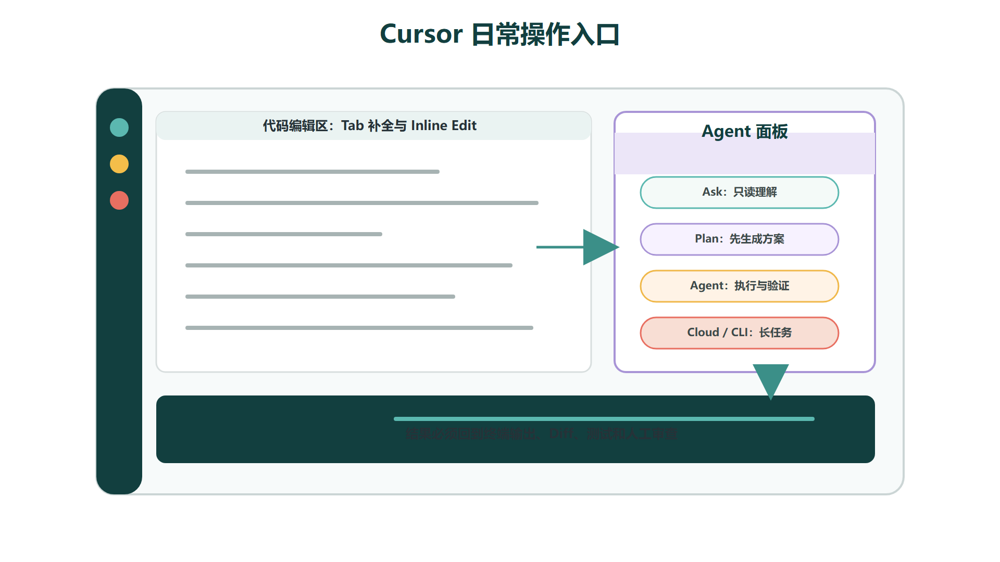
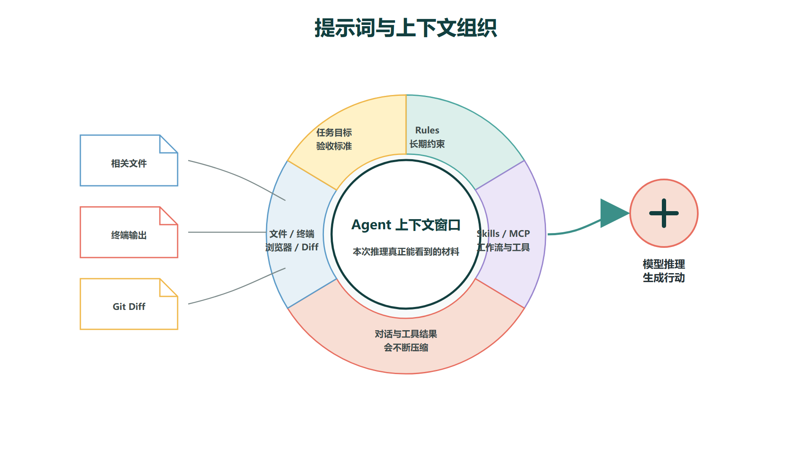
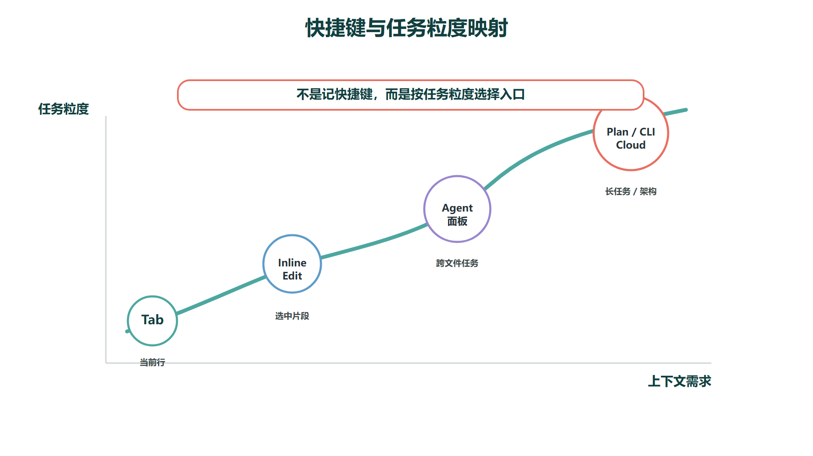

# Cursor操作入门：界面、快捷键与上下文



Cursor 的日常使用可以分成四个入口：Tab 补全、Inline Edit、Agent 面板和 CLI / Cloud Agent。学会区分这四个入口不是为了让技能面板看起来更丰富，而是因为**不同粒度的任务需要不同深度的上下文、不同范围的工具权限和不同强度的验证流程**。用错了入口，轻则效率低，重则 Agent 在你不注意的时候改了你没打算动的代码。

具体来说：Tab 适合当前光标附近的小步续写，上下文窗口仅限于附近几十行代码，工具权限为零——它只会给你建议，不会主动改文件。Inline Edit 适合选中一段代码或文字后做局部修改，上下文聚焦于选中区域加上你的指令，它有能力替换选中内容但不会越界。Agent 面板适合跨文件任务，它可以搜索、读取、编辑、运行命令，上下文窗口更大，但同时也意味着你要给它更明确的边界。CLI / Cloud Agent 则适合把任务交给终端或远程环境长时间执行，脱离交互式界面。

从工程效率看，真正重要的不是把每个快捷键都背下来，而是**知道什么任务该进入什么入口、该给多少上下文、该设定什么验收标准**。很多新手的问题不是不会用 Cursor，而是把所有任务都交给同一个聊天框——简单的补全也丢给 Agent、复杂的跨模块重构也在同一个对话里堆上下文，导致上下文混乱、修改范围失控、结果难以复查。

## 一、Tab 补全：适合小步编码，上下文窄但反馈快

Tab 补全是 Cursor 中最轻量的 AI 能力。它的工作机制是在你编码时持续分析当前文件内容、光标位置和附近代码结构，动态生成下一步最可能的代码片段，并以灰色幽灵文本的形式展示在编辑器中。你按 Tab 接受建议，按 Esc 忽略，继续打字则建议自动消失。整个过程不涉及文件修改、命令执行或跨文件检索，是最安全、打断最少的 AI 辅助方式。

它的优势在于速度快、零摩擦、不出编辑区。适合的场景非常明确：补齐函数参数、继续写重复结构、生成相似的条件分支、补全符合上下文的注释、填写结构体或 DTO 字段映射。在这些场景下，Tab 的理解范围刚好覆盖当前代码块，不需要知道你项目的整体架构。

但 Tab 的限制也同样清晰：**它的上下文窗口只覆盖当前文件和少量相邻文件，不理解跨文件的接口约定、业务规则和架构约束。** 比如你正在写一个 Controller 方法，Tab 可以自然地补出参数校验和返回结构，但它不知道这个接口应该调用哪个 Service 方法、是否需要事务注解、权限校验应该放在哪一层。如果你接受了 Tab 的建议而没检查这些隐含约束，代码能跑通，但不符合项目规范。

一个实用的判断标准：**如果改动的影响范围不出当前函数或当前文件，用 Tab；如果改动涉及多个文件的协调、业务规则的判断或测试用例的更新，切到 Agent。**

适合 Tab 的任务：

-   补齐重复的字段映射和 getter/setter
    
-   继续写与前几个测试用例结构相似的用例
    
-   补全简单的 if-else / switch 分支
    
-   根据上一行注释风格继续写文档注释
    
-   接受一段明显符合当前上下文风格的代码续写  
    不适合 Tab 的任务：跨模块重构、修复涉及多文件的复杂 Bug、设计数据库表结构、统一项目编码规范、分析线上日志。这些任务需要更多上下文和验证步骤，应该交给 Agent 或 Plan Mode。
    

## 二、Inline Edit：适合局部改写，关键在于说清楚边界

Inline Edit 通过 `Cmd/Ctrl + K` 唤起，对当前选中的代码或文字区域执行一次性修改。和 Tab 比，它的目标性更强——你不是在"接受一个建议"，而是在"下达一个修改指令"。和 Agent 比，它的范围更窄——它只操作选中区域，不会主动搜索其他文件或运行终端命令。

Inline Edit 最常见的翻车场景是"越改越远"。你只打算把一个变量名改得更语义化，结果它顺手把周围三四个方法的实现也重构了；你只想把一段注释改得更工程化，结果它把整节文章重新组织了一遍。这类问题的根源不在 AI 能力太强，而在于提示词没说清楚"你可以改什么"和"你绝对不能动什么"。

写好 Inline Edit 提示词的核心技巧是 **"目标 + 范围 + 不动清单"三要素**。以下对比可以说明问题：

| 不清楚的写法 | 更好的写法 | 差别在哪 |
| --- | --- | --- |
| 优化一下 | 保留函数签名和返回结构不变，只优化异常处理和日志输出格式 | 明确了"不动什么" |
| 改得专业点 | 改成技术讲义口吻，保留原有技术含义和代码示例，不要加入营销表达 | 给定了风格方向且设了禁止项 |
| 修一下 | 修复空指针风险：在 line 24 的 user.getName() 前加 null 检查，保持现有单元测试通过 | 指向了具体行号、具体操作、验证条件 |

如果一段代码的修改边界本身就不清晰——比如你只说"这段代码写得不好，改一下"，但自己也没想清楚哪里不好——更好的做法是先用 Ask 模式让 Agent 分析这段代码的问题，再决定改什么。在没想清楚边界之前就触发 Inline Edit，等于让 Agent 替你决定修改范围，结果很难可控。

## 三、Agent 面板：适合跨文件任务，需要结构化提示词

Agent 是 Cursor 中最接近"软件工程助手"的交互模式。和 Tab / Inline Edit 不同，Agent 拥有完整的工具链权限：它可以搜索项目文件、读取任意代码、编辑多个文件、执行终端命令、查看运行结果，并根据结果决定下一步操作。官方文档将 Agent 描述为可以独立完成复杂编码任务、运行终端命令并编辑代码的助手。

Agent 的能力由三个要素决定：**指令（Instructions）** 定义行为边界和项目约定，**工具（Tools）** 决定它能读什么、改什么、运行什么，**模型（Model）** 决定推理深度和生成质量。这三个要素中，指令是你最直接的控制杠杆——模型和工具主要由 Cursor 版本决定，而指令是你每次都可以精确调校的。

适合 Agent 的任务通常具有"跨文件、需验证、多步骤"的特点：

-   阅读项目结构并完整解释某个功能的调用链路
    
-   修改多个文件完成一个端到端的需求
    
-   根据报错信息定位根因并修复，同时补上防止复现的测试
    
-   生成测试用例、运行、根据失败结果修正、再运行直到通过
    
-   根据设计图实现 UI 组件及其状态管理
    
-   为技术文章生成配图并校验所有图片引用是否完整  
    使用 Agent 时，提示词建议包含四个层次，按信息量递增：
    

```markdown
请修改用户注册流程：
1. 目标：增加手机号重复注册时的明确错误提示
2. 上下文：先阅读 src/modules/auth 下的现有注册实现，了解当前流程
3. 约束：保持现有接口返回结构不变，不修改数据库 Schema，不引入新的第三方依赖
4. 验收：修改后运行 auth 相关的全部单元测试，列出修改的文件、验证结果和未覆盖的边界情况
```

这个提示词比"帮我修一下注册问题"有效得多，因为它同时给了 Agent **搜索范围**（去哪里读代码）、**行为边界**（什么不能改）、**完成标准**（怎么算做完）。缺少任何一层，Agent 的决策空间就变大了——决策空间越大，结果越不可预测。

一个容易被忽视的实践是：**在提示词中明确告诉 Agent “先读再改”。** 很多错误来自于 Agent 在不了解现有实现的情况下直接动手，改完才发现漏掉了关联逻辑。让 Agent 先搜索和阅读相关代码，再把理解汇报给你确认，最后动手修改，虽然多了一步交互，但避免了大部分"改错地方"的问题。

## 四、上下文引用：不要猜，也不要全塞进去



Cursor 支持用 `@` 符号在提示词中精确引用上下文。可引用的对象包括文件、文件夹、文档、终端输出、历史对话、Git Diff 和内置浏览器内容。官方文档的建议是：当你明确知道哪些文件与当前任务相关时，应该主动引用；当你不确定时，可以让 Agent 自己搜索相关文件。

这个功能的深层价值在于**它让你手动控制 Agent 的上下文窗口构成**。大语言模型的上下文窗口是有限的，而且窗口内信息越多、越杂，模型对关键信息的注意力越容易被稀释。把整个 `src/` 目录喂给 Agent，不如精确引用当前任务涉及的两个文件和一条终端报错信息，对日常开发来说，最常用的引用类型和场景如下：

| 上下文类型 | 适用场景 | 为什么用它 |
| --- | --- | --- |
| @文件 | 明确知道要修改哪个文件 | 把 Agent 注意力精确锚定到目标 |
| @文件夹 | 一个模块内有多处相关逻辑，但不确定具体哪些文件 | 给搜索范围但不假设具体文件 |
| @Terminals | 让 Agent 读取编译报错、测试失败输出、构建日志 | 把错误信息作为结构化上下文注入 |
| @Browser | 前端页面调试、截图验收、视觉回归 | 让 Agent "看到"渲染结果而非猜测 |
| @Commit / @Branch Diff | 让 Agent 审查当前改动、生成 PR 描述 | 把版本差异直接作为分析材料 |

引用的核心原则是"够用不冗余"。如果你知道改登录功能只涉及 `auth.controller.ts` 和 `auth.service.ts`，就引用这两个文件，不要引用整个 `src/`。如果你不确定涉及哪些文件，引用 `src/auth/` 文件夹让 Agent 自己在目录内搜索。上下文引用是一个"逐步收敛"的过程，不是一次性的"全选粘贴"。

还有一个值得养成的习惯：**把终端输出作为上下文主动引用。** 很多开发者习惯自己看一眼终端报错然后口头转述给 Agent。更好的做法是直接 `@Terminals` 选中那段报错输出——Agent 读取的是完整的堆栈信息、行号和错误类型，比你的转述准确得多。尤其是在调试构建失败、类型错误和测试不通过时，原始终端输出的价值远超人工概括。

## 五、常用快捷键：先掌握六组核心操作



不同操作系统和键位设置下快捷键可能略有差异，但 Cursor 的快捷键体系中有六组操作覆盖了日常使用的绝大多数场景。初学时不需要追求快捷键全覆盖——先把下面这六组练成肌肉记忆，已经足够高效完成学习和项目任务。

| 操作 | 常见快捷键 | 用法 |
| --- | --- | --- |
| 打开 Agent / Sidepanel | Cmd/Ctrl + I 或 Cmd/Ctrl + L | 进入 Agent 对话，启动跨文件任务 |
| 模式切换 | Shift + Tab | 在 Agent 模式之间切换 |
| 打开 Inline Edit | Cmd/Ctrl + K | 对选中代码执行局部编辑 |
| 命令面板 | Cmd/Ctrl + Shift + P | 查找设置、命令和扩展 |
| 切换模型 | Cmd/Ctrl + / | 在当前对话中切换底层模型 |
| 接受 Tab 建议 | Tab | 接受灰色幽灵文本的补全建议 |

记忆这些快捷键时，一个更自然的方式是把它们和入口对应起来：Tab 只管 Tab 键，Inine Edit 记 `Cmd/Ctrl + K`，Agent 记 `Cmd/Ctrl + I` 或 `Cmd/Ctrl + L`，模式切换记 `Shift + Tab`。剩下的命令面板和模型切换属于"偶尔用到但不急"的操作，可以在实际使用中逐步熟悉。

## 六、入门阶段最常踩的三个坑

理解 Cursor 的四种入口和快捷键之后，入门阶段仍然有几个认知陷阱值得单独拎出来说。这些坑不是操作层面的——你不会因为按错了快捷键而翻车——而是**把 AI 编程工具当成黑箱使用，缺少必要的工程审阅习惯**。

**第一个坑：提示词越模糊，越依赖 Agent 替你决策。**

很多人刚开始用 Agent 时，会把它当成搜索引擎用——丢一句话过去，期待它给出完整答案。但 AI 编程和搜索引擎有本质区别：搜索引擎帮你找已有信息，Agent 帮你生成新代码。当你给的提示词模糊时，Agent 不会拒绝你，而是会用它的默认偏好填补你留下的空白。这些默认偏好可能不符合你的项目规范、代码风格和架构意图。

解决方式很简单：**把提示词的四个层次（目标、上下文、约束、验收）当成最小模板**，哪怕只写目标也得补一句约束（"不动接口结构"也算约束）。好的提示词不是长篇大论，而是没有歧义的边界设定。

**第二个坑：把整个项目上下文丢给 Agent，结果反而更差。**

上下文窗口大不等于 Agent 更聪明。过多的上下文会带来两个问题：注意力稀释和成本膨胀。在混杂的上下文中，Agent 可能关注了不相关的文件、错误地推断了项目结构、或基于过时的代码片段做出建议。更实际的问题是，大型项目的上下文加起来远超当前模型的窗口上限，Agent 会在你看不到的地方截断信息，而截断掉的可能恰好是最关键的那段。

更好的做法是分层引用：先用 `@文件夹` 划定搜索范围，Agent 搜索后再用 `@文件` 锚定具体修改目标，每完成一个子任务就开启新对话重置上下文。**短对话 + 精确引用 > 长对话 + 海量上下文。**

**第三个坑：不看 Diff 就直接接受 Agent 的修改。**

AI 生成的代码可能看起来逻辑通顺、格式整洁，但边界条件、权限判断、异常处理和事务边界未必经得起推敲。Agent 不会主动告诉你"这里有个空指针风险我没处理"或"这段逻辑在并发场景下有问题"——它生成的是它认为最可能的答案，而不是经过验证的正确实现。

养成三个习惯可以避免大部分翻车：每次 Agent 修改完文件后，先看 Diff 确认改动范围符合预期；关键模块的改动跑一遍相关测试；涉及权限、资金、合同的逻辑必须人工逐行检查。**Agent 的终点不是"代码生成完毕"，而是"你确认改动正确"——这一步不能外包。**
