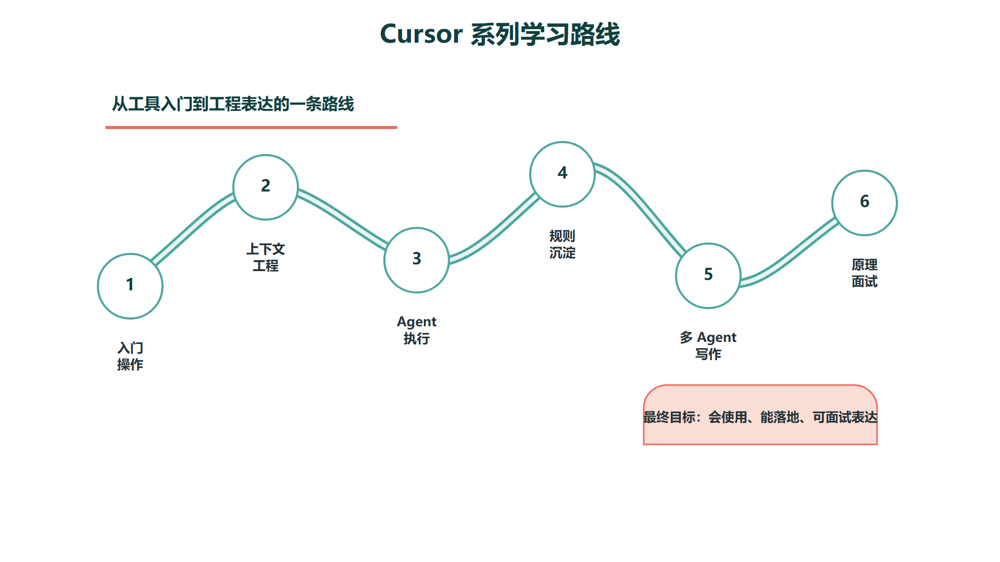

# Cursor教程学习路线

Cursor 是面向软件工程场景的 AI 编程环境。它不是单纯的聊天窗口，也不是只会补全下一行代码的插件，而是把编辑器、代码库索引、上下文管理、工具调用、终端执行、规则系统和 Agent 编排放在一起，形成一套面向真实项目的开发工作台。

从学习角度来看，Cursor 最容易被误用成“让 AI 帮我写一点代码”。这种用法可以解决零散问题，但很难支撑复杂项目、课程写作、技术文档整理和央国企项目表达。更合理的学习顺序是：先完成下载安装到第一次小修改的最小闭环，再掌握编辑器内的基本操作，随后理解上下文如何进入模型，继续学习 Agent 如何规划、修改、验证，最后再进入多 Agent 写作、规则沉淀、MCP 接入和面试表达。

上图可以作为本系列的阅读顺序。安装与第一次使用解决“怎么跑通最小闭环”的问题，操作和 Agent 使用解决“怎么用”的问题，规则与多 Agent 写作解决“怎么让它稳定帮你做事”的问题，最后两篇解决“为什么这样运行”和“面试里怎么讲”的问题。

## 一、这一系列适合谁读

这组教程默认读者已经知道基本的代码编辑器操作，但不要求读者已经熟悉 Agent、RAG、MCP 或 Codex。它更适合三类人：

| **读者类型** | **主要目标** | **应该重点看** |
| --- | --- | --- |
| AI 应用开发入门者 | 会用 Cursor 完成真实项目修改 | 00A、01、02、03 |
| 技术内容写作者 | 用多 Agent 组织资料、写作、配图和校验 | 4 |
| 央国企技术岗准备者 | 能把 AI 编程 Agent 讲成工程能力 | 05、06 |

在央国企技术岗场景下，Cursor 不是简历里单独占一行的“工具名”，而是可以转化为一种项目表达：你是否懂得把大模型接入真实工程流程，是否知道上下文、工具调用、权限、审计、验收和人工复核的边界。

## 二、学习路径怎么安排

第一阶段是安装与首次闭环。你需要先完成下载、安装、登录、打开项目、只读解释项目、做一次低风险小修改、查看 Diff 和运行验证命令。这个阶段的重点不是追求复杂功能，而是确认 Cursor 能在你的本机环境里完成一个可验证的小任务。

第二阶段是操作入门。你需要知道 Tab 补全、Inline Edit、Agent 面板、Plan Mode、上下文引用和快捷键分别适合什么场景。这个阶段的重点不是记住所有按钮，而是形成操作判断：小改动用局部编辑，复杂任务用 Agent，需求不清时先用 Plan Mode。

第三阶段是上下文工程。AI 编程工具的效果很大程度取决于上下文质量。Cursor 可以通过 `@` 引用文件、文件夹、文档、终端输出、浏览器上下文、Git diff 和历史对话。你要学会把“任务目标、相关文件、验收标准、禁止事项、已有错误输出”一起交给 Agent，而不是只写一句“帮我优化一下”。

第四阶段是工程化使用。Cursor 的 Rules、AGENTS.md、Skills、MCP、Subagents 和 Cloud Agents，本质上都在解决同一个问题：如何让 Agent 在团队项目里稳定、可复用、可审查地工作。对个人学习来说，不需要一开始就配置很复杂；对团队项目来说，这些能力会决定 Agent 能不能从玩具工具变成工程流程的一部分。

第五阶段是面试表达。面试官通常不会关心你是否按过某个快捷键，而会追问：Agent 为什么能改代码？它怎么知道哪些文件相关？工具调用怎么控制风险？多 Agent 会不会互相冲突？如果 AI 生成错误代码，系统如何发现并回滚？这些问题都需要从原理和工程治理角度回答。

## 三、建议的阅读顺序

| **顺序** | **文档** | **解决的问题** |
| --- | --- | --- |
| 1 | 00A-Cursor安装与第一次使用.md | 从安装到第一次小修改 |
| 2 | 01-Cursor操作入门：界面、快捷键与上下文.md | 熟悉日常操作入口 |
| 3 | 02-Cursor Agent使用：从Ask到Plan到执行.md | 学会把任务交给 Agent |
| 4 | 03-Cursor项目规则：Rules、AGENTS、Skills与MCP.md | 让 Agent 理解项目规范 |
| 5 | 04-Cursor多Agent写作工作流.md | 用 Agent 生产技术教程 |
| 6 | 05-Cursor工作原理：上下文、工具调用与模型编排.md | 理解底层运行机制 |
| 7 | 06-央国企Codex与Cursor面经：AI编程Agent项目表达.md | 面试和项目表达 |

## 四、最低掌握标准

读完这一系列，最低要达到三个标准。

第一，能独立安装 Cursor，并完成一个小项目修改。包括登录、打开项目、让 Agent 阅读代码、提出计划、修改文件、运行测试、解释 Diff，并在不满意时回滚或重新规划。

第二，能建立一套可复用的项目上下文。至少知道什么时候用 `.cursor/rules`，什么时候用 `AGENTS.md`，什么时候用 Skill 或 MCP，而不是把所有要求都塞进一次聊天提示词。

第三，能把 Cursor 和 Codex 这类 AI 编程 Agent 讲成工程系统。也就是能说清楚它们由指令、上下文、工具、模型和执行循环组成，并且需要权限、审计、测试和人工复核来保证可控。
