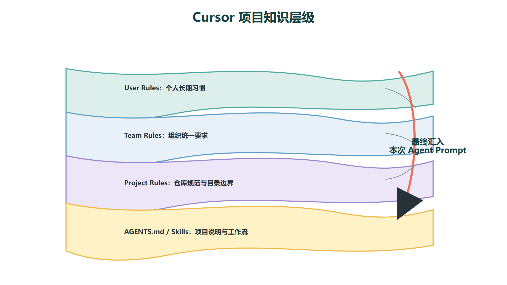
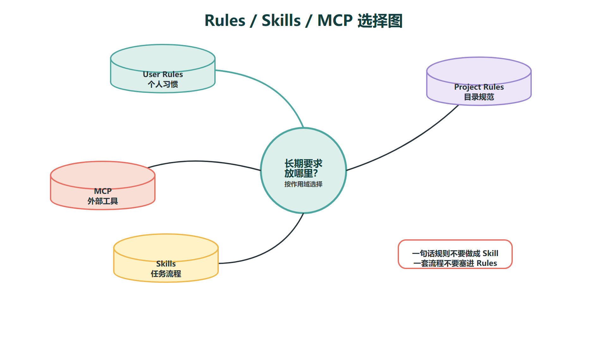

# Cursor项目规则：Rules、AGENTS、Skills与MCP

**Cursor 的项目规则体系本质上是一套"上下文分层治理系统"。** 一次提示词只能约束当前对话 —— Cursor Agent 在这一轮记住了你的编码风格，下一轮就忘掉了。真实项目需要持续遵守的目录结构、命名约定、架构边界、测试命令、安全限制和文档规范，必须从临时对话中抽出来，变成持久化的、可被 Agent 在每次对话启动时自动加载的系统级配置。



Cursor 为此提供了四层治理机制：Rules、AGENTS.md、Skills 和 MCP。它们分别解决了四个维度的问题 —— 项目级行为约束、跨 Agent 通用说明、可复用工作流封装、以及外部工具与数据接入。理解这四层的职责边界和加载机制，是把 Cursor 从"偶尔好用的代码补全工具"升级为"可控的 AI 工程伙伴"的关键一步。

在实际工程中，一个完整的项目规则体系不是一次性配置出来的，而是随着项目的推进逐步生长的。四层机制之间不是互斥关系 —— 同一个项目里 Rules 约束 Agent 的行为、AGENTS.md 告诉它项目是什么、Skills 封装高频任务、MCP 打通外部数据，它们同时工作、各有分工。后面会逐一拆开讲清楚。

## 一、Rules：项目级系统提示，Agent 每次对话自动加载的行为约束

Rules（项目规则）是 Cursor 最核心的持久化上下文机制。从技术角度看，Cursor Agent 在每次对话启动时会扫描 `.cursor/rules` 目录下的规则文件，将匹配当前文件或操作上下文的规则注入到 Agent 的 system prompt 中。所以 Rules 不是"放在某个文件夹里的参考文档"——它是会被 Agent 真正读取并强制遵守的运行指令。

这套机制的核心价值在于：你不再需要每次开新的 Chat 或 Composer 都重新告诉 Agent"这个目录的代码风格是什么""测试用哪个命令""生成文件不要放在根目录"。规则写一次，持续生效。

### 文件格式与加载粒度

Rules 文件使用 `.mdc` 扩展名，存放在 `.cursor/rules` 目录下。每个 `.mdc` 文件通过 YAML frontmatter 控制加载条件，主要包括三个字段：

- `alwaysApply`：设为 `true` 时，该规则在每次对话中都生效，无论当前操作的文件是什么。适合写全仓库级别的通用约束，比如"禁止在代码中硬编码密钥""所有 Markdown 配图必须在 images 目录下"。
- `description`：规则的简短说明，Agent 在判断是否需要加载这条规则时会读取。描述要写清楚"这条规则管什么"，而不是"这是一条规则"。
- `globs`：文件匹配模式，规则只对匹配路径的文件生效。比如 `globs: "src/api/**/*.ts"` 表示这条规则只在处理 `src/api/` 下的 TypeScript 文件时启用。适合写某个子目录或模块级别的特定约束。
这个三段式的粒度设计解决了一个关键问题：你不会把全仓库的约束一股脑塞进每次对话的 system prompt（导致上下文浪费），也不会漏掉关键限制。针对性加载，精准治理。

### 规则应该写什么，不该写什么

规则的设计原则是"短、准、可执行"。以下内容适合放进 Rules：

- 某个目录或模块的代码风格约定 —— 比如"React 组件文件用 PascalCase，文件名与组件名一致"
- 后端接口返回结构的统一约定 —— 比如"所有 REST 接口返回 `{ code, data, message }` 格式"
- 前端组件拆分规则 —— 比如"一个组件不超过 200 行，超过就拆分"
- 数据库迁移和 Seed 数据的管理规范
- 测试命令和 CI 执行的固定步骤
- 明确标注"不能修改"的生成文件目录（如 `generated/`、`dist/`）
- 常用模板路径和参考文件索引
以下内容**不应该**写进规则：

- 不可验证的泛泛要求 —— 比如"代码要优雅""注意性能"。Agent 无法理解"优雅"，但能理解"函数圈复杂度不超过 10"。
- 整本团队规范书全文复制 —— 规则文件要短，每一条都要能直接指导 Agent 的行为。把 50 页规范书拆成多个按模块分工的 `.mdc` 文件，比一个巨型规则文件有效得多。
- 需要人工判断的模糊指令 —— 比如"适当的抽象级别"。Agent 需要可操作的边界。
一条好的规则引用具体目录、命令、模板，并明确禁止事项。比如：

```
---
alwaysApply: true
description: 后端 API 返回结构约束
---
所有新增后端接口必须使用统一的返回包装类 ApiResponse。
返回结构为 { code: number, data: T, message: string }。
不允许直接在 Controller 中返回裸对象或 ResponseEntity。
```

### 规则是从错误中生长出来的

一个常见误区是一上来就写几十条规则。实际上最有效的做法是：先让 Agent 工作，当它犯了同类错误（比如每次都在错误目录生成文件、每次都忘了加参数校验），就把那条约束写进规则。规则系统是逐步收敛的，不是在第一天就设计完备的。

## 二、AGENTS.md：比 Rules 更轻量的跨 Agent 项目说明书

Rules 管的是"Agent 应该怎么做"——行为约束。但 Agent 还需要知道一个问题："这个项目是什么？" AGENTS.md 回答的就是这个问题。

AGENTS.md 是一个比 `.cursor/rules` 更通用的项目级说明文件。它通常放在仓库根目录，描述的是项目整体层面的信息：项目定位、目录结构概览、开发环境配置方式、常用启动和构建命令、代码规范类型（如 ESLint + Prettier）、提交规范（如 Conventional Commits）、注意事项和已知陷阱（Gotchas）。

和 Rules 相比，AGENTS.md 有几个关键区别：

- **Rules 是规则引擎，AGENTS.md 是说明书。** Rules 告诉 Agent "你不可以做什么"或"你遇到这种情况必须怎么做"，AGENTS.md 告诉 Agent "这个仓库是干什么的、怎么跑起来、有哪些约定"。两者不是替代关系，而是互补关系。
- **AGENTS.md 可以被多种 Agent 工具复用。** 不仅 Cursor 会读取它，Claude Code、GitHub Copilot、Cline 等工具也会将其作为项目上下文。因此它的格式比 `.cursor/rules` 更通用 —— 不需要 `.mdc` 扩展名和特定的 frontmatter，直接用标准 Markdown 写即可。
- **AGENTS.md 适合写仓库级别的整体说明，不适合写文件级别的细粒度约束。** 例如"所有 React 组件用函数组件 + Hooks"这条约束，更适合放在 `.cursor/rules` 里配合 `globs` 精确匹配 `*.tsx` 文件，而不是放在 AGENTS.md 里当通用说明。
在实际项目中，如果一个项目刚开始引入 AI 编程工具，**优先从 AGENTS.md 开始**。一个几百行的 AGENTS.md 就能让 Agent 对整个仓库有基本的认知，投入产出比很高。当某些约束需要更精细的控制粒度（比如只对 `src/api/` 下的文件生效），再把它们从 AGENTS.md 中拆出来，放进 `.cursor/rules`。

AGENTS.md 的另一个重要作用是作为团队协作的入口。它是对新人（无论是人类工程师还是 AI Agent）的第一份项目介绍。如果一个仓库连 AGENTS.md 都没有，Agent 每次对话都要从零开始理解项目结构，效率和准确率都会明显下降。

## 三、Skills：一条规则装不下的可复用工作流

### Skills 解决什么 Rules 解决不了的问题

Rules 解决的是"你一直要遵守什么"，但有时候你需要的不是一条持续生效的约束，而是一套可以被多次触发、每次按相同流程执行的任务。

比如"每次发布版本时自动生成变更日志"——这不是一条规则能描述的，它涉及"从 git log 提取提交记录 → 按类型分组 → 生成 Markdown → 写入 CHANGELOG.md"的完整流程。Skills 就是为这类场景设计的。

在 Cursor 的架构中，一个 Skill 至少包含一个 `SKILL.md` 文件，它定义了：

- **触发条件**：什么时候这个 Skill 应该被调用（例如"当用户要求生成变更日志时"）
- **工作流步骤**：Agent 执行这个 Skill 时应该按什么顺序做什么事
- **领域知识**：Skill 特定的参考信息、模板、校验规则
- **可选脚本**：Skill 还可以附带可执行脚本，Agent 在需要时通过命令行调用
### Rules 和 Skills 的边界怎么划

这个边界在实际使用中很容易混淆，因为两者看起来都是"让 Agent 做对的事情"。可以从一个简单的判断标准来区分：

**如果你的需求是"Agent 在每一次对话、每一次操作中都遵守某个约束"，这是 Rules。如果你的需求是"Agent 在某类任务被触发时执行一套固定流程"，这是 Skills。**举两个具体例子来对比：

- "本仓库 Markdown 所有配图必须放在 `images/` 目录下，使用相对路径引用"——这是 Rules。它是一条持续生效的硬约束，Agent 在任何时候生成或插入图片都要遵守。
- "把一批原始文章按课程讲义风格改写，生成配图，输出到「合规版」目录，并做质量检查"——这是 Skill。它不是在每次对话中自动执行的，而是当用户触发"整理课程讲义"这个任务时，Agent 才调用这套工作流。


这张决策图总结了 Rules、Skills、MCP 和 Subagents 四类治理手段的选型路径：从需求出发，判断是"持续约束"、"可复用流程"、"外部数据接入"还是"复杂任务拆分"，然后映射到对应的机制。在项目早期不用刻意追求全覆盖，但在体系逐步成型后，这张图可以帮你快速校准新需求该落在哪一层。

### 一个实际 Skill 的结构示例

以"整理面试经验帖子为网站导入格式"这个场景为例，一个 Skill 的 `SKILL.md` 大概包括这些部分：

```
---
name: hxsay-interview-import
description: 将原始面经笔记整理为标准导入格式
---

## 触发条件
用户提到"整理面经""网站导入格式""结构化导入文本"时触发。

## 工作流
1. 读取原始面经内容
2. 提取：公司、岗位、面试时间、面试轮次、面试形式
3. 按模板组织：基本信息 → 面试问题 → 回答要点 → 面后总结
4. 输出到 `面经整理/` 目录，文件命名格式为 `{公司}-{岗位}-{日期}.md`

## 质量检查
- 公司名称是否准确
- 面试问题是否完整列出
- 回答要点是否有实质内容而非泛泛之谈
```

在 Cursor 的实际使用中，Skills 被放在用户级别的 `.cursor/skills` 目录或项目级别的项目配置中。Agent Chat 和 Composer 都可以调用 Skills，Agent 会根据任务描述自动匹配和触发相应的 Skill。

从工程治理的角度看，Skills 的价值在于**把高频的、重复性的、容易出错的人工流程变成可复用的自动化流程**。这和你写 CI Pipeline 或自动化脚本的思路是一样的 —— 只不过这次的自动化对象不是代码，而是 Agent 的思维和操作流程。

## 四、MCP：打通 Agent 和真实系统之间的连接边界

### MCP 解决什么

Rules 管行为，AGENTS.md 管认知，Skills 管流程。这三层覆盖了 Agent 在项目内部的治理需求。但 Agent 还有一个根本性的局限：它只能操作当前仓库里的文件，无法直接访问外部的数据系统、API 服务、知识库和管理平台。MCP（Model Context Protocol，模型上下文协议）解决的就是这个问题。

MCP 是 Anthropic 定义的一套开放协议标准，用于把外部工具、服务和数据源接入 AI Agent。Cursor 从 0.45 版本开始原生支持 MCP，配置方式有两种：项目级的 `.cursor/mcp.json` 和全局的 `~/.cursor/mcp.json`。

### 协议机制：从工具发现到结果回传的完整链路

从技术角度看，MCP 的工作链路大致分为以下几步：

1. **建立连接**：Cursor 在启动时读取 `mcp.json` 中的 MCP Server 配置，根据传输类型（stdio 或 HTTP/SSE）启动或连接 MCP Server 进程。
2. **工具发现（Tool Listing）**：MCP Server 启动后向 Cursor 注册自己提供的工具列表（`tools/list`）。每个工具包含名称、描述和参数 JSON Schema。Cursor Agent 把这些工具描述注入自己的可用工具列表中。
3. **Agent 决策与调用**：在对话中，当 Agent 判断当前任务需要调用 MCP 工具时（比如"查一下这个项目的工单状态"），它会生成一个工具调用请求，包含工具名称和参数。
4. **结果回传与决策循环**：MCP Server 执行对应的操作后，将结果返回给 Cursor Agent。Agent 根据返回结果判断是否需要进一步调用其他工具，或者将结果直接用于当前任务。
5. **连接生命周期管理**：stdio 模式的 MCP Server 作为子进程运行，随 Cursor 启动和关闭；远程 HTTP/SSE 模式的 Server 独立运行，Cursor 在需要时建立连接。
`![[images/cursor_mcp_integration.png]]`

这张图展示了 MCP Server 和 Cursor Agent 之间的请求-响应循环。关键点是：Agent 不是被动接收数据的 —— 它主动感知 MCP 工具的存在，在推理过程中判断何时调用、调用哪个工具、用什么参数，然后根据返回结果调整下一步行动。这与传统的"先查资料再问 AI"的工作方式有本质区别。

### stdio vs SSE：两种传输模式的实际差异

MCP 支持两种传输模式，选哪种取决于工具的使用场景：

| **传输模式** | **连接方式** | **适用场景** | **注意事项** |
| --- | --- | --- | --- |
| **stdio** | 本地子进程，通过标准输入输出通信 | 本地工具：文件系统操作、本地数据库查询、本地脚本执行 | Cursor 关闭时进程终止；不需要网络配置；延迟最低 |
| **HTTP/SSE** | 远程 HTTP 请求 + Server-Sent Events 流式推送 | 远程服务：企业内部 API、知识库、项目管理平台、CI/CD 系统 | 需要配置服务器地址和认证；支持多客户端共享；适合团队环境 |

选择传输模式的关键判断标准是：**你接入的工具是本地资源还是远程服务。** 本地脚本、命令行工具、本地数据库用 stdio；企业内部系统、团队共享的 API 网关、需要集中管理的知识库用 SSE。

### 从企业场景看 MCP 的意义

MCP 不只是一个"让 Agent 多几个工具"的功能。从系统架构的角度看，它真正解决的问题是**Agent 和真实业务系统之间的连接边界**。在企业环境中，Agent 需要连接的数据和服务分布在不同的系统中：

- 内部知识库、制度文档、接口规范（Confluence、语雀、飞书文档等）
- 项目管理平台和工单系统（Jira、Linear、TAPD 等）
- 代码仓库、CI 流水线、测试报告和发布记录
- 数据库只读查询、日志分析平台、监控大盘
- 浏览器交互能力（通过 Puppeteer MCP Server 等）
在没有 MCP 的情况下，上述每一类数据都需要人手动查询、复制、粘贴到 Agent 对话中。这个过程不仅低效，还容易出错：你可能遗漏了关键的上下文、引用了过期的信息、或者在复制过程中丢失了结构化数据。MCP 的价值在于**让 Agent 自己去获取它需要的上下文**，而不是依赖人工喂数据。

### 安全与权限治理

MCP 在带来便利的同时也引入了显著的安全风险。一个 MCP Server 本质上是一个可以得到 Agent 信任的外部程序，它有能力读取数据、调用 API、甚至执行命令。如果配置不当，可能出现以下问题：

- Agent 误调用高风险操作（删除资源、修改生产配置、泄露敏感数据）
- MCP Server 自身存在漏洞或被恶意篡改
- 内部敏感文档通过 Agent 被间接暴露给外部模型
因此，在企业环境中引入 MCP 时，必须建立一套对应的安全治理策略：

- **工具白名单**：不是所有 MCP Server 暴露的工具都可以被 Agent 随意调用。只开放与当前任务直接相关的工具，高风险工具（如数据库写入、生产环境操作）默认关闭。
- **权限最小化**：MCP Server 连接数据库时使用只读账号；API Token 只授予必要的 Scope；文件操作限制在指定目录范围内。
- **密钥与环境变量管理**：所有 MCP Server 所需的 API Key、数据库密码等凭证通过环境变量注入，不在 `mcp.json` 中硬编码。Cursor 的 `mcp.json` 支持 `${env:VAR_NAME}` 语法引用环境变量。
- **操作日志和审计**：记录 Agent 通过 MCP 调用了哪些工具、传了什么参数、返回了什么结果。对于涉及生产数据的操作，应该有审计记录可追溯。
- **高风险操作审批**：对影响生产环境的操作（如部署、数据库写操作），增加人工审批环节。MCP Server 可以设计成返回一个"请确认"的交互，而不是直接执行。
`![[images/cursor_mcp_security_matrix.png]]`

这张安全矩阵图展示了不同 MCP 工具类型对应的风险等级和推荐的安全措施。核心原则是：**Agent 获得的每一个外部能力，都要对应一条安全控制线。** 没有控制的开放等于不可控的暴露。

## 五、四层机制的协作关系：不是替代，是分工

理解了 Rules、AGENTS.md、Skills 和 MCP 各自的能力后，需要回到一个关键问题：**在同一个项目中，这四层机制是怎么配合的？**

用一个日常开发场景来说明：

1. Agent 启动一个对话。它首先加载 AGENTS.md，理解"这是一个 Spring Boot 后端项目，用 Java 17 + Gradle，分 Controller → Service → Repository 三层"。
2. 然后扫描 `.cursor/rules`，根据当前操作的文件路径匹配对应的规则。比如当前正在编辑 `src/main/java/com/example/api/UserController.java`，Agent 加载了"所有 REST 接口必须用 `ApiResponse` 包装返回值"这条规则。
3. 用户说"帮我写一个新的订单查询接口"。Agent 在生成代码时同时遵守了 AGENTS.md 中的项目结构约定和 Rules 中的返回格式约束。
4. 用户说"查一下这个需求对应的工单编号"。Agent 判断需要调用 Jira MCP Server，通过 MCP 协议发起 `jira_search_issues` 调用，拿到结果后填入代码注释或 PR 描述。
5. 用户说"发布前检查一遍代码规范"。Agent 调用预先配置好的 Code Review Skill，按固定的检查清单逐项核查并生成问题报告。
在这个场景里，四层机制各司其职、同时生效：

| **机制** | **解决的问题** | **生命周期** | **典型粒度** |
| --- | --- | --- | --- |
| **AGENTS.md** | Agent 不知道这个项目是什么 | 整个仓库，每次对话必读 | 仓库级 |
| **Rules（.cursor/rules）** | Agent 不理解某个模块或目录的特定约束 | 按文件路径匹配，条件加载 | 模块或目录级 |
| **Skills** | 高频任务每次都要从零指导 Agent 怎么做 | 按任务类型触发，按需调用 | 任务级 |
| **MCP** | Agent 无法直接获取外部系统的数据和服务 | 持续连接，Agent 按需调用 | 系统级 |

理解这张表的关键是：**它们是从粗到细、从内到外的四层治理模型。** AGENTS.md 划项目边界，Rules 管行为细节，Skills 标准化工序，MCP 延伸数据触角。缺少任何一层，其他层就会被迫承担不属于它的职责，最终变成一锅粥。

## 六、如何为一个项目建立 Cursor 规则体系

一个比较稳妥的推进顺序是"从粗到细、从通用到专用、从配置到自动化"：

**第一步：先写 AGENTS.md。**

不管项目大小，先把仓库是什么、怎么跑起来、目录结构、常用命令、代码风格类型、提交规范这几件事写清楚。一个 200-400 行的 AGENTS.md 就能让 Agent 从"盲人摸象"变成"带着地图工作"。不要追求第一次就完美——写完之后让 Agent 试着做一个简单的代码改动，观察它在哪些地方犯了不该犯的错误，然后补充对应的说明。

**第二步：对频繁出错的场景建立 **`.cursor/rules`**。**

当你发现 Agent 反复在同一个地方犯错时——比如每次都在 `src/` 根目录生成新文件而不是放进对应的子模块、每次生成的接口返回值格式都不统一——就把这条约束写进 Rules。注意控制粒度：能用 `globs` 限定范围的就不设 `alwaysApply: true`，避免每次对话的 system prompt 里塞满无关规则。

**第三步：识别高频重复任务，封装 Skill。**

不是所有重复操作都需要 Skill。判断标准是：**这个任务是否需要多个步骤、是否每次都需要同样的流程和质量检查。** 比如"整理一篇面试经验帖"涉及读取原始文本 → 提取结构化信息 → 按模板输出 → 校验完整性，这四个步骤如果每次都要手动指导 Agent，就值得封装成一个 Skill。

**第四步：接入真正需要的外部数据源。**

MCP 是四层机制中成本最高的一层——需要配置 Server、管理认证、建立安全策略。不要因为"某个工具有 MCP Server"就去接入。先问自己：Agent 是否真的需要在对话中直接访问这个系统的数据？如果答案是"偶尔需要，但手动查一下复制过来更快"，那就不值得接入。如果答案是"每次对话都要反复查询，手动操作已经严重拖慢效率"，这是 MCP 的合理场景。

**第五步：对复杂度更高的任务考虑 Subagents。**

当单个 Agent 对话的上下文变得太长（比如同时处理 20 个文件的修改），或者任务本身可以拆成独立的并行子任务（比如同时写文档、画图、跑测试），可以考虑使用 Subagents 将任务分发到独立的 Agent 上下文中执行。这是更高级的治理手段，适用于项目规模和复杂度达到一定阶段后。

**第六步：规则从错误中生长，不提前过度设计。**

这是贯穿全过程的核心原则。不要试图在项目第一天配置完所有规则，因为一个没跑过 AI 编程的项目，你并不知道 Agent 会在哪里犯错。最有效的方式是：让 Agent 工作 → 观察它犯的错误 → 把错误模式写成规则 → 验证规则是否生效 → 继续观察下一个错误。规则系统是活的，它应该随着项目演进而迭代。

## 七、企业场景下的规则重点：安全、合规、可追溯

在企业级场景中（尤其是央国企、金融机构、基础设施类项目），项目规则体系除了架构和风格层面的约束外，还必须覆盖安全与合规维度。这些维度的要求不是"建议"，而是"底线"。

### 必须写进规则的六个安全底线

1. **数据隔离**：不允许将内网数据、客户信息、合同内容、用户隐私数据发送到外部模型服务。如果使用外部 API 进行推理，必须确认数据不会用于模型训练。
2. **密钥与配置管理**：数据库密码、API Key、证书等敏感配置必须通过环境变量或密钥管理系统注入，禁止在代码、配置文件或注释中硬编码。使用 `${env:VAR_NAME}` 语法引用。
3. **权限与审批逻辑的人工复核**：涉及用户权限判断、审批流、资金计算、合同条款生成、生产环境调度逻辑的代码，必须经过人工 Code Review，不能直接由 Agent 生成后上线。
4. **生成代码的质量门禁**：Agent 生成的代码必须通过自动化测试、静态代码检查（SonarQube / ESLint / PMD）和安全扫描（SAST），关键模块必须有对应的单元测试覆盖。
5. **变更可追溯**：每次 Agent 修改的文件必须有 Diff 记录、改动说明和回滚路径。在 Git 提交信息中标注修改来源（手动修改 / Agent 辅助生成 / Agent 自主修改）。
6. **MCP 权限最小化**：MCP Server 只能访问完成当前任务所需的最小权限范围。生产环境数据默认只读，写入操作需要额外确认或审批。
### 面试表达中的价值

在面试场景中，如果能讲清楚上面这些边界——不只是说"我会用 Cursor 写代码"，而是能系统地阐述"引入 AI 编程工具后项目规则体系如何设计，安全和合规维度如何落地"，这是一个明显的加分项。企业招聘关注的从来不是工具熟练度本身，而是你能不能把工具放进可控的、可审计的工程流程里，让 AI 辅助编程真正为团队和项目服务，而不是引入新的技术债务和安全盲区。
