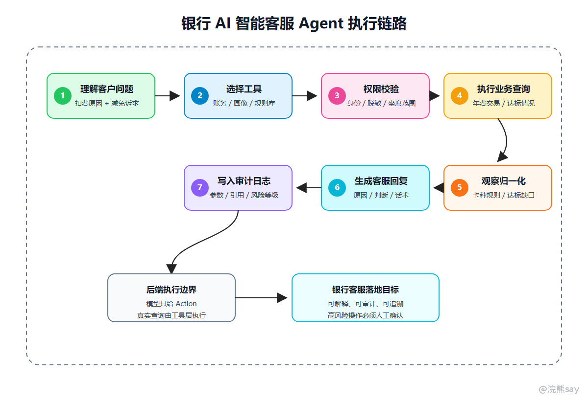

# AI Agent原理学习路线

AI Agent 原理学习路线用于梳理大模型应用从一次性问答走向多步骤任务执行时涉及的核心机制。AI Agent（人工智能智能体）可以理解为一种以大语言模型为推理与决策核心，以外部工具为执行接口，以任务状态为运行上下文，并通过控制策略约束行为边界的智能应用架构。

与普通 LLM 应用相比，Agent 不只是生成一段文本，而是在系统允许的范围内理解目标、规划步骤、选择工具、读取结果、更新状态并决定是否继续执行。它通常需要结合 Tool Calling、Function Calling、状态管理、任务编排、MCP、权限控制、审计日志和人工确认机制。

本专题按照 Agent 的系统结构组织内容：先理解 Agent 与普通 LLM、RAG、Workflow 的区别，再进入执行循环、工具调用、状态管理、MCP 接入、安全边界、评估方法和 Multi Agent 多智能体协作。学习重点不是框架名称，而是理解模型决策层、工具执行层、状态存储层、控制策略层和多角色协作层如何协同工作。

## 先用一个例子把 Agent 讲明白

后面几篇文章会一直用同一个例子：**银行 AI 智能客服 Agent**。

用户问：

```text
我的信用卡为什么扣了年费？能不能减免？如果符合条件，帮我生成一段客服回复。
```

如果只是普通 LLM，它只能凭语言能力写一段通用解释；如果只是 RAG，它可以检索年费规则，但不知道客户真实账务、卡种、消费次数和权益状态；如果是 Agent，它会按下面的链路做事：



这就是 Agent 和“会聊天的大模型”的区别：它不是一次生成答案，而是把模型放进一套可控的任务执行系统里。

为了避免后面越看越乱，可以先建立一个基本判断：

```text
Agent = 让大模型负责“判断下一步”，让后端系统负责“安全执行下一步”。
```

## 一、为什么要重新理解 Agent

在实际学习和项目准备中，部分开发者第一次接触 Agent 时，很容易把它理解成“模型能自己想办法完成任务”。这个说法太粗了，面试里也容易被追问。

真正做工程时，Agent 至少要回答 6 个问题：模型怎么知道下一步做什么，背后对应任务规划、工具选择、系统提示词和策略约束；模型怎么调用真实系统，背后对应 Tool Calling、Function Calling、MCP 和工具注册表；工具参数错了怎么办，背后对应 JSON Schema、参数校验、二次澄清和默认值策略；执行到一半失败怎么办，背后对应状态持久化、重试、降级、补偿和人工介入；为什么不会无限循环，背后对应最大步数、时间预算、目标完成判断和失败计数；业务风险怎么控制，背后对应用户身份、RBAC、数据范围、人工确认和审计日志。

如果这些问题讲不清，Agent 就只能停留在 demo 层面。

## 二、先把几个名词分清

很多人觉得 Agent 云里雾里，主要是因为把 LLM、RAG、Workflow、Agent、MCP 混在一起了。

| 名词 | 一句话理解 | 在银行客服 Agent 里的例子 |
| --- | --- | --- |
| LLM | 负责理解语言和生成文本 | 理解“信用卡年费能否减免”背后的业务意图 |
| RAG | 从知识库找材料再回答 | 检索年费减免规则、卡产品权益、合规话术 |
| Tool Calling | 模型发起结构化工具调用 | 调用 query_card_fee_transaction 查询扣费交易 |
| Workflow | 固定流程编排 | 先验身份，再查账务，再检索规则，再生成回复 |
| Agent | 根据状态动态决定下一步 | 数据不足时继续查明细，风险高时转人工 |
| MCP | 标准化连接工具和资源 | 把信用卡系统、CRM、规则库、客服工单封装成 Server |

最容易混淆的是 Workflow 和 Agent。Workflow 是“流程先写死”，Agent 是“每一步可以根据状态判断下一步”。真实项目里经常是二者结合：主流程用 Workflow 控住，局部判断交给 Agent。

## 三、学习路线

建议按下面这条路线准备：


这条路线不是按框架名称组织的，而是按 Agent 系统的运行机制组织的。先理解 Agent 的结构，再理解执行循环；先理解工具调用契约，再理解状态管理；最后再看 MCP、企业安全、评估方法和 Multi Agent 协作模式。

## 四、本专题文章目录

| 文章 | 重点解决什么问题 |
| --- | --- |
| 01-Agent是什么与为什么需要Agent | 从系统架构角度解释 Agent 的定义、边界和企业价值 |
| 02-Agent执行循环：Planning、Action与Observation | 深入拆解 Agent 控制循环、终止条件、失败模式和伪代码 |
| 03-Tool Calling与Function Calling | 讲清工具注册表、Tool Schema、参数校验、调用结果封装 |
| 04-Agent状态管理、记忆与任务编排 | 讲清短期状态、长期记忆、任务表设计、状态图和可靠执行 |
| 05-MCP与企业工具接入 | 讲清 MCP Host、Client、Server 的边界，以及企业工具治理 |
| 06-Agent安全边界、评估与面试表达 | 讲清权限、Prompt Injection、审计、评测集和项目表达 |
| 07-Multi Agent与多智能体协作 | 讲清多 Agent 角色分工、编排方式、共享状态、冲突处理和适用边界 |

## 五、要达到什么技术深度

如果只准备概念，可以知道 Agent 是 `LLM + Tools + Memory + Planning`。但技术面试更看重你能不能把这句话展开成系统设计。

建议准备到下面这个粒度：讲 Agent 架构时，要说清模型只是决策层，真实执行在后端工具层；讲控制循环时，要能写出 `while` 循环式伪代码，说明每轮如何判断继续或结束；讲 Tool Calling 时，要能设计工具名称、描述、参数 schema、权限和返回结构；讲 Function Calling 时，要说明它和纯 Prompt 解析的稳定性差异；讲状态管理时，要能说明任务表、步骤表、工具调用表、会话表怎么拆；讲记忆机制时，要区分上下文、短期状态、长期记忆和向量记忆；讲 MCP 时，要说明 Host、Client、Server、Tools、Resources 的职责；讲安全治理时，要明确模型输出不可信，权限必须在后端重新校验；讲评估体系时，要能设计任务完成率、工具选择准确率、参数正确率和安全违规率；讲 Multi Agent 时，要能说明角色如何拆分、谁负责编排、状态如何共享、冲突如何处理，以及为什么不是 Agent 越多越好。

## 六、一个企业 Agent 的典型数据量口径

为了避免文章只停留在概念层，后面会反复使用一个比较贴近企业应用的口径：

```text
用户规模：300-1000 名内部员工
知识库规模：500-3000 份业务规则、产品说明、FAQ、合规话术和操作手册
日均任务：500-2000 次客户咨询、坐席辅助或流程辅助请求
单任务平均步骤：2-6 步
工具调用量：日均 1000-8000 次
高峰并发：20-100 个活跃 Agent 任务
```

这个规模不算互联网高并发，但已经足够暴露 Agent 工程问题：上下文变长、工具超时、参数错误、重复调用、状态恢复、权限过滤、日志审计、成本统计。如果只是课堂 demo，这些问题不明显；一旦进入企业内部系统，它们都会变成真实开发任务。

## 七、学习优先级

学习优先级上，P0 是 Agent 控制循环、Tool Schema、权限和审计。你至少要能解释 Planning、Action、Observation、Final Answer 的闭环，能写出一个业务工具的 schema，并说明用户身份如何传递到工具层。P1 是状态持久化、MCP、评估指标和 Multi Agent 基本协作模式，要能说明任务中断后怎么恢复、MCP 解决什么接入问题、评测集怎么设计，以及多个 Agent 如何通过编排器和共享状态协作。P2 才是 LangGraph、CrewAI、AutoGPT 这些框架名词，了解定位即可，不要把背框架当成理解 Agent。

## 八、最后要准备到什么程度

比较理想的准备状态是：

```text
能解释 Agent = LLM 决策层 + Tool 执行层 + State 状态层 + Policy 控制层
能画出推理-行动-观察循环，并说明每一轮输入输出是什么
能设计一个工具注册表和工具调用记录表
能说明工具参数错误、工具超时、模型循环、越权访问怎么处理
能说明 Multi Agent 中角色拆分、任务编排、共享状态、冲突处理和成本控制
能把 Agent 项目讲成一个后端系统，而不是只说“我用了某个 Agent 框架”
```

对于 Java 后端方向的开发者而言，Agent 原理不是让你离开后端，而是让你把后端里的接口、权限、事务、异步任务、日志、监控和流程编排能力接到大模型应用里。未来很多 AI 应用岗位真正需要的不是“会不会喊 Agent”，而是你能不能把 Agent 做成一个能上线、能追踪、能控制风险的企业系统。
