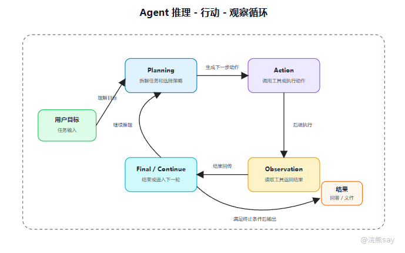
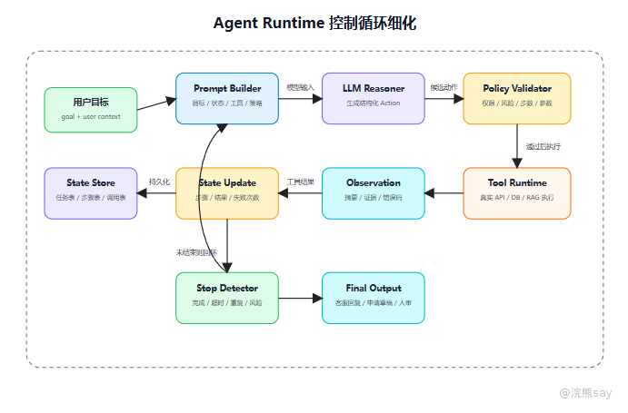

# Agent执行循环：Planning、Action与Observation

Agent 执行循环是智能体系统的核心运行机制。一个典型 Agent 在每一轮执行中会读取当前任务状态，根据目标生成下一步计划或动作，调用外部工具或请求用户补充信息，再将工具返回结果归一化为 Observation，并据此决定继续执行、结束任务、重试、转人工或中止。

从系统结构上看，这一过程通常可以概括为 Planning、Action、Observation 和 Policy Control。Planning 负责根据目标和当前状态判断下一步，Action 负责以结构化形式表达工具调用或其他动作，Observation 负责描述工具执行后的结果，Policy Control 则负责权限、风险、步数、超时和终止条件控制。

因此，Agent 更接近一个带模型决策能力的状态机，而不是普通聊天接口。其工程难点不在多调用几次模型，而在每一轮输入输出是否结构化、工具调用是否可信、状态是否可恢复、失败是否可处理、循环是否可终止。

## 从执行链路看：一次 Agent 请求长什么样

还是用银行 AI 智能客服例子：

```text
客户：我的信用卡为什么扣了年费？能不能减免？如果符合条件，帮我生成一段客服回复。
```

Agent 内部不是直接回答，而是分几轮执行。第一轮先确认客户和卡片信息，调用 `query_customer_profile` 得到脱敏客户画像和卡种；第二轮查询扣费交易和消费达标情况，调用 `query_card_fee_transaction` 得到年费交易和消费次数；第三轮检索业务规则依据，调用 `search_bank_policy` 得到年费减免规则片段；最后判断材料已经足够，再生成扣费原因、减免判断和客服话术。

这就是 ReAct 思路的工程化版本：Reasoning 不是展示一堆“思考过程”，而是让模型生成下一步结构化动作；Acting 由后端工具执行；Observation 再回到状态里。

## 一、Agent 控制循环的基本结构

一个可落地的 Agent 循环不是模型自己在脑子里跑，而是由后端系统驱动。



可以把每一轮拆成 6 个对象：`Goal` 是用户最终想完成的任务；`State` 是当前任务状态，包括历史步骤、工具结果、权限和失败次数；`Plan` 是模型对下一步动作的判断；`Action` 是结构化动作，可能是调用工具、向用户澄清、结束任务或转人工；`Observation` 是工具执行或用户补充后得到的新信息；`Policy` 则是控制规则，决定动作是否允许、是否继续、是否需要人工确认。

技术上，Agent 循环更像状态机，而不是普通聊天接口。

## 二、执行循环伪代码

可以用下面的伪代码理解：



```text
state = init_task(user_goal, user_context)

while state.step_count  觉得不够 -> 换关键词检索 -> 仍觉得不够 -> 再换关键词检索
```

可以记录每轮动作签名：

```text
action_signature = hash(tool_name + normalized_arguments)
```

如果同一个工具、同一组核心参数连续出现，且 Observation 没有新增信息，就应该触发停止或让用户补充信息。

## 九、一条完整 Trace 怎么记录

真实项目里，建议把每一次 Agent 执行记录成 Trace。这样出错时能复盘。

| 字段 | 示例 |
| --- | --- |
| trace_id | agent_trace_20260623_001 |
| task_id | task_10086 |
| step_index | 2 |
| prompt_version | agent_policy_v3 |
| action_type | tool_call |
| tool_name | search_bank_policy |
| arguments | {"query":"信用卡 白金卡 年费 减免 消费次数"} |
| observation_status | success |
| latency_ms | 842 |
| token_in/out | 1800 / 320 |
| decision | continue |

没有 Trace 的 Agent，出了问题很难排查。你不知道是模型选错工具、参数错、工具返回错，还是最后生成答案时编错。

## 十、面试表达模板

可以这样讲：

```text
我会把 Agent 执行流程设计成一个受控循环，而不是让模型自由运行。
每一轮系统会把用户目标、当前状态、可用工具和控制策略交给模型，模型只输出结构化 Action。
后端先校验 Action，包括工具是否可用、参数是否合法、用户是否有权限，然后再执行工具。
工具结果不会原样塞回模型，而是归一化成 Observation，包括摘要、状态、证据和原始数据引用。
循环是否继续由终止策略控制，例如最大步数、最大耗时、连续失败、重复动作检测和高风险人审。
```

下一篇继续看执行循环里最关键的接口层：Tool Calling 和 Function Calling。
