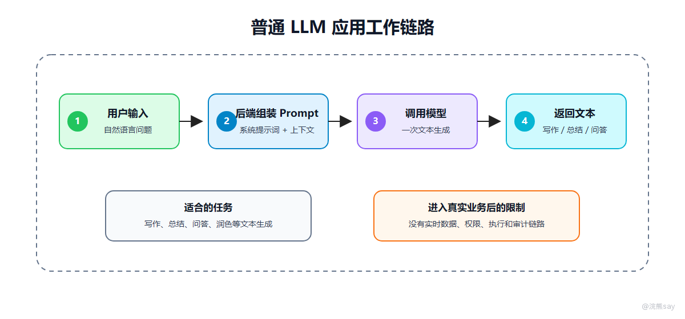

# Agent是什么与为什么需要Agent

Agent（智能体）是一种以大语言模型（LLM）为推理与决策核心，以外部工具（Tools）为执行接口，以任务状态（State）为运行上下文，并通过控制策略（Policy）约束行为边界的智能应用架构。它不是简单的聊天机器人升级版，也不是单纯让模型多调用几个函数，而是把模型放入一个可控的任务执行环境中，使其参与目标理解、步骤规划、工具选择和结果整合。

传统 LLM 应用通常把模型作为文本生成器使用：用户输入问题，后端组装 Prompt，模型返回自然语言结果。这种模式适合写作、总结、翻译和普通问答，但当任务需要访问外部系统、执行多步骤流程或根据中间结果继续判断时，一次模型生成就无法满足需求。

Agent 的价值在于将“语言生成”扩展为“受控任务执行”。模型负责理解目标并提出下一步动作，后端系统负责工具注册、参数校验、权限控制、状态持久化和审计追踪。理解 Agent 的关键，是理解模型如何参与决策，以及系统如何限制、执行和记录这些决策。

## 从系统结构看：Agent 多了什么能力

比如同样是“帮客户判断信用卡年费能不能减免”：

| 系统 | 会怎么做 |
| --- | --- |
| 普通 LLM | 直接生成一段通用解释 |
| RAG 问答 | 先找年费规则，再基于规则回答 |
| 固定 Workflow | 按预设顺序验身份、查账务、查规则、生成回复 |
| Agent | 根据客户问题动态判断查交易、查卡产品、查消费达标情况、是否转人工 |

所以 Agent 真正多出来的是“下一步决策权”。但这个决策权不能无限放开，必须受工具、权限、状态和策略控制。

## 一、普通 LLM 应用为什么不够

普通 LLM 应用通常是这样工作的：



这个链路适合写作、总结、问答、润色。但只要任务进入真实业务系统，它就会遇到几个限制：模型不知道客户当前账务、卡片状态和权益使用情况，也不知道当前坐席能看哪些数据；它不能真正查询账户、生成客服记录或创建待办；多步骤任务执行到哪一步，模型本身也不负责保存；最后出了问题，还很难追踪答案来自哪个工具、哪个参数、哪个数据源。

例如客户问：“我的信用卡为什么扣了年费？我今年消费次数够不够减免？”普通 LLM 没有账户访问能力，只能给通用解释；RAG 可以检索年费规则，但也不能直接判断客户是否达标；Agent 则可以先识别任务，再调用客户身份校验、扣费交易查询、消费次数统计、规则检索工具，最后基于真实结果生成回复。

再换成更具体的银行 AI 智能客服场景：

```text
客户问题：这张信用卡为什么扣了年费？如果符合减免条件，客服应该怎么回复？
```

普通 LLM 的风险是“没有真实账务也敢判断”；RAG 的局限是“只知道年费规则，不知道客户卡种和消费达标情况”；Agent 的做法是先查扣费交易和客户权益，再检索业务规则，再把两边结果合并。

## 二、Agent 的系统定义

从工程实现角度看，可以把 Agent 拆成四层：

```text
Agent = Model Reasoner + Tool Runtime + State Store + Control Policy
```

| 层级 | 职责 | 典型实现 |
| --- | --- | --- |
| Model Reasoner | 理解目标、规划步骤、选择工具、生成回答 | LLM、System Prompt、工具描述 |
| Tool Runtime | 执行真实动作，访问外部系统 | Java Service、HTTP API、SQL、RAG 检索 |
| State Store | 保存任务状态、上下文、工具结果和中间产物 | MySQL、Redis、对象存储、向量库 |
| Control Policy | 限制行为边界，决定继续、终止、重试或人审 | 最大步数、权限策略、风险策略、审计 |


这个定义比“LLM + Tools + Memory”更适合面试，因为它把模型、工具、状态和控制策略都放进来了。真实系统里，模型不能直接代表 Agent，模型只是 Agent 的决策组件。

## 三、Agent 和 RAG 的关系

在实际学习和项目准备中，部分开发者学完 RAG 后，会把 Agent 和 RAG 混在一起。其实它们解决的问题不一样。

| 架构 | 解决的问题 | 核心动作 |
| --- | --- | --- |
| LLM | 根据上下文生成文本 | 生成 |
| RAG | 让模型基于外部知识回答 | 检索 + 生成 |
| Agent | 让模型围绕目标执行多步骤任务 | 规划 + 工具调用 + 状态控制 |

RAG 可以是 Agent 的一个工具。比如一个银行 AI 智能客服 Agent，可能同时拥有：

-   `search_bank_policy`：检索年费、额度、还款、理财等业务规则
    
-   `query_card_fee_transaction`：查询信用卡年费扣费交易
    
-   `query_customer_profile`：读取脱敏后的客户画像和权益状态
    
-   `create_service_reply_draft`：生成客服回复草稿
    

其中第一个工具就是 RAG 检索能力。Agent 的范围更大，它不仅检索，还要决定什么时候检索、是否还需要调用账户或 CRM 数据、是否需要坐席确认、最终如何组织客户可读的回复。

这里可以用一句话区分：

```text
RAG 解决“回答有没有依据”，Agent 解决“任务怎么一步步完成”。
```

很多企业项目其实是 `Agentic RAG`：不是固定检索一次就回答，而是由 Agent 判断是否要多轮检索、换关键词检索、查结构化数据库，或者在资料不足时拒答。

## 四、Agent 的核心不是自主，而是受控自主

很多宣传会强调 Agent 自主规划、自主执行。企业项目里不能这么讲得太满。更准确的说法是：Agent 在系统允许的边界内进行有限自主决策。

这个边界主要体现在工具、参数、权限、时间、步数和风险上。模型只能调用白名单内工具，所有参数必须满足 schema 和业务规则；工具执行前要按用户身份重新鉴权；单个任务有最大执行时间，也有最大推理和工具调用轮数；一旦涉及写操作或高风险操作，就要进入人工确认。

所以 Agent 不是让模型“想做什么就做什么”。它更像一个受限的任务调度器：模型给出下一步建议，系统负责校验、执行和记录。

## 五、为什么央国企场景需要 Agent

央国企的信息化系统通常有三个特点：

1.  系统多：核心账务、信用卡系统、CRM、客服工单、知识库、反欺诈、数据平台分散。
    
2.  流程重：很多客户问题不是一次问答，而是身份校验、查询、判断、解释、登记、确认、留痕。
    
3.  权限严：不同坐席、网点、部门、客户等级的数据访问范围不同。
    

这些特点决定了 Agent 的价值不在“炫技”，而在把分散系统串成一个可控的任务入口。

典型场景可以这样理解：

| 场景 | 不用 Agent 的问题 | Agent 的作用 |
| --- | --- | --- |
| 信用卡年费咨询 | 坐席要查卡种、账务、消费达标和减免规则 | 自动串联查询并生成可解释回复 |
| 贷款还款咨询 | 客户关心还款日、剩余本金、提前还款规则 | 查询还款计划并检索业务规则 |
| 银行卡限额咨询 | 需要区分渠道限额、账户状态和风控策略 | 查询账户状态并给出合规解释 |
| 理财赎回咨询 | 产品规则、开放日和到账时间容易混淆 | 检索产品说明并生成风险提示 |
| 客服质检辅助 | 人工复盘通话和话术成本高 | 抽取问题、引用规则、生成质检摘要 |

## 六、Agent 的失败模式

理解 Agent 一定要理解它会怎么失败，因为这正是技术深度的来源。规划错误通常来自模型误解任务或遗漏步骤，可以通过任务类型识别、模板化计划和必要的人审来兜住；工具误选往往是工具描述相似或提示不足造成的，需要优化工具描述、工具分组和选择后校验；参数错误要靠 JSON Schema、业务校验和澄清问题处理；工具返回噪声要靠摘要、分页和字段裁剪控制；循环失控要设置最大步数、失败计数和终止策略；越权访问则必须落到工具层 RBAC 和数据范围过滤。

这些问题说明，Agent 的工程难点不是“接入模型”，而是把模型放进一个可治理的执行框架里。

## 七、Agent 不适合做什么

Agent 不是万能胶。转账汇款、年费减免执行、额度调整、客户资料变更和对外正式通知，都不适合一上来就做完全自动化。转账有真实资金风险，年费减免和额度调整会影响客户账务、银行收入和授信策略，资料变更涉及身份与合规责任，对外通知还会影响银行统一口径。更稳的做法是让 Agent 做规则解释、风险提示、办理指引和草稿生成，最终操作由坐席或审批人员确认。

这部分很重要。面试时如果把 Agent 讲成“什么都能自动做”，反而显得不懂企业落地。

## 八、面试表达模板

可以这样回答：

```text
我理解的 Agent 不是单纯聊天机器人，而是一个由大模型参与决策的任务执行系统。
它通常包含四层：模型推理层、工具执行层、状态存储层和控制策略层。
模型负责理解用户目标、规划下一步和选择工具，但真正访问数据库、知识库和业务接口的是后端工具层。
状态层负责记录任务执行到哪一步，控制策略负责限制最大步数、超时、权限和高风险操作。
所以企业 Agent 的重点不是无限自主，而是在权限、工具和审计约束下完成可控自动化。
```

下一篇继续看 Agent 最核心的运行机制：Planning、Action、Observation 这套控制循环到底怎么设计。
