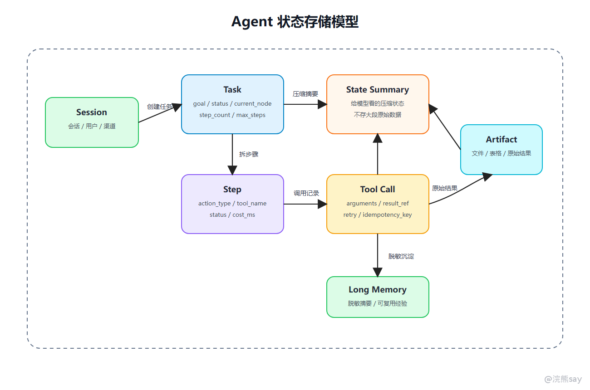
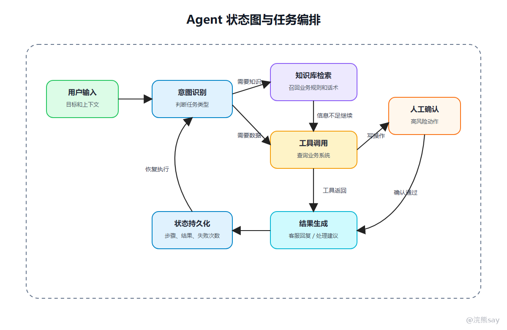

# Agent状态管理、记忆与任务编排

Agent 状态管理用于解决多步骤任务执行过程中的进度保存、上下文压缩、失败恢复和审计追踪问题。在真实系统中，Agent 任务可能持续几十秒甚至几分钟，中间会调用多个工具、等待用户补充信息、进入人工确认节点，或者在服务重启、工具超时后恢复执行。

如果系统只依赖聊天记录，模型每一轮都需要重新理解任务历史，后端也很难判断已经执行过哪些工具、哪些结果可以复用、哪些写操作需要防止重复提交。因此，Agent 需要显式维护 State、Context 和 Memory：上下文用于本轮模型推理，状态用于记录任务进度和中间结果，记忆用于跨任务复用信息。

从工程实现上看，状态管理通常需要任务表、步骤表、工具调用表、Observation 摘要、原始结果引用和幂等键等结构。复杂任务还需要状态图或工作流编排，以支持分支、循环、重试、补偿、人工确认和中断恢复。

## 从任务恢复看：为什么不能只靠聊天记录

用户连续说了三句话：

```text
1. 帮我查一下这张信用卡为什么扣了年费。
2. 再看看客户是否符合减免条件。
3. 生成一段可以发给客户的客服回复。
```

如果只靠聊天记录，模型每次都要重新理解前面发生了什么；如果中间工具失败或服务重启，系统不知道已经做过哪些步骤。

状态管理要解决的是：

```text
这件事现在做到哪一步？
已经查到了什么？
哪些结果是原始数据，哪些是给模型看的摘要？
下一步允许做什么？
如果失败，能不能从中间恢复？
```

## 一、状态、上下文、记忆不是一回事

这三个词很容易混用，但工程上要区分。

| 概念 | 保存什么 | 生命周期 | 典型存储 |
| --- | --- | --- | --- |
| 上下文 Context | 本轮模型推理要看的内容 | 单次模型调用 | Prompt 内部 |
| 状态 State | 当前任务执行进度和中间结果 | 一个任务周期 | MySQL、Redis |
| 记忆 Memory | 可跨任务复用的信息 | 多个任务或长期 | 向量库、关系库 |

上下文是给模型看的，状态是给系统恢复和控制流程用的，记忆是为了下次任务复用。不要把所有东西都叫 Memory。

## 二、为什么需要显式状态

以银行 AI 智能客服 Agent 为例：

1.  客户发起年费咨询。
    
2.  完成身份校验并拿到脱敏客户 ID。
    
3.  查询卡种、账单月年费交易和消费达标情况。
    
4.  检索年费减免规则和合规话术。
    
5.  生成客服回复草稿。
    
6.  坐席确认后登记客服记录或发起减免申请草稿。
    

如果执行到第 4 步系统重启，恢复后不应该从第 1 步重新解析文件。系统应该知道：

-   客户身份是否已经校验，脱敏客户 ID 是什么。
    
-   年费交易查询结果引用保存在哪里。
    
-   已经检索过哪些业务规则和话术模板。
    
-   当前正在等待客服回复生成还是坐席确认。
    
-   哪些工具调用成功，哪些失败。
    

这就是状态管理的价值。它让 Agent 从一次性对话，变成可恢复的任务流程。

## 三、任务状态表怎么设计

一个简化的状态存储可以拆成三张表。



### 1\. 任务表

| 字段 | 说明 |
| --- | --- |
| task_id | 任务唯一 ID |
| user_id | 发起用户 |
| goal | 用户原始目标 |
| status | running、waiting_user、waiting_approval、finished、failed |
| current_node | 当前执行节点 |
| step_count | 已执行步数 |
| max_steps | 最大步数 |
| created_at | 创建时间 |
| updated_at | 更新时间 |

可以用简化 SQL 理解：

```sql
CREATE TABLE agent_task (
  task_id VARCHAR(64) PRIMARY KEY,
  user_id VARCHAR(64) NOT NULL,
  goal TEXT NOT NULL,
  status VARCHAR(32) NOT NULL,
  current_node VARCHAR(64),
  step_count INT DEFAULT 0,
  max_steps INT DEFAULT 10,
  state_summary TEXT,
  created_at DATETIME,
  updated_at DATETIME
);
```

### 2\. 步骤表

| 字段 | 说明 |
| --- | --- |
| step_id | 步骤 ID |
| task_id | 所属任务 |
| step_index | 第几步 |
| action_type | tool_call、ask_user、final_answer、handoff |
| tool_name | 调用的工具 |
| arguments_digest | 参数摘要 |
| observation_digest | 返回结果摘要 |
| status | success、failed、skipped |
| cost_ms | 执行耗时 |

```sql
CREATE TABLE agent_step (
  step_id VARCHAR(64) PRIMARY KEY,
  task_id VARCHAR(64) NOT NULL,
  step_index INT NOT NULL,
  action_type VARCHAR(32) NOT NULL,
  tool_name VARCHAR(128),
  arguments_digest TEXT,
  observation_digest TEXT,
  status VARCHAR(32),
  cost_ms INT,
  created_at DATETIME
);
```

### 3\. 工具调用表

| 字段 | 说明 |
| --- | --- |
| call_id | 工具调用 ID |
| task_id | 所属任务 |
| tool_name | 工具名称 |
| arguments_json | 调用参数 |
| result_ref | 原始结果引用 |
| error_code | 错误码 |
| retry_count | 重试次数 |
| idempotency_key | 幂等键 |

```sql
CREATE TABLE agent_tool_call (
  call_id VARCHAR(64) PRIMARY KEY,
  task_id VARCHAR(64) NOT NULL,
  tool_name VARCHAR(128) NOT NULL,
  arguments_json JSON,
  result_ref VARCHAR(256),
  error_code VARCHAR(64),
  retry_count INT DEFAULT 0,
  idempotency_key VARCHAR(128),
  created_at DATETIME
);
```

这三张表可以支撑恢复执行、审计追踪、失败排查和指标统计。

## 四、一个恢复执行例子

假设任务执行到第 3 步时服务重启：

| 步骤 | 状态 |
| --- | --- |
| 1. 查询客户画像 | success |
| 2. 查询年费交易 | success |
| 3. 检索年费减免规则 | success |
| 4. 生成客服回复草稿 | running 时中断 |

恢复时不要重新查前三步。系统可以读取 `agent_task.current_node = generate_service_reply`，再读取前面步骤的 Observation 摘要和原始结果引用，重新进入“生成客服回复草稿”节点。

这就是状态持久化的意义：避免重复调用工具，也避免写操作重复提交。

## 五、短期记忆：任务内上下文压缩

短期记忆不是完整历史，而是当前任务内的有效信息压缩。

比如一个任务执行了 6 步，不应该把 6 步的原始工具返回全部塞进模型。更好的方式是维护一个 `state.summary`：

```text
用户目标：解释信用卡年费扣费原因，并判断是否符合减免条件。
已完成：客户身份校验通过；查询到 2026-06 账单月年费扣费 300 元；本年度达标消费 9 笔，规则要求 12 笔。
当前等待：结合年费规则生成客服回复草稿。
限制条件：不能输出完整卡号、身份证号、手机号和内部风控标签。
```

这个摘要进入 Prompt，原始数据留在数据库或对象存储。这样既控制 Token，又保留可追溯性。

## 六、长期记忆：不要随便保存敏感信息

长期记忆常见做法是把历史任务摘要向量化，下一次任务时检索相关经验。但央国企场景要谨慎。

适合长期保存的：

-   用户显式授权的偏好
    
-   脱敏后的任务模板
    
-   常用流程说明
    
-   历史问题的抽象解决方案
    
-   可复用的客服话术模板
    

不适合随便保存的：

-   完整银行卡号、身份证号、手机号
    
-   客户个人信息
    
-   账户余额、交易流水明细、授信审批信息
    
-   未脱敏客服录音和会话内容
    
-   部门内部敏感材料
    

所以长期记忆不是“越多越好”，而是要做脱敏、授权、过期和权限过滤。

## 七、任务编排：从 Chain 到状态图

简单 RAG 问答可以是线性 Chain：

```text
用户问题 -> 检索 -> Prompt -> 模型回答
```

Agent 更适合状态图，因为它有分支、循环、失败处理和人工确认。



状态图里，每个节点应该明确：

| 设计项 | 说明 |
| --- | --- |
| 输入 | 这个节点读取哪些状态字段 |
| 输出 | 这个节点写入哪些状态字段 |
| 成功边 | 成功后进入哪个节点 |
| 失败边 | 失败后重试、降级还是终止 |
| 人审边 | 是否需要等待人工确认 |
| 幂等策略 | 重复执行是否会产生副作用 |

这也是 LangGraph 这类框架的价值：它不是让 Agent 更玄，而是把 Agent 流程显式图结构化。

## 八、可靠执行：重试、补偿和恢复

Agent 里的可靠执行可以借鉴后端任务系统。

| 问题 | 处理 |
| --- | --- |
| 工具超时 | 超时控制 + 有限重试 |
| 中途重启 | 根据 task_id 和 current_node 恢复 |
| 重复提交 | 幂等键防止重复写操作 |
| 部分成功 | 记录已完成步骤，失败节点单独补偿 |
| 用户中断 | 状态置为 paused，保留中间产物 |
| 等待人审 | 状态置为 waiting_approval，不继续调用工具 |

例如写操作不要直接执行：

```text
生成审批草稿 -> 写入待确认表 -> 用户确认 -> 后端提交审批 -> 写入审计日志
```

这样即使模型生成了错误动作，也会停在人审节点。

## 九、LangGraph 为什么会被提到

参考文章里提到 LangGraph。它的重点不是“又一个框架”，而是把 Agent 流程显式变成 State Graph：

```text
节点 Node：一次处理步骤，比如检索、工具调用、生成答案
边 Edge：下一步去哪，比如成功、失败、人审、重试
状态 State：贯穿整个图的任务上下文
持久化 Durable Execution：中断后从上次节点恢复
```

所以你可以这样理解：

```text
LangChain 更像把模型调用、Prompt、Retriever、Tool 串起来；
LangGraph 更像把复杂 Agent 做成状态机。
```

面试里不一定要说自己精通 LangGraph，但要能讲清“为什么复杂 Agent 需要状态图”。

## 十、面试表达模板

可以这样讲：

```text
Agent 做多步骤任务时，不能只依赖对话历史，而要显式管理任务状态。
我会把上下文、状态和记忆区分开：上下文是本轮模型要看的内容，状态是任务执行进度，记忆是跨任务复用的信息。
工程上可以设计任务表、步骤表和工具调用表，记录当前节点、执行步数、工具参数、Observation 摘要、原始结果引用和失败次数。
复杂任务更适合用状态图，每个节点定义输入、输出、成功边、失败边和人审边。
如果任务中断，可以从状态表恢复；如果工具失败，可以根据重试、降级、补偿或人工介入策略处理。
```

下一篇继续看 MCP，它解决的是工具、资源和上下文如何标准化接入 Agent。
