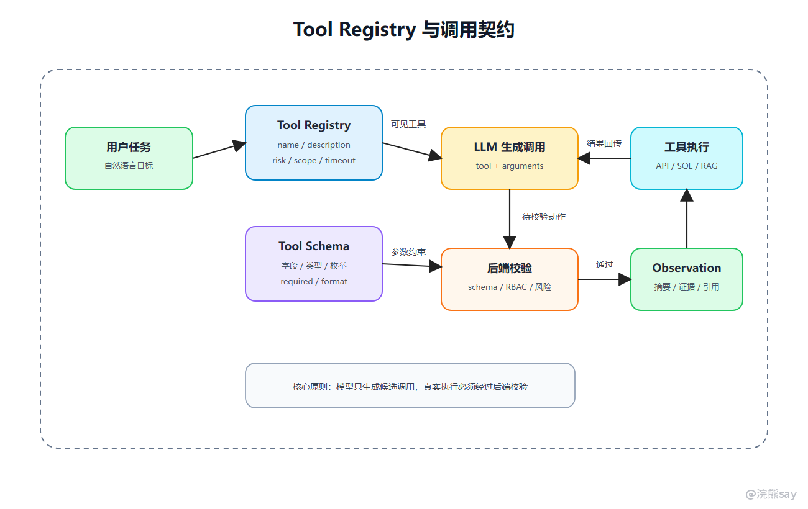
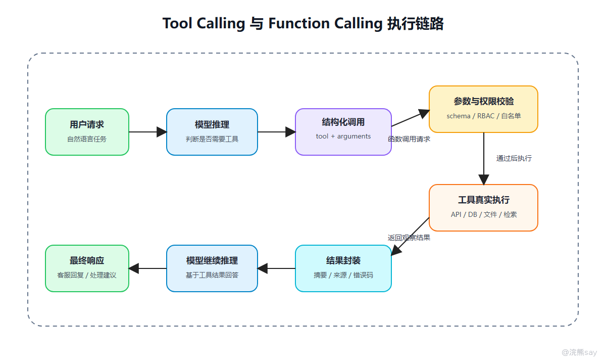

# Tool Calling与Function Calling

Tool Calling（工具调用）是 Agent 系统连接外部能力的关键机制。大语言模型本身不能直接查询数据库、访问核心账务、读取 CRM、创建工单或修改业务数据，它只能根据上下文生成调用某个工具的意图；真正的执行、校验和记录必须由后端系统完成。

Function Calling（函数调用）是 Tool Calling 的一种结构化实现方式。它允许模型按照预定义的函数名称、参数 Schema 和调用格式生成结构化请求，从而减少纯文本解析的不稳定性。模型输出的函数调用并不是可信结果，而是一个待后端校验的候选动作。

从工程角度来看，Tool Calling 的核心不只是“模型会调用函数”，而是工具注册表、工具描述、参数 Schema、权限策略、风险等级、执行函数、结果归一化、超时重试、幂等控制和审计日志共同构成的一套治理机制。

## 从执行链路看：工具调用到底发生了什么

用户说：

```text
我的信用卡为什么扣了年费？能不能减免？
```

模型不能直接查数据库，它只能生成一个“请求后端帮我查”的结构化动作：

```json
{
  "tool_name": "query_card_fee_transaction",
  "arguments": {
    "customer_id": "CUST_9281",
    "card_token": "CARD_TK_7742",
    "billing_month": "2026-06"
  }
}
```

后端拿到这个动作后，做四件事：

```text
1. 这个工具是否存在
2. 当前用户是否能调用这个工具
3. 参数是否合法
4. 调用真实信用卡系统并返回摘要
```

所以 Tool Calling 不是“模型替代后端”，而是“模型生成调用意图，后端负责可信执行”。

## 一、Tool 在系统里到底是什么

在工程里，Tool 不只是一个函数名。一个可上线的 Tool 至少要包含名称、描述、参数 schema、权限策略、执行函数、返回结构和风险等级。名称要让模型容易选择，描述要告诉模型什么时候该用、什么时候不能用；参数 schema 负责约束类型、枚举、必填项和格式；权限策略决定当前用户能不能调用；执行函数才是真正访问 API、SQL 或检索服务的后端逻辑；返回结构要同时服务模型观察和审计复查；风险等级用来区分只读、写操作和高风险操作。

所以 Tool 更像一个“受治理的能力单元”，不是随便暴露一个方法给模型。

## 二、工具注册表 Tool Registry

一个 Agent 系统一般会维护 Tool Registry，用来统一管理可调用工具。



示例结构：

| 字段 | 示例 |
| --- | --- |
| tool_name | query_card_fee_transaction |
| description | 查询指定客户、指定卡片、指定账单月的年费扣费和达标情况 |
| risk_level | read_only |
| scope | card_fee:read |
| timeout_ms | 3000 |
| max_retry | 1 |
| owner_service | card-service |
| enabled | true |

工具注册表解决三个问题：

1.  模型能看到哪些工具。
    
2.  后端知道每个工具如何执行。
    
3.  安全层知道每个工具的权限和风险等级。
    

如果没有 Tool Registry，工具会散落在代码里，权限、日志、超时、失败处理都很难统一。

## 三、Tool Schema 怎么设计

Tool Schema 的目标不是给模型看起来“高级”，而是减少参数错误。

以信用卡年费查询工具为例：

```json
{
  "name": "query_card_fee_transaction",
  "description": "查询指定客户、指定卡片、指定账单月的年费扣费交易和消费达标情况。仅用于客服解释和坐席辅助，不执行减免操作。",
  "parameters": {
    "type": "object",
    "properties": {
      "customer_id": {
        "type": "string",
        "description": "客户脱敏 ID，不允许传入姓名、手机号、身份证号等明文敏感信息"
      },
      "card_token": {
        "type": "string",
        "description": "卡片令牌化标识，不允许传入完整卡号"
      },
      "billing_month": {
        "type": "string",
        "description": "账单月，格式为 YYYY-MM"
      }
    },
    "required": ["customer_id", "card_token", "billing_month"]
  }
}
```

这个 schema 至少做了三件事：

-   限定客户和卡片只能使用脱敏标识，不让模型把明文敏感信息传给工具。
    
-   限定账单月格式，避免生成“最近”这种无法直接执行的模糊参数。
    
-   在描述里声明“只用于客服解释，不执行减免操作”，降低模型误用为账务修改工具的概率。
    

## 四、工具调用链路

Tool Calling 的执行链路如下：



一个完整链路至少包括 8 步：系统先把用户可见的工具描述注入模型上下文，模型再输出工具名称和参数；后端解析结构化 JSON 后，先做 Schema 校验，再按用户身份和工具 scope 做权限校验；校验通过后才调用真实后端服务；工具结果返回后还要归一化成 Observation，并把用户、工具、参数、结果和耗时写入日志。

这里的关键是：模型输出的工具调用请求不是可信结果，只是待校验的候选动作。

## 五、后端执行伪代码

后端处理工具调用时，可以按这个顺序：

```text
function handleToolCall(user, taskId, toolCall):
    tool = toolRegistry.get(toolCall.toolName)
    if tool == null:
        return observation("tool_not_found")

    if not permissionService.allowed(user, tool.scope):
        return observation("permission_denied")

    validation = schemaValidator.validate(tool.schema, toolCall.arguments)
    if validation.failed:
        return observation("invalid_arguments", validation.errors)

    risk = riskService.check(user, tool, toolCall.arguments)
    if risk.needApproval:
        return observation("waiting_approval", risk.reason)

    key = buildIdempotencyKey(user.id, taskId, tool.name, toolCall.arguments)
    if tool.riskLevel != "read_only" and idempotencyStore.exists(key):
        return observation("duplicated_call")

    result = toolExecutor.invoke(tool, toolCall.arguments, timeout=tool.timeoutMs)
    return normalizeObservation(result)
```

这段逻辑里最关键的是：权限校验和参数校验发生在后端，而不是只写在 Prompt 里。

## 六、Function Calling 和 Prompt 解析的本质差异

早期一些系统会用 Prompt 要求模型输出：

```text
Action: query_card_fee_transaction
Input: customer_id=CUST_9281, card_token=CARD_TK_7742, billing_month=2026-06
```

这种方式适合快速演示，但生产系统有明显问题：

-   输出格式可能不稳定。
    
-   参数字段可能缺失。
    
-   多工具调用时难解析。
    
-   错误处理依赖字符串规则。
    
-   很难做严格 schema 校验。
    

Function Calling 的价值，是让模型按结构化格式生成调用请求。它不等于工具执行本身，只是让“模型生成动作”这一环更稳定。

可以这样对比：

| 方式 | 适合场景 | 核心问题 |
| --- | --- | --- |
| Prompt 模拟工具调用 | demo、简单任务 | 解析脆弱 |
| Function Calling | 单模型、多函数场景 | 结构化输出更稳定 |
| Tool Calling | 更通用的工具生态 | 需要工具治理和权限 |
| MCP | 多系统、多资源接入 | 解决标准化连接 |

## 七、工具执行结果怎么返回

工具返回结果不建议直接把原始 JSON 塞给模型。更好的做法是拆成两份：一份是原始结果，存数据库、对象存储或日志，用于审计和复查；另一份是给模型看的 Observation，要做摘要化、结构化和字段裁剪。

例如信用卡系统返回完整账单明细，模型不需要看全部流水。系统可以先裁剪成：

```json
{
  "status": "success",
  "summary": "查询到 2026-06 账单月年费扣费 300 元；客户本年度已计入消费 9 笔，规则要求 12 笔可减免。",
  "evidence": [
    {"field": "annual_fee_amount", "value": 300},
    {"field": "qualified_txn_count", "value": 9},
    {"field": "required_txn_count", "value": 12}
  ],
  "data_ref": "card_fee_stats_20260623_001"
}
```

这样既控制上下文长度，又保留了原始数据引用。

## 八、工具调用的可靠性设计

工具调用最容易出问题的不是“调用不了”，而是调用了但结果不稳定。参数缺失时，工具层应该返回 `need_clarification`，让模型追问用户；参数非法时，schema 直接拦截，不进入真实工具；权限不足时返回 `permission_denied`，不能让模型靠换说法绕过；工具超时时要设置超时、有限重试和降级结果；重复调用要靠请求 ID 或幂等键控制；结果过大时要分页、聚合、摘要和字段裁剪；写操作则先生成草稿，人工确认后再提交。

幂等键可以这样设计：

```text
idempotency_key = hash(user_id + task_id + tool_name + normalized_arguments)
```

对只读查询，重复执行问题不大；对创建客服工单、提交年费减免申请、发送客户通知这类写操作，幂等非常关键，否则 Agent 重试一次就可能创建两条记录或重复触达客户。

## 九、工具描述怎么写才不容易选错

参考文章里提到 Tool Prompt。工程上，工具描述写得不好，模型就会乱选工具。

差的工具描述：

```text
query_data：查询数据。
```

更好的工具描述：

```text
query_card_fee_transaction：
用于查询信用卡年费扣费交易和消费达标情况，例如账单月、年费金额、卡产品类型、达标消费次数。
仅返回客服解释所需的脱敏摘要，不返回完整卡号、身份证号、手机号和完整账单流水。
当客户询问“为什么扣年费、能否减免、还差几笔达标消费”时使用。
如果客户要提交正式减免，应使用 create_fee_waiver_request_draft，并等待坐席确认。
```

工具描述至少要讲清四件事：这个工具能做什么，不能做什么，什么时候应该使用，以及返回什么。它的目标不是写给人看起来完整，而是让模型在多个相似工具之间少选错。

这比单纯堆工具名更有效。

## 十、央国企场景里的工具分级

工具接入建议先分级：

| 等级 | 示例 | 策略 |
| --- | --- | --- |
| L0 只读查询 | 业务规则检索、账单摘要查询、客服记录查询 | 可自动调用，但要审计 |
| L1 辅助生成 | 生成客服回复、草拟减免申请、生成质检摘要 | 可自动生成，不自动提交 |
| L2 内部写操作 | 创建客服工单、更新备注、发起待办 | 必须人工确认 |
| L3 高风险操作 | 账务减免执行、额度调整、客户资料变更、转账交易 | 默认不开放给 Agent |

这样讲会比“Agent 可以接入各种业务系统”更稳，也更符合央国企面试对安全边界的关注。

## 十一、面试表达模板

可以这样回答：

```text
Tool Calling 不是简单让模型调用函数，而是把外部能力封装成受治理的工具。
每个工具都应该有名称、描述、参数 schema、权限策略、风险等级、执行函数和返回结构。
模型只生成结构化调用请求，后端需要做 schema 校验、权限校验、工具执行、结果归一化和日志记录。
Function Calling 的价值是让模型以稳定结构输出函数调用，避免纯 Prompt 解析不稳定。
在企业场景里，我会把工具按只读查询、辅助生成、内部写操作和高风险操作分级，写操作必须人工确认并做幂等。
```

下一篇继续看：工具调用跑起来之后，Agent 的状态、记忆和任务编排怎么设计。
