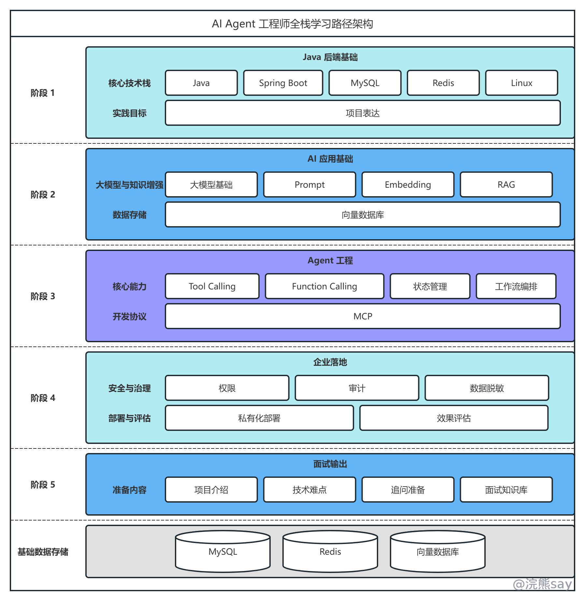
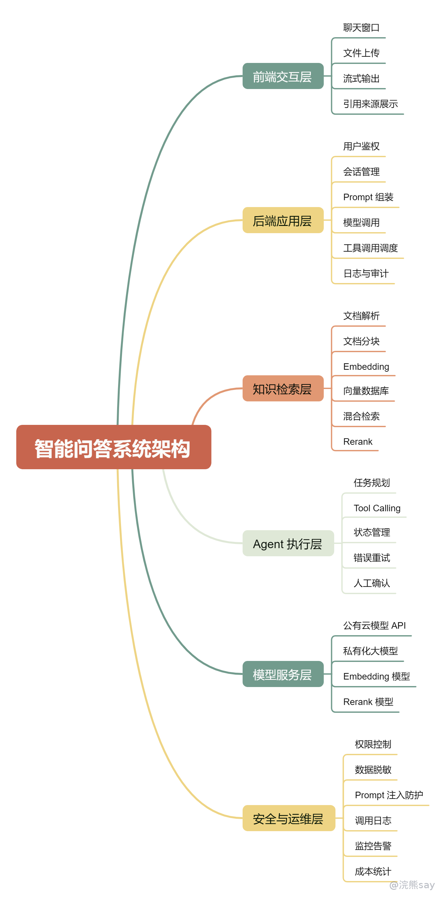
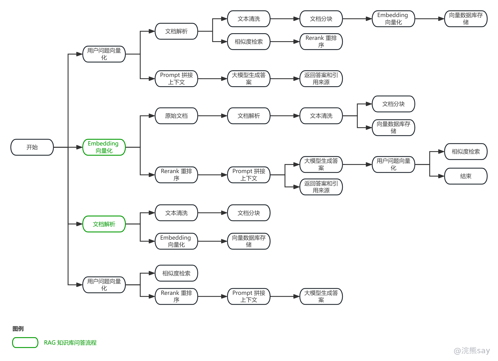
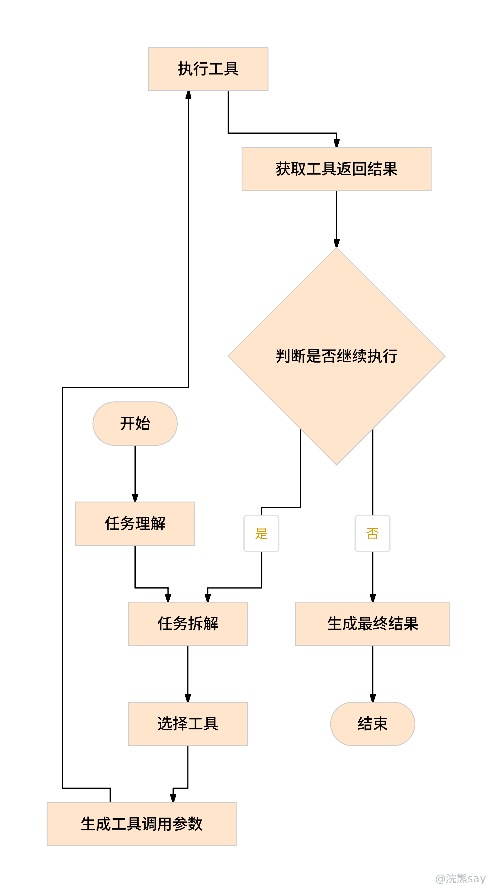

# 央国企AI开发面试指南（Agent工程师）

这篇主要写给准备央国企技术岗、国企科技子公司、央企研究院、运营商科技岗、金融科技岗、能源电力信息化岗的同学。重点不是讨论“AI 会不会替代 Java”，而是把一个更现实的问题讲清楚：现在央国企技术面试仍然以 Java 后端为基础，但 AI 应用开发，尤其是 RAG 和 Agent，正在变成越来越重要的加分能力。



先把判断放在前面：

1.  央国企技术岗当前仍以传统 Java 后端、企业信息化系统、数据平台和业务系统开发为主。
    
2.  AI 应用开发不会短期替代 Java 后端，但会成为技术岗候选人的重要加分项。
    
3.  私企、AI 应用公司、软件厂商和市场化国企科技子公司，对 RAG、Agent、工具调用、模型接入和工程落地的考察已经更直接。
    
4.  对央国企求职来说，更稳的路线不是放弃 Java 转纯 AI，而是在 Java 后端基础上叠加 RAG、Agent 和企业场景落地能力。
    

## 一、央国企技术岗正在发生什么变化

### 1\. 政策侧：AI 已经从概念进入场景落地

2025 年国务院印发《关于深入实施“人工智能+”行动的意见》，提出推动人工智能与经济社会各行业各领域广泛深度融合，并强调模型能力、数据供给、智能算力、开源生态、人才队伍和安全能力等基础支撑。

国务院国资委也在持续推进中央企业“AI+”专项行动。公开报道中提到，中央企业下一步将更加突出应用领航、数据赋能和智算筑基，重点面向战略意义强、经济收益高、民生关联紧的高价值场景。2026 年 1 月新华网报道显示，中央企业已在能源、制造、通信等重点行业打造超一千个 AI 应用场景，国家电网、南方电网已在电力调度、故障预测等方向应用 AI，三大运营商也建设了万卡集群支撑大模型训练和应用。

这说明央国企做 AI 已经不只是概念展示，而是在往生产、调度、运维、客服、知识管理、办公自动化和行业模型建设这些具体场景里走。

### 2\. 岗位侧：传统后端仍是主体，AI 应用能力开始加权

央国企的软件开发岗位不会像互联网公司那样频繁切换技术栈。大多数岗位的工作内容仍然很传统，主要围绕这些系统展开：

-   企业内部业务系统
    
-   OA、门户、权限、流程审批系统
    
-   数据填报、统计分析、报表系统
    
-   生产经营管理系统
    
-   数据中台、业务中台、集成平台
    
-   行业软件和信息化平台
    

这些岗位仍然需要 Java、Spring Boot、MySQL、Redis、消息队列、Linux、接口开发、日志监控和部署运维能力。

变化在于，这些传统系统正在开始叠加 AI 能力。比较常见的方向包括：

-   制度文件知识库问答
    
-   智能客服和工单辅助处理
    
-   合同、招采文件、制度文件解析
    
-   设备巡检报告自动生成
    
-   生产运行日志分析
    
-   电力、能源、通信等行业场景的辅助诊断
    
-   内部办公助手和流程自动化 Agent
    

所以未来一段时间，央国企技术岗更吃香的能力组合大概率会变成：

```text
传统后端开发能力
+ 企业业务系统理解
+ 数据和权限意识
+ RAG / Agent / 工具调用能力
+ 安全合规和内网部署意识
```

### 3\. 面试侧：从“会不会框架”转向“能不能落地系统”

传统 Java 面试主要判断候选人能不能完成企业软件开发任务。AI 应用开发面试会再往前看一步：你能不能把大模型能力做成可控、可维护、可上线的业务系统。

面试关注点会从：

```text
接口怎么写
表怎么设计
缓存怎么用
事务怎么控制
```

扩展为：

```text
知识库怎么构建
文档怎么分块
向量检索怎么优化
模型幻觉怎么控制
Agent 怎么调用工具
权限和审计怎么设计
内网环境怎么部署
AI 输出怎么评估
```

所以 AI 应用开发不是背几个平台名词，也不是只会调一个模型接口，而是掌握一套新的工程化能力。

## 1、传统央国企Java开发面试考察什么？

传统央国企 Java 开发面试，可以先按 7 个模块准备。

### 1\. Java 语言基础

这一块主要看：

-   面向对象：封装、继承、多态、接口、抽象类
    
-   集合：ArrayList、LinkedList、HashMap、ConcurrentHashMap
    
-   异常：受检异常、运行时异常、异常处理方式
    
-   泛型：类型擦除、泛型边界
    
-   反射：Class、Method、Field、动态代理
    
-   并发：线程、线程池、锁、volatile、synchronized、AQS
    
-   JVM：内存区域、类加载、GC、对象创建过程
    

面试里常问：

| 问题 | 考察点 |
| --- | --- |
| HashMap 为什么线程不安全？ | 数据结构、扩容、并发修改 |
| ConcurrentHashMap 如何保证并发安全？ | 分段锁/CAS/synchronized 机制演进 |
| 线程池核心参数有哪些？ | 任务提交流程、拒绝策略、队列选择 |
| synchronized 和 ReentrantLock 区别？ | 锁机制、可中断、公平锁、条件队列 |
| JVM 内存区域包括哪些？ | 堆、栈、方法区、程序计数器、本地方法栈 |

准备到这个程度基本够用：

```text
能解释概念
能画出基本流程
能结合项目说明使用场景
能回答 1-2 层追问
```

### 2\. Spring Boot 与企业应用开发

这一块主要看：

-   Spring IOC、Bean 生命周期、依赖注入
    
-   AOP、动态代理、切面应用
    
-   Spring MVC 请求处理流程
    
-   Spring Boot 自动配置原理
    
-   事务传播机制、事务失效场景
    
-   MyBatis 映射、动态 SQL、分页、批处理
    
-   参数校验、统一异常处理、统一返回结构
    

面试里常问：

| 问题 | 考察点 |
| --- | --- |
| Spring Bean 的生命周期是什么？ | 容器初始化、属性注入、初始化方法 |
| Spring Boot 自动配置怎么生效？ | starter、自动配置类、条件注解 |
| @Transactional 什么时候会失效？ | 代理机制、异常类型、方法调用方式 |
| Controller 到 Service 再到 Mapper 的调用链路是什么？ | MVC 分层与工程结构 |

央国企技术岗通常更关注是否具备规范开发能力，而不是是否掌握极端复杂的框架源码。准备时应把框架原理和实际业务开发结合起来。

### 3\. 数据库与数据一致性

这一块主要看：

-   MySQL 索引结构、联合索引、最左前缀
    
-   SQL 优化、执行计划、慢查询分析
    
-   事务 ACID、隔离级别、MVCC
    
-   行锁、间隙锁、死锁
    
-   表结构设计、字段类型选择
    
-   分页查询、批量写入、数据归档
    

面试里常问：

| 问题 | 考察点 |
| --- | --- |
| 为什么加了索引查询仍然慢？ | 索引失效、回表、数据分布、执行计划 |
| MySQL 事务隔离级别有哪些？ | 脏读、不可重复读、幻读 |
| 如何设计一张审批流程表？ | 业务建模、状态字段、审计字段 |
| 如何排查慢 SQL？ | explain、索引、where 条件、分页方式 |

央国企系统通常对数据正确性、流程留痕和审计字段比较重视。项目表达中要说明创建人、创建时间、更新时间、状态字段、操作日志、数据权限等设计。

### 4\. Redis、消息队列与常见中间件

这一块主要看：

-   Redis 数据类型和使用场景
    
-   缓存穿透、缓存击穿、缓存雪崩
    
-   缓存一致性方案
    
-   分布式锁基本实现
    
-   消息队列削峰、异步、解耦
    
-   消息重复消费、消息丢失、顺序消费
    
-   定时任务、日志系统、对象存储
    

面试里常问：

| 问题 | 考察点 |
| --- | --- |
| 缓存和数据库如何保持一致？ | 删除缓存、延迟双删、订阅 binlog |
| 如何防止重复提交？ | token、幂等表、唯一索引、分布式锁 |
| 消息队列为什么会重复消费？ | ack、重试、消费幂等 |
| Redis 分布式锁有哪些问题？ | 过期时间、误删、续期、RedLock |

央国企面试不一定要求候选人设计高并发秒杀系统，但会关注是否理解缓存、异步、幂等、日志和异常补偿。

### 5\. 项目经历与业务表达

项目表达建议采用以下结构：

```text
业务背景：系统服务什么部门、岗位或业务流程
核心功能：系统包含哪些主要模块
个人职责：本人负责哪些模块和接口
技术实现：用了哪些技术解决哪些具体问题
难点处理：遇到过什么性能、数据、权限、流程问题
结果产出：系统上线效果、数据规模、效率提升或管理价值
```

示例：

```text
该项目面向企业内部业务管理场景，主要解决数据分散、人工登记效率低、查询统计不便的问题。
我负责用户权限、业务数据管理和统计查询模块，包括表结构设计、接口开发、权限校验和异常处理。
在查询性能方面，我针对高频查询字段建立联合索引，并对分页查询进行了优化。
在数据一致性方面，我通过事务控制和状态机设计保证审批流程的状态流转正确。
在审计方面，系统记录关键操作日志，便于后续追溯。
```

避免以下表达：

```text
我用了 Spring Boot、MyBatis、Redis、RabbitMQ、Docker，实现了用户模块、订单模块、权限模块。
```

这种表达缺少业务背景、个人贡献、技术难点和结果，不利于技术面试追问。

### 6\. 工程能力

这一块主要看：

-   Git 分支管理和冲突处理
    
-   Linux 常用命令
    
-   Docker 镜像、容器、日志查看
    
-   Nginx 反向代理
    
-   接口联调、Swagger / Apifox
    
-   日志排查、异常定位
    
-   配置文件、环境变量、部署脚本
    

面试里常问：

| 问题 | 考察点 |
| --- | --- |
| 线上接口报 500 怎么排查？ | 日志、参数、数据库、依赖服务 |
| Linux 如何查看端口占用？ | netstat、ss、lsof |
| 如何查看服务日志？ | tail、grep、journalctl、docker logs |
| Git 冲突怎么解决？ | 分支、merge、rebase、冲突文件处理 |

央国企技术岗通常需要候选人能参与真实开发和系统维护，工程能力不能只停留在代码层面。

### 7\. 央国企岗位匹配

除技术问题外，央国企面试还会关注以下内容：

-   是否理解目标单位业务
    
-   是否接受较稳定、流程化的开发环境
    
-   是否具备长期发展意愿
    
-   是否重视数据安全和合规
    
-   是否能与业务部门沟通
    
-   是否能接受文档、流程、审批、验收等工作
    

技术类岗位不是只看“会不会写代码”，还会判断候选人是否适合企业内部系统建设环境。

## 2、央国企AI应用开发考察什么？

AI 应用开发不是算法岗。

算法岗重点是模型训练、机器学习、深度学习、论文、实验指标和算法优化。AI 应用开发重点是把大模型接入业务系统，并围绕知识库、工具调用、权限控制、流程编排、效果评估和部署运维形成完整应用。

### 1\. AI 应用开发的标准架构

一个比较完整的 AI 应用系统，大致可以拆成下面几层：



如上图所示，这张图展示的是一个典型智能问答系统的分层架构。它不是单纯调用大模型 API，而是由前端交互、后端应用、知识检索、Agent 执行、模型服务以及安全运维共同组成的一套完整工程系统。

前端交互层主要负责用户入口，包括聊天窗口、文件上传、流式输出和引用来源展示。用户可以通过聊天窗口提出问题，也可以上传制度文件、业务文档或其他资料；系统在返回答案时，最好能支持流式输出，并展示答案引用了哪些原文片段，方便用户判断结果是否可信。

后端应用层是整个系统的调度中心，也是 Java 后端能力体现最明显的部分。它需要处理用户鉴权、会话管理、Prompt 组装、模型调用、工具调用调度以及日志审计。也就是说，大模型并不是直接暴露给用户，而是由后端统一封装调用逻辑、控制上下文、记录调用过程，并根据业务规则决定是否需要检索知识库或调用外部工具。

知识检索层主要对应 RAG 能力，负责把企业内部文档转化成模型可用的知识来源。它包括文档解析、文档分块、Embedding 向量化、向量数据库存储、混合检索和 Rerank 重排序。对于央国企场景来说，这一层非常关键，因为大量知识都存在于制度文件、操作规范、业务流程、设备手册和历史报告中，不能只依赖大模型自身的预训练知识。

Agent 执行层解决的是“模型如何完成多步骤任务”的问题。普通问答系统主要是回答问题，而 Agent 需要具备任务规划、Tool Calling、状态管理、错误重试和人工确认能力。比如用户提出“帮我查询某设备最近一周的异常记录并生成分析报告”，系统就需要先拆解任务，再调用数据库、日志系统或报表工具，最后汇总结果。

模型服务层提供底层模型能力，包括公有云模型 API、私有化大模型、Embedding 模型和 Rerank 模型。实际落地时，要根据数据安全要求、成本、响应速度和部署环境选择模型方案。央国企内部数据敏感度较高，很多场景不能简单把文档直接发给公网模型，因此私有化部署、内网调用和模型权限边界都需要提前考虑。

安全与运维层贯穿整个系统，包括权限控制、数据脱敏、Prompt 注入防护、调用日志、监控告警和成本统计。这一层决定系统能不能真正上线。尤其在央国企场景中，智能问答系统不仅要“能回答”，还要做到数据可控、权限隔离、结果可追溯、异常可监控、成本可统计。

所以，面试中介绍这类系统时，不要只说“我做了一个 AI 问答助手”。更好的表达是：这是一个以企业知识库为基础、以后端应用层为调度中心、结合 RAG 检索和 Agent 工具调用能力，并通过安全运维体系保障可控落地的智能问答系统。

### 2\. 大模型基础

这一块主要看：

-   Token 与 Tokenization
    
-   上下文窗口
    
-   Embedding
    
-   Temperature、Top-P、Top-K
    
-   Prompt 与 System Prompt
    
-   结构化输出
    
-   模型幻觉
    
-   Function Calling / Tool Calling
    
-   流式输出
    

面试里常问：

| 问题 | 考察点 |
| --- | --- |
| Token 是什么？为什么上下文窗口有限制？ | 模型输入输出机制 |
| Temperature 调高会发生什么？ | 输出随机性和稳定性 |
| 为什么大模型会产生幻觉？ | 统计生成、知识缺失、上下文不足 |
| 如何让模型输出稳定 JSON？ | JSON Schema、格式约束、重试校验 |
| 流式输出怎么实现？ | SSE、WebSocket、分块返回 |

准备时不用停在名词解释，至少要讲到这几件事：

```text
能解释大模型基本概念
能说明参数对输出的影响
能结合项目说明如何控制输出稳定性
```

### 3\. RAG 知识库

RAG 是央国企 AI 应用开发中非常重要的方向。企业内部有大量制度、规范、流程、合同、报告、设备文档和业务资料，不可能全部依赖模型预训练知识，需要通过检索增强生成把外部知识接入模型，RAG 的链路可以按这个顺序理解：  



这一块主要看：

-   PDF、Word、Markdown、HTML 文档解析
    
-   chunk size 和 overlap
    
-   向量数据库：FAISS、Milvus、pgvector、Chroma 等
    
-   Embedding 模型选择
    
-   关键词检索与向量检索
    
-   混合检索
    
-   Rerank
    
-   引用来源
    
-   低置信度拒答
    
-   知识库更新和版本管理
    

面试里常问：

| 问题 | 考察点 |
| --- | --- |
| chunk size 怎么设置？ | 语义完整性、召回精度、上下文长度 |
| 为什么检索到了资料，回答仍然错误？ | 召回质量、重排序、Prompt、幻觉 |
| 如何提升 RAG 准确率？ | 混合检索、rerank、query rewrite、引用约束 |
| 如何处理表格和扫描 PDF？ | OCR、结构化解析、表格抽取 |
| 知识库如何更新？ | 增量索引、版本号、过期文档处理 |

央国企场景中，RAG 的重点不是只做一个聊天窗口，而是解决内部知识分散、查询效率低、回答不可追溯的问题。因此，引用来源、权限隔离、文档版本和审计日志非常重要。

### 4\. Agent 与工具调用

Agent 的核心不是“会聊天”，而是能够基于目标执行多步骤任务，并在过程中调用工具，典型 Agent 执行流程：



工具可以包括：

-   数据库查询
    
-   搜索接口
    
-   文件解析
    
-   工单创建
    
-   报表生成
    
-   邮件或消息通知
    
-   业务系统 API
    
-   代码执行环境
    
-   计算器
    
-   OCR
    

Agent 面试重点：

| 考察方向 | 需要说明的问题 |
| --- | --- |
| 任务规划 | Agent 如何拆解复杂任务 |
| 工具注册 | 工具有哪些，参数 schema 如何定义 |
| 工具选择 | 模型如何判断调用哪个工具 |
| 参数校验 | 如何防止错误参数或越权参数 |
| 状态管理 | 多轮任务中如何保存上下文和执行状态 |
| 错误处理 | 工具失败、超时、返回异常时如何处理 |
| 人工确认 | 哪些高风险操作需要 human-in-the-loop |
| 日志审计 | 每次工具调用如何记录和追踪 |

面试里常问：

| 问题 | 考察点 |
| --- | --- |
| Agent 和普通聊天机器人有什么区别？ | 目标驱动、工具调用、多步骤执行 |
| Function Calling 和 Prompt 拼接工具说明有什么区别？ | 结构化调用、稳定性、参数约束 |
| Agent 调错工具怎么办？ | 白名单、权限、校验、人工确认 |
| Agent 死循环怎么办？ | 最大步数、超时、状态判断、终止条件 |
| 工具调用失败怎么办？ | 重试、降级、错误返回、人工介入 |

央国企场景中，Agent 不能无约束地自动执行高风险操作。涉及生产调度、财务、人事、合同、设备控制、用户权限变更等操作时，应设计人工确认、权限校验、审批流程和审计日志。

### 5\. MCP、LangChain、LangGraph、Dify 等工具如何准备

面试中不一定要求精通所有框架，但需要知道它们解决什么问题。

| 工具/框架 | 主要作用 | 面试准备重点 |
| --- | --- | --- |
| MCP | AI 应用连接外部工具和数据源的开放协议 | 工具、资源、服务端、客户端的概念 |
| LangChain | 大模型应用开发框架 | LLM、Prompt、Retriever、Tool、Chain |
| LangGraph | 图结构 Agent 编排框架 | 状态、节点、边、持久化、人工介入 |
| Dify | 低代码 AI 应用平台 | Workflow、RAG、Agent、模型接入、日志 |
| FastGPT | 知识库问答和工作流平台 | 知识库、流程编排、工具调用 |
| 向量数据库 | 存储和检索 Embedding | 相似度检索、索引、召回性能 |

准备原则：

```text
至少精通一种实现方式
了解其他工具的定位
能说明为什么选择某个框架
能讲清框架背后的通用原理
```

不要只说“我用过 Dify”或“我用过 LangChain”。更好的表达是：

```text
我使用 Dify 快速搭建过知识库问答和工作流原型，理解其 RAG、Prompt 编排、工具调用和日志观察能力。
在代码实现层面，我也能用 Spring Boot 接入模型 API、向量数据库和工具接口，实现可定制的 RAG / Agent 后端。
```

### 6\. 安全、合规与内网部署

央国企 AI 应用面试中，安全合规是高频考点。

这一块主要看：

-   内部数据是否能发送到公网模型
    
-   敏感字段脱敏
    
-   文档访问权限
    
-   不同部门知识库隔离
    
-   Prompt 注入防护
    
-   模型输出审核
    
-   工具调用权限
    
-   操作日志和审计
    
-   私有化部署
    
-   国产化适配
    

面试里常问：

| 问题 | 考察点 |
| --- | --- |
| 企业内部文件能否直接上传到公有云模型？ | 数据安全、合规边界 |
| 如何防止 Prompt 注入？ | 指令隔离、输入检测、权限约束 |
| 如何避免模型泄露敏感信息？ | 权限检索、脱敏、输出审核 |
| 内网部署有哪些组件？ | 模型服务、向量库、应用服务、日志监控 |
| Agent 调用业务接口如何控权？ | RBAC、白名单、审批、人审、审计 |

央国企 AI 应用的技术方案不能只考虑“能不能跑”，还要考虑“能不能上线、能不能审计、能不能解释、出错后能不能追责”。

### 7\. AI 应用项目面试表达模板

项目介绍可以按这个顺序讲：

```text
项目背景：该项目服务哪个业务场景，解决什么问题
系统架构：前端、后端、知识库、模型服务、Agent 工具层如何组成
核心流程：用户输入后，系统如何检索、生成、调用工具并返回结果
本人职责：自己负责哪些模块
技术难点：RAG 准确率、工具调用稳定性、权限、安全、部署等
优化措施：混合检索、rerank、引用来源、结构化输出、日志审计
项目结果：功能效果、演示能力、性能指标、业务价值
```

示例：

```text
该项目是一个面向企业内部制度文件和业务流程的智能问答系统。
系统包含用户权限模块、文档解析模块、向量检索模块、大模型问答模块和 Agent 工具调用模块。
用户提问后，系统先根据用户权限筛选可检索的知识库，再通过向量检索和关键词检索召回候选片段，并使用 rerank 模型重排序。
模型生成答案时必须引用来源文件和原文片段；当召回置信度不足时，系统返回无法确认，避免模型编造。
在 Agent 部分，系统支持调用工单查询、制度检索和报表生成工具，但所有工具都经过白名单注册和参数校验，高风险操作需要人工确认。
我主要负责后端接口、知识库检索流程、模型调用封装和工具调用日志记录。
```

## 3、如何使用这一系列攻略

### 1\. 先确定目标岗位类型

不同岗位对 AI 应用开发的要求不同。

| 岗位类型 | Java 要求 | AI 应用要求 | 准备重点 |
| --- | --- | --- | --- |
| 普通央国企 Java 开发 | 高 | 低到中 | Java、数据库、项目表达，AI 作为加分 |
| 央企科技子公司开发岗 | 高 | 中 | Java 后端、数据平台、RAG 项目 |
| 运营商/金融科技岗 | 高 | 中到高 | 后端、数据、安全、AI 应用场景 |
| AI 应用开发岗 | 中到高 | 高 | RAG、Agent、模型接入、工具调用 |
| 算法岗 | 中 | 高，但偏算法 | 机器学习、深度学习、模型训练、业务场景 |
| 私企 AI 应用岗 | 中到高 | 高 | Demo、框架、工程实现、快速交付 |

### 2\. 按能力层级准备


建议按照“五个阶段”来准备。

第一阶段先补 Java 后端基础，包括 Java、Spring Boot、MySQL、Redis、Linux 和项目表达。这个阶段的目标是先稳住央国企技术岗的基础盘，因为大多数央国企技术岗仍然以传统后端开发、企业信息化系统和业务系统建设为主。

第二阶段再进入 AI 应用基础，重点掌握大模型基础、Prompt、Embedding、RAG 和向量数据库。这个阶段不要求一上来就做复杂 Agent，而是先能讲清楚知识库问答怎么实现、企业文档怎么进入系统、模型如何基于检索结果生成答案。

第三阶段准备 Agent 工程能力，包括 Tool Calling、Function Calling、状态管理、工作流编排和 MCP。这个阶段的重点是理解 Agent 如何从“回答问题”升级为“执行任务”，也就是如何拆解目标、选择工具、生成调用参数、处理工具返回结果，并完成多步骤任务。

第四阶段要补企业落地能力，包括权限、审计、数据脱敏、私有化部署和效果评估。央国企场景下，AI 应用不能只考虑功能能不能跑，还要考虑数据能不能出内网、权限怎么隔离、日志能不能追溯、模型回答错了怎么评估和兜底。

第五阶段是面试输出，把前面的技术点转成项目介绍、技术难点、追问准备和自己的面试知识库。最终不是简单背概念，而是能把 Java 后端、RAG、Agent、安全合规和项目经验串成一套完整表达，让面试官听完知道你不仅懂技术名词，也理解系统怎么落地。

### 3\. 用一个项目覆盖核心能力

适合央国企技术岗的 AI 应用项目方向：

| 项目方向 | 适配单位 | 技术点 |
| --- | --- | --- |
| 企业制度知识库问答 | 各类央国企 | RAG、权限、引用来源、文档解析 |
| 工业设备巡检 Agent | 电力、能源、制造、交通 | Agent、工具调用、报告生成、异常分析 |
| 招采文件智能解析 | 建筑、能源、制造、平台公司 | 文档解析、结构化输出、表格抽取 |
| 合同审核助手 | 金融、能源、制造、法务部门 | RAG、规则校验、风险提示、人工复核 |
| 运维日志分析助手 | 运营商、金融科技、数据中心 | 日志分析、异常定位、工具调用 |
| 客服知识库助手 | 运营商、银行、公共服务单位 | RAG、多轮问答、知识库更新 |

项目至少要做到这个程度：

```text
能运行
能演示
有真实业务背景
有后端接口和数据库
有 RAG 或 Agent 核心流程
有权限或安全控制设计
能说明技术难点和优化方案
```

### 4\. 建立面试问题库

每个技术点按以下格式整理：

```text
问题：
概念：
项目中的使用方式：
可能的问题：
优化方案：
可追问点：
```

示例：

```text
问题：RAG 为什么会回答错误？

概念：
RAG 的回答质量取决于文档解析、分块、召回、排序、Prompt 约束和模型生成多个环节。

项目中的使用方式：
系统先使用混合检索召回候选片段，再使用 rerank 模型重排序，最后把高相关片段拼入 Prompt。

可能的问题：
文档解析错误、chunk 切分过细、向量召回不准、排序不合理、上下文不足、模型幻觉、知识库过期。

优化方案：
调整 chunk size，增加 overlap，引入关键词检索，使用 rerank，要求答案引用来源，低置信度拒答。

可追问点：
chunk size 怎么选？向量检索和关键词检索如何融合？rerank 放在哪一步？如何评估 RAG 效果？
```

### 5\. 面试准备优先级

如果时间有限，按以下优先级准备：

| 优先级 | 内容 | 原因 |
| --- | --- | --- |
| P0 | Java 基础、Spring Boot、MySQL、项目表达 | 央国企技术岗基础盘 |
| P1 | RAG、Embedding、向量数据库、Prompt | AI 应用开发最常见方向 |
| P1 | Agent、Tool Calling、Function Calling | Agent 面试核心 |
| P2 | MCP、LangGraph、Dify、FastGPT | 框架和平台加分项 |
| P2 | 安全合规、权限、审计、私有化部署 | 央国企特色考点 |
| P3 | 模型微调、训练、分布式训练 | 非算法岗通常不是重点 |

### 6\. 最后要准备到什么程度

面试前可以用下面这几条做自检：

```text
1. 能讲清传统 Java 项目的业务背景、模块设计和技术难点。
2. 能解释 RAG 的完整链路，并说明如何提升回答准确率。
3. 能解释 Agent 和普通聊天机器人的区别。
4. 能说明 Tool Calling 的参数校验、权限控制和异常处理。
5. 能结合央国企场景说明数据安全、权限隔离和审计机制。
6. 能完整介绍一个 AI 应用项目，而不是只罗列技术名词。
7. 能回答为什么央国企仍然需要 Java 后端，同时为什么 AI 应用开发会成为加分项。
```

最后收一下：

```text
央国企技术岗的底座仍然是 Java 后端和企业系统开发；
AI 应用开发的价值在于把大模型能力接入知识库、业务流程和行业场景；
Agent 方向的面试重点不是概念，而是工具调用、状态管理、安全控制和工程落地。
```

## 参考信息

-   新华网：《国务院印发〈关于深入实施“人工智能+”行动的意见〉》：[https://www.news.cn/20250826/917de0ad1925479bb7de9785eb855708/c.html](https://www.news.cn/20250826/917de0ad1925479bb7de9785eb855708/c.html)
    
-   新华网：《为加快培育发展新质生产力、推动高质量发展提供新动能——解读〈关于深入实施“人工智能+”行动的意见〉》：[https://www.news.cn/politics/20250826/5f6c013ecf1d4cf5b2da5231b34b861b/c.html](https://www.news.cn/politics/20250826/5f6c013ecf1d4cf5b2da5231b34b861b/c.html)
    
-   新华网：《国务院国资委三维度深化央企“AI+”专项行动》：[https://www.news.cn/finance/20250326/e28c0cd642924c039a9f42051c5cbb1b/c.html](https://www.news.cn/finance/20250326/e28c0cd642924c039a9f42051c5cbb1b/c.html)
    
-   新华网：《中央企业“AI+”专项行动取得积极进展》：[https://www.news.cn/20260128/1554b3e479cd4c5aa5a0ee6e42048bb7/c.html](https://www.news.cn/20260128/1554b3e479cd4c5aa5a0ee6e42048bb7/c.html)
    
-   OpenAI Agents SDK 文档：[https://developers.openai.com/api/docs/guides/agents](https://developers.openai.com/api/docs/guides/agents)
    
-   MCP 官方文档：[https://modelcontextprotocol.io/docs/getting-started/intro](https://modelcontextprotocol.io/docs/getting-started/intro)
    
-   LangGraph 官方文档：[https://docs.langchain.com/oss/javascript/langgraph/overview](https://docs.langchain.com/oss/javascript/langgraph/overview)
    
-   LangChain Tool Calling 文档：[https://docs.langchain.com/oss/python/langchain/frontend/tool-calling](https://docs.langchain.com/oss/python/langchain/frontend/tool-calling)
    
-   Dify GitHub 项目说明：[https://github.com/langgenius/dify](https://github.com/langgenius/dify)
    
-   BOSS 直聘公开 AI 开发岗位信息页：[https://www.zhipin.com/zhaopin/be4bbbc71c55036c0nN-39g~/](https://www.zhipin.com/zhaopin/be4bbbc71c55036c0nN-39g~/)
