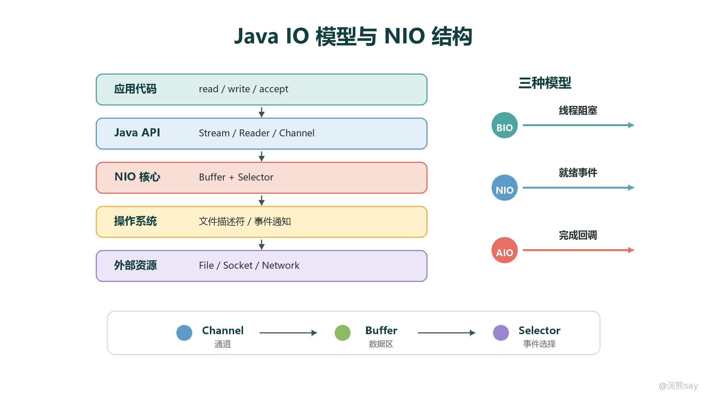
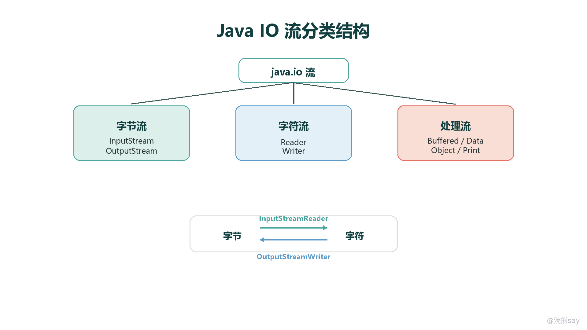
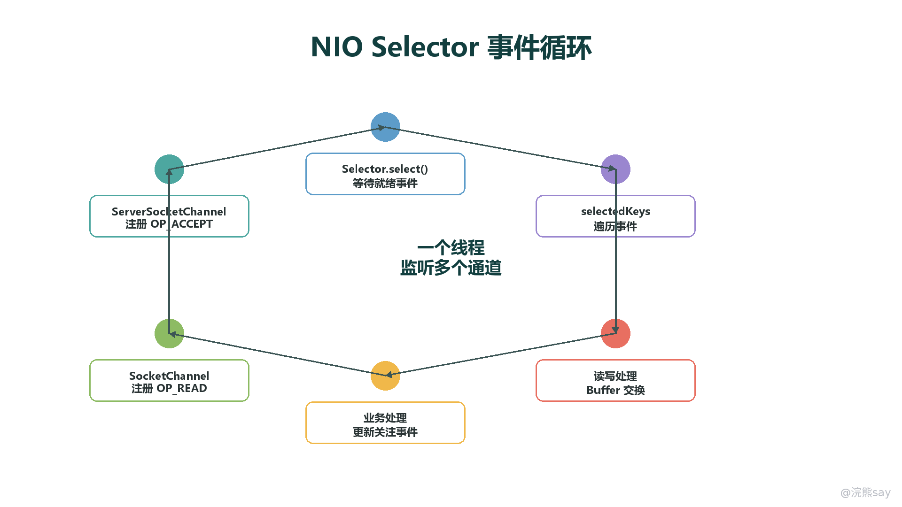
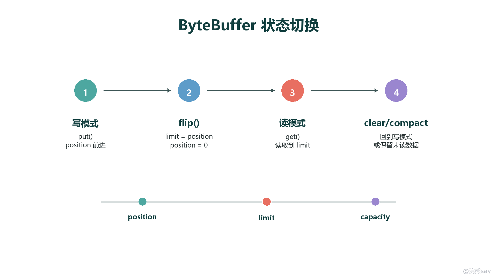
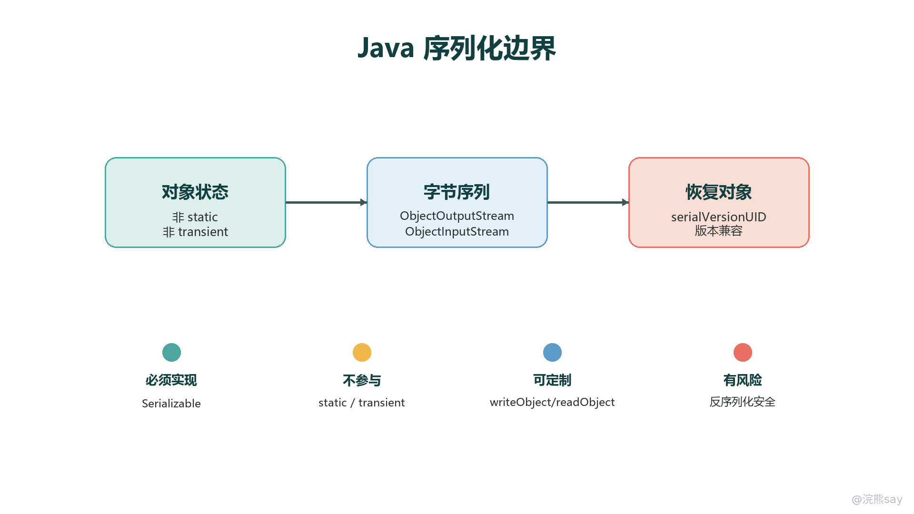

# JavaIO流

Java IO 要分成两层理解：第一层是 java.io 的流体系，负责把数据从源头读到程序、再从程序写到目的地；第二层是 BIO、NIO、AIO 这些 IO 模型，负责解释线程、通道、缓冲区和操作系统事件之间如何协作。考试常把“流的分类”和“IO 模型”混在一起问，复习时要先把边界分清。

images/java-io-model-map.png

## IO 流分类

Java 传统 IO 采用装饰器模式：底层节点流直接连接文件、数组、管道、网络等数据源；处理流包在节点流外面，增加缓冲、基本类型读写、对象序列化、打印输出等能力。按照数据单位，可以分为字节流和字符流。

images/java-io-stream-taxonomy.png

字节流以 byte 为单位，顶级抽象类是 InputStream 和 OutputStream，适合图片、音频、视频、压缩包、网络报文等二进制数据。字符流以 char 为单位，顶级抽象类是 Reader 和 Writer，适合文本处理。字符流内部必须考虑编码，因此从字节到字符通常要经过 InputStreamReader，从字符到字节通常要经过 OutputStreamWriter。

缓冲流的意义在于减少频繁系统调用。BufferedInputStream、BufferedOutputStream、BufferedReader、BufferedWriter 会在 JVM 内部维护缓冲区，一次读取或写入更多数据。BufferedReader.readLine() 是文本读取中常见方法，但它会去掉行尾换行符，写回时需要自己补充换行。

数据流 DataInputStream 和 DataOutputStream 用于按 Java 基本类型读写二进制数据。对象流 ObjectInputStream 和 ObjectOutputStream 用于原生序列化。打印流 PrintStream、PrintWriter 适合格式化输出，但要注意异常处理方式与普通流不同。

## 资源关闭与异常处理

IO 资源通常对应操作系统文件句柄或网络连接，使用后必须关闭。推荐写法是 try-with-resources，因为它会在代码块结束时自动调用资源的 close() 方法，即使中间抛出异常也能关闭资源。它要求资源实现 AutoCloseable 或 Closeable 接口。

try (BufferedReader reader = new BufferedReader(new FileReader("data.txt"))) { 
String line; 
while ((line = reader.readLine()) != null) { 
System.out.println(line); 
} 
}

输出流要注意 flush() 和 close() 的区别。flush() 是把缓冲区中的数据刷到下游，流仍可继续使用；close() 会先尝试 flush，再释放资源，关闭后不能继续读写。网络编程和文件写入中，忘记 flush 可能导致对方迟迟收不到数据。

## BIO、NIO、AIO 的区别

BIO 是同步阻塞模型。线程发起读写后会等待数据就绪和操作完成，模型简单，但连接数多时容易形成大量阻塞线程。传统 Socket + InputStream/OutputStream 就是典型 BIO 写法。

NIO 是同步非阻塞模型。它的关键不是“单次读写一定更快”，而是用 Channel、Buffer、Selector 改变连接管理方式：一个线程可以监听多个通道的就绪事件，只在真正可读、可写、可连接时处理对应事件。高并发网络服务器常用这种模型减少线程数量。

AIO 是异步 IO 模型。应用提交读写请求后可以继续执行，操作完成后由系统回调通知。Java NIO.2 提供 AsynchronousFileChannel、AsynchronousSocketChannel 等类。考试中常见判断是：BIO 阻塞等待，NIO 等待就绪事件，AIO 等待完成通知。

## NIO 核心组件

NIO 的核心是 Channel、Buffer 和 Selector。Channel 表示双向通道，常见实现包括 FileChannel、SocketChannel、ServerSocketChannel、DatagramChannel。Buffer 是数据交换区，读写都围绕它进行。Selector 可以监听多个非阻塞通道的事件，使一个线程管理多个连接。

images/java-nio-selector-loop.png

典型事件循环是：打开 ServerSocketChannel，设置非阻塞，注册到 Selector，在循环中调用 select() 等待就绪事件，然后遍历 selectedKeys()。如果是 OP\_ACCEPT，接收连接并把新 SocketChannel 注册为读事件；如果是 OP\_READ，从通道读入 Buffer；如果是 OP\_WRITE，把 Buffer 中的数据写回通道。

## ByteBuffer 状态切换

ByteBuffer 最容易考 position、limit、capacity 三个字段。capacity 是缓冲区总容量；position 是当前读写位置；limit 是当前模式下可读写的边界。写入数据后要调用 flip() 切换到读模式，此时 limit 变成原来的 position，position 归零。读完后调用 clear() 回到写模式；如果还有未读数据，调用 compact() 会保留未读数据并挪到缓冲区前部。

images/java-bytebuffer-state-flow.png

常见错误是写完 Buffer 后直接读，没有调用 flip()；或者读完后没有 clear() / compact() 就继续写，导致 position/limit 状态不正确。考试题如果出现“为什么读不到刚写入的数据”，优先检查 Buffer 模式是否切换。

## 文件 NIO 与 Path/Files

Java NIO.2 引入了 Path、Paths、Files 等 API，使文件操作更现代。Path 表示路径对象，Files 提供复制、移动、删除、读取全部行、遍历目录等静态方法。与老的 File 相比，NIO.2 对符号链接、文件属性、目录遍历和异常信息支持更完整。

Path path = Path.of("data.txt"); 
List lines = Files.readAllLines(path, StandardCharsets.UTF\_8);

实际工程中，大文件不应一次性 readAllLines() 读入内存，应该使用流式读取或 BufferedReader。如果涉及高性能文件复制，可以关注 FileChannel.transferTo() / transferFrom() 这类通道方法。

## 序列化和反序列化

序列化是把对象状态转换成字节序列，反序列化是从字节序列恢复对象。Java 原生序列化要求类实现 Serializable 标记接口。默认情况下，非 static、非 transient 的实例字段会参与序列化；static 属于类，不属于对象状态；transient 表示该字段不参与序列化。

images/java-serialization-boundary.png

serialVersionUID 用于判断序列化数据和当前类定义是否兼容。如果没有显式声明，JVM 会根据类结构计算一个值，类字段或方法变化后可能导致反序列化失败。因此可序列化类通常应显式声明 serialVersionUID。如果需要控制序列化细节，可以定义私有的 writeObject() 和 readObject() 方法。

反序列化存在安全风险，因为构造对象和恢复对象状态可能触发意外代码路径。真实工程中，不能反序列化不可信来源的数据；跨服务传输也常优先使用 JSON、Protobuf 等更可控的格式。考试中看到“序列化保存了类的全部信息”这种说法要警惕：序列化保存的是对象状态，不是完整类定义。

## 常见考试判断

- 字节流处理二进制数据，字符流处理文本数据，字符流必须关注编码。
- 处理流通常包在节点流外面，是装饰器模式的典型应用。
- BIO 是阻塞等待，NIO 是就绪事件，AIO 是完成回调。
- ByteBuffer.flip() 是从写模式切到读模式的关键步骤。
- transient 和 static 字段默认不参与 Java 原生序列化。
- try-with-resources 比手写 finally 更适合关闭 IO 资源。
