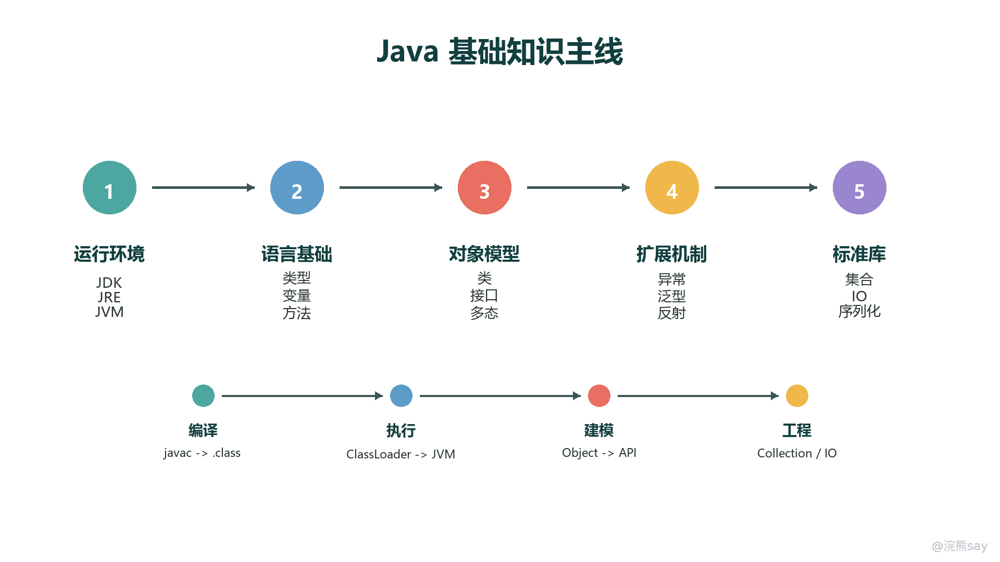
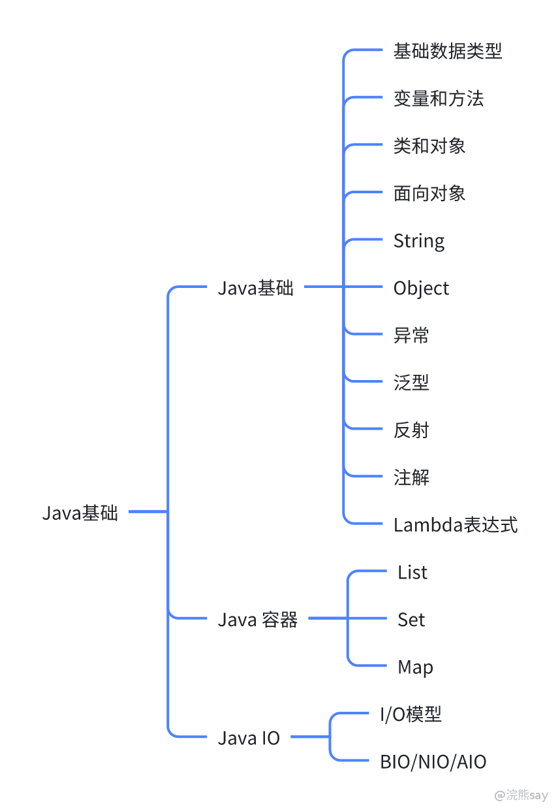
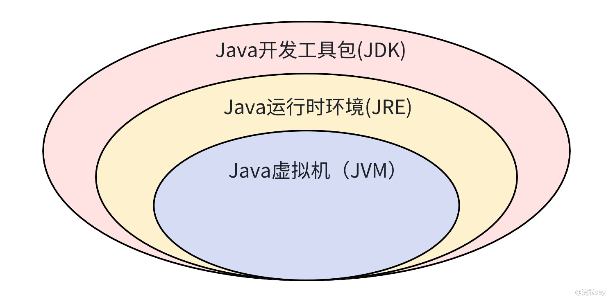
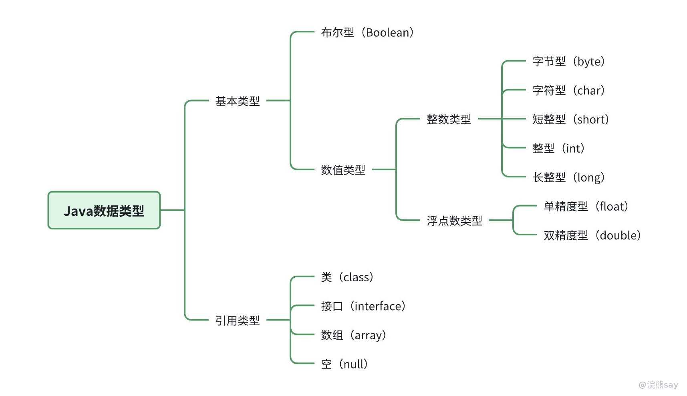
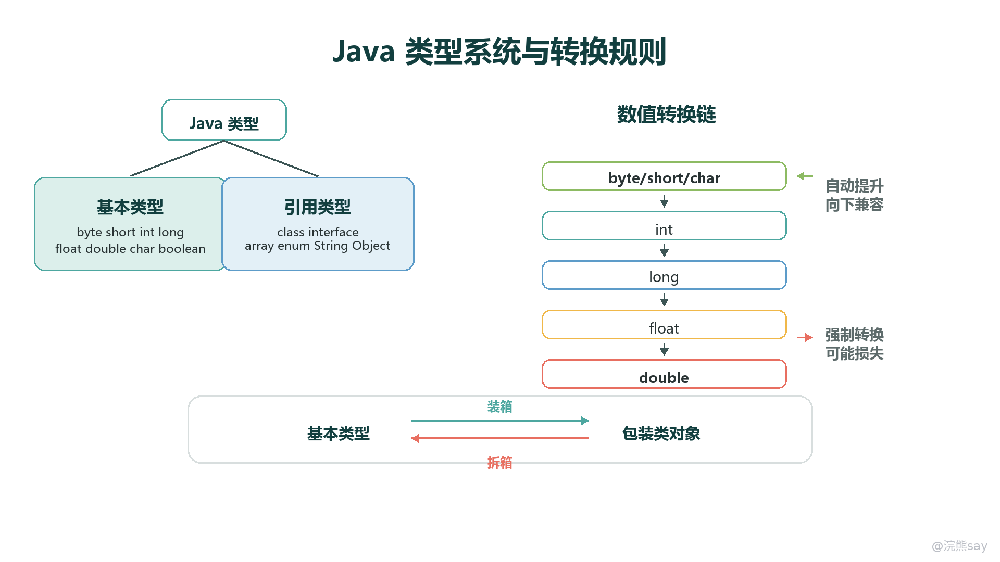
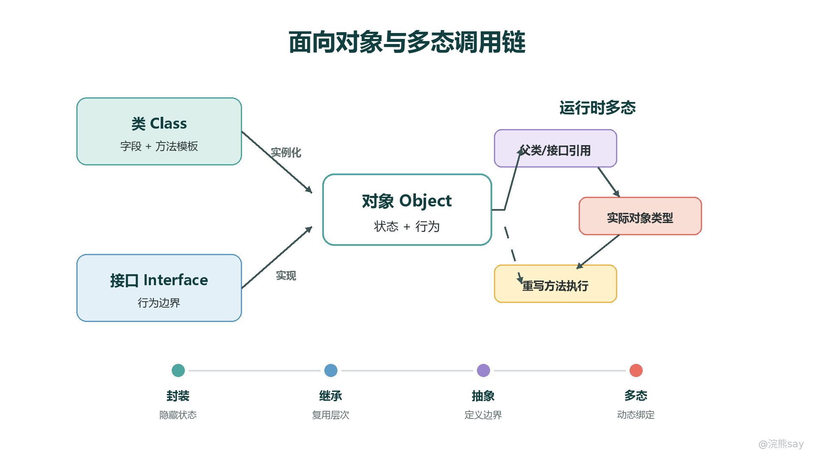

# Java基础

Java 基础不是零散语法点的堆叠，而是一条从运行环境、类型系统、面向对象，到集合、异常、IO 等标准库能力逐步展开的知识链。复习时要把每个概念放回“为什么需要、底层怎么组织、工程中怎么用、考试怎么问”这四个维度中理解。

images/java-basic-learning-map.png

## 原始思维导图

images/Lqm8b49VxoMDPDxb99xcIaO9nOb.png

## Java基础语法

### JVM、JDK、JRE 关系

images/board-GaNOwbRJ5hfe2zbfiqMcPkf7nGd.png

JDK、JRE 和 JVM 是 Java 程序从源码到运行的三层基础设施。理解它们时可以按“开发工具 -> 运行环境 -> 字节码执行引擎”来记忆：

- **JVM（Java Virtual Machine）：** Java 虚拟机负责加载 .class 字节码，并完成解释执行、即时编译、内存管理、异常处理和垃圾回收。Java 的跨平台能力主要来自 JVM 屏蔽了底层操作系统和硬件差异。
- **JRE（Java Runtime Environment）：** Java 运行时环境 = JVM + Java 标准类库 + 运行所需资源。只运行 Java 程序时安装 JRE 即可。
- **JDK（Java Development Kit）：** Java 开发工具包 = JRE + 编译、调试、打包等开发工具，例如 javac、jar、jdb。

考试和面试中常见的判断是：**JDK 包含 JRE，JRE 包含 JVM；开发需要 JDK，运行只需要 JRE，真正执行字节码的是 JVM。**

## Java 和 C++ 的区别？
| 维度 | Java | C++ |
| --- | --- | --- |
| 内存管理 | 自动垃圾回收（GC） | 手动管理（new/delete）或智能指针 |
| 跨平台 | 依赖JVM（一次编写，到处运行） | 需为不同平台单独编译 |
| 性能 | 有JVM开销，适合大多数场景 | 直接编译为机器码，性能更高 |
| 语法 | 纯面向对象，单继承 | 支持多范式，多继承 |
| 应用场景 | 企业级开发、Android、大数据 | 系统软件、游戏、嵌入式系统 |
| 安全性 | 严格检查（如数组越界） | 需手动规避指针风险 |

## Java数据类型

### 基础数据类型

images/board-WEE7w1qGzhtzR2bZQ2JccNwMnDb.png

images/java-type-system-conversion.png

Java是一种强类型语言，这意味着每个变量都必须声明其类型。Java的数据类型分为两大类：基本类型和引用类型。

### 基本类型

基本类型直接存储值，并且是内置的语言类型。Java的基本类型有以下几种：

- **整型**
 
 - byte：8位有符号整数，范围从-128到127。
 - short：16位有符号整数，范围从-32768到32767。
 - int：32位有符号整数，范围从-231到231-1。
 - long：64位有符号整数，范围从-263到263-1。使用L或l作为后缀。
 
- **浮点类型**
 
 - float：单精度32位IEEE 754浮点数。
 - double：双精度64位IEEE 754浮点数，默认的浮点数类型。
 
- **字符类型**
 
 - char：16位Unicode字符。
 
- **布尔类型**
 
 - boolean：只有两个可能的值，true和false。

### 引用类型

引用类型不是直接存储值，而是存储对对象的引用。这些类型包括：

- **类（Class）**：用户定义的对象类型。
- **接口（Interface）**：定义了一组行为规范，没有实现细节。
- **数组（Array）**：存储固定大小的同类型元素的有序集合。
- **枚举（Enum）**：一种特殊的类，用来枚举一组常量。

## Java基础数据类型转换

Java中的数据类型转换通常有两种形式：自动类型提升（自动转换）和显式类型转换（强制类型转换）。

### 自动类型提升

当进行算术运算或者赋值操作时，如果涉及到不同数据类型的变量，Java会自动将较小的数据类型提升为较大的数据类型。这种提升遵循以下规则：

- byte, short, char -> int
- int -> long
- long -> float
- float -> double 对于整型，只要目标类型足够大以容纳源类型的所有值，就不会丢失信息。然而，对于浮点类型到整型的转换，会丢失小数部分的信息。

示例：

byte b = 10; 
int i = b; // 自动提升

### 显式类型转换（强制类型转换）

当你需要将一个较大的数据类型转换为较小的数据类型时，就需要使用强制类型转换。这种转换可能会导致数据的损失或者溢出。强制类型转换通过在要转换的表达式前放置目标类型的方式来实现。

示例：

int a = 100; 
byte b = (byte) a; // 强制转换，可能溢出

在上面的例子中，a 是一个 int 类型，它的值范围比 byte 类型要大得多。将 int 类型的值强制转换为 byte 类型时，如果 int 的值不在 byte 的范围内（-128 到 127），将会发生溢出，结果将是 int 值在 byte 范围内的模值。

#### 特殊情况

- 当一个 int 与一个 float 进行运算时，int 会被提升为 float。
- 当一个 long 与一个 double 进行运算时，long 会被提升为 double。

#### 字符类型转换

字符类型也可以与其他数值类型相互转换。字符在内部是以其对应的Unicode码存储的，因此可以被提升为 int 类型，或者从 int 类型转换回字符。

示例：

char c = 'A'; 
int ascii = c; // 字符被提升为整数 
char ch = (char) ascii; // 整数被转换回字符

#### 布尔类型

布尔类型 (boolean) 不能与其他类型进行隐式或显式的类型转换。

### Java包装类

Java中的包装类（Wrapper Classes）是指对应于基本数据类型的基本类。这些类提供了将基本类型数据封装成对象的能力，从而可以利用面向对象编程的特性。以下是Java中所有基本数据类型的包装类：

- byte -> Byte
- short -> Short
- int -> Integer
- long -> Long
- float -> Float
- double -> Double
- char -> Character
- boolean -> Boolean 这些包装类提供了丰富的功能，包括但不限于：
- 将基本类型数据转化为对象。
- 提供了静态方法用于基本类型和字符串之间的转换。
- 实现了诸如Serializable和Comparable等接口，使得包装类的对象可以被序列化和比较。
- 包含一些常量和方法，方便进行类型相关的操作。

#### 创建包装类对象

可以通过多种方式创建包装类的对象：

1. **构造函数**：使用包装类的构造函数。

Integer intObj = new Integer(10);

1. **静态方法**：使用包装类提供的静态方法，如valueOf。

Integer intObj = Integer.valueOf(10);

1. **自动装箱**：Java 5引入了自动装箱机制，可以直接将基本类型赋值给包装类对象。

Integer intObj = 10; // 自动装箱

#### 包装类的方法

包装类提供了一些常用的方法，比如：

- toString(): 将基本类型转换为字符串。
- parseXxx(String s): 将字符串转换为基本类型。
- valueOf(String s): 将字符串转换为包装类对象。
- compareTo(T obj): 比较两个对象的值。
- equals(Object obj): 检查两个对象是否相等。

### 什么是⾃动装箱和⾃动拆箱？

自动装箱（Auto-boxing）和自动拆箱（Auto-unboxing）是Java 5引入的特性，它们简化了基本数据类型和其对应的包装类之间的转换。

#### （1）自动装箱（Auto-boxing）

自动装箱是指将基本数据类型自动转换为其对应的包装类对象的过程。这使得你可以直接将一个基本数据类型赋值给一个包装类类型的变量，而无需显式地使用包装类的构造函数或valueOf方法。例如：

int a = 10; 
Integer b = a; // 自动装箱

在这个例子中，a 是一个 int 类型的变量，将其赋值给 Integer 类型的变量 b 时，Java 会自动调用 Integer.valueOf(a) 方法来创建一个 Integer 对象。

#### （2）自动拆箱（Auto-unboxing）

自动拆箱则是相反的过程，即将包装类对象转换为基本数据类型。当你有一个包装类对象并且需要将其值作为一个基本类型使用时，自动拆箱会自动发生。例如：

Integer b = 10; // 自动装箱 
int a = b; // 自动拆箱

在这个例子中，b 是一个 Integer 对象，当将其赋值给 int 类型的变量 a 时，Java 会自动调用 b.intValue() 方法来获取基本类型 int 的值。

#### （3）性能考虑

虽然自动装箱和自动拆箱让代码更加简洁，但在性能方面需要注意。包装类对象是在堆上分配的，因此频繁地创建包装类对象可能会导致更多的垃圾收集活动。对于大量的数据处理，应尽量使用基本数据类型以提高性能。此外，由于自动装箱创建的是对象，所以当涉及到 null 值时，包装类对象可以为 null，而基本类型则不能。总的来说，自动装箱和自动拆箱使得Java编程更加便捷，但在性能敏感的应用中需要谨慎使用。

## 变量和方法

### 成员变量和局部变量区别？
| 类型 | 声明位置 | 属于 | 生命周期（作用域） |
| --- | --- | --- | --- |
| 局部变量 | 方法内部 | 方法 | 方法开始和结束位置 |
| 成员变量 | 类内部，方法外 | 对象 | 对象的生命周期 |
| 静态变量 | 类内部，static修饰 | 类 | 类加载和卸载过程 |

在Java中，成员变量和局部变量是两种不同的变量类型，它们主要的区别在于作用域、生命周期以及默认值等方面。

### 成员变量

成员变量是定义在一个类中的变量，它们属于类的实例（对象）或者是类本身（如果是静态成员变量）。成员变量可以被类中所有的方法访问。成员变量根据其定义的位置，可以进一步分为实例变量和静态变量。

- **实例变量**：随对象一起创建，每个对象拥有自己的一份副本，对象消失时实例变量也随之消失。
- **静态变量**（也称为类变量）：在整个类中共享，只有一个副本，即使创建多个对象也不会改变。静态变量可以在类加载时初始化，并且可以通过类名直接访问。

### 局部变量

局部变量是在方法、构造函数或块中定义的变量。它们的作用域仅限于定义它们的方法、构造函数或块，一旦离开这个范围，这些变量就不再可用。局部变量的生命周期与其所在的作用域相关，一旦该作用域结束，局部变量就会被销毁。

### 主要区别

1. **作用域**：成员变量可以在整个类内访问，局部变量只能在其定义的方法或块内访问。
2. **生命周期：**成员变量的生命周期始于对象的创建，终于对象的销毁，局部变量的生命周期始于它们被声明的地方，并持续到该作用域结束。
3. **默认值**：成员变量如果没有显式初始化，会有一个默认值（如0、0.0、false、null等），局部变量没有默认值，必须在使用之前被初始化。
4. **存储位置**：成员变量存储在堆中，局部变量存储在栈中。
5. **初始化要求**：成员变量如果没有被显式初始化，将被自动初始化为相应类型的默认值，局部变量必须在使用之前显式初始化，否则编译器会报错。

### Java中静态变量？

在Java中，静态变量（也称为类变量）是一种特殊类型的成员变量，它属于类本身而不是类的实例。这意味着无论创建了多少个类的实例，静态变量在内存中只有一个副本，被所有实例所共享。静态变量使用关键字 static 进行声明。

#### （1）静态变量的特点

1. **共享性**：静态变量在整个类中共享，所有对象都共享同一个静态变量的值。修改一个对象中的静态变量会影响到所有其他对象。
2. **生命周期**：静态变量的生命周期与类相同，从类加载开始直到卸载结束。这意味着静态变量在整个程序运行期间一直存在。
3. **内存分配**：静态变量存储在方法区（Method Area）的静态池中，而不是在堆上为每个对象分配一份。
4. **访问控制**：静态变量可以通过类名直接访问，而不需要创建类的实例。当然，也可以通过对象访问静态变量。
5. **初始化**：静态变量可以被初始化，如果未初始化，则会被赋予默认值（例如，int 类型为 0，float 类型为 0.0f，boolean 类型为 false，Object 类型为 null）。
6. **静态初始化块**：可以使用静态初始化块来初始化静态变量。

#### （2）静态变量的使用场景

静态变量通常用于表示那些不会随对象的不同而变化的信息，或者那些应该在所有对象间共享的信息。例如：

- 应用程序配置参数。
- 数据库连接池。
- 常量（尽管使用 final static 定义常量更为常见）。
- 共享资源，如计数器或状态标志。

### Java 中参数传递到底是什么？

Java 方法参数只有一种传递方式：**值传递**。容易混淆的地方在于，对象变量本身保存的是“对象引用值”，所以把对象作为参数传入方法时，传进去的是这个引用值的一份副本，而不是对象本体，也不是可被重新绑定的引用变量。

#### 基本类型参数

基本类型传递的是数值副本。方法内部修改形参，只会改变局部副本，不会影响调用方变量。

public class ValuePassExample { 
public static void main(String\[\] args) { 
int x = 10; 
changeValue(x); 
System.out.println(x); // 10 
} 
 
static void changeValue(int y) { 
y = 20; 
} 
}

#### 对象类型参数

对象类型传递的是引用值副本。方法内部可以通过这个副本找到同一个对象并修改对象状态，但如果把形参重新指向新对象，不会改变调用方变量保存的引用值。

class Box { 
int value; 
Box(int value) { this.value = value; } 
} 
 
public class ReferenceValueExample { 
static void changeState(Box box) { 
box.value = 20; // 修改同一个对象的内部状态，调用方可见 
} 
 
static void changeReference(Box box) { 
box = new Box(30); // 只改变形参副本的指向，调用方不可见 
} 
}

总结一句话：**Java 没有 C++ 意义上的引用传递；对象参数能改对象内容，不能改外部变量本身指向哪个对象。**

## 类和对象

images/java-oop-polymorphism-map.png

### 面向对象和面向过程区别？

面向对象编程（Object-Oriented Programming, OOP）和面向过程编程（Procedural Programming）是两种不同的编程范式，它们在解决问题时有着不同的思维方式和组织代码的策略。

面向过程编程主要是围绕函数或过程展开的，它将程序视为一系列函数或子程序的集合，每个函数负责完成一个具体的任务。这种编程方式强调的是“怎么做”，即通过顺序执行一系列步骤来完成任务。面向过程的语言通常具有全局变量的概念，这使得函数之间可以共享数据，但这也可能导致程序难以维护和理解。

简而言之，面向过程编程侧重于功能分解，即将复杂的问题拆解为一系列函数；而面向对象编程则侧重于数据抽象，即将问题建模为相互作用的对象。OOP更适合于解决复杂、大规模的问题，因为它提供了更好的组织结构和更高的代码复用性。

### 面向对象三大特征？

面向对象编程（OOP）的三大特征是封装、继承和多态，这些特征共同构成了OOP的核心理念，帮助开发者更好地组织和管理代码。

1. **封装（Encapsulation）**：封装指的是将数据（属性）和操作这些数据的方法（行为）捆绑在一起，形成一个独立的对象。封装隐藏了对象的具体实现细节，只暴露必要的接口给外部使用。这样做的好处是可以保护对象的内部状态，防止被外部代码非法访问或修改，同时也提高了代码的可维护性和安全性。
2. **继承（Inheritance）**：继承允许创建类的层次结构，子类可以继承父类的属性和方法，并可以添加或覆盖这些方法。通过继承，可以实现代码的重用，减少重复代码的编写。继承还支持多级继承，即一个类可以从另一个类派生，而这个派生类又可以作为另一个类的基类。
3. **多态（Polymorphism）**：多态是指同一个接口可以有多种实现方式，也就是说，一个方法名可以对应多种不同的实现。多态支持子类对象可以被当作父类对象来使用，这提高了代码的灵活性和扩展性。多态可以通过方法重载（Overloading）和方法重写（Overriding）来实现。 这三个特征结合在一起，使得面向对象编程成为一种强大的编程范式，能够帮助开发者构建出更健壮、更易于维护和扩展的软件系统。

### 编译时多态和运行时多态？

编译时多态和运行时多态是面向对象编程中两种不同的多态形式，它们在程序的不同阶段发挥作用。

1. **编译时多态（Compile-Time Polymorphism）**：也称为静态多态，通常通过方法重载（Overloading）实现。方法重载允许在同一个类中定义多个同名但参数列表不同的方法。编译器根据传递给方法的参数类型和数量来决定调用哪个方法。这种多态性是在编译时确定的，不需要运行时的信息。
2. **运行时多态（Runtime Polymorphism）**：也称为动态多态，通常通过方法重写（Overriding）实现。方法重写发生在继承关系中，子类可以重新定义父类的方法。在运行时，根据对象的实际类型来决定调用哪个方法。这意味着即使引用变量是父类类型，只要对象是子类实例，就会调用子类的方法。这种多态性是在运行时动态确定的，增强了程序的灵活性。 简而言之，编译时多态依赖于方法签名的不同来区分，而运行时多态依赖于对象的实际类型来决定方法的调用。这两种多态形式都提高了代码的复用性和扩展性。

### 接口和抽象类的区别？

接口和抽象类都是用于实现抽象的工具，但它们在Java中有着不同的特性和使用场景。

- **接口（Interface）**：接口是一种完全抽象的类型，它只能包含抽象方法（默认为public abstract）、默认方法（从Java 8开始）、静态方法（从Java 8开始），以及常量（默认为public static final）。接口中的方法不允许有任何实现。接口主要用于定义行为规范，多个类可以通过实现同一个接口来保证它们具有一致的行为。Java中的类可以实现多个接口，这使得接口成为实现多重继承的一种手段。
- **抽象类（Abstract Class）**：抽象类是一种不能被实例化的类，它可以包含抽象方法（没有实现的方法）和具体方法（有实现的方法）。抽象类可以拥有构造方法、字段和其他类成员。抽象类主要用于提供一个基类，让子类继承并实现抽象方法。与接口不同，一个类只能继承一个抽象类，但可以同时实现多个接口。 总结来说，接口主要用于定义行为规范，支持多重继承；而抽象类则提供了一个部分实现的基础，支持单一继承，并且可以包含具体的方法实现。

### 构造方法能不能重写？

构造方法不能被重写（Overriding），因为构造方法不是用来继承的，它主要用于初始化对象的状态。构造方法也没有访问修饰符（如public、protected、private），因此无法在子类中使用@Override注解来重写父类的构造方法。

构造方法可以被重载（Overloading），这意味着在同一个类中可以有多个同名的构造方法，但它们的参数列表必须不同。这样做是为了提供不同的初始化方式。

### static关键字

static关键字在Java中有多种用途，它主要用于定义类成员（变量、方法、嵌套类）的静态特性。

- **静态变量（Static Variables）**：静态变量属于类级别，而不是实例级别。这意味着所有该类的实例共享同一个静态变量的副本。静态变量通常用于存储不会随对象变化的信息，比如计数器、配置信息等。
- **静态方法（Static Methods）**：静态方法也不属于特定的实例，可以直接通过类名调用。静态方法不能访问实例变量或实例方法，因为它们并不依赖于特定的对象实例。静态方法通常用于执行与类相关而非实例相关的操作。
- **静态初始化块（Static Initialization Blocks）**：静态初始化块在类加载时仅执行一次，用于初始化静态变量。
- **静态内部类（Static Nested Classes）**：静态内部类与外部类没有绑定关系，可以像普通类一样使用。静态内部类可以包含静态成员，也可以访问外部类的静态成员。

### static和final的区别

static和final是Java中的两个不同的关键字，它们有不同的用途和语义。

- **static关键字**：如前所述，static关键字用于定义类级别的成员，这些成员不属于任何特定的对象实例。static成员在类加载时初始化，并且所有实例共享同一个副本。
- **final关键字**：final关键字用于定义不可变的成员。它可以用于变量、方法和类。
 
 - **final变量**：一旦赋值，就不能再改变。对于基本类型，值不能改变；对于引用类型，引用不能指向另一个对象。
 - **final方法**：不能被子类重写。
 - **final类**：不能被继承。 总结来说，static关键字用于定义类级别的成员，final关键字用于定义不可变的成员。static成员在整个类的所有实例中共享，而final成员一旦初始化就不能再改变。

### final、finally、finalize的区别？

**final**

final关键字在Java中有三种用途：

- **final变量**：一旦被初始化，其值就不能再改变。对于基本类型，值不可更改；对于引用类型，引用不可指向另一个对象。
- **final方法**：该方法不能被子类重写。
- **final类**：该类不能被继承。 **finally**

finally块是异常处理机制的一部分，位于try块之后，catch块之后或之前。无论try块中是否抛出异常，finally块中的代码都会被执行。这是为了确保一些必要的清理工作（如关闭文件、释放资源等）能够完成。finally块可以省略，但如果存在，则总是会执行。

**finalize**

finalize是Object类中的一个方法，用于在垃圾回收器准备释放对象所占用的存储空间之前做必要的清理工作。这个方法由Java虚拟机（JVM）自动调用，程序员不能直接调用它。然而，从Java 9开始，finalize方法已经被弃用，并在Java 12中被移除，因为它的可靠性不高，而且容易导致内存泄露等问题。现在推荐使用其他资源管理机制，如try-with-resources语句或显式关闭资源。

### 重载和重写区别

**重载（Overloading）**

重载是指在同一类中可以有多个同名方法，但这些方法的参数列表必须有所不同（参数类型、数量或顺序不同）。编译器会根据传递给方法的实际参数来决定调用哪个方法。重载发生在同一个类内，与继承无关。

**重写（Overriding）**

重写是指在子类中重新定义父类中的方法。子类方法的签名（名称、参数列表、返回类型）必须与父类中的方法完全一致，但可以有不同的实现。重写发生在继承关系中，目的是为了使子类能够提供不同于父类的行为。重写的方法通常使用@Override注解来标注。

### 深拷贝和浅拷贝区别？

#### （1）**浅拷贝（Shallow Copy）**

浅拷贝是指创建一个新的对象，并将原对象的引用类型成员变量直接赋值给新对象。这意味着新对象的引用类型成员变量仍然指向原对象的成员变量所指向的对象。因此，对新对象的引用类型成员变量所做的任何改变都会影响到原对象。

#### （2）**深拷贝（Deep Copy）**

深拷贝是指创建一个新的对象，并且递归地复制原对象的所有成员变量（包括引用类型成员变量）。这意味着新对象的引用类型成员变量指向的是原对象成员变量所指向对象的一个全新的拷贝。因此，对新对象的引用类型成员变量所做的任何改变都不会影响到原对象。

#### （3）**浅拷贝示例**

import java.util.Arrays; 
 
class ShallowCopyExample { 
public static void main(String\[\] args) { 
// 创建原始对象 
MyClass original = new MyClass(new int\[\]{1, 2, 3}); 
 
// 浅拷贝 
MyClass shallowCopy = original; 
 
// 修改拷贝对象 
shallowCopy.array\[0\] = 100; 
 
System.out.println("Original: " + Arrays.toString(original.array)); 
System.out.println("Shallow copy: " + Arrays.toString(shallowCopy.array)); 
} 
} 
 
class MyClass { 
int\[\] array; 
 
public MyClass(int\[\] array) { 
this.array = array; 
} 
}

#### （4）**深拷贝示例**

import java.util.Arrays; 
 
class DeepCopyExample { 
public static void main(String\[\] args) { 
// 创建原始对象 
MyClass original = new MyClass(new int\[\]{1, 2, 3}); 
 
// 深拷贝 
MyClass deepCopy = new MyClass(Arrays.copyOf(original.array, original.array.length)); 
 
// 修改拷贝对象 
deepCopy.array\[0\] = 100; 
 
System.out.println("Original: " + Arrays.toString(original.array)); 
System.out.println("Deep copy: " + Arrays.toString(deepCopy.array)); 
} 
} 
 
class MyClass { 
int\[\] array; 
 
public MyClass(int\[\] array) { 
this.array = array; 
} 
}

通过以上示例可以看出，浅拷贝只是简单地复制了对象的引用，而深拷贝则是创建了一个完全独立的新对象。

### String

String在Java中是一个不可变的类，它用于表示文本字符串。String对象一旦创建，其内容就不能被改变。String类本身是最终类（final），因此不能被继承。

### String存储原理

String类底层使用char类型的数组来存储字符串数据。在Java 9之前，这个数组类型是char\[\] value；而在Java 9及以后版本中，改为了byte\[\] value和一个额外的byte\[\] coder数组来存储Unicode编码信息。这样的设计使得String对象可以高效地存储和访问字符数据。

#### （1）String底层使用什么类型？

String类底层使用byte\[\]（Java 9及以上）或char\[\]（Java 9以前）来存储字符串数据。这是因为字符串本质上是一系列字符的集合，而字符可以用char类型表示。在Java 9及以后版本中，使用byte\[\]加上coder数组的方式可以更好地支持Unicode编码。

#### （2）String/StringBuffer区别

String和StringBuffer的主要区别在于可变性：

- **String**是不可变的，一旦创建就不能修改其内容。每次对String对象的修改都会创建一个新的String对象。
- **StringBuffer**是可变的，可以对其内容进行修改而不创建新的对象。StringBuffer类提供了许多方法来修改字符串，如append()、insert()、delete()等。 另外，StringBuffer方法是线程安全的，这意味着它可以在多线程环境下安全地使用，而String对象本身由于不可变性天然就是线程安全的。

### 什么是字符串常量池？

字符串常量池是一个特殊的缓存机制，用于存储字符串字面量（literal）。当使用字符串字面量创建字符串时（如String a = "hello";），JVM会在字符串常量池中查找是否存在相同的字符串，如果存在则返回池中的引用，否则会在池中创建一个新的字符串对象并返回其引用。这种机制有助于节省内存并提高性能，特别是在多次创建相同字符串的情况下。

### new String(“ABC”)和String a=“abc”区别

- **new String(“ABC”)**：这种方式通过new关键字创建了一个新的String对象，即使字符串常量池中已经存在相同的字符串，也会在堆上创建一个新的对象。这意味着每次使用这种方式创建字符串时都会生成一个新的对象。
- **String a=“abc”**：这种方式通过字符串字面量来创建字符串。JVM会在字符串常量池中查找是否存在相同的字符串，如果存在，则直接返回池中的引用；如果不存在，则在池中创建一个新的字符串对象并返回其引用。这种方式不会创建额外的对象，除非字符串常量池中没有相同的字符串。 通过上述描述可以看出，String类的设计旨在提供高效、安全的字符串操作，而StringBuffer则提供了一个可变的字符串解决方案，适用于需要频繁修改字符串内容的场景。字符串常量池机制则有助于优化内存使用，避免重复创建相同的字符串对象。

### Object

### \== 和 equals() 区别

\== 和 equals() 都是用来比较两个对象之间的相等性，但它们有不同的用途和行为：

- \==：这是一个运算符，用于比较两个对象的引用是否指向同一个内存地址。换句话说，== 检查的是两个对象是否是同一个对象。对于基本类型，== 比较的是它们的值是否相等。
- equals()：这是一个方法，定义在 Object 类中，用于比较两个对象的内容是否相等。默认情况下，Object 类中的 equals() 方法实际上也是使用 == 运算符来比较对象的引用。但是，很多类（如 String、Integer 等）会重写 equals() 方法，使其能够比较对象的内容而不是引用。

### hashCode() 和 equals() 关系

hashCode() 和 equals() 方法在 Java 中紧密相关，尤其是在实现自定义类时。这两者的关系如下：

- 当两个对象通过 equals() 方法判断为相等时，它们的 hashCode() 值必须相同。这是 hashCode() 方法的一个重要约定。
- 反过来，如果两个对象的 hashCode() 值相同，它们不一定相等。hashCode() 的值相同仅仅意味着这两个对象可能是相等的，但还需要通过 equals() 方法来最终确认。

### 为什么要重写 hashCode 和 equals

重写 hashCode() 和 equals() 方法的原因主要有以下几点：

- **一致性**：确保 equals() 方法返回 true 的两个对象具有相同的 hashCode() 值，这是 hashCode() 方法的合同之一。
- **容器性能**：当对象被用作哈希表（如 HashMap 或 HashSet）的键时，正确的 hashCode() 方法可以提高容器的性能。如果 hashCode() 方法没有正确实现，可能会导致哈希冲突增加，从而降低性能。
- **对象比较**：重写 equals() 方法可以让类按照自定义的规则来比较对象是否相等，这对于业务逻辑非常重要。

## 异常和泛型

### 异常

### Error和Exception区别

- **Error**：Error类及其子类表示程序无法处理的错误，通常是严重的问题，如JVM自身的问题、资源耗尽等。Error通常是致命的，不应该被程序捕获和处理，因为它们通常表明程序无法继续执行下去。常见的Error包括OutOfMemoryError、StackOverflowError等。
- **Exception**：Exception类及其子类表示程序可以处理的异常情况。这些异常通常可以通过编程手段来预防或处理。Exception可以进一步分为受检异常（Checked Exception）和非受检异常（Unchecked Exception）。

### 受检异常和非受检异常

- **受检异常（Checked Exception）**：这些异常必须在编译时处理。如果方法可能抛出受检异常，那么要么在方法中捕获并处理它，要么在方法签名中声明该异常，以便调用者知道可能发生的异常。典型的受检异常包括IOException、SQLException等。
- **非受检异常（Unchecked Exception）**：这些异常在编译时不需要特别处理。它们通常是由于程序逻辑错误引起的，如NullPointerException、ArrayIndexOutOfBoundsException等。非受检异常继承自RuntimeException类。

### Java异常处理机制

Java异常处理机制主要包括以下几个组成部分：

- try块：包含可能抛出异常的代码段。
- catch块：处理try块中抛出的异常。一个try块可以跟随一个或多个catch块，每个catch块可以处理不同类型的异常。
- throw语句：手动抛出一个异常。
- throws关键字：声明一个方法可能抛出的受检异常。
- finally块：无论是否发生异常，finally块中的代码都会被执行。通常用于释放资源，如关闭文件或数据库连接。

### finally总是会被执行吗？

finally块几乎总是会被执行，但也有例外情况：

- **正常执行**：如果try或catch块中的代码正常执行完毕，finally块会执行。
- **抛出异常**：如果try或catch块中抛出了异常，并且该异常没有被捕获，finally块仍会执行。
- **系统退出**：如果在try或catch块中调用了System.exit(int)方法来终止程序，那么finally块不会被执行。
- **JVM崩溃**：如果JVM本身崩溃，finally块也不会被执行。 总的来说，finally块是非常可靠的，可以用来确保某些清理工作得以完成，例如关闭文件、释放锁或清理资源。但在上述特殊情况下，finally块可能不会被执行。因此，在编写代码时应考虑这些特殊情况，并采取适当的措施来保证资源的正确释放。

### 泛型

#### 泛型的理解

泛型是Java 5引入的一项重要特性，它允许开发者在类、接口和方法中使用类型参数，从而编写出类型安全且高度可重用的代码。通过泛型，可以在编译时期检查类型安全，避免了运行时的类型转换错误，并提高了代码的可读性和可维护性。泛型的主要优点包括：

- **类型安全**：通过泛型，可以在编译时确保集合或其他结构中存储的数据类型是正确的，从而避免了运行时的ClassCastException。
- **代码重用**：泛型使得可以编写通用的类或方法，它们可以工作在多种类型之上，而无需为每种类型重复编写代码。
- **减少强制类型转换**：使用泛型后，编译器会在编译时插入必要的强制类型转换，使得在运行时不再需要显式地进行类型转换。

#### 泛型的使用场景

泛型在Java中有着广泛的应用场景，特别是在集合框架中：

1. **集合类**：List、Set、Map等泛型集合类允许开发者指定集合中元素的具体类型，提高了类型安全性和代码可读性。

List stringList = new ArrayList<>(); 
stringList.add("Hello"); 
String firstElement = stringList.get(0); // 不需要强制类型转换

1. **泛型方法**：泛型方法可以处理任意类型的参数，增加了方法的灵活性。

public T getFirstElement(List list) { 
return list.isEmpty() ? null : list.get(0); 
}

1. **自定义泛型类**：可以创建自定义的泛型类，使其能够处理不同类型的对象。

public class Box { 
private T item; 
 
public Box(T item) { 
this.item = item; 
} 
 
public T getItem() { 
return item; 
} 
 
public void setItem(T item) { 
this.item = item; 
} 
}

1. **泛型接口**：泛型接口可以定义可以由不同类型的实现类实现的方法。

public interface Processor { 
T process(T input); 
}

#### 什么是泛型擦除？

尽管泛型在编译时提供了类型安全和代码重用的优势，但在运行时，Java虚拟机（JVM）并不直接支持泛型。为了保持与早期版本的兼容性，编译器在编译时会对泛型类型进行“擦除”，即将泛型类型转换为其对应的原始类型（raw type）。

这意味着在运行时，所有的泛型信息都被“擦除”掉了，编译器生成的字节码中不再保留泛型类型的信息。例如，List和List在运行时都被视为List。

具体来说：

- **类型擦除**：编译后的字节码中，泛型类型参数被替换为对应的原始类型，如List变为List。
- **类型参数的约束**：泛型类或方法中的类型参数的约束（如extends、super）在编译时会被记录下来，但在运行时这些约束信息被忽略。
- **通配符类型**：通配符类型（如? extends Number）在编译时提供了一定程度的类型安全，但在运行时被视为Object类型。 示例：假设有一个泛型类Box，下面是它在编译前后的样子：

// 泛型类定义 
public class Box { 
private T item; 
 
public Box(T item) { 
this.item = item; 
} 
 
public T getItem() { 
return item; 
} 
 
public void setItem(T item) { 
this.item = item; 
} 
}

编译后生成的字节码（擦除后的代码）看起来像这样：

public class Box { 
private Object item; 
 
public Box(Object item) { 
this.item = item; 
} 
 
public Object getItem() { 
return item; 
} 
 
public void setItem(Object item) { 
this.item = item; 
} 
}

可以看到，所有的类型参数T都被替换成了Object。因此，在运行时，Box和Box实际上是同一个类Box的不同实例。

尽管如此，泛型在编译时提供的类型安全和代码重用性仍然是其非常重要的优势。通过使用泛型，可以写出更清晰、更安全的代码。

#### 反射

#### Java反射机制

Java反射机制是Java语言的一个强大特性，它允许程序在运行时获取类、接口、方法和字段的信息，并动态地创建和操作对象。反射机制使得程序可以在运行时进行自我检查，并且可以“询问”自身的信息。这种能力对于编写高度灵活和可扩展的代码非常有用。反射机制的核心流程：

1. **获取类的信息**：可以获取类的名字、父类、接口、方法、构造方法、字段等信息。
2. **创建对象**：可以动态地创建类的实例。
3. **调用方法**：可以调用类的公共方法、私有方法、静态方法等。
4. **访问和修改字段**：可以访问和修改类的字段（属性），包括私有字段。
5. **构造方法**：可以调用类的构造方法来创建对象实例。

#### 反射机制的核心类

Java反射机制主要涉及以下几个核心类：

- Class：代表一个类，可以通过它获取类的所有信息。
- Constructor：代表一个类的构造方法，可以用来创建对象实例。
- Method：代表一个类的方法，可以用来调用方法。
- Field：代表一个类的字段（属性），可以用来访问和修改字段的值。

#### Java反射的应用场景

Java反射机制在实际开发中有很多应用场景，特别是在需要高度动态和灵活的场景中。以下是一些常见的应用场景：

1. **框架和库的开发**：许多框架（如Spring、Hibernate等）和库利用反射来实现动态配置、依赖注入等功能。例如，Spring框架使用反射来创建Bean的实例并注入依赖项。
2. **插件化和扩展性**：反射可以用来加载和使用动态加载的类库，实现插件化编程。例如，可以通过反射来动态加载和使用不同的插件或模块。
3. **测试工具**：在单元测试中，反射可以用来访问和修改私有字段或调用私有方法，方便测试类的内部实现。
4. **序列化/反序列化**：在处理JSON或其他序列化格式时，反射可以用来动态地创建对象并填充数据。
5. **动态代理**：反射可以用来生成动态代理类，实现AOP（面向切面编程）等功能。
6. **ORM映射**：在ORM（对象关系映射）框架中，反射可以用来将数据库表映射到Java对象。
7. **动态调用API**：通过反射可以动态地调用API，实现远程服务调用等功能。 示例代码，下面是一个简单的Java反射示例，展示如何使用反射来获取类的信息并创建对象实例：

import java.lang.reflect.Constructor; 
import java.lang.reflect.Field; 
import java.lang.reflect.Method; 
 
public class ReflectionExample { 
public static void main(String\[\] args) { 
try { 
// 获取类的信息 
Class clazz = Class.forName("java.util.ArrayList"); 
 
// 创建对象实例 
Constructor constructor = clazz.getConstructor(); 
Object obj = constructor.newInstance(); 
 
// 调用方法 
Method method = clazz.getMethod("add", Object.class); 
method.invoke(obj, "Hello, Reflection!"); 
 
// 访问字段 
Field field = clazz.getDeclaredField("elementData"); 
field.setAccessible(true); // 设置为可访问 
Object\[\] elementData = (Object\[\]) field.get(obj); 
System.out.println("Element Data: " + elementData\[0\]); 
} catch (Exception e) { 
e.printStackTrace(); 
} 
} 
}

在这个示例中，我们首先通过Class.forName获取ArrayList类的信息。接着，通过getConstructor获取默认构造方法，并使用newInstance创建ArrayList的实例。然后，通过getMethod获取add方法，并使用invoke调用该方法。最后，通过getDeclaredField获取elementData字段，并使用setAccessible设置为可访问，然后通过get获取字段的值。

#### Java注解

#### Java注解（Annotations）

Java注解是Java 5引入的一项特性，它允许在源代码中添加元数据（metadata），即关于代码的数据。注解可以附加到包、类型、方法、字段、局部变量、参数等Java程序元素上。注解本身也是一个接口，可以通过自定义注解来定义新的元数据类型。

#### **注解的基本构成**

注解的基本构成包括：

1. **注解类型**：定义注解的接口，使用@interface关键字来声明。
2. **注解元素**：注解可以包含零个或多个元素，元素可以有默认值。
3. **注解处理器**：注解处理器是读取注解并根据注解元数据执行某些操作的工具或程序。注解处理器可以在编译时或运行时执行。

#### Java常见内置注解

Java语言内置了几种标准注解：

1. @Override：用于方法上，表示该方法重写了超类中的方法。编译器会检查该方法是否确实重写了超类的方法，否则会报错。
2. @Deprecated：用于类、方法、字段等，表示该元素已过时，不建议使用。
3. @SuppressWarnings：用于类、方法、字段等，表示抑制某些警告信息。
4. @FunctionalInterface：用于接口上，表示该接口是一个函数式接口，即只有一个抽象方法的接口。

#### 自定义注解

可以使用@interface关键字来定义自己的注解类型：

public @interface MyAnnotation { 
String author() default "Unknown"; 
int version(); 
String\[\] tags() default {}; 
}

在上面的例子中，MyAnnotation是一个自定义注解，它包含三个元素：author、version 和 tags。author 元素有一个默认值 "Unknown"，tags 元素是一个字符串数组，默认为空数组。

#### Java注解的应用场景

注解在Java开发中有很多应用场景，以下是几个常见的应用领域：

1. **依赖注入**：Spring框架使用@Autowired、@Component等注解来实现依赖注入。
2. **代码生成**：使用注解处理器可以在编译时生成额外的代码，例如使用@Entity注解来生成数据库映射代码。
3. **编译时检查**：使用注解可以在编译时进行额外的检查，例如@Override注解确保方法确实重写了超类的方法。
4. **文档生成**：Javadoc工具可以读取注解并生成相应的文档。
5. **测试框架**：JUnit等测试框架使用注解来标记测试方法，如@Test、@Before等。
6. **性能优化**：使用注解可以标记热点方法，以便进行性能优化，例如@Profile注解可以标记性能分析的方法。
7. **日志记录**：使用注解可以在运行时记录日志信息，例如@Log注解可以记录方法的调用情况。
8. **框架集成**：许多框架使用注解来简化配置和集成，例如@Controller、@Service等注解用于标识Spring MVC中的控制器和服务类。

#### Lambda表达式

#### Java Lambda 表达式

Lambda表达式是Java 8引入的一个重要特性，它允许你以一种简洁的方式来定义匿名函数。Lambda表达式使得代码更加简洁和易读，并且可以有效地提高代码的可维护性和扩展性。

#### Lambda 表达式的语法

Lambda表达式的语法结构如下：

(parameters) -> expression

或者

(parameters) -> { statements; }

其中：

- **parameters**：表示传入Lambda表达式的参数列表。
- **\->**：箭头符号，表示Lambda表达式的开始。
- **expression**：单行表达式，通常用于计算并返回结果。
- **statements**：多条语句，用于复杂的操作，通常需要使用大括号 {} 包裹起来。

#### Lambda 表达式的使用

Lambda表达式主要用于实现函数式接口（Functional Interface），即只有一个抽象方法的接口。常见的函数式接口包括Runnable、Callable、Predicate、Function等。

示例

下面是一些使用Lambda表达式的示例：

1. **使用Lambda表达式实现**Runnable接口：

Runnable runnable = () -> System.out.println("Hello, Lambda!"); 
runnable.run();

1. **使用Lambda表达式实现**Predicate接口：

Predicate isEven = n -> n % 2 == 0; 
System.out.println(isEven.test(4)); // 输出 true

1. **使用Lambda表达式实现**Function接口：

Function toLength = str -> str.length(); 
System.out.println(toLength.apply("Hello")); // 输出 5

1. **使用Lambda表达式实现**Comparator接口：

List names = Arrays.asList("Zoe", "Alice", "Bob"); 
Collections.sort(names, (s1, s2) -> s1.compareTo(s2)); 
System.out.println(names); // 输出 \[Alice, Bob, Zoe\]

#### Lambda 表达式的适用场景

Lambda表达式在Java中有很多应用场景，以下是几个常见的使用场景：

1. **事件监听器**：使用Lambda表达式可以简化事件监听器的实现，例如在Swing或JavaFX中注册事件处理程序。
2. **函数式编程**：通过Lambda表达式可以实现函数式编程风格，如使用Stream API进行数据处理。
3. **异步编程**：在多线程编程中，Lambda表达式可以用来定义线程的任务或回调函数。
4. **数据处理**：使用Stream API结合Lambda表达式可以实现高效的数据处理和转换。

#### Stream API 和 Lambda 表达式

Java 8引入了Stream API，它与Lambda表达式结合使用可以极大地简化集合数据的操作。Stream API提供了丰富的操作方法，如map、filter、reduce等，可以方便地处理集合数据。

示例代码：

import java.util.Arrays; 
import java.util.List; 
 
public class StreamExample { 
public static void main(String\[\] args) { 
List numbers = Arrays.asList(1, 2, 3, 4, 5, 6); 
 
// 使用Stream API和Lambda表达式过滤偶数并求和 
int sumOfEvens = numbers.stream() 
.filter(n -> n % 2 == 0) 
.mapToInt(Integer::intValue) 
.sum(); 
 
System.out.println("Sum of even numbers: " + sumOfEvens); 
} 
}

在这个示例中，numbers.stream()创建了一个流，filter(n -> n % 2 == 0)过滤出偶数，mapToInt(Integer::intValue)将流中的元素转换为整数，最后sum()计算所有偶数的总和。

Lambda表达式使得Java语言更加现代化和简洁，它极大地提高了代码的可读性和可维护性。通过与函数式接口和Stream API结合使用，Lambda表达式可以实现高效的集合数据处理、事件响应和异步编程。掌握Lambda表达式的使用对于现代Java开发至关重要。

## 基础专题补充

### 访问控制符与包

Java 的访问控制符用于限制类、字段、方法和构造方法的可见范围。public 表示任意位置可见，protected 表示同包或子类可见，默认访问权限表示仅同包可见，private 表示仅当前类内部可见。考试中容易把 protected 误认为“所有子类都无条件可见”，实际跨包访问时必须通过子类继承关系访问，不能随意通过父类对象访问。

包（package）用于组织类名空间，避免类名冲突，也影响默认访问权限和 protected 的判断。实际工程中，包结构还承担模块边界的含义：公共 API 应尽量稳定，内部实现类不应随意暴露。

### 枚举、内部类和可变参数

枚举 enum 适合表达一组固定常量。它本质上是一种特殊类，可以包含字段、构造方法和普通方法。与普通常量相比，枚举具有类型安全、可遍历、可用于 switch 等优点。考试常考点是：枚举构造方法默认是私有的，不能通过 new 创建枚举对象。

内部类用于把强相关的类型放在外部类内部，常见形式包括成员内部类、静态内部类、局部内部类和匿名内部类。静态内部类不依赖外部类实例，成员内部类则会隐式持有外部类引用。匿名内部类在 Java 8 之后经常被 Lambda 表达式替代，但只有函数式接口才能使用 Lambda。

可变参数使用 类型... 参数名 表示，本质上会被编译为数组。一个方法最多只能有一个可变参数，并且必须放在参数列表最后。重载方法中如果同时存在固定参数和可变参数，编译器优先匹配更精确的固定参数版本。

### 常见基础陷阱

- String 不可变，拼接频繁时优先考虑 StringBuilder；多线程共享可变字符串缓冲时才考虑 StringBuffer。
- equals() 表达逻辑相等，hashCode() 用于哈希容器定位；重写 equals() 时必须同步重写 hashCode()。
- final 修饰引用变量时，限制的是引用不能再指向新对象，不代表对象内部状态不可变。
- try-with-resources 依赖 AutoCloseable 自动关闭资源，比手写 finally 更不容易遗漏关闭逻辑。

## 后续专题

- \[\[Java容器\]\]：继续学习 List、Set、Map、HashMap、并发容器和集合常见陷阱。
- \[\[JavaIO流\]\]：继续学习字节流、字符流、BIO/NIO/AIO、ByteBuffer、Selector 和序列化机制。
