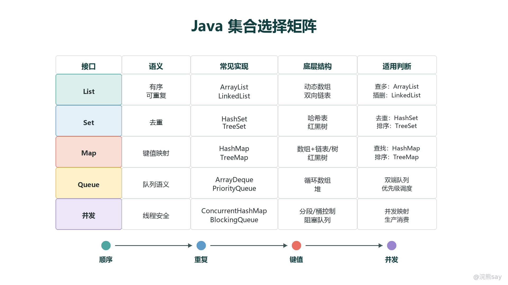
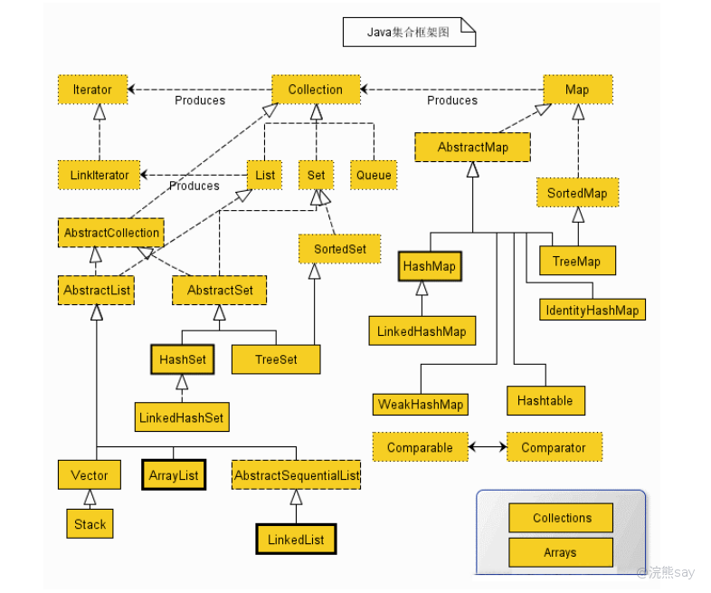
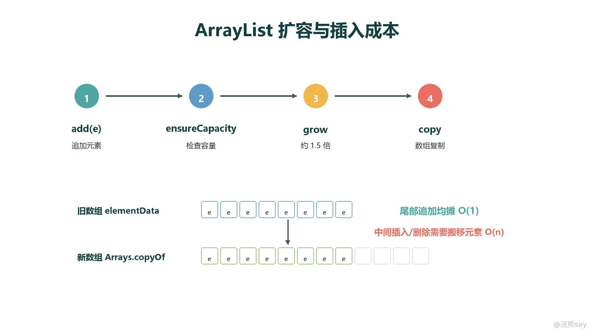
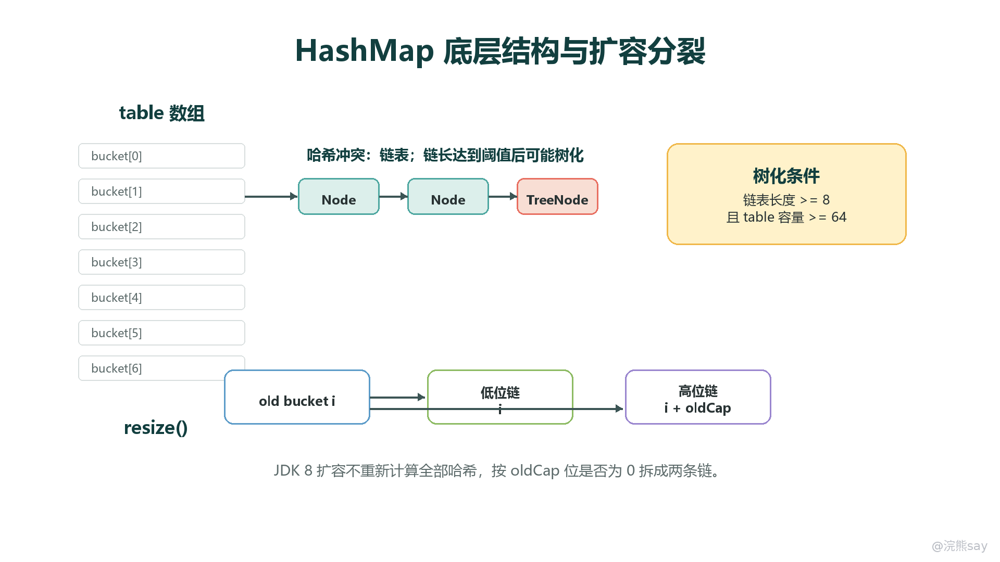
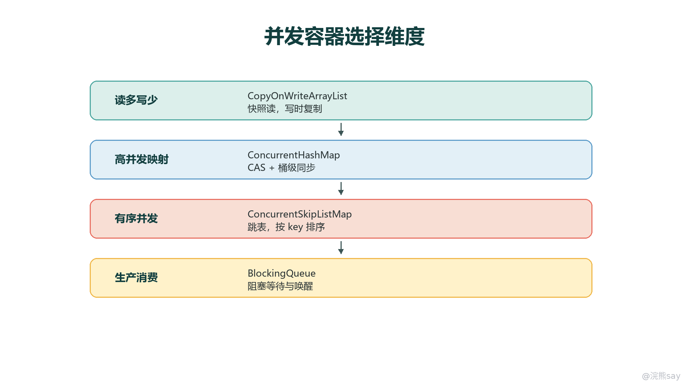

# Java容器

Java 容器不是一组孤立 API，而是一套围绕“元素组织方式、查找方式、顺序语义、并发语义”建立起来的数据结构工具箱。复习时不要只背类名，要把每个容器放回两个问题里：它承诺什么语义，以及为了这个语义付出了什么底层成本。

images/java-collections-selection-map.png

## 集合框架总览

Java 集合框架大体分为两条主线：Collection 表示单个元素的集合，下面有 List、Set、Queue、Deque 等接口；Map 表示键值映射，不属于 Collection 的子接口。Collection 更关注元素是否有序、是否重复、如何遍历；Map 更关注 key 的唯一性、查找效率、排序和并发访问。

images/VD28bBxEPoM9zyxE8Pfcw55VnNe.png

List 适合按位置保存元素，允许重复；Set 适合去重；Queue 和 Deque 适合按队列、栈或双端队列语义处理元素；Map 适合根据 key 快速定位 value。笔试题常把这些接口和具体实现混在一起考，例如问“哪些允许重复、哪些保持插入顺序、哪些按自然顺序排序、哪些允许 null”。判断时先看接口语义，再看具体实现类。

## List：顺序访问与插入成本

ArrayList 基于动态数组，核心优势是按下标随机访问很快，时间复杂度为 O(1)。它的缺点是容量不足时需要扩容并复制数组，中间位置插入或删除还需要移动后续元素。因此它适合读多、按索引访问多、尾部追加多的场景。

images/java-arraylist-growth-flow.png

ArrayList 的默认空数组会在第一次添加元素时扩为默认容量，常见实现中扩容约为旧容量的 1.5 倍。扩容本身是 O(n)，但尾部连续追加在摊还意义上仍可视为 O(1)。如果能预估元素数量，应通过构造函数或 ensureCapacity() 提前给出容量，减少多次复制成本。

LinkedList 基于双向链表，节点中保存前驱和后继引用。它在已定位节点的情况下插入、删除很快，但按下标访问需要从头或尾遍历，时间复杂度为 O(n)。实际工程中，很多“频繁插入删除就用 LinkedList”的说法并不完整：如果每次插入前都要查找位置，查找成本会抵消链表优势。

Vector 和 Stack 是早期线程安全容器，方法级同步粒度较粗，现代代码中一般不优先使用。栈结构优先使用 ArrayDeque，队列结构也常优先考虑 ArrayDeque 或并发包中的队列实现。

## Set：去重依赖 equals/hashCode 或比较器

HashSet 的去重依赖 HashMap，元素会作为内部 HashMap 的 key 保存，value 使用一个固定占位对象。因此，放入 HashSet 的对象必须保证 equals() 与 hashCode() 契约一致：两个对象如果 equals() 为 true，它们的 hashCode() 必须相同。否则去重结果会异常。

LinkedHashSet 在哈希表基础上维护双向链表，因此可以保持插入顺序。它适合既要去重，又要按照插入顺序遍历的场景。TreeSet 基于红黑树，按照自然顺序或传入的 Comparator 排序，查找、插入、删除通常是 O(log n)。如果比较器认为两个元素相等，TreeSet 会把它们视为重复元素，即使它们的 equals() 结果不同。

考试中常见陷阱是把 HashSet 的“无序”理解成“随机顺序”。更准确地说，HashSet 不承诺稳定遍历顺序，它的遍历顺序可能受哈希值、容量、扩容过程影响，不应依赖。

## Map：键值映射与 HashMap 机制

HashMap 是最常考的集合实现。它通过数组 table 保存桶，每个桶中保存链表或红黑树节点。put 时会先计算 key 的 hash，再通过 (n - 1) & hash 定位桶下标。如果多个 key 落在同一个桶中，就形成哈希冲突。JDK 8 之后，当链表足够长且数组容量足够大时，链表会树化为红黑树，以降低极端冲突下的查找成本。

images/java-hashmap-structure-map.png

HashMap 的默认负载因子通常是 0.75。元素数量超过 capacity \* loadFactor 后会触发扩容，容量一般扩为原来的 2 倍。JDK 8 的扩容会利用旧容量对应的二进制位，把原桶中的节点拆成“仍在原下标”和“移动到原下标 + oldCap”两组，减少重复计算 hash 的成本。

树化并不是只看链表长度。常见阈值是：链表长度达到 8 且 table 容量至少为 64 时树化；如果容量还小，会优先扩容而不是树化。红黑树节点数量下降到一定程度时还可能退化回链表。笔试题经常考“为什么不是一冲突就树化”，原因是红黑树节点更重，小规模冲突下链表更省内存也足够快。

LinkedHashMap 在 HashMap 基础上增加双向链表，可以保持插入顺序，也可以通过 access-order 实现最近访问顺序，常用于 LRU 缓存。TreeMap 基于红黑树，按 key 排序，适合范围查询和有序遍历。Hashtable 是早期同步 Map，不允许 null key 和 null value；HashMap 允许一个 null key 和多个 null value；ConcurrentHashMap 不允许 null key/value，因为并发场景下 null 会让“没有映射”和“映射到 null”变得难以区分。

## HashMap 为什么线程不安全

HashMap 没有为并发写入提供同步保护。多个线程同时 put、resize 或修改链表/树结构时，可能出现数据覆盖、结构不一致、遍历结果异常等问题。JDK 7 中头插法扩容在并发场景下还可能形成循环链表；JDK 8 改为尾插并引入树化机制后降低了某些风险，但 HashMap 仍然不是线程安全容器。

要在多线程环境中使用 Map，通常有三种选择：用外部锁保护 HashMap，用 Collections.synchronizedMap() 包装，或者直接使用 ConcurrentHashMap。高并发读写场景下优先使用 ConcurrentHashMap，因为它针对并发访问做了更细粒度的控制。

## 并发容器怎么选

images/java-concurrent-collection-map.png

ConcurrentHashMap 在 JDK 8 中主要通过 CAS、桶级同步和链表/红黑树结构协作实现并发控制，不再是 JDK 7 那种固定 Segment 分段锁模型。它的读操作通常不加锁，写操作只锁定必要桶位，因此比整表同步的 Hashtable 更适合高并发映射。

CopyOnWriteArrayList 适合读多写少的场景。它写入时复制底层数组，读操作可以基于快照无锁进行，因此迭代期间不会抛出并发修改异常。但如果写入频繁，复制成本和内存压力会非常高。

BlockingQueue 用于生产者消费者模型。它不仅是一个队列，还提供阻塞等待语义：队列为空时消费者可以等待，队列满时生产者可以等待。ConcurrentLinkedQueue 则是非阻塞队列，适合高并发无界队列场景，但不提供“满/空等待”这种协调语义。

## null、排序和 Fail-Fast

不同容器对 null 的支持不同。HashMap 允许一个 null key，HashSet 可以保存一个 null 元素；Hashtable 和 ConcurrentHashMap 不允许 null key/value；TreeMap 的 null key 与比较器有关，自然排序下不能比较 null，因此通常不允许。考试中看到 null 支持问题，要同时判断容器类型、排序方式和并发语义。

普通集合的迭代器大多是 Fail-Fast 的：迭代过程中如果检测到集合被结构性修改，可能抛出 ConcurrentModificationException。这不是线程安全保证，而是一种尽早暴露错误的机制。并发容器的迭代器往往是弱一致性的，可能反映部分更新，但不会像普通集合那样强依赖修改计数。

## 选择容器的考试思路

选择容器时先问四件事：是否需要按下标访问，是否需要去重，是否需要排序，是否存在并发访问。需要快速随机访问选 ArrayList；需要去重且不关心顺序选 HashSet；需要排序选 TreeSet 或 TreeMap；需要键值映射选 HashMap；需要高并发映射选 ConcurrentHashMap；需要生产者消费者协调选 BlockingQueue。真正的考点不在类名，而在底层结构如何支撑这些语义。
