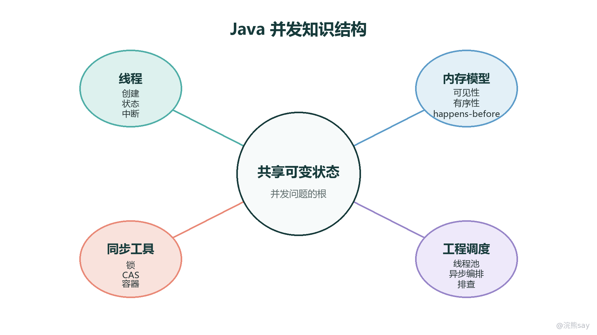
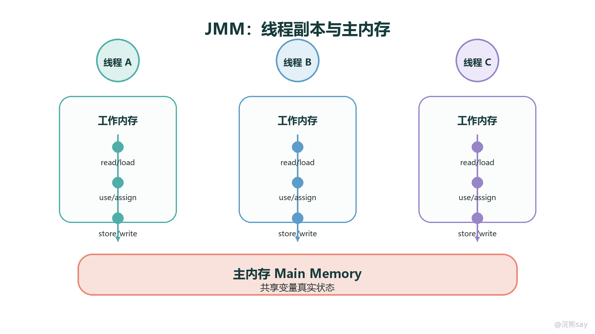
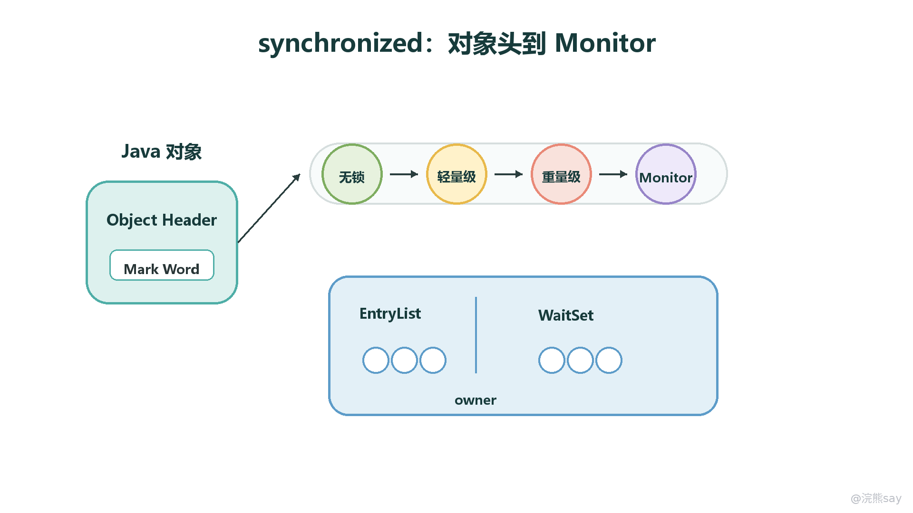
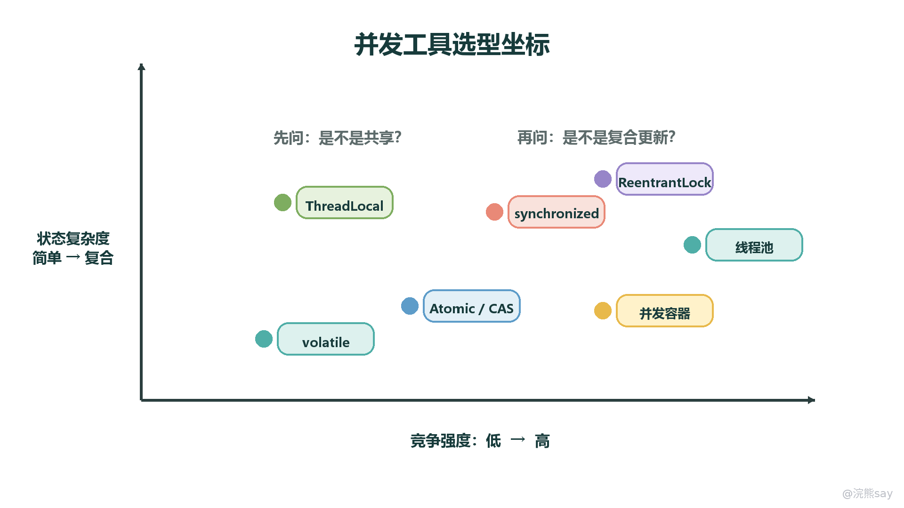
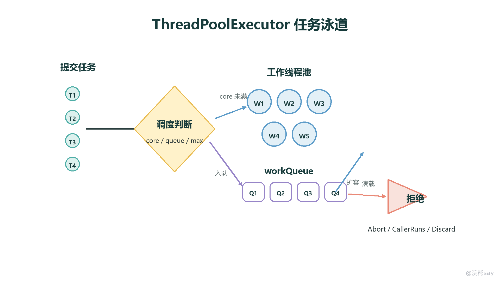

# Java并发编程

Java 并发编程是一套用来管理多线程执行、共享数据访问和异步任务调度的技术体系。它的核心问题不是“怎么多开几个线程”，而是当多个执行流同时读写同一份数据时，如何保证结果正确、执行顺序可控、系统资源不会被耗尽。

从技术角度来看，Java 并发可以分成四层：第一层是线程本身，包括线程创建、状态、中断和通信；第二层是 Java 内存模型，也就是共享变量在不同线程之间如何可见、如何有序；第三层是同步工具，包括 synchronized、ReentrantLock、CAS、原子类和并发容器；第四层是工程调度，包括线程池、异步编排、队列积压和线上排查。

images/java-concurrency-structure-radial-v2.png

学习这部分时，不建议只背“原子性、可见性、有序性”这类关键词。更好的复习方式是把每个知识点放进同一条链路：为什么并发会出错，Java 用什么机制解决，项目里如何选择工具，面试里如何讲清取舍和风险。

## 一、并发编程到底解决什么问题

并发编程的前提是程序中存在多个执行流。多个执行流本身并不一定危险，真正容易出问题的是多个线程同时访问共享可变状态。例如两个线程同时对同一个库存字段做扣减，一个线程刚读到旧值，另一个线程已经修改并写回，最终结果就可能丢失更新。

并发问题通常集中在三类：

1. **原子性问题**：一个操作看起来是一行代码，实际可能由多条指令组成。例如 count++ 至少包含读取、加一、写回三步，中间被其他线程插入就会出现错误。
2. **可见性问题**：一个线程修改了共享变量，另一个线程不一定马上看到最新值，因为线程可能先读到工作内存或 CPU 缓存中的旧副本。
3. **有序性问题**：编译器、CPU 和内存系统可能在不影响单线程结果的前提下调整指令顺序，但这种优化在多线程场景下可能暴露出意外结果。

所以，并发编程的本质是控制共享状态。能不共享就不共享，能不可变就不可变，必须共享时再选择合适的同步机制。

## 二、线程基础

### 1\. 进程和线程的区别

进程是操作系统分配资源的基本单位，一个进程有独立的地址空间、文件句柄和运行时资源。线程是 CPU 调度的基本单位，一个进程可以包含多个线程，同一进程内的线程共享堆内存和进程资源。

因此，线程之间通信比进程之间通信更轻量，但风险也更高。因为共享内存意味着多个线程可以同时读写同一个对象，稍不注意就会产生竞态条件。考试或面试中问“线程为什么比进程轻量”，不能只回答“切换开销小”，还要补一句：轻量的代价是共享状态带来的线程安全问题，需要同步机制配合。

### 2\. 创建线程的常见方式

Java 中创建并发任务常见有三种写法：继承 Thread、实现 Runnable、实现 Callable 并配合 Future 或线程池使用。真正工程里更推荐把任务提交给线程池，而不是频繁手动 new Thread()。

class MyRunnable implements Runnable { 
@Override 
public void run() { 
System.out.println("执行业务任务"); 
} 
} 
 
public class RunnableDemo { 
public static void main(String\[\] args) { 
Thread thread = new Thread(new MyRunnable()); 
thread.start(); 
} 
}

Runnable 适合不需要返回值的任务，Callable 适合需要返回结果或抛出受检异常的任务：

import java.util.concurrent.Callable; 
import java.util.concurrent.FutureTask; 
 
public class CallableDemo { 
public static void main(String\[\] args) throws Exception { 
Callable task = () -> 42; 
FutureTask futureTask = new FutureTask<>(task); 
 
new Thread(futureTask).start(); 
Integer result = futureTask.get(); 
System.out.println(result); 
} 
}

需要注意，futureTask.get() 会阻塞当前线程直到任务完成。如果是 Web 请求链路或批量异步任务，通常要结合线程池、超时控制和异常处理一起设计。

### 3\. 线程生命周期

Java 线程的状态主要包括 NEW、RUNNABLE、BLOCKED、WAITING、TIMED\_WAITING 和 TERMINATED。面试中容易混淆的是 BLOCKED 和 WAITING：前者通常是在等待进入 synchronized 监视器锁，后者通常是调用了 wait()、join()、LockSupport.park() 等方法后主动等待某个条件。

线程从 NEW 状态调用 start() 后进入可运行状态。所谓可运行，并不等于一定正在 CPU 上执行，而是具备被调度的资格。线程执行结束或抛出未捕获异常后进入终止状态，终止后的线程不能再次 start()。

### 4\. 线程中断

Java 不推荐使用 Thread.stop() 强制终止线程，因为它可能在对象状态尚未恢复一致时释放锁，带来数据损坏。更合理的方式是使用中断机制：调用 interrupt() 发出中断请求，由被中断线程在合适的位置检查并退出。

public class InterruptDemo { 
public static void main(String\[\] args) throws InterruptedException { 
Thread worker = new Thread(() -> { 
while (!Thread.currentThread().isInterrupted()) { 
// 执行任务，定期检查中断标记 
} 
System.out.println("线程收到中断信号，开始清理资源"); 
}); 
 
worker.start(); 
Thread.sleep(1000); 
worker.interrupt(); 
} 
}

如果线程正在 sleep()、wait()、join() 中阻塞，收到中断时会抛出 InterruptedException，同时清除中断标记。因此在捕获异常后，是否重新设置中断标记，要根据上层调用链是否还需要感知中断来决定。

### 5\. 线程间通信

线程通信的典型方式是 wait()、notify()、notifyAll()。这三个方法属于 Object，必须在持有对象监视器锁的同步代码块或同步方法中调用。

class Buffer { 
private boolean ready = false; 
 
public synchronized void produce() { 
ready = true; 
notifyAll(); 
} 
 
public synchronized void consume() throws InterruptedException { 
while (!ready) { 
wait(); 
} 
System.out.println("消费数据"); 
ready = false; 
} 
}

这里必须用 while 检查条件，而不是用 if。原因是线程可能被虚假唤醒，也可能多个等待线程被唤醒后只有一个线程真正满足条件。while 能保证线程醒来后再次检查业务条件，避免错误消费。

## 三、Java 内存模型

Java 内存模型（Java Memory Model，JMM）是一组规范，用来描述多线程环境下共享变量的读写规则。它关注的不是 JVM 运行时数据区怎么划分，而是一个线程写入的变量值，什么时候对另一个线程可见，以及哪些操作顺序不能被重排。

images/java-jmm-swimlane-v2.png

从抽象模型上看，所有共享变量都存放在主内存中，每个线程有自己的工作内存。线程对共享变量的操作通常表现为：从主内存读取到工作内存，在工作内存中使用或修改，再写回主内存。JMM 通过 happens-before、volatile、锁和内存屏障等规则，约束这些读写动作的可见性和顺序。

### 1\. 原子性、可见性和有序性

原子性强调一个操作不能被中断。synchronized、ReentrantLock 和原子类都可以解决不同粒度的原子性问题。

可见性强调一个线程修改共享变量后，其他线程能否看到新值。volatile、锁释放与锁获取、线程启动与终止等规则都能建立可见性关系。

有序性强调多线程观察到的操作顺序是否符合预期。编译器和 CPU 都可能进行指令重排，JMM 不禁止所有重排，而是禁止破坏 happens-before 语义的重排。

### 2\. happens-before 关系

happens-before 是 JMM 判断内存可见性的核心规则。如果 A happens-before B，那么 A 的执行结果对 B 可见，且 A 的执行顺序排在 B 之前。常见规则包括：

1. **程序顺序规则**：同一线程内，前面的操作 happens-before 后面的操作。
2. **监视器锁规则**：对一个锁的解锁 happens-before 后续对同一个锁的加锁。
3. **volatile 规则**：对一个 volatile 变量的写 happens-before 后续对该变量的读。
4. **线程启动规则**：调用 Thread.start() happens-before 新线程中的动作。
5. **线程终止规则**：线程中的所有动作 happens-before 其他线程检测到它已经终止。
6. **中断规则**：对线程的 interrupt() happens-before 被中断线程检测到中断。
7. **传递性**：如果 A happens-before B，B happens-before C，那么 A happens-before C。

面试回答时不要把 happens-before 说成“代码一定按这个物理顺序执行”。它更准确的含义是：在内存可见性和结果观察上，前一个操作对后一个操作可见。

### 3\. volatile 的内存语义

volatile 主要提供可见性和有序性，不提供复合操作的原子性。对 volatile 变量的写会把修改刷新到主内存，对 volatile 变量的读会读取最新值。它还会通过内存屏障限制特定方向的重排序。

适合使用 volatile 的场景通常是状态标记、开关变量、单写多读的配置刷新等。例如：

class ShutdownFlag { 
private volatile boolean shutdown = false; 
 
public void stop() { 
shutdown = true; 
} 
 
public void run() { 
while (!shutdown) { 
// 执行任务 
} 
} 
}

如果是 count++ 这种读取、修改、写回的复合操作，volatile 不够，需要锁或原子类。

### 4\. final 的内存语义

final 在并发中的价值主要体现在安全发布。对象构造完成后，只要没有在构造过程中让 this 逃逸，其他线程看到该对象时，能够正确看到 final 字段的初始化值。

但 final 修饰引用时，只表示引用本身不能再指向别的对象，不代表引用对象内部状态不可变。例如 final List list 不能重新赋值，但 list.add() 仍然可能修改内容。因此，要构建真正不可变对象，需要字段、内部对象和对外暴露方式一起约束。

### 5\. 指令重排序和内存屏障

指令重排序是编译器和处理器为了提高执行效率进行的优化。单线程下，只要最终结果不变，重排通常没有问题；多线程下，如果一个线程观察到另一个线程的中间状态，就可能出错。

内存屏障用于限制某些读写操作的重排。常见的屏障包括 LoadLoad、LoadStore、StoreStore 和 StoreLoad。实际面试中不需要死背每个屏障的底层细节，更重要的是能讲清：volatile 和锁会借助内存屏障建立可见性与有序性。

## 四、线程同步与线程安全

线程同步是通过某种机制协调多个线程访问共享资源；线程安全是程序在多线程并发执行下仍然保持结果正确。同步是手段，线程安全是目标。

常见的线程安全策略包括：

1. 使用不可变对象，让状态创建后不再改变。
2. 使用线程封闭，让对象只在单线程内访问，例如局部变量或 ThreadLocal。
3. 使用锁保护临界区，例如 synchronized 和 ReentrantLock。
4. 使用原子类处理简单的无锁更新。
5. 使用并发容器替代普通集合加手工同步。

### 1\. synchronized 的基本语义

synchronized 是 Java 内置锁，可以修饰实例方法、静态方法或代码块。修饰实例方法时锁对象是当前实例，修饰静态方法时锁对象是当前类的 Class 对象，修饰代码块时锁对象由开发者显式指定。

public class Counter { 
private int count = 0; 
 
public synchronized void increment() { 
count++; 
} 
 
public int getCount() { 
return count; 
} 
}

synchronized 同时提供互斥性和可见性。一个线程退出同步代码块时，会把对共享变量的修改刷新出去；另一个线程进入同一把锁保护的同步代码块时，能够看到之前释放锁线程的修改。

### 2\. synchronized 的底层实现

从字节码角度看，同步方法会在方法访问标志中带有 ACC\_SYNCHRONIZED，同步代码块会编译成 monitorenter 和 monitorexit 指令。JVM 通过对象关联的 Monitor 来实现进入、退出、阻塞和唤醒。

images/java-synchronized-monitor-state-v2.png

在 HotSpot 的传统实现中，每个 Java 对象都可以和一个 Monitor 关联。Monitor 内部会维护 owner、EntryList、WaitSet 等结构：竞争锁失败的线程进入 EntryList，调用 wait() 的线程进入 WaitSet，持有锁的线程释放锁或调用 notify() 后，等待线程才有机会重新竞争。

关于锁升级，需要注意版本背景。JDK 8 语境下常讲无锁、偏向锁、轻量级锁、重量级锁的升级路径；但 OpenJDK 在 JDK 15 中通过 JEP 374 默认禁用并废弃偏向锁，JDK 18 又进一步处理了相关 VM 选项。因此在面试中可以这样表达：偏向锁是理解 JDK 8 锁优化的经典考点，但在现代 JDK 中已经不是默认运行路径。

### 3\. ReentrantLock 和 Condition

ReentrantLock 是 java.util.concurrent.locks 包中的可重入锁。相比 synchronized，它提供了更灵活的能力，例如公平锁、可中断锁等待、超时获取锁以及多个条件队列。

import java.util.concurrent.locks.ReentrantLock; 
 
class LockCounter { 
private final ReentrantLock lock = new ReentrantLock(); 
private int count = 0; 
 
public void increment() { 
lock.lock(); 
try { 
count++; 
} finally { 
lock.unlock(); 
} 
} 
}

ReentrantLock 必须在 finally 中释放锁，否则业务异常可能导致锁永远不释放。选择它通常是因为需要 tryLock()、lockInterruptibly() 或多个 Condition，而不是因为它天然比 synchronized 更高级。

### 4\. AQS 是什么

AQS（AbstractQueuedSynchronizer）是很多 Java 同步器的基础框架，例如 ReentrantLock、Semaphore、CountDownLatch、ReentrantReadWriteLock 都与它有关。

AQS 的核心思想是：用一个 volatile int state 表示同步状态，用一个 FIFO 队列管理获取同步状态失败的线程。线程获取锁失败后进入队列等待，释放锁时再唤醒后继节点。独占锁、共享锁、公平与非公平策略，都可以在这个框架上扩展。

面试中讲 AQS 不需要背源码每个字段，但要说清三点：state 表示资源状态，CAS 修改 state 保证并发安全，等待队列负责管理阻塞线程。

### 5\. 死锁

死锁是指多个线程互相等待对方持有的资源，导致所有相关线程都无法继续执行。经典的四个必要条件是互斥、占有并等待、不可抢占、循环等待。

public class DeadlockDemo { 
private final Object lockA = new Object(); 
private final Object lockB = new Object(); 
 
public void methodA() { 
synchronized (lockA) { 
synchronized (lockB) { 
System.out.println("A"); 
} 
} 
} 
 
public void methodB() { 
synchronized (lockB) { 
synchronized (lockA) { 
System.out.println("B"); 
} 
} 
} 
}

避免死锁的常见方法是固定加锁顺序、减少锁嵌套、使用 tryLock() 超时退出、缩小临界区，并在线上通过线程 dump 观察是否存在互相等待的锁对象。

## 五、CAS、原子类与 ThreadLocal

### 1\. CAS 的基本思想

CAS（Compare-And-Swap，比较并交换）是一种乐观并发控制机制。它包含三个值：内存位置 V、预期值 A、新值 B。只有当 V 当前仍等于 A 时，才把 V 更新为 B；否则说明有其他线程修改过，需要失败重试。

CAS 的优点是避免阻塞和上下文切换，适合简单、高频、竞争不太激烈的更新。缺点也很明显：高竞争下可能长时间自旋浪费 CPU；只能处理单个变量或简单引用更新；还可能出现 ABA 问题。

### 2\. 原子类

Java 的 java.util.concurrent.atomic 包提供了多种原子类，例如 AtomicInteger、AtomicLong、AtomicBoolean、AtomicReference、AtomicStampedReference、LongAdder 等。

import java.util.concurrent.atomic.AtomicInteger; 
 
public class AtomicCounter { 
private final AtomicInteger count = new AtomicInteger(0); 
 
public int increment() { 
return count.incrementAndGet(); 
} 
}

AtomicInteger 适合简单计数。LongAdder 在高并发计数场景下通常比单点 CAS 更适合，因为它会把热点更新分散到多个 Cell 上，最后再汇总结果。AtomicStampedReference 可以通过版本号缓解 ABA 问题。

### 3\. ThreadLocal

ThreadLocal 用来为每个线程保存一份独立变量副本，适合保存用户上下文、请求链路 traceId、日期格式化对象等线程内上下文。

public class TraceContext { 
private static final ThreadLocal TRACE\_ID = new ThreadLocal<>(); 
 
public static void set(String traceId) { 
TRACE\_ID.set(traceId); 
} 
 
public static String get() { 
return TRACE\_ID.get(); 
} 
 
public static void clear() { 
TRACE\_ID.remove(); 
} 
}

使用 ThreadLocal 时要特别注意线程池场景。线程池中的线程会被复用，如果请求结束后没有 remove()，下一个任务可能读到上一个任务留下的上下文，甚至造成内存泄漏。因此它不是“线程安全万能工具”，而是一种线程隔离工具。

### 4\. 并发工具怎么选

images/java-concurrency-tool-axis-v2.png

选并发工具时，先判断共享方式和冲突强度。如果只是一个状态标志，volatile 就足够；如果是复合状态更新，优先考虑锁；如果是简单计数或引用替换，可以用原子类；如果是集合访问，优先使用并发容器；如果是线程内上下文，才考虑 ThreadLocal。

## 六、并发容器

普通集合如 ArrayList、HashMap 不是线程安全的。早期的 Vector、Hashtable 或 Collections.synchronizedMap() 通过粗粒度同步保证安全，但并发性能有限。java.util.concurrent 包中的并发容器通过细粒度锁、CAS、写时复制和阻塞队列等机制，在安全和性能之间做了更好的平衡。

### 1\. ConcurrentHashMap

ConcurrentHashMap 是最常考的并发容器。JDK 7 中它主要使用 Segment 分段锁；JDK 8 以后不再使用 Segment 作为主要并发控制结构，而是采用数组、链表、红黑树、CAS 和桶级别同步来提高并发性能。

面试中可以这样讲：读操作大多不加锁，写操作尽量缩小锁粒度；当桶为空时可以 CAS 放入节点，当桶不为空时只锁定当前桶的头节点，避免锁住整张表。

### 2\. CopyOnWriteArrayList

CopyOnWriteArrayList 采用写时复制。读操作不加锁，写操作会复制一份新数组，修改完成后再替换引用。它适合读多写少、集合规模不大、对实时一致性要求不高的场景，例如监听器列表、配置快照。

它不适合写频繁或数据量很大的场景，因为每次写入都要复制数组，内存和 CPU 成本都比较高。

### 3\. BlockingQueue

BlockingQueue 常用于生产者-消费者模型。生产者把任务放入队列，消费者从队列中取任务；当队列满或空时，线程可以阻塞等待。

常见实现包括：

1. ArrayBlockingQueue：基于数组的有界阻塞队列，容量固定。
2. LinkedBlockingQueue：基于链表的阻塞队列，可以有界也可以无界，线程池中使用时要特别注意容量。
3. PriorityBlockingQueue：支持优先级排序的无界阻塞队列。
4. SynchronousQueue：不存储元素，每次放入必须等待另一个线程取走，常用于直接交接任务。

线程池的工作队列本质上就是并发容器应用。队列容量设置不合理，会直接影响系统吞吐、延迟和内存风险。

## 七、线程池

线程池（Thread Pool）是一种复用线程、管理任务队列和限制并发资源的机制。它的价值不只是减少线程创建销毁成本，更重要的是控制系统中同时运行的任务数量，避免请求高峰把 CPU、内存和数据库连接打满。

images/java-thread-pool-swimlane-v2.png

### 1\. ThreadPoolExecutor 的执行链路

任务提交到 ThreadPoolExecutor 后，执行顺序可以概括为：

1. 当前线程数小于 corePoolSize，优先创建核心线程执行任务。
2. 核心线程已满，尝试把任务放入 workQueue。
3. 队列已满且当前线程数小于 maximumPoolSize，创建非核心线程执行任务。
4. 队列已满且线程数也达到上限，触发拒绝策略。

这条链路比参数表更重要。很多面试题问线程池参数，本质是在考你是否理解任务进入线程池后的分流过程。

### 2\. 核心参数

corePoolSize 表示核心线程数，决定线程池的基础处理能力。maximumPoolSize 表示最大线程数，只有在队列放不下任务时才会继续扩张。keepAliveTime 控制非核心线程空闲多久后回收。workQueue 决定任务等待策略。threadFactory 用来设置线程名称、优先级和异常处理。handler 是拒绝策略。

常见拒绝策略包括：

1. AbortPolicy：直接抛出异常，默认策略。
2. CallerRunsPolicy：由提交任务的线程自己执行，能够反向压制提交速度。
3. DiscardPolicy：直接丢弃新任务，不抛异常。
4. DiscardOldestPolicy：丢弃队列中最旧任务，再尝试提交新任务。

工程里不建议无脑使用 Executors 创建线程池。比如 newFixedThreadPool 默认使用无界队列，任务堆积时可能导致 OOM；newCachedThreadPool 最大线程数非常大，请求暴涨时可能创建过多线程。更稳妥的方式是显式使用 ThreadPoolExecutor，把线程数、队列容量、线程名和拒绝策略都写清楚。

import java.util.concurrent.ArrayBlockingQueue; 
import java.util.concurrent.ThreadPoolExecutor; 
import java.util.concurrent.TimeUnit; 
 
public class ThreadPoolDemo { 
private static final ThreadPoolExecutor EXECUTOR = new ThreadPoolExecutor( 
8, 
16, 
60, 
TimeUnit.SECONDS, 
new ArrayBlockingQueue<>(500), 
runnable -> new Thread(runnable, "biz-worker"), 
new ThreadPoolExecutor.CallerRunsPolicy() 
); 
}

### 3\. 线程池怎么配置

线程池没有一个固定公式。CPU 密集型任务通常接近 CPU 核数，避免线程过多导致上下文切换；IO 密集型任务可以适当增大线程数，因为线程有大量时间在等待外部资源。更可靠的方式是结合压测观察 CPU 利用率、队列长度、任务耗时、拒绝次数和下游资源瓶颈。

如果项目里讲线程池，不要只说“我用了线程池提高效率”。更好的表达是：这个线程池用于隔离某类异步任务，核心线程数和队列容量根据峰值流量与任务耗时估算，拒绝策略选择 CallerRunsPolicy 或自定义告警策略，线上通过线程池指标观察是否积压。

### 4\. 线程池关闭

shutdown() 会停止接收新任务，但等待已提交任务执行完成。shutdownNow() 会尝试中断正在执行的任务，并返回尚未执行的任务列表。生产代码中通常需要先 shutdown()，等待一段时间后仍未结束再考虑 shutdownNow()，并处理任务中断和资源释放。

### 5\. CompletableFuture

CompletableFuture 常用于异步编排，例如并行查询多个下游接口后合并结果。它比原始 Future 更灵活，支持链式回调、组合、异常处理和结果聚合。

import java.util.concurrent.CompletableFuture; 
 
public class CompletableFutureDemo { 
public static void main(String\[\] args) { 
CompletableFuture userFuture = 
CompletableFuture.supplyAsync(() -> "user"); 
CompletableFuture orderFuture = 
CompletableFuture.supplyAsync(() -> "order"); 
 
CompletableFuture result = userFuture.thenCombine( 
orderFuture, 
(user, order) -> user + ":" + order 
); 
 
System.out.println(result.join()); 
} 
}

需要注意，默认的 supplyAsync() 会使用公共的 ForkJoinPool.commonPool()。在业务系统中，为了避免不同业务互相影响，通常应该传入自定义线程池，并设置超时、异常兜底和降级逻辑。

## 八、面试追问与项目表达

Java 并发面试通常不是孤立考定义，而是沿着“问题 -> 机制 -> 工具 -> 代价”追问。常见追问包括：

1. volatile 能不能保证 i++ 线程安全？不能，因为它不保证复合操作原子性。
2. synchronized 和 ReentrantLock 怎么选？简单临界区优先 synchronized，需要可中断、超时、公平锁或多个条件队列时考虑 ReentrantLock。
3. CAS 有什么问题？高竞争自旋开销、ABA 问题、只能处理简单共享变量。
4. ConcurrentHashMap 为什么并发性能好？因为读操作尽量无锁，写操作缩小锁粒度，并结合 CAS 与桶级同步。
5. 为什么不推荐直接用 Executors？因为部分工厂方法隐藏了无界队列或过大线程上限，任务暴涨时容易放大资源风险。
6. 线程池线上怎么排查？看活跃线程数、队列长度、任务耗时、拒绝次数、异常日志和线程 dump。

项目表达可以按这个模板组织：

在项目里，我们没有直接手动创建线程，而是把某类耗时任务交给独立线程池处理。线程池的作用一方面是复用线程、减少创建销毁开销，另一方面是隔离资源，防止这类任务把主业务线程拖垮。参数上会结合任务耗时、峰值流量和下游承载能力设置核心线程数、最大线程数和队列容量；如果出现队列积压，会通过监控线程池活跃数、队列长度和拒绝次数来判断是线程不足、下游慢，还是任务本身耗时异常。

最后复习时要达到的标准是：能讲清线程为什么不安全，JMM 如何保证可见性和有序性，锁和 CAS 分别适合什么场景，并发容器解决了什么问题，线程池参数如何影响任务执行链路。只要这条线讲顺，Java 并发就不再是一堆零散名词。

## 版本说明与参考

- [JEP 374: Deprecate and Disable Biased Locking](https://openjdk.org/jeps/374)
- [JDK-8256425: Obsolete Biased Locking in JDK 18](https://bugs.openjdk.org/browse/JDK-8256425)
