# 五、Java垃圾回收器

## 一、根可达算法和引用计数

### 什么是垃圾？

#### 硬件角度来看什么叫做垃圾？

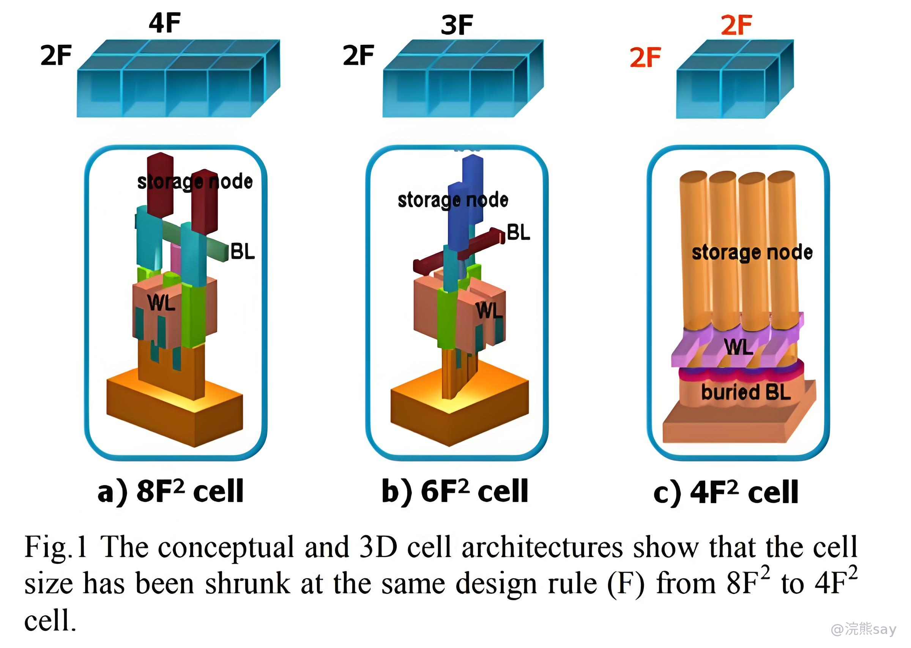

images/WBNmbArIeok3Ioxy0zVcHbDXn7b.png

计算机的内存也叫做[DRAM(Dynamic Random Access Memory, 动态随机访问内存)](https://zhuanlan.zhihu.com/p/539717599)，底层是由一个电容和一个晶体管组成，电容充电表示该bit位数据为1，电容放电表示该bit位数据为0，整个内存就是无数个这样的bit位构成的。同时，内存需要在通电状态保持按周期频率的刷新，才能够维持数据的状态。

在内存中，某些内存区域（bit位）被使用过了（用来存储对象或者数据）会被打上标记表示已经被使用过了，分配新内存空间的时候就计算机硬件就不会使用这些被标记过的内存区域。通常，这些给内存区域打上标记的活儿一般由操作系统的系统调用来完成，例如C语言中的 allocate()函数调用的系统函数。

在面向对象的语言中，如果程序员新建了一个对象，那么操作系统会为其分配相应的内存区域，且该部分的内存区域会被打上标记说明已经被使用过了，这样操作系统就不会向该区域写入新的数据。

然而，如果这个标记没有被程序员释放（C语言中调用free()来释放内存区域），那么该内存区域会一直被标记成已使用，如果整个内存都被标记成为了已使用，那么当操作系统想要再分配内存的时候就会失败，这个时候只有重启电脑来解决问题了。

所以说，对于内存区域中不再使用的对象，我们需要释放掉其对应的内存区域，方便新的对象创建时有空间为其分配。而这些程序中不再被使用的对象就被称为“垃圾”，“垃圾”往往对应着内存中一块儿需要被释放的区域。

#### Java中的垃圾

Java中”垃圾”通常指的是不再被程序使用和引用的对象，具体表现在没有被栈、JNI指针和永久代对象所引用的对象。Java作为一种面向对象的编程语言，它使用自动内存管理机制，其中垃圾收集器负责检测和回收不再被程序引用的对象，以释放它们占用的内存空间。以下是一些导致对象成为垃圾的常见情况：

- **无引用对象：** 当一个对象没有任何引用指向它时，它就变得不可达，成为垃圾，Java的垃圾收集器会识别这样的对象，并将它们回收。
- **引用循环：** 如果一组对象彼此引用形成一个循环，而这个循环与程序的其他部分没有引用相连，那么这个循环中的对象就会成为垃圾。Java的垃圾收集器通过识别引用循环并处理它们来防止内存泄漏。
- **显式置空引用：** 如果程序员显式地将一个引用置空（null），而没有其他引用指向相同的对象，那么该对象就变成了垃圾。 垃圾收集器周期性地运行，并识别和回收这些垃圾对象，释放其内存中对应的区域以确保内存能够得到有效利用，这种自动的内存管理机制就叫做垃圾回收。

### 如何寻找垃圾？

#### 引用计数（Reference Count）

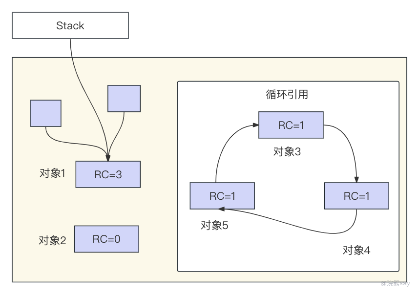

images/Q35JbVdLpotbohxClXNcnYodnZd.png

引用计数算法是一种垃圾标记，其核心思想是通过维护对象的引用计数来判断对象是否可以被回收。每个对象都有一个关联的引用计数，表示当前有多少个指针引用它。当引用计数为零时，意味着没有指针再引用该对象，因此可以安全地回收该对象的内存。

其实引用计数算法的核心思想就是，只要有对象引用我，那么就说明我是有用的，我还不需要被回收，反之，如果没有对象引用它，就说明它是没有用的对象，那么我和我的子对象都应该被回收掉。这里我们说的对象都是堆上的对象，一般是堆上的内存空间需要程序员手动回收，而栈上的内存空间则由操作系统自行回收。由于栈上的对象是操作系统自行管理和回收的，因此栈上的对象以及一些静态对象始终都是出于存活的状态，因此，堆中存活的对象至少会有一个引用（指针）指向它。

但是这样会存在着一个问题，就是对象中的引用关系形成了环状——**循环引用**，这种情况下环内所有对象的引用都是>1的，这样一来环内的所有都无法被回收从而造成“内存泄漏”。这是引用算法最主要的局限性，也是为什么JVM不采用循环计数的方法来标记垃圾的原因。

#### 根可达算法（Root Search）

由于引用计数算法无法解决“循环引用”的问题，无可避免的会造成内存泄露，因此，Java没有采用引用计数算法来寻找垃圾。而是采用了一种从GC Roots开始搜索存活对象的垃圾标记算法——根可达算法。

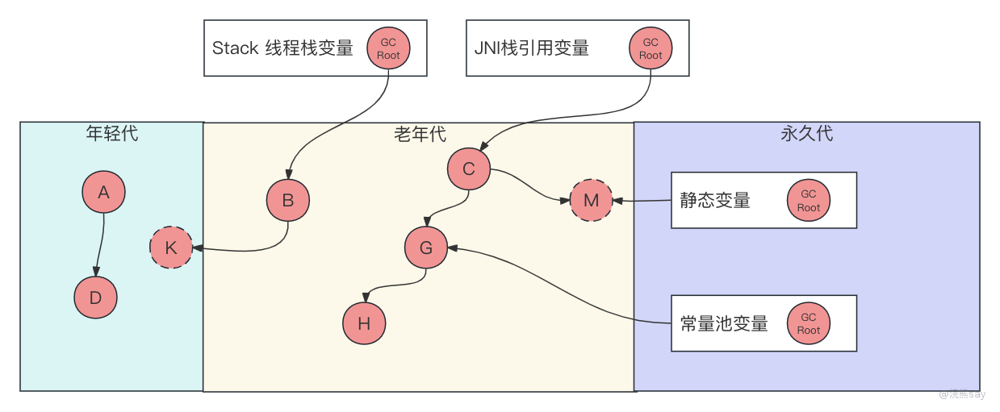

images/XSvVbRV3boUyTHxB2i1cP3EUnGe.png

##### 哪些是GC Root？

###### 线程栈 (Thread Stacks)

在Java中，当程序运行的时候线程会将一个个方法放到栈上来执行，并且对于方法局部的一些小的对象和变量也会被分配在栈空间上，而栈空间是由操作系统本身来控制什么时候进行释放和分配的。因此，基于这个逻辑我们可以认为对于当前线程来说，存在于栈空间上的变量都是存活的，而且栈空间一般比较小只有几MB的大小，里面存活的变量和对象都是有限的作为GC Roots来说搜索起来也是非常高效的。

###### 静态变量 (Static Variables)

在Java中静态变量一般是随着类加载的时候被创建和初始化的，和Java字节码一样，静态变量也会被加载到**元空间（Meta Space，Java 8之前叫做方法区（Method Area）或叫做永久代（Permanent Generation），Java 8之后叫做元空间）**。

元空间的对象是不会轻易被释放的，而静态变量会随着整个类被释放的时候才会被释放，因此静态变量可以作为GC Root来寻找垃圾。

###### 常量池 (Constant Pool)

常量池（Constant Pool）是Java中一种存放常量的数据结构，用于存储编译期生成的字面量和符号引用。常量池属于**元空间（Meta Space，Java 8之前叫做方法区（Method Area）或叫做永久代（Permanent Generation），Java 8之后叫做元空间）**，具体说是类加载后存放在元空间的一部分内存。

在Java程序的编译阶段，常量池会保存各种字面量和符号引用，包括字符串、类和接口的全限定名、字段和方法的名称和描述符等，这些信息在编译后会被存放在class文件的常量池中，在运行期间这些常量池依旧会存在并且Java根据常量池来映射参数。

所以，处于常量池中的变量也可以作为GC Roots来寻找垃圾

###### JNI 引用 (JNI References)

JNI（Java Native Interface）引用是指在Java程序中通过JNI创建的与本地代码（C++代码，调用平台相关函数）相互调用的引用。JNI引用包括本地引用（Local Reference）、全局引用（Global Reference）和弱全局引用（Weak Global Reference）。

- **本地引用（Local Reference）：** 本地引用是一种短期的引用，用于限定其生命周期。当Java方法调用本地方法时，本地引用会被创建，但在本地方法返回后，这些引用将被自动释放。本地引用不能作为GC Roots。
- **全局引用（Global Reference）：** 全局引用是一种长期有效的引用，可以在整个程序的生命周期内使用。全局引用可以防止被引用对象被垃圾回收，因此它可以作为GC Roots。
- **弱全局引用（Weak Global Reference）：** 弱全局引用也是一种全局引用，但它对被引用对象的生命周期没有强制影响。如果一个对象只被弱全局引用引用，那么它在垃圾回收时可能被回收。弱全局引用不能作为GC Roots。 JNI引用之所以能作为GC Roots，是因为它们可以在本地方法（C++方法，调用平台相关函数）中持有Java对象的引用，防止这些对象在本地方法执行期间被垃圾回收。全局引用在整个程序的生命周期内有效，因此它们有可能成为根引用，即GC Roots。

##### 根可达算法原理

知道了什么是 GC Roots那么根可达算法理解起来就相对来说会简单一些。GC Roots我们可以简单理解为和Java程序的生命周期强关联、和JVM生命周期强关联或者和当前线程强关联的一些对象。这些对象至少说在发生GC这一时刻是不应该被当成垃圾回收掉的，否则会影响程序的正常使用，因此，我们标记存活对象的时候从GC Roots开始，认为被GC Roots 引用或者间接引用的对象就是存活对象。因此，根可达算法的基本原理和流程如下：

1. **初始根集合（Initial Roots）：** 根可达算法从程序的初始根集合开始，这些根是一组特殊的引用，如线程栈中的引用、静态变量、JNI（Java Native Interface）引用等。
2. **标记阶段（Mark Phase）：** 算法通过追踪根引用，递归遍历对象图，标记所有可以从根引用访问到的对象。在这个过程中，被标记的对象被认为是可达的，而未被标记的对象被认为是不可达的。
3. **标记-清除阶段（Mark-Sweep Phase）：** 在标记完成后，算法执行清除操作，即移除未被标记的对象。这些未被标记的对象被认为是不可达的，可以被垃圾回收器回收。这个阶段的目标是回收不再被程序使用的内存空间。
4. **压缩（Compaction）或整理（Compaction）：** 在某些情况下，为了优化内存布局，可能会执行进一步的操作，如将存活对象整理到一起，以减少内存碎片。这个步骤通常与标记-清除阶段结合使用。
5. **可选的再标记阶段（Optional Re-Mark Phase）：** 有些算法可能会在标记-清除后执行可选的再标记阶段，以处理在清除阶段可能发生的并发引用更新。这一步确保在垃圾回收过程中引用关系的一致性。
6. **结束（Finish）：** 垃圾回收算法完成后，内存中只留下了可达对象，而不可达的对象已被清理。程序可以继续执行。 实际上来说，如CMS和G1之类比较流行的垃圾回收器都是采用的[“三色标记”](https://mp.weixin.qq.com/s?__biz=MzkzMjI0MDY3Mw==&mid=2247484154&idx=1&sn=69ce4608eea3c24acf4d5d675129c240&chksm=c25f8eb4f52807a2d1470ebc831657fa9a31ef88f635687f5b39fbe6cf5302df00445b7acdc6#rd)算法，而非直接采用的根可达算法来对垃圾进行标记的，这里给出的流程大家参考一下就可以了。

## 二、常见GC算法

在谈垃圾回收算法之前，我们不妨先想想平时打扫屋子的经验。屋子里面既有像纸团、香蕉皮之类的垃圾对象，也有像杯子、花瓶和散落在地上的玩具这些不是垃圾的对象。那么，我们打扫屋子的时候可以采取什么样子的策略呢？

标记-清除策略：锁定纸团、香蕉皮这种垃圾对象，把垃圾扫到垃圾桶就完事儿了，其它像散落在地上的玩具、杯子等不适垃圾的对象也不去整理收纳。这样做的好处是扫起来非常快，但是下次买个新东西回家的时候还是没地方放，一般你这样打扫房间妈妈是会骂你的。

标记-整理策略：锁定垃圾，清扫垃圾，然后把玩具、杯子或者其它有用的东西收纳整理好。这样以来，虽然耗费的时间更多，但是获得的空间是更大的，新买东西回家之后也有更多的空间来放新东西，妈妈喜欢这种打扫方式。

复制策略：把房间分为几个区域，在打扫的时候顺便把有用的对象就顺手丢到固定的区域里面去，然后再把剩下的区域全部清理掉。这样和标记-整理一样不会产生垃圾散落在地上的情况，但是打扫的时候要先确保屋子里面有空间是干净的，这样对空间的利用率不高。

分代策略：不仅仅要清扫垃圾，还要标记长时间不使用的对象，例如：锤子、电钻这些不是经常使用的工具，咱们把它们移动到仓库里面去长期收纳起来。这时候，房间就好比年轻代，收纳经常使用的对象，仓库就好比老年代，收纳不那么常常使用但是又很重要的对象。

其实，把垃圾收集和平时打扫房间相类比起来会发现还是有很多相似之处的，这样也更方便我们去理解常见的gc算法。

### 标记-清除(Mark-Sweep)算法

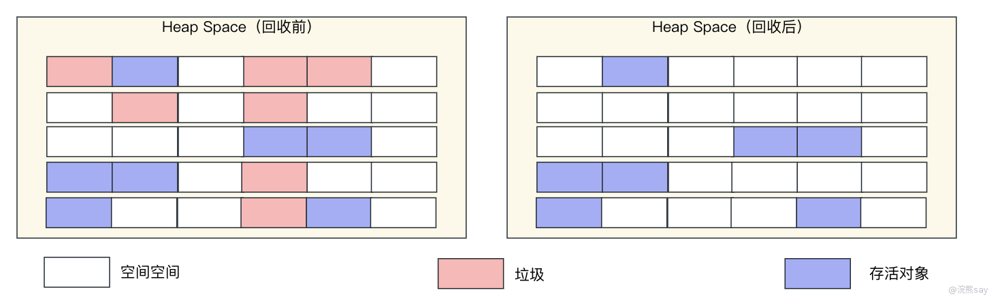

images/MRblbaKB0oxofSxjydccdTcEnFn.png

标记-清除（Mark-Sweep）算法是早期垃圾收集领域的经典算法之一，其操作过程分为两个主要步骤，即标记阶段和清除阶段：

**标记阶段：** 在这一阶段，算法会遍历所有存活对象，并标记它们。通过从根对象出发，沿着对象引用链逐步遍历的方式来完成的，所有可达的对象都会被标记，而未被标记的对象则被认定为垃圾。

**清除阶段：** 在标记完成后，清除阶段将会执行。这个阶段的任务是清理所有被标记为垃圾的对象。这些对象将被释放，以便为新的对象提供空间。清除后，内存中将只保留标记为存活的对象。关于标记-清除算法的优点和缺点如下表：

### 复制(Copying)算法

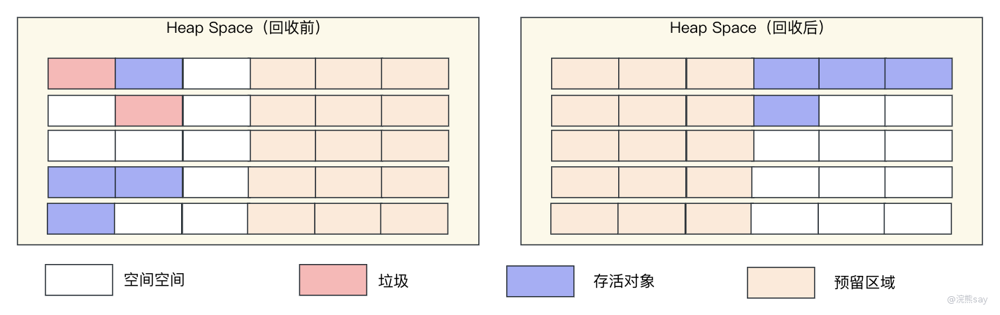

images/F2j5bX1U6oLwBQxJDlGcMJnbnye.png

为了克服标记-清除算法在面对大量可回收对象时执行效率较低的问题，复制（Copying）算法应运而生。复制算法的核心思想是将整个内存空间划分为两个相等的区域，当一块区域的内存使用完毕后，将其中存活的对象复制到另一块尚未使用的区域，然后清理已使用过的内存空间。复制算法的优点和缺点如下表：

### 标记-整理(Mark-Compact)算法

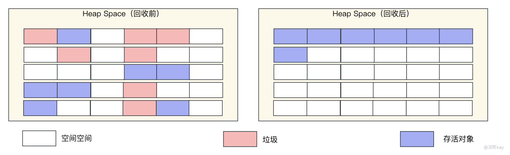

images/NOXwbDRBuohPvrxhDX9cs45XnEf.png

标记-整理算法在垃圾回收的过程中首先标记出所有需要回收的对象。不同于标记-清除算法，标记整理算法的后续步骤并非直接清理可回收对象，而是通过将所有存活的对象移动到一端，然后直接清理掉端边界以外的内存。标记-整理算法的优点和缺点如下表：

标记整理算法的优点在于解决了内存空间碎片问题，避免了多余空间的浪费。然而，由于需要移动对象，它可能引起一些性能上的开销和引用对象更新的问题。这些是在选择垃圾回收算法时需要考虑的权衡。

### Appel 式回收

在1989年，Andrew Appel为了更优化处理具有“朝生夕灭”特点的对象，提出了一种半区复制分代策略，如今被称为“Appel式回收”。该策略的具体实施是将内存分为一块较大的Eden空间和两块较小的Survivor空间，通常可称为From区和To区，或者Survivor 0区和Survivor 1区。

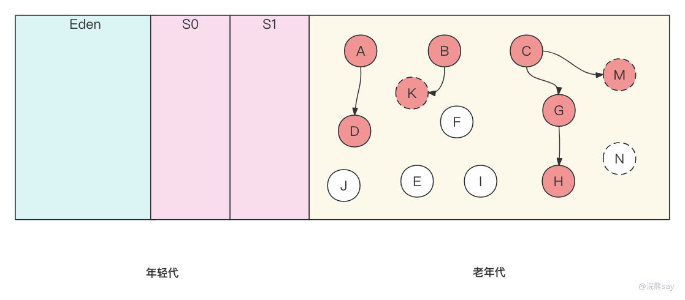

images/XAwabTRedohoQ2xndT1cPLkangc.png

研究显示，新生代中的对象有98%具有“朝生夕死”的特性，因此并不需要按照1:1的比例划分内存空间。相反，采用一块较大的Eden空间和两块较小的Survivor空间，每次使用Eden和其中一块Survivor空间。在进行回收时，将Eden和Survivor中仍存活的对象一次性地复制到另一块Survivor空间上，最后清理掉Eden和已使用的Survivor空间。换句话说，仅有一个Survivor空间会被浪费。

HotSpot虚拟机新生代中，Eden和Survivor空间的比例为8:1:1。在使用过程中，仅使用Eden区和一个Survivor区，即新生代有90%的空间处于活跃状态，只有10%的空间是浪费的。虽然在“普通场景”下，新生代中的98%对象可被回收，但由于无法百分百保证每次回收都仅有不多于10%的对象存活，因此在Survivor空间不足时，需要依赖其他内存进行分配担保，通常是老年代。简而言之，如果Survivor空间不足，对象将以分配担保的形式进入老年代。

### 主流GC收集器采用的算法

上述表格展示了一些主流垃圾回收器所采用的GC算法。值得注意的是，一些回收器可能会组合使用不同的算法，或者在特定阶段采用特定的算法，以优化性能和内存利用。这种选择通常取决于应用程序的特性和性能需求。

## 三、分代模型与垃圾回收

### 谈谈对象与堆的关系

#### 为什么Java对象要分配在堆上？

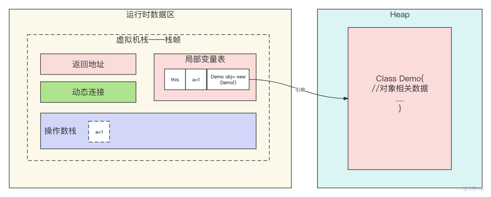

images/PPxFbCnXIo5Nuzx1saJc5kWmnCg.png

我们都知道，对象的实际分配是在堆上进行的，即JVM会在堆上开辟一段内存空间以0和1的方式记录下这个对象中的所有成员变量、方法之类的信息。而JVM的执行引擎会操作虚拟机栈从里面的“局部变量表”和“操作数栈”中拿到数据和指令让CPU去执行相关指令。在这个过程中，存储在局部变量表中的对象，实际上是堆中对象的一个引用或者说指针，当需要使用对象中的某个方法或者属性的时候，需要去堆中访问对象的实际物理内存地址。

那么，为什么要将对象实际数据放在堆中，然后通过引用的方式再去获取实际的对象方法和数据呢？

其实这是设计到堆和[虚拟机栈](https://mp.weixin.qq.com/s?__biz=MzkzMjI0MDY3Mw==&mid=2247484233&idx=1&sn=2a2f9b4370d4d0557d3bb17a4e838a50&chksm=c25f8f07f5280611a99843bb111b36cbf723856a9e502cc32927852793a5c0611ef127131acc#rd)的空间大小的问题，Java线程运行的时候每个线程都会有一个独立的栈，而这些栈又会有多个栈帧进行压栈和出栈操作来进行方法的执行和跳转。一般Java栈的大小是有限的，默认大概1MB左右，而一个栈帧的大小更加有限，大概在几百字节～几kb左右。

那么为什么要将栈和栈帧的大小设置得这么小呢？其实主要有以下几个原因：

1. **线程数量和内存消耗：** 一个应用程序中可能有多个线程，每个线程都需要独立的虚拟机栈。如果每个线程的栈都设置得很大，将会占用大量内存。限制每个线程的栈大小可以在有限的物理内存环境中更好地管理资源。
2. **栈帧的生命周期：** 栈帧是方法调用的基本单位，它包含了局部变量表、操作数栈、动态链接、方法返回地址等信息。由于方法调用的生命周期通常很短，栈帧在方法执行完毕后就会被销毁。相对较小的栈帧可以更灵活地分配和回收内存。
3. **递归调用的深度：** 虚拟机栈的大小会限制递归调用的深度。较小的栈大小有助于防止无限递归导致栈溢出。递归调用深度的限制有助于防止程序因递归错误而无法正常执行。
4. **平台兼容性：** 不同的操作系统和硬件平台可能对栈大小有一些限制。较小的默认栈大小可以提高应用程序的可移植性和兼容性。 虚拟机栈的大小通常可以通过命令行参数进行调整，例如使用 -Xss256k 表示将栈大小设置为 256KB。因此，对于这么小的栈和栈帧空间，Java的对象一般是无法直接分配在栈上的，只能分配在堆上，然后通过引用的方式间接的去拿到对象的成员变量，方法等。

#### 大多数对象的存活周期极短

在 Java 中，大多数对象的存活周期短暂，它们在分配后很快就会被垃圾回收器回收。这种情况通常出现在方法的局部变量或临时对象上，以下是一个简单的 Java 代码示例，演示了大多数对象存活周期短暂的情况：

public class ShortLivedObjectsExample { 
public static void main(String\[\] args) { 
for (int i = 0; i H的引用被断开，但是又新建立了一个F->H的引用。

那么此时，由于F已经被标记成为了黑色，那么F的子对象H就不会被扫描和标记到，因此就产生了“漏标”。这样就会导致H对象一直是白色，最后被当作垃圾被清除，这样直接会影响到程序运行的正确性，因此是绝对要被避免的。

实际上，漏标记只有同时满足以下两个条件才能发生：

1. 一个或者多个黑色对象重新引用了白色对象，即黑色对象成员变量增加了新的引用；
2. 灰色对象断开了白色对象的引用（直接或者间接），即灰色对象原来的成员变量引用发生了变化； 漏标的过程对应的Java代码如下所示：

// 此时应用线程执行了以下操作 
ObjectH H = objG.fieldH; // H 被引用 
objG.fieldH = null; // 断开引用，G为灰色，H为白色 
objF.fieldH = H; // F 引用 H，G变为黑色，但是H依旧为白色

在上面的三个步骤当中，我们只需要在任意一步的时候讲被漏标的对象H存储起来，然后作为一个灰色对象放入到一个集合当中。等到并发标记结束重新标记的时候，遍历这个集合再次标记剩余对象就可以解决漏标的问题。

但是，这样一来“重新标记”就需要STW，因为只要有用户线程在执行就有可能会出现新的漏标记的情况发生，导致永远无法完成GC的标记过程。不过好在前面的“并发标记”过程已经将大部分的垃圾标记出来了，所以“重新标记”过程所耗费的时间较低。

所以说三色标记算法也无法完全解决STW问题，只能尽可能缩短STW的时间，从而减少系统的停顿。

### 如何解决漏标问题？

对于多标问题来说，由于像CMS这类垃圾回收算法本身就会产生浮动垃圾，所以不算特别严重的问题，只需要等到下一次GC再回收即可。

但是漏标问题就相对严重得多，它会错误的回收正常的对象，导致程序错误，因此必须避免漏标的情况发生，下面主要介绍漏标的解决方案。

#### 内存屏障方案

首先回顾下漏标的过程对应的Java代码如下所示：

// 此时应用线程执行了以下操作 
ObjectH H = objG.fieldH; // H 被引用 （读操作） 
objG.fieldH = null; // 断开引用，G为灰色，H为白色 （写操作） 
objF.fieldH = H; // F 引用 H，G变为黑色，但是H依旧为白色 （写操作）

针对漏标问题，JVM 团队采用了读屏障与写屏障的方案。读屏障拦截了第一步，而写屏障用于拦截第二和第三步。它们的目的是在读写操作前后记录漏标对象H。下面是读屏障和写屏障的相关实现：

##### 读屏障——读取之前记录漏标对象H

oop oop\_field\_load(oop\* field) { 
pre\_load\_barrier(field); // 读屏障-读取前操作 
return \*field; 
} 
void pre\_load\_barrier(oop\* field, oop old\_value) { 
 
if ($gc\_phase == GC\_CONCURRENT\_MARK && !isMarked(field)) { 
oop old\_value = \*field; 
remark\_set.add(old\_value); // 记录读取到的对象 
} 
}

这里的读屏障直接针对第一步 ObjectH H = objG.fieldH;，在读取成员变量之前先记录下来。这种做法是保守但安全的，因为重新引用的前提是获取到该白色对象，此时读屏障发挥了作用。

但是读屏障并不是所有对象的读写操作都会执行，只有在“并发标记”阶段（$gc\_phase == GC\_CONCURRENT\_MARK）并且对象未被标记（白色对象，!isMarked(field)）的情况下才执行。这保证了读屏障的触发是有条件的，并不会对所有对象的读操作都进行记录。

##### 写屏障——写入之前记录漏标对象H

void oop\_field\_store(oop\* field, oop new\_value) { 
\*field = new\_value; // 赋值操作 
}

写屏障是在给某个对象的成员变量赋值操作前后进行处理，类似于 Spring AOP 的概念：

void oop\_field\_store(oop\* field, oop new\_value) { 
 
pre\_write\_barrier(field); // 写屏障-写前操作 
\*field = new\_value; 
post\_write\_barrier(field, value); // 写屏障-写后操作 
}

这样的设计在写操作前后加入了相应处理，保证了在写操作时对相关对象的状态进行记录和处理。

写屏障同样是在并发标记阶段执行的。在写操作前后加入了处理，包括写前操作 pre\_write\_barrier 和写后操作 post\_write\_barrier。写屏障的触发同样是有条件的，不是所有对象的写操作都会记录。

#### **增量更新（Incremental Update）与原始快照（Snapshot At The Beginning，SATB）方案**

##### 增量更新（Incremental Update）

在对象D的成员变量引用发生变化时（例如 objF.fieldH = H;），通过写屏障，将F新的成员变量引用对象H记录下来：

void post\_write\_barrier(oop\* field, oop new\_value) { 
 
if ($gc\_phase == GC\_CONCURRENT\_MARK && !isMarked(field)) { 
remark\_set.add(new\_value); // 记录新引用的对象 
} 
}

这种做法的思路是不要求保留原始快照，而是针对新增的引用将其记录下来等待遍历，即增量更新。增量更新破坏了漏标的条件一：“一个或多个黑色对象重新引用了白色对象”，从而保证了不会漏标。

##### 原始快照（Snapshot At The Beginning，SATB）

当对象E的成员变量引用发生变化时（例如 objG.fieldH = null;），通过写屏障，将E原来成员变量的引用对象G记录下来：

void pre\_write\_barrier(oop\* field) { 
oop old\_value = \*field; // 获取旧值 
remark\_set.add(old\_value); // 记录原来的引用对象 
}

在原来成员变量引用发生变化之前，记录下原来的引用对象。这种做法的思路是尝试保留开始时的对象图，即原始快照（Snapshot At The Beginning，SATB）。当某个时刻的GC Roots确定后，当时的对象图就已经确定了。如果期间发生变化，则可以记录起来，保证标记依然按照原本的视图来。SATB破坏了漏标的条件二：“灰色对象断开了白色对象的引用（直接或间接的引用）”，从而保证了不会漏标。

#### 主流垃圾回收器的漏标处理方案

基于可达性分析的GC算法，尤其是在并发标记的情境下，各种垃圾收集器采用了不同的漏标处理方案。在Java HotSpot VM中，具体的处理方式如下：

- **CMS（Concurrent Mark-Sweep）——写屏障 + 增量更新：** 在并发标记阶段，CMS采用写屏障机制，通过在对象引用发生变化时进行增量更新，将新的引用记录下来。这有助于防止漏标。增量更新相较于其他方案可能会引入更多的浮动垃圾，但在重新标记阶段无需深度扫描已被删除引用的对象。
- **G1（Garbage-First）——写屏障 + 原始快照：** G1在并发标记时采用写屏障，并选择了原始快照的方式。这意味着在对象引用发生变化时，将原始引用记录下来。相较于增量更新，原始快照在重新标记阶段可能会更高效，因为不需要深度扫描已被删除引用的对象。这对于G1来说是一个合适的选择，因为它的对象分布在不同的区域，而不像CMS一样集中在一个老年代区域。
- **Shenandoah——写屏障 + 原始快照：** 类似于G1，Shenandoah在并发标记时采用写屏障，并选择了原始快照的方式。这种设计可以提高效率，因为在重新标记阶段不需要深度扫描已被删除引用的对象。
- **ZGC（Z Garbage Collector）——读屏障 + 染色指针：** ZGC采用了染色指针技术，通过读屏障来处理并发标记。这种设计可以显著减少内存屏障的使用数量，特别是写屏障。染色指针直接在指针中维护引用变动的信息，避免了一些记录操作，对性能有显著的帮助。 这些选择基于不同垃圾收集器的特点和设计目标，以在并发标记过程中尽可能降低对应用程序的影响，并提高垃圾回收的效率。

## 五、Serial和Serial Old收集器

### Serial收集器

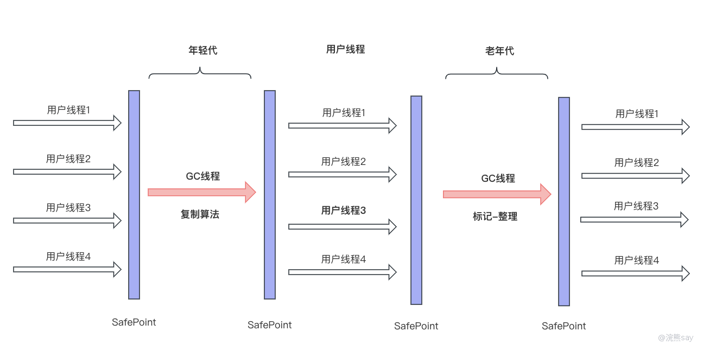

images/HeozbBiDMoAKE6x54Fwci62pnIb.png

#### 垃圾回收与仓库清理——“Stop The World”

在前面的文章中，说过Java中对堆内存的管理就像是对一个大型的仓库进行管理一样。我们想要清扫这个大仓库中无用的设备的话，那么必须确保能正确识别哪些设备还有用哪些设备已经无用了，并且这个过程中不允许新的设备入库和出库。等到标记完成之后，再进行设备清理才会保证不会出现把本来还有用的设备当成垃圾处理掉。可以试想一下，如果在清理仓库的过程中不禁止出库和入库，那么整个仓库的管理就会陷入混乱，随时可能会产生新的无用设备（浮动垃圾），并且还可能会出现错误的清理有用的设备（漏标）。

所以回到垃圾回收上，几乎所有的垃圾回收器都需要在垃圾回收阶段暂停用户线程，来确保垃圾被正确的标记和清理，这一停顿的过程被称为“Stop The World”（停顿整个世界）。这种停顿在确保堆内存被完整清理的同时也给用户带来了恶劣的体验，在停顿期间，应用程序无法响应用户的请求，导致了性能和用户体验的下降。

那么为什么非得STW暂停用户线程呢？上面用仓库举例只能说明如果在清理仓库的时候不禁止出库入库会造成一些混乱，实际上这些混乱主要有2个方面的问题——漏标和多标（当然，像Serial和PS这种完全STW的算法从根本上就避免了这两个问题）。一般的垃圾回收算法在垃圾标记阶段都是采用的”[三色标记算法](https://mp.weixin.qq.com/s?__biz=MzkzMjI0MDY3Mw==&mid=2247484154&idx=1&sn=69ce4608eea3c24acf4d5d675129c240&chksm=c25f8eb4f52807a2d1470ebc831657fa9a31ef88f635687f5b39fbe6cf5302df00445b7acdc6#rd)“，这种算法如果在标记过程中不暂停用户线程的话就可能会出现“漏标”和“多标”的问题，他们会分别导致“存活对象被回收”和“浮动垃圾”。尤其是”漏标“导致的存活对象被回收之后，就会导致严重的系统异常，进而导致程序崩溃。

所以，无论什么垃圾回收算法，都需要一定时间的STW来正确的标记对象。现在主流的垃圾收集器一样需要停顿，如CMS、G1和ZGC等垃圾回收器也并没有完全避免STW，只是都做到了毫秒级的停顿，可以说STW是垃圾回收中一个不可避免的问题。

#### Serial垃圾回收器（年轻代）

Serial垃圾收集器，顾名思义是一种单线程的“串行的”垃圾回收器，是历史最悠久的垃圾回收器，大概在JDK 1.3之前Serial垃圾收集器是HotSpot虚拟机新生代垃圾回收的唯一选择。时至今日，虽然各种垃圾回收器层出不穷，也非常先进，但是我们仍然可以指定Serial作为垃圾回收器的选项，只是一般不建议这样做而已。

Serial收集器是单线程的，当Serial垃圾回收器运行的时候其它工作线程必须停止直到Serial垃圾回收器结束工作（“Stop The World”）。用户线程的状态会被保存在一个SafePoint的状态中，此时，GC线程以单线程的形式对垃圾进行标记（根可达算法）和回收（复制算法）。

使用Serial垃圾回收器的命令行参数是-XX:+UseSerialGC。这个参数告诉Java虚拟机在运行时使用Serial垃圾回收器。如果你想在Java应用程序中显式地设置Serial垃圾回收器，可以通过以下方式运行你的Java程序：

java -XX:+UseSerialGC -jar YourApplication.jar

Serial垃圾回收器采用单线程最明显的缺点就是需要“Stop The World”，暂停工作线程的工作，对应的服务处理也会暂停，影响程序的的性能，所以使用Serial的单线程的垃圾回收模式尝尝造成很长的停顿时间，一般不适用于对性能要求高的后端服务。

但是单线程模式也有优点，那就是可以减少上下文切换，减少系统资源的开销，对于区域比较小的新生代来说造成的停顿时间较短。因此，Serial垃圾回收器通常适用于较小规模的应用或者特定场景，对于大型服务器端应用，通常会考虑使用更高级的垃圾回收器。

#### **Serial Old收集器（老年代）**

Serial Old收集器是 Serial 收集器的老年代版本，其基本的实现原理和Serial垃圾回收器一样，都是使用单线程串行的方式进行垃圾收集。但是由于是回收清理的老年代的内存区域，区域较大，因此回收算法采用的是“**标记-整理**”算法，这样能够有效的避免老年代区域的内存碎片，提升内存空间利用率。

由于采用单线程的模式，Serial Old同样需要“Stop-The-World”，从而造成长时间的用户线程停顿。照理说这样效率低下的单线程的垃圾回收器到现如今应该已经被淘汰的差不多了，尤其是对于现如今动辄几十个G的堆内存空间而言。但是，有趣的是Serial Old垃圾回收器还是广泛的被用在现如今的JVM当中，但是一般不是作为主力的老年代垃圾回收器来使用，而是作为CMS、G1等垃圾回收器的降级策略来使用。

对于CMS和G1等并发的垃圾回收器，由于垃圾清理阶段是并发执行的，始终会存在“浮动垃圾”无法被清理，这样以来在某些情况下可能会造成内存分配失败的情况。作为一种降级策略，Serial Old会停止所有的用户线程，并对全堆的内存空间进行垃圾回收。在如下表所示的2种情况下会使用Serial Old垃圾回收器来作为降级策略：

可以这样说，Serial Old垃圾回收器是回收得最干净的垃圾回收器，回收过程中也不会产生浮动垃圾，所以G1和CMS垃圾回收器在才会选用Serial Old来作为降级策略。但是由于其单线程和长时间停顿用户线程的特点，对于当今动辄几十个G的内存空间来说，其回收时间是灾难性的。因此，在现代的垃圾回收器中，要尽量避免类似于CMS、G1等垃圾回收器降级成为Serial Old垃圾回收器。

在 Java 虚拟机启动时，可以通过设置不同的垃圾收集器参数来选择使用 Serial 或 Serial Old 垃圾收集器。以下是使用这两者的组合，即在整个堆上使用串行垃圾回收的 Java 虚拟机启动命令的示例：

java -XX:+UseSerialGC -XX:+UseSerialOldGC -jar YourApplication.jar

这样的配置会使得新生代和老年代都使用串行垃圾收集器。这种配置通常用于小型应用或测试环境，因为串行垃圾收集器在大型、高并发应用中可能导致较长的停顿时间。

#### JVM相关参数——Serial Old垃圾回收器

以上这些参数可以通过在Java虚拟机启动命令中使用-XX:的形式进行设置，来调整Serial垃圾回收器的性能，但是，在生产环境最好不要使用Serial 垃圾回收器。

## 六、Serial的年轻代分身——ParNew收集器

### 什么是ParNew垃圾回收器？

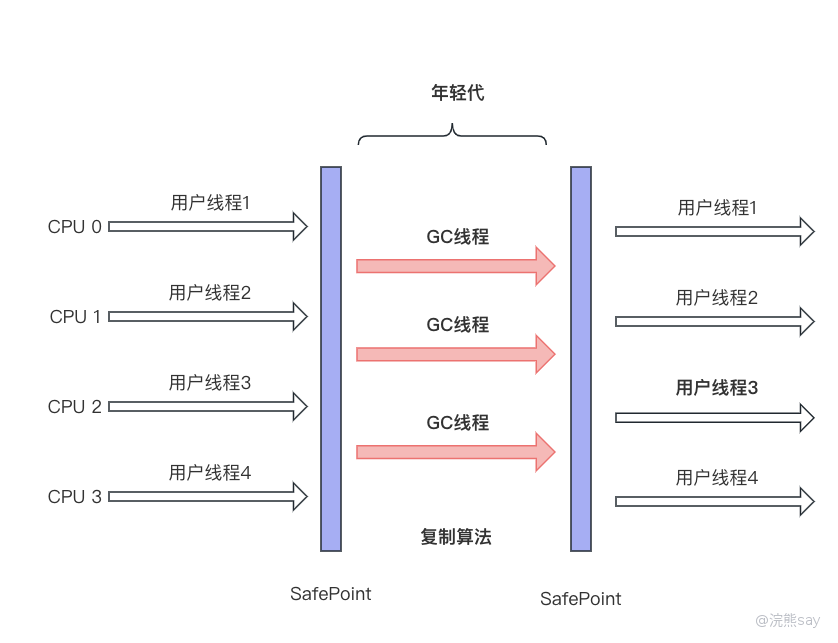

images/ZoFtbqBFBonpmjxveFQcBnrmn8c.png

在Java中，ParNew是一种用于新生代的并行垃圾回收器，它通常与[CMS（Concurrent Mark-Sweep）垃圾回收器](https://mp.weixin.qq.com/s?__biz=MzkzMjI0MDY3Mw==&mid=2247484147&idx=1&sn=a433ef5be8692caf81c90248cd46b4d9&chksm=c25f8ebdf52807ab52907b8016cf3bd57cfe55f07ba244c9e495b7a3f70111410e0f7a9a7ec3#rd)一起使用，用于处理新生代的垃圾回收。

实际上，ParNew就是[Serial收集器](https://mp.weixin.qq.com/s?__biz=MzkzMjI0MDY3Mw==&mid=2247484276&idx=1&sn=ff86c7f84438b896acb7200ef0be807f&chksm=c25f8f3af528062c2df3b8d9cd0fc6c08fb5e691ba308c25ff0485d3bdb588730f81a0071ed7#rd)的多线程版本，除了使用的是多线程之外，控制参数、[复制算法](https://mp.weixin.qq.com/s?__biz=MzkzMjI0MDY3Mw==&mid=2247484249&idx=1&sn=785a9edbf9013b7f5e8126e7d4ae5059&chksm=c25f8f17f5280601f0e0d326f661d8cacb6664ef1c970a9533cff824a9cb12df70910fa3ea81#rd)、Stop The World、对象分配规则和回收策略等等都和Serial收集器一致，两者共用了很多代码。

其运行的原理和[Serial垃圾回收器](https://mp.weixin.qq.com/s?__biz=MzkzMjI0MDY3Mw==&mid=2247484276&idx=1&sn=ff86c7f84438b896acb7200ef0be807f&chksm=c25f8f3af528062c2df3b8d9cd0fc6c08fb5e691ba308c25ff0485d3bdb588730f81a0071ed7#rd)一样，先暂停所有的工作线程并将工作线程的状态全部保存到SafePoint当中，再以多线程的方式对垃圾进行标记和清理操作，完成之后工作线程再从SafePoint恢复工作状态。

在多CPU的情况下，由于多线程的原因性能一般会比Serial收集器性能更好，但是在单CPU的情况下，由于线程间的频繁切换，因此性能一般会更差。

默认情况下，ParNew的垃圾回收线程数目和CPU的核心数目相同，这个线程数目一般不需要手动调节。

### 启动和JVM参数设置

启动Java应用程序时，你可以通过在命令行中使用java命令来设置JVM参数。以下是一个包含ParNew垃圾回收器相关参数的简单启动命令的示例：

java -XX:+UseParNewGC -XX:MaxGCPauseMillis=200 -XX:GCTimeRatio=4 -XX:NewRatio=2 -XX:SurvivorRatio=8 -XX:MaxTenuringThreshold=15 -XX:TargetSurvivorRatio=50 -jar YourApplication.jar

在这个例子中，YourApplication.jar是你的Java应用程序的JAR文件。以下是一些启动ParNew垃圾回收器以及相关参数设置的示例：

这只是一些可能的参数设置示例，实际应用中根据具体情况可能需要进行调整。你可以根据应用的性能需求和硬件配置来选择适当的参数值。

## 七、吞吐量优先的垃圾收集器——Parallel Scavenge和Parallel Old收集器

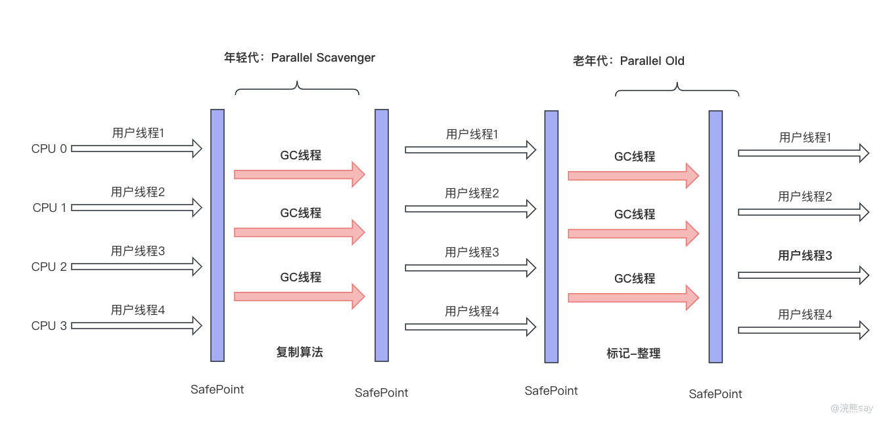

images/V3YebxlWwodzr0xLiOuc3TXonqh.png

### 什么是GC中的吞吐量？

在垃圾回收（GC）中吞吐量（Throughput）是指在一定时间内成功完成的工作量或任务的数量，即用户线程运行时间占总时间的比例。一般而言，GC时间和STW的时间越短，用户线程的执行时间就会越长，占用总时间比例也会越高，吞吐量也越高。吞吐量可以通过以下公式计算：

吞吐量 = 用户线程执行时间/总时间 \* 100% = 用户线程执行时间/（GC时间+用户线程执行时间）\* 100%

其中，“有效工作时间”表示垃圾回收系统真正用于执行用户线程任务的时间，而“总时间”表示“用户线程执行时间+垃圾回收时间”。

在Java中，通过选择合适的垃圾回收器、调整相关参数，以及优化代码，可以达到更好的吞吐量性能。例如，一些并行垃圾回收器（如Parallel GC）通过多线程并行执行垃圾回收操作，提高吞吐量。

同时，一些并发垃圾回收器（如CMS和G1）通过在应用程序运行的同时执行垃圾回收来减小停顿时间，也有助于提高吞吐量。

对于不同类型的垃圾回收器，需要根据实际的项目情况和垃圾回收器属性来选择适合的垃圾回收器。

### 选择高吞吐量还是低停顿？

一般而言，垃圾回收器的设计目标分为两大方向：低停顿时间和高吞吐量，不同的应用场景可能需要根据具体需求选择适当的垃圾回收策略。

低停顿时间的垃圾回收器通常意味着用户的线程的等待时间短，服务响应快速，适合实时性要求较高的服务，例如：Web服务，实时通讯系统等。

而高吞吐量的垃圾回收器一般意味着系统整体在GC上消耗的时间更短，整体吞吐量更高，适合对实时性要求不那么高的系统，例如：科学数据计算。

1. **低停顿时间（Low Latency）：** 垃圾回收器追求低停顿时间主要是为了减小应用程序在垃圾回收过程中的停顿时间，从而提高系统的实时响应性。这对于需要快速响应用户请求、对实时性要求较高的服务非常重要。例如：

- **Web服务：** 在Web服务中，用户期望快速加载页面和响应请求，因此低停顿时间的垃圾回收器更适合这种场景。
- **实时通讯系统：** 在实时通讯系统中，用户希望消息能够及时传递，低停顿时间有助于减小消息传递的延迟。

1. **高吞吐量（High Throughput）：** 垃圾回收器追求高吞吐量主要是为了最大化整体系统的工作效率，提高在一定时间内完成的任务数量，适用于对实时性要求相对较低、更关注系统整体性能的场景。例如：

- **科学数据计算：** 在科学计算领域，对于大规模数据的处理，高吞吐量的垃圾回收器有助于系统更快地完成计算任务，提高科学计算的效率。
- **批处理应用：** 对于需要处理大量数据的批处理应用，高吞吐量可以加速数据处理的速度，提高整体系统的吞吐能力。 在Java中，一些垃圾回收器在设计上更倾向于低停顿时间，例如CMS（Concurrent Mark-Sweep）和G1（Garbage-First），而另一些则更倾向于高吞吐量，例如Parallel GC。选择合适的垃圾回收策略通常需要根据应用的性能需求、系统硬件配置和特定场景下的优劣势进行权衡和调整。

### 年轻代吞吐量优先收集器——**Parallel Scavenge 收集器**

Parallel Scavenge（并行年轻代垃圾回收器）是Java HotSpot虚拟机中的一种垃圾回收器，专注于对新生代进行并行垃圾回收。它的设计目标是在多核处理器上提供高吞吐量，以最大化整体系统的工作效率。以下是关于Parallel Scavenge垃圾回收器的一些重要特点和概念：

1. **并行收集：** Parallel Scavenge采用了多线程并行的方式进行新生代的垃圾回收。这意味着在垃圾回收过程中，多个线程同时工作，以加速垃圾回收的速度。
2. **复制算法：** Parallel Scavenge使用了复制算法（Copying Algorithm）来管理新生代。新生代被划分为两个相等的区域：Eden区和两个Survivor区（S0和S1）。在垃圾回收过程中，存活的对象被复制到其中一个Survivor区，而非存活的对象则被直接清理。
3. **目标吞吐量：** Parallel Scavenge的设计目标是通过并行执行来实现高吞吐量。它更注重整体系统的工作效率而不是单次垃圾回收的停顿时间，适用于对实时性要求相对较低的应用。
4. **自适应调节：** Parallel Scavenge具有自适应调节的功能，能够根据系统的负载情况动态调整垃圾回收策略，以提供更好的性能。例如，根据垃圾回收的停顿时间动态调整新生代的大小。
5. **参数调优：** 用户可以通过一系列的参数来调整Parallel Scavenge的行为，以满足特定应用场景的性能需求。例如，可以通过-XX:MaxGCPauseMillis参数设置期望的最大垃圾回收停顿时间。 启动参数示例：

java -XX:+UseParallelGC -XX:MaxGCPauseMillis=200 -Xmx512m -jar YourApplication.jar

在这个例子中，通过-XX:+UseParallelGC启用Parallel Scavenge垃圾回收器，并通过-XX:MaxGCPauseMillis设置期望的最大垃圾回收停顿时间为200毫秒。更多设置参数如下：

总体而言，Parallel Scavenge适用于那些对高吞吐量要求较高、对实时性要求相对较低的应用场景。

### 老年代吞吐量优先收集器——Parallel Old**收集器**

Parallel Old 是 Java HotSpot 虚拟机中的老年代垃圾回收器，它是 Parallel Scavenge 的老年代版本。与 Parallel Scavenge 一样，Parallel Old 也注重高吞吐量，旨在最大化整体系统的工作效率。以下是关于 Parallel Old 垃圾回收器的一些主要特点：

1. **并行收集：** Parallel Old 与 Parallel Scavenge 一样，采用多线程并行的方式进行垃圾回收。这意味着在老年代的垃圾回收过程中，多个线程同时参与，以提高吞吐量。
2. **标记-整理算法：** Parallel Old 使用标记-整理（Mark-Compact）算法来进行老年代的垃圾回收。在标记阶段，标记存活的对象，然后在整理阶段，将存活的对象整理到一端，以便为新对象的分配腾出空间。
3. **目标吞吐量：** 与 Parallel Scavenge 一样，Parallel Old 的设计目标是追求高吞吐量。这意味着它更注重整体系统的工作效率，适用于对实时性要求相对较低的应用。
4. **自适应调节：** Parallel Old 同样具有自适应调节的功能，可以根据系统的负载情况动态调整垃圾回收策，以提供更好的性能。
5. **参数调优：** 用户可以通过一系列的参数来调整 Parallel Old 的行为，以满足特定应用场景的性能需求。例如，可以通过 -XX:MaxGCPauseMillis 参数设置期望的最大垃圾回收停顿时间。 启动参数示例：

java -XX:+UseParallelOldGC -XX:MaxGCPauseMillis=200 -Xmx1024m -jar YourApplication.jar

在这个例子中，通过 -XX:+UseParallelOldGC 启用 Parallel Old 垃圾回收器，并通过 -XX:MaxGCPauseMillis 设置期望的最大垃圾回收停顿时间为200毫秒。更多Parallel Old的设置参数如下：

总体而言，Parallel Old 适用于那些对高吞吐量要求较高、对实时性要求相对较低的应用场景，特别是在老年代的垃圾回收方面。

## 八、图解CMS垃圾回收器的核心流程

### CMS（Concurrent Mark-Sweep）概述

CMS（Concurrent Mark-Sweep）收集器是 Java 虚拟机中的一种老年代（Old Generation）垃圾收集器，它主要目标是减少垃圾收集时的应用程序停顿（STW）时间。

CMS 使用并发（Concurrent）的方式来执行垃圾收集，使用的是“标记-清理”算法，尽量减少在垃圾收集过程中应用程序的暂停时间。适用于对服务响应速度要求较高的场景，例如互联网站或B/S系统的服务端Java应用。

CMS垃圾收集器作为一款专注一降低停顿时间的垃圾回收器，其主要特点是低停顿和并发：

1. **并发：** CMS被设计为一款并发低停顿的垃圾收集器，使得在垃圾回收过程中用户线程不会停顿或停顿时间很短，有助于保障系统的响应速度。
2. **低停顿：** 由于其并发特性，CMS的停顿时间相对较短，适用于对服务响应速度要求高的应用场景。但是，由于CMS的实现机制，也存在着下面这些问题：
3. **对CPU资源敏感：** CMS对CPU资源敏感，因为在并发阶段虽然不会导致用户线程停顿，但会占用一部分线程（CPU资源），可能导致应用程序整体变慢，降低总吞吐量。
4. **无法处理浮动垃圾：** 由于CMS在并发清理阶段用户线程仍在运行，新的垃圾可能在标记过程之后（重新标记之后）的“并发清理阶段”产生。因为在并发清理阶段用户线程和GC线程是并发运行的，而CMS不能在当前收集中处理这部分浮动垃圾。所以CMS收集器必须预留一部分空间给用户用户线程使用，不能等到老年代占用100%再进行收集。这个预留给用户的空间可以通过-XX:CMSInitiatingOccupancyFraction和-XX:+UseCMSInitiatingOccupancyOnly 两个参数来设置，这个值在JDK 5之前一般是68%，在JDK 6之后一般是92%。因此，由于浮动垃圾的产生可能会造成垃圾并发清理过程中无法分配对象的问题，从而导致“Concurrent Mode Failure”失败，触发另一次Full GC，此时CMS会临时启用Serial Old来重新进行垃圾回收，导致停顿时间更长。
5. **对CPU数量要求较高：** CMS默认启动的回收线程数为（CPU数量+3）/4，当CPU不足4个时，可能对用户程序影响较大。
6. **内存碎片问题：** 基于“标记-清除”算法的CMS会导致大量空间碎片的产生，可能对大对象分配的时候可能会产生Full GC，因为可能出现老年代空间虽有剩余但无法找到足够大连续空间来分配当前对象。

### CMS收集器整体流程

CMS垃圾收集器是一种并发执行的垃圾回收器，其执行过程分为初始标记、并发标记、重新标记和并发清理等过程，主体如下：

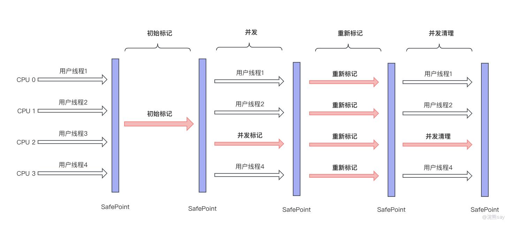

images/NYZTb9K4BoXXmUxYyLocuXx1nbc.png

#### **初始标记（CMS initial mark）**

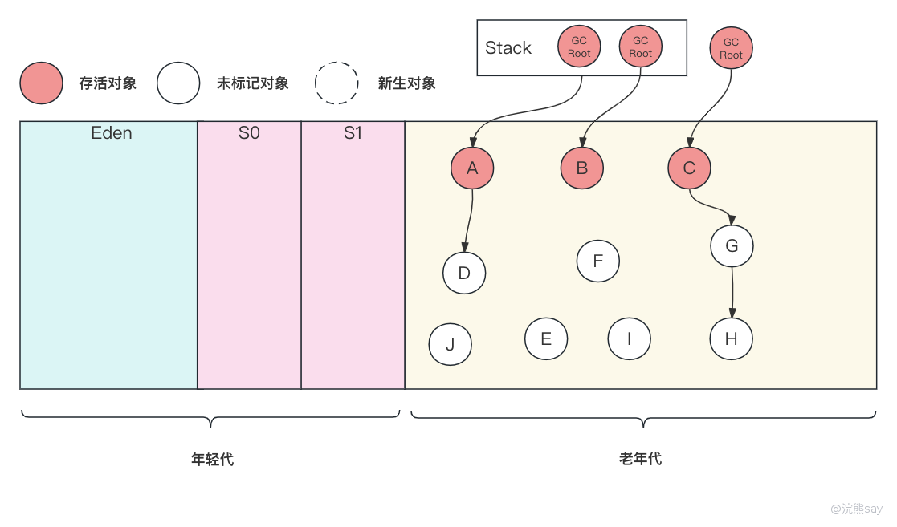

images/FDkbb3Ecmo1Az3x6nFYczk35nDe.png

初始标记只是标记GC Roots能直接关联到的对象，但需要“Stop The World”停顿，即在此期间暂停所有应用线程。这个过程在JDK 7 之前是单线程（因为GC Roots直接关联的对象相对较少），JDK 8之后是多线程的方式进行初始标记。

由于GC Root直接关联的对象小，因此可以快速的将这些对象标记出来，以减少“Stop The World”的时间。如上图所示，只标记了处于栈或者其它地方的GC Root直接关联的对象A、B、C，将这些对象标记成为存活。

##### **并发标记（CMS concurrent mark）：**

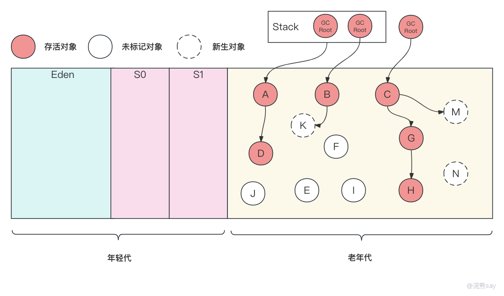

images/C094bgVwroagooxsg54cHb6cnxg.png

如上图所示，并发标记阶段主要是进行GC Roots Tracing，即从GC Roots出发标记上所有和GC Root相连的存活对象，如上图的D、G、H；而剩下的未被标记的对象就是需要进行垃圾回收的对象，如上图的E、F、I、

J。这一过程是和用户线程并发执行的，不需要“Stop The World”，因此该阶段对系统整体的性能影响较小。

但是，由于这个阶段GC线程和用户线程是并发执行的，因此可能在并发标记阶段会产生新的对象，需要进一步重新标记，来确认在并发标记阶段新引入的垃圾。

###### **重新标记（Final remark）**

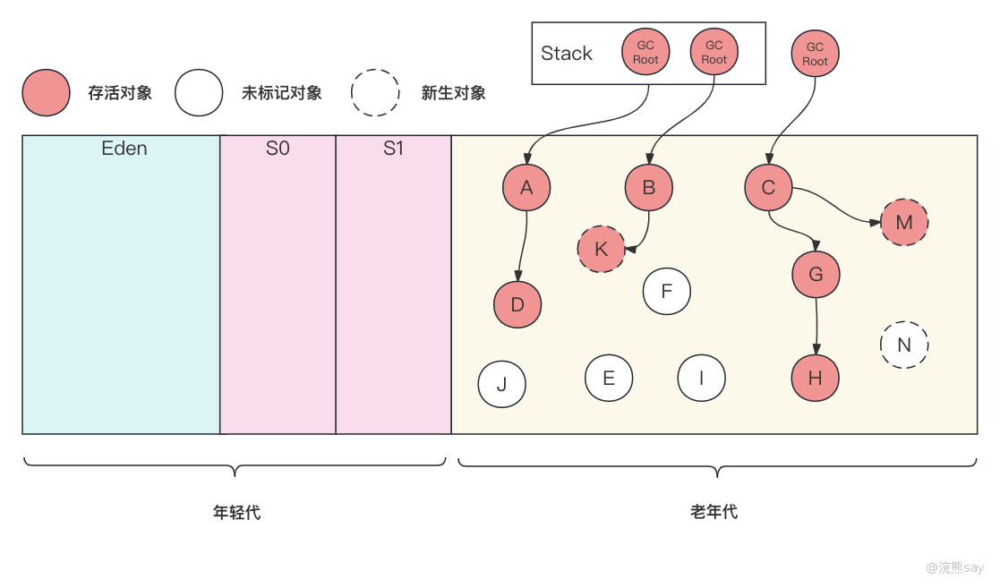

images/D1frbLWGooiOUYxKOQ4c3HNunj8.png

由于在并发标记阶段，用户线程还是在工作的，因此有可能会产生新的对象，新对象主要通过以下三个途径产生：

- 年轻代对象晋升到老年代，可能产生新的存活对象；
- 大对象直接被分配到老年代，可能产生新的存活对象；
- 老年代和年轻代对象的引用关系发生变化； 这些新的对象可能与GC Roots相连是存活对象，如K、M；也可能不与GC Roots相连接，是垃圾对象，如N。JVM会通过Card（卡片）的方式将发生变化的老年代区域标记为“脏”区域，也就是所谓的卡片标记（Card Marking）来对新增对象的存活状态进行重新标记。

另外，由于CMS采用的[三色标记算法](https://mp.weixin.qq.com/s?__biz=MzkzMjI0MDY3Mw==&mid=2247484154&idx=1&sn=69ce4608eea3c24acf4d5d675129c240&chksm=c25f8eb4f52807a2d1470ebc831657fa9a31ef88f635687f5b39fbe6cf5302df00445b7acdc6#rd)，因此在并发标记阶段可能会出现“多标”和“漏标”的情况。相对来说“多标”是可以容忍的，只需要等到下次GC的时候进行处理即可，但是“漏标”会导致正常使用的对象被释放，因此是不能容忍的。在CMS中会采用[“**写屏障 + 增量更新**”](https://mp.weixin.qq.com/s?__biz=MzkzMjI0MDY3Mw==&mid=2247484154&idx=1&sn=69ce4608eea3c24acf4d5d675129c240&chksm=c25f8eb4f52807a2d1470ebc831657fa9a31ef88f635687f5b39fbe6cf5302df00445b7acdc6#rd) 的方法来处理漏标问题，而这个方法需要将发生变化的对象进行重新标记。

因此，为了避免并发标记阶段出现的“漏标”问题以及处理并发标记阶段产生的新对象，会对GC Roots的引用链进行重新标记。为了避免Final Mark阶段再引入新的垃圾，此需要“Stop The World”停顿，与并发标记相比，停顿时间相对较短，主要关注标记发生变化的对象。

###### **并发清除（CMS concurrent sweep）：**

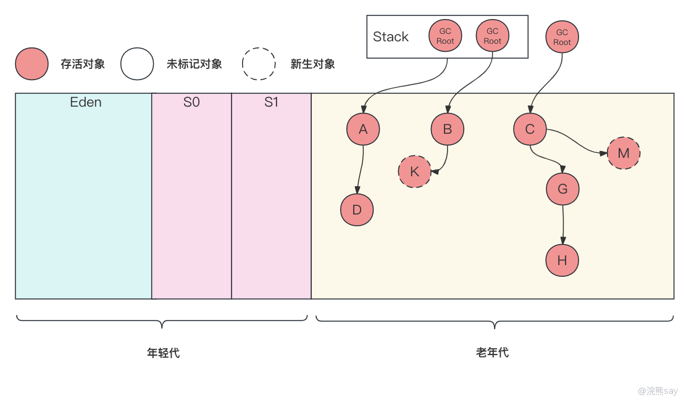

images/KivRbsdY6oZ7gsxZJutclhiZnUc.png

最后，GC线程会清除不再被引用的对象，并回收他们占用的内存空间。由于前面的标记阶段已经将还在使用的对象标记了出来，因此该过程与用户线程并发执行，不需要全局停顿（“Stop The World”），整个垃圾回收过程完成。

但是在这个过程中，由于GC线程和用户线程并发执行，因此用户线程可能会产生新的垃圾导致本次GC过程中无法处理，这部分垃圾被称为“浮动垃圾”，浮动垃圾需要到下一次GC的时候才能够被标记清除。

### 卡片标记（Card Marking）

#### 什么是卡表（Card Table）？

试想这样一个问题，当Minor GC发生的时候我们的JVM怎么判断是否存在着从老年代到新生代的引用？当然，最简单的办法就是直接扫描整个老年代，那这样一来也不用Minor GC了，直接Full GC就好了。所以说，为了快速的判断老年代是否存在到新生代的引用，以及判断老年代的内存区域是否被修改过而引入了卡片标记（Card Marking）机制。

卡片标记机制是在逻辑上讲老年代的内存空间分割为若干个固定大小的连续区域，每一个区域被称为卡片（Card）。老年代的每一个卡片都对应一个bit的标记位来标志该卡片是否为脏（dirty），而这个标记每个卡片状态的BitMap就叫做卡表（Card Table），在HotSpo中每个卡片的大小为512 Bytes。

当卡片内部内存引用发生变化时，写屏障会在卡表中将相应的bit标记为脏（dirty），从此Minor GC的时候只需要扫描为脏的老年代的内存区域即可，大大提升了GC的效率。

#### 什么是Mod-Union Table？

CMS在并发标记阶段也可能出现新增对象引用的情况，因此也需要一个BitMap来记录哪些Card是dirty的，以便后面的重新标记过程中能够快速找到发生变化的对象引用。

那么，对于CMS来说可否直接使用Card Table来标记这些发生变化的老年代区域呢？答案是不可以，因为每次Minor GC都会重置和重新扫描Card Table，这样一来CMS并发清理过程中新增的引用信息可能被重置掉。因此，JVM单独心新增了一个BitMap——Mod-Union Table，专门用于CMS并发标记过程新增引用的标记。

当CMS兵法标记运行时，每发生一个Minor GC需要更新Card Table中的某个位置时，就会相应的更新Mod-Union Table中对应的bit，相当于将Card Table中的信息转移到了Mod-Union Table中。这样以来，当Final Remark的时候根据Card Table和Mod-Union Table中的信息就足以记录并发标记过程中老年代所发生的所有引用变化。

### 浮动垃圾（Floating Garbage）

浮动垃圾（Floating Garbage）是指CMS在并发清理阶段，由于用户线程还在正常运行，所以这个阶段会产生的新的垃圾。这就好比你妈妈在扫地的时候，她一边扫地你一边丢垃圾，这样屋子里面的垃圾永远都扫不完，这部分垃圾就叫做浮动垃圾。

但是由于CMS此次的垃圾标记流程已经结束，所以浮动垃圾在当次GC过程中是无法被清理的，所以只能留到下次GC的时候才能处理这部分垃圾。因此，也需要预留足够的内存空间给用户线程使用，CMS就不能够像其他的垃圾回收器一样等老年代已经满了再进行回收。

在JDK5中，CMS（Concurrent Mark-Sweep）收集器默认在老年代使用了68%的空间后就会被启动。在JDK 6中，CMS收集器的启动阈值默认提高到了92%。用户可以通过调整参数 -XX:CMSInitiatingOccupancyFraction 来自行调节CMS收集器的启动阈值。

然而预留出空间给用户线程使用可能带来另一种风险：如果在CMS运行期间预留的内存无法满足程序分配新对象的需求，就可能发生一次并发失败（Concurrent Mode Failure）。在这种情况下，虚拟机将不得不启动备用计划：冻结用户线程的执行，临时启用Serial Old收集器来重新执行老年代的垃圾收集，因为Serial Old收集器是单线程的且使用的是“标记-整理”（Mark-Compact）算法，这样会导致较长的停顿时间。

综上所述，CMS收集器无法有效处理浮动垃圾（Floating Garbage），甚至可能触发并发模式失败（Concurrent Mode Failure），最终导致另一次完全停顿的Full GC的产生。

## 九、增量式垃圾回收器——带你深入理解G1垃圾回收器

### 概述

G1垃圾回收器是在Java 7之后引入的一种垃圾回收器。它被设计为一种分代、增量、并行和并发的标记-复制垃圾回收器，旨在适应不断扩大的内存和增加的处理器数量，以显著降低垃圾回收造成的暂停时间，同时保持良好的吞吐量，主要有以下特点：

- **并行与并发：** G1回收器在垃圾回收的不同阶段使用了并行和并发的方式，充分利用多核处理器的优势，提高了垃圾回收的效率。
- **分代回收：** G1垃圾回收器依旧采用分代回收的思想，但是和CMS等分代回收算法不同，G1不是将整个堆内存划分为年轻代、老年代和元空间。而是将堆内存划分为一个个固定大小的region，每个region可以属于年轻代或老年代。垃圾回收的基本单位是region，而不是整个堆，这使得垃圾回收更加灵活。
- **增量回收：** G1采用增量回收的方式，将整个垃圾回收过程分解为多个阶段进行，这样更有利于分散垃圾回收的压力，减小每次暂停的时间，提高系统的响应性。
- **Compacting回收：** 与CMS回收器不同，G1是一种compacting回收器，其回收的内存空间是连续的。这样就可以避免CMS收集器由于不连续内存空间造成的所需堆空间更大和浮动垃圾的问题。连续空间意味着G1垃圾回收器可以不必采用空闲链表的内存分配方式，而可以直接采用bump-the-pointer的方式；
- **软实时：** G1回收器具有软实时（soft real-time）的特性，用户可以指定垃圾回收时间的限时。虽然G1会努力在限定时间内完成垃圾回收，但并不保证每次都能在时限内完成。通过设定合理的目标，可以使大部分垃圾回收时间都在规定的时限内完成。 G1垃圾回收器以其创新性的设计和优越的性能特点，逐渐成为Java应用程序中首选的垃圾回收器之一。通过分代、增量、并行、并发等多种技术手段的结合，G1回收器在处理大内存和多核处理器的环境下表现出色，为Java应用程序提供了更好的性能和响应能力。

### G1的内存模型和分代策略

#### G1收集器相关参数

#### G1分区（Region）机制和分代策略

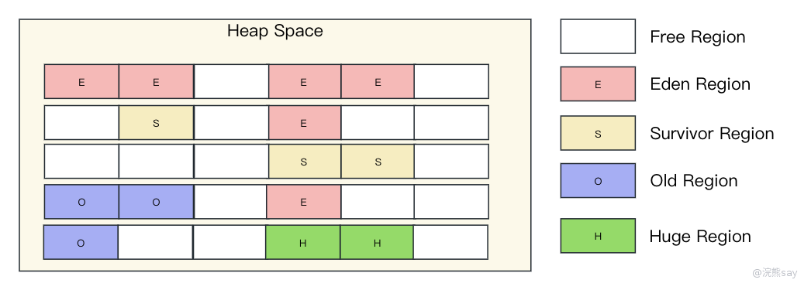

images/GWfIbYNnKoHffdxO4JEcx9Drnsh.png

如上面的图所示，G1垃圾回收器采用了内存分区（Region）思路，将整个堆空间分成若干个大小相等的内存区域，这些内存区域的大小一般大小在1MB～32MB之间，可以通过设置启动参数 -XX:G1HeapRegionSize=n 来指定分区的大小。

每次垃圾回收的时候，G1会逐段地回收这些内存区域，而且不要求对象的存储在物理上是连续的，只要在逻辑上是连续的即可。这样的好处在于，分代垃圾收集将关注点聚焦在最近分配的对象上，无需全堆扫描，从而避免了对长生命周期对象的频繁拷贝。并且年轻代和老年代的垃圾回收过程相互独立，有助于降低系统整体的响应时间。

虽然G1内存分区不要求内存分配是非连续的，但它依然逻辑上将内存划分为年轻代和老年代。然而，和CMS等分代的垃圾回收器不同，G1垃圾回收器不是将一大块连续的内存区域划分成年轻代和老年代，而是将每一个分区（Region）划分成Eden区、Survivor区、Huge区和Old区等。

并且和CMS等分代垃圾回收器不同的是，对于G1收集器来说，当现有年轻代分区被占满时，JVM会为年轻代动态分配新的空闲分区。

年轻代的整体内存大小会在初始空间（通过参数-XX:G1NewSizePercent设置，默认整堆的5%）和最大空间（通过参数-XX:G1MaxNewSizePercent设置，默认60%）之间动态变化。这个动态变化的过程由目标暂停时间（通过参数-XX:MaxGCPauseMillis设置，默认200ms）、需要扩缩容的大小以及分区的已记忆集合（RSet）共同决定。总结下上面说的，G1垃圾回收器的分区和分代机制主要有下面3个特点：

- **分区（Region）大小可调：** G1垃圾回收器可以设置分区（Region）大小范围为1MB～32MB，且必须是2的幂，默认情况下，整个堆被划分为2048个分区，但可以根据应用程序的需求进行调整。
- **逻辑连续性：** G1垃圾回收器并不强制要求对象在物理上的存储是连续的，而是以逻辑上的连续性为目标，这样一来可以更灵活的分配内存，使对象的存储不受物理位置的限制。
- **动态分代：** 每个分区并不固定地为某个代服务，分区（Region）可以被划分成Eden区、Survivor区、Huge区和Old区等。并且可以按需在年轻代和老年代之间切换，G1可以根据实际情况调整内存分区的使用。 G1垃圾回收器通过引入分区设计和分代策略，以逻辑上的连续性为基础，克服了传统垃圾回收器对物理连续性的依赖。这种设计使得对象的存储更加灵活，同时允许动态调整分区的使用，为应对不同应用场景提供了更好的适应性。

#### **G1 卡片（Card）标记机制**

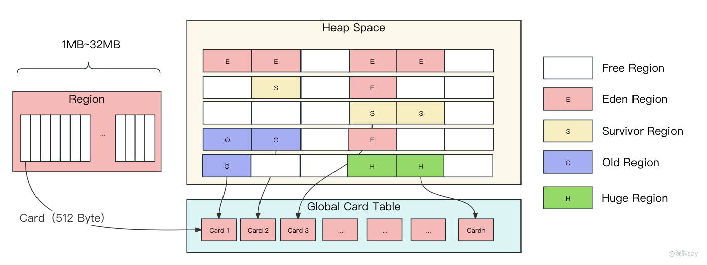

images/LKITbeIiHoGGBvxktE7cr8Dzncf.png

如上图所示，在G1垃圾回收器中，每个分区内部进一步被划分为若干大小为512 Byte的卡片（Card）。这些卡片用于标识堆内存的最小可用粒度。所有分区的卡片记录在全局卡片表中（Global Card Table），而分配的对象将占用物理上连续的若干个卡片，总结起来主要有以下几点：

- **卡片（Card）：** G1将每个分区（Region）进一步划分为大小为512 Byte的卡片，这是最小的标记单位，对象的分配和回收都以卡片为基本单位进行，这个卡片的大小是可以进行设置和调整的。
- **全局卡表（**Global Card Table**）：** 所有分区的卡片状态会被记录在全局卡片表中，这个表维护了对每个卡片的引用状态，用于在垃圾回收过程中准确地追踪对象引用关系。
- **对象分配物理连续性：** 分配的对象会占用物理上连续的若干个卡片，这种设计有助于提高内存的利用率，并简化对内存的管理。
- **引用查找：** 对分区（Region）内对象引用的查找通过记录卡片（Card）的方式实现，G1维护了一个叫做RSet（Remembered Set）的数据结构，用于记录在分区内对象的引用关系。
- **回收处理：** 每次对内存的回收都涉及对指定分区的卡片进行处理。通过检查RSet中的信息，G1能够确定哪些对象是不再被引用的，从而进行相应的回收操作。 G1垃圾回收器利用卡片标记机制，将堆内存划分为最小的可标记单位，实现了对对象引用关系的准确追踪。这种分区和卡片的设计有助于提高垃圾回收的效率，同时为更精细的内存管理提供了基础。

#### G1 堆（Heap）**空间调整机制**

G1垃圾回收器提供了一套灵活的堆空间调整机制，通过自动调整堆空间大小来适应不同的应用场景，可以指定堆空间的大小，也可以设置堆空间的比例来调整GC的频率。

- **指定堆空间大小：** 通过标准的JVM参数 -Xms（初始堆大小）和 -Xmx（最大堆大小）可以手动指定堆空间的大小。
- **自动调整：** G1在发生年轻代收集或混合收集时，会根据GC与应用的耗费时间比进行自动调整堆空间大小。这个比例由目标参数 -XX:GCTimeRatio 决定，默认值为9。G1根据应用和GC的相对耗时，动态调整堆空间，以减少GC的频率和相应的时间开销。
- **GC频率控制：** 如果GC频率过高，G1可以通过增加堆的尺寸来减少GC的频率，从而降低GC占用的时间。这是通过自动调整堆空间大小实现的。
- **空间不足处理：** 当发生对象空间分配或转移失败时，G1会首先尝试增加堆空间。如果扩容成功，问题得以解决；如果扩容失败，G1会触发一次担保的Full GC，Full GC后，G1重新计算堆尺寸，调整堆空间大小。 通过这套机制，G1垃圾回收器在运行时可以动态适应不同的工作负载，提高垃圾回收的效率，同时降低GC对应用程序的影响。

#### **本地分配缓冲 Local allocation buffer (Lab)**

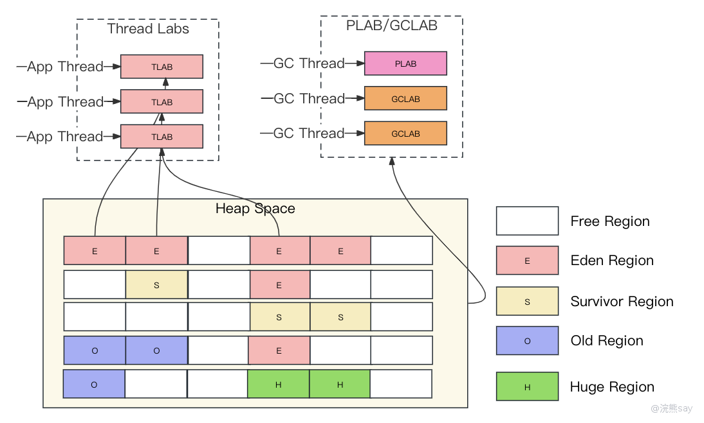

images/DpmSbakj0ofJrPxxXKDc8EfenRh.png

在JVM中一个对象被创建之后，JVM首先要做的事就是给这个对象分配一块儿内存空间。但是，执行这个内存分配工作

的也是一个线程，那么只要涉及到多线程就可能会出现线程安全问题，于是就有了LAB（本地分配缓冲）的概念。

LAB（本地分配缓冲，**Local allocation buffer**）的意思是每个线程都有自己独立的一个分区（Region）来进行内存分配，这样线程之前的内存互不打扰，就保障了线程的安全。

结合G1垃圾回收器来说，由于采用了分区（Region）的思想，所以每个线程都可以“认领”某个分区用于线程本地的内存分配，而无需顾忌内存空间是否连续。每个应用线程和GC线程都会独立的使用某个分区，从而减少同步所耗费的时间，提升GC效率，这个分区被称为”本地分配缓冲区“（Lab），除了Lab之外还有TLAB、PLAB和GCLAB等概念，如下：

- **TLAB（Threads Local Allocation Buffer，线程本地分配缓冲区）:** 每一个应用线程（App thread）都可以独占一个本地缓冲区（即Region）来创建对象，TLAB通常属于 Eden 空间，因为大部分对象会首先在 Eden 区被分配（大型对象除外）。
- **GCLab（GC Local Allocation Buffer，GC 本地缓冲区）:** 每个GC线程在进行垃圾收集时，同样可以独占一个本地缓冲区（GCLAB，即Region）用于转移对象，在每次回收过程中，对象会被复制到 Survivor 空间或老年代空间。
- **PLAB（Promotion Local allocation buffer，晋升本地缓冲区）:** 对于从 Eden 或 Survivor 空间晋升到 Survivor 或老年代空间的对象，即Old对象，同样有GC线程独占的本地缓冲区进行操作，该部分称为晋升本地缓冲区（PLAB）。 这种分区和本地缓冲区的设计使得每个线程有了自己独立的Region，有助于提高并发性和减少同步开销，从而提升垃圾收集的效率。

### Remember Set（RSet）和Collection Set（CSet）

前面说过，对于G1收集器而言内存区域会被划分成Eden Region、Survivor Region、Old Region和Humongous Region等不同分代的区域，而这些区域内部又会按照512 Bytes的大小为一个Card，进一步被划成为多个Card。

G1收集器在分配对象的时候，是按照完整Card的来进行分配的，也就是说一个对象可以占用1个、2个甚至多个cards，即使这些Cards没有被完全占满，也会分配整数个Cards给这个对象使用。那么这样一来，当G1垃圾回收器需要回收某一个对象的时候就只需要回收对象对应的Cards就可以了，这样既高效也不会影响到其它对象的正常使用。

#### 为什么需要RSet？

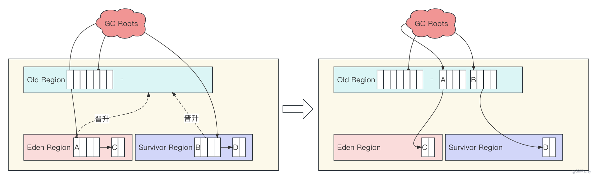

images/OttSbo3DeoNMF1x06rocsGPJn1d.png

G1回收器在对某个Region进行垃圾回收的时候，首先会使用的[“根可达算法”](https://mp.weixin.qq.com/s?__biz=MzkzMjI0MDY3Mw==&mid=2247484160&idx=1&sn=b5047168c46ff2451af1254f977eca59&chksm=c25f8f4ef5280658b32ee3c7efcf1bc79ba05e49405c79758ecf83430249bbae7ff2508d2e10#rd)和“[三色标记](https://mp.weixin.qq.com/s?__biz=MzkzMjI0MDY3Mw==&mid=2247484154&idx=1&sn=69ce4608eea3c24acf4d5d675129c240&chksm=c25f8eb4f52807a2d1470ebc831657fa9a31ef88f635687f5b39fbe6cf5302df00445b7acdc6#rd)”算法从GC Roots开始进行垃圾标记。在垃圾标记的过程中，由于晋升等原因，某些Region当中对象可能会被移动到其它Region，但是G1收集器中对对象的引用是到Region中的Cards级别的。

在G1 垃圾收集器中的对象是可以晋升的，和其它垃圾收集器类似当年轻代的对象存活超过一定时间之后，就可以从年轻代晋升为老年代。如上图所示，假设GC Roots分别引用了Eden Region 中的A对象和Survivor Region中的B对象，而在GC过程中这两个对象由于晋升等原因被移动到了Old Region。而此时，对象A和B依旧还是引用了处于Eden和Survivor中的C、D对象，这也就发生了跨区域（Region）的引用。

除了上面所说的从老年代到新生代的引用之外，根据G1的设计思路，还存在以下几种引用情况：

1. 分区内部有引用关系
2. 新生代分区到新生代分区之间有引用关系
3. 新生代分区到老生代分区之间有引用关系
4. 老生代分区到新生代分区之间有引用关系
5. 老生代分区到老生代分区之间有引用关系 另外，G1垃圾回收器也是分代垃圾回收器，也存在着**新生代垃圾回收**（Young GC，回收Eden区、Survivor区）、**混合回收**（Mixed GC，Eden区、Survivor 区、Old 区）和**Full GC**（Eden区、Survivor区、Old区和Huge区等）。

那么，假设Young GC发生的时候，就按照上图的例子，如果我们发现处于Eden区或者Survivor区的对象被Old区或者其它区域的对象所引用，这种时候如何才能将当前区域的对象成功标记为存活对象呢？

最简单的办法当然是整体扫描所有区域来得到其它区域对当前区域的引用，那就相当于每次Young GC都要进行一次Full GC才能找到所有引用关系，保证不发生漏标。但是，这种方法无异于高射炮打蚊子，得不偿失，会导致G1垃圾回收器效率极低。

所以，如果对于当前Region中的某个对象，我们知道它被什么对象所引用，或者换句话说有一个当前对象的**反向指针。这样以来，**我们就能够更快速的判断当前区域中的对象是否被GC Root所引用，是否应该被标记成存活对象。此时我们的主角就呼之欲出了——RSet。

RSet作为用于记录引用关系的数据结构，在有效地追踪这些引用。通过精确地维护RSet，G1能够更有效地执行垃圾回收，从而最大程度地减少对可用空间的影响。这种详细的引用关系分析有助于优化垃圾回收算法，提高Java应用程序的性能和资源利用率。

#### [RSet的实现机制](https://blog.csdn.net/qq_16500963/article/details/133147069?spm=1001.2101.3001.6650.2&utm_medium=distribute.pc_relevant.none-task-blog-2~default~YuanLiJiHua~Position-2-133147069-blog-97276211.235%5Ev38%5Epc_relevant_anti_t3&depth_1-utm_source=distribute.pc_relevant.none-task-blog-2~default~YuanLiJiHua~Position-2-133147069-blog-97276211.235%5Ev38%5Epc_relevant_anti_t3&utm_relevant_index=4)

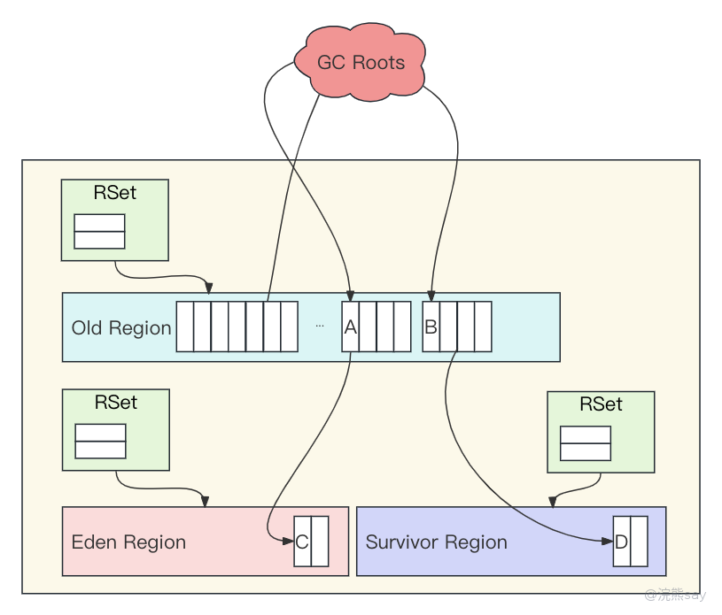

images/UrULbLKX1oAkb5xEGWPc4uZ3n3b.png

由于G1垃圾回收器的回收粒度是按照区域（Region进行的），为了记录Region之间对象引用关系，当Region初始化的时候，JVM会拿出这个Region的一部分区域用来初始化一个RSet（Remembered Set，已记忆集合），这个集合的作用是记录和跟踪其它Region指向该Region中对象的Card的引用。在进行垃圾标记的时候，除了从GC Roots开始遍历，还会从RSet开始遍历，确保该区域中所有存活的对象都会被标记到。

RSet是一种典型的空间换时间的策略，对于Old->Young、Old-Old的跨代对象引用，只需要扫描RSet即可。RSet中记录了其它Region钟对象引用本Region中的对象，属于Point-Into（谁引用了我），而Card Table则属于Point-Out（我引用了谁）。但是，由于RSet是属于每一个Region的，如果单个Region中被引用的对象过多，对内存的开销就会太大，因此引入了我们接着需要介绍的节省RSet空间的机制——PRT机制。

##### **Per Region Table（PRT）机制**

**RSet内部采用Per Region Table（PRT）**来记录分区的引用情况。由于RSet的记录会占用分区的空间，当一个分区变得非常“热门”时，RSet占用的空间会增加，从而降低了分区的可用空间。为了应对这个问题，G1采用了改变RSet密度的策略，即在PRT中使用三种不同的模式来记录引用：

这种灵活的模式选择允许G1根据分区的特性和使用情况动态调整RSet的记录密度，以平衡空间占用和引用追踪的性能。这种策略的实施有助于在分区受欢迎的情况下最大限度地减少对可用空间的影响。

##### **RSet记录的引用类型**

同时，由于G1垃圾回收器在YGC的时候会对所有的Eden区和Survivor区域都进行扫描和回收，因此，从年轻代到年轻代的引用是无需记录的。更多的引用关系如下：

如上表所示，由于G1回收器不同类型的GC所处理的区域不同，并不是所有其它区域对本区域的引用关系都需要被记录的，简单来说只有“老年代分区到新生代分区”的引用、“老年代分区到老年代”分区的引用需要被RSet记录下来。

#### CSet（收集集合，Collection Set）

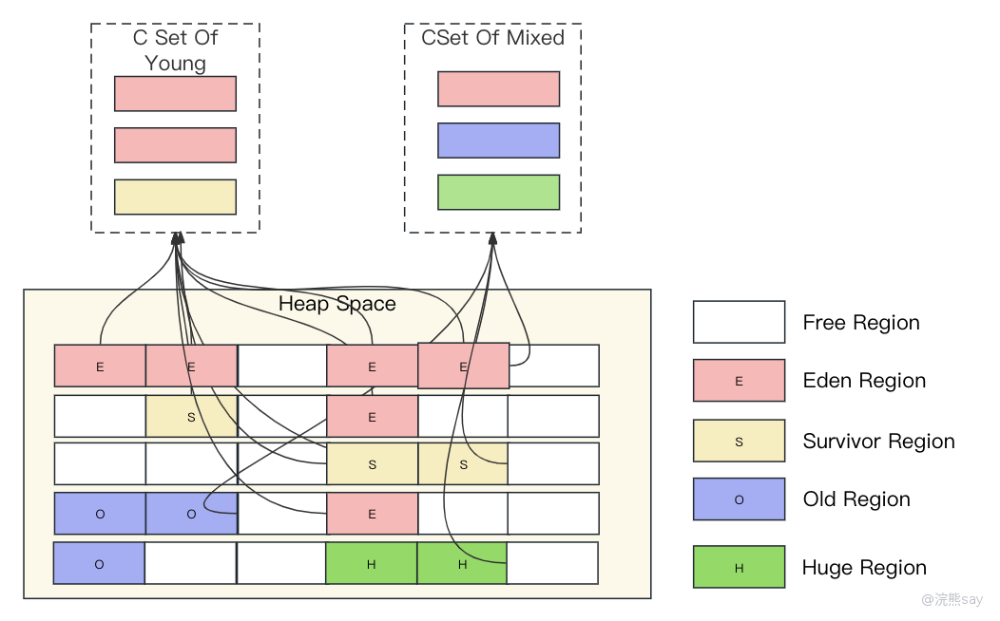

images/KvHybPY8So1NOsx8VUnc2Afonep.png

G1收集器中的CSet（收集集合，Collection Set）是一组被选中进行垃圾回收的Region的集合。G1收集器是以Region为单位的，并且分为YGC和Mixed GC，这两种GC方式都是需要STW的，但是G1收集器的一个优势就是它是增量式的垃圾回收器，可以根据设置的回收停顿时间来动态调整每次的回收量。CSet就可以很好的支持增量回收的特性，其中存储的就每次YGC或者Mixed GC时需要回收清理的所有Region。当回收的时，CSet中的所有Region都将被释放，区域存活的对象将被移动到分配的空闲分区（Free Region）中。

由于G1收集器分为Young GC和Mixed GC两种模式，因此存在着两种不同的CSet分别在这两种模式下使用：

- **Young GC中的CSet:** 在Young GC中，CSet包含所有Young区域，即Eden和Survivor分区。当Eden区域满时，触发Young GC，CSet中的对象将被移动或复制到Survivor分区或老年代。这个过程确保Young GC时只处理一小部分内存，减小了每次垃圾回收的暂停时间。
- **Mixed GC中的CSet:** 在Mixed GC中，CSet包括一部分老年代区域，这些区域被选中进行部分垃圾回收。与Young GC不同，Mixed GC关注的是整个堆的内存回收，而不仅仅是年轻代的部分。G1在Mixed GC过程中会优先选择收益高的老年代区域，以提高垃圾回收的效率。 通过使用CSet，G1收集器可以更灵活地控制垃圾回收的范围，同时通过优先处理收益高的区域，提高了内存回收的效率。这种策略使得G1可以在更可控的停顿时间内实现高效的垃圾回收。

#### RSet的维护

由于不能整堆扫描，又需要计算分区确切的活跃度，因此，G1需要一个增量式的完全标记并发算法，通过维护RSet，得到准确的分区引用信息。在G1中，RSet的维护主要来源两个方面：写栅栏(Write Barrier)和并发优化线程(Concurrence Refinement Threads)

##### 屏障（Barrier）

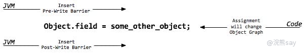

images/BodWb45NnoL9Ljxe4xocQNPfnJh.png

屏障(Barrier)是指在原生代码片段中，当某些语句被执行时，屏障代码也会被执行。而G1主要在赋值语句中，使用写前屏障(Pre-Write Barrier)和写后屏障(Post-Write Barrier)，如下：

- 写前屏障 (Pre-Write Barrier)：即将执行一段赋值语句时，等式左侧对象将修改引用到另一个对象。那么等式左侧对象原先引用的对象所在分区将因此丧失一个引用。此时，JVM需要在赋值语句生效之前，记录丧失引用的对象。JVM并不会立即维护RSet，而是通过批量处理，在将来RSet更新(见SATB)。
- 写后屏障 (Post-Write Barrier)：当执行一段赋值语句后，等式右侧对象获取了左侧对象的引用。那么等式右侧对象所在分区的RSet也应该得到更新。同样为了降低开销，写后屏障发生后，RSet也不会立即更新，同样只是记录此次更新日志，在将来批量处理(见Concurrence Refinement Threads)。 事实上，写屏障的指令序列开销非常昂贵，应用吞吐量也会根据屏障复杂度而降低。

##### 始快照算法（Snapshot at the Beginning，SATB）

SATB是由Taiichi Tuasa 提出的增量式完全并发标记算法，主要应用于标记-清除垃圾收集器的并发标记阶段。SATB 针对 G1 的分区块堆结构设计，同时解决了 CMS（Concurrent Mark-Sweep）的一个主要问题，即重新标记暂停时间长导致的潜在风险。

SATB 的核心思想是创建一个对象图，类似于堆的逻辑快照，以确保在并发标记阶段能够鉴别出所有的垃圾对象。当赋值语句发生时，应用会改变其对象图，因此 JVM 需要记录被覆盖的对象。为此，写前屏障会在引用变更前，将值记录在 SATB 日志或缓冲区中。每个线程都有一个独占的 SATB 缓冲区，初始时有 256 条记录空间。当空间用尽时，线程会分配新的 SATB 缓冲区继续使用，而旧的缓冲区则加入全局列表。

在并发标记阶段，标记线程会定期检查和处理全局缓冲区列表的记录。然后，根据标记位图分片的标记位，扫描引用字段来更新 RSet（Remembered Set）。这个过程也被称为并发标记/SATB写前屏障。

##### 并发优化线程 (Concurrence Refinement Threads)

G1 中使用基于 Urs Holzle 的快速写屏障，将屏障开销缩减到 2 个额外的指令。屏障将会更新一个 card table type 的结构来跟踪代间引用。当赋值语句发生后，写后屏障会先通过 G1 的过滤技术判断是否是跨分区的引用更新，并将跨分区更新对象的卡片加入缓冲区序列，即更新日志缓冲区或脏卡片队列。与 SATB 类似，一旦日志缓冲区用尽，则分配一个新的日志缓冲区，并将原来的缓冲区加入全局列表中。

并发优化线程 (Concurrence Refinement Threads) 专注于扫描日志缓冲区记录的卡片，以维护更新 RSet。可以通过设置参数 -XX:G1ConcRefinementThreads 来控制并发优化线程的最大数量，默认等于 -XX:ParallelGCThreads。

并发优化线程一直保持活跃，一旦发现全局列表中有记录存在，就开始并发处理。如果记录增长迅速或者处理不及时，G1 会使用分层的方式调度，以使更多的线程处理全局列表。如果并发优化线程无法跟上缓冲区数量，Mutator 线程 (Java 应用线程) 可能会挂起应用并被加入来协助处理，直到全部处理完成。因此，需要尽量避免出现这种情况。

### G1的垃圾回收流程

#### G1的GC模式

G1提供了两种GC模式，分别是Young GC（即YGC）和Mixed GC，它们都是完全停顿（”Stop The World“）的垃圾回收方式，需要暂停用户线程。而Full GC实际上是采用了Serial Old的GC方式，不是G1提供的GC模式，如下：

- **Young GC（年轻代GC）**： 选择所有年轻代中的Region进行回收，通过控制年轻代的Region数量，即年轻代内存大小，来控制Young GC的时间开销。
- **Mixed GC（混合GC）**： 同样选择所有年轻代中的Region，加上根据全局并发标记（global concurrent marking）统计的若干老年代Region进行回收。在用户指定的开销目标范围内，尽可能选择收益高的老年代Region。
- **Full GC：** Mixed GC并非完全回收堆内存的Full GC，它只回收部分老年代的Region。如果Mixed GC无法跟上程序分配内存的速度，导致老年代填满无法继续进行Mixed GC，系统会使用Serial Old GC（Full GC）来收集整个GC heap。 以上3种GC模式中，Young GC和Mixed GC，是G1回收空间的主要活动。当应用运行开始时，堆内存可用空间还比较大，只会在年轻代满时，触发Young GC进行垃圾回收；随着老年代内存增长，当到达IHOP阈值-XX:InitiatingHeapOccupancyPercent(老年代占整堆比，默认45%)时，G1就会根据一定的条件（参考后面内容）来触发Mixed GC和Full GC。

#### GC 工作线程数（-XX:ParallelGCThreads）

JVM可以通过参数-XX:ParallelGCThreads来指定GC工作的线程数量。该参数的默认值并非固定，而是根据当前的CPU资源进行计算。如果用户没有指定，并且CPU核数小于等于8，则默认与CPU核数相等；如果CPU核数大于8，则JVM会经过计算得到一个小于CPU核数的线程数。用户也可以手动指定线程数，例如与CPU核数相等。

#### Young GC核心流程

Young GC的核心流程就是采用STW的方式对所有的Young Region进行回收，将需要晋升的对象复制到老年代，这个过程不仅需要遍历GC Roots 还需要对CSet进行扫描。

当应用程序刚开始运行的时候，堆内的可用空间较多，当Young Region满的时候，就会触发Young GC。这个过程中，G1收集器会将所有的Young Region，即Eden区，放到CSet当中。Eden分区中存活的对象将被复制到Survivor分区。原有的Survivor分区中存活的对象将根据存活次数（年龄）的任期阈值分别晋升到PLAB（Parallel Live Allocation Buffer）、新的Survivor区，或Old区，原有的Eden分区将被整体回收。

具体来说，当JVM无法将新对象分配到Eden区域时，会触发Young GC，也称为”evacuation pause”,这是一个用户线程完全暂停的过程，虽然其中部分步骤是并行执行的，但整个过程会导致STW，如下：

1. **选择收集集合（Choose CSet）：** G1会在遵循用户设置的GC暂停时间上限的基础上，选择一个最大Eden区域数，将这个数量的所有Eden区域作为收集集合。
2. **根处理（Root Scanning）：** 从GC Roots开始遍历，查找从roots引用直达到CSet的对象（存活对象），并将它们移动到Survivor区域。同时将存活对象引用的对象加入标记栈（Mark Stack），这一阶段确保CSet中存活的对象被正确复制。
3. **RSet扫描（Scan RS）：** 在RSet扫描之前会先更新RSet（Update RS），因为RSet是先写日志，再通过一个Refine线程进行处理日志来维护RSet数据的。这里的更新RSet就是为了保证RSet日志被处理完成，RSet数据完整才可以进行扫描。然后，遍历RSet，将可直达到CSet的对象（存活对象）移动到Survivor区，同时将存活对象引用的对象加入标记栈。
4. **移动（Evacuation/Object Copy）：** 遍历标记栈，将栈内的所有对象（存活对象）复制到Survivor区域。这一步是整个”evacuation pause”的核心，确保所有需要移动的对象都被正确复制。这个过程的目标是将年轻代的存活对象转移到Survivor区域，并确保相关引用关系得以更新。整个”evacuation pause”是一个短暂的停顿，但会保证内存中的对象关系得以正确维护。
5. **收尾步骤：** 年龄超过晋升阈值的对象会直接移动到老年代区域。执行一些收尾工作，如Redirty（与并发标记配合使用）、Clear CT（清理Card Table）、Free CSet（清理回收集合）等，这些操作通常耗时很短。 Young GC还负责维护对象的年龄(存活次数)，辅助判断老化(tenuring)对象晋升的时候是到Survivor分区还是到老年代分区。Young GC会将晋升对象尺寸总和、对象年龄信息维护到年龄表中，再根据年龄表、Survivor尺寸、Survivor填充容量-XX:TargetSurvivorRatio(默认50%)、最大任期阈值-XX:MaxTenuringThreshold(默认15)，计算出一个恰当的任期阈值，凡是超过任期阈值的对象都会被晋升到老年代。

#### Mixed GC核心流程——混合收集周期（Mixed GC Cycle）

Young GC和Mixed GC是G1回收内存的主要活动。当应用程序启动时，堆内存可用空间相对较大，此时只有在年轻代填满时才会触发Young GC。随着应用程序的运行，老年代内存逐渐增长。当老年代占整个堆的比例达到初始化堆占用百分比阈值（InitiatingHeapOccupancyPercent，默认为45%）时，G1开始准备进行老年代的收集。

但是G1收集器不会直接进行Mixed GC的收集阶段，而是先通过“并发标记周期”（Concurrent Marking Cycle）来标记出高收益的老年代分区，确定下次Mixed GC的CSet(Choose CSet)，之后再执行混合收集周期（Mixed GC Cycle）。

##### **并发标记周期 （Concurrent Marking Cycle）**

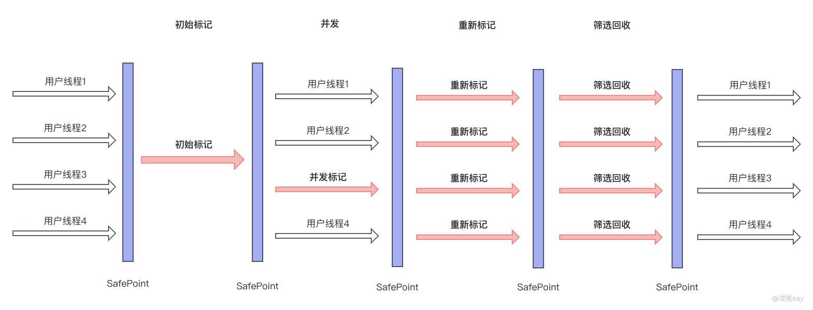

images/IaXfbaP37oHhStx6DtWcENhsnfd.png

当不断的Young GC达到IHOP阈值-XX:InitiatingHeapOccupancyPercent(老年代占整堆比，默认45%)时，就会触发并发标记周期，它的执行过程类似于CMS（Concurrent Mark-Sweep），执行过程包括以下四个步骤：

1. **初始标记（Initial Mark，STW）**： 和CMS一样，这个阶段是需要STW的，只标记从GC Root开始直接可达的对象。
2. **并发标记（Concurrent Marking）**： 并行标记线程与应用程序线程一起执行，标记整个heap中的对象，并收集各个Region的存活对象信息。
3. **最终标记（Remark，STW）**： 标记在并发标记阶段发生变化的对象，准备进行回收，这个阶段主要是重新标记在并发标记阶段产生的新垃圾，需要STW。
4. 另外，由于G1采用的[三色标记算法](https://mp.weixin.qq.com/s?__biz=MzkzMjI0MDY3Mw==&mid=2247484154&idx=1&sn=69ce4608eea3c24acf4d5d675129c240&chksm=c25f8eb4f52807a2d1470ebc831657fa9a31ef88f635687f5b39fbe6cf5302df00445b7acdc6#rd)，在并发标记阶段可能会出现[“多标”和“漏标”](https://mp.weixin.qq.com/s?__biz=MzkzMjI0MDY3Mw==&mid=2247484154&idx=1&sn=69ce4608eea3c24acf4d5d675129c240&chksm=c25f8eb4f52807a2d1470ebc831657fa9a31ef88f635687f5b39fbe6cf5302df00445b7acdc6#rd)的情况。相对来说“多标”是可以容忍的，只需要等到下次GC的时候进行处理即可；但是“漏标”会导致正常使用的对象被释放，因此是不能容忍的。在CMS中会采用[“写屏障 + 原始快照”](https://mp.weixin.qq.com/s?__biz=MzkzMjI0MDY3Mw==&mid=2247484154&idx=1&sn=69ce4608eea3c24acf4d5d675129c240&chksm=c25f8eb4f52807a2d1470ebc831657fa9a31ef88f635687f5b39fbe6cf5302df00445b7acdc6#rd) 的方法来处理漏标问题，而这个方法需要将发生变化的对象进行重新标记。
5. **筛选回收（Cleanup）**： 筛选回收环节会对Old Region的回收价值和成本进行排序，根据用户指定的停顿时间等来确定回收性价比最高的Region。这个阶段和CMS不同，是需要STW的。

##### 初始标记（Initial Mark，STW）

初始标记（Initial Mark）的任务是标记所有直接可达的根对象，如原生栈对象、全局对象和JNI对象。由于根是对象图的起点，这个阶段需要暂停Mutator线程（Java应用线程），即需要一个STW的时间段。

实际上，当达到IHOP阈值时，G1并不会立即启动并发标记周期，而是等待下一次年轻代收集。这时，它利用年轻代收集的STW时间段来完成初始标记，这种方式称为借道（Piggybacking）。在初始标记暂停期间，分区的NTAMS都被设置到分区顶部Top。初始标记是并发执行的，直到所有分区都得到处理。

初始标记暂停结束后，年轻代收集已完成对象复制到Survivor的工作，应用线程开始活跃。为了保证标记算法的正确性，所有新复制到Survivor分区的对象都需要进行扫描并标记为根。这个过程被称为根分区扫描（Root Region Scanning），同时扫描的Survivor分区也被称为根分区（Root Region）。

根分区扫描必须在下一次年轻代垃圾收集启动之前完成，因为在并发标记的过程中可能会被若干次年轻代垃圾收集打断。这确保了每次GC都有准确的存活对象集合。

##### 并发标记（Concurrent Mark）

在并发标记阶段，并发标记线程与应用线程并发执行，并发标记阶段通过参数-XX:ConcGCThreads（默认为GC线程数的1/4，即-XX:ParallelGCThreads/4）控制启动数量。

每个线程负责扫描一个分区，从而标记出存活对象图。在这个过程中，处理Previous/Next标记位图，扫描标记对象的引用字段。并发标记线程定期检查和处理STAB全局缓冲区列表的记录，更新对象引用信息。若开启参数-XX:+ClassUnloadingWithConcurrentMark，当一个类如果在Final Mark阶段不可达，将直接卸载。

标记任务必须在堆满之前完成扫描，否则会触发担保机制，经历一次长时间的串行Full GC。

存活数据计算（Live Data Accounting）是标记操作的附加产物，一旦对象被标记，将计算其字节数并记录到分区空间。只有NTAMS以下的对象会被标记和计算，标记周期结束时，Next位图将被清空，为下次标记周期做准备。

##### 最终标记（Final Mark）

重新标记(Remark)是标记阶段的最后一步。在这个阶段，G1需要进行一次短时间的停顿，来处理剩余的SATB（并发标记产生的存活对象记录）日志缓冲区和所有的更新。

其目标是找出所有未被访问的存活对象，并安全地完成存活数据计算。这个阶段也是并行执行的，可以通过参数-XX:ParallelGCThread来设置在GC暂停时可用的并行GC线程数。

与此同时，引用处理也是重新标记阶段的一部分，对于所有强引用、软引用、弱引用、虚引用以及最终引用的对象，都会在引用处理中产生一些额外的开销。

##### 筛选回收（Clean Up）

筛选回收的阶段，同样是一个STW（Stop-The-World）的过程，并且是并发执行的，主要会进行以下主要操作：

- **RSet梳理：** 启发式算法会根据活跃度和RSet尺寸对分区进行不同等级的定义。同时，RSet的梳理也有助于发现无用的引用。可以通过参数-XX:+PrintAdaptiveSizePolicy来开启打印启发式算法决策的详细信息。
- **整理堆分区：** 为Mixed GC Cycle识别回收效益高（基于释放空间和暂停目标）的Old Region集合。
- **识别所有空闲分区：** 即发现无存活对象的分区，这些分区在筛选回收阶段可以直接回收，无需等待下次Mixed GC Cycle。
- 筛选回收阶段结束之后，就可能会启动Mixed GC Cycle，Mixed GC Cycle会根据该过程中整理出的回收效益高的分区来决定是否要将这些Region加入CSet并进行回收。

#### 混合回收周期（Mixed GC Cycle）

当G1发起并发标记周期之后，并不会马上开始Mixed GC Cycle，G1会先等待下一次Young GC，然后在该收集阶段中，确定下次混合收集的CSet(Choose CSet)，之后才会决定是否开启混合回收周期。

单次的Mixed GC与Young GC在操作上别无二致，可以参考前面的Young GC的流程。但是Mixed GC为了减小垃圾回收的停顿时间，Old Region可能无法在一次Mixed GC中被完全处理。

因此，G1会启动连续多次的Mixed GC，这一系列的Mixed GC被称为混合收集周期（Mixed Collection Cycle）。在Mixed GC Cycle中，G1会进行一系列的计算和决策，来确定单次收集的分区数量以及是否结束Mixed GC：

- 计算每次加入到CSet中的分区数量；
- 确定混合收集进行的次数；
- 在上一次Young GC以及接下来的Mixed GC中，确定下一次加入CSet的分区（Choose CSet）的Region；
- 确定是否结束Mixed GC Cycle，以及是否启动Full GC； 这些计算和决策是为了优化整个混合收集周期，使得在每次垃圾回收中都能有效地处理老年代的分区，同时控制停顿时间，以提高应用程序的响应性。

#### Young GC、Mixed GC 和 Full GC的触发时机

- **Young GC触发时机：**
- Young GC的触发时机是当年轻代空间逐渐填满，无法再Eden区域分配新的对象时。
- **Mixed GC触发时机：**
- Mixed GC的触发取决于一些参数的设定，这些参数包括：
- **Full GC触发时机：**
- 在G1垃圾收集器中，当堆空间无法分配新的分区时，即无法满足对象的分配需求时，G1会启动担保机制，执行一次完全暂停（STW）的、Serial Old单线程的Full GC。Full GC的过程涉及整个堆的标记、清理和压缩，最终留下只包含存活对象的堆。Full GC发生时，G1会在日志中记录 “to-space-exhausted” 和 “Evacuation Failure”，以下是触发Full GC的一些场景，：
- \*\* 从Young Region拷贝存活对象时\*\*： 当G1尝试将Young Region的存活对象拷贝到其他分区时，如果找不到可用的Free Region，就会触发Full GC。
- **从Old Region转移存活对象时**： 在尝试将Old Region的存活对象转移到其他分区时，如果找不到可用的Free Region，同样会触发Full GC。
- **分配巨型对象时**： 当G1需要为巨型对象分配内存空间时，如果在Old Region找不到足够的连续分区，就会触发Full GC。
- 这些情况下，Full GC是G1的一种应对措施，但由于Full GC的代价昂贵，会导致暂停时间较长，因此应该尽量避免触发Full GC。

## 十、ZGC垃圾回收器原理

## ZGC简述

### 什么是ZGC？

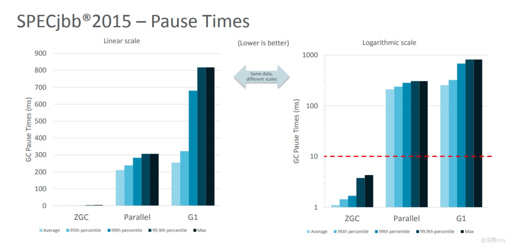

images/Mqk1bYf1YoLaDixoJRLc2eGVnid.png

ZGC（Z Garbage Collector）是Java虚拟机中的一种垃圾回收器，属于低延迟垃圾回收器，它的设计目标就是在保持较低的停顿时间的同时，能够处理非常大的堆内存。

目前已经可以将停顿时间降低到10ms左右。ZGC是从JDK 11版本开始引入的，并在后续版本中进行了改进和优化。

如上图所示是ZGC垃圾回收器和Parallel和G1等垃圾回收器相比较起来的GC Pause，可以发现其GC 停顿已经降低到的很客观的程度，并且这个GC停顿的时间还是可以自主进行配置的。

ZGC的实现没有采用分代收集机制，但是和[G1垃圾回收器](https://mp.weixin.qq.com/s?__biz=MzkzMjI0MDY3Mw==&mid=2247484154&idx=1&sn=69ce4608eea3c24acf4d5d675129c240&chksm=c25f8eb4f52807a2d1470ebc831657fa9a31ef88f635687f5b39fbe6cf5302df00445b7acdc6#rd)类似，采用了分区策略，下面是ZGC的一些特性和设计原则：

1. **低停顿时间：** ZGC的主要设计目标之一是实现低停顿时间，停顿时间（STW）不会超过10ms，这个停顿时间还可以根据实际的项目需求进行配置；
2. **处理大内存堆：** ZGC被设计为能够处理非常大的堆内存，支持8MB～4TB级别的堆内存，未来会支持16TB；
3. **并发收集：** ZGC在执行垃圾回收时，会与应用程序线程并发工作，减少了停顿时间，这意味着即使在进行垃圾回收时，应用程序也能够继续执行，降低了对应用性能的影响；
4. **可预测的停顿：** ZGC追求更加可预测的停顿时间，避免因垃圾回收而引起的不确定性。这对于需要保证应用程序的响应时间和稳定性的场景非常重要；
5. **处理不同的内存分配模式：** ZGC适应了现代应用程序中常见的内存分配模式，包括大对象、小对象、短期存活对象等，以提高垃圾回收的效率；
6. **实时可达性分析：** ZGC使用了一种实时的可达性分析算法，以更快地找到不再使用的对象，减少垃圾回收的时间。 总体而言，ZGC是为了满足对低延迟和大内存的需求而设计的一种垃圾回收器，适用于对应用程序响应时间要求较高的场景。

#### ZGC启用和相关参数

在Java应用程序中启用ZGC，可以使用以下命令行参数：

java -XX:+UnlockExperimentalVMOptions -XX:+UseZGC -jar YourApplication.jar

这个命令包括两个关键的VM选项：

- \-XX:+UnlockExperimentalVMOptions：解锁实验性的VM选项，允许使用实验性的垃圾回收器。
- \-XX:+UseZGC：启用Z Garbage Collector。 ZGC是作为实验性特性引入的，具体取决于您使用的JVM版本，需要确保你的Java版本支持ZGC，另外一些ZGC的常见重要参数如下：

### ZGC（Z Garbage Collector）原理

#### ZGC内存布局

ZGC（Z Garbage Collector）的内存布局与G1（Garbage-First）在内存布局上有些相似，都采用了基于Region的堆内存布局。ZGC在内存布局方面引入了一些动态性的概念，Region的大小不是固定不变的，也不会区分新生代、老年代区域（实际在JDK21中又引入了新老年代分区的概念，后续我会继续跟踪出一版新的原理），使得它更加灵活和适应不同场景。

ZGC的内存布局主要涉及到动态创建、动态销毁以及动态的区域容量大小，以下是ZGC内存布局的一些关键特点：

1. **动态创建：** ZGC的Region可以根据需要动态创建，系统可以根据应用程序的实际内存需求，动态生成新的内存区域，以适应不同的工作负载。
2. **动态销毁：** 类似地，ZGC的Region也可以根据垃圾回收的情况动态销毁，当某个区域内的对象被回收后，该区域可以被标记为可用，随后可以被重新分配或销毁，以便更好地管理内存。
3. **动态的区域容量大小：** ZGC引入了不同大小的Region，包括Small Region（2MB）、Medium Region（32MB）和Large Region（可变大小），使得ZGC在内存分配时能够更好地适应不同大小的对象，提高内存利用率。

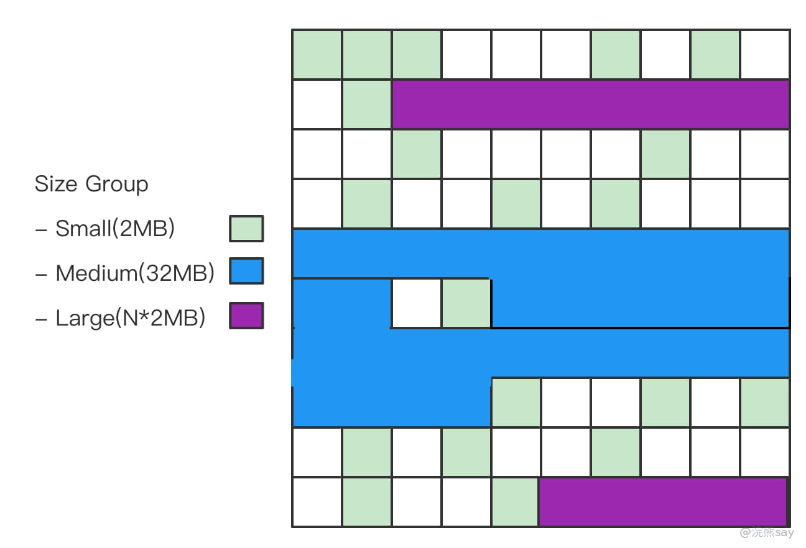

images/SO9pbPy7dorgfAx7exuc6R1MnUb.png

如上图所示，ZGC的Region分类包括：

- **Small Region（小区域）：** 大小为2MB，用于存放小于256KB的小对象。这有助于提高小对象的分配和回收效率。
- **Medium Region（中等区域）：** 大小为32MB，用于存放大于等于256KB但小于4MB的对象。中等区域的引入有助于处理中等大小的对象。
- **Large Region（大区域）：** 大区域的大小是可变的，最小为4MB。每个大区域只用于存放一个大对象，且不会被重新分配，这有助于处理大对象，减少内存碎片化。 这种动态的内存布局设计使得ZGC能够更好地适应不同的工作负载和对象分布模式。它能够在提供低延迟的同时，更加高效地管理内存空间，降低内存碎片化的程度。

#### ZGC的垃圾标记算法——染色指针

##### 什么是染色指针？

在ZGC出现之前，GC信息被保存在对象头的Mark Word当中，如64位的JVM，对象头的Mark Word中保存的信息如下：

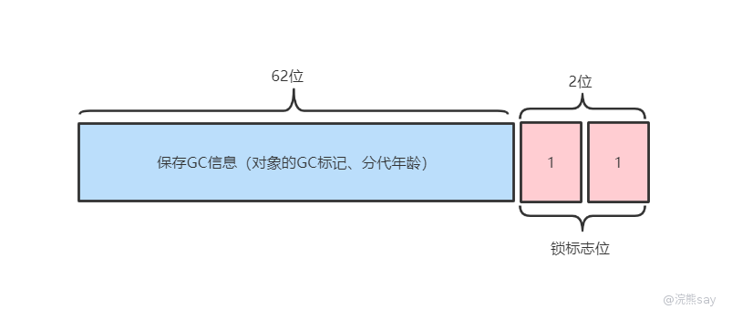

images/SdPmbk5vBoJB0VxChuvco7ILnSc.png

64位的MarkWord中保存了GC和对象相关的信息，包括：对象的哈希码、分代年龄、锁记录等。由于这些信息存在于对象头的MarkWord中，而对象实体一般存储在堆内存中，[虚拟机栈](https://mp.weixin.qq.com/s?__biz=MzkzMjI0MDY3Mw==&mid=2247484233&idx=1&sn=2a2f9b4370d4d0557d3bb17a4e838a50&chksm=c25f8f07f5280611a99843bb111b36cbf723856a9e502cc32927852793a5c0611ef127131acc#rd)帧中的局部变量表中存储的则是堆中对象的引用（指针）。因此，当访问对象的时候获取这些信息是很方便的，但是当我们在希望不直接访问对象，仅仅通过对象的指针就得到这些信息的话，这种实现方式就做不到。

但是，在追踪式垃圾回收算法的标记阶段，例如：[三色标记算法](https://mp.weixin.qq.com/s?__biz=MzkzMjI0MDY3Mw==&mid=2247484154&idx=1&sn=69ce4608eea3c24acf4d5d675129c240&chksm=c25f8eb4f52807a2d1470ebc831657fa9a31ef88f635687f5b39fbe6cf5302df00445b7acdc6#rd)，则可能存在只需要处理指针而无需加载指针所引用的对象的情况。例如在[三色标记算法](https://mp.weixin.qq.com/s?__biz=MzkzMjI0MDY3Mw==&mid=2247484154&idx=1&sn=69ce4608eea3c24acf4d5d675129c240&chksm=c25f8eb4f52807a2d1470ebc831657fa9a31ef88f635687f5b39fbe6cf5302df00445b7acdc6#rd)当中，JVM需要给对象打上黑、白、灰色的标记，但是这些标记只与对象的引用有关，与对象本身的其它属性无关。这样的场景下理论上我们只需要为对象的指针打上标记即可，无需在堆内存中为实际的对象打上标记。

然而，当前HotSpot虚拟机对标记方案的实现各不相同，采用了包括：对象头标记、BitMap映射和染色指针等不同方法，具体如下：

- Serial、PS、ParNew、CMS：这些垃圾回收器都是直接将标记信息打在对象头上的，因此写入和读取标记需要时机访问堆中对象。
- G1、Shenandoah：将标记信息记录在与对象独立的数据结构上，通常是一种BitMap的结构，一般相当于堆内存的1/64大小。
- ZGC：采用染色指针的方式，直接将标记信息存储在引用对象的指针上，从而实现遍历“引用图”来标记“引用”的效果，而不是遍历对象图来标记对象。 总之，理解染色指针首先要理解[三色标记算法](https://mp.weixin.qq.com/s?__biz=MzkzMjI0MDY3Mw==&mid=2247484154&idx=1&sn=69ce4608eea3c24acf4d5d675129c240&chksm=c25f8eb4f52807a2d1470ebc831657fa9a31ef88f635687f5b39fbe6cf5302df00445b7acdc6#rd)这个垃圾标记算法，[三色标记算法](https://mp.weixin.qq.com/s?__biz=MzkzMjI0MDY3Mw==&mid=2247484154&idx=1&sn=69ce4608eea3c24acf4d5d675129c240&chksm=c25f8eb4f52807a2d1470ebc831657fa9a31ef88f635687f5b39fbe6cf5302df00445b7acdc6#rd)会为对象打上白、灰、黑三种颜色。在ZGC之前的垃圾回收器中，颜色标记都是被打在对象头的MarkWord当中的，这样判断是否是垃圾需要去实际访问堆中对象。

而染色指针则可以将颜色标记直接记录在指针上，这样就省去了访问实际对象的过程。这样一来，垃圾标记阶段遍历的不再是对象图来标记垃圾，而是通过遍历“引用图”来标记垃圾，引用的对象便是堆中的对象。

##### 染色指针的实现原理

###### 染色指针的结构

染色指针简单来说就是一种将额外少量的垃圾标记信息（颜色信息）存储在对象指针上的技术，在64 位操作系统中，对象指针的长度也是64位，染色指针的结构图如下：

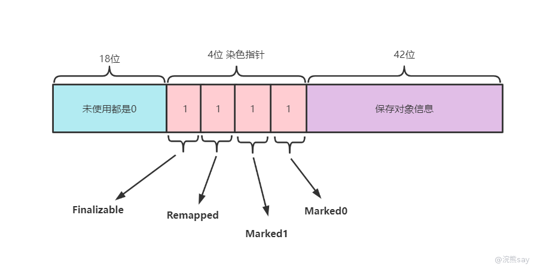

images/Wf11bsg3so3Hw9xNzpvcjWLinVg.png

在染色指针中，高18位都是0暂未使用，剩余的46位实际上是能支持64TB的内存的，但是目前来说计算机内存空间还没这么大。于是剩余的46位中，高4位用来保存了4个标志位，低42位置才是用来保存对象的指针，所以ZGC最大可以管理的内存不超过4TB。染色指针中4个标志位的具体作用如下：

1. **Marked 0和Marked 1标志位：**

- **作用：** 用于表示对象的三色标记状态，通常用于垃圾收集算法中的标记阶段。
- **意义：** 提供了直观的对象垃圾收集状态，通过这两个标志位，JVM可以轻松地追踪对象的标记状态，即未标记、已标记（Marked 0或Marked 1）等。

1. **Remapped标志位：**

- **作用：** 表示对象是否已经进入了重分配集，即是否需要在内存重分配时进行特殊处理。
- **意义：** 对于ZGC垃圾收集算法，该标志位的存在能够提供更高效的内存重分配，避免不必要的复制或移动操作，从而提高垃圾收集的性能。

1. **Finalizable标志位：**

- **作用：** 标识对象是否需要通过finalize方法进行访问，即是否需要执行清理和释放资源的操作。
- **意义：** 允许JVM更灵活地处理对象的生命周期，根据Finalizable标志位的状态来判断是否触发finalize方法，这在一些需要资源释放的情景下尤为重要。 通过这四个标志位，JVM可以直接从对象的指针上获取关键的状态信息，而无需访问对象本身的其他属性，这种直接的标志位设计有助于提高垃圾收集的效率和性能。

###### 虚拟内存映射

但是，上面的染色指针的实现方案中存在着一个问题——如何映射到真实的内存物理地址。因为JVM作为一个普通的进程，这样随意的定义指针中的某几位操作系统是不认可得。实际上Java程序最终都会被转换成机器指令交给具体的平台去执行，CPU可不会认可你Java自己定义的指针结构，只会把整个指针都看作普通的内存地址去映射到物理内存地址。一般的x86-64平台也不支持重新定义机器指令，因此，ZGC就只有采用了虚拟内存映射这个技术来解决这个问题。

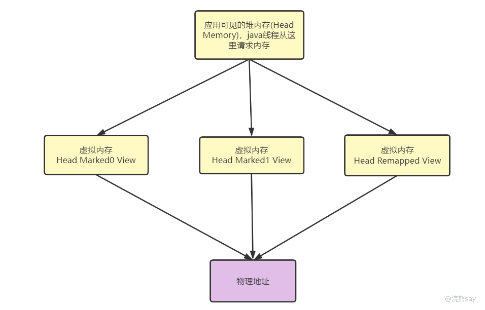

images/MZ0JbWcpZofYxMxh84ncgy5xn3f.png

在x86平台上，CPU使用分页管理机制将**线性地址空间**和**物理地址空间**划分为大小相同的块，即”页”(Page)。通过建立映射表，分页管理机制完成线性地址到物理地址的转换。这保证了程序对虚拟内存的访问可以映射到相应的物理内存地址上。可以简单理解为使用mmap将不同的虚拟内存地址映射到同一个物理内存地址上。

如上图，ZGC采用虚拟内存映射技术，将同一块物理内存映射为Marked 0、Marked 1和Remapped这三个虚拟内存。每个对象在堆上申请虚拟地址时，ZGC为该对象在这三个视图空间分别分配虚拟地址，这三个虚拟地址映射到同一个物理地址。

染色指针中，Marked 0、Marked 1和Remapped作为ZGC的三个视图空间，在同一时间点内只能有一个是有效的。通过切换这三个视图空间，ZGC实现了并发的垃圾回收，对象的标记信息和状态可以在不同的视图之间切换，从而实现垃圾回收的并发性。在后续的ZGC回收流程中我们将详细介绍这三个视图空间的切换流程。

##### 指自愈指针（Self-Healing Pointers）

自愈指针（Self-Healing Pointers）是指一种用于在并发垃圾回收中进行引用修复的技术。这种技术的目的是在对象移动时，通过修改指针本身而不是对象的引用关系，来维护正确的引用关系，从而避免了对引用对象的访问和修改。

在垃圾回收的过程中，如果对象发生移动，原本指向该对象的引用关系就会失效。传统的垃圾回收器需要遍历对象图，修复所有指向移动对象的引用，这会带来一定的性能开销。而自愈指针技术通过直接修改指针来维护引用关系，减少了对对象的访问和修改，提高了并发性能。

在自愈指针技术中，指针的高位（通常是一些特定的位或字节）被用来存储额外的信息，例如对象的新地址、标记信息等。当对象移动时，只需要修改指针的高位信息，而不需要访问对象本身，从而实现引用的自愈。

这种技术通常应用于并发垃圾回收算法中，其中对象的移动是允许的，并发标记和并发移动阶段需要通过自愈指针来保证引用的正确性。ZGC（Z Garbage Collector）就是一种使用了自愈指针技术的垃圾回收器，它通过虚拟内存映射和染色指针来实现并发垃圾回收，减小了对引用修复的停顿时间。

##### 染色指针的优势

1. **即时回收空间：** 当某个Region中的存活对象被成功移走后，该Region就能够立即释放和重用，而无需等待整个堆中所有指向该Region的引用都被修正。这意味着，理论上只要还有一个空闲的Region，ZGC就能完成垃圾收集。相比之下，Shenandoah需要等到更新阶段结束才能释放回收集中的Region，特别是在Region内的对象都存活时，需要1:1的空间才能完成收集。
2. **减少内存屏障使用：** 染色指针可以显著减少在垃圾收集过程中内存屏障的使用数量。ZGC仅使用了读屏障，而不需要其他类型的内存屏障。这有助于提高垃圾收集的效率和性能。
3. **强大的扩展性：** 染色指针具备强大的扩展性，可以作为一种可扩展的存储结构，用于记录与对象标记、重定位过程相关的更多数据。这为将来进一步提高性能提供了可能性，使ZGC能够灵活适应不同的场景和需求。

### ZGC的垃圾回收原理

#### ZGC触发时机

ZGC的触发时机主要取决于堆的占用情况以及对象分配的速率。ZGC是一种响应式的垃圾回收器，会在满足一定触发条件时启动垃圾回收。以下是ZGC触发的主要时机：

1. **堆空间占用达到阈值：** 当堆空间的占用达到一定的阈值时，ZGC可能会被触发。这个阈值可以通过启动JVM时的参数进行配置。一旦堆空间占用超过了指定的阈值，ZGC就有可能被启动。
2. **对象分配速率：** ZGC会监测对象的分配速率。如果对象分配速率较高，导致堆空间迅速被占满，ZGC可能会被启动以回收内存。这种情况下，ZGC可以防止堆空间迅速耗尽，保持应用程序的正常运行。
3. **空闲时间较长：** ZGC具有适应性的特性，会根据应用程序的执行情况和空闲时间来判断是否进行垃圾回收。当应用程序处于空闲状态时，ZGC可能会选择启动垃圾回收，以尽量减小对应用程序的干扰。
4. **手动触发：** 开发人员也可以通过Java Management Extensions（JMX）或其他工具手动触发ZGC的垃圾回收。这在一些特殊场景下可能会被使用，例如在某个业务逻辑执行完成后手动触发垃圾回收以及时释放内存。 ZGC是为了保持低停顿时间而设计的，因此它可能根据应用程序的需求动态调整触发时机，以最大程度地减小停顿时间。在大多数情况下，ZGC的触发时机是由垃圾收集器自动管理的。

#### ZGC垃圾回收整体流程

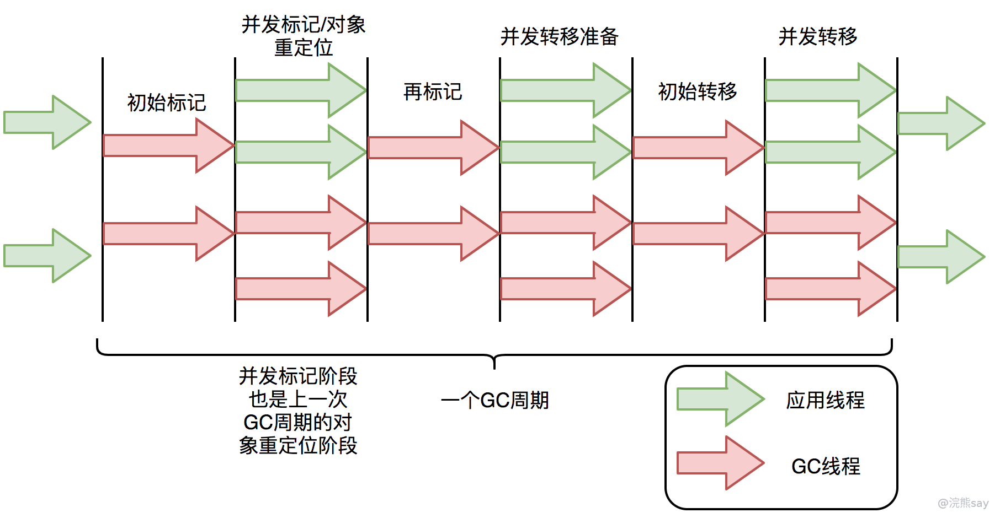

images/YWdRbXPbJoGOALxe22uccHp4nMh.png

ZGC（Garbage Collector）是一种在JVM中实现的低停顿时间垃圾回收器。其垃圾回收流程可以概括为以下几个关键阶段：

1. **初始标记阶段（Initial Mark）：** 与G1垃圾回收器一样，初始标记阶段是一个短暂的STW阶段，目的是标记出根对象直接引用的对象，标记的过程是并发执行的，所以这个阶段的停顿时间很短。
2. **并发标记阶段（Concurrent Mark）：** 在这个阶段，ZGC并发地标记出所有可达的对象，包括从根对象出发的引用链上的对象，这个过程是与应用程序的执行同时进行的，因此对停顿时间的影响很小。
3. **再标记阶段（Remark）：** 如果在并发标记阶段有新的对象被创建或有对象被回收，ZGC可能需要进行一次短暂的STW再标记。这个阶段的停顿时间一般不超过1毫秒。在这个阶段，ZGC会修正并发标记阶段可能由于并发引起的标记不一致。
4. **并发转移准备（Concurrent Prepare for Relocate）：** 在这个阶段ZGC进行整堆扫描，确定收集哪些Region，并将这些Region组成重分配集（Relocation Set）。与G1收集器不同，ZGC的重分配集扫描所有的Region，而不是计算最有价值回收的Region，由于染色指针的存在，扫描过程会很快。这个过程并不是为了计算最优的回收集，而是为了确定存活对象将被复制到其他Region。此阶段还涉及到JDK12支持的类卸载和弱引用的处理。
5. **初始转移阶段（Initial Relocation）：** 这是ZGC垃圾回收的核心阶段之一，ZGC并发地将重分配集中的存活对象复制到新的Region。为了记录从旧对象到新对象的转移关系，ZGC需要为重分配集中的每个Region维护一个转发表（Forward Table）。
6. ZGC收集器能仅从引用上就明确得知一个对象是否处于重分配集之中，如果用户线程此时并发访问了位于重分配集中的对象，这次访问将会被预置的内存屏障所截获，然后立即根据Region上的转发表记录将访问转发到新复制的对象上，并同时修正更新该引用的值，使其直接指向新对象，ZGC将这种行为称为指针的“自愈”（Self-Healing）能力
7. ZGC的染色指针因为“自愈”（Self-Healing）能力，所以只有第一次访问旧对象会变慢，而Shenandoah的Brooks转发指针是每次都会变慢。 一旦重分配集中某个Region的存活对象都复制完毕后，这个Region就可以立即释放用于新对象的分配，但是转发表还得留着不能释放掉，因为可能还有访问在使用这个转发表。
8. **并发转移阶段（Concurrent Relocation）：** 并发转移阶段的工作就是修正堆中指向重分配集中旧对象的所有引用，也可以直接认为就是真正进行对象引用修复的一个步骤，从这一点来看shenandoah的并发引用更新阶段是一样的。但是ZGC并不需要马上完成这个操作（因为有指针自愈的特性），ZGC把并发重映射阶段要做的工作巧妙的合并到**下一次垃圾收集循环**中的并发标记阶段中去完成，这样做的好处是节省遍历对象图的开销。一旦所有指针修复，新旧对象的引用关系**转发表**就可以释放了。 以上阶段中，除了初始标记、再标记阶段和初始转移阶段有短暂的STW时间外，其他阶段都是并发执行的，尽量减小了垃圾回收对应用程序的干扰，从而实现低停顿时间。这种并发执行的特性使得ZGC适用于大内存堆的Java应用，尤其是需要低延迟的场景。

##### ZGC垃圾回收并发处理的视图切换

单纯从ZGC的整体流程上看，似乎很难看出染色指针在ZGC的垃圾回收流程的作用，实际上ZGC在垃圾标记的过程中会改变染色指针的颜色位，将内存区域切换成ReMapped、M0 或者 M1状态，方便快速判断对象的存活状态。同时，由于扫描指针比较清亮，ZGC每次执行都是进行全堆扫描的。具体视图切换的地方如下图所示：

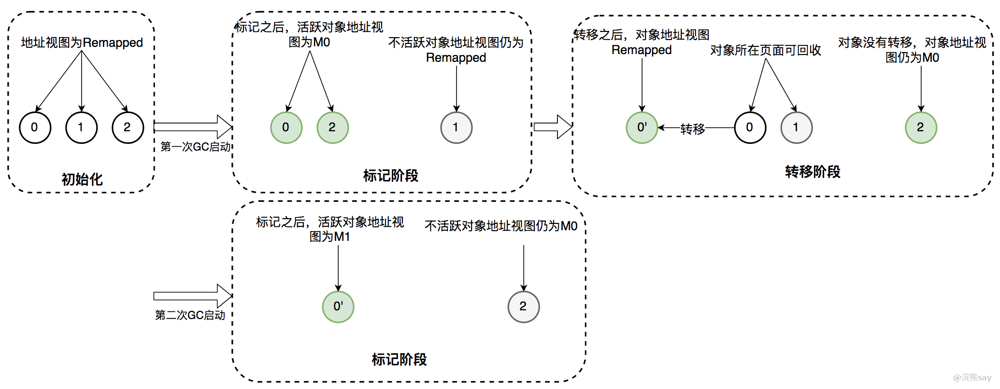

images/OSutbuLAGoEm6YxiUsgcjB6Gn2g.png

如上图所示，ZGC的垃圾回收周期中涉及的地址视图切换过程可以分为以下几个阶段：

1. **初始化阶段：** 初始时，整个内存空间的地址视图被设置为Remapped，意思是该内存的Region处于重置集当中，无需进行转移或者垃圾清理。程序正常运行和分配对象，并在一定条件下触发垃圾回收。
2. **并发标记阶段：** 第一次进入标记阶段时，视图为M0。如果对象被GC标记线程或应用线程访问过，将对象的地址视图从Remapped调整为M0。标记阶段结束后，对象的地址要么是M0视图，说明对象是活跃的；要么是Remapped视图，说明对象是不活跃的。
3. **并发转移阶段：** 标记结束后，进入转移阶段，此时地址视图再次被设置为Remapped。如果对象被GC转移线程应用线程访问过，将对象的地址视图从M0调整为Remapped。
4. **第二次并发标记阶段：** 在第二次进入并发标记阶段时，地址视图调整为M1，而非M0。这样设计是为了区别前一次标记和当前标记，确保在不同的标记阶段使用不同的地址视图。 在并发标记阶段，采用**着色指针**和**读屏障技术**。将对象设置为已标记时，只需设置指针地址的第42~45位，不需要进行一次内存访问，且速度比访问内存更快。这种技术使得传统的将对象存活信息放在对象头中的方式变得不再必要，从而提高了标记的效率。

通过这样的设计，ZGC实现了并发的垃圾回收，减少了停顿时间，并通过多次标记阶段和地址视图的切换，有效地管理对象的存活状态。

#### ZGC的优缺点
