# 四、Java对象加载流程

## 一、Java类的生命周期（类加载机制、双亲委派机制）

### 什么是Java类的生命周期？

Java类和世间万物一样有着自己的一生，从类加载时的潮气蓬勃，到类卸载时的落叶归根，而Java类的一生的作用在于如何在内存中被JVM所使用。

Java类的一生可以说是磁盘->内存->磁盘的一个轮回，简单来说就是加载-使用-卸载的一个轮回。

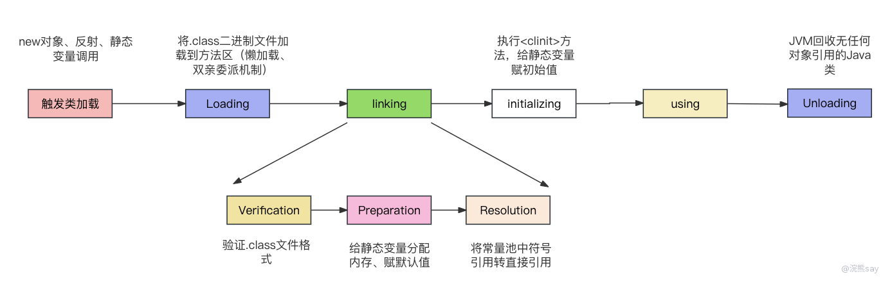

images/USn5bVlzWo0prtxyee6ciYJHnpd.png

Java类的生命开始就是从磁盘被加载到内存中的那一刻开始，就如同婴儿的新生一般。而加载过程之后的验证、准备、解析和初始化就像是一个婴儿的成长过程，需要逐渐被塑造完整。

Java类的使用阶段，仿佛是一个人的壮年，为Java系统提供着它的作为，成员变量可以被访问，成员方法可以被使用，是Java类最为发光发热的生命阶段，但同时也是最少笔墨可以说的阶段。

Java类的卸载则如同人的落叶归根，从磁盘中来到磁盘中去，仿佛它从来没有出现在内存中过。

所以，如上图所示，Java类的生命周期简单来说主要包括以下几个阶段：

1. **加载（Loading）：** 加载是指将类的字节码文件从文件系统、网络等位置读取到JVM的内存中。在加载阶段，JVM会根据类的全限定名查找并读取对应的字节码文件。加载的来源可以是本地文件系统、远程服务器或其他资源。
2. **连接（Linking）：** 连接阶段包括三个子阶段：验证、准备和解析。

- **验证（Verification）：** 确保类的字节码符合Java虚拟机规范，防止恶意代码的执行。JVM会对字节码进行各种静态检查，包括语法验证、字节码验证、符号引用验证等，以确保字节码的结构和内容是正确的和安全的。最简单的例子是，JVM会首先验证字节码文件的开头是否有0xCAFFEBABE
- **准备（Preparation）：** 准备阶段是为类的静态变量（static变量）分配内存空间并设置默认初始值的过程。在准备阶段，JVM会为类的静态变量分配内存，并设置默认的初始值，例如数值类型的变量初始化为0，对象类型的变量初始化为null。

1. **解析（Resolution）：** 将类、接口、字段和方法的符号引用解析为直接引用。在解析阶段，JVM会将类的符号引用（例如方法调用、字段访问）转换为直接引用，即具体的内存地址，以便后续的执行过程中能够直接定位到对应的方法或字段。
2. **初始化（Initialization）**： 初始化是执行类的初始化代码的过程。在初始化阶段，JVM会执行类的静态代码块和静态变量的赋值操作，以完成类的初始化工作。类的初始化是在首次使用类时触发的，包括创建对象实例、调用静态方法等。
3. **使用（Usage）：** 在类加载完成并经过初始化后，类可以被实例化、调用静态方法、访问静态字段等。在这个阶段，程序可以通过创建对象、调用方法等方式使用类的功能。
4. **卸载（Unloading）：** 卸载阶段是指当一个类不再被引用，且没有任何活跃的实例时，类加载器可能会将这个类从内存中卸载。Java虚拟机规范并没有明确要求虚拟机必须在何时卸载类，因此类的卸载通常由具体的虚拟机实现来决定。

### Java类何时加载类到内存？

在谈论类的生命周期之前，我们需要先了解什么时候才会触发类的加载流程，换句话说，什么时候会开启类的生命周期。实际上，在Java中普通的类和数组类的加载方式会有所不同，如下：

- **普通的类：** 即非数组类，通过类加载器加载对应的.class文件（二进制文件）。这包括了加载、验证、准备、解析和初始化等步骤。这些类文件通常是由编译器从源代码生成的，并且它们包含了类的结构信息、方法代码等。
- **数组类：** 与普通类不同，数组类的加载不是通过类加载器加载外部的.class文件。Java虚拟机会在运行时动态创建数组类，而不是依赖于事先准备好的类文件。数组类是在虚拟机内部生成的，用于表示数组类型。 这里我们说类的加载时机主要是说触发JVM通过类加载器读取对应.class的二进制文件的过程，数组类由于依赖JVM内部生成，因此不再讨论范围之内。对于普通类来说5种类的加载的时机如下：

1. **遇到特定字节码指令：** 当虚拟机在执行字节码时遇到new、getstatic、putstatic或invokestatic这四条指令时，如果类还没有初始化，则会触发其初始化。以下是示例代码：

public class BytecodeInstructionExample { 
public static void main(String\[\] args) { 
// 使用new关键字实例化对象 
MyClass obj = new MyClass(); 
// 读取或设置静态字段 
int value = MyClass.staticField; 
// 调用静态方法 
MyClass.staticMethod(); 
} 
} 
class MyClass { 
static { 
System.out.println("MyClass is initialized"); 
} 
public static int staticField = 42; 
public static void staticMethod() { 
System.out.println("Static method called"); 
} 
}

1. **使用反射调用：** 使用java.lang.reflect包的方法对类进行反射调用时，如果类没有进行过初始化，需要先触发其初始化。以下是示例代码：

import java.lang.reflect.Method; 
public class ReflectionExample { 
public static void main(String\[\] args) throws Exception { 
Class<> clazz = Class.forName("MyClass"); 
// 使用反射调用静态方法 
Method method = clazz.getMethod("staticMethod"); 
method.invoke(null); 
} 
} 
class MyClass { 
static { 
System.out.println("MyClass is initialized"); 
} 
public static void staticMethod() { 
System.out.println("Static method called"); 
} 
}

1. **父类初始化：** 在初始化一个类时，如果其父类还没有进行过初始化，会先触发其父类的初始化。以下是示例代码：

public class SuperClassInitializationExample { 
public static void main(String\[\] args) { 
// 初始化子类，触发父类初始化 
SubClass sub = new SubClass(); 
} 
} 
class SuperClass { 
static { 
System.out.println("SuperClass is initialized"); 
} 
} 
class SubClass extends SuperClass { 
static { 
System.out.println("SubClass is initialized"); 
} 
}

1. **虚拟机启动时指定的主类：** 当虚拟机启动时，用户指定的主类（包含main()方法的类）会先进行初始化。以下是示例代码：

public class MainClassInitializationExample { 
public static void main(String\[\] args) { 
// 主类的初始化 
System.out.println("MainClass is initialized"); 
} 
}

1. **动态语言支持：** 当使用JDK1.7的动态语言支持时，如果java.lang.invoke.MethodHandle实例最后的解析结果是REF\_getStatic、REF\_putStatic、REF\_invokeStatic的方法句柄，并且这个方法句柄所对应的类没有进行过初始化，需要先触发其初始化。以下是示例代码：

import java.lang.invoke.MethodHandle; 
import java.lang.invoke.MethodHandles; 
import java.lang.invoke.MethodType; 
public class DynamicLanguageSupportExample { 
public static void main(String\[\] args) throws Throwable { 
// 使用动态语言支持 
MethodHandles.Lookup lookup = MethodHandles.lookup(); 
MethodHandle mh = lookup.findStatic(MyClass.class, "staticMethod", 
MethodType.methodType(void.class)); 
mh.invokeExact(); 
} 
} 
class MyClass { 
static { 
System.out.println("MyClass is initialized"); 
} 
public static void staticMethod() { 
System.out.println("Static method called"); 
} 
}

这些示例展示了每种场景下对类的主动引用，触发了类的初始化。这符合Java虚拟机规范中关于类初始化的严格规定。

### Loading（加载）与Java类加载器——Java类如婴儿般呱呱坠地

我们知道Java的源文件一般是以xxx.java文件存储在磁盘上的，而Java虚拟机是无法识别这种类型的文件的，所以Java的源文件一般会被[编译成xxx.class文件](https://mp.weixin.qq.com/s?__biz=MzkzMjI0MDY3Mw==&mid=2247484211&idx=1&sn=ab014d1d3df5cb478a12d54cce6fd488&chksm=c25f8f7df528066b0d75f670f6668d3cef5d0eb0a2d24935ac48fd5061694a715d4ead18d701#rd)，即字节码文件被存储在磁盘上。

而JVM在使用类的时候，不可能每次都去磁盘上读取字节码文件，这样整体的IO时间会很长，严重影响系统效率。所以，Java字节码文件在被使用之前，一般需要先加载到内存当中的[方法区](https://mp.weixin.qq.com/s?__biz=MzkzMjI0MDY3Mw==&mid=2247484221&idx=1&sn=0eb0de6dff95f67d2e87eb4916652bb9&chksm=c25f8f73f5280665dbe32e4942f6e5c487ff6360c78751c7741a4896ad88d77b52894c1ef372#rd)里面。

因此，类加载是指将类的字节码文件从文件系统、网络等位置读取到JVM的内存的方法区中去的过程。在加载阶段，JVM会根据类的全限定名查找并读取对应的字节码文件，在进行读取和写入到内存。

JVM的类加载过程是按需进行的，即在需要使用某个类时才会进行加载和初始化。JVM会维护一个类加载器（ClassLoader）层次结构来管理类的加载，并采用双亲委派模型来保证类的安全性和一致性。通过类加载机制，JVM能够实现类的动态加载、隔离和共享等特性，为Java程序提供了灵活性和可扩展性。

#### Java 类加载器——接生婆？

在医疗情况不发达的情况下，经常有婴儿在出生的时候就发生夭折，永远没办法见到这个世界。

Java类虽然一般不会夭折，但是也需要接生婆帮助它从磁盘加载到内存当中，这些个接生婆们就叫做——类加载器。

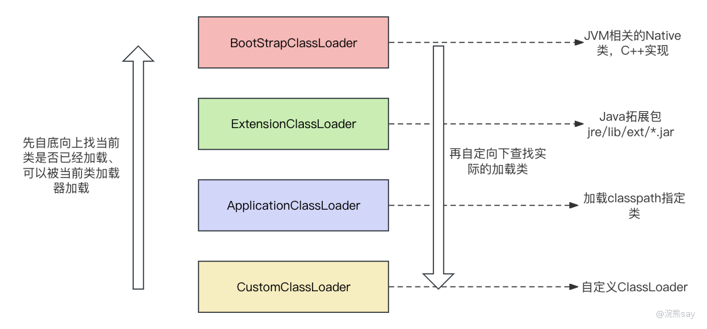

images/NBG5bgljvovac7xXhJ4cjUVan67.png

JVM的类加载器（Class Loader）是负责将类字节码加载到JVM中并生成对应的类对象的组件。类加载器是JVM的重要组成部分，它负责加载Java类和资源文件，使得Java程序能够运行。

Java的接生机制比较复杂，不是单个的接生婆接生所有的类，而是根据不同的片区匹配不同的接生婆来进行加载。JVM中存在四种类加载器如下：

1. **启动类加载器（Bootstrap Class Loader）——顶级接生婆：** 它是JVM的内置类加载器，负责加载JVM自身需要的类库，如java.lang包下的类，包括java.lang.String、java.lang.Object等，使用C++实现。
2. **扩展类加载器（Extension Class Loader）——军区大院接生婆：** 它是由启动类加载器派生出来的，只负责加载数个JavaJava的扩展库（Java Extension）库的包，如：jre/lib/ext/\*.jar或由-Djava.ext.dirs指定。所以说，扩展类加载器就像是军区大院的接生婆，只服务那么一小部分扩展对象。
3. **应用程序类加载器（Application Class Loader）——公立医院接生婆：** 它是由扩展类加载器派生出来的，也称为系统类加载器。一般的类都是通过系统类加载器进行加载的，负责加载应用程序中的类和资源，加载classpath指定的内容。所以就像是公立医生一样，普通类都是从这里加载。
4. **自定义类加载器（Custom ClassLoader）——私人定制接生婆：** 通过自定义类加载器，开发人员可以实现一些特殊的加载需求，例如从非标准的数据源加载类、实现类加载的加密解密等功能。自定义类加载器需要继承ClassLoader类，并重写其中的findClass()方法来实现类加载的逻辑。 类加载器采用双亲委派模型，即当一个类加载器需要加载类时，它会先将这个任务委派给父类加载器，如果父类加载器无法加载，则由子类加载器来尝试加载。需要注意的是，这里说所说的父子关系并不是真正意义上的继承关系，而是一种上下级的关系，会首先让更高级别的类加载器进行类的加载。

##### 类加载器的双亲委派机制（Parent Delegation Model）

JVM类加载器采用了双亲委派机制（Parent Delegation Model），它是一种层次化的类加载器组织结构。

在双亲委派机制中，每个类加载器都有一个父类加载器（除了启动类加载器没有父加载器），当一个类加载器接收到加载类的请求时，它首先将该请求委派给父类加载器去尝试加载。只有当父类加载器无法加载该类时，才由当前类加载器自己去加载。

这种委派机制有助于保证类加载的一致性和安全性，它的核心思想是：优先使用父类加载器来加载类，只有当父类加载器无法加载时才由子类加载器来尝试加载。这样可以避免重复加载已经存在的类，并防止恶意代码替换核心类库。双亲委派机制的好处包括：

1. 避免类的重复加载：通过委派给父类加载器，可以确保一个类只被加载一次，避免了类的重复加载，提高了类加载的效率。
2. 确保类的安全性：通过委派给父类加载器，可以确保核心类库的安全性，防止恶意代码替换核心类。
3. 实现类加载的隔离性：每个类加载器都有自己的命名空间，加载的类只能访问自己命名空间内的类，提供了类加载的隔离性。 当一个类加载器接收到加载类的请求时，它会按照以下顺序进行向上委派：
4. 检查该类是否已经被加载过，如果已经加载则直接返回。
5. 将加载请求委派给父类加载器，让父类加载器尝试加载。
6. 如果父类加载器无法加载，则自己尝试加载类。
7. 如果自己无法加载，将加载请求再次委派给父类加载器的父类加载器，依次向上委派，直到达到顶层的启动类加载器。
8. 如果所有父类加载器都无法加载，则抛出ClassNotFoundException异常。 通过双亲委派机制，JVM可以确保类的一致性和安全性，并提供了灵活的类加载器体系，允许开发人员根据需要自定义类加载器。

##### 双亲委派机制核心代码

- JDK 8:

protected Class<> loadClass(String name, boolean resolve) throws ClassNotFoundException { 
synchronized(this.getClassLoadingLock(name)) { //加锁 
Class<> c = this.findLoadedClass(name); //查找类是否已经被加载 
if (c == null) { //未被加载 
long t0 = System.nanoTime(); 
try { 
if (this.parent != null) { //调用父亲加载器的loadClass 
c = this.parent.loadClass(name, false); 
} else {//调用bootStrap类加载器，或者抛出ClassNotFound异常 
c = findBootstrapClassOrNull(name); 
} 
} catch (ClassNotFoundException var10) { 
} 
if (c == null) { //未成功加载 
long t1 = System.nanoTime(); 
c = this.findClass(name); //调用自定义的类加载器 
PerfCounter.getParentDelegationTime().addTime(t1 - t0); 
PerfCounter.getFindClassTime().addElapsedTimeFrom(t1); 
PerfCounter.getFindClasses().increment(); 
} 
} 
if (resolve) { 
this.resolveClass(c); 
} 
return c; 
} 
}

- JDK 21: 毕竟2024年了，让不能老是JDK8，让我们来瞅瞅JDK 21的源码和JDK 8 有啥区别。

protected Class loadClass(String name, boolean resolve) 
throws ClassNotFoundException 
{ 
synchronized (getClassLoadingLock(name)) { 
// First, check if the class has already been loaded 
Class c = findLoadedClass(name); 
if (c == null) { 
long t0 = System.nanoTime(); 
try { 
if (parent != null) { 
c = parent.loadClass(name, false); 
} else { 
c = findBootstrapClassOrNull(name); 
} 
} catch (ClassNotFoundException e) { 
// ClassNotFoundException thrown if class not found 
// from the non-null parent class loader 
} 
if (c == null) { 
// If still not found, then invoke findClass in order 
// to find the class. 
long t1 = System.nanoTime(); 
c = findClass(name); 
// this is the defining class loader; record the stats 
PerfCounter.getParentDelegationTime().addTime(t1 - t0); 
PerfCounter.getFindClassTime().addElapsedTimeFrom(t1); 
PerfCounter.getFindClasses().increment(); 
} 
} 
if (resolve) { 
resolveClass(c); 
} 
return c; 
} 
}

如上代码所示，JDK 21的类加载部分的源码和JDK 8的源码没有任何区别。所以说，实际上JVM的很多核心代码是不会变动的。上述代码片段是JDK 8和JDK 21中的Java类加载器中的loadClass方法实现，整体流程如下：

1. **加锁：** 使用synchronized关键字，通过getClassLoadingLock(name)获取与类名相关的锁对象，确保在多线程环境中对类加载的同步操作。
2. **查找已加载类：** 使用findLoadedClass(name)尝试查找已加载的类，如果已加载则直接返回。
3. **尝试父类加载器加载：** 如果类未加载，尝试使用父类加载器加载。如果存在父类加载器，则调用其loadClass方法加载类；如果不存在，则尝试使用Bootstrap类加载器加载。
4. **调用自定义类加载器加载：** 如果父类加载器未成功加载类，调用自定义类加载器的findClass方法加载类。
5. **性能统计：** 记录加载过程中的时间和计数，包括父类委托加载所花费的时间、调用findClass方法所花费的时间，以及找到类的计数。 整体而言，该代码片段实现了类加载器的基本流程，包括父类委托加载、自身加载、性能统计等步骤，确保类的加载在多线程环境中的同步，并提供了一些性能统计信息。

##### 自定义类加载器代码

public class MyClassLoader extends ClassLoader{ 
@Override 
protected Class findClass(String name) throws ClassNotFoundException { 
File f = new File("./test/",name.replaceAll(".","/").concat(".class")); 
try{ 
FileInputStream fis = new FileInputStream(f); 
ByteArrayOutputStream baos = new ByteArrayOutputStream(); 
int b = 0; 
while((b=fis.read())!=0){ 
baos.write(b); 
} 
byte\[\] bytes = baos.toByteArray(); 
baos.close(); 
fis.close(); 
return defineClass(name,bytes,0,bytes.length); //将二进制流转换成Class类对象 
}catch (Exception e){ 
e.printStackTrace(); 
} 
return super.findClass(name); 
} 
 
public static void main(String\[\] args) { 
ClassLoader loader = new T006\_MSBClassLoader(); 
Class clazz = loader.loadClass("com.example.jvm.hello"); 
Hello h = (Hello) clazz.newInstance(); 
} 
}

自定义类加载器只需要继承ClassLoader，同时重写findClass方法。当Java类重写了findClass方法之后，类的加载就会使用自定义的类加载方法进行加载。

### Linking（链接）——Java类的成长经历

#### Verification（验证）

JVM（Java虚拟机）的类加载过程中，verification（验证）是其中的一个重要步骤。验证的目的是确保加载的字节码是符合Java虚拟机规范的，以保证安全性和稳定性。验证阶段通常包括以下几个方面的检查：

1. 文件格式验证（File Format Verification）：验证字节码文件的结构是否符合Class文件格式规范，包括魔数、版本号、常量池、字段和方法表等是否正确。
2. 元数据验证（Metadata Verification）：对字节码中的符号引用进行验证，检查其引用的类、字段和方法是否存在、可访问等。
3. 字节码验证（Bytecode Verification）：对字节码进行数据流和控制流分析，检查是否存在类型安全等问题，以防止潜在的类型错误。
4. 符号引用验证（Symbolic Reference Verification）：检查符号引用的类和成员是否能够正确访问，包括权限校验、继承关系校验等。 通过这些验证步骤，JVM可以确保在加载类的过程中不会出现潜在的安全问题和错误。如果在验证过程中发现了任何不符合规范的情况，JVM会抛出相应的异常，阻止类的加载和初始化。简单来说就是验证文件是否符合JVM规定。

#### Preparation（准备）

准备阶段的主要任务是为类的静态变量分配内存，并设置默认的初始值。需要强调的是这里是设置的初始值，所谓初始值就是比如说对于int类型的会设置为0，对于String类型的会设置为null，这个过程不会执行Java方法的构造方法。

所以，实际上在准备阶段JVM主要完成两件事：为静态变量分配内存和为静态变量设置初始化值，如下：

1. **内存分配：** 为类的静态变量在方法区（或称为静态存储区）中分配内存空间。这些静态变量包括类级别的基本数据类型、引用类型和类变量（static变量），而不包括实例变量。
2. **初始值设置：** 对于基本数据类型，JVM会将其设置为默认值，例如数值类型为0，布尔类型为false。对于引用类型和类变量，则会将其设置为null。 下面是一些数据类型的默认初始值：

在准备阶段的操作是在类加载的准备阶段进行的，并且在类初始化阶段之前。准备阶段主要是为了确保在类初始化时，静态变量已经分配了内存，并且具有初始值，以防止使用这些静态变量时出现未初始化的错误。

#### Resolution（解析）

我们知道，在Java的字节码文件当中有着[常量池](https://mp.weixin.qq.com/s?__biz=MzkzMjI0MDY3Mw==&mid=2247484211&idx=1&sn=ab014d1d3df5cb478a12d54cce6fd488&chksm=c25f8f7df528066b0d75f670f6668d3cef5d0eb0a2d24935ac48fd5061694a715d4ead18d701#rd)，常量池中存放的主要是变量、方法的一些符号引用，这些引用可以帮助Java类在运行过程中快速的获取类相关的熟悉。

然而，符号引用是无法直接访问到内存当中的数据的，解析阶段的主要任务是将这些符号引用转换为直接引用，以便能够正确地定位和访问类、字段和方法。在解析阶段，JVM会执行以下操作：

1. **类和接口解析：** 对于类和接口的解析，JVM会根据符号引用中的全限定名，定位并加载对应的类或接口。
2. **字段解析：** 对于字段的解析，JVM会根据类的全限定名和字段的名称，定位并获取对应的字段，包括静态字段和实例字段。
3. **方法解析：** 对于方法的解析，JVM会根据类的全限定名和方法的名称以及方法参数的类型签名，定位并获取对应的方法，包括静态方法和实例方法。 解析阶段的主要目的是将符号引用转换为对应的直接引用，使得在类加载后的运行过程中，能够准确地访问和调用类、字段和方法。解析阶段是在链接过程中的一个重要环节，确保程序能够正确地找到需要使用的类和成员。

解析阶段的具体实现可能因JVM的不同而有所差异。某些JVM实现可能将解析的操作延迟到运行时进行，而不是在类加载过程中完成。这被称为动态解析，它允许在运行时根据实际情况进行解析，以提供更大的灵活性和优化的机会。

### Initialization（初始化）

在JVM（Java虚拟机）的类加载过程中，initialization（初始化）是其中的最后一个重要步骤。初始化阶段的主要任务是执行类的静态初始化器（ 方法）和静态变量的显式赋值操作，以完成类的初始化工作。

需要特别强调的是初始化阶段依旧是对类的初始化，而不是对对象的初始化，所以这个过程中执行的依旧是对类的静态变量的初始化而不是执行的构造函数。在初始化阶段，JVM会执行以下操作：

1. **执行静态初始化器（****方法）：** 如果类中定义了静态初始化器，JVM会在初始化阶段执行该静态初始化器。静态初始化器用于执行一些静态代码块中的初始化操作，例如静态变量的赋值、静态方法的调用等，静态初始化器在类加载过程中只会执行一次。
2. **静态变量显式赋值：** JVM会执行类中静态变量的显式赋值操作。这些赋值操作可以是直接的常量赋值，也可以是通过静态块或静态方法进行赋值。静态变量的显式赋值会在静态初始化器之前执行。 初始化阶段是在类加载的过程中，只有当类被首次主动使用时才会触发（懒加载）。主动使用的情况包括实例化对象、调用静态方法、访问静态变量（除了编译器常量）、使用反射访问等。如果一个类在加载过程中未被主动使用，那么其初始化阶段会被推迟。下面通过Java代码举例说明：

public class InitializationExample { 
static { 
System.out.println("Static initializer block is executed"); 
} 
// 静态变量的显式赋值 
static int staticVariable = initializeStaticVariable(); 
public static int initializeStaticVariable() { 
System.out.println("Initializing static variable"); 
return 42; 
} 
public static void main(String\[\] args) { 
// 主动使用类，触发初始化阶段 
System.out.println("Main method is executed"); 
} 
}

在上面的例子中，InitializationExample 类包含了静态初始化器块和一个静态变量 staticVariable，以及一个用于初始化静态变量的方法 initializeStaticVariable。当主动使用类时（如执行 main 方法），JVM会按照初始化阶段的顺序执行静态初始化器和静态变量的赋值操作。

### Using（使用）和Unloading（卸载）——Java类的落叶归根

当类加载的流程完成之后，Java的类已经是一个成熟和完整的类被存储在内存中的方法区里面，此时有任何方法需要调用到这个类都可以去方法区当中访问。

Using（使用）阶段：

1. **主动使用：** 在Java中，主动使用类的情况包括实例化对象、调用类的静态方法、访问类或接口的静态字段、使用反射等。这些操作会导致类的加载、连接和初始化，并将类置于可使用状态。
2. **实例化对象：** 当通过关键字 new 创建类的实例时，会触发该类的初始化阶段，并完成对象的实例化过程。
3. **静态方法调用：** 当调用类的静态方法时，也会触发类的初始化，确保静态方法在使用前得到正确的初始化。
4. **静态字段访问：** 访问类的静态字段同样会触发初始化过程，以保证静态字段的正确初始化值。 Unloading（卸载）阶段：

Java虚拟机具有自动内存管理和垃圾回收机制。在这个机制下，当一个类不再被引用，且没有任何实例存在时，虚拟机可能会考虑卸载这个类，释放相关的内存资源。类的卸载是虚拟机的垃圾回收的一部分。

卸载阶段并非程序员直接操作的阶段，而是由虚拟机的垃圾回收器负责。当一个类被卸载时，其静态变量、静态方法等相关信息会被卸载，释放内存空间，从而完成类的生命周期。

需要注意的是，类的卸载是相对较少发生的，通常只有在特定条件下才会触发。例如，当类加载器不再引用某个类时，且该类没有被其他地方引用，垃圾回收器可能会考虑卸载这个类。

### 总结

本文主要介绍了Java类的生命周期，即Java类的.class二进制文件从加载到内存到从内存中被卸载的整个过程构成了Java类的生命周期。

Java的生命周期主要包括加载、验证、准备、解析、初始化、使用和卸载等6个阶段。其中加载阶段是将Java的二进制文件加载到内存的方法区当中，需要关注的是Java的双亲委派机制的使用。

了解Java类的生命周期可以帮助我们理解Java的.class文件在内存中的运作模式，帮助理解Java和JVM的其它的功能，是非常重要的一部分知识点。

## 二、Java对象内存布局？

### 薯片与Java对象

images/ASUMbj4BuoM8HxxatNIcMvmxnpg.png

如果把堆想象成超市，对象想像成超市里面的一袋袋薯片、商品，每个袋除了条码之外还有商品简介，商品简介里面写明了这包薯片的成分、配料和生产信息之类的东西。

Java对象其实也像商品一样被分门别类的放在堆这个超市里面，就以大家最熟悉的薯片来举例。

- **商品包装 VS 对象头：** 每个薯片都有一个精致的包装，上面有图片、商品简介、商品二维码、营养成分含量等，这个商品的包装就对应了Java中的对象头。通过商品包装顾客可以快速了解商品，而通过对象头JVM也可以快速了解对象的一些信息。
- **商品简介 VS MarkWord：** 每袋薯片都有一个商品简介，上面写了商品的成分、厂家信息、卫生许可之类的东西，可以帮我们快速了解薯片的信息。对于Java对象来说也需要一个商品简介来标记这个对象的一些GC信息、锁信息等，方便JVM在使用这个对象的时候获取一些基本信息，这个商品简介或者说标签就是——MarkWord。
- **商品二维码 VS Class Pointer：** 每袋薯片都有商品二维码以方便快速找到这袋薯片和结账，Java类也有一个商品二维码 —— Class Pointer。 这个Class指针指向的是JVM中方法区当中的类的字节码文件，可以快速的通过对象去访问对应类的字段、方法、接口等等。
- **实例数据 VS 薯片：** 薯片是包装里面真正可以吃的东西，而Java类的实例数据也是Java对象真正需要被使用到的东西，包括成员变量、成员方法引用等等。
- **填充字节 VS 氮气：** 为了让薯片保质，也为了让薯片一袋袋的更好看一点儿，薯片里面被充满了氮气。Java类也一样，由于例如对于64位操作系统来说，8Bytes的长度更有利于操作系统处理，因此不足8Bytes的对象会被填充满8Bytes的整数倍。

#### Java对象构成

总的来说，与超市货架上摆放的薯片类似，Java 对象内存布局指的是一个对象在内存中的分配方式和结构。每个 Java 对象都占用一定的内存空间，并且在内存中的布局是由对象头、实例数据以及填充字节（Padding）等组成的。以下是 Java 对象内存布局的主要组成部分：

1. **对象头（Object Header）：** 对象头存储了与对象相关的元数据信息，包括 MarkWord、Class Pointer 等。MarkWord 通常包含对象的锁状态、垃圾回收信息等。Class Pointer 指向对象的类元数据，用于确定对象的类型信息。
2. **实例数据（Instance Data）：** 实例数据是对象中存储的实际数据，即对象的字段值。这部分数据的大小和类型由对象的类定义决定。
3. **填充字节（Padding）：** 由于硬件对齐的要求，对象在内存中可能需要进行填充，以保证对象的起始地址是对齐的。填充字节的大小取决于硬件架构和虚拟机的具体实现。 对象内存布局的示意图如下：

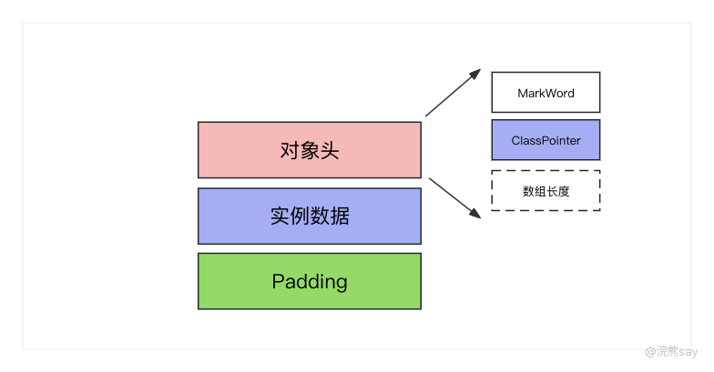

images/PvpNbmlHUobgJwxwsFkcpPyInFd.png

具体的内存布局可能因为 JVM 实现、垃圾回收策略、对象的大小等因素而有所不同。例如，对象头的大小、对齐规则以及额外的信息（比如数组长度、引用指针等）都可能影响对象的内存布局。理解对象内存布局对于进行性能调优、内存优化以及对 Java 虚拟机的工作原理有重要的帮助。

#### 工欲善其事，必先利其器——JOL工具

Java Object Layout (JOL) 是一个开源的 Java 库，用于深入了解 Java 对象的布局和内存消耗。该工具提供了一种在运行时分析 Java 对象布局的方式，包括对象头、实例数据、对齐等信息。JOL 通常用于性能优化、调试和了解 Java 对象内部结构。下面是 JOL 的一些主要用途和功能：

1. **对象布局分析：** JOL 允许您查看 Java 对象在内存中的布局，包括对象头、实例数据、填充字节等。这对于了解对象的内存占用和对齐方式很有帮助。
2. **性能优化：** 通过使用 JOL，您可以深入了解对象在内存中的排列方式，从而有助于优化对象的布局，减少内存占用，提高访问效率。
3. **调试和分析：** JOL 提供了一种方法来检查对象的内部结构，这对于调试和分析代码中的对象问题非常有用。

#### JOL依赖和使用

JOL作为一个扩展jar包，要在Java项目中使用 JOL 工具，只需要执行以下步骤：

##### **step 1: 添加 JOL 依赖**

首先，在您的项目中添加 JOL 依赖，可以使用 Maven 或 Gradle 来管理依赖关系。以下是 Maven 示例：

 
org.openjdk.jol 
jol-core 
0.16 

##### step 2: Java代码中使用 JOL

接下来，在 Java 代码中使用 JOL 进行对象布局分析。以下是一个简单的示例：

import org.openjdk.jol.info.ClassLayout; 
public class JOLExample { 
public static void main(String\[\] args) { 
// 创建一个示例对象 
MyClass myObject = new MyClass(); 
// 使用 JOL 获取对象布局信息并打印 
String layout = ClassLayout.parseInstance(myObject).toPrintable(); 
System.out.println(layout); 
} 
// 示例类 
static class MyClass { 
int x; 
long y; 
} 
}

##### step 3: 运行测试

上述代码的运行结果如下：

com.tsinghualei.memstructure.JOLExample$MyClass object internals: 
OFF SZ TYPE DESCRIPTION VALUE 
0 8 (object header: mark) 0x0000000000000001 (non-biasable; age: 0) 
8 4 (object header: class) 0x01003200 
12 4 int MyClass.x 0 
16 8 long MyClass.y 0 
Instance size: 24 bytes 
Space losses: 0 bytes internal + 0 bytes external = 0 bytes total

这段日志是通过 JOL 工具生成的，它提供了关于Java对象MyClass类实例的内部结构和内存布局的详细信息，下面是对这个日志的解释：

1. **对象头信息(object header: mark):**

- 0 8：这是对象头的第一行，0 表示相对于对象的起始地址的偏移量，8 表示对象头的大小是8字节。
- 0x0000000000000001表示对象的标记，其中1表示对象是非偏向的，age: 0表示对象的年龄是0。

1. **Class指针**(object header: class)**:**

- 8 4：这是第二行Class指针，表示相对于对象的起始地址的偏移量为8字节，4字节的大小。
- 这是对象头的类部分，0x01003200是一个标记，用于标识该对象的类。

1. **对象字段信息:**

- 12 4：表示相对于对象的起始地址的偏移量为12字节，4字节的大小。
- int MyClass.x：这是MyClass类的一个int类型的字段，名为x，值为0。
- 16 8：表示相对于对象的起始地址的偏移量为16字节，8字节的大小。
- long MyClass.y：这是MyClass类的一个long类型的字段，名为y，值为0。

1. **对象大小:** Instance size: 24 bytes：这是该对象的总大小，包括对象头、类信息和实例字段。在这里，该对象的大小是24字节。
2. **空间损失：** Space losses: 0 bytes internal + 0 bytes external = 0 bytes total：这表示对象的内部和外部空间损失，因为一般对于64位操作系统来说，对象内存长度需要对齐8 Bytes，在这里没有空间损失，总共是0字节。 综合起来，这份日志提供了关于MyClass对象在内存中布局的详细信息，包括对象头、类信息、实例字段以及对象的总大小。当前对象共占用24字节，因为8字节标记字节（MarkWord）、4字节的类指针，8字节的成员变量、不满足向8字节对齐这里无需填充。

#### 对象头——薯片包装

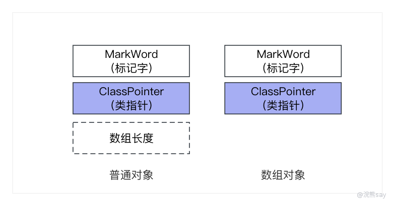

images/VW2zbbslloKXYyxkYR6cyQFjnfd.png

Java 对象头是每个 Java 对象在内存中的开头部分，用于存储对象的元数据信息，对象头的结构在不同的 JVM 实现中可能有所不同，但一般包括以下几个重要的部分：

1. **MarkWord（标记字段）：** MarkWord 主要用于存储对象的状态信息，例如是否被锁定、是否可回收、对象的哈希码、年龄等。这个部分是对象头中的一个字段，占用一定的字节
2. **Class Pointer（类型指针）：** 指向对象的类元数据（Class Metadata）的指针，用于确定对象的类型信息。这个指针指向对象所属类的 Class 对象。
3. **数组长度（如果是数组对象）：** 如果对象是数组类型，对象头中还包括一个字段用于存储数组的长度。这个字段仅在数组对象的对象头中存在。 对象头的结构对于 Java 虚拟机的各种功能非常重要，包括垃圾回收、同步锁、线程安全等，不同的 JVM 实现可能会有不同的优化和扩展，但基本的对象头结构通常是类似的。

#### 对象头的MarkWord （标记字段）——薯片包装上的商品简介

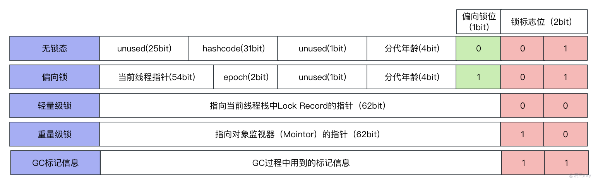

images/NfmVbQNsOopgHVxrtWecBrObn6e.png

MarkWord 是 Java 对象头中的一部分，用于存储对象的状态信息，它占据对象头的前8个字节。MarkWord 包含了多个标志位，用于记录对象的状态，支持垃圾回收、同步锁等功能。具体的标志位含义可能会因 JVM 实现而有所不同，但通常包括以下内容：

1. **锁定状态：** 用于支持对象的同步操作，包括偏向锁、轻量级锁和重量级锁，锁定状态的标志位表示对象是否被锁定，以及采用何种锁机制。
2. **偏向线程 ID：** 在偏向锁的情况下，MarkWord 中可能包含偏向线程的 ID，用于标识哪个线程获取了偏向锁。
3. **偏向时间戳：** 在偏向锁的情况下，用于记录上次偏向操作的时间戳，帮助判断是否需要撤销偏向锁。
4. **分代年龄：** 用于支持分代垃圾回收算法，标识对象的存活时间。 总体而言，MarkWord 提供了一些位来记录对象的状态信息，这些信息在 JVM 的运行时中用于优化对象的同步和垃圾回收信息。这部分还有一个比较重要的知识点就是Java的sychonized锁升级和对象头中的MarkWord的关系，可以参考我公众号里面的其它文章。

#### 对象头的Class Pointer（类指针）——薯片包装上的二维码

每个 Java 对象在内存中的对象头中都包含一个指针，指向该对象的类的元数据（Class 对象）。这个指针用于确定对象的类型信息，包括对象所属的类、父类、实现的接口等。具体来说，类指针包含了以下信息：

1. **类的类型信息：** 指向对象所属类的 Class 对象，该对象包含了关于类的元数据，如类的字段、方法、构造函数等信息。
2. **方法表（Method Table）：** 一些虚拟机使用类指针来访问对象所属类的方法表，这是一张包含了类中所有方法的表格。
3. **其他元数据：** 类指针可能包含其他用于支持 Java 的特性的元数据，比如类型擦除的信息、泛型信息等。 类指针的存在使得 Java 具有反射和运行时类型信息（RTTI）的能力，允许程序在运行时动态地获取对象的类型信息。这对于实现面向对象编程的特性，如多态，非常重要。

##### Class指针压缩

指针压缩（Pointer Compression）是一种优化技术，通常应用于64位的 Java 虚拟机。它旨在减小对象头中的一些字段的大小，从而降低对象的内存占用。

指针压缩的一种实现方式是将对象引用的高位空间用于存储对象头信息，因为在64位系统上，实际应用中的堆空间很少会超过32GB，因此对象引用的高位通常是没有用到的。关于 Class Pointer 和指针压缩的关系：

1. **未压缩的情况：** 在没有指针压缩的情况下，Class Pointer 通常是一个完整的指针，指向对象所属类的元数据。这个指针的大小通常是 8 字节，具体取决于虚拟机的实现和运行在何种硬件架构上。
2. **指针压缩的情况：** 在启用指针压缩的情况下，Class Pointer 可能经过压缩，一般是4字节，这样可以减小对象头的大小，从而降低对象在堆中的内存占用。 指针压缩技术是一种用于减小对象头大小并提高内存利用率的优化手段，但它需要考虑到堆的大小和系统架构，在大多数情况下，这种优化是由虚拟机自动处理的，而不需要程序员干预。

##### JVM设置指针压缩

在 Java 虚拟机中，可以通过 JVM 启动参数来控制是否启用指针压缩。指针压缩通常用于64位的 JVM，通过减小对象头中的一些字段的大小来降低对象的内存占用。在 HotSpot 虚拟机中，使用 -XX:ObjectAlignmentInBytes 参数来控制指针压缩的开启和关闭。

1. **开启指针压缩：** 表示对象的对齐方式是 4 字节，这通常是启用指针压缩的标志。在这种情况下，对象引用的高位将用于存储对象头信息，以减小对象头的大小。

\-XX:+UseCompressedOops

1. **关闭指针压缩：**

\-XX:-UseCompressedOops

上述参数表示对象的对齐方式是 8 字节，这通常是禁用指针压缩的标志。在这种情况下，对象引用的高位不会用于存储对象头信息，保持对象头的大小较大。

#### 对象头的数组长度 —— 数组类型独有

在 Java 中，对象头中包含了一个用于表示数组长度的字段。这个字段的存在仅针对数组对象，在普通对象中是不存在的。对于普通对象，对象头主要包含了 MarkWord 和 Class Pointer，用于标记对象的状态和指向对象的类元数据。而对于数组对象，对象头还包含了一个额外的字段用于存储数组的长度。

存储数组长度的主要目的是为了支持对数组的快速访问和遍历。在没有存储数组长度的情况下，要想获取数组的长度就需要进行遍历整个数组，这会导致性能开销较大，特别是对于大型数组来说。以下是存储数组长度的一些重要原因：

1. **快速访问：** 存储数组长度使得程序能够在 O(1) 的时间复杂度内获取数组的长度，这对于很多算法和操作来说是非常重要的，因为它允许在不需要遍历整个数组的情况下直接获取数组的大小。
2. **循环迭代：** 在循环中遍历数组时，知道数组的长度可以控制循环的次数，从而使代码更简洁和高效。
3. **边界检查：** 存储数组长度也允许进行边界检查，确保在访问数组元素时不会越界，这有助于提高程序的健壮性，防止访问超出数组边界的内存。
4. **内存布局：** 存储数组长度也有助于虚拟机在内存中布局数组，虚拟机可能会使用数组的长度来进行优化，例如在进行内存回收时，能够知道数组的实际大小，从而更有效地管理内存。 需要注意的是，这种优化不是绝对的，在某些情况下，如果数组的长度是已知的且常量，编译器和虚拟机可能会进行一些优化，而不依赖于实际存储的数组长度字段。

### 对象实例数据 —— 薯片

#### 字段重排

如下面的JOL输出可以看出，属性的排列顺序与在类中定义的顺序可能不同，这是因为 JVM 采用字段重排序技术，对原始类型进行重新排序，以满足内存对齐的需求。内存对齐的好处主要体现在提高访问效率、减少内存碎片、提高数据缓存利用率和最终提高系统性能。

- Java代码

public class User { 
int id,age,weight; 
byte sex; 
long phone; 
char local; 
}

- JOL输出

12 4 int User.id 0 
16 8 long User.phone 0 
24 4 int User.age 0 
28 4 int User.weight 0 
32 2 char User.local 34 1 byte User.sex 0

JVM中内存对齐具体规则遵循如下：

1. **按照数据类型的长度大小，从大到小排列。**
2. **具有相同长度的字段会被分配在相邻位置。**
3. **如果一个字段的长度是 L 个字节，那么这个字段的偏移量（OFFSET）需要对齐至 nL（n 为整数）的位置。** 通过按照特定字节大小对齐数据，可以减少 CPU 访问内存的次数，提高访问效率；减少内存碎片，提高内存利用率；避免字段横跨多个缓存行，提高数据缓存利用率。这些优势在大型数据库系统、图形处理等对性能要求较高的应用中尤为重要，有助于系统更有效地利用硬件资源，提升整体性能。

#### 继承父类

在类继承中，从内存布局上来说，父类的变量通常出现在子类的变量之前，但是在一些特殊情况下可能由于内存对其要求而需要实现补位，以下是一个具体的示例的Java代码：

public class Parent { 
long parentLong; 
} 
public class Children extends Parent { 
long childLong; 
int childInt; 
}

使用 JOL（Java Object Layout）输出该类的内存布局如下：

Offset Size Type Field Name 
0 12 (Object header) 
12 4 int Children.childInt 0 
16 8 long Parent.parentLong 0 
24 8 long Children.childLong 0

可以看到，父类 Parent 中的 parentLong 出现在子类 Children 中的变量之前。这是因为在内存中，通常遵循将父类的字段排在子类字段之前的原则。在一些特殊情况下，可能由于对齐要求而进行前置补位，但整体结构仍然符合子类在父类字段之后的布局规则。

#### 引用数据类型

默认情况下，JVM 在内存中排列变量时会将基本数据类型的变量放在引用数据类型之前，如下Java代码：

public class User { 
int int1; 
String ref; 
int int2; 
}

使用 JOL（Java Object Layout）输出该类的内存布局如下：

12 4 int User.int1 0 
16 4 int User.int2 0 
20 4 java.lang.String User.ref null

如上面JOL输出的内存布局所示，默认情况下的引用类型ref排在了int类型的后面，但是这种默认顺序可以通过 JVM 启动参数进行修改，具体操作如下：

\-XX:FieldsAllocationStyle=0

#### 静态变量

在Java中，静态变量是属于类的变量，一般会随着类加载的时候被存放在方法区当中，所以在对象的实例数据中是没有静态变量数据的（关于这部分内容可以参考我的文章[《运行时Java类的内存营地——方法区详解》](https://mp.weixin.qq.com/s?__biz=MzkzMjI0MDY3Mw==&mid=2247484221&idx=1&sn=0eb0de6dff95f67d2e87eb4916652bb9&chksm=c25f8f73f5280665dbe32e4942f6e5c487ff6360c78751c7741a4896ad88d77b52894c1ef372#rd)）。例如，在类中加入了一个静态变量，Java代码如下：

public class User { 
int id; 
static byte local; 
}

使用 JOL（Java Object Layout）输出该类的内存布局如下：

12 4 int User.id 0

通过观察内存布局的结果，可以明确静态变量并不包含在对象的内存布局中，静态变量属于类而不属于具体的对象，因此其大小并不计算在对象的内存中。

### 对齐填充字节——氮气

在Hotspot的自动内存管理系统中，要求对象的起始地址必须是8字节的整数倍，即对象的大小必须是8字节的整数倍。因此，如果实例数据没有对齐，就需要进行对齐填充以满足这一要求，填充的位仅充当占位符，不具有特殊含义。

在前述例子中，我们已经对对齐填充有了深入的了解。此外，在启用指针压缩的情况下，如果类中存在long/double类型的变量，将在对象头和实例数据之间形成间隙（gap）。为了节省空间，默认情况下会将较短长度的变量放在前面。这一功能可以通过JVM参数进行开启或关闭：

开启 -XX:+CompactFields 关闭 -XX:-CompactFields

在关闭情况下，可以观察到较短长度的变量没有前移填充。另外，我们提到了可以修改对齐宽度的参数：

\-XX:ObjectAlignmentInBytes

默认情况下对齐宽度为8字节，可以将其修改为2~256之间的2的整数幂。通常情况下，对齐宽度选择为8字节或16字节。在测试中，将对齐宽度修改为16字节，可以看到最后一行的属性字段仅占用6字节，因此会添加10字节进行对齐填充。然而，一般情况下不建议修改对齐长度参数，因为过长的对齐宽度可能导致内存空间的浪费。

### 总结

在Java中，对象头是每个对象在内存中的开头部分，存储着对象的元数据信息。对象头包括MarkWord（标记字段）和Class Pointer（类型指针）。MarkWord用于记录对象的状态，支持垃圾回收和同步锁等功能，而Class Pointer指向对象所属类的元数据，提供反射和运行时类型信息的支持。

对于数组对象，对象头还包括一个字段用于存储数组的长度，以支持快速访问和遍历。在内存布局中，父类的变量通常出现在子类的变量之前，但可能由于内存对齐的需求而进行补位。引用数据类型的变量通常排在基本数据类型之前。

字段重排和指针压缩是优化技术，字段重排通过内存对齐提高访问效率和数据缓存利用率，指针压缩减小对象头大小，提高内存利用率。静态变量不包含在对象的内存布局中，属于类而不属于具体的对象。

最后，对齐填充字节用于满足对象起始地址必须是8字节整数倍的要求，填充位仅为占位符。了解这些概念有助于理解Java对象在内存中的存储方式和优化策略。

## 三、MarkWord和Synchronized的锁升级机制（JDK8）

实际上，锁升级机制在JDK 15中已经废弃了，本文所说的只是面试中常问的低版本中的synchronized的锁升级机制，有兴趣的需要自己去看最新的JDK源码来了解新的Synchronized的锁机制。

### 什么是synchronized？

在Java的并发编程当中，synchronzied无疑是最常用的关键字，用于保护代码块和方法在多现场场景下的，并发安全问题。在Java中，synchronized锁是基于对象实现的，通常的使用方式包括修饰同步方法和修饰同步代码块，如下图：

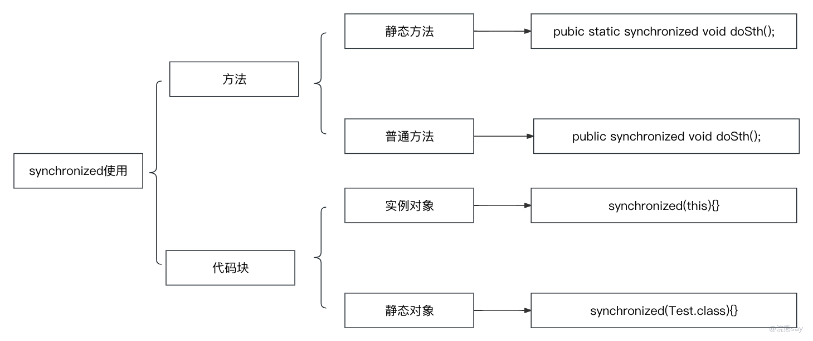

images/V6iDb1uuXox5AfxuMJTcNVfznFg.png

总体而言，synchronized关键字提供了一种简单而有效的方式来控制并发访问共享资源。但是，它也有一些限制，例如性能问题和潜在的死锁风险，在更复杂的并发场景中，可以考虑使用java.util.concurrent包中提供的更灵活的同步机制。

### Synchronized原理详解——从一段Java代码说起

package com.tsinghualei.concurrent; 
public class SynchronizedExample { 
private static final Object lock = new Object(); // 用于代码块的监视对象 
// 1. 修饰实例方法，使用当前对象作为锁 
public synchronized void synchronizedInstanceMethod() { 
} 
// 2. 修饰静态方法，使用当前类的.class作为锁 
public static synchronized void synchronizedStaticMethod() { 
} 
// 3. 修饰代码块，使用指定的监视对象作为锁 
public void synchronizedBlock() { 
synchronized (lock) { 
System.out.println("Synchronized Block - Start"); 
} 
} 
 
public static void main(String\[\] args) { 
SynchronizedExample.synchronizedStaticMethod(); 
} 
}

这里我们给出了一段极其简单的代码，这段代码有三个方法，但是方法的内容都是空的，分别代表了synchronized关键字的三种使用方法，下面我们javap -v xxx.class命令将其字节码文件反编译，不知道怎么生成字节码文件的可以参考我的文章：[《](https://mp.weixin.qq.com/s?__biz=MzkzMjI0MDY3Mw==&mid=2247484211&idx=1&sn=ab014d1d3df5cb478a12d54cce6fd488&chksm=c25f8f7df528066b0d75f670f6668d3cef5d0eb0a2d24935ac48fd5061694a715d4ead18d701#rd)[Java大厦的基石——Java Class文件构成原创](https://mp.weixin.qq.com/s?__biz=MzkzMjI0MDY3Mw==&mid=2247484211&idx=1&sn=ab014d1d3df5cb478a12d54cce6fd488&chksm=c25f8f7df528066b0d75f670f6668d3cef5d0eb0a2d24935ac48fd5061694a715d4ead18d701&token=150703740&lang=zh_CN#rd)，反编译结果如下面内容所示

#### 修饰方法——synchronizedInstanceMethod,synchronizedStaticMethod

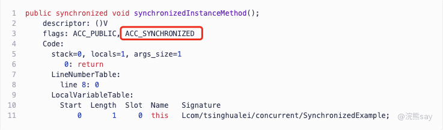

images/OKwFbwbmboJabcxEwCGc700AnVf.png

像上面这样使用synchronized修饰的普通方法可以注意到flags位的属性是ACC\_SYNCHRONIZED，当 JVM 遇到带有设置了 ACC\_SYNCHRONIZED 标志的方法时，它确保只有一个线程可以同时执行该方法。其他尝试访问相同方法的线程必须等待第一个线程释放锁。

synchronzied修饰静态方法也一样，也是在方法的字节码前面添加ACC\_SYNCHRONIZED标志。

#### 修饰代码块——synchronizedBlock

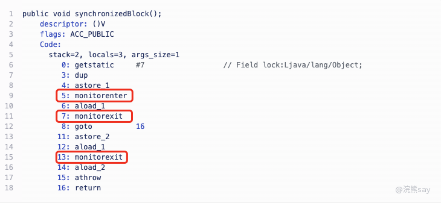

images/OMrub4sQHoDtScxzRRScWM45nNR.png

如上图所示，synchronized修饰的代码是在相对应的指令区间添加了monitorenter和monitorexit指令，JVM就是通过这两个指令来保证多线程状态下的同步的。

### ACC\_SYNCHRONIZED、monitorenter、monitorexit

下面的解释都是我去官网翻的介绍并用chatgpt翻译的结果

#### [ACC\_SYNCHRONIZED](https://docs.oracle.com/javase/specs/jvms/se8/html/jvms-2.html#jvms-2.11.10)

方法级的synchronized是隐式执行的，作为方法调用和返回的一部分, 同步方法在运行时常量池的method\_info结构中通过ACC\_SYNCHRONIZED标志进行区分，该标志由方法调用指令检查。

当调用设置了ACC\_SYNCHRONIZED的方法时，执行线程进入monitor，调用方法本身，并在方法调用正常完成或异常中断时退出monitor。

在执行线程拥有moniter的时间内，其他线程无法进入。如果在同步方法调用期间引发异常且同步方法未处理异常，则在将异常重新抛出同步方法之前，方法的监视器将自动退出。

对指令序列的同步通常用于编码Java编程语言的同步块。Java虚拟机提供了monitorenter和monitorexit指令来支持这样的语言结构。正确实现同步块需要由面向Java虚拟机的编译器协同工作。

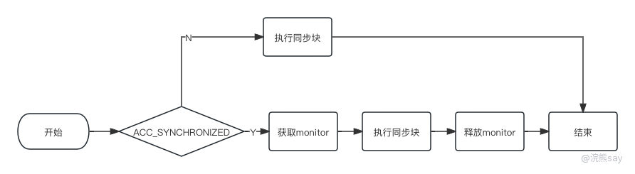

images/KDWObHI7oo5AX8xeinSczv1HnBe.png

总的来说就是，当JVM执行到有ACC\_SYNCHRONIZED标志标记的方法的时候，JVM会自动在该方法的对应代码块前后添加monitorenter和monitorexit指令，通过monitor来完成同步操作。

#### [monitorenter](https://docs.oracle.com/javase/specs/jvms/se8/html/jvms-6.html#jvms-6.5.monitorexit)

Java中每个对象都与一个monitor相关联，只有对象在被线程持有的情况下，monitor才会被锁定。执行monitorenter的线程会尝试获取与对象相关联的monitor的所有权，具体如下：

1. 如果与对象相关联的monitor的进入计数为零，则线程进入monitor并将其进入计数设置为一。此时，当前线程成为monitor的所有者。
2. 如果线程已经拥有与对象相关联的monitor，则重新进入monitor，增加其进入计数。
3. 如果另一个线程已经拥有与对象相关联的monitor，则线程将被阻塞，直到monitor的进入计数为零，然后再次尝试获取所有权。

images/ZoYObLlFeoycbuxqgNncosZfnuu.png

#### [monitorexit](https://docs.oracle.com/javase/specs/jvms/se8/html/jvms-6.html#jvms-6.5.monitorexit)

执行monitorexit的线程必须是与对象引用的实例相关联的monitor的所有者。当monitorexit指令执行时，对象相关联的monitor的进入计数会减1。如果显示当前monitor进入计数的值为零，则线程退出monitor，并不再是其所有者，正在阻塞等待进入monitor的其他线程被允许尝试进入。

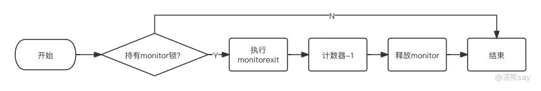

images/BIihbTTwnoaEIDxorahcpHijnxb.png

### Monitor（监视器）

在Java中，Monitor（监视器）是一种用于实现线程同步和互斥的机制，每个Java对象都与一个Monitor相关联，Monitor的主要目的是确保在任何给定时间，只有一个线程能够执行与特定对象相关联的临界区代码。Monitor是通过对象头（Object Header）和内置锁（Intrinsic Lock）来实现的，在JVM中Monitor的具体实现是ObjectMonitor。

#### ObjectMonitor核心参数

**JDK21的HotSpot源码：**

下面是JDK 21的HotSpot源码中定义的ObjectMonitor，其具体包位置是：hotspot/share/runtime/objectMonitor.hpp，删除了代码中大部分内容，保留了一些关键的成员变量。

class ObjectMonitor : public CHeapObj { 
static OopStorage\* \_oop\_storage; // 静态成员变量，用于存储对象的内存 
 
volatile markWord \_header; // 被监视对象的markword 
 
WeakHandle \_object; // 被监视对象的弱引用指针 
 
private: 
 
void\* volatile \_owner; // 拥有该监视器的线程的指针 
 
volatile uint64\_t \_previous\_owner\_tid; // 先前拥有该监视器的线程的线程 ID 
 
ObjectMonitor\* \_next\_om; // 下一个 ObjectMonitor\* 的链接 
 
volatile intx \_recursions; // 进入线程计数，第一次进入时为 0 
 
ObjectWaiter\* volatile \_EntryList; // 阻塞在进入或重新进入的线程链表 
ObjectWaiter\* volatile \_cxq; // 最近到达并在进入时被阻塞的线程链表 
 
JavaThread\* volatile \_succ; // 预定为继任者的线程 - 用于徒劳唤醒节流 
 
JavaThread\* volatile \_Responsible; // 负责者线程，用于记录最后一次成功进入的线程 
 
volatile int \_Spinner; // 用于退出->自旋器的优化 
 
volatile int \_SpinDuration; // 自旋的持续时间 
 
int \_contentions; // 在 enter() 中的活动争用次数，由 is\_busy() 使用 
 
protected: 
ObjectWaiter\* volatile \_WaitSet; // 阻塞在 monitor 上 wait() 的线程链表 
 
volatile int \_waiters; // 等待的线程数 
 
private: 
volatile int \_WaitSetLock; // 保护 Wait Queue 的简单自旋锁 
};

下面详细说说上面的关键参数的意义：

- \_header： 每个对象都会关联一个monitor，而monitor中会存储这个对象头中的markword，用来标记锁升级信息等。
- \_owner： 如果当前对象被锁定了，那么\_owner就会指向持有当前对象锁的线程指针，在C++中void\*就是通用类型的指针。
- \_EntryList： 阻塞在获取当前对象锁的线程列表，当使用synchornized时候锁定对象如果已经被其它线程所持有，那么新的想获取该对象锁的线程就会被加入这个列表当中。
- \_cxq： \_cxq 是”Contended eXit Queue” 的缩写， 表示”争用退出队列”。存储那些尝试获取锁却因为被其他线程占用而被阻塞的线程。它是一种用于管理竞争锁的机制，帮助控制和唤醒争用的线程，使它们在适当的时机有机会重新尝试获取锁。
- \_WaitSet：阻塞在monitor的wait（）上的线程列表，在Java中调用Object.wait()就会将当前线程加入这个列表。 这里介绍的几个参数是了解Monitor机制的几个核心参数，源码中其它参数还有很多，感兴趣的可以直接去看源码。

#### ObjectMonitor核心机制

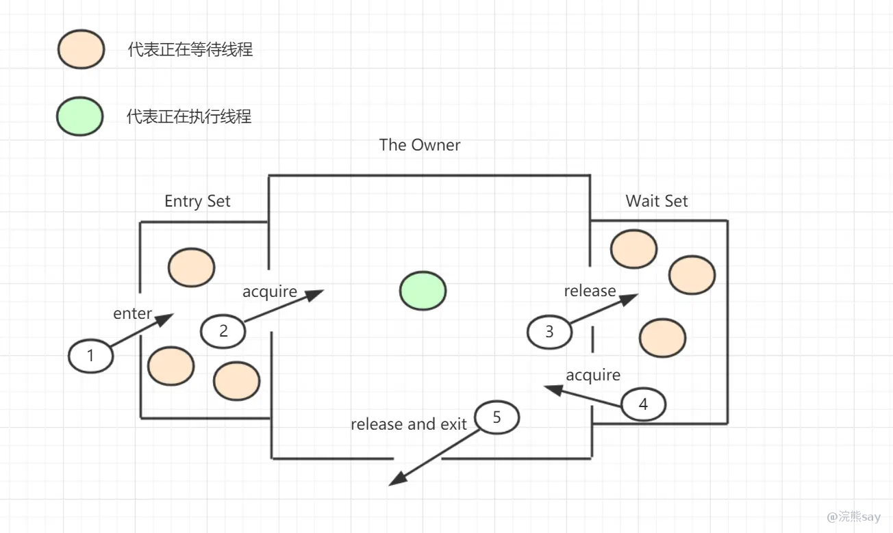

images/YyHEbvbayoiyocxpliucOAyznng.png

如上图所示的那样，monitor的核心机制其实不复杂，主要维护了一个EntrySet、WaitSet和一个线程的owner：

- 当线程想获取对象锁的时候（也就是获取当前这个monitor），会进去\_EntryList队列
- 当某个线程获取到了当前这个monitor之后，\_owner参数会被设置为当前线程的指针，同时计数器\_recursions+1
- 如果线程调用了wait()方法，则当前线程会进入\_WaitSet列表，这个过程会释放monitor并且讲将\_owner置为null，\_recursions-1
- 如果线程调用了notify/notifyAll()方法，则会唤醒\_WaitSet方中的某个线程来尝试获取锁
- 同步方法结束则会将\_owner置为null，并释放monitor 上面就是ObjectorMonitor的核心原理，以上原理均为HotSpot源码中总结，由于源码实际上很长为了不影响体验就不贴源码了。

#### Java对象与monitor关联

理解这部分需要先了解Java对象布局和对象头的相关前置知识，可以参考前面的文章[《**Java对象的内存布局详解——超市薯片是怎么摆在货架上的？**》](https://mp.weixin.qq.com/s?__biz=MzkzMjI0MDY3Mw==&mid=2247484368&idx=1&sn=a576fdda3531f1a14dcb6d551adb2d0f&chksm=c25f8f9ef52806883726ad9f6b5f54dfddf0053f5869b8c89205e471b62bbf386164935bf29f#rd)

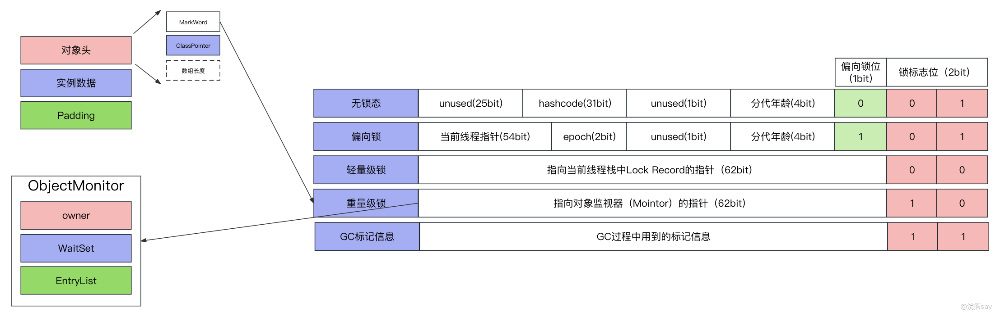

images/HoDNbxiS6o8TAVxocA5citnznUc.png

上面的图已经将关联关系展示得很清楚了，Java对象会有一个对象头，对象头中有MarkWord。当synchonized处于重量级锁的状态下的时候，其中的指针部分会指向HotSpot中C++定义的ObjectMonitor类。

### Sychronzied的锁升级机制

在 JDK 1.6 之前，使用 synchronized 关键字需要依赖于底层操作系统的 Mutex Lock 实现，**挂起线程和恢复线程都需要转入内核态来完成**，也就是说阻塞或唤醒一个 Java 线程都需要系统去切换 CPU 状态，这种状态的切换需要消耗处理器时间。这也就是为什么 synchronized 属于重量级锁的原因，因为**需要切换 CPU 状态导致效率低下，时间成本相对较高**，特别是当同步代码的内容过于简单时，可能切换的时间还要比代码执行的时间长。

在 JDK 1.6 之后，引入了偏向锁与轻量锁来减小获取和释放锁所带来的性能消耗，也就是**不再是一上来就需要切换 CPU 状态导致效率低下而是通过锁升级的方式逐步增大性能消耗**，从而避免了一些无需使用重量级锁的情况的性能消耗问题。

锁升级可以分为四种状态：**无锁 -> 偏向锁 -> 轻量级锁 -> 重量级锁**，锁会随着线程的竞争情况逐渐升级，但是锁升级是不可逆的，只能升级不能降级。下面将详细介绍每个锁的状态。

#### 无锁（**Uncontended State**）

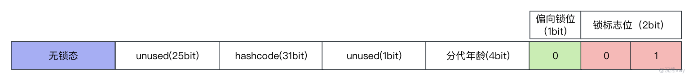

images/SfwBbmro8odZZyxy8jhc4hJhnFe.png

无锁状态其实就是不使用synchronized关键字的状态，Markword中的标志位为01，在一个对象的开始状态就是无锁状态。无锁状态下，对象并没有被真正上锁，因此也没有多余的内核态和用户态的切换带来的开销。

#### 偏向锁（**Biased Locking**）

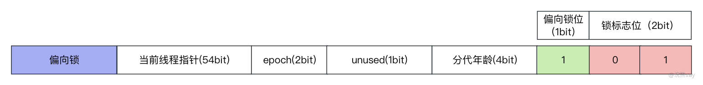

images/PVMybMXqDoymOYx8oLGccSRQnmg.png

当第一个线程访问同步块的时候，对象就会被标记为偏向锁状态，对象头部的Markword当中会存储持有锁的线程的ID。当其它线程尝试获取锁的时候，会先检查对象是否为偏向锁的状态，并验证持有锁的线程是否为当前线程。如果持有锁的线程为当前线程则直接获取锁，否则升级为轻量级锁。

为什么要引入偏向锁呢？因为实际上再大多数程序运行过程中锁都是被同一个线程锁持有，很少发生竞争，因此也就没有必要进行多次的锁的获取和释放过程，带来不必要的性能开销。所以，引入偏向锁的目的是为了解决只有一个线程访问同步代码块的时候进行不必要的锁获取和释放的过程，偏向锁标记的线程可以直接获取锁。

**偏向锁升级过程：**

当一个线程进入由synchronized关键字修饰的同步代码块时，JVM使用CAS（Compare and Swap）操作将当前线程的ID记录到作为锁的对象的Mark Word中的54bit的ThreadID字段中，同时修改偏向锁标志位为1，表示当前线程获得了该锁。此时，锁对象从无锁状态变为偏向锁状态。

当前线程再次访问该同步代码块时，JVM通过锁对象的对象头中的Mark Word判断ThreadID字段是否与当前线程的ID一致。如果一致，说明当前线程仍然持有该锁对象，可以直接进入同步代码块。偏向锁不会在线程执行完同步代码块后主动释放，因此线程可以一直访问同步代码块而无需重复加锁。

这种机制无需切换CPU状态，即不涉及操作系统的介入。偏向锁实际上就是在没有其他线程竞争的情况下，始终偏向于同一线程，该线程可以持续访问同步代码块而无需重复获取锁。因此，使用偏向锁几乎没有额外的开销，具有极高的性能。

**偏向锁降级：**

偏向锁在没有其他线程竞争时，持有偏向锁的线程不会主动释放。偏向锁的释放时机是在其他线程竞争该锁时，持有偏向锁的线程会被撤销，并释放该偏向锁。偏向锁的撤销需要等待到全局安全点，即在该时间点没有字节码正在执行。此外，根据持有偏向锁的线程是否执行完同步代码，偏向锁的撤销有两种情况：

**情况一：** 持有偏向锁的线程正在执行同步代码（尚未执行完）。此时，另一个线程抢占该锁，导致偏向锁被撤销，锁升级为轻量级锁。新竞争的线程会自旋等待获取该轻量级锁，而原持有偏向锁的线程继续执行其同步代码。

**情况二：** 持有偏向锁的线程已执行完同步代码（已退出同步代码块）。在这种情况下，另一个线程抢占该锁，导致偏向锁被撤销。此时，ThreadID会被置空，偏向锁位置被清零。根据持有偏向锁的线程是否再次竞争，有以下两种情况：

- 如果持有偏向锁的线程不再竞争，那么偏向锁会重新偏向于新的线程，即新的线程成为持有偏向锁的线程。
- 如果持有偏向锁的线程继续竞争，那么锁将升级为轻量级锁，通过CAS自旋抢占锁。 这种机制保证了在低竞争情况下，偏向锁的性能表现较好。

#### 轻量级锁（**Lightweight Locking**）

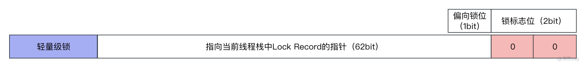

images/LAhbbDLOQoWEpOxKQtLcYT8Inkd.png

当2个线程争夺同一个锁时，对象升级为轻量级锁状态。轻量级锁使用CAS（Compare and Swap）操作，尝试将对象头部的锁记录指针替换为指向线程栈上的锁记录（Lock Record）。如果CAS成功，线程成功获取锁；否则，升级为重量级锁。

**轻量级锁升级：**

在线程A执行同步代码前，JVM在线程的栈帧中创建空间用于存储锁记录，即Lock Record，当线程A抢占锁对象时，JVM使用CAS操作将锁对象的对象头的Mark Word拷贝进线程A的锁记录Lock Record中（这个拷贝Mark Word的过程被称为Displaced Mark Word）。

同时，将Mark Word中指向线程栈中Lock Record的指针指向线程A的锁空间。如果CAS更新成功，表示线程A成功持有该对象锁，将对象锁的Mark Word的锁标志位更新为00。此时，线程A可以执行同步代码，而线程B则会自旋等待获取该轻量级锁，如果CAS更新失败，说明该锁被线程B抢占。

**轻量级锁的撤销：**

当有两个以上的线程同时竞争一个锁时，轻量级锁会被撤销并升级为重量级锁，这意味着不再通过自旋的方式等待获取锁，而是直接阻塞线程。

当持有轻量级锁的线程执行完同步代码时，同样会释放轻量级锁。这时，JVM会使用CAS操作将锁对象的Mark Word中指针指向的锁记录Lock Record重新替换回锁对象的Mark Word。

这种机制保证了在线程竞争激烈或同步代码执行完毕时，锁能够适应不同的情况进行升级或撤销，以提高并发性能。

#### 重量级锁**（Heavyweight Locking）**

images/TIMzbwYsWopa2Sxi1Obciul3nUd.png

当轻量级锁竞争激烈，多个线程争夺同一个锁时，升级为重量级锁状态。在重量级锁状态下，对象的头部会指向一个Monitor对象，该Monitor对象负责管理锁的获取和释放。线程在进入同步块时，需要先获取Monitor对象，成功获取后执行同步块，执行完毕后释放Monitor对象。

#### 锁优化

JDK 1.6及之后版本引入了自适应自旋锁、锁消除和锁粗化等锁优化策略，以进一步提升synchronized的性能。

##### **自适应自旋锁**

JDK 1.6之前已引入自旋锁，但它的缺点是在锁占用时间较长的情况下，线程一直占用CPU时间片，导致CPU资源浪费。为解决这个问题，引入了自适应自旋锁，它根据前一次在相同锁上的自旋时间以及锁的持有者状态来动态决定自旋的上限次数。JVM会根据线程在同一锁对象上的自旋等待情况来调整自旋的上限次数，减少额外的CPU开销。

##### **锁消除：**

锁消除是JVM在JIT编译期间进行的优化，通过逃逸分析来消除不可能存在共享资源竞争的锁。通过逃逸分析，JVM判断对象是否会逃逸，如果某个对象不会逃逸，即在堆上的对象不会被其他线程访问，就可以将其当作栈上的数据处理，认为该数据是线程私有的，从而省略同步加锁操作，实现锁消除。

##### **锁粗化：**

锁粗化是通过将加锁范围扩展到整个操作序列的外部，降低加锁解锁的频率来减少性能损耗。当存在一系列操作对同一个对象反复加锁和解锁，甚至在循环体中进行加锁操作时，即使没有线程竞争，频繁进行互斥同步操作也会导致性能损耗。为解决这个问题，引入锁粗化，将一系列操作的加锁解锁频率减低，提高性能。

### 总结

本文总结了JDK8中synchronized的锁升级机制，首先从字节码的角度分析了在字节码层面synchronized的实现原理，核心点是monitorenter和monitorexit两个指令。

Java中的每个对象都会关联一个monitor，monitor本身是一个管程的概念，用来管理Java对象在多线程中的同步问题，主要实现上是由一个EntrySet、一个WaitSet和一个\_owner来进行管理。

最后，介绍了synchonized的锁升级机制，在JDK8中会从无锁->偏向锁->轻量级锁->重量级锁的流程进行升级，以提升并发效率。
