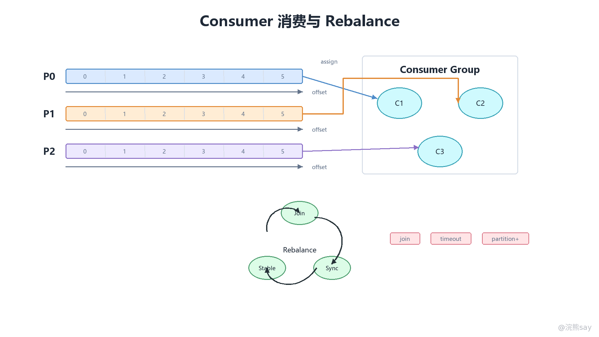

# 06 Consumer消费模型、Offset提交与Rebalance

Kafka Consumer 是从 Broker 拉取消息并推进消费进度的客户端组件。它要解决的不是简单的“把消息读出来”，而是三个连续问题：从哪个分区读、从哪个 Offset 开始读、读完以后怎样记录进度。Kafka 把消息保存在 Broker 的分区日志中，Consumer 通过 poll 主动拉取数据，通过 Consumer Group 协调分区归属，通过 Offset 提交记录每个分区的消费位置，通过 Rebalance 在成员变化时重新分配分区。

原始文章中已经给出 Consumer、Consumer Group 和 Offset 的基础定义：Consumer 从 Broker 消费消息，组内消费者共同消费同一组分区，一个分区同一时刻通常只能分配给组内一个消费者，Offset 用来记录消费位置。真正容易出问题的是这些概念组合后的工程语义：自动提交可能导致业务没处理完就确认，手动提交可能因为失败重试产生重复消费，Rebalance 会让分区迁移并放大提交时机错误，线程池并发处理又会改变分区内顺序和 Offset 推进方式。

## 一、拉模式让消费节奏由客户端控制

Kafka Consumer 采用拉模式。Broker 不主动把消息推给 Consumer，而是 Consumer 持续调用 poll，向 Broker 请求自己被分配分区上的一批消息。拉模式的价值在于消费端可以根据自己的处理能力控制节奏：处理快就多拉、处理慢就少拉或暂停部分分区；Broker 不需要为每个业务服务判断下游吞吐，也不会因为某个慢消费者被动堆积大量未确认推送。

拉模式并不意味着 Consumer 可以随意长时间不与 Kafka 通信。poll 在 Kafka 客户端里同时承担多项职责：拉取数据、发送心跳相关请求、处理分区分配状态、触发回调、发现 Rebalance 结果。业务代码如果把一批消息处理得太久，长时间不再调用 poll，客户端可能超过 max.poll.interval.ms，组协调器会认为这个消费者已经无法及时处理消息，从而把它移出消费组并触发 Rebalance。

几个关键参数需要一起理解：
| 参数 | 作用 | 调优方向 |
| --- | --- | --- |
| max.poll.records | 单次 poll 最多返回多少条消息 | 单条处理慢时降低，批处理能力强时提高 |
| max.poll.interval.ms | 两次 poll 之间允许的最大处理间隔 | 业务处理耗时长时适当增大，但不应掩盖阻塞问题 |
| session.timeout.ms | 消费者会话超时时间 | 与心跳配合判断成员是否失联 |
| heartbeat.interval.ms | 心跳发送间隔 | 通常小于 session.timeout.ms，不宜随意过大 |
| fetch.min.bytes / fetch.max.wait.ms | Broker 等待凑批返回的条件 | 延迟敏感场景降低等待，吞吐优先场景可适当凑批 |

这里有一个常见误区：看到“拉模式”就以为只要业务处理慢，Consumer 自然少拉就可以。实际生产中，如果代码每次 poll 拉了很多记录，然后长时间同步处理，Consumer 仍然可能因为超过最大处理间隔触发 Rebalance。拉模式提供的是控制能力，不是自动背压能力，业务仍然需要设计处理模型。

## 二、Consumer Group把分区分给组内成员

Consumer Group 是 Kafka 消费扩展的核心。同一个消费组内的多个 Consumer 共同消费一组 Topic 分区，每个分区在同一时刻通常只会被分配给组内一个成员。这样可以保证分区内消息顺序由一个消费者实例推进，同时让不同分区并行处理。不同消费组之间相互独立，它们可以从同一 Topic 读取同一份消息，并维护各自的 Offset。

这个模型带来三个直接结论：

1. 一个消费组的并行度上限通常受分区数限制。如果 Topic 只有 4 个分区，组内启动 10 个 Consumer，最多也只有 4 个 Consumer 真正拿到分区，剩余成员会空闲。
2. 增加 Consumer 不一定提升吞吐。如果瓶颈在数据库、下游接口、分区热点或单条业务逻辑，盲目扩容消费者只会增加 Rebalance 和资源争用。
3. 分区数不是越多越好。分区过多会增加 Broker 文件句柄、索引、元数据、Leader 选举、Rebalance 和客户端管理成本。

从顺序性角度看，Kafka 只天然保证单分区内的 Offset 顺序。跨分区没有全局顺序。同一个业务 Key 如果需要严格顺序，Producer 端应通过 Key 分区让相同 Key 进入同一分区，Consumer 端也要避免把同一分区内的消息无序并发处理。

## 三、poll循环要把拉取、处理和提交拆清楚

一个典型 Consumer 主循环可以抽象为四步：

1. 调用 poll 拉取一批记录。
2. 按 Topic-Partition 分组或按业务 Key 分流处理。
3. 业务处理成功后计算可以安全提交的 Offset。
4. 提交 Offset，并继续下一轮 poll。

在简单场景中，代码可能写成“poll 一批，逐条处理，全部成功后提交本批最大 Offset”。这种写法容易理解，但吞吐有限。复杂场景中，拉取线程会把消息投递给业务线程池，业务线程池并发处理，拉取线程继续维持 poll 和心跳。此时最难的不是把消息丢进线程池，而是确定某个分区的哪些 Offset 已经连续处理成功。

例如同一分区拉到 Offset 10、11、12、13，如果 10、11、13 处理成功，12 还在处理中，就不能提交 14。因为提交 14 表示 10 到 13 都已经可以跳过；一旦消费者崩溃，Offset 12 就可能丢失处理机会。正确做法是按分区维护连续完成水位，只提交“从上次提交位置开始连续成功”的下一个 Offset。

## 四、Offset提交的是下一条要读取的位置

Offset 提交记录的是“下一条要消费的 Offset”，不是“最后一条已经消费的 Offset”。如果消费者已经成功处理到 offset=20，提交值应该是 21。这个细节非常重要，因为它决定了重启后从哪里继续读，也解释了为什么提交失败通常带来重复消费，而提前提交可能带来消息丢失。

Kafka 早期版本常通过 ZooKeeper 管理消费 Offset，新版本一般把 Offset 保存在内部 Topic \_\_consumer\_offsets 中。这个内部 Topic 也以 Kafka 日志的形式持久化，并通过压缩策略保留每个消费组对每个分区的最新提交位置。也就是说，Offset 本身也是 Kafka 管理的一类状态数据。

Offset 有三类常见来源：
| 场景 | 起始位置来源 | 说明 |
| --- | --- | --- |
| 已有提交记录 | 从已提交 Offset 继续 | 最常见，消费者重启后继续上次进度 |
| 没有提交记录 | 由 auto.offset.reset 决定 | earliest 从最早可用消息开始，latest 从最新位置之后开始 |
| 人工重置 | 运维或程序调用 seek/reset | 用于回放、补偿、跳过异常区间 |

要注意 auto.offset.reset 只在没有可用提交 Offset，或者提交 Offset 已经过期不可用时生效。很多同学以为把它改成 earliest 就能让一个已有消费组重新从头消费，这是不准确的；如果消费组已经有提交记录，Kafka 仍会优先使用提交记录。真正重放要更换 group id，或者显式重置 Offset。

## 五、自动提交方便但边界不适合关键业务

自动提交通过 enable.auto.commit=true 和 auto.commit.interval.ms 控制。客户端会按固定间隔提交最近一次 poll 返回记录的 Offset。它适合对重复或少量丢失不敏感的简单统计、开发测试和临时工具，但不适合作为关键业务的默认方案。

自动提交的风险在于提交动作和业务处理动作不是同一个原子操作。假设 Consumer 拉到一批消息，自动提交线程先把 Offset 提交了，但业务还没写入数据库，此时服务宕机。重启后 Kafka 会认为这批消息已经消费过，消费者从更靠后的位置继续读，业务层就可能漏处理。

反过来，手动提交通常遵循“先处理业务，成功后提交 Offset”的原则。这样即便处理成功后、提交前服务宕机，重启后最多把这批消息再处理一次，不会直接跳过未完成业务。因此，生产系统更常接受“至少一次”带来的重复消费，再通过幂等设计保证业务正确性，而不是用提前提交换取表面上的不重复。

## 六、同步提交与异步提交各有代价

手动提交又分同步提交和异步提交。同步提交会阻塞等待 Broker 返回结果，语义明确，失败可以立即感知并重试；缺点是每次提交都占用消费线程时间，提交太频繁会降低吞吐。异步提交不阻塞主消费流程，吞吐更好，但失败处理更复杂，尤其要注意旧提交回调不能覆盖新进度。

可以用下面的方式理解取舍：
| 提交方式 | 优点 | 风险 | 常见用法 |
| --- | --- | --- | --- |
| commitSync | 结果明确，失败可重试 | 阻塞消费线程，影响吞吐 | 分区撤销、关闭前、关键边界收尾 |
| commitAsync | 不阻塞，吞吐更高 | 失败回调处理复杂，可能出现进度回退 | 高频正常提交，配合回调记录异常 |
| 同步 + 异步组合 | 平衡吞吐与边界可靠性 | 实现略复杂 | 平时异步，Rebalance 或关闭前同步 |

异步提交最需要警惕进度乱序。例如先异步提交 100，失败了；后续又异步提交 200，成功了；如果此时对 100 的失败回调盲目重试，并最终提交成功，可能把提交进度从 200 回退到 100。生产代码需要记录提交代次或只允许更大的 Offset 覆盖更小的 Offset，避免旧回调破坏新进度。

Spring Kafka 封装了 AckMode、手动 Acknowledgment、批量监听、错误处理器和重试机制，但底层原则不变：业务没有安全落地之前不要确认 Offset；如果允许失败重试，就必须接受重复消费；如果要减少重复，就需要把业务处理和 Offset 提交放进更严格的事务或幂等模型中。

## 七、Rebalance会重新分配分区归属

Rebalance 是 Consumer Group 对分区归属重新达成一致的过程。当组内成员变化、订阅 Topic 的分区数变化、消费者超时、客户端主动离开、分配策略变化时，组协调器会触发 Rebalance。Rebalance 完成后，每个消费者会得到新的分区集合，并从这些分区的已提交 Offset 继续拉取。

Rebalance 的影响不是“重新分一下任务”这么轻。它会带来短暂停顿、分区撤销和重新分配、未提交进度风险、缓存失效、线程池任务清理、以及重复消费概率上升。如果消费者在分区被撤销前没有提交已经处理完成的 Offset，新接管该分区的消费者就会从旧提交位置继续读，重复消费会增加；如果消费者提前提交了尚未处理完成的 Offset，则可能造成漏处理。

下面这张既有图展示的是 Consumer 拉取、Offset 提交和 Rebalance 之间的关系。重点不在图上记住每个箭头，而在于理解：分区归属会变化，Offset 是新旧消费者交接时的进度边界。

images/kafka-04-Consumer消费与Rebalance.png

实际项目中，应重点处理两个回调边界。分区撤销前，要停止接收该分区的新任务，等待或中断正在处理的任务，并同步提交已经安全完成的 Offset。分区分配后，要初始化本地状态、清理旧缓存、按已提交 Offset 或自定义位置开始消费。忽略这两个边界，Rebalance 一频繁，重复消费、乱序、线程池残留任务和脏缓存都会集中暴露。

## 八、分区分配策略影响均衡与迁移成本

分区分配策略决定 Rebalance 后每个 Consumer 拿到哪些分区。Kafka 常见策略包括 Range、RoundRobin、Sticky 和 Cooperative Sticky。它们的差异不只是“谁更均匀”，还包括是否尽量保持原分配、是否支持增量协作式 Rebalance、是否容易在多 Topic 场景产生倾斜。
| 策略 | 基本思路 | 适合场景 | 注意点 |
| --- | --- | --- | --- |
| Range | 按 Topic 维度把连续分区分给消费者 | 单 Topic、分区较均匀的简单场景 | 多 Topic 订阅时容易让部分消费者拿到更多分区 |
| RoundRobin | 把所有订阅分区轮询分给消费者 | 订阅集合一致、追求均匀分布 | 订阅集合不一致时行为更复杂 |
| Sticky | 尽量均衡，同时尽量保留上次分配 | 减少 Rebalance 后迁移量 | 比简单策略更重视稳定性 |
| Cooperative Sticky | 协作式增量迁移，减少全量暂停 | 大消费组、频繁扩缩容 | 需要客户端版本和配置配合 |

如果消费组规模较大，或者服务经常滚动发布，Sticky 或 Cooperative Sticky 往往比简单 Range 更稳定。原因是它们尽量减少分区迁移数量，降低本地缓存重建、状态恢复和重复消费范围。选择策略时不要只看一次分配是否平均，还要看 Rebalance 成本是否可接受。

## 九、线程模型决定吞吐、顺序和提交复杂度

KafkaConsumer 实例本身不是线程安全的，不应该让多个线程同时调用同一个 Consumer 的 poll、commit、seek 等方法。常见线程模型有两类。

第一类是“每线程一个 Consumer”。每个线程独立持有一个 Consumer 实例，由消费组分配分区。这种模型简单，Offset 提交和分区顺序也容易维护，适合分区数和线程数匹配的场景。缺点是并发度受分区数限制，线程过多时会产生空闲消费者，客户端连接和 Rebalance 成本也会上升。

第二类是“一个 Consumer 拉取，多业务线程处理”。拉取线程负责 poll、心跳、分区分配和 Offset 提交，业务线程池负责处理消息。这种模型可以提高业务处理并发，尤其适合单条消息处理较慢的场景，但 Offset 管理明显复杂。它必须按分区维护任务状态，不能因为某个高 Offset 先完成就直接提交；也要在 Rebalance 时停止对应分区的任务，避免已失去分区所有权的线程继续处理旧消息。

如果业务要求同一 Key 严格有序，可以采用两种思路：Producer 端保证相同 Key 进入同一分区，Consumer 端按分区单线程处理；或者 Consumer 拉取后按 Key 分发到固定本地队列，让同一 Key 的任务串行执行。后一种方式吞吐更高，但本地队列、失败重试和 Offset 连续提交都更复杂。

## 十、反压要保护消费端而不是掩盖积压

当下游数据库、缓存、第三方接口或计算服务变慢时，Consumer 如果继续无限制拉取消息，只会把压力从 Kafka 转移到应用内存和线程池队列。Kafka Consumer 提供 pause 和 resume，可以暂停或恢复指定分区的拉取。工程中也常结合线程池队列长度、下游错误率、数据库连接池利用率、接口超时率来做动态反压。

反压的合理流程通常是：当本地队列超过阈值或下游不可用时，暂停相关分区；继续调用 poll 维持心跳，但不再接收这些分区的新记录；等待队列下降或下游恢复后，再恢复分区消费。这里的关键是“暂停拉取”不等于“停止 poll”。如果完全停止 poll，消费者仍可能被组协调器踢出，从而触发 Rebalance。

反压也不是治理积压的根本方案。真正出现消费延迟持续升高时，要分析生产速率、分区数、消费组并行度、单条处理耗时、批量写入能力、下游瓶颈、重试风暴和异常消息比例。pause 只能保护当前消费者服务不被拖垮，不能把一个长期处理能力不足的系统变成高吞吐系统。

## 十一、重复消费是至少一次语义下必须面对的结果

Kafka 消费端最常见的交付语义是至少一次：消息一般不会被跳过，但可能被重复处理。重复消费的典型场景包括：

1. 业务处理成功，Offset 提交前消费者宕机。
2. 异步提交失败，后续从旧 Offset 重新消费。
3. Rebalance 发生时，分区撤销前的完成进度未及时提交。
4. 业务线程池处理成功，但拉取线程维护的提交水位尚未推进。
5. 消费者处理超时被踢出消费组，新消费者接管旧提交位置。

因此，生产系统不能把“Kafka 不重复投递”作为前提。更稳妥的设计是让消费处理具备幂等性：同一条消息重复到达，不会让业务状态重复改变。幂等方案通常依赖业务唯一键、消息 ID、数据库唯一约束、去重表、状态机版本号、Redis 去重键、下游接口幂等号或事务表。

例如订单支付成功事件重复消费时，消费端不应简单地再次增加余额或再次发货，而应以订单号和事件类型作为唯一约束，先判断该事件是否已经处理；库存扣减可以用业务流水号做幂等；状态流可以通过版本号保证旧事件不能覆盖新状态。幂等设计不是 Kafka 的附属细节，而是消息系统落地的核心业务约束。

## 十二、异常处理要区分重试、跳过和死信

Consumer 处理失败时，不能只有“抛异常等待下次再来”一种策略。临时错误和永久错误要分开处理：数据库短暂不可用、接口超时、网络抖动适合有限重试；消息格式错误、字段缺失、业务状态永久不合法则应记录错误并进入死信或人工处理流程。否则一个毒性消息可能长期阻塞同一分区后续消息。

常见处理模型包括：
| 错误类型 | 处理方式 | Offset策略 |
| --- | --- | --- |
| 瞬时下游失败 | 本地重试、延迟重试、暂停分区 | 未成功前不提交或提交到安全水位 |
| 消息格式错误 | 记录原始消息，写入死信 Topic | 死信写入成功后提交，避免卡死分区 |
| 业务幂等冲突 | 判定已处理则直接成功 | 可提交 Offset |
| 长时间积压 | 扩容、批处理、限流生产者、拆分热点 | 不通过随意跳 Offset 掩盖问题 |

Spring Kafka 中可以使用错误处理器、重试 Topic、死信 Topic 和手动确认来组织这些流程。无论封装层怎样变化，底层目标都一样：让可恢复错误有重试机会，让不可恢复消息可追踪、可补偿，同时不要破坏分区内 Offset 的安全推进。

## 十三、面试表达与项目落地口径

被问到“Kafka Consumer 怎么保证不丢消息”时，不要回答“手动提交就不会丢”。更准确的表达是：消费端通常采用先处理业务、成功后提交 Offset 的方式，避免业务未完成就推进消费进度；这样可以降低丢失风险，但会带来重复消费，所以业务必须做幂等。对关键场景，还要配合失败重试、死信队列、分区撤销前同步提交和下游事务控制。

被问到“Rebalance 为什么会导致重复消费”时，可以这样讲：Rebalance 会让分区从一个消费者迁移到另一个消费者，新消费者从该分区最近提交的 Offset 继续读。如果旧消费者已经处理了一部分消息但还没提交，接管者会从旧位置重新拉取，形成重复消费；如果旧消费者提前提交了未处理完成的 Offset，则有漏处理风险。因此 Rebalance 边界要做好停止拉取、等待已完成任务、同步提交和清理本地状态。

被问到“消费积压怎么排查”时，应先看消费延迟是否持续增长，再分解到生产速率、分区数、消费者实例数、单条处理耗时、批量处理能力、下游资源、错误重试比例和热点 Key。不要一上来就增加消费者实例，因为如果分区数不足、下游数据库已经饱和，增加消费者只会制造更多竞争。

本章的准备标准是：能讲清 Consumer 的拉模式和 poll 职责，能区分提交 Offset 与业务处理的边界，能解释自动提交、同步提交和异步提交的风险，能说明 Rebalance 的触发条件和分区撤销处理，能设计基本的线程模型、反压方案、异常处理和幂等机制。掌握这些内容后，Kafka Consumer 才不只是“写一个监听方法”，而是一个可控、可恢复、可扩展的消费系统。
