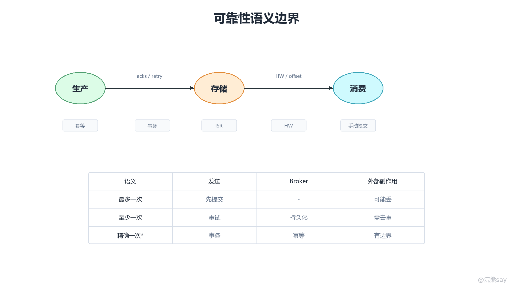

# 07 Kafka可靠性、幂等、事务与消息语义

Kafka 可靠性（Reliability）讨论的不是某一个参数是否打开，而是一条消息从生产者进入 Broker、在副本之间完成同步、再被消费者处理并提交 Offset 的端到端结果。单独设置 acks=all 只能提高写入确认的可信度，不能覆盖消费者先提交后处理、外部数据库写入失败、发送异常被业务代码吞掉等问题。工程上要把 Kafka 的消息语义拆成三段来看：生产者承诺消息已经被安全写入，Broker 承诺已确认消息在故障切换后不消失，消费者承诺业务处理完成后再推进消费位置。

从系统结构上看，Kafka 的可靠性由“传输层可靠、存储层可靠、消费层可靠、业务层幂等”共同组成。传输层依赖确认、重试和幂等生产者；存储层依赖副本、ISR、水位线和选主策略；消费层依赖手动提交、失败重试和死信隔离；业务层则依赖唯一键、状态机、去重表或外部幂等号。面试里如果只说“不丢消息靠三副本”，答案是不完整的，因为 Kafka 只能保证它自己管理的日志和 Offset，无法天然替外部数据库、第三方接口或业务状态机承担精确一次。

下面这张图可以作为消息语义的总览。阅读时要特别注意：最多一次、至少一次和精确一次不是三个孤立名词，而是提交 Offset、处理业务、重试发送和事务边界组合出来的结果。

images/kafka-05-可靠性语义.png

## 一、消息语义先看“提交点”和“副作用点”

消息语义（Message Delivery Semantics）描述的是一条消息最终对业务产生副作用的次数。这里的“副作用”不是指消费者是否拉到过消息，而是指是否真正完成了落库、状态变更、告警推送、扣减库存或调用外部接口。Kafka 能控制消息日志和消费位移，但业务副作用发生在应用代码和外部系统中，所以语义判断必须同时观察 Offset 提交点和业务处理点。

最多一次（At Most Once）的典型流程是先提交 Offset，再执行业务处理。这样即使消费者在业务处理前宕机，Kafka 也认为这条消息已经被消费，下次不会重新投递，所以结果是“可能丢，但一般不重复”。这种语义只适合可丢弃的采样日志、临时指标或低价值埋点，不适合订单、支付、设备告警和库存状态。

至少一次（At Least Once）的典型流程是先执行业务处理，处理成功后再提交 Offset。只要消息仍在 Kafka 保留期内，消费者失败后可以从已提交 Offset 之后继续拉取，因此不容易丢；但如果业务处理成功后、Offset 提交前宕机，重启后会再次处理同一条消息，所以结果是“通常不丢，但必须接受重复”。多数 Java 后端项目真正落地的都是至少一次语义，再通过业务幂等把重复处理变成重复无害。

精确一次（Exactly Once）需要分清边界。Kafka 的幂等生产者解决生产者重试导致的重复写入；Kafka 事务解决 Kafka 内部“读一个 Topic、写另一个 Topic、同时提交输入 Offset”的原子性；但消费者写 MySQL、MongoDB、Redis 或调用第三方接口时，Kafka 事务无法自动覆盖这些外部副作用。更严谨的表达是：Kafka 能在自己的日志系统内提供精确一次处理能力，跨出 Kafka 边界后仍然需要业务幂等或外部一致性设计。
| 语义层次 | 常见流程 | 主要风险 | 适用场景 |
| --- | --- | --- | --- |
| 最多一次 | 先提交 Offset，再处理业务 | 处理前宕机导致消息跳过 | 可丢弃日志、临时采样 |
| 至少一次 | 先处理业务，再提交 Offset | 处理成功但提交前宕机导致重复 | 绝大多数业务消息 |
| Kafka 内精确一次 | 事务性消费、生产、提交 Offset | 只覆盖 Kafka 事务边界 | 流处理、Topic 到 Topic 转换 |
| 业务层精确结果 | 至少一次投递加业务幂等 | 需要外部唯一约束和补偿 | 订单、设备事件、账务流水 |

## 二、生产者可靠性要同时看确认、重试和异常兜底

生产者端的目标是避免“业务以为消息发出去了，但 Kafka 没有可靠保存”。这一段可以拆成三层配置：确认级别决定 Broker 什么时候返回成功，重试机制决定临时失败是否会再次发送，异常处理决定最终失败是否被业务系统感知并补偿。

acks 是生产者可靠性的第一层开关。acks=0 表示发送后不等待 Broker 响应，吞吐高但无法确认消息是否进入 Kafka；acks=1 表示 Leader 写入本地日志后即可返回成功，如果 Leader 刚确认就宕机，而 Follower 尚未同步完成，已确认消息仍可能丢失；acks=all 或 acks=-1 表示 Leader 需要等待 ISR 中满足条件的副本同步后再返回确认，它是关键业务的基本配置。

retries 和 delivery.timeout.ms 决定生产者遇到网络抖动、Leader 切换、请求超时和暂时不可用时是否继续尝试。现代 Kafka 客户端默认会有较积极的重试能力，但项目里仍要理解重试不是无限承诺：如果超过交付超时时间、Topic 不存在、消息超过大小限制、权限不足或事务生产者被 fencing，发送仍然会失败。异步发送时必须在回调中处理异常，同步发送时必须处理 Future.get() 抛出的异常，不能只写成功日志。

幂等生产者（Idempotent Producer）是第三层保护。开启 enable.idempotence=true 后，Broker 会结合 Producer ID、Producer Epoch 和每个 Topic-Partition 的序列号识别重复批次。生产者因为请求超时而重试同一批数据时，Broker 已经写入过的批次不会再次追加，从而避免“重试导致 Kafka 日志里出现两份相同记录”。它解决的是传输重试层面的重复，不解决业务代码多次调用 send()、服务重启后重新生成事件、上游接口重复推送等业务重复。

生产者可靠配置可以按这个思路组织：

spring: 
kafka: 
producer: 
acks: all 
properties: 
enable.idempotence: true 
retries: 2147483647 
delivery.timeout.ms: 120000 
request.timeout.ms: 30000 
max.in.flight.requests.per.connection: 5

max.in.flight.requests.per.connection 表示同一连接上允许同时未确认的请求数。旧版本 Kafka 在未开启幂等时，如果该值过大且发生重试，可能出现后发批次先成功、前发批次重试后再成功，从而造成单分区乱序；开启幂等后客户端和 Broker 会通过序列号约束顺序与重复，但仍要理解这个参数会影响吞吐、延迟和故障恢复期间的顺序表现。

代码层面的兜底同样重要。关键业务不要只调用 kafkaTemplate.send(topic, value) 后忽略结果，应当记录消息唯一 ID、Topic、Key、业务类型和发送状态。发送最终失败时，可以写本地消息表、补偿任务、告警日志或失败事件 Topic。这样即使 Kafka 短暂不可用，业务也能知道哪些消息没有进入 Kafka，而不是让“发送失败”静默变成“业务数据缺失”。

## 三、Broker 存储可靠性取决于 ISR 和提交条件

Broker 端的可靠性核心是副本复制。一个 Partition 通常有一个 Leader 和多个 Follower，生产者和消费者主要与 Leader 交互，Follower 从 Leader 拉取日志并保持同步。副本因子 replication.factor=3 的意义不只是“有三份数据”，而是当一个 Broker 宕机时，Kafka 可以从同步副本中选出新的 Leader，继续提供读写能力。

ISR（In-Sync Replicas，同步副本集合）表示当前与 Leader 保持足够同步的副本集合。一个 Follower 如果长时间追不上 Leader，会被移出 ISR；恢复同步后又可能重新加入。acks=all 并不表示所有副本都写入成功，而是表示 ISR 中满足最小同步要求的副本写入成功。因此，可靠性配置必须把 acks=all 和 min.insync.replicas 一起看。

min.insync.replicas=2 常用于三副本关键 Topic，含义是至少要有两个同步副本时才接受 acks=all 写入。如果 ISR 只剩 Leader 一个副本，Broker 会拒绝写入并让生产者收到异常。这个设计牺牲了部分可用性，但避免了“单副本还继续承诺成功，Leader 一宕机已确认数据消失”的问题。生产系统里，可靠 Topic 往往宁可短暂写入失败并触发重试或告警，也不要返回一个不可信的成功。

Kafka 的水位线机制也影响消费者能读到什么。每个副本都有自己的 LEO（Log End Offset），表示本副本日志末尾；分区还有 HW（High Watermark），通常表示 ISR 内已共同复制到的安全位置。消费者只能读取 HW 之前的消息，这避免了消费者读到只存在于 Leader、还没有被 ISR 同步的“未提交数据”。故障切换后，新 Leader 按可见水位线恢复，对已经确认并同步到 ISR 的消息提供更强保护。

不干净选主（unclean leader election）是可靠性面试里的高频追问。unclean.leader.election.enable=true 时，如果 ISR 内副本都不可用，Kafka 可能选择一个落后副本当 Leader，分区可以更快恢复服务，但落后副本缺少的那部分已确认消息会丢失。可靠性优先的业务通常配置为 false，让分区在没有合格同步副本时暂时不可用，而不是接受日志回退。

Broker 侧可以总结为四个判断点：
| 判断点 | 可靠配置 | 解决的问题 | 代价 |
| --- | --- | --- | --- |
| 副本数量 | replication.factor=3 | 单 Broker 故障不丢分区数据 | 更多磁盘和网络复制成本 |
| 同步副本门槛 | min.insync.replicas=2 | 避免单副本承诺成功 | ISR 不足时拒绝写入 |
| 生产者确认 | acks=all | 等待同步副本确认后返回 | 写入延迟上升 |
| 选主策略 | 禁用不干净选主 | 避免落后副本覆盖已确认日志 | 极端故障下分区不可用 |

## 四、消费者不丢消息的关键是“处理后提交”

消费者端最容易把消息丢在 Offset 上。Offset 是消费者组在某个 Topic-Partition 上的消费进度，Kafka 只知道消费者提交到了哪里，并不知道业务是否真的处理成功。如果消费者自动提交 Offset，而业务处理仍在后面执行，一旦处理过程中宕机，这条消息会因为 Offset 已推进而被跳过。

生产环境的关键消费链路通常关闭自动提交，改为手动提交：

spring: 
kafka: 
consumer: 
enable-auto-commit: false 
auto-offset-reset: earliest 
listener: 
ack-mode: manual

更稳妥的处理流程是：poll 拉取消息，校验消息格式，执行业务逻辑，确认外部副作用完成，再提交 Offset。Spring Kafka 中可以使用手动确认模式，在监听方法里业务成功后调用 Acknowledgment.acknowledge()。如果一批消息中部分失败，要避免简单提交整批 Offset；可以按业务能力选择逐条确认、批量处理后记录失败明细、失败消息转入重试 Topic，或在严格场景下停止当前分区消费等待补偿。

处理失败时不要吞异常后继续提交 Offset。可恢复错误和不可恢复错误要分开：数据库短暂不可用、网络超时、下游限流属于可恢复错误，可以进入有限次数重试或延迟重试；字段缺失、协议版本不兼容、业务状态非法属于不可恢复错误，应进入死信 Topic 或异常表。死信消息至少要保留原始消息、Topic、Partition、Offset、Key、消费者组、异常堆栈、首次失败时间和重试次数，这样后续才能定位并补偿。

消费者还要关注 max.poll.interval.ms 和处理耗时。如果应用拉取一批消息后长时间不再调用 poll，可能被认为失活并触发 Rebalance，分区被分配给其他消费者，进而放大重复消费和处理混乱。耗时业务应缩小单次拉取量、拆分处理线程池、提升下游吞吐，或者使用暂停分区、异步处理与提交协调等模式，不能让 Kafka 消费线程无限等待外部接口。

## 五、幂等生产者和消费者幂等不是同一件事

Kafka 幂等生产者解决的是“同一个 Producer 对同一个 Topic-Partition 发送同一批消息时，因为重试导致 Broker 追加重复记录”的问题。它的识别依据是传输协议层面的批次序列，而不是业务内容。两个不同服务实例分别构造内容相同的订单事件，或者同一个服务重启后重新生成一条新的设备消息，Kafka 不会自动判断它们业务上重复。

消费者幂等解决的是“同一条 Kafka 记录被业务代码处理多次时，结果仍然正确”的问题。至少一次语义下，重复消费不是异常，而是系统设计必须接受的正常情况。业务幂等的核心是为消息建立稳定的业务唯一标识，并让外部系统围绕这个标识做去重、状态约束或幂等更新。

常见幂等方式可以按业务类型选择：
| 场景 | 幂等键设计 | 处理方式 |
| --- | --- | --- |
| 订单状态流转 | orderId + statusVersion | 状态机校验，只允许合法前进 |
| 设备遥测数据 | deviceId + eventTime + sequenceNo | MongoDB 唯一索引或 upsert |
| 告警事件 | alarmId 或 deviceId + alarmType + startTime | 重复告警合并，恢复事件闭环 |
| 账务流水 | eventId 或外部流水号 | 唯一约束，重复插入直接忽略 |
| 第三方接口 | 幂等号、请求流水号 | 对方按幂等号返回同一结果 |

在 IoT 实时监控项目中，设备消息可能因为网关重试、网络恢复后补发、Kafka 消费者重启而重复到达。比较工程化的做法是让设备侧或网关侧生成 deviceId + timestamp + sequenceNo，消费者写 MongoDB 时建立唯一索引或使用 upsert；告警类消息则用设备、告警类型和告警开始时间构造幂等键，避免重复推送和重复落库。这样 Kafka 负责至少一次投递，数据库负责重复无害，最终业务结果接近精确一次。

## 六、Kafka 事务解决的是 Kafka 内部原子链路

Kafka 事务（Transaction）用于把一组写入和 Offset 提交放进同一个原子单元。典型链路是：消费者从输入 Topic 读取消息，应用处理后写入输出 Topic，并把输入 Topic 的消费 Offset 作为同一个事务的一部分提交。事务提交成功后，下游消费者才能在 isolation.level=read\_committed 下看到这些输出消息；如果事务中止，下游看不到未提交结果，输入 Offset 也不会被当作成功处理。

事务生产者通常需要配置 transactional.id，初始化事务后执行 beginTransaction()，在事务中发送输出消息，再调用 sendOffsetsToTransaction() 把消费位移纳入事务，最后 commitTransaction()。它能避免两类问题：输出消息写成功但输入 Offset 没提交导致重复输出，或者输入 Offset 提交成功但输出消息没写入导致处理结果丢失。

但事务边界必须说清。Kafka 事务不包含 MySQL 本地事务、MongoDB 写入、Redis 更新、HTTP 接口调用和文件写入。消费者从 Kafka 读取消息后写 MongoDB，再提交 Offset，这是 Kafka 和 MongoDB 两个系统之间的协作；除非引入事务外盒、本地消息表、数据库唯一约束、幂等落库、补偿扫描或真正的分布式事务，否则不能声称“开启 Kafka 事务后写库也精确一次”。

工程上可以这样选择：
| 链路类型 | 推荐方案 |
| --- | --- |
| Kafka Topic 到 Kafka Topic | 使用 Kafka 事务和 read_committed |
| Kafka 到数据库 | 至少一次消费加数据库幂等、唯一索引或 upsert |
| 数据库到 Kafka | 本地消息表或事务外盒，后台可靠投递 |
| Kafka 到第三方接口 | 幂等号、请求流水、有限重试、人工补偿 |
| 强一致账务场景 | 优先使用数据库事务和业务对账，谨慎引入消息异步化 |

## 七、可靠性问题的面试表达

回答“Kafka 如何保证消息不丢”时，可以按端到端链路组织，而不是堆参数。比较完整的表达是：生产者端使用 acks=all、重试和幂等生产者，并在发送回调里处理最终失败，必要时落本地消息表或补偿任务；Broker 端使用多副本、ISR、min.insync.replicas、HW 水位线和禁止不干净选主，确保已确认消息在故障切换后不丢；消费者端关闭自动提交，业务处理成功后手动提交 Offset，失败消息进入重试或死信；最后业务侧还要用唯一键、状态机或去重表处理至少一次语义带来的重复。

回答“Kafka 是否能做到精确一次”时，要把范围说准。Kafka 可以通过幂等生产者避免生产侧重试重复，通过事务实现 Kafka 内部的消费、生产和 Offset 提交原子性；但只要业务副作用落到外部数据库或第三方系统，就必须由外部系统提供幂等或一致性保护。这个回答比简单说“Kafka 支持 Exactly Once”更可靠，也更符合项目落地。

回答“IoT 项目中怎么保证设备消息不丢”时，可以结合项目链路表达：设备消息进入 Kafka 前，生产者使用可靠发送配置并记录发送失败；关键 Topic 配置三副本、min.insync.replicas=2 和禁止不干净选主；消费端写 MongoDB 成功后再提交 Offset，失败时进入重试 Topic 或死信 Topic；设备数据使用 deviceId + eventTime + sequenceNo 做幂等键，告警事件使用告警唯一标识防重复推送。这样能同时说明 Kafka 原理和项目实现。

## 八、本章准备标准

这一章要准备到能画出“生产者、Broker、消费者、业务幂等”四层可靠性链路。生产者侧要讲清 acks、重试、幂等和异常兜底；Broker 侧要讲清副本、ISR、min.insync.replicas、HW 和不干净选主；消费者侧要讲清手动提交、失败重试、死信和 Rebalance 风险；语义层面要能区分最多一次、至少一次、Kafka 内精确一次和外部数据库幂等。真正的生产级答案不是背单个配置，而是说明每个故障点由哪一层承担，以及这层承担不了的边界在哪里。
