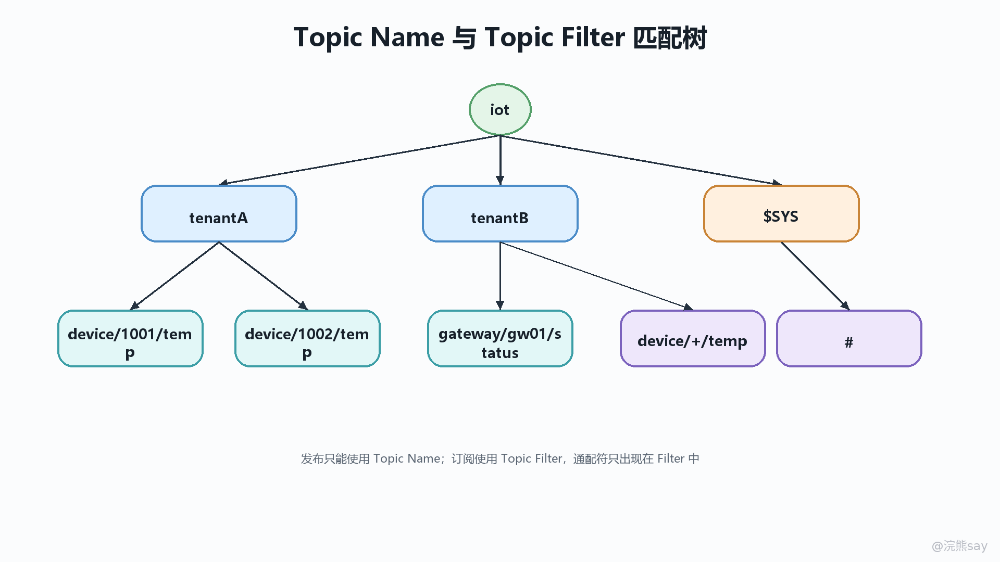
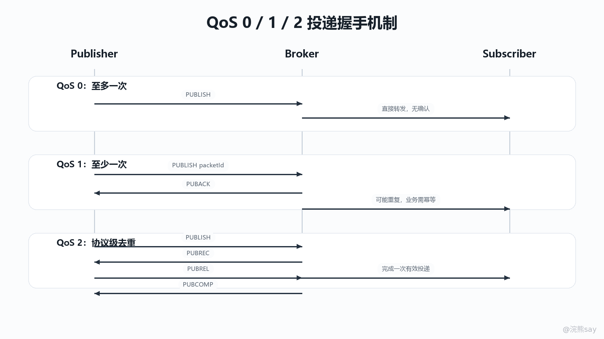

# MQTT Topic 路由、订阅匹配与消息语义

MQTT 的消息分发不是按队列名投递，也不是像 HTTP 一样由请求方直接指定接收方。它使用 Topic Name 与 Topic Filter 建立发布订阅模型：发布端在 PUBLISH 报文里携带 Topic Name、Payload、QoS、Retain 标志等字段；订阅端在 SUBSCRIBE 报文里提交 Subscription，每个 Subscription 由 Topic Filter 和最大 QoS 组成。Broker 收到发布消息后，用 Topic Name 去匹配已登记的 Topic Filter，再按会话、授权 QoS、保留消息、遗嘱消息等规则完成下发。

在 Java 后端和 IoT 项目里，MQTT 最容易被问错的地方不是“它是轻量级协议”，而是消息语义边界。Topic 只是路由命名空间，不等于业务幂等键；QoS 只定义单跳 MQTT 协议上的交付确认，不保证业务侧只处理一次；Retained Message 是 Broker 针对某个 Topic Name 保存的最后状态，不是客户端离线期间的消息队列；Last Will 是异常断线后的代理发布机制，可以被设置为 retained，但它本身不是 retained 的同义词。

## Topic 模型的核心边界

### Topic Name 与 Topic Filter 不是同一种字符串

Topic Name 是发布消息携带的路由名，存在于 PUBLISH 报文中，用来描述“这条应用消息属于哪个主题”。Topic Filter 是订阅端表达兴趣范围的过滤条件，存在于 Subscription 中，用来描述“我想接收哪些 Topic Name 上的消息”。二者都使用 / 作为主题层级分隔符，但协议给它们设置了不同约束：Topic Name 不能包含通配符，Topic Filter 可以包含通配符 + 和 #。

这个区别是 MQTT 题目里的高频陷阱。发布端不能向 device/+/status 发布消息，因为 + 在这里不是普通字符，而是只能出现在 Topic Filter 中的通配符。发布端应该发布到一个具体 Topic Name，例如 device/d1001/status；订阅端可以订阅 device/+/status，让 Broker 帮它匹配多个设备状态主题。
| 维度 | Topic Name | Topic Filter |
| --- | --- | --- |
| 所在报文 | PUBLISH | SUBSCRIBE 中的 Subscription |
| 作用 | 标识一条消息所属的具体主题 | 表达订阅方感兴趣的主题集合 |
| 是否允许通配符 | 不允许 +、# | 允许 +、#，但必须符合边界规则 |
| 典型例子 | factory/a/device/001/telemetry | factory/+/device/+/telemetry |
| 面试表达 | 发布消息的精确路由键 | Broker 用来匹配 Topic Name 的订阅模式 |

从后端建模角度看，Topic Name 更接近消息路由键，而不是数据库主键。它可以包含租户、产品、设备、事件类型等维度，例如 tenant/{tenantId}/product/{productKey}/device/{deviceId}/property/post。但 Topic Name 不应该承载过多业务状态，也不应该把所有查询条件都塞进层级里，否则订阅匹配会变成不可治理的字符串约定。

### Broker 路由是发布订阅解耦

MQTT 的发布端通常不知道有哪些订阅端在线，也不知道最终由哪个服务消费消息。发布端只负责向 Broker 发送 PUBLISH，Broker 负责维护订阅表、会话状态和消息下发。订阅端也不是向某个发布端建立连接，而是向 Broker 提交 Topic Filter。这个设计带来的解耦非常明显：设备上报遥测数据时不需要知道后面是告警服务、时序库写入服务还是规则引擎；新增一个订阅服务也不要求改设备固件。

这类解耦也带来工程边界。第一，Broker 只做协议层路由和交付，不理解业务幂等、业务事务和跨 Topic 聚合。第二，同一个 Topic Name 可以匹配多个订阅者，消息可能被多个后端服务同时消费，不能默认“一个 Topic 等于一个消费者”。第三，订阅匹配是基于 Topic Name 与 Topic Filter 的字符串层级规则，不是 SQL 条件，也不是正则表达式。项目复盘时如果把 MQTT 说成“消息队列的轻量版”，容易漏掉它的核心差异：队列强调消费者组内竞争消费，MQTT 的默认模型强调基于主题的多播分发。

## Topic Filter 匹配规则

### 层级分隔符与零长度层级

MQTT 使用 / 表示 Topic 层级。factory/a/device/001/status 可以理解为五个层级：factory、a、device、001、status。分隔符本身有匹配意义，不能简单当成普通字符串包含关系。例如 factory/+/status 只匹配三层结构，不会匹配 factory/a/device/status。

相邻的 / 会形成零长度层级。例如 factory//status 中间有一个空层级。协议允许 Topic Name 和 Topic Filter 中出现主题层级分隔符，空层级也会参与匹配。因此 factory/+/status 可以匹配 factory//status，因为 + 匹配的是一个层级，这个层级可以是零长度。后端项目里一般不建议主动设计空层级，因为它会让 ACL、监控和日志检索变得困难，但面试时要知道这不是简单的非法字符串问题。

大小写也有意义。Device/001/status 与 device/001/status 是不同 Topic。IoT 平台通常会约定 Topic 命名全部小写，并限制业务侧自由拼接 Topic，原因不是协议不支持大小写，而是统一命名可以降低订阅遗漏、权限配置和数据治理成本。

### \+ 与 # 的匹配边界

\+ 是单层通配符，只匹配一个 Topic 层级。它可以出现在 Topic Filter 的任意层级，包括首层和末层，但必须占据完整层级。也就是说，device/+/status 合法，device/+/+ 合法，device/+abc/status 不合法，因为 + 没有独立占据一个层级。device/+ 不匹配 device，但可以匹配 device/，因为后者存在一个零长度末层。

\# 是多层通配符，匹配父层级及其任意数量的子层级。它必须单独出现，或者跟在主题层级分隔符 / 后面，并且必须是 Topic Filter 的最后一个字符。device/# 可以匹配 device、device/001、device/001/status；# 可以匹配所有普通应用主题；device/#/status 不合法，device/a# 也不合法。
| Topic Filter | 是否合法 | 可匹配示例 | 不匹配或问题 |
| --- | --- | --- | --- |
| device/+/status | 合法 | device/001/status、device//status | device/001/property/status |
| device/# | 合法 | device、device/001、device/001/status | 不能继续追加层级 |
| +/status | 合法 | device/status | 对 $SYS/status 这类系统主题有特殊边界 |
| device/+abc/status | 不合法 | 无 | + 没有占据完整层级 |
| device/#/status | 不合法 | 无 | # 不是最后一个字符 |

系统主题还有一个单独边界：Broker 不应该用以通配符开头的 Topic Filter 去匹配以 $ 开头的 Topic Name。也就是说，订阅 # 或 +/# 不应自动收到 $SYS/... 这类 Broker 系统主题；如果需要订阅系统主题，应该显式写 $SYS/#。这个规则能避免普通业务订阅误收 Broker 运行指标，也能让平台把系统主题和应用主题的权限隔离开。

### Topic 设计要服务权限和可观测性

Topic Filter 一旦设计得过宽，问题通常不是“能不能收到消息”，而是“收到以后能不能安全治理”。例如后端服务订阅 # 可以快速调试，但在生产环境会绕过租户、产品线、消息类型的隔离边界，还会让服务承受大量无关消息。更稳妥的做法是把 Topic 命名和权限模型放在一起设计：首层区分租户或产品，末层区分事件语义，中间层放设备标识或网关标识。

一个可复盘的 IoT Topic 设计通常会遵循三个原则。第一，层级语义稳定，不把高频变化的状态值放进 Topic 层级。第二，过滤维度有限，允许平台按租户、产品、设备、事件类型配置 ACL。第三，Topic 与 Payload 分工清楚，Topic 负责路由与粗粒度分类，Payload 承载具体属性、时间戳、序列号、业务状态和签名字段。

images/mqtt-03-topic-filter-tree.png

## QoS 机制与协议握手

### QoS 是协议交付语义，不是业务处理语义

MQTT 的 QoS 定义的是 PUBLISH 消息在发送方与接收方之间的协议交付保证。QoS 0 是 at most once，至多一次，发送后不等待确认，消息可能丢失但不会因协议重发而产生重复。QoS 1 是 at least once，至少一次，发送方发送 PUBLISH 后等待 PUBACK，如果确认丢失或超时，发送方可以重发，因此接收方可能看到重复消息。QoS 2 是 exactly once 的协议语义，通过 PUBLISH、PUBREC、PUBREL、PUBCOMP 四步握手避免同一条 QoS 2 协议消息被接收方重复交付给上层。

images/mqtt-03-qos-handshake-ladder.png

这张图要重点看 Packet Identifier 的生命周期。QoS 1 和 QoS 2 的确认报文必须对应原始 PUBLISH 的 Packet Identifier，Broker 和 Client 都依赖它识别正在进行的协议交换。QoS 2 的“四步”不是为了让业务数据库天然只写一次，而是为了把协议层的接收与释放拆开：接收方用 PUBREC 表示已经收到 QoS 2 PUBLISH，发送方用 PUBREL 表示可以释放，接收方最终用 PUBCOMP 结束这次交换。
| QoS | 协议交互 | 交付语义 | 典型场景 | 主要代价 |
| --- | --- | --- | --- | --- |
| 0 | PUBLISH | 至多一次，可能丢 | 高频遥测、可容忍下一次覆盖的状态采样 | 无确认，无法感知单条丢失 |
| 1 | PUBLISH / PUBACK | 至少一次，可能重复 | 指令下发、告警事件、重要状态变更 | 需要幂等处理 |
| 2 | PUBLISH / PUBREC / PUBREL / PUBCOMP | 协议层恰好一次 | 极少量高价值消息、不能重复交付给 MQTT 接收端的场景 | 往返次数多，状态管理复杂 |

### QoS 的实际下发还受订阅最大 QoS 影响

Subscription 中包含最大 QoS，Broker 给订阅端转发应用消息时，不能只看发布端的 QoS，还要看订阅端被授予的最大 QoS。一个常见表达是：发布端的 QoS 表示“发布端到 Broker 这段愿意承担的交付级别”，订阅端的最大 QoS 表示“Broker 到订阅端这段允许使用的最高交付级别”。如果设备以 QoS 1 上报，而后端只订阅 QoS 0，Broker 下发给后端时就可能降级为 QoS 0。

这也是为什么 MQTT 的 QoS 不能简单写成“端到端 Exactly Once”。协议链路被 Broker 分成多段，发布端到 Broker、Broker 到订阅端分别执行 QoS 交互。Broker 接收成功以后，是否持久化、是否转发给离线会话、是否根据订阅最大 QoS 降级、是否因为客户端重连而重传，都会影响后端最终看到的消息形态。面试里如果被追问“QoS 2 能不能保证数据库只插入一次”，正确回答应当是：QoS 2 能降低 MQTT 协议层重复交付，但业务写入仍然要靠消息唯一标识、幂等表、状态机或去重窗口来保证。

## Retained Message 与最后状态

### Retained Message 保存的是某个 Topic Name 的最后一条 retained 发布

Retained Message 是 Broker 针对具体 Topic Name 保存的最后一条带 Retain 标志的应用消息。发布端发送 PUBLISH 时，如果 Retain 标志为 1，Broker 会用这条消息替换该 Topic Name 上已有的保留消息，并把它用于未来新订阅者的初始状态下发。新的非共享订阅建立时，如果 Topic Filter 匹配到某些 Topic Name 上存在 retained message，Broker 会按保留消息处理选项把这些消息发给订阅端。

保留消息的典型价值是“状态补齐”。例如设备不定期上报在线状态、固件版本、当前配置摘要，后端控制台新订阅 tenant/t1/device/+/status 时，不必等待所有设备下一次主动上报，就可以先拿到 Broker 保存的最近状态。它适合表达“当前值”，不适合表达“历史事件流”。如果把所有告警事件都设置 retained，后来的订阅者只会看到最后一条保留告警，而不是完整告警历史。

删除 retained message 的方式也来自发布语义：对相同 Topic Name 发送 Retain 标志为 1 且 Payload 长度为 0 的 PUBLISH，Broker 会删除该 Topic Name 上的保留消息，未来订阅者不会再收到它。这个行为经常被用在设备注销、配置撤销、状态过期等场景。需要注意的是，Retain 标志为 0 的普通 PUBLISH 不会替换或删除已有保留消息。

### Retained 不是会话状态，也不是离线消息队列

Retained Message 不属于客户端会话状态。它由 Broker 按 Topic Name 保存，和某个订阅客户端是否在线没有直接关系。会话状态关注的是客户端订阅、未完成 QoS 1/QoS 2 流程、离线期间待投递消息等；Retained Message 关注的是“某个 Topic Name 当前最后状态是什么”。因此，清理客户端会话不等于清理 retained message，删除 retained message 也不等于清理某个客户端的离线队列。

这个边界在 IoT 项目里很关键。设备状态页需要展示最新在线状态时，可以让状态上报使用 retained；业务事件审计、告警流水和指令执行记录则应该进入数据库、日志系统或流式平台，不能指望 retained message 保存历史。后端复盘时可以这样表述：Retained Message 解决新订阅者的初始状态问题，不解决离线期间的全量事件补偿问题。

## Last Will 与 retained 的关系

### Last Will 是异常断线后的代理发布

Last Will Message 是客户端在 CONNECT 时预先交给 Broker 的遗嘱消息。客户端异常断线、网络连接非正常关闭、协议错误导致连接关闭等场景发生时，Broker 会在满足条件后代表该客户端发布 Will Message。MQTT 5.0 还引入 Will Delay Interval，可以延迟发布遗嘱，用来过滤短暂网络抖动。如果客户端在延迟时间内恢复同一会话，Broker 不应发送 Will Message。

从机制上看，Last Will 是“异常下线通知”，不是心跳本身。心跳依靠 Keep Alive 和 PINGREQ/PINGRESP 帮助 Broker 判断连接是否仍然可用；Will 是连接被判定异常结束后的发布动作。项目里常见做法是设备连接时设置 Will Topic，例如 tenant/t1/device/d1001/status，Will Payload 表示 offline，正常上线后设备主动向同一 Topic 发布 online。这样后端订阅设备状态主题时，可以把正常上线消息和异常离线遗嘱放在同一个状态模型里处理。

### Will Retain 决定遗嘱发布后是否成为保留消息

Last Will 与 retained 的关系是组合关系，不是同义关系。Will Message 可以设置 Will Retain。如果 Will Retain 为 0，Broker 在触发遗嘱时发布一条非 retained 消息；如果 Will Retain 为 1，Broker 在触发遗嘱时把 Will Message 作为 retained message 发布。也就是说，retained 描述的是“这次发布是否要成为 Topic Name 的最后保留状态”，Will 描述的是“这次发布是否由 Broker 在客户端异常断线后代发”。

这一区分经常用于设备在线状态设计。设备正常连接成功后向状态 Topic 发布 retained 的 online；连接异常断开后 Broker 发布 retained 的 offline Will。新订阅者进入系统时，会立即收到该设备状态 Topic 上最后一次 retained 状态。如果不设置 Will Retain，新订阅者可能只能看到设备曾经在线的 retained 状态，而看不到异常离线后的最终状态；如果所有状态都不使用 retained，新订阅者只能等待下一次状态变化。

## Java 后端项目中的重复消息与幂等设计

### 重复消息来自协议重传、会话恢复和业务重试

MQTT 项目中看到重复消息并不一定是 Broker 出错。QoS 1 允许重复，这是“至少一次”语义的结果；客户端或 Broker 在未收到确认时可以重发 PUBLISH。QoS 2 在协议层有更强约束，但重连、会话恢复、客户端实现差异、业务侧重复发布仍然可能让后端看到语义上重复的业务事件。更重要的是，Broker 只知道 Packet Identifier 和协议流程，不知道你的 orderId、commandId、eventId 是否已经处理过。

Java 后端消费 MQTT 时，不能把 messageArrived 或回调执行等同于业务成功。回调里通常还要经过反序列化、签名校验、幂等校验、数据库写入、状态流转和异步任务提交。任何一个环节失败后重试，都可能让同一业务事件再次进入处理链路。因此项目复盘要把“MQTT QoS”与“业务幂等”分开讲：QoS 负责传输确认，幂等负责业务状态只被有效推进一次。

### 幂等键要来自业务语义，而不是只依赖 Topic

幂等设计的第一步是给消息定义稳定唯一标识。设备上报可以包含 eventId、deviceId + seq、deviceId + timestamp + type 等字段；指令下发可以使用 commandId；属性状态可以使用 version 或 reportedAt 做新旧判断。Topic Name 可以参与定位设备和事件类型，但不适合作为唯一幂等键，因为同一 Topic 下会有大量不同消息。

后端落地时常见三种策略。第一，幂等表或唯一索引：以 tenantId + deviceId + eventId 建唯一约束，重复插入直接忽略或读取已有结果。第二，状态机推进：指令只能从 CREATED 到 SENT、ACKED、DONE，重复 ACK 不改变终态。第三，短窗口去重：对高频遥测使用 Redis 或本地缓存记录最近序列号，适合吞吐高、历史精确性要求较低的场景。对于金额、库存、工单这类强一致业务，应该优先使用数据库唯一约束或事务状态机，而不是只靠内存去重。

还要注意顺序问题。MQTT 可以在单连接、单 Topic、特定 QoS 条件下维持较强的发送顺序，但一旦涉及多个 Topic、多客户端、多 Broker 集群、异步落库和后端线程池，业务处理顺序就不能只依赖协议直觉。IoT 平台通常会在 Payload 中加入 seq 或 eventTime，后端按设备维度比较版本，避免旧状态覆盖新状态。

### 面试和项目复盘的表达模板

面试里回答 MQTT Topic 和消息语义，可以按“路由模型、匹配规则、交付语义、业务兜底”四层展开。先说明发布端使用具体 Topic Name，订阅端使用 Topic Filter，Broker 根据层级规则完成匹配；再说明 + 匹配单层且必须占完整层级，# 匹配多层且必须放末尾；接着说明 QoS 0/1/2 的确认链路和重复边界；最后落到项目里如何用 retained 保存最新状态、用 Last Will 处理异常离线、用业务幂等键抵消 QoS 1 重复和重试带来的影响。

一个比较稳的项目表述是：我们把 Topic 设计成 tenant/product/device/event 这类层级，订阅端按服务职责使用有限范围的 Topic Filter，生产环境不允许业务服务订阅裸 #。设备状态类消息使用 retained，保证控制台和规则服务新订阅时能拿到最新状态；异常离线通过 Last Will 发布到同一状态 Topic，并根据需要设置 Will Retain。对于 QoS，我们让高频遥测使用 QoS 0 或 QoS 1，指令和告警使用 QoS 1，业务侧用 eventId、commandId、唯一索引和状态机做幂等，不把 MQTT QoS 当成数据库 Exactly Once。

准备到这个程度，基本能覆盖 Java 后端八股里关于 MQTT 的核心追问：Topic Name 和 Topic Filter 为什么不能混用，通配符有哪些合法边界，Retained Message 与离线消息有什么区别，Will 和 retained 怎样组合，QoS 1 为什么会重复，QoS 2 为什么仍然不能替代业务幂等。
