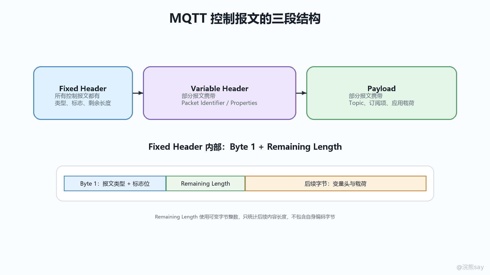
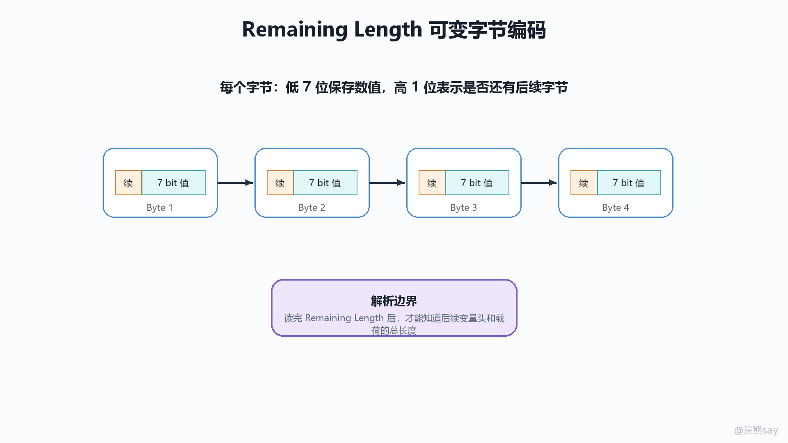

# 06 控制报文、固定报头与编码规则

学习 MQTT 时，Topic、QoS、会话和保活更容易被记住，但真正让这些语义运行起来的是控制报文本身。MQTT 不是把一段文本发给 Broker 后由 Broker 猜测含义，而是把每一次连接、发布、订阅、确认、保活和断开都编码成明确的 Control Packet。Broker 和 Client 收到字节流后，先按固定报头识别报文类型和长度，再按该类型解析可变报头与载荷，最后根据当前会话状态推进协议状态机。

OASIS MQTT 5.0 与 MQTT 3.1.1 在基本报文骨架上保持一致：每个控制报文都有 Fixed Header，部分报文有 Variable Header，部分报文有 Payload。MQTT 5 在这个骨架上增加了 Properties、更多 Reason Code、AUTH 报文和更细的错误处理语义，但并没有推翻“轻量二进制控制报文驱动状态”的核心设计。

## 一、控制报文是 MQTT 状态机的输入

### 1\. 三段式结构：Fixed Header、Variable Header、Payload

MQTT 控制报文可以从外向内分成三层。第一层是 Fixed Header，它出现在每一个控制报文中，最少 2 字节、最多 5 字节：第 1 字节负责表达 Control Packet type 和报文专用标志，后续 1 到 4 字节用 Remaining Length 表示本报文剩余部分的长度。这里的“固定”不是说长度固定，而是说所有控制报文都必须先出现这一层，解析器一定从它开始。

第二层是 Variable Header。它位于 Fixed Header 之后、Payload 之前，但并不是每种报文都有，也不是每种报文内容相同。CONNECT 的可变报头要声明协议名、协议级别、连接标志和 Keep Alive；PUBLISH 的可变报头要携带 Topic Name，QoS 大于 0 时还要携带 Packet Identifier；SUBSCRIBE、UNSUBSCRIBE 和确认类报文通常要携带 Packet Identifier。MQTT 5 的 Properties 也主要通过可变报头加入，用来表达会话过期、接收窗口、Topic Alias、Reason String 等扩展语义。

第三层是 Payload。Payload 承载的是该报文真正需要提交给对端的数据，但它不是“所有业务数据的统一仓库”。CONNECT 的 Payload 包含 Client Identifier、Will、User Name、Password 等连接材料；PUBLISH 的 Payload 才是应用消息内容；SUBSCRIBE 的 Payload 是 Topic Filter 与订阅选项；PINGREQ、PINGRESP、PUBACK 等报文没有 Payload。把这三层分清楚，才能解释为什么 MQTT 能同时做到轻量、可流式解析、又能在不同控制动作里表达不同语义。

images/mqtt-06-control-packet-anatomy.png

### 2\. Broker 和 Client 如何按报文推进状态

Broker 与 Client 都不是按“方法调用”理解 MQTT，而是按控制报文驱动状态。Client 发出 CONNECT 后，Broker 解析协议版本、ClientId、认证材料、Clean Start/Clean Session、Keep Alive 和遗嘱配置，决定是否建立网络连接对应的 MQTT Session，并通过 CONNACK 返回结果。连接建立后，PUBLISH、SUBSCRIBE、UNSUBSCRIBE、PINGREQ、DISCONNECT 等报文才有合法上下文；在 CONNECT 前发送 PUBLISH，或者在未协商能力的情况下使用不被支持的 MQTT 5 特性，都不是普通业务失败，而是协议层错误。

QoS 流程更能体现“报文即状态机输入”。QoS 1 的发送方发出带 Packet Identifier 的 PUBLISH 后，把该消息放入未完成确认集合，等待对端 PUBACK；收到 PUBACK 后，才能释放该 Packet Identifier，并认为该次协议投递完成。QoS 2 则通过 PUBLISH、PUBREC、PUBREL、PUBCOMP 四步推进，双方都要记住中间状态，避免重复投递和确认错乱。这里 Broker 并不需要理解 Payload 的业务含义，它只要按报文类型、标志位、Packet Identifier 和会话状态推进协议即可。

## 二、固定报头：先决定这是什么报文

### 1\. 第 1 字节：类型与标志

Fixed Header 的第 1 字节被拆成高 4 位和低 4 位。高 4 位是 MQTT Control Packet type，用 1 到 15 表达具体报文类型；低 4 位是该类型自己的 Flags。这个设计非常紧凑：解析器只读 1 个字节，就知道后续应该走 CONNECT 解析路径、PUBLISH 解析路径、订阅解析路径还是确认解析路径。对于低功耗设备和大量长连接场景，少一个字节都是实际收益，因为连接数和报文频率会把协议开销放大。

低 4 位不能随便使用。除 PUBLISH、PUBREL、SUBSCRIBE、UNSUBSCRIBE 之外，大多数报文的低 4 位必须是 0000；PUBREL、SUBSCRIBE、UNSUBSCRIBE 的固定标志必须是 0010；PUBLISH 的低 4 位才被拆成 DUP、QoS、RETAIN。DUP 表示这可能是一次重复发送，QoS 两位表达 0、1、2 三种交付等级，11 是非法组合，RETAIN 表示是否更新保留消息。接收方如果收到某类报文不允许的固定标志，应把它视为 Malformed Packet，而不是宽容地继续猜测。

### 2\. 控制报文类型与通信方向

MQTT 5 的控制报文类型可以按职责记忆。CONNECT 只能 Client 发给 Server，CONNACK 只能 Server 发给 Client，它们负责建立协议层连接。PUBLISH 可以双向出现，代表应用消息从某一端交给 Broker 或由 Broker 转发给订阅端。PUBACK、PUBREC、PUBREL、PUBCOMP 可以双向出现，服务于 QoS 1/2 的确认流程。SUBSCRIBE、UNSUBSCRIBE 只能由 Client 发给 Server，SUBACK、UNSUBACK 只能由 Server 返回。PINGREQ 由 Client 发起，PINGRESP 由 Server 返回，用来维持沉默连接的可见性。DISCONNECT 在 MQTT 5 中可以双向发送，用来表达有原因的正常断开或协议错误断开；AUTH 是 MQTT 5 新增的认证交换报文，也可以双向出现。

MQTT 3.1.1 与 MQTT 5 的主要差异在于 MQTT 3.1.1 没有 AUTH 报文，断开原因和错误反馈能力也更弱。面试中如果被问“MQTT 5 改了什么”，不能只说多了 Properties，还要能说出控制报文层面的变化：同样的三段式结构继续保留，但 MQTT 5 让更多控制报文可以携带属性和原因码，使 Broker 与 Client 能在协议层表达能力协商、拒绝原因、重定向、认证继续和更明确的断开语义。

## 三、Remaining Length：流式解析的边界

### 1\. 它定义的是当前报文剩余多少字节

Remaining Length 表示当前控制报文中 Fixed Header 之后还剩多少字节，也就是 Variable Header 加 Payload 的总长度。它不包含第 1 字节，也不包含编码 Remaining Length 自己所用的字节。因此一个 MQTT 报文的总长度可以理解为：1 字节报文类型与标志 + Remaining Length 编码字节数 + Remaining Length 表示的剩余字节数。

这个字段对流式解析很关键。MQTT 通常运行在 TCP 之上，而 TCP 是字节流，不保留应用层消息边界。接收方读到第 1 字节后，只知道报文类型，还不知道这一帧到哪里结束；继续解析 Remaining Length 后，才知道应该再读取多少字节才能得到完整控制报文。Broker 能够用它做边界控制、缓冲区分配、最大报文检查和半包处理；Client SDK 也能据此判断一条报文是否已经收完整，而不是把后一个报文的开头误当成当前 Payload 的一部分。

### 2\. 为什么使用 Variable Byte Integer

Remaining Length 使用 Variable Byte Integer，而不是固定 4 字节整数，是 MQTT 轻量设计的典型体现。大量控制报文非常短，例如 PINGREQ、PINGRESP、DISCONNECT 在常见情况下只有极少字节；SUBSCRIBE、PUBACK、CONNACK 也通常不大。如果每个报文都固定使用 4 字节长度字段，小报文会长期携带无意义的 0。Variable Byte Integer 用每字节低 7 位保存数值，高 1 位作为 continuation bit，表示后面是否还有长度字节。这样 0 到 127 只需要 1 字节，128 到 16383 需要 2 字节，最大可表达 268435455，最多 4 字节。

解析时可以按一个简单循环理解：每读一个长度字节，就取低 7 位乘以当前倍率累加；如果最高位为 1，说明还有下一个长度字节，倍率乘以 128；如果最高位为 0，长度结束。如果读到第 5 个长度字节仍未结束，或者编码出的值超过允许范围，就属于格式错误。这个设计的好处是小报文省空间，大报文仍有足够范围；代价是解析器必须严格处理 continuation bit 和最多 4 字节的边界，不能把任意长的长度前缀读下去，否则会给恶意连接留下消耗内存和 CPU 的入口。

images/mqtt-06-remaining-length-encoding.png

## 四、可变报头、Payload 与 Packet Identifier

### 1\. 可变报头为什么随类型变化

Variable Header 的存在，是为了让“通用报文外壳”和“具体控制动作”解耦。Fixed Header 只解决“这是什么类型、这一帧多长”；Variable Header 解决“这个类型完成动作还需要哪些控制字段”。CONNECT 需要协议名、版本、连接标志和 Keep Alive，因为 Broker 必须先确认双方使用同一种协议语义；PUBLISH 需要 Topic Name，因为 Broker 要按 Topic 路由；SUBSCRIBE 需要 Packet Identifier，因为之后的 SUBACK 要与本次订阅请求对应；PUBACK 需要 Packet Identifier，因为它确认的是某一条未完成的 QoS 1 PUBLISH。

MQTT 5 的 Properties 进一步说明了可变报头的价值。协议没有把所有扩展字段硬塞进固定位置，而是在不同报文的可变报头或 Payload 前部加入属性集合，并规定每种属性可以出现在哪类报文里。这样既能保持老版本的核心骨架，又能在 MQTT 5 中表达 Session Expiry、Receive Maximum、Topic Alias、Maximum Packet Size、Reason String、User Property 等工程能力。实现上，Broker 不能把 Properties 当作任意 KV 透传，而要按报文类型校验属性是否合法、是否允许重复、长度是否超过限制。

### 2\. 哪些控制报文有 Packet Identifier

Packet Identifier 是 2 字节无符号整数，取值不能为 0，用来在一个 Session 内关联请求、响应和未完成的 QoS 流程。它不是消息全局 ID，也不是业务幂等键；它只在协议会话和当前交互范围内有意义。发送方分配 Packet Identifier 后，必须等对应流程完成才能复用，否则对端无法判断收到的是重传、确认还是另一条新消息。

需要 Packet Identifier 的报文可以按三组记忆。第一组是 QoS 相关的 PUBLISH：QoS 0 的 PUBLISH 不能携带 Packet Identifier，因为它没有确认流程；QoS 1 和 QoS 2 的 PUBLISH 必须携带 Packet Identifier。第二组是发布确认链路：PUBACK、PUBREC、PUBREL、PUBCOMP 都必须携带 Packet Identifier，并且要与对应 PUBLISH 使用同一个值。第三组是订阅管理链路：SUBSCRIBE、SUBACK、UNSUBSCRIBE、UNSUBACK 都必须携带 Packet Identifier，用来让 Client 知道哪个订阅或取消订阅请求得到了响应。

不携带 Packet Identifier 的典型报文包括 CONNECT、CONNACK、PINGREQ、PINGRESP、DISCONNECT，以及 MQTT 5 的 AUTH。这里有一个常见误区：Client 到 Broker 的 Packet Identifier 与 Broker 到 Client 的 Packet Identifier 是可以独立分配的，双方甚至可能同时使用相同数值处理不同方向的消息交换；只要每一方在自己的发送方向上不重复占用未完成的 Packet Identifier，就不会冲突。

### 3\. Payload 不是所有报文都有

Payload 是否存在取决于控制报文类型。PUBLISH 的 Payload 是应用消息，所以它可以是任意二进制数据；Broker 默认不理解其业务含义，只按 Topic、QoS、Retain、属性和会话规则处理。SUBSCRIBE 的 Payload 是一个或多个 Topic Filter 与订阅选项，UNSUBSCRIBE 的 Payload 是要取消的 Topic Filter 列表。CONNECT 的 Payload 则是连接身份与可选认证材料，虽然也叫 Payload，但它不是应用消息。

没有 Payload 的报文同样重要。PINGREQ/PINGRESP 只需要固定报头就能表达保活动作；PUBACK 等确认报文主要通过 Packet Identifier 和可选原因码表达结果；DISCONNECT 在 MQTT 5 中可以通过 Reason Code 和 Properties 表达断开原因，但仍不需要业务载荷。理解这一点后，就不会把 MQTT 的 Payload 简单等同于 HTTP Body，也不会误以为每条控制报文后面都应该有业务数据。

## 五、字符串、属性与错误边界

### 1\. UTF-8 Encoded String 的长度和字符约束

MQTT 报文中的 Topic Name、Topic Filter、Client Identifier、User Name、Reason String、User Property 名称和值等文本字段，通常使用 UTF-8 Encoded String。它的格式不是“直接写字符串”，而是先用 2 字节整数表示 UTF-8 字节长度，再跟随对应字节数据；因此单个 UTF-8 Encoded String 的最大长度是 65535 字节。这里限制的是编码后的字节数，不是 Java String.length() 的字符数，中文、emoji、组合字符都会让字符数和字节数不一致。

规范还要求这些字符串必须是合法 UTF-8，不能包含 Unicode surrogate code points，也不能包含空字符 U+0000。接收方如果在控制报文中发现非法 UTF-8 或 U+0000，应按 Malformed Packet 处理。工程上这意味着 Broker 和 SDK 不能只检查 Java 字符串是否非空，还要在编码边界检查字节长度和非法码点；Topic、ClientId、User Property 这类字段一旦校验不严，问题会从普通文本错误升级为协议解析错误。

### 2\. Malformed Packet 与 Protocol Error 的区别

Malformed Packet 指控制报文无法按规范解析，例如 Remaining Length 编码超过 4 字节、固定标志位非法、PUBLISH 的 QoS 位为 11、UTF-8 字符串格式错误、必须存在的字段缺失。它的核心是“字节结构本身不成立或无法正确解析”。这类错误通常说明对端实现有 bug、版本不匹配，或者存在恶意构造报文，接收方不能继续按正常状态机处理。

Protocol Error 指报文能被解析出来，但解析后的内容不被当前协议状态允许，或者与 Client/Server 当前状态不一致。例如连接建立前发送非 CONNECT 报文，超过对端声明的 Maximum Packet Size，使用对端声明不支持的 Shared Subscription 或 Subscription Identifier，Topic Alias 为 0 或超过上限，Clean Start、Session Expiry 等状态组合违反规则。它的核心是“字节能读懂，但语义不合法”。

MQTT 5 相比 MQTT 3.1.1 更强调可诊断错误处理。接收方在能力允许时可以通过 DISCONNECT 携带 Reason Code，如 0x81 表示 Malformed Packet，0x82 表示 Protocol Error，0x95 表示 Packet too large，0x93 表示 Receive Maximum exceeded。面试中要注意区分：错误处理不是业务异常处理，协议错误通常会导致连接关闭或会话状态清理；业务失败应该放在应用 Payload 或请求响应语义里表达，而不是伪装成 MQTT 协议错误。

## 六、从字节解析到面试表达

### 1\. 一条报文在 Broker 中的处理链路

Broker 收到网络字节流后，第一步是读取 Fixed Header 的第 1 字节，识别 Control Packet type 和固定标志。第二步解析 Remaining Length，确定当前控制报文边界，并检查是否超过 Broker 的最大报文限制。第三步按报文类型解析 Variable Header 和 Payload，例如 CONNECT 解析连接参数，PUBLISH 解析 Topic、Packet Identifier、Properties 和应用 Payload，SUBSCRIBE 解析订阅过滤器与选项。第四步做协议校验，包括固定标志、UTF-8 字符串、属性合法性、Packet Identifier 是否允许、当前连接状态是否允许该报文。第五步才进入动作执行：建立会话、路由消息、更新 Retained Message、写入离线队列、推进 QoS 确认状态、返回 ACK 或关闭连接。

Client SDK 的处理链路类似，只是关注点不同。它既要把应用 API 调用编码成合法控制报文，也要把 Broker 返回的控制报文还原为连接结果、订阅结果、发布确认、消息回调和断开原因。优秀的 SDK 不会把所有失败都暴露成“连接断开”，而会保留 Reason Code、Packet Identifier、Topic、会话状态和重连上下文，帮助业务判断是网络抖动、鉴权失败、协议错误、报文过大还是 Broker 能力不支持。

### 2\. 面试表达

如果面试官问“MQTT 报文格式怎么设计”，可以这样回答：MQTT 控制报文采用三段式结构，每个报文都有固定报头，后面按类型可选可变报头和载荷。固定报头第 1 字节用高 4 位表示报文类型、低 4 位表示类型相关标志，后面用 Remaining Length 标明可变报头和载荷的总长度。Remaining Length 使用 Variable Byte Integer，是为了让短报文只占 1 字节长度字段，同时仍能表达较大的报文。Broker 和 Client 都是根据控制报文推进状态机：CONNECT 建连接，PUBLISH 触发路由，SUBSCRIBE 更新订阅，PUBACK/PUBREC/PUBREL/PUBCOMP 推进 QoS 状态，PINGREQ/PINGRESP 做保活，DISCONNECT 表达断开。

如果继续追问“哪些报文有 Packet Identifier”，可以回答：Packet Identifier 是 2 字节非零整数，用来关联协议层未完成交互。QoS 0 的 PUBLISH 不能有 Packet Identifier，QoS 1/2 的 PUBLISH 必须有；PUBACK、PUBREC、PUBREL、PUBCOMP 都要带同一个 Packet Identifier 来完成确认；SUBSCRIBE、SUBACK、UNSUBSCRIBE、UNSUBACK 也都需要它来关联请求和响应。CONNECT、CONNACK、PINGREQ、PINGRESP、DISCONNECT，以及 MQTT 5 的 AUTH 不使用 Packet Identifier。它不是业务消息 ID，流程完成后可以复用，业务幂等仍要靠业务字段设计。

### 3\. 掌握标准

学完本章后，要能从字节解析视角解释 MQTT，而不是只背 Topic 和 QoS 名词。最低要求是能说清 Fixed Header、Remaining Length、Variable Header、Payload 四个概念的关系，知道 Remaining Length 为什么不包含自身长度，理解 Variable Byte Integer 的 7 位数据加 1 位延续标志设计，能列出需要 Packet Identifier 的报文类型，并能区分 Malformed Packet 与 Protocol Error。

更高一级的要求是能把报文结构和工程实现联系起来：Broker 为什么能从 TCP 字节流恢复消息边界，为什么固定标志位错误不能容忍，为什么 QoS 0 不需要 Packet Identifier，为什么 MQTT 5 用 Properties 扩展而不是重写固定报头，为什么 UTF-8 字符串校验会影响协议安全，以及为什么协议错误和业务错误必须分层处理。能讲到这些，才算真正理解 MQTT 控制报文的设计动机和实现边界。
