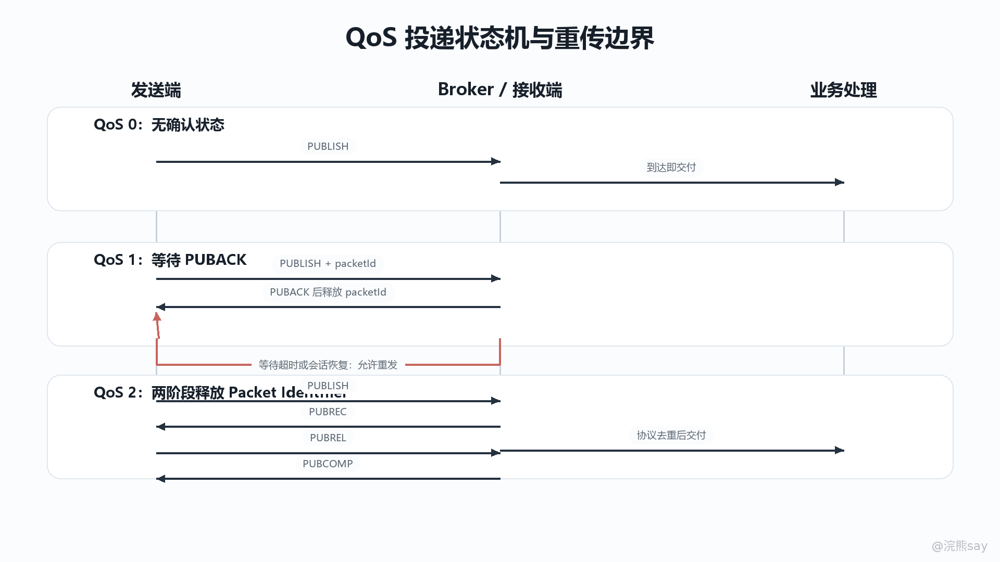
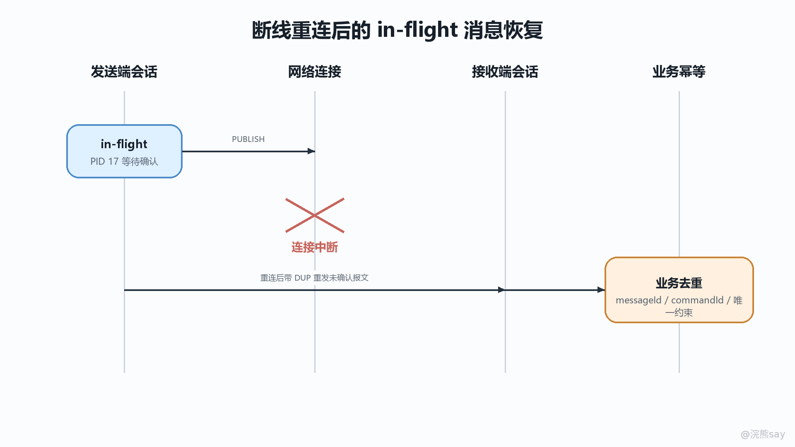

# 07 QoS状态机、报文标识符与重传边界

MQTT 的 QoS 不是一句“0 最快、1 至少一次、2 恰好一次”就能讲完。真正容易考、也容易在项目里踩坑的地方，是 QoS 背后的确认报文、报文标识符、会话状态和断线重连规则。协议可以尽量约束“这一跳 MQTT 报文如何被交付”，但无法替应用层完成数据库事务、接口幂等、业务去重和最终一致性控制。

images/mqtt-07-qos-state-machine.png

## 一、QoS 是单跳协议语义，不是业务恰好一次

### 协议只约束一次发送方到一次接收方

官方规范描述 QoS 流程时有一个非常关键的前提：投递协议只关心一个发送方到一个接收方之间的 Application Message 交付。这里的发送方和接收方可以是 Client 与 Server，也可以反过来，因为 PUBLISH、PUBACK、PUBREC、PUBREL、PUBCOMP 这些控制报文在两个方向上都可能出现。

这意味着 MQTT QoS 不是端到端业务事务。发布者把消息发给 Broker 是一跳，Broker 再把消息发给订阅者是另一跳。每一跳都有自己的 QoS、Packet Identifier 和确认状态。发布者使用 QoS 2 发给 Broker，并不代表 Broker 一定以 QoS 2 发给每个订阅者；Broker 给订阅者使用的 QoS 通常取决于发布消息 QoS 与订阅时授予 QoS 的共同约束。

所以面试里如果被问“MQTT QoS 2 是否保证业务恰好执行一次”，严谨回答应该是：QoS 2 保证的是协议层在一次发送方到接收方链路上的 Exactly once delivery 语义，重点是避免同一个协议交换中的重复投递；它不保证消费端业务逻辑恰好执行一次。消费者写数据库、调用下游接口、更新缓存这些动作仍然可能因为 ACK 时机、进程崩溃、事务提交和重试边界产生重复效果，必须由业务幂等承接。

### 入站 QoS 与出站 QoS 可以不同

Broker 在 MQTT 中不是简单的字节转发器，而是消息中介。它从发布者接收 Application Message 后，会根据订阅关系向一个或多个订阅者转发。规范明确强调：当 Server 把一条消息投递给多个 Client 时，每个 Client 都是独立处理的；投递给 Client 的出站 QoS 可以不同于发布者发给 Server 的入站 QoS。

举个工程场景：设备上报遥测数据时使用 QoS 1，Broker 成功接收后向两个订阅者转发。实时大屏订阅最大 QoS 为 0，它可能只需要最新数据；结算服务订阅最大 QoS 为 1 或 2，它需要更可靠的确认链路。这样同一条业务消息在不同订阅链路上会形成不同的协议状态机，不能用发布端的 QoS 推导所有消费端的可靠性。

### 三档 QoS 的状态成本

QoS 的本质是在“网络开销、状态保存、重复风险、丢失风险”之间做选择。QoS 0 没有确认报文，发送后不保存未确认状态，吞吐和延迟最好，但连接中断或链路异常时消息可能丢失。QoS 1 用 PUBACK 建立一次确认，发送方在收到 PUBACK 前必须把 PUBLISH 视为未确认，因此具备重传能力，但重复是协议允许的结果。QoS 2 用 PUBREC、PUBREL、PUBCOMP 拆成四步，减少同一个协议交换中的重复投递，但需要双方保存更多中间状态。

这里的“状态成本”不是抽象说法。QoS 1/2 会占用 Packet Identifier，会形成 in-flight messages，会进入 Client 或 Server 的 Session State；断线重连时，是否恢复这些状态取决于 Clean Start、Session Expiry Interval 或 MQTT 3.1.1 的 CleanSession 配置。因此 QoS 越高，不只是多发几个包，还会增加会话存储、重连恢复、重复处理和流控设计的复杂度。

## 二、QoS 0：无确认的最多一次

### 状态流转

QoS 0 的流程最短：发送方发送一个 QoS=0、DUP=0 的 PUBLISH 报文，接收方收到后即接受消息所有权，并向合适的后续接收者投递。接收方不会返回 PUBACK，发送方也不会因为没有确认而进行协议级重试。

从状态机角度看，QoS 0 几乎没有“未完成状态”。PUBLISH 发出去以后，发送方不需要保留 Packet Identifier，因为 QoS 0 的 PUBLISH 不能携带 Packet Identifier；也不进入未确认队列。接收方收到就是收到，没收到就是没收到，协议不会通过 ACK 或重发把这个结果补回来。

可以把它理解成：

Sender -- PUBLISH(QoS=0, DUP=0, no Packet Identifier) --> Receiver 
Sender: 发送后结束 
Receiver: 收到后接受消息，未收到则无补偿

### 适用边界

QoS 0 适合“可丢、可覆盖、最新值更重要”的数据，例如高频传感器采样、在线状态心跳、实时位置刷新、可重新查询的缓存通知。它不适合订单创建、支付扣款、库存扣减这类不能静默丢失的业务事件。

注意 QoS 0 并不等于一定丢，也不等于不可靠网络。MQTT 底层通常跑在 TCP 之上，TCP 本身提供有序可靠字节流；但 MQTT 协议层不会为 QoS 0 建立应用消息确认。如果连接在发送途中断开、Broker 没来得及处理、客户端进程崩溃，协议不会保存这个 PUBLISH 并在重连后补发。它的“最多一次”意思是：接收方要么收到一次，要么没收到，不会由 MQTT 对同一条 QoS 0 PUBLISH 做重传。

## 三、QoS 1：PUBACK 确认与重复来源

### 发送方状态机

QoS 1 的核心是 PUBLISH 与 PUBACK。发送方每发布一条新的 QoS 1 Application Message，都必须分配一个当前未使用的非零 Packet Identifier，把它放进 PUBLISH 可变报头，然后发送 QoS=1、DUP=0 的 PUBLISH。发送后，发送方不能立刻释放这条消息的协议状态，而是要把它视为 unacknowledged message，直到收到携带同一个 Packet Identifier 的 PUBACK。

状态流转可以写成：

S0: 准备发送新消息 
\-> 分配 unused Packet Identifier 
\-> 发送 PUBLISH(QoS=1, DUP=0, Packet Identifier=N) 
\-> 进入 S1: 等待 PUBACK 
 
S1: 等待 PUBACK 
\-> 收到 PUBACK(Packet Identifier=N) 
\-> 释放消息副本和 Packet Identifier 
\-> 结束 
 
S1: 等待 PUBACK 时连接断开，且重连后 Session 继续 
\-> 使用原 Packet Identifier 重发未确认 PUBLISH 
\-> 通常设置 DUP=1 
\-> 继续等待 PUBACK

这里有两个边界容易混淆。第一，Packet Identifier 在收到对应 PUBACK 后才可复用。第二，发送方等待某个 PUBACK 时，可以继续用其他 Packet Identifier 发送后续 QoS 1/2 报文，这些尚未完成确认的报文就是 in-flight messages。

### 接收方状态机

QoS 1 的接收方收到 PUBLISH 后，接受 Application Message 的所有权，并返回 PUBACK，PUBACK 必须携带原 PUBLISH 中的 Packet Identifier。协议规定，在接收方发送 PUBACK 后，如果又收到相同 Packet Identifier 的 PUBLISH，应该把它当作新的 Application Message，而不是因为编号相同就自动丢弃。

这条规则看起来反直觉，但它来自 Packet Identifier 的复用机制：同一个 Packet Identifier 只是在“当前未完成的协议交换”中唯一。发送方收到 PUBACK 后可以复用编号，接收方不能永久记住某个编号并认为后续都重复。否则一个长连接运行一段时间后，有限的 16 位 Packet Identifier 会很快无法复用。

### 为什么重复不可避免

QoS 1 的语义叫 At least once，重复不是异常，而是协议设计的一部分。典型重复来自 ACK 边界不一致：

1\. Sender 发送 PUBLISH(QoS=1, Packet Identifier=10) 
2\. Receiver 收到消息，执行业务处理，并发送 PUBACK(10) 
3\. PUBACK 在网络中丢失，或者 Sender 在收到前断线 
4\. Sender 认为消息仍未确认，重连后用原 Packet Identifier 重发 
5\. Receiver 再次收到同一条协议消息或同一业务事件

从发送方视角，它没有收到 PUBACK，就不能证明接收方已经接受消息；从接收方视角，它可能已经处理并回过 ACK，只是 ACK 没有到达发送方。二者都没有做错，但重复已经出现。

DUP 标志也不能作为业务去重依据。DUP=1 只表示发送端认为这是某个 PUBLISH 控制报文的重发尝试；接收方看到 DUP=1 不能断言自己一定见过早先副本。反过来，在 QoS 1 场景中，业务层完全可能收到内容重复但 Packet Identifier 不同、DUP=0 的消息，例如发布端应用自己重试了一次业务发布，或者上游系统本来就生产了重复事件。因此业务幂等不能依赖 DUP。

## 四、QoS 2：PUBREC/PUBREL/PUBCOMP 四步握手

### 四步分别解决什么

QoS 2 的目标是协议层 Exactly once delivery，因此它不能像 QoS 1 那样只靠一个 PUBACK 结束。原因在于，接收方“已经收到 PUBLISH”和“发送方已经知道接收方收到”是两个不同事实；如果只做一次确认，断线时双方对消息所有权的理解仍然可能不一致。QoS 2 把流程拆成两段提交式握手：

1\. Sender -> Receiver: PUBLISH(QoS=2, PID=N) 
Receiver 保存 PID，接受消息所有权。 
2\. Receiver -> Sender: PUBREC(PID=N) 
Sender 丢弃原消息正文，记录已收到 PUBREC。 
3\. Sender -> Receiver: PUBREL(PID=N) 
Receiver 释放接收侧 PID 状态，发送完成确认。 
4\. Receiver -> Sender: PUBCOMP(PID=N) 
Sender 清理发送侧状态。

PUBLISH 表示“我要交付这条应用消息”。PUBREC 表示“我已经收到并接受这条消息的所有权”。PUBREL 表示“我知道你已经接收，可以释放第一阶段状态”。PUBCOMP 表示“这次 QoS 2 协议交换彻底完成”。四步的意义是让双方在断线和重传之后仍能用 Packet Identifier 找回中间状态，避免把同一个协议交换中的 PUBLISH 当作多条消息交付。

### 状态迁移和所有权转移

QoS 2 最重要的变化发生在 PUBREC。发送方发送 PUBLISH 后先保存完整消息；收到 PUBREC 后，消息所有权从发送方转移给接收方，发送方可以丢弃原始消息内容，但仍要保存“已经收到 PUBREC、等待发送或确认 PUBREL”的状态。接收方收到 QoS 2 PUBLISH 后，需要保存 Packet Identifier，并在完成必要校验后返回 PUBREC。

官方规范还强调，接收方不必等 Application Message 的后续投递全部完成才发送 PUBREC 或 PUBCOMP，但它必须在接受所有权前完成可能导致转发失败的检查，例如配额、授权、报文合法性等。也就是说，PUBREC 不是“业务执行成功”的 ACK，而是“协议接收方已经承担这条消息后续处理责任”的 ACK。

这就是 QoS 2 四步握手比 QoS 1 更重的根本原因：它不只是确认一个 PUBLISH 到达，还要让双方对“消息所有权已经交接到哪里”“哪个 Packet Identifier 仍处于未完成状态”“断线后应该重发 PUBLISH 还是 PUBREL”达成一致。

### 为什么仍然不等于业务恰好一次

QoS 2 的 Exactly once 是协议投递语义，不是业务副作用语义。接收方可以在发送 PUBREC 后异步投递或处理消息，也可能在业务处理后、发送 PUBCOMP 前崩溃；客户端库自动 ACK 的时机、应用事务提交的时机、下游接口调用的时机并不天然和 MQTT 四步握手绑定。

例如 Java 消费端收到 QoS 2 消息后写入数据库。如果数据库提交成功，但进程在 MQTT 确认流程完成前宕机，重连恢复后协议层可能继续完成未结束的 QoS 2 状态；如果业务处理没有幂等键，应用仍可能产生重复写入。反过来，如果客户端库先完成协议 ACK，再执行业务，业务失败时 MQTT 也未必会再次投递。协议可靠性和业务可靠性必须分层理解。

## 五、Packet Identifier、DUP 与 in-flight 边界

### Packet Identifier 是会话内的协议相关标识

Packet Identifier 是 MQTT 控制报文可变报头中的两字节整数，用来把请求报文和确认报文关联起来。QoS 0 的 PUBLISH 不能带 Packet Identifier；QoS 1/2 的 PUBLISH 必须带 Packet Identifier；PUBACK、PUBREC、PUBREL、PUBCOMP 必须携带与原 PUBLISH 相同的 Packet Identifier。

它有几个精确边界：

- Packet Identifier 必须是非零值，且在当前 Session 的对应方向上尚未使用。
- Client 和 Server 各自独立分配 Packet Identifier，因此双方可以同时使用相同数字。例如 Client 发出 PID=0x1234 的 PUBLISH，同时也可能收到 Server 发来的另一个 PID=0x1234 的 PUBLISH，这不是冲突。
- Packet Identifier 只标识一个未完成的协议交换，不是业务消息 ID。QoS 1 在收到 PUBACK 后释放；QoS 2 在收到 PUBCOMP 后释放，MQTT 5 中如果 PUBREC 返回失败类 Reason Code，发送方也会把对应 PUBLISH 视为已确认并不再重传。
- PUBLISH、SUBSCRIBE、UNSUBSCRIBE 等需要 Packet Identifier 的控制报文在同一端形成统一编号集合，同一时刻不能让多个未完成命令占用同一个 Packet Identifier。

因此，Packet Identifier 适合协议栈做 ACK 关联和重传恢复，不适合业务代码拿来当订单号、事件 ID 或幂等键。它会复用，而且只在 Client 与 Server 的一个 Session 语境里有意义。

### DUP 标志只说明控制报文重发

DUP 位于 PUBLISH 固定报头中。DUP=0 表示这是发送端第一次尝试发送这个 MQTT PUBLISH 控制报文；DUP=1 表示这可能是早先发送尝试的重投。规范要求 QoS 0 的 PUBLISH 必须设置 DUP=0，因为 QoS 0 没有 MQTT 协议层重传。

需要特别记住三点。第一，DUP 标志描述的是 PUBLISH 控制报文，不是 Application Message 本身。第二，Broker 从发布端收到的 DUP 值不会原样传播给订阅端；Broker 向订阅者发送 PUBLISH 时，应根据这条出站 PUBLISH 是否为重传独立设置 DUP。第三，接收端看到 DUP=1 不能断言自己一定收到过先前副本，因为先前副本可能根本没有到达。

所以 DUP 的工程用途主要在协议诊断、日志分析和重传观测，不是消费幂等依据。真正的业务去重应该依赖业务消息中的唯一事件 ID、设备序列号、订单号、版本号或服务端生成的消息标识。

### in-flight 限流

in-flight messages 指已经发送但还没有完成确认的 QoS 1/2 消息。它们占用 Packet Identifier，也占用 Client 或 Server 的 Session State。in-flight 太大时，发送方会堆积大量未确认消息，断线后恢复成本高；接收方处理慢时，也会造成内存压力和延迟抖动。

MQTT 5 引入 Receive Maximum，用来限制本端愿意并发处理的 QoS 1/2 PUBLISH 数量。它只作用于当前 Network Connection，不限制 QoS 0。工程里常见做法是结合客户端库的 inflight 配置、Broker 的 max inflight、消费线程池大小和业务处理耗时一起调优。不要只把 inflight 调大来追求吞吐，否则一旦发生重连，未完成状态批量恢复，重复消息和瞬时流量会更难控制。

## 六、断线重连、Session 与 Java 消费端幂等

### Session State 如何影响未确认消息

QoS 1/2 真正依赖 Session State 才能跨连接恢复。MQTT 5 中，Clean Start 决定本次连接是否从新 Session 开始，Session Expiry Interval 决定连接断开后 Session State 保留多久；MQTT 3.1.1 中，对应的是 CleanSession。只要会话被保留，Client 与 Server 就需要保存未完成确认的 QoS 1/2 状态。

Session State 至少包括这些与本章相关的内容：Client 端保存已经发给 Server 但尚未完全确认的 QoS 1/2 消息，以及已经从 Server 收到但尚未完全确认的 QoS 2 消息；Server 端保存订阅关系、已经发给 Client 但尚未完全确认的 QoS 1/2 消息、等待发送给 Client 的 QoS 1/2 消息，以及已经从 Client 收到但尚未完全确认的 QoS 2 消息。MQTT 5 还允许 Server 可选保存待发送的 QoS 0 消息，但 retained message 不属于 Session State，不会因为 Session 结束而自动删除。

重传边界也要讲准。MQTT 5 规范强调：当 Client 使用 Clean Start=0 重连且 Session 存在时，Client 与 Server 必须使用原 Packet Identifier 重发未确认的 QoS>0 PUBLISH 和 PUBREL；这是要求重发消息的唯一场景，并且不应在其他时间随意重发。MQTT 3.1.1 的对应表达是 CleanSession=0 重连时重发未确认 PUBLISH 和 PUBREL。换句话说，协议重传不是“定时没收到 ACK 就不断重发”的无限循环，而是和连接恢复、会话状态、未确认边界紧密绑定。

images/mqtt-07-inflight-reconnect-retry.png

### Java 消费端承接方式

Java 消费端设计时，要把 MQTT QoS 当作“消息到达客户端库的可靠性选项”，而不是业务成功的唯一保障。比较稳妥的承接方式是：消息体必须带业务幂等键，例如 eventId、deviceId + sequenceNo、orderId + version；消费逻辑先在数据库或 Redis 中登记幂等记录，再执行业务动作；业务动作和幂等状态尽量放在同一个本地事务里，或者通过 outbox / inbox 表把“已接收、处理中、已完成、失败待补偿”状态显式化。

对于 Spring Integration MQTT、Eclipse Paho、Netty MQTT 客户端这类 Java 方案，要特别关注 ACK 模式。如果客户端库自动确认，而应用处理在 ACK 之后失败，Broker 可能认为协议投递已经完成，消息不会再来；如果使用手动确认或把 ACK 延后到业务成功之后，进程在业务提交后但 ACK 前崩溃，又可能导致重投。因此正确做法不是幻想某个 ACK 时机完美，而是让业务处理天然幂等：重复收到同一事件时，能够识别已经处理过并直接返回成功。

典型落地可以这样设计：

1\. MQTT 消息中携带 eventId、业务时间、版本号和来源端标识。 
2\. 消费端收到消息后，以 eventId 或 deviceId + sequenceNo 写入 inbox 表。 
3\. 如果唯一键冲突，说明该事件已经接收或处理过，直接按已有状态返回。 
4\. 如果首次写入成功，在同一事务中执行业务更新，并把 inbox 状态改为 DONE。 
5\. 对需要调用外部系统的动作，使用 outbox 表或任务表异步重试，避免 MQTT ACK 与远程副作用强绑定。 
6\. 监控重复消息数、处理失败数、in-flight 堆积、重连次数和 Session Present 变化。

这样设计后，QoS 1 的重复、QoS 2 的中间态恢复、Broker 重连补发、应用主动重试都不会直接破坏业务一致性。真正的可靠性来自协议层交付保证与应用层幂等、事务和补偿机制的组合。

### 面试表达 / 掌握标准

面试中可以这样表达：MQTT QoS 是单跳协议投递语义。QoS 0 没有 Packet Identifier 和 ACK，发送后不重试，因此最多一次；QoS 1 通过 PUBLISH + PUBACK 保证至少一次，发送方在收到 PUBACK 前保存未确认状态，所以 ACK 丢失或断线重连会导致重复；QoS 2 通过 PUBLISH、PUBREC、PUBREL、PUBCOMP 四步握手转移消息所有权并清理双方状态，减少同一协议交换中的重复投递，但它仍然不是业务恰好一次。

掌握这章要达到四个标准：能画出 QoS 0/1/2 的状态流转；能解释 Packet Identifier 只在未完成协议交换中唯一、会被复用、不能当业务幂等键；能说明 DUP 只表示 PUBLISH 控制报文的重发尝试，不代表业务消息一定重复；能把断线重连、Session State、in-flight messages 和 Java 消费端幂等设计联系起来，给出唯一键、inbox/outbox、事务提交和 ACK 边界的工程方案。
