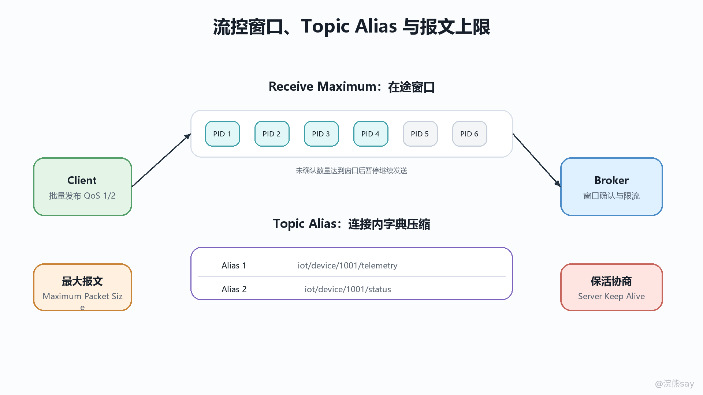
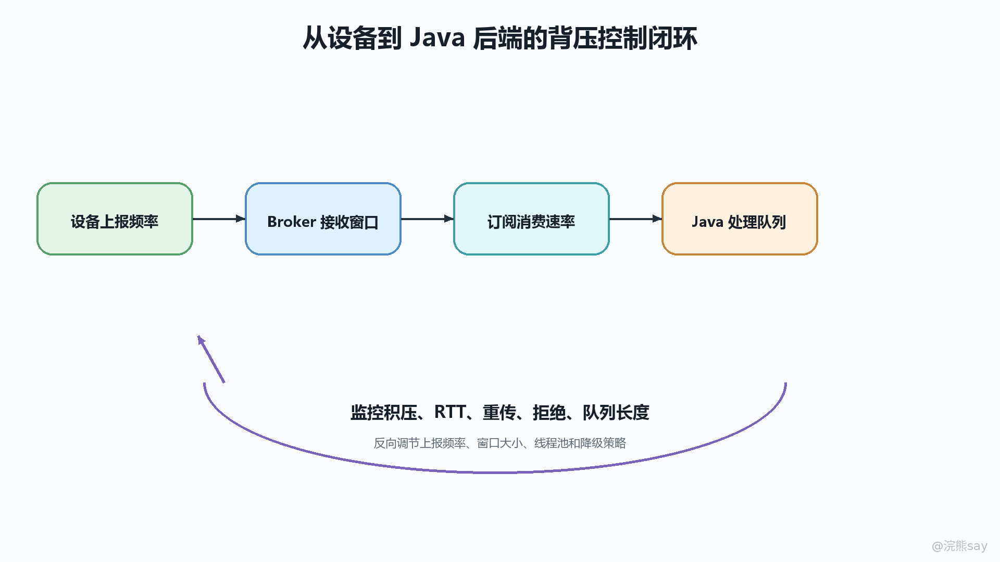

# 11 流控、Topic Alias、最大报文与性能治理

MQTT 5 的流控与链路优化，不是给协议额外加几个“限流开关”，而是把过去只能依赖应用约定、Broker 私有配置或 SDK 行为兜底的问题，前移到连接协商和报文属性中表达。Receive Maximum 解决的是可靠投递链路中未确认消息过多的问题，Maximum Packet Size 解决的是单个 MQTT 控制报文过大的问题，Topic Alias 解决的是高频发布时重复 Topic 名称占用链路的问题，Keep Alive 与 Server Keep Alive 解决的是双方怎样判断连接是否仍然存活的问题。

理解这一章时要抓住一个主线：MQTT 的性能治理分为“协议层边界”和“工程层承载”。协议层可以告诉对方自己能接收多少 QoS 1/2 在途消息、能接受多大的包、能保存多少 Topic 别名、多久必须看到一次控制报文；工程层还要继续处理 Broker 内存、会话存储、设备上报速率、Java 后端线程池、队列、数据库和下游接口的承载能力。只讲字段含义容易背散，只有把字段和系统压力链路放在一起，才能真正讲清楚 MQTT 5 的设计价值。

## 一、MQTT 5 性能治理的协议视角

### 连接协商决定双方的能力边界

MQTT 5 把很多资源边界放在 CONNECT 和 CONNACK 的 Properties 中协商。客户端在 CONNECT 中声明自己能接受的 Receive Maximum、Maximum Packet Size、Topic Alias Maximum、Session Expiry Interval 和 Keep Alive 等信息；Broker 在 CONNACK 中返回服务端侧的能力与约束，例如服务端愿意处理的 Receive Maximum、服务端允许客户端使用的 Topic Alias Maximum、服务端要求采用的 Server Keep Alive。这相当于双方在正式收发业务消息前先说清楚：这条连接上我能处理多少并发可靠投递、单包能有多大、是否接受 Topic Alias、会话离线后能保留多久、空闲多久就要通过控制报文证明连接还活着。

这些字段的共同点是“只对当前 MQTT 网络连接或当前会话语义生效”，不能简单理解成全局配置。Receive Maximum 和 Topic Alias 都是连接级约束，重连后要重新协商和重新建立映射；Session Expiry Interval 管的是连接关闭后会话状态保留多久；Message Expiry Interval 管的是某条应用消息是否还值得继续投递。把这些范围说清楚，才能避免把连接级优化误用成跨连接缓存，把会话过期误解成消息过期，或者把单包大小限制误解成吞吐限流。

### 四类能力分别治理不同风险

本章可以按四条线理解。第一条是“在途窗口”，核心字段是 Receive Maximum，它限制 QoS 1/2 可靠投递中尚未完成确认流程的 PUBLISH 数量。第二条是“单包大小”，核心字段是 Maximum Packet Size，它限制一整个 MQTT Control Packet 的最大字节数。第三条是“链路压缩”，核心字段是 Topic Alias Maximum 和 PUBLISH 中的 Topic Alias，它让长 Topic 在同一连接内用短整数代替。第四条是“连接与状态寿命”，核心字段是 Keep Alive、Server Keep Alive、Session Expiry Interval 和 Message Expiry Interval，它们分别影响连接存活判断、会话状态保留和消息有效期。

images/mqtt-11-flowcontrol-topic-alias.png

这张图可以按“连接协商 -> 发送约束 -> Broker 承载 -> Java 后端消费”的链路看。设备或服务端客户端先通过 CONNECT/CONNACK 协商窗口、包大小、Topic Alias 和保活参数；随后 PUBLISH 进入 Broker，Broker 一边按 Topic 路由，一边检查在途窗口、包大小、别名合法性和消息过期；最后 Java 后端消费消息时，还要用线程池隔离、队列背压、限流降级和幂等处理承接 Broker 推来的流量。协议字段只能把压力边界表达清楚，真正稳定还要靠端到端治理。

## 二、Receive Maximum：QoS 1/2 的在途窗口

### 它限制的是未确认的可靠投递数量

Receive Maximum 是 MQTT 5 的核心流控字段。它表示接收方愿意同时处理多少条尚未完成确认流程的 QoS 1 或 QoS 2 PUBLISH。客户端可以在 CONNECT 中声明自己的 Receive Maximum，告诉 Broker：“向我投递 QoS 1/2 消息时，最多允许这么多条处于未完成确认状态。”Broker 也可以在 CONNACK 中声明自己的 Receive Maximum，告诉客户端：“你向我发布 QoS 1/2 消息时，也要遵守这个窗口。”

这里的“在途”不是指 TCP 发送缓冲区里还有多少字节，也不是指 Broker 队列中有多少待投递消息，而是指 MQTT QoS 协议流程中还没有收到对应确认的 PUBLISH 数量。QoS 1 的发送方发出 PUBLISH 后，要等 PUBACK 才释放这个在途名额；QoS 2 的流程更长，要经过 PUBREC、PUBREL、PUBCOMP，实现上通常要等可靠投递流程推进到规范要求的位置后才释放相应状态。窗口满了以后，发送方不能继续发送新的 QoS 1/2 PUBLISH，但仍然必须处理其他 MQTT 控制报文，例如确认报文、PING、DISCONNECT 等，否则流控反而会把连接卡死。

### QoS 0 不受 Receive Maximum 限制

一个很容易考错、也很容易在项目里误配的边界是：Receive Maximum 不限制 QoS 0。官方规范明确把 Receive Maximum 用来限制 QoS 1 和 QoS 2 的并发处理数量，并说明没有机制用它限制对方可能发送的 QoS 0 PUBLISH。在流控章节中，发送配额耗尽后，发送方不得继续发送 QoS 大于 0 的 PUBLISH，但可以继续发送 QoS 0，也可以出于实现策略选择同时暂停 QoS 0。

这意味着 Receive Maximum 不是完整的入口限流器。假设大量设备用 QoS 0 高频上报遥测数据，即使服务端在 CONNACK 中把 Receive Maximum 设置得很小，也不能指望这个字段挡住 QoS 0 洪峰。QoS 0 没有 Packet Identifier，也没有 ACK 往返，协议上不存在“未确认窗口”这个控制点。项目中如果要治理 QoS 0 上报，仍然要依赖设备侧采样节流、Broker 连接级限速、Topic 级限速、ACL 配额、规则引擎丢弃策略或后端入口限流。

### 窗口大小影响吞吐、延迟和内存

Receive Maximum 设置过小，可靠投递会变成窄窗口串行推进，尤其在高延迟链路上，每轮 ACK 往返都会放大整体延迟；设置过大，慢客户端或慢 Broker 又会堆积大量未确认消息，带来内存、持久化、重传和会话恢复压力。比如窗口为 1 时，QoS 1 消息基本按“发一条、确认一条、再发下一条”推进，顺序更容易观察，但吞吐受 RTT 影响很大；窗口为几百或几千时，吞吐可能提升，但接收方业务回调、磁盘落盘和下游写库一旦变慢，积压会迅速放大。

工程上要把 Receive Maximum 看成“协议级背压入口”，而不是唯一的保护机制。Broker 侧通常还要叠加连接级 inflight 限制、会话队列上限、持久化存储上限、消息速率限制和租户配额；客户端 SDK 侧要避免在 MQTT 回调线程里执行耗时业务，否则 ACK 发不出去，窗口释放不了，最终表现为吞吐下降、重传增多或连接被判定异常。面试表达时可以说：Receive Maximum 保护的是可靠投递确认链路的并发窗口，它能减轻慢接收方被 QoS 1/2 消息压垮的问题，但不能替代 QPS 限流、字节限速和业务线程池背压。

## 三、Maximum Packet Size：单包上限不是吞吐限流

### 它限制整个 MQTT 控制报文大小

Maximum Packet Size 表示一方愿意接收的最大 MQTT Control Packet 大小。这个大小不是 Payload 大小，也不是 Topic Name 大小，而是一个完整 MQTT 控制报文的总字节数，包括固定报头、可变报头、Properties 和 Payload。客户端可以在 CONNECT 中告诉 Broker 自己最多能处理多大的包，Broker 可以在 CONNACK 中告诉客户端服务端最多能接受多大的包。该值不能为 0；如果没有声明，除了协议 Remaining Length 编码和报文结构本身的限制外，就没有额外的 Maximum Packet Size 限制。

它的作用是防止单个报文拖垮接收方。IoT 场景里常见的问题是设备把日志、图片片段、固件块、批量点位或异常堆栈塞进一次 PUBLISH，导致 Broker 或客户端一次解码、复制、落盘和转发的内存压力过大。设置 Maximum Packet Size 后，发送方不应发送超过对方限制的报文；如果接收方收到超限报文，通常会按协议错误处理，并可使用 Packet too large 这类原因码断开连接。

### 超大消息要拆分或改链路

Maximum Packet Size 不是“每秒最多发送多少字节”，它只管单个包的上限。如果一个设备每秒发送一千个小包，单包都没有超限，Maximum Packet Size 并不会降低总吞吐压力；反过来，一个低频消息只要单包过大，也会被限制。因此它要和速率限制分开理解：单包上限解决峰值内存与解码风险，限流解决单位时间内的总压力。

工程上遇到大 Payload 时，不要只把 Maximum Packet Size 调大。更稳妥的做法是先判断消息是否适合走 MQTT：遥测点位、状态事件、命令响应适合；大文件、图片、固件、批量日志通常更适合对象存储、HTTP 分片上传或专门的文件通道，然后用 MQTT 只传元数据、下载地址、版本号和校验值。如果确实要通过 MQTT 分片，也要设计分片序号、总片数、校验、过期时间、重传和清理策略，并评估 Broker 持久化与规则引擎是否会被分片洪峰拖慢。

### Broker 丢弃与诊断要可观测

当 Broker 因 Maximum Packet Size 无法向某个客户端投递消息时，协议允许服务端丢弃无法发送的包，并把它视为该应用消息发送流程已经处理完成；共享订阅场景下，如果某些客户端接收不了大包而其他客户端可以接收，Broker 实现还可能选择丢弃或投递给能接收的客户端。这类行为如果没有观测，很容易被业务误判为“消息中间件偶发丢消息”。

生产环境要给超大包建立明确的诊断路径。Broker 侧至少要记录超限连接、ClientId、Topic、报文大小、限制值、原因码和租户信息；平台侧可以把超大消息进入死信队列或审计日志；设备侧 SDK 要把 Packet too large 和普通网络断开区分开，避免盲目重连后继续发送同一个超限包。对 Java 后端来说，也要在反序列化前做大小保护，不能只相信 Broker 已经挡住所有大包，因为消息可能来自桥接、规则引擎、历史补偿或其他内部入口。

## 四、Topic Alias：重复 Topic 名称的链路压缩

### Topic Alias Maximum 先声明接收能力

Topic Alias Maximum 表示接收方愿意在当前连接上保存多少个 Topic Alias 映射。客户端在 CONNECT 中发送的 Topic Alias Maximum，是告诉 Broker：“你向我发 PUBLISH 时，最多可以使用这么大的 Topic Alias 值。”Broker 在 CONNACK 中发送的 Topic Alias Maximum，是告诉客户端：“你向我发 PUBLISH 时，最多可以使用这么大的 Topic Alias 值。”如果该属性缺省或为 0，就表示不接受 Topic Alias，对方不能在这条连接上发送 Topic Alias。

PUBLISH 中的 Topic Alias 是一个非 0 的短整数。发送方第一次可以携带完整 Topic Name 和 Topic Alias，建立“别名 -> Topic Name”的映射；后续在同一连接内，可以只携带 Topic Alias，把 Topic Name 留空，从而减少重复 Topic 字符串传输。对于 tenant/{tenantId}/product/{productKey}/device/{deviceId}/telemetry/{metric} 这类长 Topic，如果设备每秒上报几十次，Topic Alias 可以明显降低链路字节数，尤其适合蜂窝网络、卫星链路、弱网网关和高频遥测。

### 映射只在当前连接内有效

Topic Alias 的边界必须讲清楚：它是连接内压缩，不是 Topic 重命名，也不是 Broker 全局缓存。网络连接断开后，别名映射随连接消失；重连后必须重新建立。代理网关如果同时维护下游设备连接和上游 Broker 连接，也要分别维护两侧连接的 Topic Alias 映射，不能把下游别名原样透传到上游，除非上游连接已经建立了同样的映射。

Topic Alias 还有几个典型协议错误边界。Topic Alias 值不能为 0；发送方不能使用大于接收方 Topic Alias Maximum 的别名；如果 PUBLISH 的 Topic Name 为空，又没有携带可解析的 Topic Alias，就是协议错误；如果使用了一个接收方尚未建立映射的 Topic Alias，也无法还原真实 Topic。工程上要把这些错误和 ACL 拒绝、Topic 不匹配区分开，否则排障时会误以为路由规则有问题。

### 不是所有场景都值得开启

Topic Alias 的收益取决于 Topic 长度、发布频率、连接稳定性和 SDK 实现。长 Topic、高频、长连接最适合；短 Topic、低频消息、频繁重连或每次只发一两条消息，收益就很有限，因为建立映射本身也要发送一次完整 Topic。对于设备侧内存很小的场景，还要评估保存别名映射的成本；对于 Broker 侧，要评估大量连接同时声明较大 Topic Alias Maximum 时，映射表占用的内存和清理逻辑。

Java 服务端客户端使用 Topic Alias 时，建议由 MQTT SDK 管理映射，不要在业务代码里手写别名缓存。业务层仍然应该围绕真实 Topic 做权限、路由和监控；Topic Alias 只作为传输优化存在。日志里也要尽量还原真实 Topic，否则排查问题时只看到 alias=3，而不知道它对应哪个设备或指标，会让可观测性下降。

## 五、Keep Alive、Server Keep Alive 与过期治理

### Keep Alive 判断连接是否还活着

Keep Alive 是客户端在 CONNECT 中声明的秒级时间间隔，含义是：在没有其他 MQTT 控制报文发送时，客户端最多隔这么久要发送一个控制报文，通常是 PINGREQ。如果客户端在这个周期内已经发送了 PUBLISH、PUBACK、SUBSCRIBE 等 MQTT 控制报文，就不需要额外再发心跳。Broker 侧通常按 1.5 倍 Keep Alive 的规则判断连接是否沉默过久；客户端发出 PINGREQ 后，也应在合理时间内收到 PINGRESP，否则应关闭连接并重连。

MQTT 5 增加了 Server Keep Alive。如果 Broker 在 CONNACK 中返回 Server Keep Alive，客户端必须使用服务端给出的值替代自己在 CONNECT 中发送的 Keep Alive；如果 Broker 没有返回 Server Keep Alive，服务端就按客户端原先声明的 Keep Alive 执行。这个设计让 Broker 可以主动缩短过长的客户端保活周期，避免大量半开连接长期占用资源，也让平台在移动网络、NAT、负载均衡和防火墙环境中更统一地治理连接存活。

### 保活不是业务在线状态的全部

Keep Alive 只能说明 MQTT 网络连接是否按协议保持活动，不能直接等同于设备业务在线。一个设备可能连接还在，但传感器采集线程已经卡死；也可能底层网络短暂断开，Broker 还没到 1.5 倍 Keep Alive 的断开判断时间；还可能客户端正常发送心跳，却因为业务回调线程阻塞，迟迟不处理下行命令。设备在线状态通常要结合连接事件、最后业务上报时间、心跳消息、Will Message、Retained 状态和平台侧超时策略一起判断。

Java 后端也要避免把保活处理和业务处理绑死在同一个线程。某些 SDK 的网络读写、ACK、PINGRESP 处理和消息回调共享有限线程，如果回调里执行慢 SQL、远程 HTTP、文件写入或同步等待，就可能拖慢协议报文处理。表面上看是 Keep Alive 超时，实际根因可能是业务线程堵住了 MQTT 客户端内部线程。因此实践中要让 MQTT 回调快速投递到业务队列，由独立线程池处理耗时逻辑，协议线程只做轻量解析、确认和分发。

### Session Expiry 与 Message Expiry 控制状态寿命

Session Expiry Interval 管的是会话状态寿命。它以秒为单位，缺省或为 0 时，网络连接关闭后会话结束；大于 0 时，客户端和 Broker 需要在连接关闭后继续保存会话状态，直到过期；值为 0xFFFFFFFF 时表示会话不过期。会话状态包括订阅关系、未完成 QoS 1/2 流程、待发送给客户端的 QoS 1/2 消息，以及实现可选保存的 QoS 0 待发送消息。长 Session Expiry 可以提升断线恢复能力，但也会让 Broker 长时间保存订阅、离线队列和 inflight 状态。

Message Expiry Interval 管的是消息本身是否还有效。它也是秒级寿命，如果消息在 Broker 中等待太久，超过过期时间后还没有开始向匹配订阅者投递，Broker 应删除该订阅者对应的消息副本；如果 Broker 转发一条已经等待过的消息，还应把发给客户端的 Message Expiry Interval 调整为剩余时间。它解决的是“可靠投递不等于永远有意义”的问题：控制命令、位置快照、临时告警、仪表盘状态都有时效，过期后继续投递反而可能误导业务。

images/mqtt-11-backpressure-control-loop.png

## 六、从 Broker 到 Java 后端的性能治理

### Broker 侧容量风险要分层看

Broker 的压力不是一个指标能解释的。连接数带来 Socket、TLS、认证上下文和心跳成本；订阅数带来 Topic Trie 或匹配索引成本；QoS 1/2 带来 inflight 状态、确认重试和持久化成本；Session Expiry 带来离线会话和离线队列成本；Maximum Packet Size 影响单次解码、内存复制和规则引擎处理峰值；Topic Alias Maximum 又会为每条连接增加别名映射表。任何一个维度没有上限，都可能在大规模设备接入时变成容量风险。

容量治理要按租户、产品、设备类型和 Topic 维度拆开。Broker 侧应配置连接数上限、每连接 inflight 上限、离线队列长度、消息过期默认值、最大报文大小、发布速率限制、共享订阅消费能力和死信诊断；同时要监控连接数、订阅数、入站速率、出站速率、丢弃数、超大包数、Receive Maximum exceeded、Packet too large、Topic Alias invalid、离线队列堆积和持久化延迟。这样才能把“Broker 压力大”拆成可定位的具体资源问题。

### 设备侧上报节流优先在源头完成

设备侧是流量源头，最有效的节流通常不是 Broker 断开连接，而是在设备或边缘网关上减少无意义上报。高频传感器可以做采样合并、变化阈值上报、时间窗口聚合、边缘过滤和批量压缩；状态类数据可以使用 Retained Message 表示最新值，不必把每次重复状态都当成事件；临时数据要设置合理的 Message Expiry，避免离线后补发大量过期消息；QoS 选择也要区分重要程度，遥测可以用 QoS 0 或 QoS 1，关键命令响应再使用更可靠的语义。

设备 SDK 还应根据 Broker 返回的能力动态调整行为。如果 Broker 返回较小的 Receive Maximum，设备要限制 QoS 1/2 的并发发布；如果 Broker 返回较小的 Maximum Packet Size，设备要拆分或改走文件通道；如果 Topic Alias Maximum 为 0，就不能继续发送 Topic Alias；如果 Server Keep Alive 比本地配置更短，就要按服务端要求调整心跳。成熟的设备侧不是“连上就疯狂发”，而是能读懂 CONNACK，把服务端约束转化为本地发送策略。

### Java 后端要做背压与线程池隔离

Java 后端作为 MQTT 消费方时，最怕把 Broker 的推送速度直接传导到业务资源。正确模型是：MQTT 客户端网络线程负责收包、解码、ACK 和快速投递；业务处理线程池负责反序列化、校验、落库、调用下游和发布响应；中间用有界队列、限流器或响应式背压连接。队列满时要有明确策略：可以暂停订阅、降低 QoS、拒绝新任务、丢弃可过期消息、写入缓冲存储或触发扩容，而不是无限堆积内存。

线程池隔离要按业务重要性拆分。设备状态、告警、命令响应、日志、统计指标不应共用一个无界线程池；慢接口、数据库写入和规则引擎也不应阻塞 MQTT 协议线程。对 QoS 1 消息，如果业务处理成功后才 ACK，可以增强处理可靠性，但会拉长 Receive Maximum 窗口占用时间；如果 SDK 收到消息后立即 ACK，再异步处理业务，吞吐更高，但进程崩溃时可能造成业务未处理却协议已确认。项目里要明确选择，并用幂等键、消息表、重试队列和死信机制补齐语义。

最后要把性能治理落到可观测性上。Java 后端至少应暴露 MQTT 接收速率、业务队列长度、处理耗时、失败数、重试数、ACK 延迟、线程池活跃数、拒绝任务数、下游调用耗时和消息过期丢弃数。这样当系统出现“消息延迟”“设备频繁掉线”“Broker 堆积”“Java 服务 CPU 很高”时，才能判断问题是在设备上报太快、Broker 窗口太大、Maximum Packet Size 不合理、Topic Alias 配置无效，还是后端线程池和数据库已经成为瓶颈。MQTT 5 提供的是协议层工具箱，真正的性能治理要把这些工具和 Broker、设备、Java 后端三侧的容量模型一起使用。
