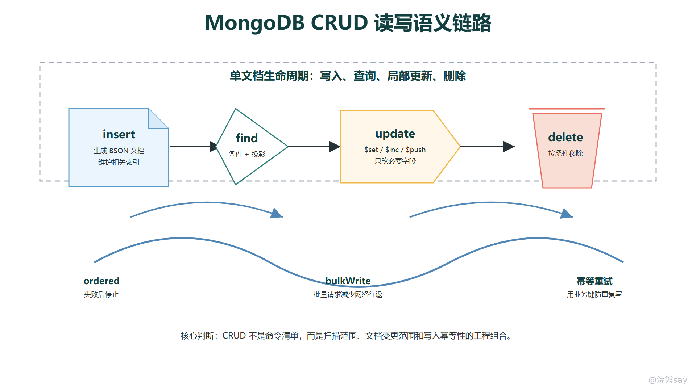

# MongoDB CRUD 查询与更新语义

MongoDB 的 CRUD 可以按文档生命周期理解：插入文档、按条件读取文档、用更新语义修改文档、按条件删除文档。对 Java 后端来说，方法名本身并不难，真正要讲清的是每个操作的执行语义：一次插入会不会部分成功，查询条件如何匹配文档，投影到底减少什么，更新是局部修改还是整体替换，批量写入和重试写入在工程上意味着什么。

这章不把 MongoDB 当成命令清单，而是围绕常见业务接口展开。比如创建订单用 insertOne，批量导入商品用 insertMany 或 bulkWrite，订单列表用 find 加条件、投影、排序和限制，状态流转用 updateOne 加更新操作符，清理过期草稿用 deleteMany。这些操作能否可靠落地，取决于条件设计、幂等设计和异常处理，而不只是语法是否写对。

images/mongodb-crud-write-semantics.png

## 一、insertOne 与 insertMany 的写入语义

insertOne 用于向集合插入一条文档。插入时文档必须有 \_id；如果应用没有提供，驱动通常会生成 ObjectId。插入成功后，这条文档会进入集合，同时相关索引也要被维护。因此插入不是简单“把 JSON 存进去”，而是一次包含主键检查、唯一索引检查、文档编码和索引更新的写操作。

db.orders.insertOne({ 
orderNo: "OD202606300001", 
userId: 10086, 
status: "CREATED", 
amount: Decimal128("135.00"), 
items: \[ 
{ sku: "A01", count: 1, price: Decimal128("99.00") }, 
{ sku: "B02", count: 1, price: Decimal128("36.00") } 
\], 
createdAt: new Date() 
})

insertMany 用于一次插入多条文档，常见于初始化数据、批量导入、消息落库和同步任务。批量插入可以减少网络往返，但并不表示“越大越好”。单批过大时，客户端内存、网络包、服务端写入压力和索引维护成本都会上升，工程上通常会按固定批次拆分。

db.products.insertMany(\[ 
{ sku: "A01", name: "Keyboard", price: Decimal128("99.00"), createdAt: new Date() }, 
{ sku: "B02", name: "Mouse", price: Decimal128("36.00"), createdAt: new Date() } 
\])

批量插入要关注有序与无序。默认有序写入会按数组顺序执行，遇到错误通常停止后续操作；无序写入允许后续操作继续执行，更适合“尽量导入成功数据，最后汇总失败项”的场景。比如商品批量导入中，某几条因为唯一索引冲突失败，不一定要让整批数据都停止；但如果批次内部有严格先后依赖，就应使用有序语义。

插入操作的幂等设计通常依赖业务唯一键。创建订单时，可以给 orderNo 或请求流水号建立唯一索引，重复请求再次插入会触发唯一冲突，应用再根据业务语义返回“已创建”或查询已有记录。不要只依赖客户端“不会重复提交”，网络超时、服务重试和用户重复点击都会让插入接口面对重复请求。

## 二、find 条件、projection、sort 与 limit

find 的第一个参数是过滤条件，用来描述哪些文档匹配查询。条件可以是等值匹配，也可以使用比较、范围、集合、逻辑组合等操作符。常见订单列表查询会同时包含用户、状态和时间范围：

db.orders.find({ 
userId: 10086, 
status: { $in: \["PAID", "SHIPPED"\] }, 
createdAt: { $gte: ISODate("2026-06-01T00:00:00Z") } 
})

嵌套字段可以用点路径访问，数组字段也可以被匹配。例如 address.city 可以筛选收货城市，items.sku 可以匹配明细数组中包含某个商品的订单。如果需要同一个数组元素同时满足多个条件，应使用 $elemMatch，否则不同条件可能分别命中数组中的不同元素，导致结果与业务预期不一致。

db.orders.find({ 
items: { 
$elemMatch: { 
sku: "A01", 
count: { $gte: 2 } 
} 
} 
})

projection 是投影，用来控制返回哪些字段。它不会改变数据库中的文档，只影响本次查询返回给客户端的数据。投影可以减少网络传输和 Java 反序列化成本，尤其适合列表页只需要少量字段的场景。通常同一个投影中不要混用包含和排除两种模式，\_id 是常见例外，可以在包含投影中显式设为 0。

db.orders.find( 
{ userId: 10086, status: "PAID" }, 
{ \_id: 0, orderNo: 1, amount: 1, createdAt: 1 } 
)

sort 决定返回顺序，limit 限制返回条数。MongoDB 不保证集合中的自然存储顺序适合作为业务顺序，所以列表接口应显式排序。若排序字段存在重复值，最好把 \_id 这类唯一字段加入排序，保证分页时顺序稳定。

db.orders.find({ userId: 10086 }) 
.sort({ createdAt: -1, \_id: -1 }) 
.limit(20)

分页时要理解 skip 的代价。skip(100000).limit(20) 表面只返回 20 条，数据库却需要跳过大量结果才能到达目标位置。消息流、订单列表、日志列表更适合使用游标翻页，也就是用上一页最后一条记录的排序字段作为下一页边界。

## 三、updateOne、updateMany 与常用更新操作符

updateOne 会找到第一条匹配过滤条件的文档并应用更新，适合按 \_id、订单号、唯一流水号这类精确条件修改单个业务对象。updateMany 会修改所有匹配条件的文档，适合批量状态修正、定时任务标记和数据治理。两者都应先通过过滤条件定位文档，再执行更新语义。

db.orders.updateOne( 
{ orderNo: "OD202606300001", status: "CREATED" }, 
{ 
$set: { 
status: "PAID", 
paidAt: new Date() 
} 
} 
)

更新操作符用于表达“如何修改文档”，而不是提交一份新文档。$set 设置或新增字段，是最常用的局部更新方式；$inc 对数字字段做原子增减，适合计数器、库存预占数、重试次数；$unset 删除字段，常用于清理临时字段或废弃字段。局部更新能减少误覆盖并发字段的风险，也更符合文档模型的写入习惯。

db.users.updateOne( 
{ \_id: ObjectId("665f2c0a7d5f1d4b5f2f1a11") }, 
{ 
$set: { lastLoginAt: new Date() }, 
$inc: { loginCount: 1 }, 
$unset: { temporaryToken: "" } 
} 
)

数组更新常见操作符包括 $push 和 $addToSet。$push 追加元素，适合保留操作轨迹、消息片段或状态记录；$addToSet 只在数组中不存在该值时添加，适合标签、角色、去重集合。需要注意，$addToSet 的去重依据是元素值本身，对复杂对象要考虑字段顺序和对象结构是否一致。

db.articles.updateOne( 
{ \_id: ObjectId("665f2c0a7d5f1d4b5f2f1a11") }, 
{ 
$addToSet: { tags: "mongodb" }, 
$push: { 
auditLogs: { 
action: "PUBLISH", 
operator: "admin", 
at: new Date() 
} 
} 
} 
)

updateMany 的每一条文档修改可以按单文档原子性理解，但整个批量操作不应被误解为“所有文档整体原子”。如果批量更新过程中发生错误，可能已经有部分文档被修改。对核心业务，批量更新要设计可重入条件、记录处理进度，必要时使用事务或分批补偿，而不是假设一次命令要么全成要么全败。

## 四、replace 与 update 的差异

MongoDB 更新有两种常见写法：一种是使用 $set、$inc、$push 等更新操作符做局部修改；另一种是使用 replacement document 整体替换匹配文档。replaceOne 的语义是“用新文档替换旧文档”，除了 \_id 不能改变，旧文档中未出现在新文档里的字段会消失。

db.orders.replaceOne( 
{ orderNo: "OD202606300001" }, 
{ 
orderNo: "OD202606300001", 
userId: 10086, 
status: "PAID", 
amount: Decimal128("135.00"), 
updatedAt: new Date() 
} 
)

上面的替换会让原文档中的 items、address、createdAt 等未提供字段丢失。如果开发者只是想修改状态，却误用了替换语义，就可能造成数据覆盖。这是 MongoDB 新手很容易犯的错误：把“保存一个对象”理解为“覆盖整份文档”，而不是“只修改变化字段”。

局部 update 更适合高并发业务接口。比如支付回调只需要把订单从 CREATED 改成 PAID，并写入支付时间和支付流水号，就应使用 $set，同时在过滤条件中带上原状态，避免重复回调把不该修改的订单再次覆盖。

db.orders.updateOne( 
{ orderNo: "OD202606300001", status: "CREATED" }, 
{ 
$set: { 
status: "PAID", 
paidAt: new Date(), 
payNo: "PAY202606300001" 
} 
} 
)

整体替换并非不能使用，它适合文档本身就是一个完整配置、草稿快照或外部同步对象，且应用能够提供完整字段的场景。使用替换时，应明确哪些字段由服务端保留，哪些字段允许客户端覆盖，并通过版本号、更新时间或过滤条件控制并发覆盖风险。

upsert 是另一个容易混淆的选项。开启 upsert: true 后，如果没有匹配文档，MongoDB 会插入一条新文档；如果有匹配文档，则执行更新或替换。它适合同步外部维表、保存用户配置、按自然键创建或更新记录，但核心业务要注意唯一索引和幂等语义，否则并发 upsert 可能产生重复业务对象或异常冲突。

## 五、delete 与 bulkWrite 的批量语义

删除操作包括 deleteOne 和 deleteMany。deleteOne 删除第一条匹配文档，通常用于按 \_id 或唯一业务键删除单个对象；deleteMany 删除所有匹配文档，常用于清理过期数据、删除测试数据或批量撤销草稿。删除与更新一样，核心风险在过滤条件，条件过宽可能造成大范围误删。

db.sessions.deleteMany({ 
expiredAt: { $lt: new Date() } 
})

工程上很少对线上核心数据直接做大范围物理删除。更常见的做法是先做逻辑删除，例如设置 deleted: true、deletedAt 和 deletedBy，让业务查询默认过滤已删除记录；确认数据确实可清理后，再由离线任务或 TTL 策略删除。这样可以降低误删恢复难度，也便于审计。

bulkWrite 可以在一次请求中组合多种写操作，例如插入、更新、替换和删除。它适合批量导入、数据修复、消息消费落库和同步任务。相比循环调用单条写入，bulkWrite 可以减少网络往返，并让应用更清楚地收集每类操作的成功数和失败原因。

db.orders.bulkWrite(\[ 
{ 
insertOne: { 
document: { 
orderNo: "OD202606300002", 
userId: 10086, 
status: "CREATED", 
createdAt: new Date() 
} 
} 
}, 
{ 
updateOne: { 
filter: { orderNo: "OD202606300001", status: "CREATED" }, 
update: { $set: { status: "CANCELLED", cancelledAt: new Date() } } 
} 
}, 
{ 
deleteMany: { 
filter: { status: "DRAFT", createdAt: { $lt: ISODate("2026-01-01T00:00:00Z") } } 
} 
} 
\])

bulkWrite 也有有序和无序之分。有序批量写入按顺序执行，遇到错误会停止后续操作，适合存在前后依赖的任务；无序批量写入可以继续执行其他操作，更适合互相独立的数据修复或导入任务。面试中可以强调：批量写入不是事务的同义词，是否整体原子要看是否显式使用事务，普通 bulk 更关注吞吐和错误汇总。

对大批量删除或更新，应避免一次命令影响过多文档。更稳的方式是按时间、主键范围或批次号分段处理，每批记录处理结果，失败后可以从上次边界继续。这样既能控制锁和写压力，也能让任务具备可观察、可暂停、可重试的工程能力。

## 六、幂等与重试写入的工程含义

分布式系统里的写入请求经常会遇到网络超时、主节点切换、连接中断和客户端重试。客户端看到“超时”时，数据库端可能已经写入成功，也可能没有执行，甚至可能执行到一半返回失败。幂等设计的目标，就是让同一个业务请求重复到达时，不会造成重复扣款、重复发货、重复创建订单这类错误。

MongoDB 支持 retryable writes，驱动在满足条件时可以对某些单文档写操作进行自动重试，用来屏蔽短暂网络错误或主节点切换带来的不确定性。它解决的是“同一次数据库写命令能否安全重试”的问题，不等于业务层可以忽略幂等。业务幂等仍然要通过唯一键、状态机条件、请求流水号和可重入逻辑保证。

创建类接口通常用唯一索引实现幂等。比如订单创建请求携带 requestId 或 orderNo，集合上建立唯一索引。第一次插入成功后，如果客户端没收到响应又重试，第二次插入会遇到唯一冲突；应用可以根据唯一键查询已有订单，并返回一致结果。这样即使发生超时，也不会创建两笔订单。

状态流转类接口通常用“当前状态”作为过滤条件。支付回调只允许把 CREATED 改成 PAID，取消订单只允许把 CREATED 或 WAIT\_PAY 改成 CANCELLED。重复请求到达时，如果状态已经变化，matchedCount 或 modifiedCount 会告诉应用本次是否真正修改了文档，业务层再决定返回成功、忽略还是告警。

const result = db.orders.updateOne( 
{ orderNo: "OD202606300001", status: "CREATED" }, 
{ 
$set: { 
status: "PAID", 
paidAt: new Date(), 
payRequestId: "REQ202606300001" 
} 
} 
)

计数类更新要区分天然幂等和非幂等。$set 把字段设为确定值，多次执行通常结果一致；$inc 每执行一次都会累加，重复请求会造成计数错误。因此库存扣减、余额变动、积分增加这类操作，不能只写 $inc，还要结合业务流水唯一索引、状态条件或事务，确保同一流水只生效一次。

可以把这一章的工程口径收束为一句：MongoDB CRUD 的可靠性不只来自驱动和数据库命令，还来自业务条件是否精确、更新是否局部、批量任务是否可分段、写入是否具备幂等键，以及重试后能否得到一致业务结果。自动重试能减少瞬时故障对单次写命令的影响，但不能替代业务幂等设计。
