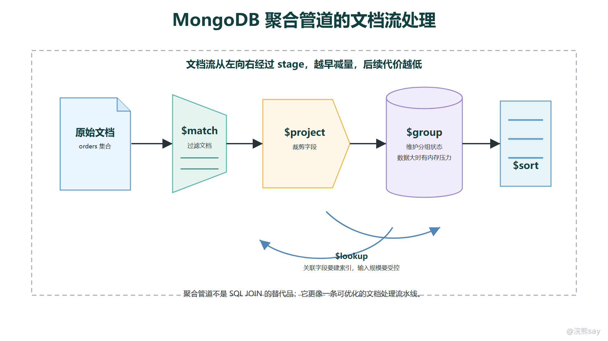

# 聚合管道与数据处理机制

MongoDB 的聚合管道可以理解为一条“文档流处理链”。集合中的文档先进入第一个 stage，每个 stage 对输入文档做过滤、裁剪、计算、分组、排序或关联，然后把处理后的文档继续传给下一个 stage。它不像 SQL 那样先写出一个声明式查询，再由优化器整体决定连接、过滤、分组和投影的执行方式；聚合管道更强调“数据从前往后流动时，每一步把数据变成什么样”。

Java 后端面试中问聚合管道，重点不是背所有 stage 名称，而是能讲清楚三件事：第一，stage 顺序会直接影响中间数据量和内存压力；第二，能被索引支持的 $match 和 $sort 应尽量放在前面；第三，$group、$lookup、窗口统计这类 stage 很强，但不能把 MongoDB 当成复杂 SQL 数仓替代品。

images/mongodb-aggregation-stage-flow.png

## 一、为什么说聚合管道是文档流处理

聚合管道的输入通常是一批 BSON 文档。每个 stage 都接收上一阶段输出的文档，再输出新的文档集合。这个输出不一定和输入一一对应：$match 会过滤掉不符合条件的文档，$project 会改变字段形态，$group 会把多条文档压缩成分组结果，$unwind 会把数组拆成多条文档，$lookup 会给每条文档追加来自另一个集合的匹配数组。

因此，聚合的核心不是“写了哪些操作符”，而是“文档数量、字段形态和排序状态在每一步如何变化”。如果前面没有及时过滤，后面的分组、排序、关联就会面对更大的输入；如果中途把字段重塑得太早，后续 stage 可能无法继续利用原始集合上的索引；如果把大字段一直带到末尾，网络返回和中间计算都会变重。

一个典型的订单统计管道如下：

db.orders.aggregate(\[ 
{ 
$match: { 
status: "PAID", 
createdAt: { $gte: ISODate("2026-06-01T00:00:00Z") } 
} 
}, 
{ 
$project: { 
userId: 1, 
amount: 1, 
createdAt: 1 
} 
}, 
{ 
$group: { 
\_id: "$userId", 
orderCount: { $sum: 1 }, 
paidAmount: { $sum: "$amount" }, 
lastPaidAt: { $max: "$createdAt" } 
} 
}, 
{ $sort: { paidAmount: -1 } }, 
{ $limit: 10 } 
\])

这条管道的含义是：先把输入压缩到“已支付且在时间范围内”的订单，再只保留统计需要的字段，然后按用户聚合，最后按金额排序取前 10 名。这样的顺序比较自然，因为最昂贵的分组和排序发生在过滤之后。如果先 $group 再 $match，就会把大量不需要的订单也纳入分组；如果先 $sort 再过滤，就可能对无关文档排序。

## 二、$match 前置与 $project 裁剪

$match 的作用是过滤文档，它使用的查询谓词和普通 find() 查询很接近。聚合优化里最重要的经验是：能提前过滤就提前过滤，尤其是能命中索引的过滤条件，应放在管道开头。放在第一步的 $match 更像一次普通索引查询，可以利用集合上已有的索引先缩小扫描范围；如果 $match 被放到 $group、复杂 $project 或 $lookup 之后，输入文档已经被改造，原始索引通常就很难再发挥同样作用。

例如订单集合上有索引：

db.orders.createIndex({ status: 1, createdAt: -1 })

下面这种写法能先利用 status 和 createdAt 缩小范围：

db.orders.aggregate(\[ 
{ $match: { status: "PAID", createdAt: { $gte: ISODate("2026-06-01") } } }, 
{ $group: { \_id: "$userId", paidAmount: { $sum: "$amount" } } } 
\])

而下面这种写法虽然结果可能相似，但成本明显更高：

db.orders.aggregate(\[ 
{ $group: { \_id: "$userId", paidAmount: { $sum: "$amount" }, states: { $addToSet: "$status" } } }, 
{ $match: { states: "PAID" } } 
\])

$project 的主要作用是控制输出字段，也可以计算新字段、改名或排除字段。它常用于结果返回前整理形态，或者在中间阶段去掉明显不需要的大字段。要注意一个边界：不要把“越早 $project 越快”理解成绝对规则。MongoDB 对普通字段投影有自己的优化能力，简单地提前裁剪字段不一定显著改善性能；真正有价值的是避免把大数组、大文本、二进制字段带入后续 $group、$lookup 或网络返回，或者把后续统计需要的字段整理成清晰形态。

面试里可以这样表达：$match 前置是为了减少文档数量，$project 裁剪是为了控制文档宽度。前者通常比后者更关键，因为少处理一批文档，比在大量文档上少带几个字段更能降低整体成本。

## 三、$group、$sort 与内存压力

$group 是聚合统计的核心 stage，它会按照 \_id 表达式形成分组，并在每个分组上执行 $sum、$avg、$max、$min、$push、$addToSet 等累加器。它的工程代价来自“需要维护分组状态”：分组 key 越多，中间状态越大；每组累加内容越复杂，内存压力越高；如果 $push 把大量明细塞进数组，结果文档也可能膨胀。

比如下面这条管道按天和用户统计金额，适合生成用户日维度报表：

db.orders.aggregate(\[ 
{ $match: { status: "PAID", createdAt: { $gte: ISODate("2026-06-01") } } }, 
{ 
$group: { 
\_id: { 
day: { $dateToString: { format: "%Y-%m-%d", date: "$createdAt" } }, 
userId: "$userId" 
}, 
count: { $sum: 1 }, 
amount: { $sum: "$amount" } 
} 
} 
\])

如果一个月内订单量很大，且活跃用户很多，分组 key 的基数会迅速扩大。此时优化方向不是盲目调整语法，而是回到数据规模：能不能先按时间、状态、租户过滤；能不能按天分批跑；能不能把高频统计预聚合；能不能把复杂离线分析交给更适合的分析系统。

$sort 也属于容易放大成本的 stage。排序如果能沿着索引顺序读取，就可以避免大规模内存排序；如果排序字段无法利用索引，MongoDB 就需要维护排序缓冲区，数据量大时可能产生明显内存压力或临时文件。聚合中 $sort 在管道第一步，或者只被 $match 前置时，更有机会使用索引。例如按用户查询最近订单时，索引可以设计为：

db.orders.createIndex({ userId: 1, status: 1, createdAt: -1 })

对应管道为：

db.orders.aggregate(\[ 
{ $match: { userId: 10086, status: "PAID" } }, 
{ $sort: { createdAt: -1 } }, 
{ $limit: 20 }, 
{ $project: { \_id: 1, amount: 1, createdAt: 1 } } 
\])

这里的 $sort 放在 $match 后面，并且排序字段接在等值过滤字段之后，比较容易沿复合索引读取。相反，如果先做 $group 再按 paidAmount 排序，排序对象已经是新生成的聚合结果，原始订单索引无法直接支持这个排序，只能对聚合后的结果再排序。

## 四、$lookup 关联边界与文档建模关系

$lookup 可以在聚合管道中做跨集合关联，语义上接近左外连接：主集合每条输入文档都会保留，并新增一个数组字段保存外部集合中的匹配文档。它让 MongoDB 能处理一部分引用模型下的关联查询，但它不等于关系型数据库里的通用 JOIN 能力。

一个常见例子是订单文档只保存 userId，统计时补充用户等级：

db.orders.aggregate(\[ 
{ $match: { status: "PAID", createdAt: { $gte: ISODate("2026-06-01") } } }, 
{ 
$lookup: { 
from: "users", 
localField: "userId", 
foreignField: "\_id", 
as: "user" 
} 
}, 
{ $unwind: "$user" }, 
{ 
$group: { 
\_id: "$user.level", 
orderCount: { $sum: 1 }, 
paidAmount: { $sum: "$amount" } 
} 
} 
\])

这个管道能工作，但要注意两个边界。第一，$lookup 的输入规模要受控，通常应先 $match 主集合，避免把全量订单都拿去关联用户。第二，被关联集合的关联字段要有合适索引，例如 users.\_id 默认有索引；如果关联的是 couponCode、skuId、tenantId 这类业务字段，也应评估外部集合上的索引。

文档数据库更推荐先通过建模减少不必要关联。比如订单详情页经常需要展示下单时的商品名称、成交价、收货地址，这些信息更适合做订单快照内嵌在订单文档中，而不是每次都 $lookup 商品、地址、优惠券。$lookup 更适合低频后台统计、有限规模补充字段、引用关系确实独立增长的场景。若系统大量查询都依赖复杂多集合关联，往往说明文档边界设计不合适，或者这类业务更适合关系型数据库。

## 五、窗口统计与典型数据处理场景

除了普通分组统计，MongoDB 还支持窗口类聚合，例如 $setWindowFields。窗口统计不会像 $group 那样把多条文档压缩成一条，而是在分区和排序的基础上，为当前文档计算一个相邻范围内的指标。它适合排名、累计值、环比、移动平均、前后记录对比等场景。

例如按用户计算订单累计消费额：

db.orders.aggregate(\[ 
{ $match: { status: "PAID" } }, 
{ 
$setWindowFields: { 
partitionBy: "$userId", 
sortBy: { createdAt: 1 }, 
output: { 
runningAmount: { 
$sum: "$amount", 
window: { documents: \[ "unbounded", "current" \] } 
} 
} 
} 
}, 
{ 
$project: { 
userId: 1, 
amount: 1, 
createdAt: 1, 
runningAmount: 1 
} 
} 
\])

这类能力让 MongoDB 能承担一部分在线统计和后台分析需求，例如订单榜单、用户累计行为、最近窗口内的事件数量、设备指标的短周期趋势。但窗口统计通常依赖排序，排序字段和分区字段要和索引设计配合；如果数据量巨大、窗口很宽、分区过多，仍然会带来明显的内存和排序压力。

聚合管道适合的典型场景包括：

- 业务接口前置整理：把文档裁剪、字段改名、数组拆分或补充少量计算字段后返回给应用。
- 后台轻量统计：按时间、状态、用户、租户等维度做计数、求和、最大最小值。
- 数据清洗转换：把嵌套字段展开、把旧字段映射成新字段、把结果写入汇总集合。
- 有限范围关联：在主集合已经过滤到较小范围后，通过 $lookup 补充外部集合信息。
- 窗口类分析：在已限定数据范围内计算排名、累计、移动统计和相邻记录差异。

这些场景的共同点是输入范围可控，stage 顺序清晰，中间结果不会无限膨胀。只要输入范围失控，聚合就会从“文档流处理”变成“全量扫描加内存计算”。

## 六、聚合管道与 SQL 思维的差异

SQL 的典型思维是“从结果描述出发”：我要哪些列，来自哪些表，连接条件是什么，按什么分组和排序。数据库优化器会在很大程度上决定表连接顺序、谓词下推、索引使用和执行计划。MongoDB 聚合管道虽然也有优化器，但开发者更需要显式关注 stage 顺序，因为每一步都会改变文档形态，并影响后续 stage 的输入规模和索引可用性。

两者不是谁完全替代谁，而是解决问题的出发点不同。关系型数据库擅长强 schema、复杂关联、事务一致性和报表分析；MongoDB 聚合擅长围绕文档模型做过滤、转换、分组、有限关联和在线侧统计。用 MongoDB 时，要先问“这个业务对象是否应该内嵌，查询入口是否明确，是否能通过索引快速缩小文档流”；而不是把多张表的 JOIN 抽象照搬成多个集合上的 $lookup。

面试回答可以收束成这样：

MongoDB 聚合管道是一种按 stage 顺序处理文档流的机制。每个 stage 接收上一阶段输出并继续过滤、裁剪、分组、排序、关联或窗口计算。优化重点是让 $match 尽量前置并命中索引，让 $project 控制必要字段，让 $group 和 $sort 面对尽可能小的数据集，让 $lookup 只处理有限关联。它能做统计和转换，但不是复杂 SQL 报表系统的替代品；如果大量业务依赖多集合复杂关联，应该重新评估文档建模或数据库选型。
