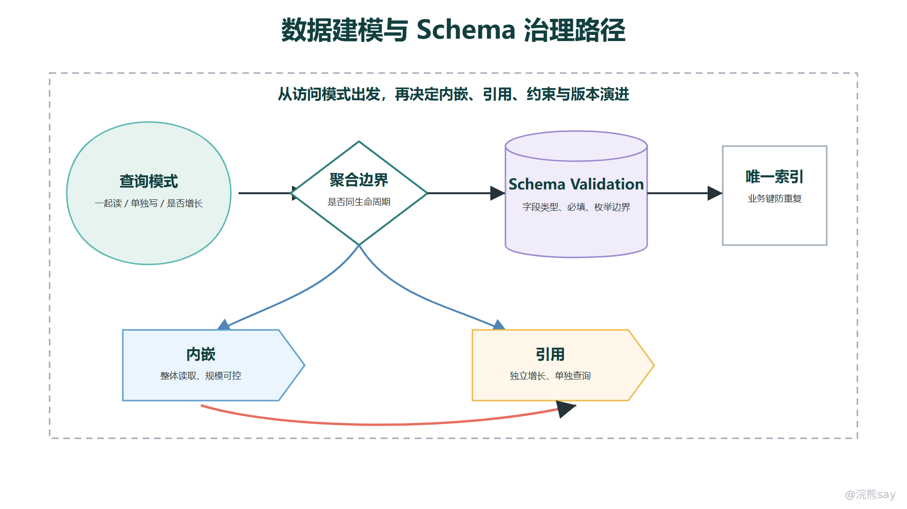

# MongoDB 数据建模与 Schema 治理

MongoDB 的建模重点不是“没有表结构，所以可以随便存”，而是把数据组织方式从固定表结构切换到查询模式和业务聚合边界上。文档模型给了开发者更大的结构自由度，也把更多建模责任交给了开发者：哪些数据应该放在一起，哪些关系应该引用，哪些冗余可以接受，哪些字段必须被约束，哪些历史数据需要兼容。

在 Java 后端面试中，MongoDB 数据建模通常不会考特别细的命令，而是看你能不能说清楚取舍：内嵌和引用怎么选，反范式为什么能提升读取效率，文档和数组为什么不能无限增长，Schema Validation 能管什么、不能管什么，唯一索引和应用层约束分别负责哪一段边界。

images/mongodb-modeling-schema-governance.png

## 一、建模先从查询模式开始

关系型数据库建模常从实体关系开始：用户表、订单表、订单明细表、地址表、商品表，然后通过主键、外键和 JOIN 还原业务对象。MongoDB 更适合从接口和查询路径倒推结构：这个页面一次要读什么数据，写入时哪些字段必须一起变化，哪些数据生命周期一致，哪些字段只是展示快照。

例如订单详情页通常需要订单基础信息、收货地址、下单时商品快照、支付摘要和优惠信息。如果这些数据每次都随订单一起展示，且生命周期接近，就可以围绕订单这个聚合根组织成一个文档：

{ 
\_id: ObjectId("665f2c0a7d5f1d4b5f2f1a11"), 
orderNo: "O20260630001", 
userId: 10086, 
status: "PAID", 
address: { 
province: "浙江省", 
city: "杭州市", 
detail: "文一路 100 号" 
}, 
items: \[ 
{ skuId: 9001, name: "Keyboard", price: NumberDecimal("99.00"), count: 1 }, 
{ skuId: 9002, name: "Mouse", price: NumberDecimal("36.00"), count: 1 } 
\], 
payment: { 
channel: "ALIPAY", 
paidAt: ISODate("2026-06-30T10:00:00Z") 
}, 
createdAt: ISODate("2026-06-30T09:58:00Z") 
}

这个结构的收益是订单详情读取很直接，应用不需要为了展示一个订单再拼接多张表或多个集合。它的前提是这些内嵌数据规模可控，且业务上接受它们作为订单发生时的快照。商品当前价格、库存实时数量、用户当前等级这类会独立变化的数据，就不能因为订单里展示过它们而完全塞进订单文档并当成唯一事实来源。

建模时可以先列出高频查询模式，再决定结构：
| 查询模式 | 建模倾向 | 原因 |
| --- | --- | --- |
| 按订单号读取订单详情 | 订单文档内嵌明细和地址快照 | 一次读取完整聚合，减少拼接成本 |
| 按用户分页查最近订单 | 订单集合保留 userId、createdAt 索引字段 | 查询以订单列表为主，不需要加载所有明细大字段 |
| 按商品统计销量 | 订单明细需要可聚合字段，必要时做汇总集合 | 统计路径和详情路径不同，不能只为详情建模 |
| 查询某商品当前库存 | 独立库存集合或库存服务 | 库存是独立高频变化实体，不适合只内嵌在订单里 |

一句话概括：MongoDB 建模先问“怎么读、怎么写、边界在哪”，再问“文档长什么样”。如果只是把 MySQL 的每张表一比一改成集合，再在应用层频繁做多集合拼接，通常既没有发挥文档模型优势，也失去了关系型数据库成熟的约束能力。

## 二、内嵌、引用与聚合边界

内嵌适合从属关系强、生命周期接近、规模有上限的数据。订单中的收货地址快照、文章中的作者展示名、商品中的少量规格属性、用户画像中的偏好标签，都常见于内嵌场景。内嵌后的好处是读取路径短，单文档更新天然具备原子性，很多业务不需要跨文档事务。

引用适合独立实体、独立增长、频繁单独查询或更新的数据。文章评论、用户操作日志、订单物流轨迹、商品库存、组织成员关系，如果数量持续增长或经常独立分页，就更适合拆成单独集合，通过 articleId、orderId、userId 等字段建立引用关系。

// 文章主文档：保存稳定主体和少量摘要字段 
{ 
\_id: ObjectId("665f2c0a7d5f1d4b5f2f1b22"), 
title: "MongoDB 建模边界", 
author: { userId: 7, nickname: "Ruan" }, 
tags: \["MongoDB", "Schema"\], 
commentCount: 128, 
publishedAt: ISODate("2026-06-30T08:00:00Z") 
} 
 
// 评论集合：按文章独立增长、独立分页 
{ 
\_id: ObjectId("665f2c0a7d5f1d4b5f2f1c33"), 
articleId: ObjectId("665f2c0a7d5f1d4b5f2f1b22"), 
userId: 10001, 
content: "这一段讲内嵌和引用很清楚。", 
createdAt: ISODate("2026-06-30T08:30:00Z") 
}

这里没有把所有评论内嵌进文章文档，是因为评论数量没有稳定上限，而且评论列表通常需要独立分页、审核、删除和索引。如果强行内嵌，文章文档会不断增长，评论更新也会集中争抢同一个文档，读写压力都容易失控。

内嵌和引用不是非黑即白。很多生产模型会混合使用：主文档中保留少量冗余摘要，详情或历史记录放在独立集合。例如文章文档保留 commentCount 和最后几条评论摘要，完整评论仍在评论集合；订单文档保留商品名称和下单价快照，商品主数据仍在商品集合。这样可以让高频读取更快，同时保留独立实体的治理能力。

面试中可以用三个判断问题回答内嵌和引用：
| 判断问题 | 倾向内嵌 | 倾向引用 |
| --- | --- | --- |
| 是否总是一起读取 | 经常一起读取 | 经常单独查询 |
| 数量是否有明确上限 | 上限明确、规模较小 | 持续增长、需要分页 |
| 生命周期是否一致 | 随主对象创建、归档、删除 | 可独立创建、更新、删除 |

## 三、范式化、反范式与重复数据治理

关系型数据库强调范式化，目标是减少重复数据、降低更新异常，并通过 JOIN 组合查询结果。MongoDB 则更常使用局部反范式：为了让一次查询更直接，允许在文档中冗余一部分展示字段或快照字段。反范式不是随意复制数据，而是用受控冗余换取读取性能和模型简单性。

订单中的商品名称、下单价格、收货地址就是典型快照。即使商品后来改名、用户后来修改地址，历史订单仍然应该显示下单当时的信息。这里的冗余不是脏数据，而是业务语义的一部分。

{ 
orderNo: "O20260630001", 
userId: 10086, 
items: \[ 
{ 
skuId: 9001, 
skuNameSnapshot: "Keyboard", 
salePriceSnapshot: NumberDecimal("99.00"), 
count: 1 
} 
\], 
addressSnapshot: { 
receiver: "张三", 
mobileMasked: "138\*\*\*\*0000", 
detail: "浙江省杭州市文一路 100 号" 
} 
}

但有些字段不能轻易冗余为事实来源。例如库存余额、账户余额、用户权限、会员等级当前状态，这些字段如果被多处复制，就会出现更新顺序、补偿失败和读取不一致问题。可以在文档中保存展示快照，但权威状态仍应有明确的主位置。

重复数据治理要区分三种情况：
| 冗余类型 | 是否推荐 | 治理方式 |
| --- | --- | --- |
| 历史快照 | 推荐 | 写入时固化，后续不跟随主数据变化 |
| 展示摘要 | 可使用 | 通过事件、任务或同步逻辑维护，允许短暂延迟 |
| 权威状态 | 谨慎 | 尽量保持单一事实来源，必要时用事务或幂等补偿 |

如果冗余字段需要同步更新，就要提前设计一致性方案。轻量场景可以在应用服务中双写，并通过幂等任务校验；更复杂的场景可以用消息、变更流或后台重算修复。关键不是追求所有副本时时一致，而是明确哪些字段必须强一致，哪些字段允许最终一致，哪些字段只是历史快照。

面试里说“MongoDB 支持反范式”时要补一句边界：反范式能减少关联和查询成本，但会增加写入维护和一致性治理成本；适合读多写少、快照明确、允许局部冗余的场景，不适合把强一致权威状态复制到很多地方。

## 四、文档增长、数组边界与热点风险

文档模型最容易被滥用的地方，是把“可以嵌套数组”理解成“数组可以无限追加”。MongoDB 单个 BSON 文档有大小限制，且大文档会带来更高的网络传输、内存占用、更新和索引维护成本。即使还没有触及硬限制，持续增长的数组也会让单个文档变成热点。

评论、消息、日志、浏览记录、点赞用户列表这类数据通常不适合无限内嵌。它们有共同特征：数量增长不可预测，需要独立分页，写入频繁，且历史数据可能需要归档或分层存储。把它们都塞进主文档，会让每次追加都围绕同一个文档竞争，也会让读取主对象时被迫携带大量不需要的数据。

// 风险模型：comments 持续增长，文章文档越来越大 
{ 
\_id: ObjectId("665f2c0a7d5f1d4b5f2f1b22"), 
title: "MongoDB 建模边界", 
comments: \[ 
{ userId: 1, content: "..." }, 
{ userId: 2, content: "..." } 
// 持续追加到无法控制 
\] 
}

更稳的做法是设置数组边界。少量、固定上限、确实和主对象一起读取的数组可以内嵌，例如商品 3 到 10 张展示图、订单几十条以内的明细、文章少量标签。如果数量可能突破边界，就拆出集合，主文档只保留计数、摘要或最近几条。

// 主文档只保留摘要 
{ 
\_id: ObjectId("665f2c0a7d5f1d4b5f2f1b22"), 
title: "MongoDB 建模边界", 
commentCount: 128, 
latestComments: \[ 
{ userId: 7, content: "总结得很清楚。", createdAt: ISODate("2026-06-30T09:00:00Z") } 
\] 
}

文档增长还会影响更新策略。频繁 $push 大数组、频繁修改同一个文档内的计数字段、把大量用户行为聚合到一个全局文档里，都可能形成写热点。MongoDB 的单文档原子性是优势，但如果所有请求都争抢同一个文档，这个优势会变成吞吐瓶颈。

工程上可以用几个原则控制风险：
| 风险 | 典型表现 | 建模处理 |
| --- | --- | --- |
| 文档过大 | 读取一次返回大量无用字段 | 拆分详情集合，使用投影，避免大字段常态加载 |
| 数组无界 | 评论、日志、轨迹持续追加 | 独立集合分页，主文档保留计数或摘要 |
| 热点文档 | 全部请求更新同一个统计文档 | 分桶、异步汇总、按时间或业务维度拆分 |
| 更新放大 | 小改动导致大文档频繁移动和维护 | 局部更新，控制内嵌规模，避免高频大数组变更 |

## 五、Schema Validation、唯一索引与约束边界

MongoDB 是灵活 Schema，但不是不能治理 Schema。集合可以配置验证规则，常见方式是使用 $jsonSchema 限制字段类型、必填字段、枚举值、数值范围和嵌套结构。它适合防止明显错误数据进入集合，例如状态字段拼错、金额类型写成字符串、关键字段缺失。

db.createCollection("orders", { 
validator: { 
$jsonSchema: { 
bsonType: "object", 
required: \["orderNo", "userId", "status", "createdAt"\], 
properties: { 
orderNo: { 
bsonType: "string", 
description: "订单号必须是字符串" 
}, 
userId: { 
bsonType: "long", 
description: "用户 id 必须是 long" 
}, 
status: { 
enum: \["CREATED", "PAID", "CANCELLED", "REFUNDED"\], 
description: "状态必须在约定枚举内" 
}, 
amount: { 
bsonType: "decimal", 
minimum: NumberDecimal("0.00") 
}, 
createdAt: { 
bsonType: "date" 
} 
} 
} 
}, 
validationLevel: "moderate", 
validationAction: "error" 
})

validationAction: "error" 会拒绝不符合规则的写入；更温和的策略可以选择记录警告，用于灰度治理历史数据。validationLevel 则影响规则对既有文档和更新操作的适用方式。实际项目里，强规则适合新集合或已经清洗过的数据；历史包袱较重的集合，可以先用宽松规则观察，再逐步收紧。

唯一性不要只靠应用层判断。用户手机号、租户内用户名、订单号、幂等请求号这类字段，如果要求数据库层面不重复，应建立唯一索引：

db.orders.createIndex( 
{ orderNo: 1 }, 
{ unique: true } 
) 
 
db.users.createIndex( 
{ tenantId: 1, username: 1 }, 
{ unique: true } 
)

唯一索引解决的是“集合内某个键或键组合不能重复”的问题。它比“先查有没有，再插入”的应用逻辑更可靠，因为并发请求可能同时通过应用层检查，最后造成重复写入。对注册、下单、支付回调、消息幂等等场景，唯一索引经常是最后一道防线。

但唯一索引不能替代所有约束。跨集合外键、复杂业务状态机、金额平衡关系、权限规则、引用对象是否存在，仍然需要应用服务、事务、消息补偿或关系型数据库来保证。MongoDB 可以用索引和验证规则增强底线约束，但它不会自动提供关系型数据库那种完整外键治理。

面试表达可以这样收束：Schema Validation 用来管字段形状和基础取值，唯一索引用来管集合内唯一性，应用层负责业务语义和跨对象一致性；三者各有边界，不能把“灵活 Schema”理解成“没有治理”。

## 六、Schema 版本演进与面试边界

MongoDB 的 Schema 演进通常比关系型表结构更灵活，但灵活不等于没有成本。字段改名、类型变化、嵌套结构调整、数组拆集合、状态枚举扩展，都会影响老数据、索引、查询代码、序列化对象和前端展示。没有版本治理的集合，后期很容易出现同一个字段多种类型、同一含义多个字段名、历史文档无法被新代码正确读取的问题。

常见做法是在文档中保留版本字段，例如 schemaVersion。新写入按新结构落库，读取层兼容旧版本；后台任务逐步迁移历史数据；当历史数据清理完成后，再收紧验证规则和删除兼容代码。

{ 
\_id: ObjectId("665f2c0a7d5f1d4b5f2f1a11"), 
schemaVersion: 2, 
orderNo: "O20260630001", 
buyer: { 
userId: 10086, 
nicknameSnapshot: "raccoon" 
}, 
status: "PAID", 
createdAt: ISODate("2026-06-30T09:58:00Z") 
}

版本演进要尽量采用兼容式发布。比如新增字段通常比改字段含义安全；字段改名可以先双写新旧字段，再切读新字段，最后清理旧字段；类型变更要避免新旧代码同时运行时互相读不懂；数组拆集合时，要考虑历史查询、分页接口和索引迁移。

一个稳妥的演进流程可以分成四步：
| 阶段 | 目标 | 关注点 |
| --- | --- | --- |
| 兼容读取 | 新代码能读旧文档 | DTO 默认值、空字段处理、旧类型兼容 |
| 增量双写 | 新写入带上新结构 | 避免新旧字段含义不一致 |
| 后台迁移 | 历史文档逐步转换 | 分批执行、可重试、监控失败数据 |
| 收紧规则 | 删除旧兼容并加强验证 | 更新索引、调整 jsonSchema、清理废字段 |

面试中回答数据建模，可以用一段完整话术：

MongoDB 建模要从查询模式和聚合边界出发，而不是把关系型表机械搬成集合。经常一起读取、生命周期接近、规模可控的数据适合内嵌；独立增长、频繁单独查询、需要独立更新的数据适合引用。反范式可以减少关联成本，但要区分快照、摘要和权威状态，不能把强一致字段随意复制。文档和数组都要有边界，评论、日志、轨迹这类无界增长数据应拆集合。Schema 治理上，可以用 jsonSchema 控制字段类型和枚举，用唯一索引保证订单号、幂等号等唯一性，用应用层和事务处理复杂业务约束。随着业务演进，要通过版本字段、兼容读取、分批迁移和逐步收紧规则来治理历史数据。

这个回答的边界也要明确：MongoDB 的优势是灵活文档、局部聚合和读取路径简单；代价是建模责任更重，跨文档一致性、引用完整性和复杂约束更多依赖应用设计。如果业务核心是强事务、强外键、复杂报表和严肃审计，关系型数据库仍然更适合作为主存储。
