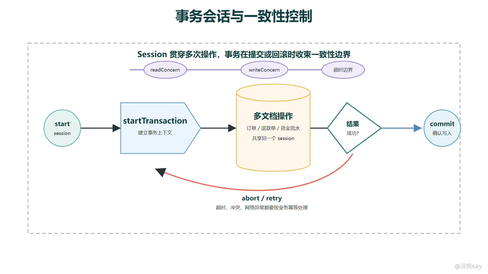

# MongoDB 事务、会话与一致性边界

MongoDB 讨论事务时，第一反应不应该是把它和 MySQL 的四种隔离级别逐项对照，而应该先回到文档模型本身。MongoDB 的设计重点是把一个业务聚合尽量放在一个文档边界内，用单文档原子更新解决大多数一致性问题；多文档事务是补充能力，用来处理确实无法放进同一文档、又必须同步成功或失败的操作。

这一章要抓住三条主线：单文档原子性是优先方案，多文档事务基于 session 执行，readConcern 和 writeConcern 决定事务看到什么数据、提交到什么可靠程度。面试里能把这三点讲清楚，就比单纯背“MongoDB 也支持事务”更接近工程判断。

images/mongodb-transaction-session-lifecycle.png

## 一、先把单文档原子性作为默认方案

MongoDB 对单个文档的写入具备原子性。无论文档内部有多少嵌套对象和数组，一次更新操作要么整体生效，要么整体不生效，不会只改了一半字段。这个能力是 MongoDB 文档建模的基础，也是它不建议滥用多文档事务的原因。

例如订单详情、收货地址、支付摘要和部分订单明细如果都属于同一个订单聚合，并且常常一起读取、一起更新，就可以放在一个订单文档中。订单从 CREATED 变为 PAID 时，一次 updateOne 就能同时修改状态、支付时间和支付渠道：

db.orders.updateOne( 
{ orderNo: "O20260630001", status: "CREATED" }, 
{ 
$set: { 
status: "PAID", 
paidAt: ISODate("2026-06-30T10:00:00Z"), 
"payment.channel": "ALIPAY" 
} 
} 
)

这里不需要事务，因为需要保持一致的数据就在同一个文档里。真正要评估的是文档边界是否合理：如果订单明细数组会无限增长，或者某些子对象有完全不同的生命周期，就不能为了追求单文档原子性把所有东西硬塞进去。单文档原子性是优先选择，不是无条件内嵌的理由。

面试中可以这样表达：MongoDB 首先依靠单文档原子更新保证聚合内部一致性。只有当业务天然跨多个文档、多个集合，并且这些写入必须同步提交或回滚时，才需要多文档事务。这个顺序很重要，因为它体现了文档数据库和关系型数据库的设计差异。

## 二、多文档事务解决什么问题

多文档事务解决的是“多个写操作必须作为一个整体成功或失败”的问题。它适合跨文档、跨集合的同步一致性场景，例如退款时同时修改订单状态、创建退款单、追加资金流水；后台审核时同时变更主记录和审核记录；或者迁移某类业务状态时，需要几组数据保持一致。

事务的价值在于把这些操作放进同一个提交边界。事务提交成功后，外部才能看到事务内的修改；事务中途失败或主动回滚时，已执行的写入不会留下半成品。这个能力可以降低应用层补偿逻辑的复杂度，但它并不改变 MongoDB 的建模原则。

@Service 
class RefundService { 
 
@Transactional 
public void refund(String orderNo) { 
orderRepository.markRefunding(orderNo); 
refundRepository.createRefundOrder(orderNo); 
accountFlowRepository.appendRefundFlow(orderNo); 
} 
}

这段代码看起来很像关系型数据库事务，但底层边界并不完全相同。MongoDB 事务需要运行在复制集或分片集群环境中；单机开发环境可以做普通 CRUD，但不能把它当成生产事务能力的完整模拟。并且事务内部的操作仍然要遵守 MongoDB 的文档大小、索引、锁等待、超时和分片规则。

更稳妥的设计顺序是：能用单文档原子性解决，就不要拆成事务；能用消息、幂等和补偿接受最终一致，就不要强行同步阻塞；只有核心链路明确要求“同成同败”，才使用多文档事务。如果一个系统大量业务都依赖复杂跨集合事务，往往说明文档边界设计不合适，或者这部分核心数据更适合关系型数据库。

## 三、Session 是事务和因果一致性的上下文

MongoDB 的事务不是凭空挂在连接上的，而是基于 client session 执行。session 可以理解为客户端和服务端之间的一段逻辑上下文，它会携带事务编号、操作时间、集群时间等信息，让一组操作能够被识别为有顺序、有关系的操作。

事务生命周期必须发生在 session 中：先启动 session，再在 session 上开启事务，事务内的读写操作都要带着同一个 session，最后提交或回滚。驱动和 Spring Data MongoDB 会封装很多细节，但底层原则没有变：如果某个操作没有加入同一个 session，它就不属于这个事务边界。

session 还和因果一致性有关。所谓因果一致性，不是把所有并发操作都隔离成一个串行世界，而是保证“逻辑上后发生的操作”能看到“逻辑上先发生的结果”。典型场景是先写入一条数据，再从可能有复制延迟的节点读取，希望这次读取不要倒退到写入之前的状态。要得到这种保证，通常需要在同一个因果一致 session 中配合多数读关注和多数写关注。

这点容易被误解成“开了 session 就一定读到最新数据”。更准确的说法是：session 提供追踪操作顺序和事务上下文的能力；是否能得到因果一致，还取决于读写关注级别以及应用是否正确复用 session。同一个 session 也不应该被多个线程同时并发使用，否则顺序关系会变得不可控。

面试里如果被问到 session，可以回答：MongoDB 的事务依赖 session，session 负责承载事务上下文和操作顺序信息。事务中的每个操作都必须关联到同一个 session；因果一致性也是通过 session 记录操作时间和集群时间，再配合 majority 级别的读写关注实现的。

## 四、事务生命周期与 Java 使用边界

事务的基本生命周期可以概括为四步：开启 session，启动事务，执行业务读写，提交或回滚。使用原生驱动时，开发者需要显式传递 session，并处理提交失败、未知提交结果、瞬时错误等情况；使用 Spring Data MongoDB 时，可以通过 MongoTransactionManager 和 @Transactional 把事务接入 Spring 的事务模型。

@Configuration 
class MongoTxConfig { 
 
@Bean 
MongoTransactionManager transactionManager(MongoDatabaseFactory factory) { 
return new MongoTransactionManager(factory); 
} 
}

配置事务管理器后，Spring 会在进入 @Transactional 方法时绑定 MongoDB session，并在方法正常结束时提交，在异常时回滚。这样写法更接近 Java 后端习惯，但不能因此忽略 MongoDB 的限制。事务方法内部不要做耗时的远程调用、长时间等待用户输入或批量扫描大量数据，因为事务持续时间越长，持有快照和锁的时间越长，对并发和存储压力越明显。

事务错误处理也不能只靠“抛异常就完了”。在分布式系统里，提交请求可能已经到达服务端，但客户端因为网络抖动没有收到结果，这时会出现“提交结果未知”的状态。驱动的便捷事务 API 通常会内置部分重试逻辑；如果使用底层 API，就要显式处理瞬时事务错误和未知提交结果。业务层也要保证事务内写入具备幂等语义，避免重试时产生重复流水、重复通知或重复扣减。

还要注意，事务内部不适合放管理类操作。业务事务应该围绕 CRUD 和必要的集合写入展开，建集合、建索引、改权限、统计管理命令等操作不要混在核心业务事务里。即使某些版本允许特定建表建索引场景，也不应该把它当成常规业务设计。

## 五、readConcern 与 writeConcern 在事务中的作用

事务的一致性不是只靠一个“隔离级别”名词决定的，而是由事务级别的 readConcern、提交时的 writeConcern、读偏好和复制状态共同影响。对初学者来说，最重要的是理解它们分别回答什么问题。

readConcern 决定事务内读取什么样的数据视图。事务支持常见的 local、majority 和 snapshot 等读关注级别。local 更偏向读取当前节点本地已经可见的数据；majority 强调读取已经被多数节点确认的数据；snapshot 让事务内操作尽量基于一个一致时间点的数据视图，尤其在跨多个文档或跨多个分片读取时更容易理解为“同一张快照”。

writeConcern 决定事务提交要达到什么确认强度。重要事务通常希望提交结果被多数节点确认，因为这能降低主节点故障后的回滚风险。需要注意的是，事务内部单条写操作不应该单独设置各自的写关注，事务的写关注重点体现在提交边界上。也就是说，事务不是每执行一步就对外确认一步，而是在提交时统一决定这组写入是否真正进入可靠状态。

可以用下面这段伪代码理解事务选项的职责：

session.startTransaction({ 
readConcern: { level: "snapshot" }, 
writeConcern: { w: "majority", wtimeout: 2000 }, 
readPreference: "primary" 
})

这表示事务希望基于快照视图读取，在提交时等待多数节点确认，并从 Primary 读取事务数据。它提升了一致性表达能力，但代价是需要更多复制确认、更多快照维护和更严格的资源管理。读写关注不是越强越无脑，应该按业务价值选择：支付、账务、库存类操作更重视可靠性；日志、埋点、可重试缓存类写入则可能接受更宽松的确认策略。

不要把 MongoDB 事务硬套成 MySQL 的“读未提交、读已提交、可重复读、串行化”四档。更稳的面试表达是：MongoDB 通过 session、事务级 readConcern、提交 writeConcern 和快照机制控制一致性；它关注的是读到哪个提交点的数据、提交被多少副本确认、跨节点是否能维持一致视图，而不是要求背诵关系型数据库隔离级别名称。

## 六、事务成本、跨分片边界与面试表达

事务是有成本的。开启事务后，数据库需要维护事务状态和快照视图，写入可能产生锁等待，提交时需要复制确认，失败时还要处理回滚。事务持续时间越长、涉及文档越多、写入越分散，对内存、缓存、锁和复制延迟的压力越明显。生产中应该让事务短、小、明确，避免把批处理、复杂查询和外部系统调用包进同一个事务。

跨分片事务的成本更高。单分片事务大体接近复制集事务；一旦事务涉及多个 Shard，就需要跨分片协调提交。协调过程不仅增加网络往返和提交延迟，还可能受到 chunk migration、分片可用性、仲裁节点配置等因素影响。事务和数据迁移交错时，可能出现提交失败或事务被中止的情况，因此跨分片事务不应该成为高频核心路径的默认设计。

分片环境下还有一个重要边界：如果事务读写能通过分片键落到同一个 Shard，成本和可控性会好很多；如果一次事务频繁横跨多个 Shard，说明分片键与业务一致性边界可能不匹配。设计时要尽量让同一事务内强一致的数据具有相近的分片路由条件，减少跨分片协调。

常见面试回答可以这样组织：
| 追问 | 回答重点 |
| --- | --- |
| MongoDB 有事务吗 | 有，多文档事务基于 session 执行，适合跨文档、跨集合的同步一致性场景 |
| 为什么还强调单文档原子性 | 文档模型优先把聚合内强一致数据放到同一文档，单文档更新天然原子，成本低于事务 |
| readConcern 和 writeConcern 在事务里干什么 | 前者决定事务读取的数据视图，后者决定提交时需要多少副本确认 |
| 能不能照 MySQL 隔离级别背 | 不建议。MongoDB 更适合从 session、快照读、读写关注和提交确认角度解释 |
| 跨分片事务有什么问题 | 能做，但协调成本、延迟、迁移冲突和失败处理复杂度都更高，尽量让事务落在单分片 |
| 项目里怎么用更稳 | 事务要短小，避免长查询和外部调用；核心写入用多数确认；重试逻辑和业务幂等要配套 |

一句话收束：MongoDB 事务是文档模型的补充，而不是关系型建模的替代品。先设计好文档边界，再用 session、readConcern、writeConcern 和短事务处理少量确实需要同步一致的跨文档操作，才是更符合 MongoDB 的使用方式。
