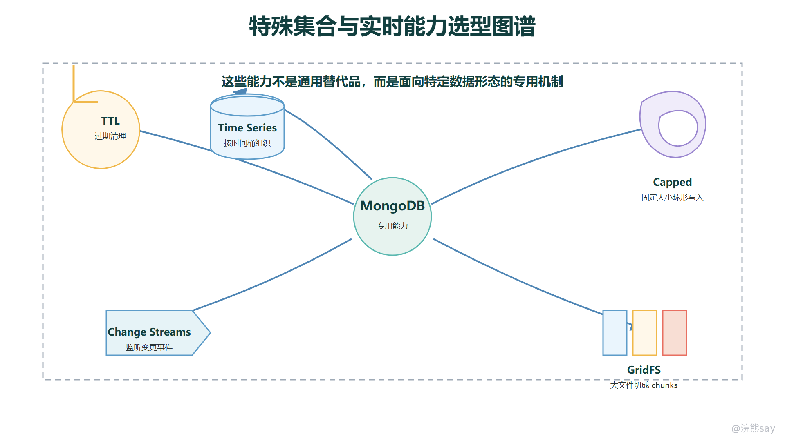

# MongoDB 特殊集合与实时能力

MongoDB 除了普通集合、索引、复制集和分片，还提供了一些容易被忽略但很有辨识度的能力：TTL 索引可以按时间自动清理数据，Time Series collections 用来承接时序数据，Capped collection 提供固定大小、按插入顺序覆盖的集合语义，Change Streams 可以监听数据库变更，GridFS 可以把大文件拆成块存储。这些能力不一定是 Java 后端面试的主线，但很适合用来体现你对 MongoDB 边界的理解。

学习这些特性时，不要把它们当成“MongoDB 很多功能”的罗列。更重要的是判断：它们各自解决什么问题，依赖什么前提，适合什么场景，又不适合替代什么系统。能把适用边界讲清楚，比记住创建命令更接近工程使用。

images/mongodb-special-collections-realtime.png

## 一、TTL 索引用于过期清理

TTL 是 Time To Live 的缩写。MongoDB 的 TTL 索引是一种基于日期字段的单字段索引，用来让过期文档自动被后台清理。常见场景包括登录会话、验证码、临时 token、短期日志、设备上报的原始事件、导入任务的中间状态等。这些数据有明确保留期限，过期后不再参与核心业务，适合交给数据库按时间清理。

db.login\_sessions.createIndex( 
{ expireAt: 1 }, 
{ expireAfterSeconds: 0 } 
) 
 
db.login\_sessions.insertOne({ 
userId: 10086, 
token: "9b8c7d", 
createdAt: new Date(), 
expireAt: new Date(Date.now() + 30 \* 60 \* 1000) 
})

上面的写法表示每条文档自己携带一个 expireAt 时间，到了这个时间后由 TTL 机制删除。还有一种常见写法是对 createdAt 建 TTL 索引，统一设置 expireAfterSeconds：

db.api\_logs.createIndex( 
{ createdAt: 1 }, 
{ expireAfterSeconds: 7 \* 24 \* 60 \* 60 } 
)

TTL 的价值是把“定期删除历史数据”从业务代码和定时任务里抽出来，减少清理逻辑散落在应用层的情况。但它不是精确到秒的业务调度器。TTL 删除由后台任务扫描完成，实际删除时间可能有延迟；如果某条文档缺少被索引的日期字段，或者字段不是日期类型，它也不会按预期过期。

TTL 索引还有几个边界要能说清。它是单字段索引，不是复合索引；不能对 \_id 字段建 TTL；删除是物理删除，不适合有审计留痕要求的数据；一次性积累大量过期文档时，后台删除也会带来写压力。因此，TTL 适合“过期即可删除”的低价值或可重建数据，不适合订单、账务、审计流水这类需要长期追溯的数据。
| 场景 | 是否适合 TTL | 判断理由 |
| --- | --- | --- |
| 登录 session、验证码 | 适合 | 生命周期短，过期后无业务价值 |
| 7 天接口访问日志 | 适合 | 明确保留周期，可自动清理 |
| 订单主记录 | 不适合 | 删除会破坏交易追踪和售后链路 |
| 财务审计流水 | 不适合 | 需要长期留痕，不能简单过期删除 |
| 临时导入任务状态 | 适合 | 任务结束后一段时间可清理 |

## 二、Time Series collections 用于时序数据

Time Series collections 是 MongoDB 针对时序数据提供的集合类型。时序数据的共同特点是：每条记录都对应某个时间点，通常还有一个来源或维度标识，例如设备 id、传感器位置、主机名、指标名、股票代码等。温度采集、设备状态、应用监控指标、访问量、库存价格变化、交易行情快照，都属于这类数据。

创建时序集合时，需要指定时间字段，通常还会指定元数据字段：

db.createCollection("sensor\_measurements", { 
timeseries: { 
timeField: "ts", 
metaField: "metadata", 
granularity: "seconds" 
}, 
expireAfterSeconds: 30 \* 24 \* 60 \* 60 
}) 
 
db.sensor\_measurements.insertOne({ 
ts: ISODate("2026-06-30T10:00:00Z"), 
metadata: { 
sensorId: "S-1001", 
room: "A301" 
}, 
temperature: 26.5, 
humidity: 48.2 
})

这里的 ts 表示采集时间，metadata 表示数据来源或查询维度。MongoDB 会把相近时间、相近来源的数据组织成更适合时序访问的内部结构，从而降低磁盘占用和读取成本。它适合按时间窗口查询、按设备或维度过滤、做一定程度的聚合统计。

Time Series collections 和普通集合的区别，不只是多了一个 timeField。它要求数据天然按时间展开，查询也通常围绕时间范围和元数据过滤。如果数据本身不是时间驱动的，例如用户资料、商品详情、订单主记录，就不应该为了“看起来高级”而放进时序集合。

它也不是专业时序数据库的完全替代。MongoDB 的时序集合适合和业务文档库放在同一套技术栈中，承接中等规模的设备、日志、指标和事件分析；如果系统核心需求是超大规模指标压缩、复杂降采样、长周期聚合、告警计算和高并发窗口查询，Prometheus、InfluxDB、VictoriaMetrics、ClickHouse 等专门系统可能更合适。

面试里可以这样表达：Time Series collections 适合“时间字段 + 元数据字段 + 指标字段”的数据，目标是优化时序写入、存储和时间窗口查询；它不适合普通业务实体，也不应该替代专门时序监控平台的全套能力。

## 三、Capped collection 的固定大小语义

Capped collection 是固定大小集合。它有点像循环缓冲区：创建时指定容量，数据按插入顺序写入；当集合达到容量上限后，新写入会挤掉最老的数据。它强调的是“固定空间、保留最近写入、按插入顺序读取”的语义。

db.createCollection("recent\_events", { 
capped: true, 
size: 1000000, 
max: 10000 
}) 
 
db.recent\_events.insertOne({ 
type: "ORDER\_CREATED", 
orderNo: "O20260630001", 
createdAt: new Date() 
})

这种集合适合保存非常短期的最近事件、调试日志、滚动窗口状态等。它不需要应用自己删除旧数据，也不需要精确按某个业务时间过期，只关心空间上限和插入顺序。MongoDB 内部的复制日志 oplog 就体现了类似固定容量日志的思路。

但 Capped collection 的限制也很明显。它不能像普通集合一样自由治理历史数据，满了以后会覆盖旧文档；它不适合保存需要长期追溯的数据；并发写入、更新和删除的使用边界也比普通集合窄。对大多数“按时间过期”的业务数据来说，TTL 索引通常比 Capped collection 更灵活，因为 TTL 可以基于日期字段决定删除时机，而不是只看集合容量。
| 特性 | TTL 索引 | Capped collection |
| --- | --- | --- |
| 清理依据 | 日期字段和过期秒数 | 集合固定空间或最大文档数 |
| 集合类型 | 普通集合上的特殊索引 | 创建时指定的特殊集合 |
| 保留语义 | 到期删除 | 写满后删除最老数据 |
| 适合场景 | session、短期日志、临时数据 | 最近事件、滚动日志、固定窗口 |
| 主要风险 | 删除有延迟，过期字段要规范 | 旧数据被覆盖，不适合审计 |

所以面试里不要只说“Capped collection 是固定大小集合”。更完整的表达是：它提供循环缓冲区式的最近数据保留能力，适合短期、可丢弃、按插入顺序消费的数据；如果业务需要按时间字段过期、查询条件复杂或长期留痕，普通集合加 TTL 或其他归档方案更合适。

## 四、Change Streams 监听变更

Change Streams 是 MongoDB 面向实时变更监听的能力。应用可以订阅一个集合、一个数据库，甚至整个部署中的数据变更，然后在插入、更新、删除等事件发生时收到通知。它常用于缓存更新、搜索索引同步、审计事件流、异步投递、后台任务触发、数据同步等场景。

const changeStream = db.orders.watch(\[ 
{ 
$match: { 
"operationType": { $in: \["insert", "update", "replace"\] } 
} 
} 
\]) 
 
while (changeStream.hasNext()) { 
const event = changeStream.next() 
printjson(event) 
}

Change Streams 的好处是不用应用直接读取 oplog。它把底层复制日志中的变化封装成稳定的事件流，并且可以使用聚合管道对事件做过滤和转换。比如只监听订单集合里已支付订单的变更，再把事件投递到消息队列或搜索系统。

它的前提也要说清：Change Streams 依赖复制集或分片集群，不是单机随便启动一个集合就能完整使用的“本地回调”。监听端还需要处理断线重连、恢复令牌、重复事件、消费幂等和下游失败。数据库能告诉你“发生了什么变更”，但不能替你保证业务消息一定被下游处理成功。

因此，Change Streams 适合做数据变更驱动的集成能力，但不适合替代严格消息队列。对于核心交易链路，如果要求削峰、重试、死信、延迟投递、消费组管理和复杂事件编排，Kafka、RocketMQ、RabbitMQ 等消息系统仍然更合适。Change Streams 更像数据库变更出口，而不是完整事件平台。

面试追问“能不能用 Change Streams 做缓存一致性”时，可以这样答：可以监听集合变更后更新或删除缓存，但要把它当成异步最终一致方案，消费端必须幂等，并处理监听中断和恢复；强一致读写仍然不能只靠异步监听保证。

## 五、GridFS 用于大文件分片存储

MongoDB 单个 BSON 文档有大小限制，普通文档不适合直接塞入大文件。GridFS 是 MongoDB 对大文件存储的一套规范，它会把文件拆成多个 chunk，并用两个集合保存文件元数据和文件块。默认情况下，通常会看到类似 fs.files 和 fs.chunks 这样的集合。

// mongofiles 是命令行工具示意，实际 Java 项目通常使用驱动或 Spring 的 GridFsTemplate 
mongofiles --db media put ./contract.pdf 
mongofiles --db media get contract.pdf

在 Java 项目中，Spring Data MongoDB 提供了 GridFsTemplate，可以把上传流保存到 GridFS，也可以按文件 id 或文件名读取：

ObjectId fileId = gridFsTemplate.store( 
inputStream, 
"contract.pdf", 
"application/pdf", 
metadata 
); 
 
GridFSFile file = gridFsTemplate.findOne( 
Query.query(Criteria.where("\_id").is(fileId)) 
);

GridFS 适合两类情况：文件超过普通 BSON 文档大小限制，或者应用希望按流式方式读写文件，不想一次把整个文件加载到内存中。它也适合文件和 MongoDB 文档元数据强绑定的系统，例如合同附件、用户上传材料、内部文档版本等。

但 GridFS 不等于对象存储。图片、视频、下载包、静态资源、大规模用户文件，如果需要 CDN 加速、分层存储、生命周期策略、跨区域容灾和低成本容量扩展，通常更适合 S3、OSS、COS、MinIO 等对象存储。MongoDB 保存文件块会占用数据库存储和备份资源，也会影响数据库本身的 IO 规划。

工程上更常见的折中是：大文件放对象存储，MongoDB 只保存文件元数据、业务关联、访问状态和对象存储 key。只有当文件和文档事务边界、权限模型或部署条件强绑定时，才认真考虑 GridFS。

## 六、这些特性的选型边界

这些特殊能力可以统一放进“数据生命周期和数据变化方式”里理解。TTL 管的是自动过期，Time Series 管的是随时间连续产生的指标，Capped collection 管的是固定空间内的最近数据，Change Streams 管的是变更事件出口，GridFS 管的是超过普通文档大小或需要流式读写的文件。它们都不是 MongoDB 的主模型，但能补齐很多工程场景。

还有一个可以简要了解的安全特性是 Queryable Encryption。它允许客户端对敏感字段加密后存入数据库，同时仍支持部分查询能力。它解决的是“数据库服务端也不应看到明文敏感字段”的问题，适合高敏字段保护、合规和多方运维隔离。但它会引入密钥管理、驱动配置、查询类型限制、性能和排障复杂度，不应该在普通字段上泛化使用。

可以用下面这张表快速收束：
| 特性 | 解决的问题 | 适合场景 | 不适合场景 |
| --- | --- | --- | --- |
| TTL 索引 | 自动删除过期文档 | session、验证码、短期日志、临时任务 | 审计、订单、账务、需长期追踪的数据 |
| Time Series collections | 优化时序数据存储和查询 | 设备采集、监控指标、价格变化、访问量 | 普通用户、商品、订单主实体 |
| Capped collection | 固定空间保存最近数据 | 最近事件、滚动日志、短期调试数据 | 需要长期保存或复杂治理的数据 |
| Change Streams | 监听数据库变更 | 缓存刷新、搜索同步、审计事件、异步触发 | 替代完整消息队列或强一致事务链路 |
| GridFS | 大文件拆块存储 | 文件超过文档限制、需要流式读写 | 大规模静态资源、CDN 分发、低成本对象存储 |
| Queryable Encryption | 加密字段仍保留有限查询能力 | 高敏字段、合规隔离 | 普通字段、复杂模糊查询、大量性能敏感查询 |

面试中可以这样回答：

MongoDB 除了普通文档集合，还有一些围绕生命周期和实时性的能力。TTL 索引用日期字段自动清理过期数据，适合 session、验证码、短期日志，但不是精确定时器，也不适合审计数据。Time Series collections 适合时间字段加元数据字段的指标类数据；Capped collection 是固定大小、写满覆盖旧数据的集合，更像循环缓冲区。Change Streams 可以监听复制集或分片集群中的变更，适合做缓存刷新、搜索同步和事件出口，但不能替代完整消息队列。GridFS 用来把大文件拆块存储，但大规模静态资源通常还是对象存储更合适。能用这些特性，前提是先确认数据生命周期、查询方式和一致性要求。
