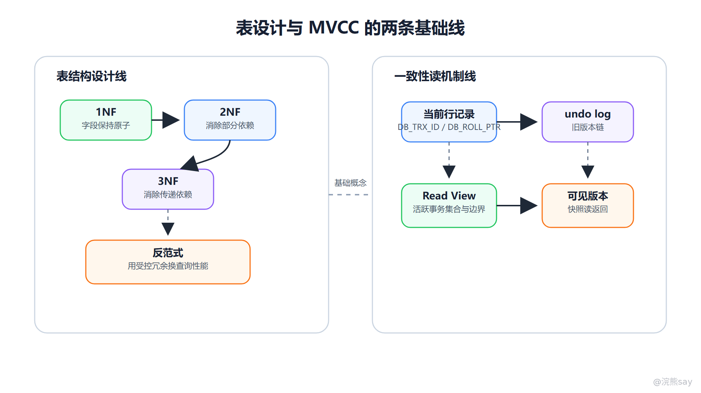
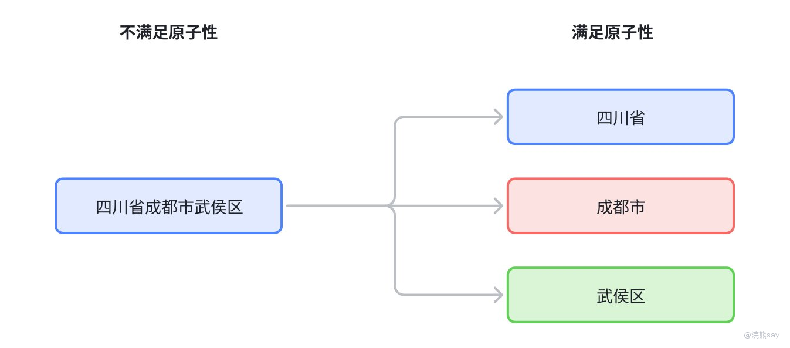
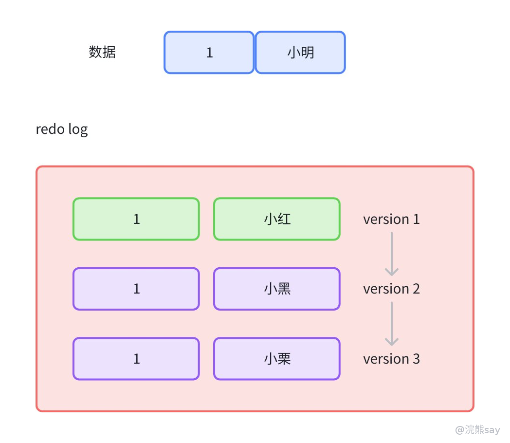

# 01、MySQL 基础：范式、字段类型与 MVCC

MySQL 基础题通常围绕两条线展开：一条是表结构怎么设计，另一条是并发读怎么保持一致。表结构设计包括范式、反范式、字段类型、NULL 语义和时间类型选择；并发读机制则主要指 InnoDB 的 MVCC、Read View 和 undo log。前者决定数据是否清晰、稳定、容易维护，后者决定多个事务同时读写时，数据库能否在减少阻塞的同时提供一致性视图。

这部分内容看起来基础，但面试追问很容易从定义进入工程判断。例如“三范式是不是越高越好”“为什么不建议字段默认允许 NULL”“DATETIME 和 TIMESTAMP 怎么选”“MVCC 是不是完全不加锁”。这些题的共同特点是：只背结论不够，必须说明概念出现的原因、内部机制和使用边界。

images/mysql-01-schema-mvcc.png

图中左侧是表设计主线：先用范式降低冗余，再根据查询压力选择是否反范式。右侧是 MVCC 主线：当前行记录通过隐藏字段关联 undo 版本链，事务创建 Read View 后按可见性规则找到自己应该看到的版本。

## 一、范式解决的是数据冗余和更新异常

范式是关系型数据库表设计中的规范化原则，核心目标是减少数据冗余、降低插入异常、删除异常和更新异常。所谓异常，并不是数据库报错，而是表结构让业务维护变得不可靠。例如部门名称被重复存储在多条员工记录里，部门改名时必须更新很多行，一旦漏改就会出现同一部门多个名称。

images/mysql-schema-normal-forms.png

这张旧图适合放在范式开头：它用拆表前后的字段依赖变化，直观展示了“冗余字段留在一张表里会带来部分依赖或传递依赖，拆成主题更单一的表后更新异常会减少”。

### 1\. 第一范式：字段要保持原子性

第一范式要求表中的每个字段都是不可再分的基本属性。这里的“不可再分”要结合业务含义判断，而不是物理上不能拆。比如一个 address 字段存放“浙江省杭州市西湖区某街道”，如果系统永远只展示完整地址，可以接受；但如果业务需要按省、市、区统计或筛选，就应拆成 province、city、district、detail\_address 等字段。

第一范式出现的原因，是避免把多个可检索、可统计、可约束的属性塞进一个字段。违反第一范式后，查询会依赖字符串解析，索引难以发挥作用，数据校验也会变复杂。面试表达时可以说：第一范式不是机械拆字段，而是要求业务上独立使用的属性不要混在同一列里。

### 2\. 第二范式：非主属性要依赖整个候选键

第二范式建立在第一范式基础上，要求非主属性不能只依赖联合主键的一部分。它主要针对存在联合主键或候选键的表。比如学生选课表以 (student\_id, course\_id) 作为联合主键，如果表中同时保存 student\_name，那么 student\_name 只依赖 student\_id，而不是依赖整个 (student\_id, course\_id)，这就是部分依赖。

部分依赖会造成冗余：同一个学生选多门课，学生姓名会重复存储很多次。更合理的方式是把学生基本信息放到学生表，选课表只保存学生和课程之间的关系。面试时不要把第二范式简单说成“必须有单独主键”，它真正强调的是非主属性对候选键的完整依赖。

### 3\. 第三范式：非主属性之间不要传递依赖

第三范式要求非主属性不能依赖另一个非主属性再间接依赖主键。比如订单明细表里保存 product\_id、product\_name、product\_price，其中 product\_name 和 product\_price 依赖的是 product\_id，而不是订单明细本身。如果产品信息在多条订单明细中重复出现，产品名称变化或价格策略调整时就可能产生不一致。

第三范式的常见拆法是把产品信息放到产品表，订单明细只保存 product\_id、下单数量和下单时价格等事实。这里要注意“下单时价格”可以作为订单事实冗余保存，因为历史订单需要保留下单瞬间的价格，而不是永远跟随产品当前价格变化。这个例子也说明，范式要结合业务事实判断。

## 二、反范式不是违反规范，而是受控冗余

反范式设计是指在已经理解范式的基础上，有意识地保留部分冗余字段，以减少关联查询、提升读性能或固化历史快照。它不是随意把所有字段塞进一张大表，而是用受控冗余换取查询效率。

典型场景包括：订单表保存下单时的用户名、手机号或收货地址快照；报表宽表提前聚合统计维度；列表页冗余展示字段以避免每次关联多张表；读多写少的数据用冗余字段减少查询链路。反范式的代价是写入和更新时必须维护冗余一致性，通常需要通过事务、异步任务、数据校验或定期修复来保证。

面试中如果被问“三范式是不是越高越好”，更稳的回答是：范式有利于减少冗余和更新异常，设计早期应优先保证结构清晰；但在高频查询、历史快照和报表场景中，可以做适度反范式。反范式不是不要规范，而是明确知道冗余字段的来源、更新时机和一致性边界。

## 三、字段类型选择影响存储、索引和语义

字段类型不是只影响能不能存进去，还会影响存储空间、索引长度、比较规则、排序结果和业务语义。一个常见原则是：能用更小、更准确类型表达业务，就不要使用过宽或语义模糊的类型。

### 1\. 数值类型：先看范围，再看精度

整数类型要根据取值范围选择。TINYINT、SMALLINT、INT、BIGINT 占用空间不同，主键或业务编号如果可能增长到很大，应提前选择足够范围。金额、费率、精确小数不建议用 FLOAT 或 DOUBLE，因为浮点数存在精度误差，更适合使用 DECIMAL 或以分为单位的整数存储。

MySQL 中 BOOLEAN 或 BOOL 本质上通常映射为 TINYINT(1)。这意味着数据库不会天然保证值只能是 0 或 1，仍然要依赖应用逻辑、约束或枚举规范。回答布尔类型时，应说明它是整型语义的约定，而不是独立的强布尔类型。

### 2\. 字符串类型：区分定长、变长和大文本

CHAR 是定长字符串，适合长度固定的编码，如性别码、国家码、定长状态码。VARCHAR 是变长字符串，适合大多数长度变化的业务文本，如用户名、标题、手机号。TEXT 适合较长文本，但它通常不适合作为高频索引字段；如果确实要索引长字符串，可以考虑前缀索引，但要评估前缀区分度。

字段长度不应无脑设置很大。长度越大，索引可能越宽，排序和临时表成本也可能增加。对于联合索引来说，长字符串字段还会让单个索引页能容纳的 key 数量减少，间接增加树高和 IO 成本。

### 3\. 枚举和状态：数据库约束与代码枚举要一致

状态字段常用 TINYINT 或短字符串表示。使用整数的好处是存储小、比较快；缺点是可读性依赖代码映射。使用字符串可读性更好，但占用空间和比较成本更高。无论选择哪种方式，都要保证代码枚举、数据库约束和文档含义一致。

实际项目中，状态值一旦进入数据库，就会成为长期兼容对象。字段命名、默认值和状态流转要提前设计清楚，否则后续会出现“代码里删了状态，但历史数据还存在”的问题。

## 四、NULL 与空字符串不是一回事

NULL 表示未知、不存在或不适用，空字符串 '' 表示一个长度为 0 的确定字符串。二者语义完全不同。比如用户没有填写昵称，可以用空字符串表示“填了但为空”，也可以用 NULL 表示“未知或未设置”，但一个系统里必须统一约定。

NULL 会影响比较和聚合。普通比较不能用 = 判断 NULL，而要使用 IS NULL 或 IS NOT NULL。COUNT(\*) 统计行数，会包含 NULL；COUNT(列名) 只统计该列非 NULL 的记录；SUM、AVG 等聚合函数通常会忽略 NULL。如果不了解这些规则，统计结果很容易出现偏差。

在表设计中，如果字段业务上必须有值，建议设置 NOT NULL 并给出合理默认值。这样可以减少三值逻辑带来的判断复杂度，也有助于索引统计更稳定。但这不是说所有字段都不能为 NULL，对于确实未知、不适用或尚未产生的值，NULL 反而更准确。

## 五、DATETIME 与 TIMESTAMP 的区别

DATETIME 和 TIMESTAMP 都能表示日期时间，但语义不同。DATETIME 更像一个不带时区转换的日期时间字面量，常用于订单创建时间、业务发生时间、人工录入时间等希望按原样保存的场景。它表示范围较大，常见范围是 1000-01-01 00:00:00 到 9999-12-31 23:59:59。

TIMESTAMP 会受时区影响，MySQL 存储和读取时会根据会话时区进行转换。它通常占用空间更小，但表示范围较窄，传统范围接近 1970-01-01 00:00:01 到 2038-01-19 03:14:07。如果系统涉及跨时区展示、数据库会话时区配置和历史时间存储，就必须明确选择依据。

面试回答可以从四点展开：时区转换、表示范围、存储空间和适用场景。项目里更关键的是统一规范，例如创建时间、更新时间、业务生效时间、过期时间分别使用什么类型，是否统一使用 UTC，Java 层使用 LocalDateTime 还是 Instant，这些都要和数据库语义对齐。

## 六、MVCC 解决的是一致性读与并发性能的矛盾

MVCC 是 Multi-Version Concurrency Control，多版本并发控制。它的核心思想是：同一行数据在不同事务视角下可以对应不同版本，读操作尽量读取符合当前事务视图的历史版本，而不是总是被正在修改的事务阻塞。这样可以在保证一定隔离性的同时，提高读写并发能力。

images/mysql-mvcc-version-chain.png

旧图里的版本链能补足抽象文字：当前记录保存最新值，历史值沿 undo log 向前串联；事务不是“复制一张表”，而是根据 Read View 在这条版本链上找到自己可见的那一个版本。

MVCC 出现的原因很直接：如果读和写都完全依赖互斥锁，高并发业务中读操作会频繁等待写操作，吞吐量会下降。InnoDB 通过隐藏字段、undo log 和 Read View 维护版本可见性，使普通一致性读可以读取快照版本。这里的普通一致性读通常指普通 SELECT，而不是 SELECT ... FOR UPDATE 这类当前读。

### 1\. 隐藏字段记录版本来源

InnoDB 行记录中会维护一些隐藏信息，常见理解包括最近修改该行的事务 ID 和指向 undo log 的回滚指针。事务更新一行时，新版本会留在数据页中，旧版本信息会通过 undo log 保留下来，形成一条历史版本链。读事务需要旧版本时，就可以沿着回滚指针向前查找。

这并不是说数据库为每次更新都复制一整张表。MVCC 的版本链是围绕被修改的行展开的，历史版本服务于回滚和一致性读。随着事务结束和旧 Read View 不再需要，历史版本可以被 purge 线程清理。

### 2\. undo log 保存旧版本

undo log 一方面用于事务回滚，另一方面用于构造历史版本。当一行从 name='A' 更新为 name='B' 时，undo log 会保存能把新值还原到旧值的信息。另一个较早开始的事务如果按照自己的 Read View 不应看到 B，就可能沿着 undo 版本链读到旧版本 A。

因此，undo log 不只是“回滚日志”。在 MVCC 语境里，它还承担了多版本读取的基础数据来源。长事务会导致旧版本长时间不能清理，undo 版本链变长，可能影响空间占用和查询性能，这也是线上要避免长事务的重要原因之一。

### 3\. Read View 判断版本可见性

Read View 可以理解为事务创建一致性视图时记录的一组事务边界信息，典型包括当前活跃事务 ID 集合、最小活跃事务 ID、下一个将分配的事务 ID 等。读某个版本时，InnoDB 会根据该版本的事务 ID 和 Read View 判断它对当前事务是否可见。

在读已提交（RC）隔离级别下，每次一致性读通常都会生成新的 Read View，所以同一事务中两次读取可能看到其他事务刚提交的新数据。在可重复读（RR）隔离级别下，事务第一次一致性读创建 Read View 后，后续一致性读复用该视图，因此能保证同一事务内多次读取结果相对稳定。这个差异是面试高频点。

## 七、MVCC 的边界：快照读不等于所有读都不加锁

MVCC 主要服务一致性非锁定读，也就是普通快照读。对于当前读，例如 UPDATE、DELETE、INSERT、SELECT ... FOR UPDATE、SELECT ... LOCK IN SHARE MODE，数据库需要读取最新已提交版本并加锁，以保证后续修改的正确性。

因此，不能把 MVCC 理解成“InnoDB 不需要锁”。更准确的说法是：普通一致性读通过 MVCC 减少读写阻塞；涉及修改或显式锁定的当前读仍然依赖锁机制。在 RR 隔离级别下，InnoDB 还会结合 next-key lock 等机制处理范围读写冲突和幻读风险。

## 八、面试表达模板

如果被问“三范式是什么”，可以这样回答：三范式是表结构规范化的三个层次，第一范式要求字段原子，第二范式要求非主属性依赖整个候选键，第三范式要求非主属性之间不存在传递依赖。它们的目标是减少冗余和更新异常。但工程中不是范式越高越好，在高频查询、历史快照和报表场景中可以做受控反范式。

如果被问“MVCC 如何实现”，可以这样回答：InnoDB 的 MVCC 依赖隐藏字段、undo log 和 Read View。更新行时通过 undo log 保留旧版本，行记录通过回滚指针关联版本链；一致性读创建 Read View 后，根据事务 ID 可见性规则判断哪个版本对当前事务可见。RC 通常每次读生成新 Read View，RR 通常复用第一次一致性读的 Read View。MVCC 主要服务快照读，当前读仍然要加锁。

## 九、常见追问与练习

**练习 1：一张员工表中同时保存 dept\_id 和 dept\_name，一定违反第二范式吗？** 
答案：要看主键和业务含义。如果员工表主键是 employee\_id，dept\_name 通过 dept\_id 间接依赖员工，主要问题更接近传递依赖；如果是员工部门关系表，以 (employee\_id, dept\_id) 为联合主键，某些字段只依赖其中一部分，则可能涉及第二范式问题。答题时不要只看字段名，要看依赖关系。

**练习 2：为什么金额字段不建议使用 DOUBLE？** 
答案：DOUBLE 是浮点类型，存在二进制表示带来的精度误差，不适合金额、余额、结算这类要求精确的小数。更常见的做法是使用 DECIMAL，或者用整数保存最小货币单位。

**练习 3：COUNT(\*) 和 COUNT(name) 有什么区别？** 
答案：COUNT(\*) 统计符合条件的行数，包括 name 为 NULL 的行；COUNT(name) 只统计 name 非 NULL 的行。如果 name 列存在 NULL，两者结果可能不同。

**练习 4：RR 隔离级别下，普通 SELECT 为什么能可重复读？** 
答案：在 InnoDB 中，RR 下事务第一次一致性读通常创建 Read View，后续一致性读复用同一个视图，因此其他事务后续提交的新版本对当前事务不可见。这个机制依赖 undo 版本链和可见性判断。

**练习 5：MVCC 能完全避免幻读吗？** 
答案：普通快照读在 RR 下通过固定 Read View 可以避免同一事务内读到新插入记录的变化；但当前读需要依赖锁机制，InnoDB 通常通过 next-key lock 等方式控制范围插入。因此不能只说 MVCC 完全解决幻读，要区分快照读和当前读。

## 十、准备标准

这一篇要准备到能说清三类问题：第一，范式和反范式分别解决什么、牺牲什么；第二，字段类型、NULL、时间类型如何影响存储和语义；第三，MVCC 的版本链、Read View 和隔离级别差异如何配合。只要能把这三类问题讲成机制链路，而不是散点定义，MySQL 基础题基本就稳了。
