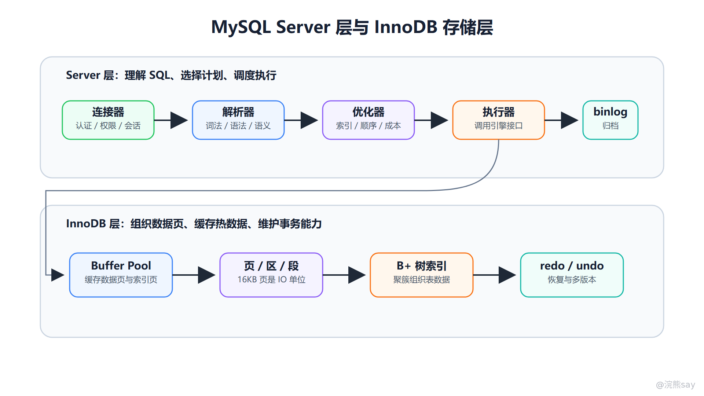
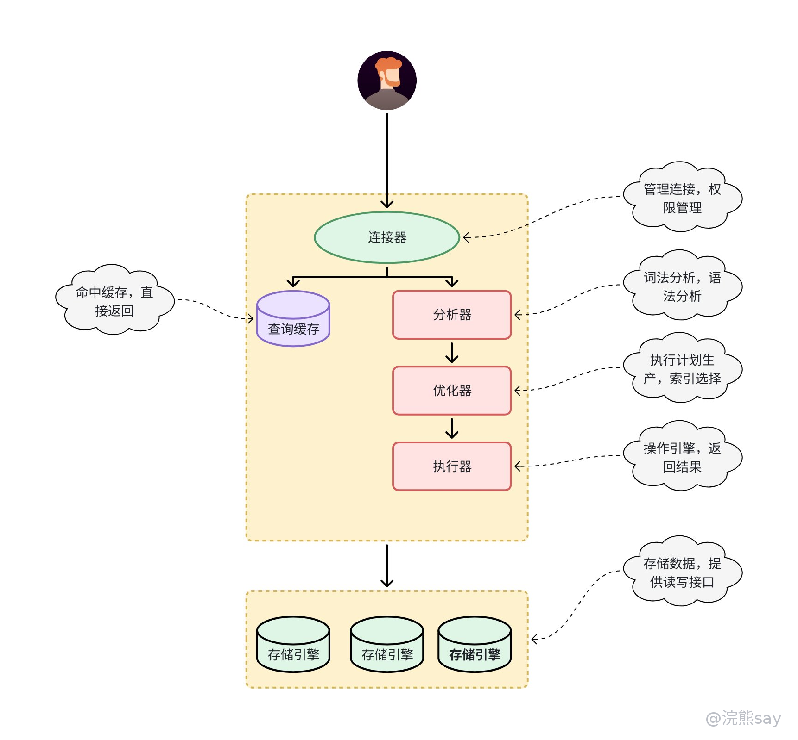
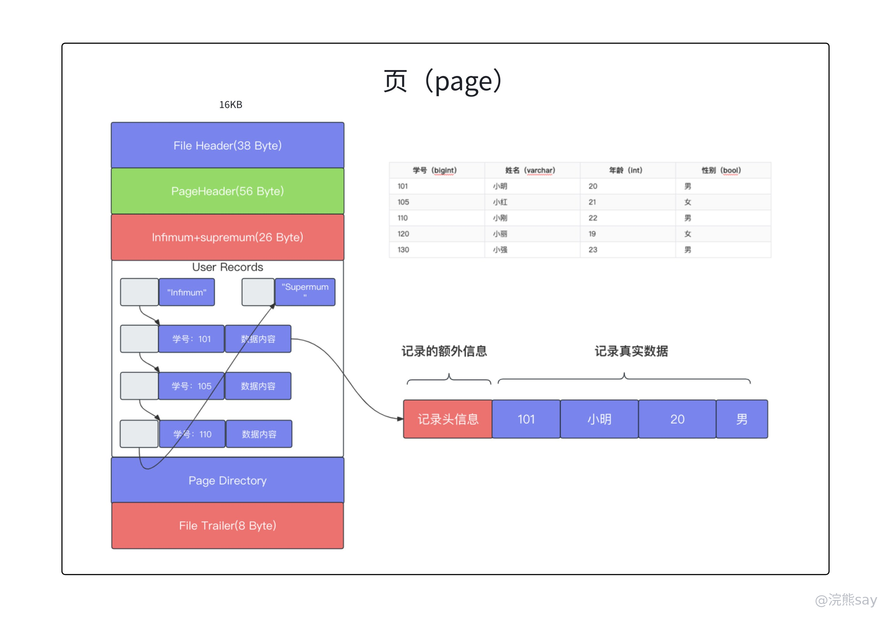
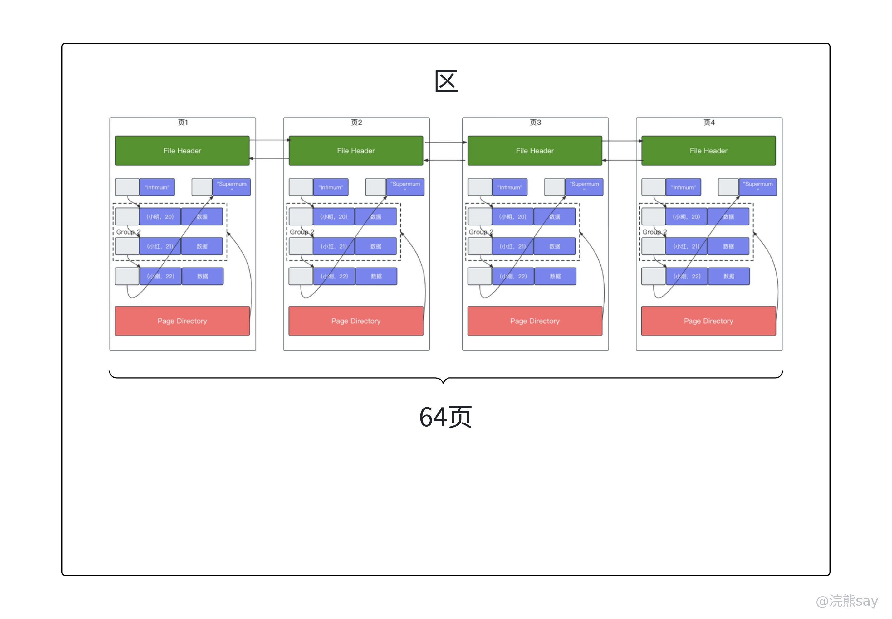

# 02、MySQL 基础架构与存储引擎

MySQL 的基础架构可以分成两层理解：Server 层负责连接管理、SQL 解析、权限校验、优化和执行调度；存储引擎层负责数据如何组织、如何读写、如何加锁、如何支持事务和崩溃恢复。这个分层是很多 MySQL 八股题的根。只要能讲清 Server 层和 InnoDB 层的边界，就能更自然地解释 SQL 执行链路、binlog 与 redo log 的区别、InnoDB 与 MyISAM 的差异，以及为什么索引和数据页会影响性能。

面试中常问“一条 SQL 在 MySQL 中如何执行”。这个问题表面是流程题，本质是在考你是否知道各组件责任：连接器不是执行 SQL 的，优化器不是读取数据页的，存储引擎也不负责理解完整 SQL 语义。把边界讲清楚，比背一串组件名更重要。

images/mysql-02-architecture-engine.png

图中上半部分是 Server 层，SQL 从连接器进入，经过解析器、优化器和执行器；下半部分是 InnoDB 层，真正的数据访问会落到 Buffer Pool、页、B+ 树索引和事务日志等结构上。

images/mysql-sql-execution-architecture-legacy.png

这张旧图可以作为 SQL 执行链路的补充视角：它把客户端、连接器、解析器、优化器、执行器和存储引擎放在同一条路径上，更适合用来记忆“一条 SQL 进入 MySQL 后先后经过哪些组件”。

## 一、连接器：SQL 执行前先建立会话

连接器负责客户端连接、身份认证、权限读取和会话状态维护。客户端通过 TCP 或本地 socket 连接 MySQL 后，连接器会校验用户名、密码和主机来源，认证成功后读取该用户的权限信息。后续执行 SQL 时，权限判断会基于这些信息进行。

连接不是越多越好。每个连接都需要维护会话状态和资源，如果连接数过高，会造成线程、内存和上下文切换压力。Java 项目通常通过连接池复用连接，例如 HikariCP。面试时如果被问“为什么需要数据库连接池”，可以从避免频繁创建连接、控制并发连接数、复用会话资源和降低数据库压力几个角度回答。

MySQL 中还存在长连接问题。长连接复用虽然减少建立连接的成本，但如果长期不释放，某些连接占用的内存可能持续累积。实际项目中会通过连接池最大生命周期、空闲回收、连接健康检查等配置控制风险。

## 二、查询缓存：老版本概念要注意版本边界

早期 MySQL 中存在查询缓存，它会把完全相同 SQL 的结果缓存起来。如果表没有发生变化，再次执行相同查询可以直接返回缓存结果。但查询缓存对更新频繁的表收益很低，因为表一旦更新，相关缓存就会失效。缓存失效和维护成本在高并发业务中反而可能拖慢性能。

MySQL 8.0 已经移除查询缓存。因此回答 SQL 执行链路时，不能把查询缓存当成现代 MySQL 的核心流程。更稳的说法是：早期版本可能存在查询缓存，但 MySQL 8.0 已移除；现代业务通常通过应用缓存、Redis、物化统计表或搜索引擎来解决高频读问题，而不是依赖 MySQL 查询缓存。

这个点容易出选择题。看到“查询缓存”时要立刻想到版本差异，不要机械回答“先查缓存”。如果题目明确是 MySQL 5.7 或更早版本，可以说明缓存命中条件苛刻；如果是 MySQL 8.0，则应说明已移除。

## 三、解析器：把字符串变成语法树

解析器负责词法分析和语法分析。词法分析会识别 SQL 字符串中的关键字、表名、字段名、操作符和常量；语法分析会判断 SQL 是否符合 MySQL 语法规则，并构造可以被后续组件理解的结构。比如 select \* form user 中 form 拼错，就会在解析阶段报语法错误。

解析阶段还能发现一部分语义问题，例如表名、字段名无法识别。不过权限、执行计划和实际数据访问不是解析器的职责。回答时可以强调：解析器解决“SQL 写得合不合法、能不能被理解”，优化器解决“怎么执行更便宜”，执行器和存储引擎解决“如何真正取数或改数”。

## 四、优化器：选择成本更低的执行计划

优化器负责生成执行计划。它会根据统计信息、索引情况、条件过滤能力、连接顺序和成本估算，决定是否使用索引、使用哪个索引、表连接顺序如何安排、是否需要排序或临时表。优化器不是永远选择你“以为应该用”的索引，而是选择它估算成本更低的路径。

这解释了为什么 SQL 写到了索引字段，不代表一定走索引。如果表很小、索引区分度很低、返回行比例很高，或者统计信息不准确，优化器可能认为全表扫描更划算。面试中回答“索引为什么没生效”时，最好补一句：最终要以 EXPLAIN 和实际执行计划为准，因为优化器是基于成本选择的。

优化器也会做一些等价变换和条件下推。比如能在存储引擎层提前过滤的条件，会尽量减少返回给 Server 层的行数。但优化器不能改变 SQL 的语义，也不能凭空创造不存在的索引。好的 SQL 和好的索引设计，仍然是优化器做出好选择的前提。

## 五、执行器：按计划调用存储引擎接口

执行器拿到执行计划后，会检查权限并调用存储引擎接口。对于查询语句，执行器会按计划逐步获取记录、过滤条件、组装结果；对于更新语句，执行器会调用引擎修改数据，并配合日志机制完成持久化和复制所需的信息记录。

执行器本身不直接理解 InnoDB 页结构，也不直接遍历 B+ 树的内部细节。它更像调度者：知道要按哪个访问路径取数据，但具体如何从 Buffer Pool 或磁盘页中读取，由存储引擎完成。这个边界能帮助理解“Server 层 binlog”和“InnoDB redo log”为什么分属不同层。

## 六、InnoDB 为什么成为默认引擎

InnoDB 是 MySQL 当前最常用的事务型存储引擎。它支持事务、行级锁、MVCC、外键、崩溃恢复和聚簇索引，适合绝大多数在线业务系统。现代 Java 后端对数据一致性、并发写入、故障恢复和在线扩展要求都较高，因此默认选择 InnoDB 是合理的。

InnoDB 的核心能力可以从四个方面理解。第一，它通过 redo log 支持崩溃恢复，使已提交事务在异常宕机后尽量不丢失。第二，它通过 undo log 支持回滚和 MVCC 历史版本。第三，它通过行锁、间隙锁、next-key lock 等机制处理并发冲突。第四，它通过 Buffer Pool 缓存数据页和索引页，减少磁盘 IO。

面试中不要简单说“InnoDB 性能一定比 MyISAM 好”。更准确的表达是：InnoDB 更适合事务、高并发写入和可靠性要求高的业务；MyISAM 结构更简单，历史上在某些读多写少、无需事务的场景中使用过，但现代业务通常优先 InnoDB。

## 七、Buffer Pool：InnoDB 的内存核心

Buffer Pool 是 InnoDB 最重要的内存区域之一，用来缓存数据页和索引页。由于磁盘访问远慢于内存访问，InnoDB 不会每次查询都直接读磁盘，而是优先在 Buffer Pool 中查找目标页。如果页已经在内存中，就可以减少一次磁盘 IO；如果不在，则从磁盘加载整个页到 Buffer Pool。

这里要注意，InnoDB 读写的基本单位通常是页，而不是单行。即使查询只需要一行，底层也会把所在的数据页加载进来。默认页大小通常是 16KB。理解这一点后，B+ 树为什么要降低树高、覆盖索引为什么能减少回表、预读和页分裂为什么影响性能，都会更容易理解。

Buffer Pool 还涉及脏页。事务修改数据时，可能先修改内存中的数据页，此时内存页和磁盘页不一致，这个页称为脏页。InnoDB 会在合适时机把脏页刷回磁盘，而不是每次提交都立即随机写完整数据页。redo log 的存在使这种延迟刷盘仍然可以支持崩溃恢复。

## 八、页、区、段：InnoDB 如何组织数据

InnoDB 的数据组织可以按“表空间、段、区、页、行”理解。表空间是逻辑容器，独立表空间开启后，一张表通常对应自己的 .ibd 文件。段用于管理某类数据结构的空间，例如索引段。区由连续的页组成，常见大小是 1MB。页是 InnoDB 磁盘 IO 和 Buffer Pool 管理的基本单位，默认大小 16KB。行记录则存放在页中。

images/mysql-innodb-page-structure.png

页结构图适合帮助理解“页不是只有一行记录”：页头、槽目录、用户记录和空闲空间共同组成一个 16KB 左右的管理单元，InnoDB 查询、分裂和刷盘都围绕页展开。

images/mysql-innodb-extent-pages.png

区的示意图进一步说明：多个连续页会组成一个区，段再管理不同用途的区。理解这个层次后，B+ 树节点、页分裂、范围扫描和空间碎片这些问题会更容易连起来。

页是理解 InnoDB 性能的关键。B+ 树的每个节点通常对应一个页，查询沿着根节点、内部节点到叶子节点定位数据。树高越低，定位一条记录需要访问的页数通常越少。一个页能容纳越多索引项，树的分支因子越大，树高越低。这也是为什么主键要尽量短小：二级索引叶子节点保存主键值，主键过长会让所有二级索引变大。

区和段主要用于空间分配和管理。当数据增长时，InnoDB 需要以相对连续的方式分配空间，减少碎片并提升范围扫描效率。面试一般不要求深入到源码级空间管理，但要知道 InnoDB 不是把行随意散落在文件里，而是围绕页、区、段形成层次化组织。

## 九、聚簇索引让 InnoDB 的表按主键组织

InnoDB 使用聚簇索引组织表数据。聚簇索引的叶子节点保存完整行记录，通常由主键构成。如果表没有显式主键，InnoDB 会尝试选择唯一非空索引；如果还没有，就会生成隐藏 row id。由于表数据本身按聚簇索引组织，所以一张 InnoDB 表通常只有一个聚簇索引。

二级索引的叶子节点保存的是主键值，而不是完整行记录。通过二级索引定位到主键后，如果查询还需要其他不在二级索引中的字段，就要回到聚簇索引再查一次完整行，这就是回表。这个结构既解释了主键查询为什么高效，也解释了覆盖索引为什么能减少回表。

主键设计因此很重要。推荐稳定、短小、递增或大体递增的主键，是因为主键会出现在所有二级索引中，主键过长会放大索引体积；主键频繁变化会带来维护成本；随机主键可能导致页分裂更频繁。

## 十、MyISAM 的组织方式与适用边界

MyISAM 是早期常见的 MySQL 存储引擎。它不支持事务和行级锁，主要使用表锁，也不支持 MVCC 和崩溃安全恢复能力。它的数据文件和索引文件分离：表结构、数据和索引分别存储在不同文件中，索引叶子节点通常保存数据记录的地址。

InnoDB 和 MyISAM 可以从几个角度对比：事务能力上，InnoDB 支持事务，MyISAM 不支持；锁粒度上，InnoDB 支持行锁和表锁，MyISAM 主要是表锁；恢复能力上，InnoDB 依赖 redo log 等机制更强，MyISAM 较弱；索引组织上，InnoDB 主键索引是聚簇索引，MyISAM 索引与数据分离；并发能力上，InnoDB 更适合高并发读写。

面试时可以补充历史边界：MyISAM 曾在读多写少、无需事务、结构简单的场景出现，但现代在线业务默认优先 InnoDB。不要把 MyISAM 说成“完全没用”，也不要忽略它缺少事务和崩溃恢复能力这个核心差异。

## 十一、面试表达模板

如果被问“一条查询 SQL 怎么执行”，可以这样回答：客户端先通过连接器建立连接并完成认证和权限相关处理；SQL 到达后由解析器做词法、语法和语义分析；优化器根据统计信息和索引情况选择执行计划；执行器按计划调用存储引擎接口；InnoDB 再通过 Buffer Pool、B+ 树索引和数据页完成实际读取，最后结果返回给客户端。MySQL 8.0 已移除查询缓存，不能把它作为现代执行链路的核心步骤。

如果被问“InnoDB 和 MyISAM 区别”，可以这样回答：InnoDB 支持事务、行级锁、MVCC、外键和崩溃恢复，使用聚簇索引组织表数据；MyISAM 不支持事务，主要使用表锁，索引和数据分离，恢复能力较弱。现代业务一般优先 InnoDB，因为它更适合高并发写入和可靠性要求高的场景。

## 十二、常见追问与练习

**练习 1：优化器一定会选择我们创建的索引吗？** 
答案：不一定。优化器会根据统计信息和成本估算选择执行计划。如果索引区分度低、返回行比例高、表很小或统计信息不准确，优化器可能选择全表扫描。最终要看 EXPLAIN。

**练习 2：为什么 MySQL 8.0 不再保留查询缓存？** 
答案：查询缓存要求 SQL 完全相同且相关表未更新才容易命中。更新频繁的业务表会导致缓存频繁失效，维护成本高于收益，因此 MySQL 8.0 移除了查询缓存。

**练习 3：Buffer Pool 缓存的是行还是页？** 
答案：主要缓存数据页和索引页。InnoDB 的基本 IO 单位通常是页，默认 16KB。即使只查询一行，也可能加载整页到 Buffer Pool。

**练习 4：为什么主键过长会影响二级索引？** 
答案：InnoDB 二级索引叶子节点保存主键值。主键越长，所有二级索引叶子节点占用空间越大，一个页能容纳的索引项越少，可能增加树高和 IO 成本。

**练习 5：MyISAM 为什么不适合高并发写入业务？** 
答案：MyISAM 不支持事务和 MVCC，主要使用表锁，写入时更容易阻塞其他操作，崩溃恢复能力也弱。高并发写入和强一致性场景更适合 InnoDB。

## 十三、准备标准

这一篇至少要准备到能画出 SQL 执行链路，能说清 Server 层和 InnoDB 层的职责边界，能解释 Buffer Pool 为什么围绕页工作，能比较 InnoDB 和 MyISAM。后续学习索引、日志、锁和事务时，都要不断回到这个分层模型里理解。
