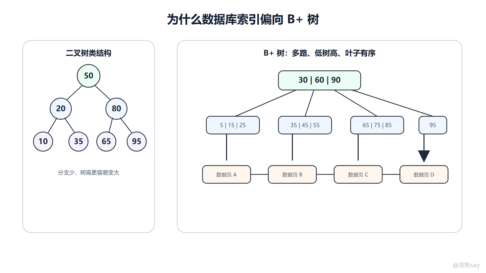
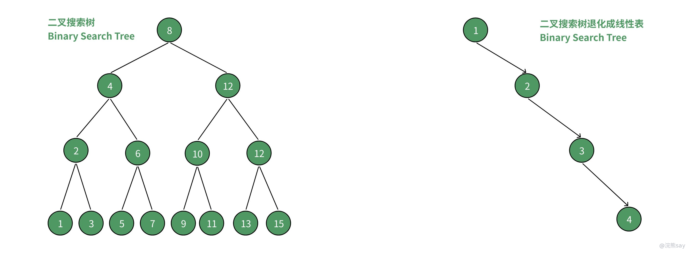
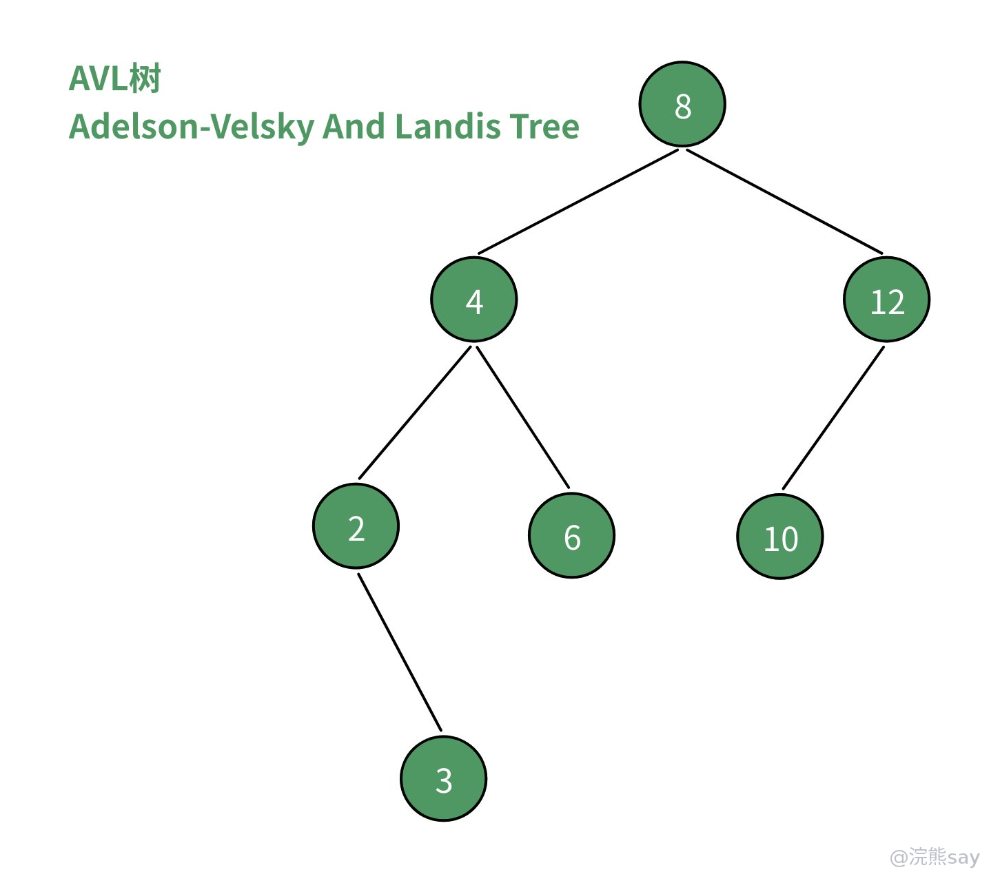
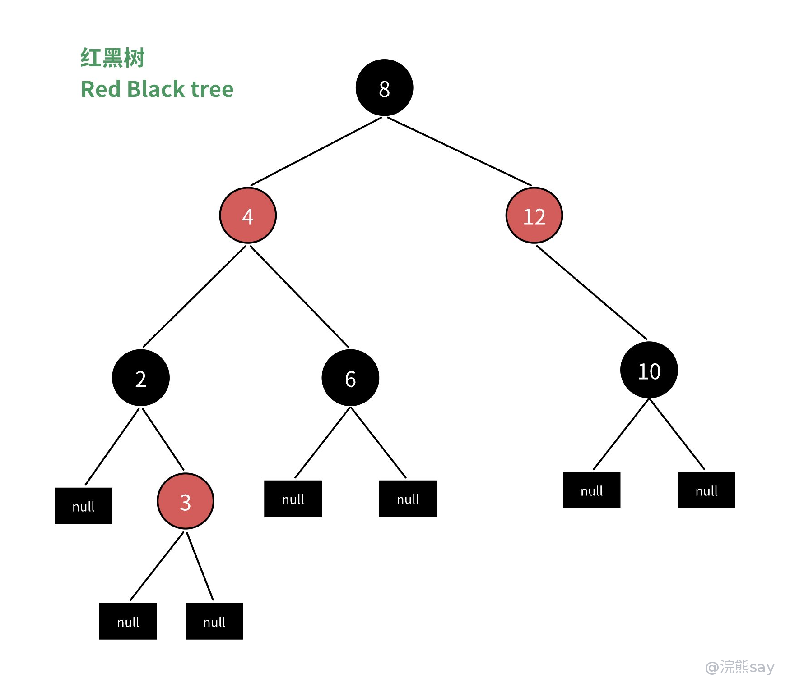
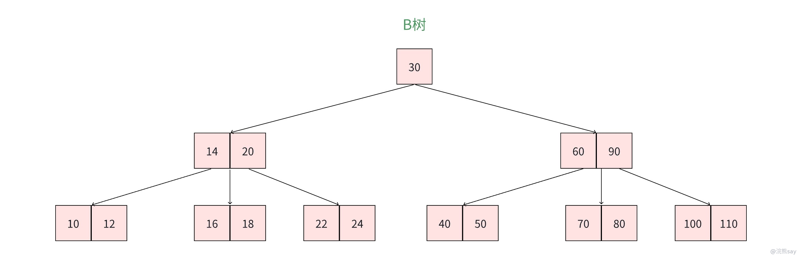
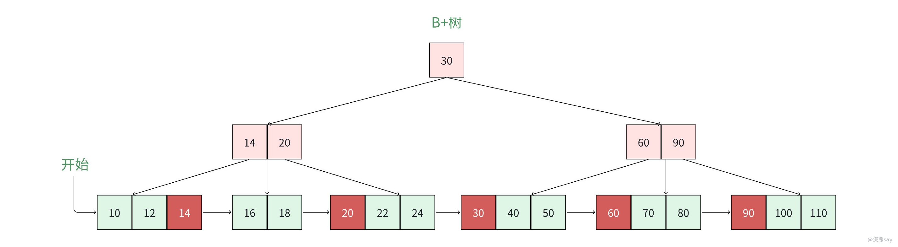

# 03、MySQL 索引原理：从树结构到 B+ 树

索引是一种帮助数据库快速定位数据的数据结构。它的核心价值不是抽象地“加快查询”，而是减少需要扫描的记录数和访问的数据页数。对于 InnoDB 这类以页为基本 IO 单位的存储引擎来说，索引结构设计的关键是：尽量用更少的磁盘页访问定位目标记录，并且支持数据库常见的范围查询、排序和顺序扫描。

理解索引时，不能只背“InnoDB 用 B+ 树”。更好的学习路径是先理解磁盘 IO 为什么昂贵，再比较 Hash、二叉搜索树、AVL 树、红黑树、B 树和 B+ 树各自适合什么场景。这样回答“为什么不用 Hash”“为什么不用红黑树”“B 树和 B+ 树有什么区别”时，才不会只剩一句结论。

images/mysql-03-bplus-io.png

图中左侧展示二叉树类结构的局限：分支少，树高更容易变大。右侧展示 B+ 树的优势：内部节点能容纳多个 key，树高更低；叶子节点保存数据并有序相连，适合范围扫描。

## 一、索引为什么能提升查询效率

没有索引时，数据库可能需要从表的第一行开始逐行判断条件，这就是全表扫描。数据量小时，全表扫描未必明显慢；但当表达到百万、千万行，扫描行数和数据页访问量会显著增加。索引相当于给数据建立了一个有序的访问路径，让数据库先通过索引定位候选范围，再访问真正需要的记录。

索引的收益主要体现在三个方面。第一，减少扫描行数，例如通过主键或高区分度字段快速定位少量记录。第二，减少排序和分组成本，如果索引顺序和查询顺序匹配，可以避免额外排序。第三，减少回表成本，如果查询字段被索引覆盖，可以直接从索引中返回结果。

索引也有代价。它会占用存储空间；插入、删除、更新时需要维护索引结构；索引过多会增加写入成本，也可能让优化器面对更多候选路径。面试中不要说“字段建索引一定更快”，更准确的说法是：索引是用空间和写入维护成本换读取效率，是否值得要看查询频率、区分度、返回行数和写入压力。

## 二、数据库索引首先要考虑磁盘 IO

内存数据结构追求 CPU 比较次数，磁盘数据结构还要追求页访问次数。InnoDB 默认页大小通常是 16KB，查询一条记录时，底层往往不是只读一行，而是把所在页加载到 Buffer Pool。一次随机磁盘 IO 的代价远高于一次内存比较，因此索引结构应尽量降低从根节点到目标叶子节点经过的页数。

这就是“树高”很重要的原因。如果一棵树高度是 5，定位一条记录可能要访问 5 层节点；如果高度是 3，可能只需要 3 次页访问。真实系统中根节点和部分内部节点可能常驻 Buffer Pool，但树高仍然会影响冷数据访问、范围扫描和缓存命中后的整体成本。

因此，适合数据库的索引结构通常要满足三个条件：分支因子足够大，树高低；key 有序，能支持范围查询；结构维护成本可控，插入删除后仍能保持平衡。B+ 树正是围绕这些目标设计出来的。

## 三、Hash 索引：等值查询快，但不适合通用场景

Hash 索引通过哈希函数把 key 映射到桶中，理论上等值查询可以接近 O(1)。如果查询模式只有 where id = ?，Hash 的定位能力很强。问题在于数据库查询并不只有等值匹配，还大量存在范围查询、排序、分组、前缀匹配和顺序扫描。

例如：

select \* from user where age between 20 and 30 order by age;

Hash 结构无法天然保持 age 的有序性，不能从 20 顺序扫描到 30，也不能直接利用索引顺序完成排序。它还要处理哈希冲突，冲突严重时查询性能会下降。正因为如此，Hash 更适合精确等值查找，不适合作为 InnoDB 普通索引的主要结构。

InnoDB 中存在自适应 Hash 索引，但它是引擎内部根据访问模式自动维护的优化结构，不等于我们手动创建的普通索引。面试回答时要区分：Hash 思想在某些场景有价值，但通用关系型查询更需要有序结构。

## 四、二叉搜索树：有序，但可能退化

二叉搜索树要求左子树 key 小于根节点，右子树 key 大于根节点，左右子树也满足同样规则。它支持有序查找，树平衡时查询复杂度可以接近 O(log n)。相比 Hash，它能表达大小关系，理论上更适合范围查找。

images/mysql-bst-balanced-comparison.png

这张旧图把“退化链表”和“平衡二叉搜索树”的高度差放在一起，适合用来说明：同样是有序结构，形态是否平衡会直接影响查找路径长度。

普通二叉搜索树的问题是容易退化。如果数据按递增顺序插入，树可能退化成链表，查询复杂度从 O(log n) 退化为 O(n)。对于数据库来说，这意味着访问路径变长，页访问次数增加，性能不稳定。

二叉搜索树还存在分支因子小的问题。每个节点最多只有两个孩子，在数据量很大时树高会相对较高。即使树保持平衡，和多路树相比也需要更多层级。它更适合作为理解有序查找的基础，不适合作为磁盘数据库的主要索引结构。

## 五、AVL 树：严格平衡，但维护成本高

AVL 树是一种严格平衡的二叉搜索树，要求任意节点左右子树高度差不超过 1。它通过旋转保持高度平衡，因此查询性能稳定，适合对查找性能要求高、数据主要在内存中的场景。

images/mysql-avl-tree-example.png

AVL 图可以配合理解“严格平衡”的含义：每个节点都要维护高度差约束，查询路径稳定，但插入、删除后的旋转维护也更频繁。

AVL 树的局限在于维护成本较高。插入和删除后可能需要多次旋转来恢复平衡。对于数据库索引来说，写入、删除和页分裂本来就有成本，如果再叠加频繁旋转，会让维护开销变大。

更关键的是，AVL 仍然是二叉树。它的分支少，树高相对多路树更高。在磁盘页场景中，减少树高比追求二叉树层面的严格平衡更重要。因此，AVL 常见于内存数据结构，不是 InnoDB 普通索引的理想选择。

## 六、红黑树：工程上常用，但仍不适合磁盘页索引

红黑树也是自平衡二叉搜索树，但它不像 AVL 那样追求严格平衡，而是通过颜色规则保证大致平衡。它插入和删除时旋转次数通常较少，因此在工程中应用广泛，例如 Java 的 TreeMap、TreeSet，以及 HashMap 中链表树化后的结构。

images/mysql-red-black-tree-example.png

红黑树图适合强调“工程常用”和“数据库索引不选它”并不矛盾：它在内存映射结构里很优秀，但仍然是二叉树，分支因子比多路树小。

红黑树适合内存中的有序映射结构，因为内存访问成本低，节点指针跳转的代价可以接受。但数据库索引面对的是页级 IO。红黑树每个节点能放的 key 少，树高比 B/B+ 树高，节点之间的指针跳转可能对应更多随机页访问。

所以回答“为什么不用红黑树”时，不要说红黑树不好。更准确的说法是：红黑树适合内存结构，维护成本和查询稳定性都不错；但它是二叉树，分支因子小，树高相对大，不适合以磁盘页为基本访问单位的数据库索引。

## 七、B 树：多路平衡降低树高

B 树是多路平衡搜索树。一个节点可以存放多个 key 和多个子指针，这使得同样数据量下树高明显低于二叉树。每个节点可以设计成接近一个磁盘页大小，一次 IO 读入一个节点，就能在内存中完成多个 key 的比较并决定下一层路径。

images/mysql-btree-structure.png

B 树图能够直观看出“一个节点多个 key、多个分支”的核心价值：一次页访问不只比较一个 key，而是利用页内空间做更多分流，从而降低树高。

B 树的出现，正是为了适应外存访问。它通过提高分支因子减少树高，从而减少磁盘 IO 次数。相比二叉树，B 树更接近数据库索引的目标：少访问页，访问后充分利用页内空间。

B 树中，非叶子节点和叶子节点都可以存储数据记录或数据指针。这意味着查询命中某个内部节点时可能提前结束。但它也带来一个问题：内部节点存放数据后，一个节点能容纳的 key 和子指针数量会减少，树的分支能力受到影响。

## 八、B+ 树：让内部节点更像目录页

B+ 树是在 B 树基础上的改进。它通常让非叶子节点只保存 key 和子指针，完整数据记录都放在叶子节点；叶子节点之间通过链表按顺序连接。这样一来，内部节点能容纳更多 key，树更矮；所有查询最终都走到叶子节点，路径长度更稳定；范围查询命中起点后，可以沿叶子链表顺序扫描。

images/mysql-bplus-tree-leaf-chain.png

这张旧图补充了叶子节点有序链表的细节：等值查询沿目录页向下定位，范围查询命中起点后可以沿叶子层顺序扫描，这正是 B+ 树比普通 B 树更适合数据库范围查询的原因。

这几个特点刚好匹配数据库需求。第一，树高低意味着随机 IO 更少。第二，叶子节点有序连接，适合 between、>、 20？** 
答案：Hash 结构不保存 key 的有序关系，无法从某个起点顺序扫描范围。范围查询需要有序结构支持，因此 B+ 树更适合。

**练习 2：普通二叉搜索树为什么可能退化？** 
答案：如果按递增或递减顺序插入，普通二叉搜索树可能退化成链表，查询复杂度从 O(log n) 变为 O(n)，访问路径不稳定。

**练习 3：AVL 树查询很稳定，为什么还不适合作为 InnoDB 主要索引？** 
答案：AVL 是严格平衡二叉树，维护平衡成本较高，而且每个节点分支少，树高相对多路树更高。数据库索引更关注减少磁盘页访问次数，多路 B+ 树更适合。

**练习 4：B+ 树为什么适合范围查询？** 
答案：B+ 树所有数据通常在叶子节点，叶子节点按 key 有序并通过链表连接。找到范围起点后，可以沿叶子链表顺序扫描到范围终点。

**练习 5：B+ 树一定比 Hash 快吗？** 
答案：不一定。纯等值查询且数据在内存中时，Hash 可能更快。但数据库通用索引需要支持范围、排序、前缀匹配和顺序扫描，B+ 树综合能力更强。

## 十三、准备标准

这一篇要准备到能从磁盘 IO 角度解释索引，而不是只背 B+ 树。你应该能比较 Hash、BST、AVL、红黑树、B 树和 B+ 树的适用场景，并能把 B+ 树的低树高、目录节点、叶子链表和范围扫描优势讲清楚。后续学习聚簇索引、联合索引和回表时，都要回到这套结构理解。
