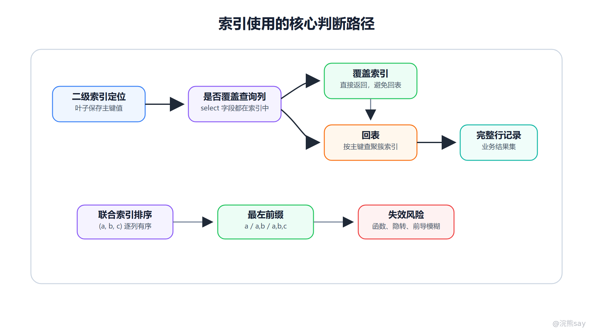
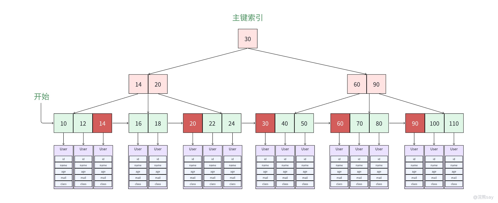
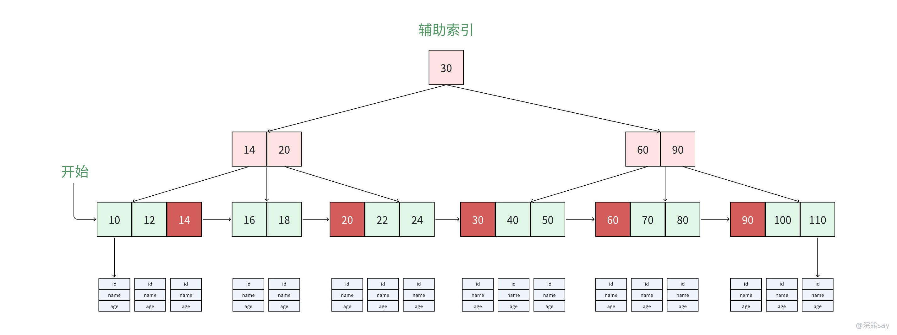

# 04、MySQL 索引分类与使用原则

索引分类与使用原则是 MySQL 面试中最容易连续追问的一块。前一篇解决“为什么 InnoDB 普通索引主要使用 B+ 树”，这一篇解决“索引在真实 SQL 中怎么用”。面试官通常不会只问“索引有哪些类型”，而会继续问聚簇索引和非聚簇索引的区别、二级索引为什么会回表、联合索引为什么有最左前缀、覆盖索引怎么减少 IO、索引下推解决什么问题、哪些写法会让索引失效。

索引使用的核心不是把所有字段都建索引，而是让高频 SQL 拥有一条成本更低的访问路径。这个成本包括扫描行数、访问页数、回表次数、排序成本、写入维护成本和存储空间。只讲“建索引能加快查询”是不够的，必须能解释它在 InnoDB 的结构里为什么快、什么时候不快、怎样设计更稳。

images/mysql-04-index-decision.png

图中上半部分展示二级索引查询的判断路径：如果索引覆盖查询字段，可以直接返回；否则需要按主键回到聚簇索引。下半部分展示联合索引的使用逻辑：先看排序方式和最左前缀，再排查函数、隐式转换、前导模糊等失效风险。

## 一、按数据结构分类：B+Tree、Hash、全文和空间索引

MySQL 常见索引可以按底层结构分为 B+Tree 索引、Hash 索引、全文索引和空间索引。InnoDB 普通索引主要是 B+Tree 结构，适合等值查询、范围查询、排序、分组和前缀匹配。它是面试和实际开发中最核心的索引类型。

Hash 索引适合等值查询，但不适合范围查询和排序。InnoDB 的自适应 Hash 索引是引擎内部优化，不是开发者手动创建普通索引时的默认选择。全文索引用于文本检索，适合关键词匹配，不等同于普通 LIKE 查询。空间索引用于 GIS 空间数据，普通 Java 后端八股中出现较少。

按结构分类的目的不是背名词，而是明确每种索引适合什么查询模式。B+Tree 是通用能力最强的结构；Hash 偏等值；全文索引偏文本相关性；空间索引偏地理空间计算。面试中如果题目没有特殊说明，讨论 MySQL 索引通常默认围绕 InnoDB B+Tree 索引。

## 二、按约束和用途分类：主键、唯一、普通、联合、前缀

主键索引用于唯一标识一行记录，要求非空且唯一。在 InnoDB 中，主键索引也是聚簇索引，叶子节点保存完整行记录。唯一索引用于保证某个字段或字段组合唯一，但允许规则要结合数据库版本和 NULL 语义理解；普通索引只加速查询，不保证唯一性。

联合索引由多个字段组成，例如 (user\_id, status, create\_time)。它适合多个条件经常一起出现的查询，也可以服务排序和覆盖索引。前缀索引用于较长字符串字段，只取前 N 个字符建立索引，以减少索引大小。前缀索引需要评估区分度，前缀太短过滤效果差，太长又失去节省空间的意义。

这些分类在实际设计中会叠加。例如一个联合唯一索引既是联合索引，也是唯一索引；一个长字符串字段的联合索引可能同时使用前缀。回答时不要把分类理解成互斥集合，而要说明分类维度不同。

## 三、聚簇索引与非聚簇索引

聚簇索引是指数据行和索引组织在一起。在 InnoDB 中，表数据按主键索引组织，主键 B+ 树的叶子节点保存完整行记录，因此主键索引就是聚簇索引。一张 InnoDB 表通常只有一个聚簇索引，因为数据行只能按一种顺序物理组织。

images/mysql-bplus-clustered-index-pages.png

这张旧图放在这里能直接对应 InnoDB 的聚簇索引：主键 B+ 树的叶子页不是只保存地址，而是保存完整行记录，所以主键查询通常能一次定位到目标数据。

非聚簇索引在 InnoDB 中通常指二级索引。二级索引叶子节点保存的是索引列值和主键值，而不是完整行记录。通过二级索引找到目标记录后，如果查询需要的字段不在二级索引里，就要再根据主键到聚簇索引中查完整行。

MyISAM 的索引与数据文件分离，索引叶子节点保存数据地址，因此它的主键索引和普通索引在组织方式上都更接近非聚簇结构。面试中比较聚簇与非聚簇时，最好明确“在 InnoDB 语境下”和“MyISAM 语境下”不同，不要把所有存储引擎混成一句话。

## 四、回表：二级索引查询的常见成本

回表是 InnoDB 二级索引查询中的一个重要概念。由于二级索引叶子节点保存主键值，如果查询需要的字段不在二级索引中，数据库会先通过二级索引找到主键，再回到聚簇索引查询完整行记录。

images/mysql-secondary-index-back-table.png

二级索引回表图适合记忆这条路径：先从二级索引叶子节点拿到主键值，再沿主键聚簇索引查完整行。覆盖索引之所以快，本质上就是跳过了第二次 B+ 树查找。

例如有二级索引 idx\_name(name)，执行：

select age, address from user where name = 'Alice';

如果 age 和 address 不在 idx\_name 中，MySQL 需要先在 idx\_name 中找到符合 name='Alice' 的主键，再用这些主键回到聚簇索引取完整行。命中记录越多，回表次数越多，随机页访问压力越大。

回表并不一定就是问题。如果命中行数很少，回表成本可以接受；如果命中行数很多，或者列表页频繁查询多个字段，回表就可能成为性能瓶颈。优化时可以考虑覆盖索引、减少返回列、拆分冷热字段或调整查询条件。

## 五、覆盖索引：让查询只访问索引树

覆盖索引不是一种单独的索引类型，而是一种查询效果：查询需要的字段都能从某个索引中直接拿到，不需要回表。例如存在联合索引 (user\_id, status, create\_time)，执行：

select status, create\_time 
from order\_info 
where user\_id = 1001;

如果查询条件和返回字段都在这个联合索引里，MySQL 可以只扫描索引树返回结果。覆盖索引常用于列表页、统计查询和高频轻量查询。它的价值是减少回表次数，降低随机 IO 和 Buffer Pool 压力。

但覆盖索引也有边界。为了覆盖一个查询而把大量字段塞进联合索引，会让索引变宽，降低页内可容纳的索引项数量，增加写入维护成本。实际设计时要优先覆盖高频、稳定、返回列少的查询，而不是试图覆盖所有 SQL。

## 六、联合索引与最左前缀原则

联合索引按照字段顺序建立有序结构。对于索引 (a, b, c)，B+ 树会先按 a 排序；a 相同再按 b 排序；a 和 b 都相同再按 c 排序。因此查询条件从最左字段开始连续匹配时，索引才能被充分利用。

常见可利用形式包括：

where a = 1 
where a = 1 and b = 2 
where a = 1 and b = 2 and c = 3

单独使用 b = 2 通常无法利用 (a, b, c) 的整体有序性，因为在整个索引树中，b 并不是全局有序的。跳过 a 后，数据库无法高效定位所有 b = 2 的记录。

最左前缀还和范围条件有关。对于 (a, b, c)，如果条件是 a = 1 and b > 10 and c = 3，a 和 b 可以用于定位范围，但 c 通常无法继续用于更精确的范围定位。原因是 b 已经形成范围，范围内的 c 不再能作为连续有序定位条件。不过在某些版本和场景下，c 仍可能通过索引下推参与过滤。

## 七、索引下推：减少不必要的回表

索引下推是 Index Condition Pushdown，简称 ICP。它允许存储引擎在扫描索引时，先用索引中能判断的条件过滤记录，再决定是否回表。这样可以减少传给 Server 层的记录数，也能减少回表次数。

例如联合索引 (name, age)，执行：

select \* from user 
where name like '张%' and age = 20;

如果 name like '张%' 用于定位范围，age = 20 虽然不一定能继续缩小索引扫描范围，但 age 在索引中，存储引擎可以在索引层先判断 age 条件，过滤掉不满足的记录，再回表取完整行。没有索引下推时，可能需要把更多候选记录回表后再过滤。

索引下推不是万能优化。它要求相关条件能在索引中判断，且主要减少的是回表和上层过滤成本。它不能解决没有合适索引、前导模糊、函数破坏有序性等根本问题。

## 八、索引失效的常见场景

索引失效并不是索引真的坏了，而是优化器无法有效利用它，或者认为使用它成本更高。常见场景包括以下几类。

第一，对索引列使用函数或表达式。例如 where date(create\_time) = '2026-06-30'，数据库难以直接利用 create\_time 的原始有序结构。更好的写法通常是改成范围查询：create\_time >= '2026-06-30 00:00:00' and create\_time = '张' 这类范围条件，但中文排序和字符集规则复杂，实际要结合业务和执行计划；也可以考虑生成列或函数索引。

**练习 4：低区分度字段一定不能建索引吗？** 
答案：不一定。低区分度字段单独建索引收益有限，但如果它和高区分度字段、时间字段组合成联合索引，并且符合高频查询模式，仍可能有效。

**练习 5：覆盖索引是不是字段越多越好？** 
答案：不是。字段越多索引越宽，写入维护成本越高，一个页能容纳的索引项越少。覆盖索引应优先服务高频、稳定、返回列少的查询。

## 十二、准备标准

这一篇要准备到能把索引问题从结构讲到 SQL。你应该能说明 InnoDB 聚簇索引和二级索引的组织方式，能解释回表和覆盖索引，能从 B+ 树排序规则解释最左前缀，能列举索引下推和常见失效场景，最后能给出可落地的索引设计原则。真正面试时，回答索引题不要只给规则，要把规则背后的数据结构和优化器成本讲出来。
