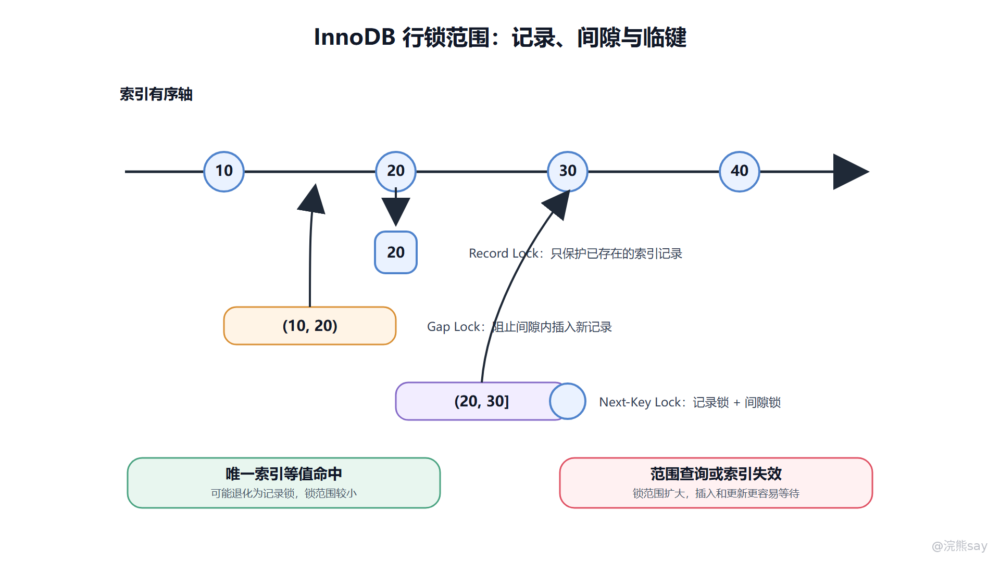
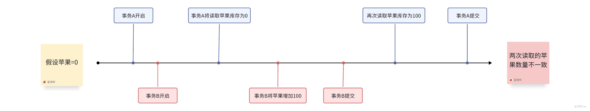

# 07、MySQL 锁机制：表锁、行锁与意向锁

MySQL 锁机制用于在并发读写时保护数据一致性。它不是一个单独概念，而是一组按粒度、模式和范围划分的并发控制手段：按粒度可以分为全局锁、表锁、页锁和行锁；按模式可以分为共享锁和排他锁；在 InnoDB 中，还要理解意向锁、记录锁、间隙锁和临键锁。面试考锁，本质上是在考你能不能判断“这条 SQL 会锁住什么、为什么阻塞、怎么排查”。

锁出现的原因很直接：多个事务可能同时读写同一批数据。没有锁，两个扣库存事务可能同时判断库存充足并同时扣减，造成超卖；没有范围锁，一个事务刚检查某个区间没有记录，另一个事务马上插入符合条件的新记录，前一个事务再次读取就出现幻读。锁就是数据库在并发性能和数据正确性之间做出的控制。

## 一、从粒度理解锁：锁得越小，并发越高

锁粒度表示一次加锁保护的数据范围。全局锁会影响整个实例，典型场景是全库逻辑备份时希望获得一致视图；表锁锁住整张表，实现简单、开销低，但并发能力差；行锁锁住索引记录或索引范围，并发能力更好，但加锁和死锁检测成本更高。

InnoDB 日常最常见的是行锁，但这句话有一个重要前提：InnoDB 的行锁是基于索引实现的。写 SQL 如果没有命中合适索引，数据库为了找到目标记录可能扫描大量索引记录，并对扫描到的范围加锁，最终表现得像“锁了很多行”甚至“像锁表”。因此锁问题往往不是单纯的事务问题，也和索引、执行计划密切相关。

images/mysql-07-lock-range.png

这张图把行锁范围画在索引轴上：record lock 保护已有记录，gap lock 保护两个记录之间的插入空间，next-key lock 同时保护记录和前面的间隙。理解这条轴，就能解释大部分“为什么范围查询会阻塞插入”的问题。

## 二、共享锁、排他锁与兼容关系

共享锁（S Lock）也叫读锁，表示事务要读取并保护某条记录，多个共享锁之间通常兼容。排他锁（X Lock）也叫写锁，表示事务要修改记录，一旦某事务持有排他锁，其他事务不能再对同一资源加共享锁或排他锁。

可以用一句话记忆兼容关系：读读兼容，读写互斥，写写互斥。不过 InnoDB 的普通 SELECT 通常不是靠共享锁读取，而是通过 MVCC 做一致性读。显式 SELECT ... FOR SHARE 或旧写法 LOCK IN SHARE MODE 才会加共享锁；SELECT ... FOR UPDATE、UPDATE、DELETE 会涉及排他锁。

这种区分很重要。很多阻塞并不是普通查询造成的，而是当前读、更新语句或事务长期不提交造成的。排查时要先看 SQL 类型和事务状态，而不是看到 SELECT 就认为一定不会持锁。

## 三、意向锁：表级标记，不是手动锁行

意向锁是 InnoDB 自动维护的表级锁，用来表示事务“打算在表中的某些行上加什么锁”。意向共享锁（IS）表示事务准备在某些行上加共享锁，意向排他锁（IX）表示事务准备在某些行上加排他锁。

意向锁的价值在于提高表锁与行锁冲突判断的效率。假设事务 A 已经在表中某些行上加了排他锁，事务 B 想对整张表加表级写锁。如果没有意向锁，数据库可能需要逐行检查是否存在行锁；有了 IX，事务 B 只要看表级意向锁，就能快速知道这张表内部可能存在行级写锁冲突。

面试中不要把意向锁说成“用户主动给某行加的锁”。它是表级锁，也是协调表锁和行锁的元信息。它通常不会阻塞普通行锁之间的并发，真正阻塞写写冲突的还是具体记录或范围上的锁。

## 四、InnoDB 的三类行锁范围

### 1\. Record Lock：锁住已有索引记录

记录锁锁定已经存在的索引记录。例如 where id = 10 for update 命中主键记录时，InnoDB 会对主键索引上的 id=10 加记录锁，阻止其他事务修改或删除这条记录。记录锁保护的是“已经存在的记录”，不能阻止别人在相邻间隙插入新记录。

### 2\. Gap Lock：锁住记录之间的间隙

间隙锁锁住索引记录之间的空白范围，不包含记录本身。它主要用于阻止其他事务在某个范围内插入新记录。比如索引中已有 10 和 20，事务对 10 到 20 的范围加 gap lock，其他事务就不能在这个间隙插入 15。

images/mysql-gap-lock-example.png

旧图把 gap lock 画成记录之间的空白区间，很适合纠正一个误区：阻塞插入时，被锁住的可能不是某条现有记录，而是插入位置所在的间隙。

间隙锁通常出现在 RR 隔离级别下的范围当前读中，目的是减少幻读。它也解释了一个常见现象：事务锁住的并不是某条已经存在的记录，但插入语句仍然被阻塞，因为插入位置落在被锁住的间隙里。

### 3\. Next-Key Lock：记录锁加间隙锁

临键锁可以理解为 record lock 加 gap lock。它锁住一个索引记录以及该记录前面的间隙，常用于范围当前读。比如索引记录为 10、20、30，某个范围查询可能锁住 (10,20\]、(20,30\] 这样的区间，既保护已有记录，也阻止间隙插入。

images/mysql-next-key-lock-example.png

next-key lock 图可以配合区间记法理解：它通常不是只锁等号右边的记录，而是把“前一个间隙 + 当前记录”合在一起保护，从而同时防止修改已有记录和插入幻影记录。

临键锁不是永远存在。唯一索引等值查询且命中唯一记录时，InnoDB 可能把临键锁优化为记录锁；如果查询条件没有命中索引或使用范围条件，锁范围可能明显扩大。判断锁范围，必须结合索引结构、查询条件、隔离级别和执行计划。

## 五、行锁为什么依赖索引

InnoDB 的数据组织和查询访问都围绕索引展开。行锁实际上加在索引记录上，而不是抽象地加在“表中的第几行”上。主键索引命中时，锁范围通常比较清晰；二级索引命中时，可能既锁二级索引记录，也锁回表访问到的主键记录；如果没有合适索引，扫描范围扩大，锁范围也会扩大。

例如 update user set status=1 where phone='138...'，如果 phone 没有索引，数据库可能扫描大量记录来判断条件，扫描到的记录会被加锁，其他事务更新这些记录时就可能被阻塞。优化这类问题，通常不是简单“减少事务”，而是先让加锁 SQL 命中高选择性的索引。

## 六、死锁：为什么会发生以及如何降低

死锁是指多个事务互相等待对方持有的锁，形成等待环。例如事务 A 先锁 id=1 再等 id=2，事务 B 先锁 id=2 再等 id=1，两个事务都无法继续。InnoDB 会进行死锁检测，发现环路后选择一个事务回滚，让另一个事务继续执行。

减少死锁的思路包括：多个事务按相同顺序访问资源；让条件命中索引，缩小锁范围；把事务做短，避免持锁期间执行远程调用；批量更新时控制批大小；对热点行使用更明确的业务串行化方案，例如队列、分段库存、乐观锁或条件更新。

要注意，死锁不是“数据库坏了”，而是高并发写入下可能出现的正常并发冲突。应用层要能识别死锁错误，并对幂等操作做有限重试。

## 七、锁等待如何排查

锁等待排查一般按链路进行。第一步看现象：接口变慢、SQL 卡住、线程状态为 waiting for lock。第二步定位阻塞语句：通过 SHOW PROCESSLIST、performance\_schema、information\_schema.innodb\_trx、data\_locks、data\_lock\_waits 等视图查看等待事务和持锁事务。第三步分析持锁事务执行了什么 SQL、是否长时间未提交、是否有未命中索引的范围更新。第四步处理：让持锁事务提交或回滚，修正 SQL 与索引，必要时调整事务边界。

线上排查时不要只杀等待方。等待方只是受害者，真正的问题常常是持锁事务太长、加锁范围过大或业务访问顺序混乱。处理完当前阻塞后，还要回到代码和索引设计上修根因。

## 八、使用边界与工程建议

锁能保证并发正确性，但代价是等待、死锁和吞吐下降。能用唯一约束保证的数据，不要只靠业务先查再插；能用条件更新完成的扣减，不要拆成先查库存再更新；需要显式锁时，必须确保事务短、索引准、访问顺序稳定。

在 Java 项目里，事务方法里的锁持有时间往往被业务代码放大。常见风险包括事务里发 RPC、事务里做大文件处理、事务里循环更新几万行、没有分页地批量删除历史数据。这些问题都会让行锁变成系统级性能问题。

## 九、面试表达模板

如果被问“InnoDB 行锁为什么可能锁很多行”，可以答：InnoDB 行锁基于索引记录实现。如果 SQL 条件没有命中合适索引，或优化器选择了较大的扫描范围，InnoDB 需要扫描并锁住更多索引记录；范围当前读还可能加 gap lock 或 next-key lock，所以实际锁范围会大于业务想象中的那几行。

如果被问“意向锁有什么用”，可以答：意向锁是表级锁，用来标记事务准备在表内某些行上加共享锁或排他锁。它让表锁和行锁之间的冲突判断更高效，避免加表锁时逐行检查。它不是用户手动控制的行锁。

如果被问“间隙锁和临键锁为什么能解决幻读”，可以答：记录锁只能保护已存在记录，不能阻止其他事务在范围内插入新记录。间隙锁保护索引记录之间的插入空间，临键锁等于记录锁加间隙锁，在 RR 下用于范围当前读，避免其他事务插入导致同一范围再次读取时多出新行。

## 十、常见追问与练习

**追问 1：普通快照读会被行锁阻塞吗？** 
通常不会。普通一致性读通过 MVCC 读取可见版本，不需要等待行锁释放。但当前读要读取最新版本并加锁，可能被其他事务持有的锁阻塞。

**追问 2：死锁和锁等待有什么区别？** 
锁等待是一个事务等待另一个事务释放锁，等待链可能最终解除；死锁是多个事务形成等待环，如果不打破就无法继续。InnoDB 会检测死锁并回滚其中一个事务。

**练习 1：update t set c=1 where non\_index\_col=5 为什么可能影响很多并发写？** 
答案：条件列没有索引时，InnoDB 可能扫描大量记录判断条件，并对扫描到的记录加锁。锁范围扩大后，其他事务更新这些记录就会被阻塞。

**练习 2：两个事务分别按 id=1、id=2 和 id=2、id=1 的顺序更新两行，为什么容易死锁？** 
答案：两个事务持有的第一把锁不同，又互相等待对方释放第二把锁，形成等待环。统一资源访问顺序可以显著降低这类死锁概率。
