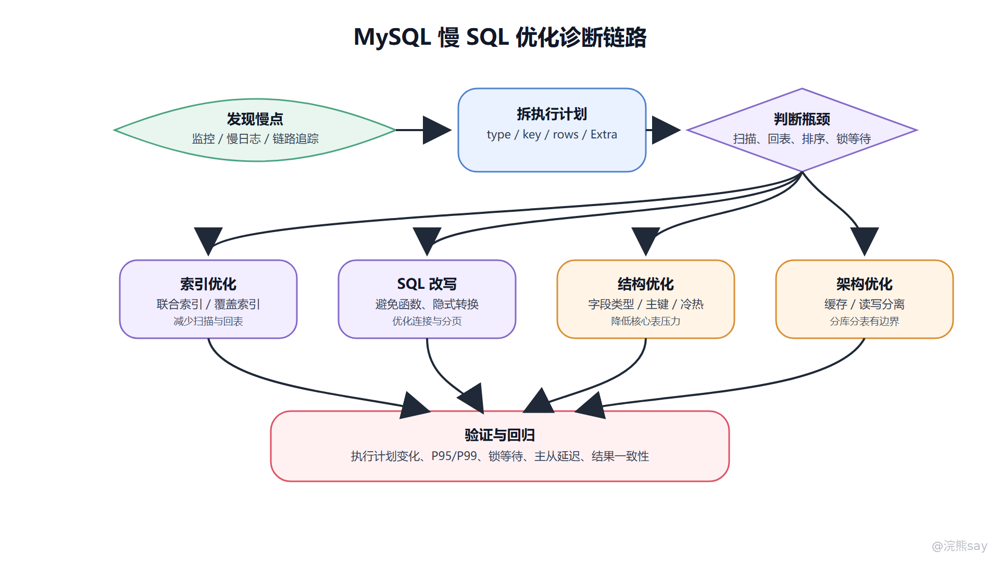

# 08、MySQL 性能优化：EXPLAIN、慢 SQL 与架构优化

MySQL 性能优化是一套从定位到验证的工程流程，不是看到慢 SQL 就直接“加索引”。完整链路应该是：先通过监控、慢查询日志和链路追踪确认瓶颈；再用 EXPLAIN、执行耗时和扫描行数判断慢在哪里；随后选择索引、SQL、表结构或架构层面的方案；最后用压测、回归和监控验证优化效果。面试中，优化顺序比单个技巧更重要。

性能问题之所以复杂，是因为慢不一定来自 SQL 本身。它可能来自索引失效、回表过多、排序和分组使用临时表、事务锁等待、Buffer Pool 命中率低、主从延迟、热点行竞争、分页偏移过大，也可能来自应用层 N+1 查询和连接池配置。优秀的回答应该先建立诊断路径，再谈具体手段。

images/mysql-08-optimization-flow.png

这张图表示一条稳妥的优化链路：发现慢点、拆解执行计划、判断瓶颈类型、选择局部或架构方案，再回到监控验证。它避免了一个常见误区：没有定位就改 SQL，改完也不知道是否真的解决了用户侧延迟。

## 一、慢 SQL 定位链路

慢 SQL 定位通常从四个入口开始。第一是数据库慢查询日志，通过 long\_query\_time、slow\_query\_log 等配置记录执行时间超过阈值的 SQL。第二是监控指标，例如 QPS、TPS、CPU、IO、连接数、锁等待、Buffer Pool 命中率、主从延迟。第三是应用链路追踪，它能告诉你某个接口慢在哪里，是数据库慢、RPC 慢，还是应用循环调用太多。第四是 Performance Schema 或数据库诊断平台，用来进一步观察等待事件和资源消耗。

拿到慢 SQL 后，不要只看单次耗时。一个低频 10 秒 SQL 和一个高频 200 毫秒 SQL，对系统的影响可能完全不同。分析时要同时看执行频率、平均耗时、P95/P99、扫描行数、返回行数、锁等待、临时表和排序情况。优化优先级应该由业务影响和资源消耗共同决定。

## 二、EXPLAIN 应该看哪些字段

EXPLAIN 用于查看 SQL 执行计划，帮助判断优化器准备如何访问表、是否使用索引、预计扫描多少行、是否需要额外排序或临时表。它不是性能结论本身，而是分析入口；真正结论还要结合数据量、索引结构、实际执行耗时和 EXPLAIN ANALYZE 等信息。

### 1\. id、select\_type 和 table

id 和 select\_type 用来观察查询结构，尤其是子查询、派生表、联合查询。table 表示当前步骤访问哪张表或哪个派生结果。复杂 SQL 优化时，先看访问顺序和中间结果是否合理，避免把所有注意力都放在某一个索引名上。

### 2\. type：访问类型

type 表示访问方式，常见从差到好大致有 ALL、index、range、ref、eq\_ref、const、system。ALL 通常表示全表扫描，风险较高；range 表示范围扫描；ref 表示普通索引等值匹配；const 常见于主键或唯一索引等值命中。

但不要机械认为 ALL 一定糟糕、range 一定好。小表全表扫描可能比走索引更快；低选择性索引即使被使用，也可能收益不大。执行计划要结合表数据量和返回比例判断。

### 3\. possible\_keys、key、key\_len 和 ref

possible\_keys 是可能使用的索引，key 是最终选择的索引。key\_len 可以辅助判断联合索引用了几列，ref 表示索引匹配时与哪些列或常量比较。联合索引优化时，重点看最左前缀是否被充分利用，范围条件是否截断后续列的有序性，以及排序字段能否继续利用索引顺序。

### 4\. rows、filtered 和 Extra

rows 是优化器估算要扫描的行数，filtered 表示过滤比例估算。两者可以粗略估计中间结果规模。Extra 中常见提示包括 Using index、Using where、Using temporary、Using filesort。Using index 通常表示覆盖索引；Using temporary 和 Using filesort 往往提示分组、排序或去重没有很好利用索引，需要重点分析。

## 三、索引优化：围绕查询模式设计

索引优化的目标不是“字段多就加索引”，而是让高频查询以更小扫描范围、更少回表、更少排序完成。设计索引时先看查询模式：过滤条件是什么，排序字段是什么，返回字段是什么，数据分布如何，是否存在高频组合查询。

联合索引通常比多个零散单列索引更适合核心查询。常用原则是：等值条件字段放前面，范围字段靠后，排序字段尽量接在过滤字段之后，返回字段如果不多可以考虑覆盖索引。对于长字符串字段，可以评估前缀索引；对于低区分度字段，单独建索引可能收益有限，需要和其他字段组合。

索引也有代价。每个索引都会增加写入维护成本，占用存储空间，并可能影响优化器选择。高并发写入表不宜盲目堆索引；历史不用的索引要通过监控和执行计划确认后清理。

## 四、SQL 写法优化

SQL 写法会直接影响索引能否使用。常见问题包括在索引列上使用函数或计算、隐式类型转换、前导模糊匹配、or 条件破坏索引选择、返回字段过多导致无法覆盖索引、子查询生成大中间结果、排序字段和过滤字段不匹配。

例如 where date(create\_time) = '2026-06-30' 会让索引列参与函数计算，可能无法有效利用索引；更好的写法是改成范围条件 create\_time >= '2026-06-30 00:00:00' and create\_time last\_id order by id limit 20，让查询从上次位置继续向后扫描。对于需要按时间或分数排序的列表，可以使用稳定排序字段加唯一 ID 作为游标，避免重复和漏数据。后台管理类必须跳页的场景，可以先用覆盖索引定位主键，再回表取详情，减少大范围回表成本。

分页优化也有边界。游标分页不适合任意跳页；按复杂排序字段分页需要保证排序稳定；搜索类需求可能更适合引入搜索引擎或专门的检索服务，而不是让 MySQL 承担所有深分页压力。

## 六、表结构与数据建模优化

表结构优化首先是选择合适字段类型。能用整型就不要用长字符串表达状态；时间字段、金额字段、枚举状态要有清晰语义；字段长度不要过度放大；能 NOT NULL 的字段尽量明确默认值，减少三值逻辑和索引统计复杂度。主键设计要尽量稳定、短小、递增或趋势递增，避免完全随机主键造成页分裂和缓存局部性下降。

文件、图片、音视频等大对象通常不建议直接存 MySQL。更常见做法是把文件存对象存储或文件服务，MySQL 保存 URL、路径、哈希、大小、类型、归属关系等元数据。这样可以降低数据文件膨胀、备份恢复成本和 Buffer Pool 污染。

冷热数据分离也是表结构层面的常见优化。高频访问的热数据保留在主表或热库，历史订单、日志明细、归档记录转入历史表或低成本存储。这样可以降低核心查询的数据范围，但要处理归档查询、跨冷热查询和数据生命周期管理。

## 七、架构优化：缓存、读写分离与分库分表

当 SQL、索引和表结构优化不足以支撑业务增长时，才进入架构层优化。缓存可以缓解热点读压力，但必须处理缓存一致性、穿透、击穿、雪崩和热点 key。读写分离可以把读流量分摊到从库，但要面对主从延迟，强一致读仍可能需要走主库或使用延迟感知策略。

分库分表用于降低单库单表数据量和写入压力，但它不是银弹。引入分片后，会出现跨分片查询、分布式事务、全局唯一 ID、排序分页、扩容迁移、运维复杂度等问题。如果只是单条 SQL 没写好，过早分库分表会把局部问题变成系统复杂性。

架构优化的边界可以这样表达：先做单 SQL 和索引优化，再做表结构和数据生命周期优化；当单机资源、单表容量、写入吞吐或组织隔离真的成为瓶颈时，再考虑读写分离、分库分表、缓存和异步化。

## 八、优化后的验证

优化不是提交 SQL 改动就结束。至少要验证四件事：执行计划是否按预期变化，扫描行数和回表次数是否下降；真实环境或压测环境下 P95/P99 是否改善；写入成本、锁等待和主从延迟是否出现副作用；相关业务查询是否仍然正确。

对于加索引，必须关注建索引对线上写入和 DDL 锁的影响；对于 SQL 改写，要做结果集一致性回归；对于缓存和读写分离，要补充一致性和降级策略。性能优化的成熟度体现在可观测、可回滚、可验证，而不是技巧堆叠。

## 九、面试表达模板

如果被问“MySQL 性能怎么优化”，可以答：我会先定位瓶颈，通过慢查询日志、监控和链路追踪确认慢 SQL 或等待事件；然后用 EXPLAIN 看访问类型、索引、扫描行数、排序、临时表和回表；再按问题类型选择索引优化、SQL 改写、表结构调整；如果单机和单表已经到瓶颈，再考虑缓存、读写分离、冷热分离或分库分表；最后用压测和监控验证。

如果被问“看到 Using filesort 怎么办”，可以答：Using filesort 表示排序不能直接按所需索引顺序完成，不一定必然有问题。要结合扫描行数、排序数据量和耗时判断。如果排序是瓶颈，可以考虑让过滤条件和排序字段组成合适联合索引，减少返回字段以使用覆盖索引，或调整业务排序和分页方式。

如果被问“读写分离有什么坑”，可以答：读写分离能分担读压力，但从库数据通常落后主库，存在主从延迟。刚写完马上读的强一致场景要走主库，或者使用延迟感知、会话一致性、关键读主库等策略。它还会增加路由、故障切换和运维复杂度。

## 十、常见追问与练习

**追问 1：为什么不建议一上来就分库分表？** 
因为分库分表会引入跨分片查询、分布式事务、全局 ID、扩容迁移和运维复杂度。只有当单表数据量、写入吞吐或隔离需求确实成为瓶颈，且局部优化已经不足时，才适合考虑。

**追问 2：type=ALL 一定要优化吗？** 
不一定。小表全表扫描可能成本很低，优化器选择 ALL 也可能合理。要结合表大小、扫描行数、执行频率和响应时间判断。高频大表 ALL 才通常是重点风险。

**练习 1：一个订单列表接口使用 limit 500000, 20 很慢，如何优化？** 
答案：优先改成游标分页，例如基于上一页最后一条记录的时间和 ID 继续查询；如果必须跳页，可以用覆盖索引先定位主键，再回表取详情。还要确保排序字段和过滤条件有合适联合索引。

**练习 2：给低区分度字段单独建索引为什么可能效果不好？** 
答案：低区分度字段过滤后仍然返回大量记录，扫描和回表成本可能很高，优化器甚至可能不用该索引。更好的方式是结合高区分度字段或常用查询组合设计联合索引。
