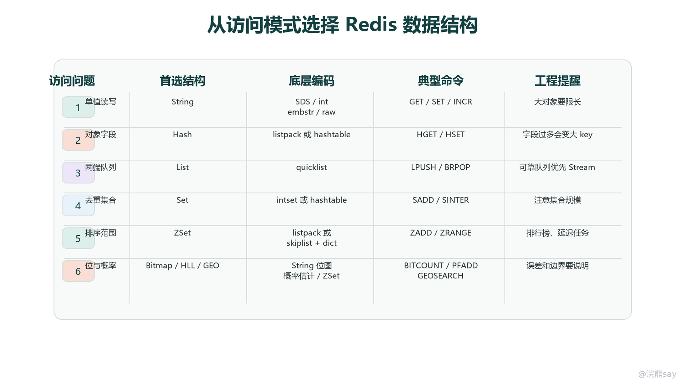
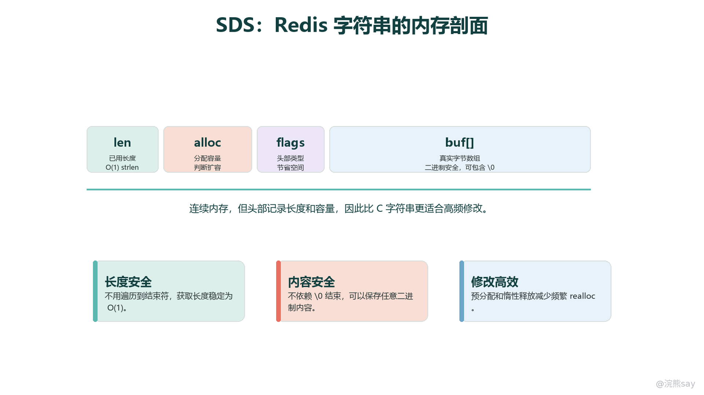
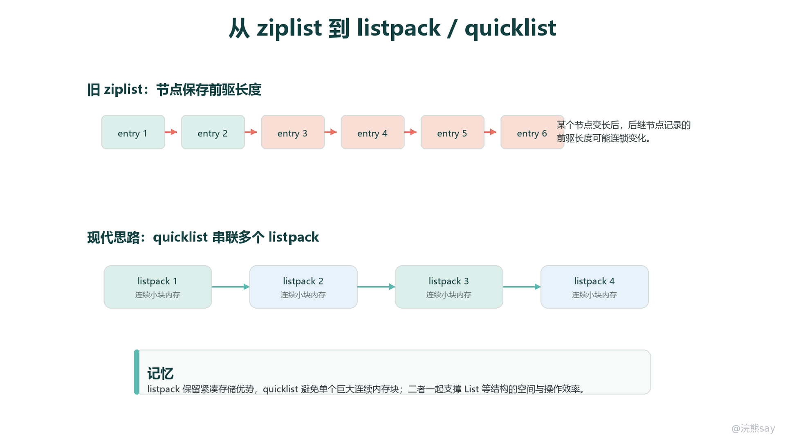
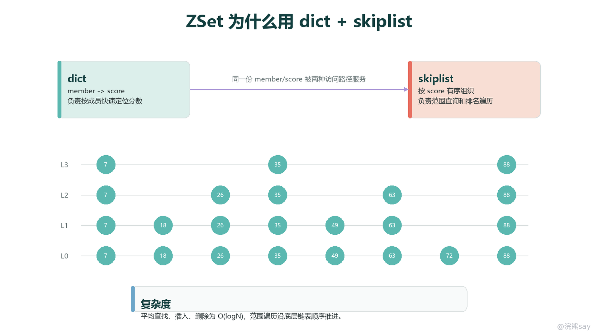
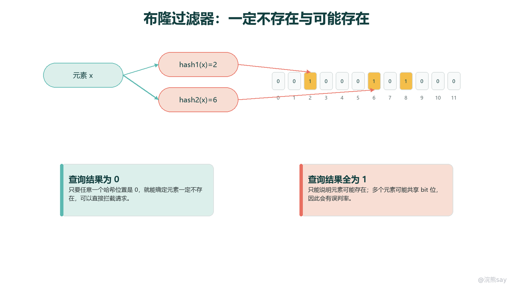

# 02 Redis数据结构与底层实现

Redis 的数据结构要分两层理解：外层是客户端直接使用的数据类型，例如 String、Hash、List、Set、ZSet、Stream；内层是 Redis 根据对象大小、元素类型和访问模式选择的底层编码，例如 SDS、int、embstr、raw、listpack、quicklist、intset、hashtable、skiplist。面试里只背“五大类型”是不够的，因为真正考察的是 Redis 如何在内存占用、访问效率、范围查询、修改成本之间做权衡。

从系统结构上看，Redis 不是把 value 裸存成某个 C 结构，而是先用 redisObject 做一层对象封装。每个 key 指向一个对象，对象里记录逻辑类型 type、底层编码 encoding、实际数据指针 ptr，以及引用计数、LRU/LFU 相关信息。这样 Redis 可以在命令层保持统一的类型语义，同时在存储层根据规模自动切换更合适的编码。

images/redis-03-数据结构与底层编码.png

这张图的核心不是“类型列表”，而是访问模式到结构选择的映射：单值读写优先 String，对象字段优先 Hash，两端队列优先 List，去重集合优先 Set，带分数排序和范围查询优先 ZSet，位统计和概率统计则使用 Bitmap、HyperLogLog 等特殊结构。后面所有底层实现都围绕一个原则展开：小数据优先省内存，大数据优先稳定的操作复杂度。

## 一、RedisObject：逻辑类型和底层编码为什么要分开

RedisObject 是 Redis 数据结构体系的入口。客户端执行 SET user:1 tom、HSET user:1 name tom、ZADD rank 100 tom 时，看到的是不同命令和不同逻辑类型；Redis 内部则要进一步判断这个对象用哪种编码存最合适。

典型对象可以拆成几个关键信息：
| 字段 | 作用 | 面试表达抓手 |
| --- | --- | --- |
| type | 表示逻辑类型，如 string、hash、list、set、zset、stream | 决定这个 key 能执行哪些命令 |
| encoding | 表示底层编码，如 int、embstr、raw、listpack、hashtable、quicklist、skiplist | 决定真实内存布局和操作成本 |
| ptr | 指向底层数据结构 | 命令执行最终会落到这里 |
| lru/lfu | 记录访问相关信息 | 支撑过期淘汰、空闲时间或频率统计 |
| refcount | 引用计数 | 便于对象复用和内存释放 |

type 和 encoding 分离的价值在于可演进。比如 Hash 小的时候可以用 listpack 紧凑存储，字段多了再转成 hashtable；ZSet 小的时候可以用 listpack，规模变大后转为 skiplist + dict。对使用者来说，它们仍然是 Hash 或 ZSet；对 Redis 来说，底层已经从“省内存模式”切换到了“高效访问模式”。

需要注意，编码切换通常是单向的。一个 Hash 从 listpack 转成 hashtable 后，即使后续字段减少，一般也不会自动退回 listpack。这样做是为了避免频繁扩缩容和编码来回转换带来的抖动。面试里如果被问“为什么 Redis 不一直用最省内存的结构”，答案就是：紧凑结构适合小对象，但当元素增多、字段变长或修改频繁时，连续内存移动和线性扫描成本会上升，必须换成更适合随机访问和扩容的结构。

## 二、String：不只是字符串，而是二进制安全的通用值

String 是 Redis 最基础的类型，但它不是简单的 C 字符串。它可以保存文本、整数、JSON、序列化对象、图片片段、位图数据，也可以作为分布式锁 value、计数器和限流器的承载结构。

### 1\. String 的三种常见编码

String 的底层编码常见有 int、embstr、raw 三类。
| 编码 | 适用情况 | 机制 | 边界 |
| --- | --- | --- | --- |
| int | value 可以表示为整数，并且在范围内 | 直接把整数保存在对象中，避免额外字符串分配 | 一旦执行追加字符串等操作，可能转成字符串编码 |
| embstr | 较短字符串 | redisObject 和 SDS 一次连续分配，内存局部性好 | embstr 对象适合创建后少修改，修改时通常转 raw |
| raw | 较长字符串或频繁修改字符串 | redisObject 与 SDS 分开分配 | 额外指针和分配成本更高，但扩容更灵活 |

这三种编码体现了 Redis 的典型思路：不是所有 String 都一视同仁。整数计数器用 int 可以减少内存；短字符串用 embstr 可以减少一次内存分配并提升缓存友好性；长字符串或会被修改的字符串用 raw 更便于扩容。

### 2\. SDS 为什么替代 C 字符串

images/redis-09-SDS结构剖面.png

SDS 的核心字段包括 len、alloc、flags 和 buf\[\]。len 记录已使用长度，因此获取长度是 O(1)，不用像 C 字符串一遍遍扫描到 \\0；alloc 记录已分配容量，追加内容时可以判断是否需要扩容；flags 表示 SDS 头部类型，使 Redis 能按字符串大小选择更紧凑的头部布局；buf\[\] 保存真实字节数组，并且仍然保留末尾 \\0，方便兼容部分 C 字符串函数。

SDS 的工程价值主要有三点。第一是长度安全，strlen 类操作不需要线性扫描。第二是二进制安全，字符串中即使包含 \\0，Redis 也能通过 len 正确识别真实长度，所以 Bitmap、序列化对象和压缩后的字节流都能放进 String。第三是修改高效，Redis 可以通过空间预分配和惰性释放减少频繁 realloc。

String 不适合无限制承载大对象。把一个很大的 JSON 或二进制对象直接塞进 String，虽然命令简单，但会带来网络传输大、反序列化成本高、局部字段无法更新、内存淘汰粒度过粗等问题。对象字段较多且需要局部修改时，应优先考虑 Hash；需要追加日志和消费语义时，应考虑 Stream，而不是用一个大 String 拼接。

## 三、Hash：对象字段存储为什么会从 listpack 变成 hashtable

Hash 解决的是“一个 key 下有多个字段”的访问模式。典型场景是用户资料、商品信息、配置项、会话属性。相比把整个对象序列化成 String，Hash 可以按字段读写，避免每次修改一个字段都读取、反序列化、修改、再写回整个对象。

小 Hash 适合使用 listpack。listpack 是一段连续内存，字段名和值按顺序紧凑排列，省掉了大量指针、哈希桶和节点对象开销。对于字段少、字段短的对象，线性扫描几十个 entry 的成本可以接受，内存节省反而更重要。

当字段数量增多或单个字段、value 变长时，Hash 会转成 hashtable。原因有两个：一是 listpack 查找字段需要顺序扫描，数据变大后复杂度和 CPU 成本会上升；二是连续内存结构在插入、删除、扩容时可能涉及内存移动，字段越多越不稳定。hashtable 虽然多了桶、指针和 rehash 成本，但按字段定位更快，也更适合大对象和频繁修改。

面试里常见追问是：“Hash 一定比 String 存对象好吗？”答案是否定的。如果对象很小、读写总是整体进行，String 反而简单；如果对象字段经常局部更新、字段读写频繁、希望减少网络传输和反序列化，Hash 更合适。Hash 的风险在于大 key，如果一个 Hash 下堆了几十万字段，单 key 的迁移、删除、过期、持久化和集群槽迁移都会变重。

## 四、List：quicklist 如何兼顾链表和连续内存

List 解决的是有序、可重复、两端操作的访问模式。它适合最新消息列表、简单双端队列、生产消费缓冲、分页式时间线片段。早期 Redis List 曾经涉及 ziplist 和 linkedlist，现代实现主要是 quicklist：用链表串起多个 listpack。

images/redis-10-listpack与quicklist.png

listpack 是 ziplist 的后续紧凑结构。ziplist 的问题在于 entry 会记录前一个 entry 的长度，当某个节点变长导致长度编码变化时，后续节点可能被迫连锁更新。listpack 仍然保持连续内存的节省优势，但调整了 entry 的编码方式，降低了这种连锁更新风险。

quicklist 则把“一个巨大连续数组”和“每个元素一个链表节点”之间做了折中。每个 quicklist 节点内部是一小段 listpack，节点之间用链表连接。这样一来，节点内部利用连续内存节省空间，节点之间又能避免单个大数组扩容和移动成本过高。两端 LPUSH、RPUSH、LPOP、RPOP 都能较好地发挥 quicklist 的优势。

List 不适合作为强可靠消息队列。它可以用 BLPOP、BRPOP 做阻塞消费，但缺少消费组、消息 ID、确认、重投递等语义。简单队列可以用 List，涉及多消费者组、消息确认和故障恢复时，应该优先考虑 Stream 或专门的消息队列。

## 五、Set：intset 和 hashtable 的取舍

Set 解决的是无序去重集合的访问模式。常见场景包括标签集合、好友集合、黑白名单、抽奖候选池、权限集合、共同关注计算。它的核心语义是元素不重复，并且支持交集、并集、差集。

当 Set 内部都是整数且数量较少时，Redis 可以使用 intset。intset 是紧凑的整数数组，会按元素实际范围选择合适的整数宽度，并保持有序。它的优势是内存占用低，适合小规模整数集合；缺点是插入和查找不如 hashtable 灵活，新增更大范围整数时还可能触发编码升级。

当元素不是纯整数，或者元素数量超过阈值时，Set 会使用 hashtable。hashtable 的优势是成员判断、插入、删除平均 O(1)，更适合通用字符串集合和大集合。代价是每个元素有额外哈希节点和桶开销，内存比 intset 高。

Set 的边界主要在集合运算。SINTER、SUNION、SDIFF 这类命令很方便，但如果集合非常大，交并差会消耗明显 CPU，并可能阻塞 Redis 主线程。工程上要控制集合规模，必要时做分片、离线计算或把重集合运算放到异步任务中。

## 六、ZSet：为什么是 listpack 或 skiplist + dict

ZSet 解决的是“成员唯一，但需要按分数排序”的访问模式。它适合排行榜、延迟任务、优先级队列、时间窗口数据、范围检索。与 Set 相比，ZSet 多了 score；与 List 相比，ZSet 的顺序不是插入顺序，而是按 score 排序。

小规模 ZSet 可以用 listpack 紧凑存储，member 和 score 交替排列。数据量小的时候，顺序扫描和插入移动成本可控，省内存更重要。规模变大后，Redis 使用 skiplist + dict 的组合。

images/redis-11-ZSet跳表与字典.png

这两个结构服务于两种不同访问路径。dict 负责 member -> score 的快速定位，例如 ZSCORE、判断成员是否存在、更新某个成员分数；skiplist 负责按 score 有序组织数据，例如 ZRANGE、ZRANGEBYSCORE、排行榜区间遍历。只用 dict 没法高效做范围查询，只用 skiplist 又无法按 member 快速定位，所以 Redis 同时维护两份索引。

### 跳表为什么不用红黑树

跳表和红黑树都能提供 O(logN) 级别的查找、插入、删除。Redis 选择跳表，主要是因为范围遍历和实现复杂度。排行榜和范围查询经常需要从某个 score 开始顺序向后扫描，跳表底层天然是一条有序链表，定位到起点后继续遍历非常直接。红黑树也能做范围遍历，但需要中序遍历或维护额外指针，实现和调试复杂度更高。

从实现角度看，跳表通过随机层数维持概率平衡，不需要像红黑树那样在插入、删除后做旋转和复杂的平衡修复。Redis 还在跳表节点中维护跨度信息，便于计算排名。面试回答时不要说“跳表一定比红黑树快”，更准确的表述是：在 Redis ZSet 的场景下，跳表实现简单、范围遍历自然、排名计算方便，性能满足需求。

ZSet 不适合无边界排行榜。如果每个用户行为都写入同一个 ZSet，长期不清理会形成大 key，范围查询、删除过期成员和持久化都会变重。工程上通常按业务维度或时间窗口拆 key，例如日榜、周榜、活动榜，并配合定期裁剪。

## 七、Bitmap、HyperLogLog、GEO 与 Stream：特殊结构解决特殊访问模式

Redis 还有一些并不完全等同于“五大类型”的结构，它们通常是为了特定统计或消息场景设计的。

### 1\. Bitmap：用 String 做位级统计

Bitmap 本质上是对 String 的 bit 位进行读写。SETBIT 可以把某个偏移位设置为 0 或 1，GETBIT 查询某一位，BITCOUNT 统计 1 的数量。它适合签到、在线状态、布尔标签、用户是否访问过某功能等场景。

Bitmap 的优势是极省内存。如果用一个 bit 表示一个用户是否签到，1 亿用户也只需要约 12MB 空间。但它要求偏移量设计稳定，适合 ID 较连续的场景；如果用户 ID 极度稀疏，直接把 ID 当 offset 会浪费大量空间，需要映射或分桶。

### 2\. HyperLogLog：牺牲精确性换低内存基数统计

HyperLogLog 用于估算基数，也就是不重复元素数量。典型场景是 UV 统计、独立设备数、独立搜索词数量。它的核心思想是通过哈希后的二进制特征估算集合规模，而不是保存每一个元素，因此内存占用很小。

它的边界也很明确：HyperLogLog 只能估算数量，不能列出具体成员，也不能判断某个成员是否存在。它有误差，适合趋势统计和允许小误差的报表，不适合订单去重、权限判断、精确计费等强一致场景。

### 3\. GEO：位置查询借助 ZSet

GEO 用于存储经纬度并做附近位置查询。Redis 会把经纬度编码成 geohash，再借助 ZSet 的 score 组织位置数据。常见命令包括添加位置、计算距离、查询附近成员等。外卖门店、附近的人、车辆位置粗筛都可以用 GEO。

GEO 的边界在于它适合做半径范围内的粗筛，不适合替代专业 GIS 系统。复杂多边形、道路网络、行政区划、精准路径规划等需求，应交给空间数据库或专门的地图服务。

### 4\. Stream：带消息 ID 和消费组的日志型结构

Stream 是 Redis 提供的日志型消息结构。每条消息有递增 ID，内部按追加顺序组织，支持范围读取、阻塞读取、消费组、ACK、pending 列表等能力。它比 List 更适合作为轻量消息流，因为它能表达“哪些消息被哪个消费者组读过，哪些还没有确认”。

Stream 不适合被简单理解成“高级 List”。List 更像双端队列，Stream 更像可追踪的消息日志。需要可靠消费、失败重试、多消费者组时选 Stream；只需要非常轻量的两端入队出队时选 List。

## 八、布隆过滤器与 HyperLogLog：一个判断存在性，一个估算数量

images/redis-12-布隆过滤器原理.png

布隆过滤器用于判断元素是否“可能存在”。它由位数组和多个哈希函数组成。写入元素时，多个哈希函数把元素映射到多个 bit 位，并把这些位置置为 1；查询时，只要任意一个位置是 0，就能确定元素一定不存在；如果所有位置都是 1，只能说明元素可能存在。

布隆过滤器常用于缓存穿透治理、黑名单粗筛、URL 去重等场景。它的优势是内存占用低、查询快；边界是存在误判，且普通布隆过滤器不适合删除元素，因为多个元素可能共享同一个 bit 位。

布隆过滤器和 HyperLogLog 很容易被混淆，但它们解决的问题完全不同：
| 对比项 | 布隆过滤器 | HyperLogLog |
| --- | --- | --- |
| 目标 | 判断某个元素是否可能存在 | 估算不重复元素数量 |
| 结果 | 一定不存在 / 可能存在 | 一个近似基数 |
| 是否保存成员 | 不保存 | 不保存 |
| 是否有误差 | 有误判，不会漏判已加入元素 | 有统计误差 |
| 典型场景 | 缓存穿透、去重前置过滤 | UV、独立用户数、独立设备数 |

回答这类问题时要把“误判方向”说清楚。布隆过滤器的查询结果如果是不存在，那就是确定不存在；如果是存在，只是可能存在。HyperLogLog 则不回答某个元素在不在，只回答规模大概是多少。

## 九、数据结构选型：从访问模式倒推，而不是从命令倒推

Redis 选型应先问访问模式，而不是先背命令。可以按下面这条线判断：
| 访问模式 | 推荐结构 | 不适合的情况 |
| --- | --- | --- |
| 单值缓存、计数、锁 value | String | 对象字段频繁局部更新 |
| 对象多字段读写 | Hash | 字段数量无限增长导致大 key |
| 两端队列、简单阻塞消费 | List | 需要 ACK、重投递、多消费组 |
| 去重集合、交并差 | Set | 超大集合在线做重计算 |
| 排序、排行榜、范围查询 | ZSet | 无边界大排行榜、复杂多维排序 |
| 大量布尔状态 | Bitmap | ID 极度稀疏且无映射 |
| 不重复数量估算 | HyperLogLog | 要精确成员列表或精确计费 |
| 地理位置粗筛 | GEO | 复杂 GIS 查询 |
| 轻量消息流和消费组 | Stream | 高吞吐强事务消息系统 |

一个更工程化的回答模板是：先说明业务访问是单值、字段、队列、集合、排序还是统计；再说明 Redis 对应的逻辑类型；接着补充底层编码在小数据和大数据下如何变化；最后说清楚边界，比如大 key、阻塞命令、误差、可靠性或过期清理。

## 十、常见面试追问与回答抓手

### 1\. Redis 为什么能用同一个 Hash 类型承载 listpack 和 hashtable？

因为 Hash 是逻辑类型，listpack 和 hashtable 是底层编码。客户端命令面对的是统一的 Hash 语义，Redis 内部根据字段数量和字段长度选择编码。小对象用 listpack 节省内存，大对象转 hashtable 提升查找和修改效率。

### 2\. String 为什么有 int、embstr、raw，而不是都用 SDS？

SDS 是字符串内容的核心表示，但 String 对象还可以在对象层做更细的优化。整数可以用 int 编码减少额外分配；短字符串用 embstr 让 redisObject 和 SDS 连续分配；长字符串或频繁修改时用 raw，便于扩容和修改。

### 3\. quicklist 为什么比纯链表更适合 Redis List？

纯链表每个元素都要额外保存前后指针，内存开销大且局部性差。quicklist 把多个元素打包进 listpack，再把多个 listpack 串成链表，既保留两端操作的便利，又减少指针数量和内存碎片。

### 4\. ZSet 为什么要同时维护 dict 和 skiplist？

因为 ZSet 有两类核心访问：按 member 找 score，以及按 score 做排序和范围遍历。dict 负责成员定位，skiplist 负责有序范围。两者一起维护会占用更多内存，但换来了两条访问路径都高效。

### 5\. 跳表为什么适合排行榜？

排行榜不仅要查找某个分数位置，还要按区间连续遍历、计算排名。跳表定位后可以沿底层链表顺序遍历，并能通过跨度信息辅助排名计算，实现比红黑树更简单，复杂度也满足 O(logN) 级别。

### 6\. Bitmap、布隆过滤器、HyperLogLog 怎么区分？

Bitmap 是精确 bit 位记录，适合签到和布尔状态；布隆过滤器是概率存在性判断，适合拦截可能不存在的请求；HyperLogLog 是概率基数估计，适合 UV 这类不需要精确成员的统计。三者都省内存，但语义不同，不能互相替代。

### 7\. 什么是 Redis 数据结构选型里的“大 key”风险？

大 key 不是只看 value 字节数，也看集合元素数量。一个 String 很大、一个 Hash 字段很多、一个 ZSet 成员很多，都可能成为大 key。大 key 会拖慢网络传输、删除、过期、持久化、主从同步和集群迁移。选型时要考虑拆分、分桶、裁剪和异步删除。

## 十一、本章准备标准

这一章需要准备到能把“外层类型”和“底层编码”同时讲清楚。最低标准是：知道 String、Hash、List、Set、ZSet 分别解决什么访问模式；知道 String 的 int/embstr/raw 与 SDS，Hash 的 listpack/hashtable，List 的 quicklist/listpack，Set 的 intset/hashtable，ZSet 的 listpack/skiplist+dict；能解释 Bitmap、HyperLogLog、GEO、Stream 的基本原理和边界；能回答跳表为什么适合 ZSet，以及布隆过滤器和 HyperLogLog 为什么不是一类东西。
