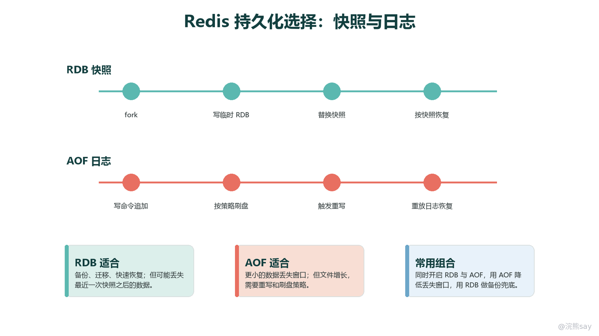
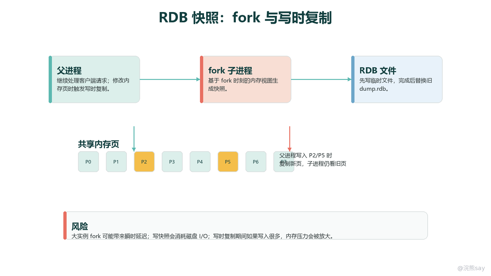
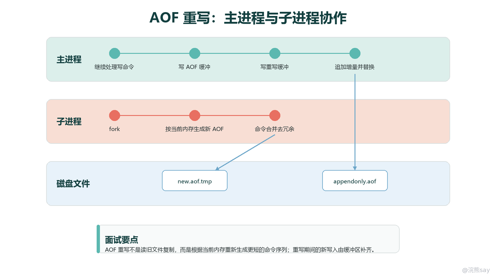
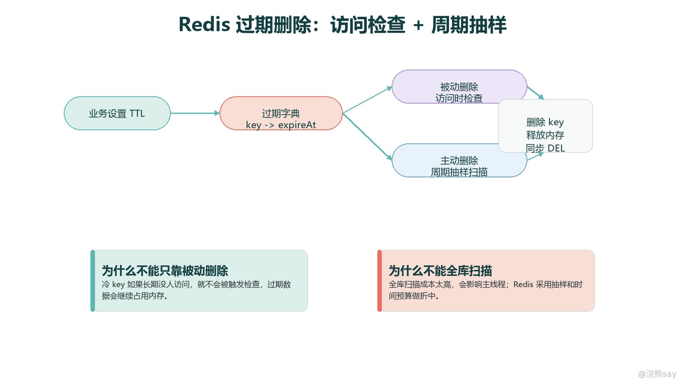
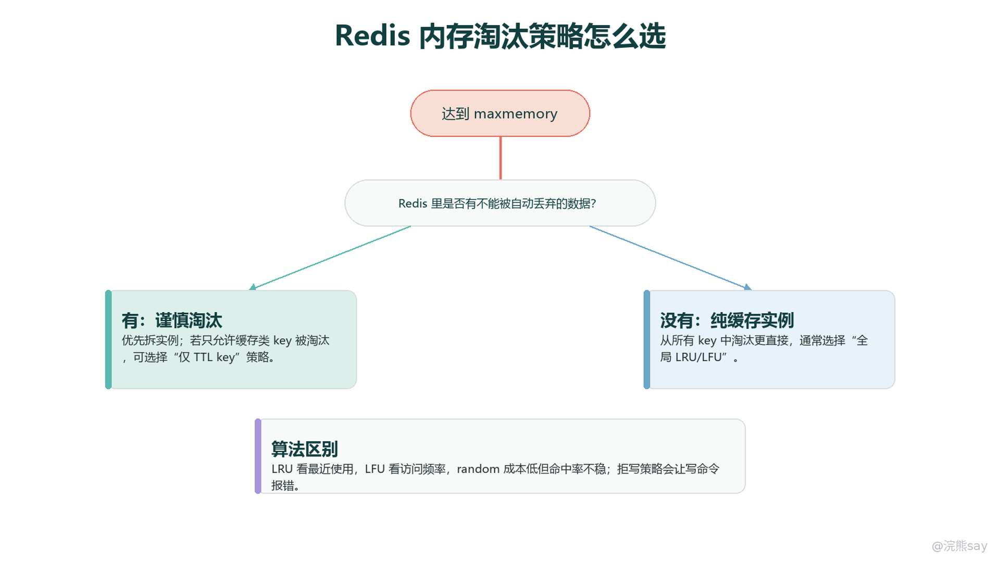

# 03 Redis持久化、过期删除与内存淘汰

Redis 是内存数据库，但它不是只能把数据放在内存里。Redis 的持久化机制负责把内存状态落到磁盘，过期删除机制负责清理已经到期的 key，内存淘汰机制负责在容量达到上限时选择牺牲哪些 key。三者解决的是同一类工程问题：内存速度很快，但内存容量有限、进程会重启、机器会宕机，因此系统必须在性能、数据安全和容量控制之间做取舍。

从技术分类上看，Redis 持久化主要有 RDB 和 AOF 两种方式。RDB 是快照式持久化，把某个时间点的数据集保存为紧凑文件；AOF 是追加式持久化，把写命令追加到日志中，重启时通过重放命令恢复数据。线上更常见的做法不是二选一，而是根据业务重要性、恢复速度和可接受丢失窗口组合使用。

images/redis-04-RDB与AOF持久化对比.png

这张图可以作为本章的总览：RDB 关注“某个时刻的数据快照”，AOF 关注“每次写入之后的命令轨迹”；过期删除和内存淘汰则分别处理“key 到期”和“内存不够”两个生命周期问题。面试里如果只背“RDB 会丢数据，AOF 更安全”，表达是不够的，关键要说清楚它们的触发方式、写入链路、恢复优先级和故障窗口。

## 一、RDB：把内存状态保存成时间点快照

RDB（Redis Database）是一种快照式持久化机制。它的核心思想是：Redis 在某个时刻把当前数据集生成一个二进制快照文件，之后服务重启时直接加载这个快照，把内存恢复到生成快照时的状态。RDB 不是记录每条写命令，而是记录“结果状态”，因此文件通常更紧凑，恢复速度也比较快。

### 1\. RDB 什么时候会触发

RDB 的触发可以分为配置触发、命令触发和系统场景触发。

配置触发依赖 redis.conf 中的 save 规则。典型配置类似：

save 900 1 
save 300 10 
save 60 10000

这表示在 900 秒内至少 1 次写入、300 秒内至少 10 次写入、60 秒内至少 10000 次写入时，Redis 会尝试生成一次 RDB。这里的“尝试”很重要，因为 Redis 还要考虑当前是否已有后台持久化任务、磁盘是否可写、上一次持久化是否失败等状态。

命令触发主要有 SAVE 和 BGSAVE。SAVE 会在主线程中同步生成 RDB 文件，期间 Redis 不能继续处理其他客户端命令，因此生产环境很少主动使用。BGSAVE 会通过 fork 创建子进程，由子进程负责写 RDB，父进程继续处理请求，线上手动生成快照时通常使用它。

系统场景触发常见于正常关闭、主从全量同步和运维备份。比如 SHUTDOWN SAVE 会在退出前保存快照；主从复制发生全量同步时，主节点可能生成 RDB 并发送给从节点；有些备份脚本也会定时触发 BGSAVE 后复制 dump.rdb。这些场景说明 RDB 不只是“持久化文件”，也是 Redis 复制和灾备链路里的基础数据载体。

### 2\. SAVE 与 BGSAVE 的差别

SAVE 和 BGSAVE 都能生成 RDB，但它们对服务可用性的影响完全不同。
| 对比项 | SAVE | BGSAVE |
| --- | --- | --- |
| 执行线程 | 主进程同步执行 | 父进程 fork 子进程，子进程写文件 |
| 客户端请求 | 生成期间基本被阻塞 | fork 瞬间可能阻塞，之后父进程继续服务 |
| 使用场景 | 调试、停机维护、极小实例 | 线上快照、备份、复制全量同步 |
| 主要风险 | 阻塞时间长 | fork 延迟、写时复制内存放大、磁盘 IO 压力 |

面试中常见的追问是：“BGSAVE 是不是完全不阻塞？”答案不是。BGSAVE 的文件写入由子进程完成，但 fork 本身发生在主进程中，实例越大，页表复制和内核调度成本越明显，可能带来毫秒级甚至更高的瞬时延迟。因此线上监控里常会关注 latest\_fork\_usec、持久化状态、磁盘 IO 和内存余量。

### 3\. fork 与写时复制如何降低成本

Redis 生成 RDB 时通常采用 fork + Copy-On-Write。父进程先 fork 出子进程，子进程看到的是 fork 那一刻的数据视图，并把这份视图写入临时 RDB 文件。写完后，Redis 用原子替换的方式把临时文件替换成正式 RDB 文件。

images/redis-06-RDB快照与写时复制.png

写时复制（Copy-On-Write，COW）的作用是避免 fork 后立刻复制整份内存。父子进程起初共享相同的物理内存页；如果父进程继续处理写请求并修改了某些页，操作系统才复制被修改的页，让子进程仍然看到 fork 时刻的旧数据。这样既能让子进程生成一致性快照，又能让父进程继续处理业务请求。

但写时复制不是免费的。写入越密集，被复制的内存页越多，RDB 期间额外内存压力越大。如果机器本身内存紧张，fork 之后又发生大量写入，就可能出现内存抖动甚至 OOM。大实例做 RDB 时，不能只看 Redis 数据量，还要给页表、复制积压缓冲、AOF 缓冲、客户端输出缓冲和 COW 预留空间。

### 4\. RDB 的优点、缺点和恢复场景

RDB 的优势主要体现在备份和恢复。它是单个紧凑文件，适合按小时、按天归档，也适合跨机器、跨机房复制。重启加载时，Redis 不需要重放大量历史命令，而是直接恢复快照状态，所以大数据集场景下 RDB 往往比纯 AOF 启动更快。

RDB 的缺点在于数据丢失窗口。假设最后一次快照生成于 10:00，Redis 在 10:04 异常宕机，而下一次快照还没有完成，那么 10:00 到 10:04 之间的写入就可能丢失。save 配置越稀疏，丢失窗口越大；配置越频繁，fork、磁盘 IO 和 COW 压力越高。

实际项目中，RDB 适合承担以下职责：

- 用作定期备份，满足误删、误写、灾难恢复时的回滚需求。
- 用作冷启动加速，尤其是大数据集重启时恢复较快。
- 用作主从复制全量同步的数据载体。
- 用作低成本缓存实例的基础保护，即允许丢失几分钟数据，但不希望重启后完全空库。

它不适合单独承担强一致写入场景。例如订单状态、支付状态、库存扣减结果这类数据不应只依赖 RDB 保存。更合理的设计是：核心事实数据落在数据库或日志系统，Redis 作为缓存、计数或加速层；如果 Redis 中确实存放较重要数据，再结合 AOF、复制、备份和业务补偿。

## 二、AOF：把写命令追加成可重放日志

AOF（Append Only File）是一种日志式持久化机制。它的核心思想是：Redis 每执行一条会修改数据集的命令，就把这条命令以 Redis 协议格式追加到 AOF 文件中；重启时按顺序重放 AOF，重新构造出宕机前尽可能接近的内存状态。

与 RDB 相比，AOF 记录的是“变化过程”，因此数据安全性更高，但文件通常更大，恢复时也需要执行命令重放。AOF 的工程价值在于可调节：通过 appendfsync 策略，可以在性能和数据丢失窗口之间选择不同折中。

### 1\. AOF 写入链路

AOF 的写入不是简单地“执行命令后立刻落盘”。更准确的链路是：

1. 客户端发送写命令，Redis 在内存中执行并修改数据。
2. Redis 将该写命令追加到 AOF 缓冲区。
3. 事件循环在合适时机调用 write，把缓冲内容写入操作系统页缓存。
4. 根据 appendfsync 策略，Redis 决定何时调用 fsync 或 fdatasync，要求操作系统把页缓存刷到磁盘。
5. Redis 重启时读取 AOF 文件，按顺序重放命令恢复数据。

这里要区分 write 和 fsync。write 成功通常只代表数据进入了操作系统页缓存，不等于已经安全写入磁盘；fsync 才是要求刷盘的动作。很多关于 AOF 丢失窗口的讨论，核心都在于“命令执行后，到真正刷盘前，中间有多长时间可能丢失”。

### 2\. appendfsync 三种策略

appendfsync 决定 AOF 的刷盘频率。常见策略如下：
| 策略 | 含义 | 性能 | 可能丢失窗口 | 适用场景 |
| --- | --- | --- | --- | --- |
| always | 每批写命令追加后尽量立刻 fsync | 最低 | 最小，但仍受磁盘和系统可靠性影响 | 极高数据安全要求，写入量不大 |
| everysec | 通常每秒刷盘一次 | 较高 | 通常最多约 1 秒 | 默认且最常用的折中 |
| no | Redis 不主动刷盘，交给操作系统 | 最高 | 由内核刷盘策略决定，可能更长 | 可重建缓存、对丢失不敏感 |

生产中最常见的是 appendfsync everysec。它不会在每条命令后都同步等待磁盘，因此吞吐量可接受；同时后台线程大约每秒刷盘一次，把宕机丢失窗口控制在较小范围。always 听起来最安全，但在高写入场景会显著增加延迟。no 看似性能最好，但风险难以界定，一般只适合纯缓存或压测场景。

典型配置如下：

appendonly yes 
appendfsync everysec

面试里容易混淆的一点是：AOF 不是“完全不丢数据”。即使开启 AOF，如果使用 everysec，进程崩溃、机器断电或存储异常时，最后一秒左右的写入仍可能丢失。AOF 只是把丢失窗口从 RDB 的“分钟级快照间隔”缩小到由刷盘策略控制的范围。

### 3\. AOF 重写不是复制旧日志

AOF 文件会不断增长。比如一个计数器执行了 100 万次 INCR，最终数据状态可能只是一个整数，但 AOF 中会有大量历史命令。如果不处理，AOF 会越来越大，影响磁盘占用和重启恢复时间。AOF 重写就是为了解决这个问题。

images/redis-05-AOF重写泳道.png

AOF 重写并不是读取旧 AOF 再压缩，而是根据当前内存状态生成一份能够恢复同样数据集的新 AOF。传统流程可以理解为：

1. Redis 触发 BGREWRITEAOF，或达到 auto-aof-rewrite-percentage、auto-aof-rewrite-min-size 等自动重写条件。
2. 主进程 fork 子进程，子进程基于当前内存数据生成新的 AOF 文件。
3. 主进程继续处理客户端写入，新的写命令一方面追加到旧 AOF，保证重写失败时旧文件仍完整；另一方面记录到重写期间的增量缓冲。
4. 子进程完成后，主进程把重写期间的增量追加到新 AOF。
5. Redis 原子替换文件，之后继续向新 AOF 追加写入。

Redis 7.0 之后引入了 multi-part AOF，AOF 被拆成 base 文件、incremental 文件和 manifest 管理。重写时会生成新的 base AOF，同时父进程打开新的增量 AOF 继续记录写入，最后通过 manifest 原子切换。这个变化降低了重写末尾追加大缓冲导致长时间阻塞的风险，但本质仍然是“用当前数据状态生成更紧凑的可恢复文件”。

重写期间也有工程风险。子进程同样依赖 fork 和写时复制；如果写入很多，COW 内存会增加；如果磁盘慢，重写和正常 AOF 追加可能相互影响。因此线上要监控 aof\_rewrite\_in\_progress、aof\_last\_bgrewrite\_status、磁盘延迟和内存水位，而不是只看 appendonly yes。

### 4\. 混合持久化：RDB 速度与 AOF 增量的组合

混合持久化通常通过 aof-use-rdb-preamble yes 开启。开启后，AOF 重写生成的新 base 文件可以使用 RDB 格式保存数据快照，后面再追加 AOF 格式的增量命令。重启加载时，Redis 先按 RDB 方式快速加载基础数据，再重放后续 AOF 增量。

它的优势是结合了两者特点：基础部分像 RDB 一样紧凑、加载快，增量部分又保留 AOF 较小的数据丢失窗口。代价是文件可读性不如纯 AOF，排查时不能简单把整个文件当作纯命令日志看。

常见配置可以写成：

appendonly yes 
appendfsync everysec 
aof-use-rdb-preamble yes

面试表达时可以这样说：混合持久化不是第三种独立持久化模型，而是 AOF 重写结果的一种组织形式。它用 RDB 作为 AOF 的前置基线，用 AOF tail 保存重写之后的增量，从而兼顾重启速度和数据安全。

## 三、宕机恢复：先看加载优先级，再看丢失窗口

Redis 宕机恢复要分两步分析：第一步看“用哪个文件恢复”，第二步看“最多可能丢哪些写入”。如果没有开启任何持久化，进程重启后数据集为空，除非业务侧能从数据库或消息日志重建缓存。只开启 RDB 时，Redis 加载 dump.rdb，恢复到最后一次成功快照。只开启 AOF 时，Redis 加载 AOF 文件并重放命令。

如果 RDB 和 AOF 同时开启，Redis 重启时通常优先使用 AOF，因为 AOF 一般包含更完整的增量数据。这个优先级在面试里很常考：不是“两个都加载一遍”，而是 AOF 优先；只有没有可用 AOF 时，才主要依赖 RDB。

不同配置下的数据丢失窗口可以这样理解：
| 配置 | 恢复依据 | 典型丢失窗口 | 重点风险 |
| --- | --- | --- | --- |
| 不开启持久化 | 无本地文件 | 全部内存数据 | 只能依赖业务重建 |
| 仅 RDB | 最近一次成功快照 | 快照之后的全部写入 | 快照频率、fork、备份是否可用 |
| AOF always | AOF 命令日志 | 最小 | 延迟高，磁盘抖动明显 |
| AOF everysec | AOF 命令日志 | 通常约 1 秒 | 默认折中，仍不是零丢失 |
| AOF no | AOF 命令日志 | 由操作系统刷盘决定 | 丢失窗口不可控 |
| RDB + AOF | 优先 AOF | 取决于 AOF 策略 | AOF 文件健康、重写状态、备份策略 |
| 混合持久化 | RDB preamble + AOF tail | 取决于 AOF tail 刷盘 | base 加载快，tail 决定增量安全 |

如果 AOF 尾部因为宕机出现半条命令，新版本 Redis 通常可以在配置允许时截断异常尾部继续加载；更严重的损坏需要用 redis-check-aof 检查和修复。这个过程可能丢弃损坏点之后的日志，所以 AOF 不能替代备份。真正可靠的方案应该同时有持久化、复制、离线备份、恢复演练和业务补偿。

## 四、过期删除：TTL 到期不等于立刻全库扫描

Redis 的过期删除解决的是“设置了 TTL 的 key 到期后如何清理”。常见命令包括 EXPIRE、PEXPIRE、EXPIREAT、PEXPIREAT，也可以用 SET key value EX seconds 在写入时直接设置过期时间。Redis 内部不会把过期时间混在 value 里，而是用过期字典维护 key 到绝对过期时间戳的映射。

### 1\. 过期字典保存什么

每个 Redis 数据库都有主字典和过期字典。主字典保存 key 到 value 的映射，过期字典保存 key 到过期时间戳的映射。只有设置了 TTL 的 key 才会出现在过期字典中，没有设置过期时间的 key 不参与过期扫描。

这种设计有两个好处。第一，读取 value 时不需要每个对象都携带过期字段，结构更清晰；第二，主动删除时可以只从过期字典抽样，而不是扫描所有 key。代价是设置 TTL 本身会消耗额外内存，因此不是所有场景都应该给所有 key 随手加过期时间。

### 2\. 惰性删除与定期删除如何配合

Redis 不会在每个 key 到期的瞬间立刻删除它，因为为每个 key 维护独立定时器成本太高。实际机制是惰性删除和定期删除配合。

images/redis-07-过期删除机制.png

惰性删除发生在访问 key 时。Redis 处理读写命令前会检查 key 是否已经过期，如果过期就删除并按 key 不存在处理。它的好处是精准，不访问就不花额外成本；缺点是冷 key 到期后如果长期没人访问，可能继续占用内存。

定期删除用于弥补惰性删除的盲区。Redis 会周期性从过期字典中抽样检查一批 key，删除已经过期的 key。如果抽样中过期比例较高，会继续执行一段时间；如果比例较低，则停止本轮，避免过期清理长时间占用主线程。这里体现的是 Redis 的一贯取舍：不用全库扫描换绝对及时，而是用抽样、时间预算和自适应循环控制延迟。

大量 key 在同一秒过期是一个典型风险。比如把百万级缓存都设置成整点过期，定期删除会在短时间内发现大量过期 key，业务请求也会触发大量惰性删除，可能造成延迟抖动和缓存雪崩。工程上通常会给 TTL 增加随机抖动，例如基础过期时间加上几十秒到几分钟随机值，避免集中失效。

### 3\. 持久化、复制与过期 key

过期 key 和持久化也有关。生成 RDB 时，Redis 会跳过已经过期的 key；加载 RDB 时，如果 key 已经过期，也不会恢复为有效数据。AOF 正常追加时，过期删除会以删除命令形式记录；AOF 重写时，会根据当前有效数据生成新文件，已经过期的数据不会作为有效结果写入。

主从复制中的过期处理也容易被问到。一般情况下，主节点负责判断 key 是否过期，并向从节点传播删除命令；从节点不会独立主动过期主节点同步来的 key，而是等待主节点的 DEL 这类删除效果。这样做是为了保证主从对同一批数据的删除顺序一致。与此同时，从节点仍然保存过期时间元数据；新版本从节点在响应读请求时也会避免返回逻辑上已经过期的 key，但物理删除仍以主节点传播的删除命令为准。一旦从节点被提升为主节点，它就能按主节点角色独立处理过期。

这个点可以这样表达：过期判断的权威在主节点，复制链路传播的是删除结果，而不是让每个从节点各自凭本地时钟随意删除。这样能减少主从数据不一致，但也说明从库延迟、主从切换和时钟差异都可能影响过期相关行为。

## 五、内存淘汰：容量达到上限后的取舍机制

过期删除处理的是“TTL 已到期”，内存淘汰处理的是“内存达到 maxmemory 上限”。二者不是一回事：一个 key 没过期，也可能因为内存淘汰被删除；一个 key 已过期，也可能在被访问或被定期扫描前短暂留在内存中。

当 Redis 配置了 maxmemory 后，每次执行可能增加内存的命令时，Redis 会检查内存是否超过限制。如果超过，就根据 maxmemory-policy 选择淘汰策略，删除一部分 key，让内存回到可接受范围；如果策略是 noeviction 或没有可淘汰 key，则写命令报错，读命令通常仍可执行。

images/redis-08-内存淘汰决策树.png

### 1\. maxmemory 不是机器内存总量

maxmemory 表示 Redis 数据集可使用的上限，不应该简单等于机器总内存。Redis 还需要内存保存客户端缓冲区、复制积压缓冲、AOF 缓冲、Lua 脚本、模块数据、COW 期间复制页和操作系统页缓存。尤其是同时开启复制或持久化时，如果 maxmemory 贴着物理内存配置，后台任务很容易把机器推向内存压力。

典型配置如下：

maxmemory 4gb 
maxmemory-policy allkeys-lfu 
maxmemory-samples 5

maxmemory-samples 会影响近似 LRU、LFU 等策略的采样质量。样本数越大，淘汰结果越接近理想算法，但 CPU 成本也更高。面试中如果被问“Redis 的 LRU 是不是严格 LRU”，答案是：不是。Redis 为了节省内存和降低维护成本，采用随机采样加候选池的近似算法。

### 2\. 淘汰策略全家族

Redis 的淘汰策略首先按“淘汰范围”分组，再按“选择算法”分组。
| 策略 | 淘汰范围 | 选择逻辑 | 适用理解 |
| --- | --- | --- | --- |
| noeviction | 不淘汰 | 内存超限时写命令报错 | 不能自动丢数据的场景 |
| allkeys-lru | 所有 key | 淘汰近似最久未使用 key | 通用缓存默认选择之一 |
| allkeys-lfu | 所有 key | 淘汰近似低频访问 key | 热点稳定、访问频率差异明显 |
| allkeys-random | 所有 key | 随机淘汰 | 访问分布接近均匀或无明显热点 |
| volatile-lru | 仅有 TTL 的 key | 在带过期时间 key 中淘汰近似 LRU | 混合实例中只允许缓存 key 被淘汰 |
| volatile-lfu | 仅有 TTL 的 key | 在带过期时间 key 中淘汰近似 LFU | 带 TTL 的缓存 key 有稳定热点 |
| volatile-random | 仅有 TTL 的 key | 在带过期时间 key 中随机淘汰 | 简单缓存、对命中率要求不高 |
| volatile-ttl | 仅有 TTL 的 key | 优先淘汰剩余 TTL 更短的 key | TTL 能表达业务价值高低 |
| allkeys-lrm | 所有 key | 淘汰近似最近最少修改 key | 新版本策略，关注写入新鲜度 |
| volatile-lrm | 仅有 TTL 的 key | 在带 TTL key 中淘汰近似最近最少修改 key | 新版本策略，读多写少且重视更新新鲜度 |

传统 Redis 面试材料常把淘汰策略概括为 8 种加 noeviction，也就是 LRU、LFU、random、TTL 在 allkeys 与 volatile 范围下的组合，其中 TTL 只有 volatile-ttl。新版本文档还出现了 LRM（Least Recently Modified）策略，用于按“最近是否被修改”而不是“最近是否被访问”选择淘汰对象。准备面试时可以先掌握经典策略，再补充说明新版本策略要以实际 Redis 版本为准。

### 3\. LRU 与 LFU 为什么都是近似实现

严格 LRU 需要维护所有 key 的访问顺序，通常要在每次访问时调整链表或类似结构。Redis 的 key 数可能非常大，如果每次读写都维护精确顺序，会增加额外内存和 CPU 成本。Redis 的做法是在对象元数据中记录近似访问时间，淘汰时随机采样若干 key，从样本中选出最久未访问的候选；Redis 3.0 之后还维护候选池，让结果更接近真实 LRU。

LFU 关注的是访问频率，但 Redis 也没有保存精确访问次数，而是使用概率计数和衰减机制。访问越多，计数越可能增加；长时间不访问，计数会随时间衰减。这样可以避免“历史上很热、现在已经冷掉”的 key 永久占据内存。相关参数包括 lfu-log-factor 和 lfu-decay-time，前者影响计数增长速度，后者影响频率衰减周期。

LRU 和 LFU 的选型要看访问模式。短期热点变化快、最近访问能代表未来访问时，LRU 通常表现稳定；长期热点比较固定、少数 key 长期高频访问时，LFU 更容易保住真正热点。电商首页配置、热门榜单、用户会话缓存可能更偏 LRU；内容详情页、商品详情缓存、热点资源缓存可能更偏 LFU。实际选择不能只凭名字，要结合命中率、evicted\_keys、keyspace\_hits、keyspace\_misses 和业务访问曲线观察。

### 4\. 业务选型：先问哪些 key 可以被丢

选择淘汰策略时，第一问题不是“LRU 还是 LFU”，而是“哪些 key 可以被自动丢弃”。如果 Redis 只是纯缓存，数据可以从数据库重建，那么 allkeys-lru 或 allkeys-lfu 往往更合理，因为所有 key 都能参与淘汰，不必强制给每个 key 设置 TTL。如果一个实例里既有缓存 key，又有不能丢的状态 key，用 allkeys-\* 就很危险，因为 Redis 可能淘汰掉不该丢的数据。

混合实例中可以考虑 volatile-\*，只让设置了 TTL 的 key 参与淘汰。但这不是最佳设计。更推荐把缓存型数据和状态型数据拆到不同实例或不同 Redis 集群中：缓存实例允许淘汰，状态实例使用 noeviction，并通过容量告警、业务降级或扩容处理写入失败。

volatile-ttl 的含义也容易误解。它不是“删除已经过期的 key”，而是在内存不够时，从设置了过期时间的 key 中优先淘汰剩余 TTL 更短的 key。只有当业务 TTL 能表达价值时，它才比较自然。例如越快过期的数据越不重要，可以让它先被淘汰；如果 TTL 只是统一缓存时间，volatile-ttl 未必比 LRU/LFU 更好。

## 六、内存碎片、lazyfree 与大 key 删除

Redis 内存问题不只来自数据量，也来自释放方式和碎片。used\_memory 表示 Redis 分配给数据和内部结构的内存，used\_memory\_rss 表示操作系统看到的常驻内存。两者差距过大时，可能出现内存碎片：Redis 已经释放了一些对象，但分配器和操作系统没有立刻把内存归还，或者内存块分布不连续，导致 RSS 偏高。

内存碎片的来源包括频繁创建和删除不同大小的对象、大 key 扩容收缩、过期和淘汰集中发生、后台 RDB/AOF rewrite 引发的 COW、jemalloc 分配策略等。排查时通常看 INFO memory 中的 mem\_fragmentation\_ratio、used\_memory\_rss、allocator\_frag\_ratio、active\_defrag\_running 等指标。Redis 支持主动碎片整理，但它会消耗 CPU，应该结合业务低峰、延迟指标和版本能力谨慎开启。

大 key 删除是另一个常见延迟来源。DEL big\_key 会在主线程中释放对象，如果 value 是一个包含大量元素的 Hash、Set、ZSet 或 List，释放成本可能很高。UNLINK 的作用是把 key 从主字典中解除关联，然后把真正的内存释放交给后台线程异步完成。它不改变删除语义，但能减少主线程释放大对象的阻塞时间。

与 UNLINK 类似，Redis 还提供了 lazyfree 相关配置，让某些删除场景尽量异步释放：

lazyfree-lazy-eviction yes 
lazyfree-lazy-expire yes 
lazyfree-lazy-server-del yes 
replica-lazy-flush yes

这些配置的含义分别偏向淘汰删除、过期删除、服务器内部替换删除和从库全量同步清空旧数据时的异步释放。需要注意的是，lazyfree 不是把所有删除成本都变没，它只是把可异步释放的内存回收工作从主线程转移出去。key 从逻辑上删除后，后台释放仍然会消耗 CPU 和内存带宽；如果短时间提交大量大 key 异步释放，也可能造成后台队列堆积。

工程上更根本的治理是避免制造大 key。比如把一个包含几十万个字段的 Hash 拆分成多个小 Hash，把超大 List 分段，把集合类对象控制在合理元素数量内。面试里如果被问“删除大 key 怎么办”，不能只回答 UNLINK，还要补充扫描识别、拆分设计、渐进迁移、异步释放和低峰操作。

## 七、常见追问和容易混淆点

### 1\. RDB 和 AOF 可以同时开吗

可以，而且在重视数据安全的场景中经常同时开启。RDB 负责提供紧凑快照和备份能力，AOF 负责缩小数据丢失窗口。重启时如果 AOF 可用，Redis 通常优先加载 AOF，因为它更完整；RDB 仍然有价值，因为它便于归档、迁移和在 AOF 异常时提供一个恢复基线。

### 2\. AOF everysec 是否一定只丢 1 秒

更严谨的说法是“通常最多约 1 秒”。它依赖 Redis 后台刷盘、操作系统调度和存储设备行为。极端情况下，如果磁盘卡顿、虚拟化存储异常或操作系统延迟刷盘，实际风险可能更复杂。因此线上还要监控 AOF 延迟、磁盘延迟和持久化状态。

### 3\. BGSAVE 期间 Redis 为什么还会变慢

主要原因有三个：fork 本身需要复制页表，可能造成瞬时停顿；子进程写 RDB 占用磁盘 IO；父进程继续写入时触发写时复制，增加内存带宽和物理内存压力。大实例、高写入、慢磁盘、内存紧张叠加时，影响会更明显。

### 4\. 过期删除和内存淘汰有什么区别

过期删除由 TTL 驱动，解决 key 到期后的生命周期清理；内存淘汰由 maxmemory 驱动，解决内存达到上限后的容量保护。过期 key 不一定立即删除，未过期 key 也可能被淘汰。前者重点是惰性删除、定期删除和主从过期一致性；后者重点是淘汰范围、淘汰算法和业务可丢失性。

### 5\. 为什么 volatile 策略可能退化成 noeviction

volatile-\* 只从设置了过期时间的 key 中选择淘汰对象。如果实例里没有 TTL key，或者 TTL key 已经不够淘汰，Redis 就没有合适候选，写入可能报内存错误。这也是为什么混合实例要谨慎使用 volatile 策略，最好从架构上拆分可淘汰和不可淘汰数据。

### 6\. LRU 和 LFU 哪个更好

没有绝对更好。LRU 认为“最近访问过的数据更可能继续访问”，适合热点变化较快的缓存；LFU 认为“访问频率高的数据更重要”，适合热点相对稳定的缓存。Redis 的 LRU/LFU 都是近似算法，最终效果要看命中率、淘汰数和业务访问分布。

### 7\. DEL、UNLINK 和 lazyfree 怎么选

小 key 用 DEL 没问题。大 key 或批量清理时优先考虑 UNLINK，把内存释放放到后台线程。过期、淘汰和内部替换场景可以结合 lazyfree 配置降低主线程阻塞。但如果业务长期制造大 key，异步删除只是缓解，不是根治。

### 8\. maxmemory 配了为什么还是 OOM

maxmemory 控制的是 Redis 数据集淘汰阈值，不等于进程不会再增长。复制/AOF 缓冲、客户端输出缓冲、后台 fork 的 COW、内存碎片、模块内存等都可能让 RSS 超过预期。配置时要预留系统内存，并监控 mem\_not\_counted\_for\_evict、输出缓冲和 fork 期间的内存峰值。

## 八、面试表达模板

如果被问“Redis 持久化怎么选”，可以这样回答：

Redis 持久化主要有 RDB 和 AOF。RDB 是时间点快照，文件紧凑、恢复快、适合备份和灾难恢复，但会丢失最后一次快照之后的数据；AOF 是写命令追加日志，数据丢失窗口由 appendfsync 决定，常用 everysec 在性能和安全之间折中。生产中如果数据比较重要，一般会同时开启 RDB 和 AOF，重启时优先用 AOF 恢复，同时保留 RDB 做备份和快速基线恢复。

如果被问“Redis 宕机最多丢多少数据”，可以这样回答：

不开启持久化会丢全部内存数据；只开 RDB 会恢复到最近一次成功快照，丢失窗口取决于快照间隔；AOF always 丢失窗口最小但性能成本高，everysec 通常最多约 1 秒，是最常用策略，no 交给操作系统刷盘，窗口不可控。RDB + AOF 同时开启时，Redis 通常优先加载 AOF，因为它更完整。

如果被问“过期删除和淘汰策略怎么讲”，可以这样回答：

过期删除处理 TTL 到期的 key，Redis 用过期字典保存过期时间，通过访问时惰性删除和周期性抽样删除配合清理，不会全库扫描。内存淘汰处理 maxmemory 超限，先看哪些 key 可以被丢，再选择 allkeys 或 volatile 范围，以及 LRU、LFU、random、TTL 等算法。纯缓存常用 allkeys-lru 或 allkeys-lfu，混合数据要谨慎，最好拆实例，不能让不可丢数据参与淘汰。

本章准备到位的标准是：能从 RDB、AOF、恢复优先级、过期删除、内存淘汰、碎片治理六个角度连成一条工程链路；能说明每个配置背后的性能和数据安全取舍；能在面试追问中把“会不会丢、丢多少、为什么慢、怎么选、怎么监控”讲清楚。
