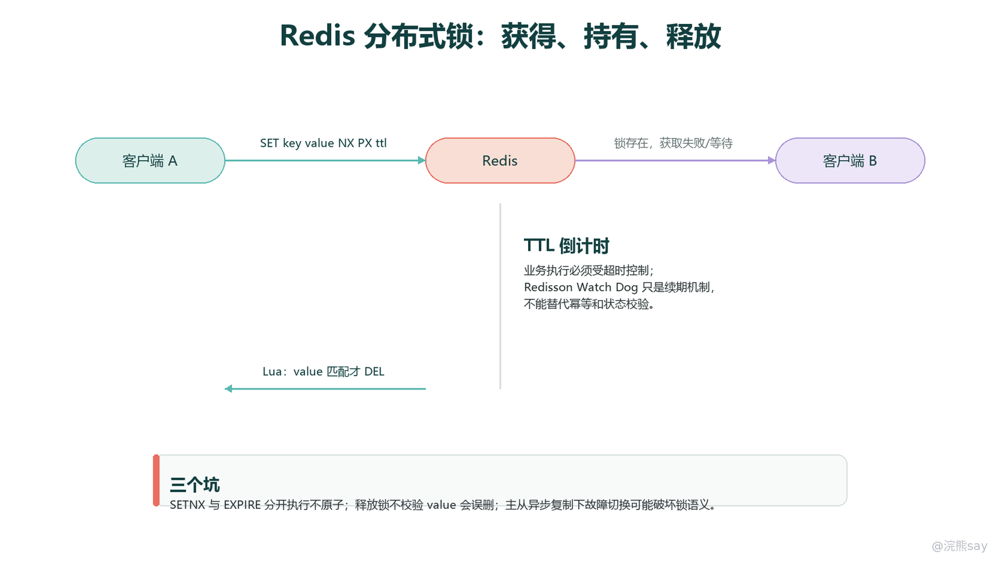

# 04 Redis分布式锁与缓存一致性

Redis 分布式锁是一种利用 Redis 的原子命令、过期时间和脚本执行能力来协调多节点并发访问的工程机制。它的目标不是把 Redis 变成强一致事务系统，而是在多个应用实例同时处理同一份业务资源时，尽量让同一时刻只有一个实例进入临界区。

在 Java 后端项目里，Redis 锁常见于防重复提交、定时任务抢占、库存扣减入口、优惠券领取、幂等处理和热点资源保护等场景。它真正要解决的问题不是“能不能加锁”，而是加锁是否原子、锁是否会永久残留、释放锁是否会误删别人、业务超时后会发生什么、主从切换是否会破坏互斥，以及最终结果是否仍由数据库约束和幂等设计兜底。

缓存一致性则是另一个高频问题。Redis 作为数据库前面的缓存层，读写性能很高，但缓存通常只是派生数据，数据库才是事实来源。因此缓存一致性讨论的重点不是让缓存和数据库在所有时刻完全同步，而是在可接受的延迟范围内减少脏读窗口，并通过重试、消息、binlog 订阅、TTL 和业务约束把异常情况收敛住。

## 一、Redis 分布式锁先解决什么问题

单机应用里可以用 synchronized、ReentrantLock 或本地队列控制并发，因为所有线程都在同一个 JVM 内，锁对象对所有线程可见。应用部署成多个实例后，本地锁只能约束本实例内的线程，无法约束其他机器上的请求。此时多个实例可能同时处理同一个订单、同一批库存、同一个用户操作或同一个定时任务分片，就需要一个所有实例都能访问的共享协调点。

Redis 锁的基本思路是：所有应用实例都尝试在 Redis 中写入同一个锁 key，谁成功写入，谁就被认为获得执行资格；没有拿到锁的实例等待、重试或快速失败。锁 key 需要设置过期时间，避免持锁客户端宕机后锁永远不释放；锁 value 需要带上唯一标识，避免锁过期后旧客户端误删新客户端的锁。

images/redis-13-分布式锁链路.png

这张图可以按照一条完整链路理解：客户端先以原子方式写入锁 key 和过期时间，执行业务时要保证业务本身可幂等，释放时必须校验锁 value，缓存更新时也不能把锁当成强一致事务边界。锁只是在并发入口处降低冲突概率，真正的数据正确性仍要落到数据库唯一约束、状态机流转、版本号、幂等表或消息去重上。

## 二、从 SETNX 到正确的加锁命令

早期 Redis 锁经常用 SETNX lockKey value 实现。SETNX 的含义是 key 不存在时才写入，写入成功返回 1，写入失败返回 0。这个命令可以表达“抢锁”，但单独使用它有一个严重问题：如果客户端拿到锁后宕机，锁 key 没有过期时间，其他客户端会一直拿不到锁。

一种看似自然的改进是：

SETNX lock:order:1001 requestId 
EXPIRE lock:order:1001 30

这个写法仍然不安全，因为 SETNX 和 EXPIRE 是两条命令，中间存在失败窗口。客户端可能在 SETNX 成功后、EXPIRE 执行前宕机或网络中断，结果是锁已经写入，但没有 TTL。这个问题本质上是加锁和设置过期时间不是原子操作。

正确的基础写法应使用 Redis 的 SET 扩展参数，把“仅不存在时写入”和“设置过期时间”放到同一条命令中：

SET lock:order:1001 requestId NX PX 30000

其中 NX 表示 key 不存在时才写入，PX 30000 表示 30000 毫秒后自动过期，也可以用 EX seconds 设置秒级过期时间。整条命令由 Redis 单线程原子执行，不会出现写入成功但没有过期时间的中间状态。

这里的 requestId 必须是当前加锁请求的唯一标识，通常可以使用 UUID、业务请求号加随机串，或者客户端实例 ID 加线程 ID 加递增序列。它不能写成固定值。因为分布式锁不只要判断 key 是否存在，还要在释放时确认“当前释放锁的人是不是当初持有锁的人”。

## 三、为什么释放锁必须用 Lua 校验 value

释放锁不能简单执行：

DEL lock:order:1001

假设客户端 A 获得锁，TTL 是 30 秒，但业务执行了 40 秒。第 30 秒锁自动过期，客户端 B 随后成功获得同一把锁。第 40 秒客户端 A 终于执行完业务，如果它直接 DEL lockKey，删除的其实已经是客户端 B 的锁。这会导致 B 在没有互斥保护的情况下继续执行业务，后续客户端 C 也可能再次进入临界区。

因此释放锁必须先比较 value，再删除 key，并且比较和删除要在 Redis 内部作为一个原子逻辑执行。常见 Lua 脚本如下：

if redis.call("get", KEYS\[1\]) == ARGV\[1\] then 
return redis.call("del", KEYS\[1\]) 
else 
return 0 
end

客户端调用脚本时，KEYS\[1\] 是锁 key，ARGV\[1\] 是自己加锁时写入的唯一 value。只有 value 匹配，才说明当前客户端仍然是这把锁的拥有者，才允许删除。使用 Lua 的原因是，如果先 GET 再 DEL，两条命令之间仍然可能发生锁过期和其他客户端重新加锁，问题没有消失。

工程上还要注意两个细节。第一，释放锁要放在 finally 块中，但 finally 只能保证当前进程正常执行到释放逻辑，不能解决进程崩溃、机器重启或长时间卡死。第二，释放失败不一定要无限重试，因为锁可能已经过期并被其他客户端获得，此时强行删除反而更危险。

## 四、锁过期但业务没完成怎么办

分布式锁一定要设置 TTL，但 TTL 本身也是风险来源。TTL 太短，业务还没执行完锁就过期，其他实例可能进入临界区；TTL 太长，持锁实例宕机后恢复时间变长，业务吞吐被拖慢。合理 TTL 通常要结合接口 P99 耗时、下游超时时间、重试次数、事务提交时间和偶发抖动来估算。

锁过期而业务未完成时，系统会进入一个非常典型的危险状态：Redis 层面认为锁已经释放，业务层面旧请求仍在执行。此时不能只依赖“把 TTL 调大”解决。TTL 调大只能降低概率，无法消除 JVM Stop-The-World、线程池阻塞、下游接口长时间不返回、网络分区、数据库锁等待等异常。

更稳妥的处理方式包括：
| 处理点 | 工程含义 |
| --- | --- |
| 控制业务耗时 | 临界区只包住必须互斥的短流程，不要把远程调用、人工审批、长事务都放进锁内 |
| 设置明确超时 | 下游 RPC、数据库操作、消息发送都要有超时，避免持锁线程无限等待 |
| 设计幂等 | 即使同一业务被执行两次，也能通过幂等号、唯一索引或状态机拒绝重复生效 |
| 使用版本校验 | 更新数据库时带版本号、状态条件或乐观锁，避免过期请求覆盖新结果 |
| 监控锁耗时 | 记录加锁等待时间、持锁时间、释放结果和续期失败，便于定位异常 |

也就是说，Redis 锁可以减少并发进入临界区的机会，但不能替代业务结果层面的防重。越是涉及资金、库存、订单状态和权益发放，越不能把正确性完全寄托在锁上。

## 五、Redisson Watch Dog 的工作机制

Redisson 是 Java 项目里常用的 Redis 客户端，它封装了 RLock、公平锁、读写锁、信号量等同步器。面试中提到 Redisson，重点通常不是背 API，而是讲清楚 Watch Dog 续期机制解决了什么问题，以及它不能解决什么问题。

当使用 lock.lock() 或没有显式指定 leaseTime 的加锁方式时，Redisson 会给锁设置一个默认的 lockWatchdogTimeout，常见默认值是 30 秒。加锁成功后，只要 Redisson 客户端实例认为持锁线程仍然有效，就会启动后台续期任务，周期性延长锁 key 的过期时间。常见实现会在超时时间的三分之一附近触发续期，例如默认 30 秒超时，大约每 10 秒尝试续期一次。

如果调用的是带明确租约时间的方法，例如 tryLock(waitTime, leaseTime, TimeUnit.SECONDS)，语义通常变为“锁最多持有 leaseTime，到期自动释放”，这类显式租约不再依赖 Watch Dog 无限续期。这样适合业务耗时可预估、希望锁到点释放的场景。

Watch Dog 的价值在于降低“业务正常执行但超过初始 TTL”的误释放概率。它的边界也很清楚：如果 Redisson 客户端进程崩溃，续期任务停止，锁会在 TTL 到期后释放；如果 JVM 长时间 STW、网络分区、Redis 不可达、主从切换或业务线程实际已经卡死，续期机制也无法保证强一致。更关键的是，Watch Dog 只能保护 Redis 锁 key 的存活，不能替数据库提交、外部系统调用和业务状态变化做原子协调。

## 六、Redisson 常见锁类型的边界

Redisson 提供了很多同步器，但准备面试时不要把它们讲成“用了 Redisson 就安全”。更好的表达是：Redisson 提供的是更易用的分布式同步抽象，不同锁类型解决不同并发组织方式，最终仍要结合业务幂等和数据约束。
| 类型 | 主要用途 | 需要注意的边界 |
| --- | --- | --- |
| 可重入锁 RLock | 同一线程重复进入同一临界区，内部通常用持有计数区分重入次数 | 必须由持锁线程释放，释放次数要与加锁次数匹配 |
| 公平锁 | 尽量按请求顺序获取锁，适合对饥饿敏感的场景 | 排队和通知会增加开销，吞吐通常低于普通锁 |
| 读写锁 | 读多写少场景下允许多个读并发，写操作互斥 | 适合共享资源读写协调，不适合替代数据库事务隔离 |
| 信号量 | 控制同时进入某类资源的并发数量，例如限量处理任务 | 需要处理许可泄漏，异常路径必须释放许可 |
| 闭锁/计数器类同步器 | 等待多个节点完成后再继续执行 | 更像流程协调，不适合承载强一致状态提交 |

这些工具可以提高开发效率，但它们仍建立在 Redis 可用性、网络连接、客户端续期和脚本执行之上。项目里选择哪一种锁，要先看业务是否真的需要互斥、互斥范围是否短、失败能否重试、结果是否幂等，而不是因为工具库提供了某个 API 就直接套用。

## 七、主从异步复制为什么会影响锁安全

Redis 主从复制默认是异步的。客户端在主节点加锁成功后，主节点还没来得及把锁 key 复制到从节点就宕机，此时从节点被提升为新主。新主上没有这把锁，另一个客户端就可能再次加锁成功。这样系统里会同时出现两个都认为自己持有锁的客户端。

这个问题说明 Redis 单主从架构下的锁并不具备严格的线性一致性。它适合用于效率型互斥和可补偿业务，不适合单独用于正确性要求极高的跨节点资源保护。如果锁失败会导致不可接受的错误，例如资金重复扣减、权益重复发放、库存严重超卖，就必须在数据库或更强一致的协调系统中增加约束。

常见兜底包括数据库唯一索引、业务流水号幂等表、状态机条件更新、乐观锁版本号、消息消费去重和最终对账。Redis 锁可以放在入口层减少并发压力，但最后一道门应该在事实数据层。

## 八、Redlock 的适用性和争议

Redlock 是 Redis 官方文档提出的一种多节点分布式锁算法。它的基本思想是准备多个相互独立的 Redis 主节点，客户端在有限时间内依次向这些节点尝试加锁，只有获得多数节点成功，并且总耗时小于锁有效期，才认为加锁成功。释放时则向所有节点发送释放脚本。

Redlock 相比单 Redis 实例锁，试图降低单点故障和主从异步复制带来的风险。但它也引入了更复杂的前提：多个 Redis 节点需要彼此独立，客户端需要合理处理超时和重试，需要依赖本地时间计算锁有效窗口，还要考虑网络延迟、进程暂停和时钟漂移。社区中也存在长期争议：如果锁用于效率优化，单实例锁通常已经足够；如果锁用于严格正确性，单靠 Redlock 仍然不如使用带共识能力的系统，或在数据库层使用更强约束。

因此比较稳妥的项目表达是：Redlock 可以作为 Redis 锁在多独立节点场景下提高容错能力的一种方案，但不能把它包装成强一致分布式事务。对正确性敏感的业务，应优先依赖数据库事务、唯一约束、状态条件更新、幂等表，或 ZooKeeper、etcd 等具备更强一致语义的协调组件。

## 九、分布式锁和数据库约束、幂等、状态机的关系

分布式锁解决的是并发进入问题，数据库约束解决的是最终落库正确性问题，幂等解决的是重复请求或重复消息问题，状态机解决的是业务流转合法性问题。这几个机制不是替代关系，而是分层防线。

以优惠券领取为例，Redis 锁可以让同一用户同一时间只有一个请求进入领取流程；数据库唯一索引可以保证同一用户同一券种只能插入一条记录；幂等号可以让客户端重试时返回同一结果；状态机可以限制券只能从“未领取”流转到“已领取”，不能重复领取或逆向流转。即使 Redis 锁因为过期、切换或网络问题失效，数据库和业务状态仍然能挡住重复生效。

在面试里，如果只说“我用 Redis 锁防止并发”，信息量是不够的。更好的说法是：Redis 锁放在入口处降低并发冲突，真正写库时仍用唯一索引或状态条件更新兜底；每次请求带幂等号，重复请求直接查询已有结果；异常失败通过消息补偿或对账修复。这样才能体现你理解锁的工程边界。

## 十、缓存一致性的基本模型：Cache Aside

Cache Aside，也叫旁路缓存模式，是 Java 后端最常见的缓存使用方式。读请求先查缓存，缓存命中就直接返回；缓存未命中再查数据库，并把数据库结果写回缓存。写请求以数据库为事实来源，先更新数据库，再删除缓存，让后续读请求重新加载新值。

读路径可以概括为：

读请求 -> 查询 Redis -> 命中则返回 
\-> 未命中则查询数据库 -> 写入 Redis -> 返回

写路径常见做法是：

写请求 -> 更新数据库 -> 删除 Redis 缓存

这里不推荐“更新数据库后直接更新缓存”作为默认方案，原因是缓存结构可能是聚合结果、列表页、详情页、统计值或多 key 冗余数据，写请求很难保证所有缓存都被同步更新。删除缓存让下一次读重新加载，通常更简单，也更符合“缓存是派生数据”的定位。

## 十一、为什么通常先更新数据库再删缓存

先更新数据库再删除缓存，是多数业务里的默认推荐顺序。它的优势在于数据库先成为新的事实来源，缓存随后失效，下一次读取会从数据库拿到新值并回填缓存。这个方案仍然可能有短暂不一致窗口，但窗口相对可控。

典型流程如下：

线程 A 更新数据库成功 
线程 A 删除缓存 
线程 B 读取缓存未命中 
线程 B 查询数据库得到新值 
线程 B 回填缓存

它的主要风险是删除缓存失败。如果数据库已经更新成功，但 Redis 删除失败，旧缓存会继续被读取，直到 TTL 到期或后续补偿删除成功。因此生产环境不能只写一句 delete cache 就结束，通常要把删除失败记录下来，通过重试队列、延迟消息、任务扫描或 binlog 订阅进行补偿。

另一个小概率风险是并发读写交错：某个读请求在写请求提交前读到旧数据库值，随后写请求提交并删除缓存，最后旧读请求把旧值回填缓存。这个窗口通常很窄，但在读请求很慢、数据库压力大或写请求频繁时仍可能出现。解决思路可以是延迟双删、读写互斥、缓存写入带版本校验，或者接受短暂不一致并依靠 TTL 收敛。

## 十二、先删缓存再更新数据库的问题

先删缓存再更新数据库的风险更明显。假设线程 A 要更新商品价格，它先删除缓存，还没来得及更新数据库；线程 B 此时读取商品价格，发现缓存未命中，于是查询数据库读到旧价格，并把旧价格写回缓存；随后线程 A 更新数据库成功。此时数据库是新价格，缓存却是旧价格，而且旧缓存会一直存在到 TTL 到期或下一次删除。

这个方案的问题在于，删除缓存打开了一个读请求回填旧值的窗口，而数据库更新还没有完成。除非配合额外控制，否则它比“先更新数据库再删缓存”更容易留下旧缓存。

延迟双删就是针对这个问题的补偿策略：先删缓存，再更新数据库，等待一小段时间后再次删除缓存。第二次删除的目的是清理并发读在中间窗口回填的旧值。但延迟时间很难精确选择，太短可能删不到旧回填，太长又会增加一致性窗口；而且它仍然依赖重试和异常处理，不能被理解为强一致方案。

因此项目里如果没有特殊原因，更常见、更容易解释的做法仍是先更新数据库再删除缓存，再配合删除失败重试和 TTL 兜底。延迟双删可以作为特定场景的补偿手段，而不是默认答案。

## 十三、删除失败、消息补偿和 binlog 订阅

缓存一致性真正难的地方不在正常流程，而在异常流程。数据库更新成功后，如果删除缓存失败，或者服务在删除缓存前宕机，就会留下旧缓存。工程上常见的补偿方式有三类。

第一类是应用内重试。删除失败后把 key、业务类型、重试次数和下一次执行时间写入本地可靠队列、数据库表或消息队列，由后台任务重试删除。这种方式实现简单，但要注意重试任务本身不能只放在内存里，否则服务重启后补偿记录会丢失。

第二类是消息队列补偿。写库成功后发送缓存失效消息，由消费者异步删除缓存。它适合多个服务共同维护缓存的场景，但要处理消息重复、乱序和消费失败。消费者删除缓存要幂等，因为同一个 key 被删除多次是可以接受的。

第三类是订阅数据库 binlog。系统通过 Canal、Debezium 等组件监听数据库变更日志，根据表名、主键和字段变化删除或更新对应缓存。这种方式能降低业务代码侵入，适合缓存 key 规则清晰、数据变更来源较多的系统。但它增加了链路复杂度，也会带来日志解析延迟、规则维护和补偿任务治理问题。

无论使用哪一种方式，TTL 都应该作为最后兜底。缓存不设置过期时间，一旦删除失败就可能长期污染读请求；TTL 设置过短又会增加数据库压力。实际项目要根据数据变化频率、读流量、可接受不一致时间和数据库承载能力折中。

## 十四、强一致场景为什么不能只靠缓存

缓存天然适合提升读性能，不适合作为强一致事实来源。Redis 本身很快，但快不等于强一致。缓存和数据库之间至少隔着应用逻辑、网络、事务提交、缓存删除、消息补偿等多个步骤，只要这些步骤不是同一个强事务，就一定存在不一致窗口。

对强一致要求高的业务，应该先判断一致性目标是什么。如果目标是“不能重复发放权益”，优先用数据库唯一索引、幂等表和状态机条件更新；如果目标是“库存不能超卖”，优先使用数据库行锁、乐观锁、库存流水或预扣模型；如果目标是“资金不能重复扣减”，要依赖账户流水、事务、对账和幂等，而不是依赖缓存是否及时删除。

Redis 可以参与这些系统，例如作为热点库存的预扣层、作为读缓存、作为幂等号短期去重缓存、作为锁入口。但它不应该是唯一防线。一个成熟回答应该把缓存一致性说成“性能层的一致性治理”，而不是“缓存和数据库永远强一致”。

## 十五、常见面试追问
| 问题 | 回答要点 |
| --- | --- |
| 为什么 SETNX 后再 EXPIRE 不安全？ | 两条命令不是原子操作，客户端可能在中间宕机，导致锁没有过期时间 |
| 为什么加锁 value 要唯一？ | 释放锁时要确认持锁者身份，避免旧客户端删除新客户端的锁 |
| 为什么释放锁要用 Lua？ | 比较 value 和删除 key 必须原子执行，避免 GET 和 DEL 之间发生并发变化 |
| 锁过期但业务没执行完怎么办？ | 可能出现多个客户端进入临界区，要控制 TTL、缩短临界区、使用续期，并在业务层做幂等和状态校验 |
| Redisson Watch Dog 做了什么？ | 未显式指定租约时间时，后台定期延长锁 TTL，避免正常长业务提前过期 |
| Watch Dog 能保证绝对安全吗？ | 不能。进程崩溃、长时间 STW、网络分区、Redis 切换等仍可能破坏互斥，要有业务兜底 |
| Redis 主从切换为什么影响锁？ | 主从异步复制下，锁可能还没同步到从节点主节点就宕机，新主缺少锁记录，其他客户端可再次加锁 |
| Redlock 是不是强一致锁？ | 不是强一致事务方案。它提高多独立 Redis 节点下的容错能力，但仍有时间、网络和进程暂停等边界 |
| 缓存更新为什么常用删除而不是更新？ | 缓存可能是派生结构或多 key 冗余，删除后按需重建更简单，避免多处同步更新遗漏 |
| 为什么通常先更新数据库再删缓存？ | 数据库先成为事实来源，再让缓存失效；删除失败可通过重试、消息和 TTL 补偿 |
| 延迟双删解决什么？ | 主要清理“先删缓存后更新数据库”过程中并发读回填的旧缓存，但不是强一致保证 |
| 强一致场景能只靠 Redis 吗？ | 不能。必须回到数据库约束、事务、状态机、幂等、对账或强一致协调系统 |

## 十六、项目表达模板

如果项目里使用过 Redis 分布式锁，可以这样表达：

我们在这个项目里没有把 Redis 锁当成强一致事务，而是把它放在并发入口处降低冲突。 
加锁使用 SET key value NX PX ttl，value 是请求级唯一标识；释放锁用 Lua 先校验 value 再删除，避免锁过期后误删其他线程的锁。 
锁的 TTL 按接口 P99 耗时和下游超时估算，关键链路会记录持锁时间和释放结果。 
同时数据库层还有唯一索引、状态条件更新或幂等表兜底，所以即使出现锁过期、主从切换或重复请求，也不会让业务结果重复生效。

如果项目里处理过缓存一致性，可以这样表达：

我们的缓存采用 Cache Aside 模式，读请求先查 Redis，未命中再查数据库并回填；写请求以数据库为准，先提交数据库，再删除缓存。 
删除缓存失败不会静默忽略，会进入重试或消息补偿链路；部分核心表还可以通过 binlog 订阅异步删除相关缓存。 
缓存 key 都设置 TTL 作为兜底，强一致要求高的结果不依赖缓存判断，而是依赖数据库事务、唯一约束、状态机和幂等设计。

这类表达的重点是把“工具怎么用”和“失败后怎么办”一起讲出来。只说用了 Redis 锁或删了缓存，容易被继续追问；能把原子性、误删、续期、主从切换、删除失败、TTL 和数据库兜底串起来，才是比较完整的工程答案。

## 十七、本章准备标准

准备 Redis 分布式锁时，至少要能独立讲清楚三条链路：加锁链路是 SET NX PX value，释放链路是 Lua 校验 value 后删除，异常链路是 TTL、续期、主从切换和业务幂等兜底。不要把锁讲成“只要加了就不会并发”，也不要把 Redisson 或 Redlock 讲成强一致事务方案。

准备缓存一致性时，至少要能讲清楚 Cache Aside 的读写路径，知道为什么常用“先更新数据库再删缓存”，知道“先删缓存再更新数据库”的旧值回填风险，并能说出删除失败重试、消息或 binlog 补偿、TTL 兜底和强一致场景回到数据库约束的原因。
